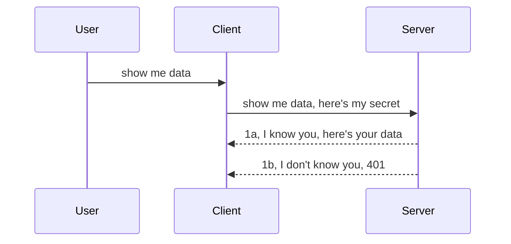

# Simple auth

MCP SDKs support the use of OAuth 2.1 which to be fair is a pretty involved process involving concepts like auth server, resource server, posting credentials, getting a code, exhanging the code for a bearer token until you can finally get your resource data. If you're unused to OAuth which is a great thing to implement, it's a good idea to start with some basic level of auth and build up to better and better security. 

## Auth, what do we mean?

Auth is short for authentication and authorization. The idea is that we need to do two things:

- **Authentication**, which is the process of figuring out whether we let a person enter our house, that they have the right to be "here" that is have access to our resource server where our MCP Server features live.
- **Authorization**, is the process of finding out if a user should have access to these specific resources they're asking for for example these orders or these products or whether they're allowed to read the content but not delete as another example.

## Token: how we tell the system who we are

Well, most web developers out there start thinking in terms of providing a credential to the server, usually a secret that says if they're allowed to be here "Authentication". 

This involves sending it via a header called "Authorization" like so:

```json
{ "Authorization": "secret123" }
```

This is usually referred to as basic authentication. How the overall flow then works is in the following way:



Now that we understand how it works from a flow standpoint, how do we implement it? Well, most web servers have a concept called middleware, a piece of code that runs as part of the request that can verify credentials, and if credentials are valid can let the request pass through. If the request doesn't have valid credentials then you get an auth error. Let's see how this can be implemented:

**Python**

```python
class CustomHeaderMiddleware(BaseHTTPMiddleware):
    async def dispatch(self, request, call_next):

        has_header = request.headers.get("Authorization")
        if not has_header:
            print("-> Missing Authorization header!")
            return Response(status_code=401, content="Unauthorized")

        if not valid_token(has_header):
            print("-> Invalid token!")
            return Response(status_code=403, content="Forbidden")

        print("Valid token, proceeding...")
       
        response = await call_next(request)
        # add any customer headers or change in the response in some way
        return response


starlette_app.add_middleware(CustomHeaderMiddleware)
```

Here we have: 

- Created a middleware called `CustomHeaderMiddleware` where its `dispatch` method is being invoked by the web server. 
- Added the middleware to the web server:

    ```python
    starlette_app.add_middleware(CustomHeaderMiddleware)
    ```

- Written validation logic that checks if Authorization header is present and if the secret being sent is valid:

    ```python
    has_header = request.headers.get("Authorization")
    if not has_header:
        print("-> Missing Authorization header!")
        return Response(status_code=401, content="Unauthorized")

    if not valid_token(has_header):
        print("-> Invalid token!")
        return Response(status_code=403, content="Forbidden")
    ```

    if the secret is present and valid then we let the request pass through by calling `call_next` and return the response.

    ```python
    response = await call_next(request)
    # add any customer headers or change in the response in some way
    return response
    ```

How it works is that if a web request are made towards the server the middleware will be invoked and given its implementation it will either let the request pass through or end up returning an error that indicates the client isn't allowed to proceed.

**TypeScript**

It's a similar idea in TypeScript, here we use a middleware with the popular framework Express and intercept the request before it reaches the MCP Server. Here's the code for that:

```typescript
function isValid(secret) {
    return secret === "secret123";
}

app.use((req, res, next) => {
    if(!req.headers["Authorization"]) {
        res.status(401).send('Unauthorized');
    }
    
    let token = req.headers["Authorization"];

    if(!isValid(token)) {
        res.status(403).send('Forbidden');
    }

    console.log('Middleware executed');
    next();
});
```

## Exercise: Implement authentication

- Server: Create a web server and MCP instance.
- Server: Implement a middleware for the server.
- Client: Send web request with credential via header.

### -1- Create a web server and MCP instance

**Python**

```python
```

**TypeScript**

```typescript
```

### -2- Implement a middleware for the server

**Python**

```python
```

**TypeScript**

```typescript
```

### -3- Send web request with credential via header

**Python**

```python
```

**TypeScript**

```typescript
```

## JSON Web Tokens, JWT

The same token could also tells what permissions this person has interacting with us. A common format for this is JSON Web Tokens (JWT) coloqually referred to as "Jot" tokens. What do these tokens look like then?

## Exercise: support JWT


## Role based access control, RBAC

## Exercise: Implement authorization

## Improve our security posture

## Assignment

## Summary
