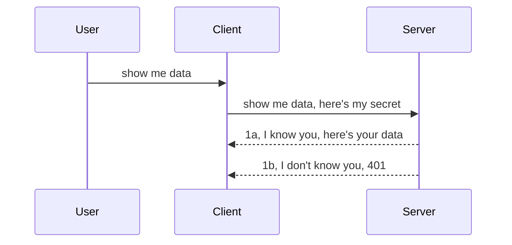

# Simple auth

MCP SDKs support the use of OAuth 2.1 which to be fair is a pretty involved process involving concepts like auth server, resource server, posting credentials, getting a code, exhanging the code for a bearer token until you can finally get your resource data. If you're unused to OAuth which is a great thing to implement, it's a good idea to start with some basic level of auth and build up to better and better security. 

## Auth, what do we mean?

Auth is short for authentication and authorization. The idea is that we need to do two things:

- **Authentication**, which is the process of figuring out whether we let a person enter our house, that they have the right to be "here" that is have access to our resource server where our MCP Server features live.
- **Authorization**, is the process of finding out if a user should have access to these specific resources they're asking for for example these orders or these products or whether they're allowed to read the content but not delete as another example.

## Token: how we tell the system who we are

Well, most web developers out there start thinking in terms of providing a credential to the server, usually a secret that says if they're allowed to be here "Authentication". 

This involves sending it via a header called "Authorization" like so:

```json
{ "Authorization": "secret123" }
```

This is usually referred to as basic authentication. How the overall flow then works is in the following way:



Now that we understand how it works from a flow standpoint, how do we implement it? Well, most web servers have a concept called middleware, a piece of code that runs as part of the request that can verify credentials, and if credentials are valid can let the request pass through. If the request doesn't have valid credentials then you get an auth error. Let's see how this can be implemented:

**Python**

```python
class CustomHeaderMiddleware(BaseHTTPMiddleware):
    async def dispatch(self, request, call_next):

        has_header = request.headers.get("Authorization")
        if not has_header:
            print("-> Missing Authorization header!")
            return Response(status_code=401, content="Unauthorized")

        if not valid_token(has_header):
            print("-> Invalid token!")
            return Response(status_code=403, content="Forbidden")

        print("Valid token, proceeding...")
       
        response = await call_next(request)
        # add any customer headers or change in the response in some way
        return response


starlette_app.add_middleware(CustomHeaderMiddleware)
```

Here we have: 

- Created a middleware called `CustomHeaderMiddleware` where its `dispatch` method is being invoked by the web server. 
- Added the middleware to the web server:

    ```python
    starlette_app.add_middleware(CustomHeaderMiddleware)
    ```

- Written validation logic that checks if Authorization header is present and if the secret being sent is valid:

    ```python
    has_header = request.headers.get("Authorization")
    if not has_header:
        print("-> Missing Authorization header!")
        return Response(status_code=401, content="Unauthorized")

    if not valid_token(has_header):
        print("-> Invalid token!")
        return Response(status_code=403, content="Forbidden")
    ```

    if the secret is present and valid then we let the request pass through by calling `call_next` and return the response.

    ```python
    response = await call_next(request)
    # add any customer headers or change in the response in some way
    return response
    ```

How it works is that if a web request are made towards the server the middleware will be invoked and given its implementation it will either let the request pass through or end up returning an error that indicates the client isn't allowed to proceed.

**TypeScript**

It's a similar idea in TypeScript, here we use a middleware with the popular framework Express and intercept the request before it reaches the MCP Server. Here's the code for that:

```typescript
function isValid(secret) {
    return secret === "secret123";
}

app.use((req, res, next) => {
    if(!req.headers["Authorization"]) {
        res.status(401).send('Unauthorized');
    }
    
    let token = req.headers["Authorization"];

    if(!isValid(token)) {
        res.status(403).send('Forbidden');
    }

    console.log('Middleware executed');
    next();
});
```

## Exercise: Implement authentication

- Server: Create a web server and MCP instance.
- Server: Implement a middleware for the server.
- Client: Send web request with credential via header.

### -1- Create a web server and MCP instance

**Python**

Here we create an MCP server instance, create a starlette web app and host it with uvicorn.

```python
# creating MCP Server

app = FastMCP(
    name="MCP Resource Server",
    instructions="Resource Server that validates tokens via Authorization Server introspection",
    host=settings["host"],
    port=settings["port"],
    debug=True
)

# creating starlette web app
starlette_app = app.streamable_http_app()

# serving app via uvicorn
async def run(starlette_app):
    import uvicorn
    config = uvicorn.Config(
            starlette_app,
            host=app.settings.host,
            port=app.settings.port,
            log_level=app.settings.log_level.lower(),
        )
    server = uvicorn.Server(config)
    await server.serve()

run(starlette_app)
```

**TypeScript**

Here we create an MCP Server instance.

```typescript
const server = new McpServer({
      name: "example-server",
      version: "1.0.0"
    });

    // ... set up server resources, tools, and prompts ...
```

In the below code, we create a web server using Express, an MCP Server instance that we showed above. This is the standard way of defining a streamable MCP app.

```typescript
import express from "express";
import { randomUUID } from "node:crypto";
import { McpServer } from "@modelcontextprotocol/sdk/server/mcp.js";
import { StreamableHTTPServerTransport } from "@modelcontextprotocol/sdk/server/streamableHttp.js";
import { isInitializeRequest } from "@modelcontextprotocol/sdk/types.js"

const app = express();
app.use(express.json());

// Map to store transports by session ID
const transports: { [sessionId: string]: StreamableHTTPServerTransport } = {};

// Handle POST requests for client-to-server communication
app.post('/mcp', async (req, res) => {
  // Check for existing session ID
  const sessionId = req.headers['mcp-session-id'] as string | undefined;
  let transport: StreamableHTTPServerTransport;

  if (sessionId && transports[sessionId]) {
    // Reuse existing transport
    transport = transports[sessionId];
  } else if (!sessionId && isInitializeRequest(req.body)) {
    // New initialization request
    transport = new StreamableHTTPServerTransport({
      sessionIdGenerator: () => randomUUID(),
      onsessioninitialized: (sessionId) => {
        // Store the transport by session ID
        transports[sessionId] = transport;
      },
      // DNS rebinding protection is disabled by default for backwards compatibility. If you are running this server
      // locally, make sure to set:
      // enableDnsRebindingProtection: true,
      // allowedHosts: ['127.0.0.1'],
    });

    // Clean up transport when closed
    transport.onclose = () => {
      if (transport.sessionId) {
        delete transports[transport.sessionId];
      }
    };
    const server = new McpServer({
      name: "example-server",
      version: "1.0.0"
    });

    // ... set up server resources, tools, and prompts ...

    // Connect to the MCP server
    await server.connect(transport);
  } else {
    // Invalid request
    res.status(400).json({
      jsonrpc: '2.0',
      error: {
        code: -32000,
        message: 'Bad Request: No valid session ID provided',
      },
      id: null,
    });
    return;
  }

  // Handle the request
  await transport.handleRequest(req, res, req.body);
});

// Reusable handler for GET and DELETE requests
const handleSessionRequest = async (req: express.Request, res: express.Response) => {
  const sessionId = req.headers['mcp-session-id'] as string | undefined;
  if (!sessionId || !transports[sessionId]) {
    res.status(400).send('Invalid or missing session ID');
    return;
  }
  
  const transport = transports[sessionId];
  await transport.handleRequest(req, res);
};

// Handle GET requests for server-to-client notifications via SSE
app.get('/mcp', handleSessionRequest);

// Handle DELETE requests for session termination
app.delete('/mcp', handleSessionRequest);

app.listen(3000);
```

### -2- Implement a middleware for the server

Let's get to the middleware portion next. Here we will create a middleware that looks for a credential in the `Authorization` header and validate it. If it's acceptable then the request will move on to do what it needs (e.g list tools, read a resource or whatever MCP functionality the client was asking for).

**Python**

To create the middleware, we need to create a class that inherits from `BaseHTTPMiddleware`. There's two interesting pieces:

- The request `request` , that we read the header info from.
- `call_next` the callback we need to invoke if the client have brought a credential we accept.

First, we need to handle the case if the `Authorization` header is missing:

```python
 has_header = request.headers.get("Authorization")
if not has_header:
    print("-> Missing Authorization header!")
    return Response(status_code=401, content="Unauthorized")
```

Here we send a 401 unauthorized message as the client is failing authentication.

Next, if a credential was submitted, we need to check its validity like so:

```python
 if not valid_token(has_header):
    print("-> Invalid token!")
    return Response(status_code=403, content="Forbidden")
```

Note how we send a 403 forbidden message.

```python
class AuthMiddleware(BaseHTTPMiddleware):
    async def dispatch(self, request, call_next):

        has_header = request.headers.get("Authorization")
        if not has_header:
            print("-> Missing Authorization header!")
            return Response(status_code=401, content="Unauthorized")

        if not valid_token(has_header):
            print("-> Invalid token!")
            return Response(status_code=403, content="Forbidden")

        print("Valid token, proceeding...")
        print(f"-> Received {request.method} {request.url}")
        response = await call_next(request)
        response.headers['Custom'] = 'Example'
        return response

```

Here's our validation method, that has a very simple validation that you should obviously improve:

```python
# DON'T use for production - improve it !!
def valid_token(token: str) -> bool:
    # remove the "Bearer " prefix
    if token.startswith("Bearer "):
        token = token[7:]
        return token == "secret-token"
    return False
```

**TypeScript**

To implement this with Express, we need to call the `use` method that takes middleware functions.

We need to:

- Interact with the request `req` to check the passed credential in the `Authorization` property.
- Validate the credential, and if so let the request continue and have the client's MCP request do what it should (e.g list tools, read resource or anything other MCP related).

```typescript
app.use((req, res, next) => {
    console.log('Request received:', req.method, req.url, req.headers);
    console.log('Headers:', req.headers["authorization"]);
    if(!req.headers["authorization"]) {
        res.status(401).send('Unauthorized');
        return;
    }
    
    let token = req.headers["authorization"];

    if(!isValid(token)) {
        res.status(403).send('Forbidden');
        return;
    }  

    console.log('Middleware executed');
    next();
});
```

Now, we have set up the web server to accept a middleware to check the credential the client is hopefully sending us. What about the client itself?

### -3- Send web request with credential via header

**Python**

```python
```

**TypeScript**

```typescript
```

## JSON Web Tokens, JWT

The same token could also tells what permissions this person has interacting with us. A common format for this is JSON Web Tokens (JWT) coloqually referred to as "Jot" tokens. What do these tokens look like then?

## Exercise: support JWT


## Role based access control, RBAC

## Exercise: Implement authorization

## Improve our security posture

## Assignment

## Summary
