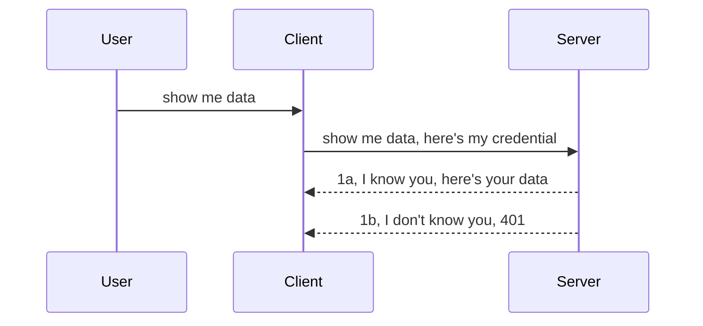

<!--
CO_OP_TRANSLATOR_METADATA:
{
  "original_hash": "5b00b8a8971a07d2d8803be4c9f138f8",
  "translation_date": "2025-10-07T00:32:33+00:00",
  "source_file": "03-GettingStarted/11-simple-auth/README.md",
  "language_code": "ar"
}
-->
# المصادقة البسيطة

تدعم حزم تطوير MCP استخدام OAuth 2.1، وهو عملية معقدة تتضمن مفاهيم مثل خادم المصادقة، خادم الموارد، إرسال بيانات الاعتماد، الحصول على رمز، تبادل الرمز للحصول على رمز حامل، حتى تتمكن أخيرًا من الوصول إلى بيانات الموارد الخاصة بك. إذا كنت غير معتاد على OAuth، وهو أمر رائع للتنفيذ، فمن الجيد أن تبدأ بمستوى أساسي من المصادقة وتبني تدريجيًا نحو أمان أفضل. لهذا السبب توجد هذه الفصل، لمساعدتك على الانتقال إلى مصادقة أكثر تقدمًا.

## ما المقصود بالمصادقة؟

المصادقة هي اختصار لكلمتي "Authentication" و"Authorization". الفكرة هي أننا بحاجة إلى القيام بأمرين:

- **Authentication**: وهي عملية تحديد ما إذا كان يجب السماح لشخص بالدخول إلى منزلنا، أي التأكد من أن لديه الحق في أن يكون "هنا"، أي الوصول إلى خادم الموارد حيث توجد ميزات خادم MCP.
- **Authorization**: وهي عملية تحديد ما إذا كان يجب أن يحصل المستخدم على حق الوصول إلى الموارد المحددة التي يطلبها، مثل الطلبات أو المنتجات، أو ما إذا كان مسموحًا له بقراءة المحتوى فقط دون الحذف كمثال آخر.

## بيانات الاعتماد: كيف نخبر النظام من نحن

عادةً ما يبدأ معظم مطوري الويب بالتفكير في تقديم بيانات اعتماد إلى الخادم، عادةً ما تكون سرًا يحدد ما إذا كان مسموحًا لهم بالتواجد هنا "المصادقة". عادةً ما تكون هذه البيانات عبارة عن نسخة مشفرة بتنسيق base64 من اسم المستخدم وكلمة المرور أو مفتاح API يحدد مستخدمًا معينًا بشكل فريد.

يتضمن ذلك إرسالها عبر رأس يسمى "Authorization" كما يلي:

```json
{ "Authorization": "secret123" }
```

يُشار إلى هذا عادةً باسم المصادقة الأساسية. كيف تعمل العملية بشكل عام هو كما يلي:



الآن بعد أن فهمنا كيف تعمل من منظور التدفق، كيف يمكننا تنفيذها؟ حسنًا، معظم خوادم الويب لديها مفهوم يسمى "middleware"، وهو قطعة من الكود تعمل كجزء من الطلب ويمكنها التحقق من صحة بيانات الاعتماد، وإذا كانت البيانات صحيحة، يمكنها السماح للطلب بالمرور. إذا لم يكن الطلب يحتوي على بيانات اعتماد صحيحة، فستحصل على خطأ في المصادقة. لنرى كيف يمكن تنفيذ ذلك:

**Python**

```python
class AuthMiddleware(BaseHTTPMiddleware):
    async def dispatch(self, request, call_next):

        has_header = request.headers.get("Authorization")
        if not has_header:
            print("-> Missing Authorization header!")
            return Response(status_code=401, content="Unauthorized")

        if not valid_token(has_header):
            print("-> Invalid token!")
            return Response(status_code=403, content="Forbidden")

        print("Valid token, proceeding...")
       
        response = await call_next(request)
        # add any customer headers or change in the response in some way
        return response


starlette_app.add_middleware(CustomHeaderMiddleware)
```

هنا قمنا بـ:

- إنشاء "middleware" يسمى `AuthMiddleware` حيث يتم استدعاء طريقة `dispatch` بواسطة خادم الويب.
- إضافة "middleware" إلى خادم الويب:

    ```python
    starlette_app.add_middleware(AuthMiddleware)
    ```

- كتابة منطق التحقق الذي يتحقق مما إذا كان رأس Authorization موجودًا وإذا كانت البيانات السرية المرسلة صالحة:

    ```python
    has_header = request.headers.get("Authorization")
    if not has_header:
        print("-> Missing Authorization header!")
        return Response(status_code=401, content="Unauthorized")

    if not valid_token(has_header):
        print("-> Invalid token!")
        return Response(status_code=403, content="Forbidden")
    ```

    إذا كانت البيانات السرية موجودة وصحيحة، فإننا نسمح للطلب بالمرور عن طريق استدعاء `call_next` وإرجاع الاستجابة.

    ```python
    response = await call_next(request)
    # add any customer headers or change in the response in some way
    return response
    ```

كيف يعمل هذا هو أنه إذا تم تقديم طلب ويب إلى الخادم، فسيتم استدعاء "middleware"، وبناءً على تنفيذه، إما أن يسمح للطلب بالمرور أو ينتهي بإرجاع خطأ يشير إلى أن العميل غير مسموح له بالمتابعة.

**TypeScript**

هنا نقوم بإنشاء "middleware" باستخدام إطار العمل الشهير Express ونعترض الطلب قبل أن يصل إلى خادم MCP. إليك الكود لذلك:

```typescript
function isValid(secret) {
    return secret === "secret123";
}

app.use((req, res, next) => {
    // 1. Authorization header present?  
    if(!req.headers["Authorization"]) {
        res.status(401).send('Unauthorized');
    }
    
    let token = req.headers["Authorization"];

    // 2. Check validity.
    if(!isValid(token)) {
        res.status(403).send('Forbidden');
    }

   
    console.log('Middleware executed');
    // 3. Passes request to the next step in the request pipeline.
    next();
});
```

في هذا الكود قمنا بـ:

1. التحقق مما إذا كان رأس Authorization موجودًا في المقام الأول، وإذا لم يكن كذلك، نرسل خطأ 401.
2. التأكد من أن بيانات الاعتماد/الرمز صالحة، وإذا لم تكن كذلك، نرسل خطأ 403.
3. أخيرًا، نمرر الطلب في خط الأنابيب ونرجع المورد المطلوب.

## تمرين: تنفيذ المصادقة

لنأخذ معرفتنا ونحاول تنفيذها. إليك الخطة:

الخادم

- إنشاء خادم ويب ومثيل MCP.
- تنفيذ "middleware" للخادم.

العميل 

- إرسال طلب ويب، مع بيانات الاعتماد، عبر الرأس.

### -1- إنشاء خادم ويب ومثيل MCP

في الخطوة الأولى، نحتاج إلى إنشاء مثيل خادم الويب وخادم MCP.

**Python**

هنا نقوم بإنشاء مثيل خادم MCP، وإنشاء تطبيق ويب starlette واستضافته باستخدام uvicorn.

```python
# creating MCP Server

app = FastMCP(
    name="MCP Resource Server",
    instructions="Resource Server that validates tokens via Authorization Server introspection",
    host=settings["host"],
    port=settings["port"],
    debug=True
)

# creating starlette web app
starlette_app = app.streamable_http_app()

# serving app via uvicorn
async def run(starlette_app):
    import uvicorn
    config = uvicorn.Config(
            starlette_app,
            host=app.settings.host,
            port=app.settings.port,
            log_level=app.settings.log_level.lower(),
        )
    server = uvicorn.Server(config)
    await server.serve()

run(starlette_app)
```

في هذا الكود قمنا بـ:

- إنشاء خادم MCP.
- بناء تطبيق ويب starlette من خادم MCP باستخدام `app.streamable_http_app()`.
- استضافة وتشغيل تطبيق الويب باستخدام uvicorn `server.serve()`.

**TypeScript**

هنا نقوم بإنشاء مثيل خادم MCP.

```typescript
const server = new McpServer({
      name: "example-server",
      version: "1.0.0"
    });

    // ... set up server resources, tools, and prompts ...
```

يجب أن يتم إنشاء خادم MCP هذا داخل تعريف المسار POST /mcp، لذا دعنا ننقل الكود أعلاه كما يلي:

```typescript
import express from "express";
import { randomUUID } from "node:crypto";
import { McpServer } from "@modelcontextprotocol/sdk/server/mcp.js";
import { StreamableHTTPServerTransport } from "@modelcontextprotocol/sdk/server/streamableHttp.js";
import { isInitializeRequest } from "@modelcontextprotocol/sdk/types.js"

const app = express();
app.use(express.json());

// Map to store transports by session ID
const transports: { [sessionId: string]: StreamableHTTPServerTransport } = {};

// Handle POST requests for client-to-server communication
app.post('/mcp', async (req, res) => {
  // Check for existing session ID
  const sessionId = req.headers['mcp-session-id'] as string | undefined;
  let transport: StreamableHTTPServerTransport;

  if (sessionId && transports[sessionId]) {
    // Reuse existing transport
    transport = transports[sessionId];
  } else if (!sessionId && isInitializeRequest(req.body)) {
    // New initialization request
    transport = new StreamableHTTPServerTransport({
      sessionIdGenerator: () => randomUUID(),
      onsessioninitialized: (sessionId) => {
        // Store the transport by session ID
        transports[sessionId] = transport;
      },
      // DNS rebinding protection is disabled by default for backwards compatibility. If you are running this server
      // locally, make sure to set:
      // enableDnsRebindingProtection: true,
      // allowedHosts: ['127.0.0.1'],
    });

    // Clean up transport when closed
    transport.onclose = () => {
      if (transport.sessionId) {
        delete transports[transport.sessionId];
      }
    };
    const server = new McpServer({
      name: "example-server",
      version: "1.0.0"
    });

    // ... set up server resources, tools, and prompts ...

    // Connect to the MCP server
    await server.connect(transport);
  } else {
    // Invalid request
    res.status(400).json({
      jsonrpc: '2.0',
      error: {
        code: -32000,
        message: 'Bad Request: No valid session ID provided',
      },
      id: null,
    });
    return;
  }

  // Handle the request
  await transport.handleRequest(req, res, req.body);
});

// Reusable handler for GET and DELETE requests
const handleSessionRequest = async (req: express.Request, res: express.Response) => {
  const sessionId = req.headers['mcp-session-id'] as string | undefined;
  if (!sessionId || !transports[sessionId]) {
    res.status(400).send('Invalid or missing session ID');
    return;
  }
  
  const transport = transports[sessionId];
  await transport.handleRequest(req, res);
};

// Handle GET requests for server-to-client notifications via SSE
app.get('/mcp', handleSessionRequest);

// Handle DELETE requests for session termination
app.delete('/mcp', handleSessionRequest);

app.listen(3000);
```

الآن ترى كيف تم نقل إنشاء خادم MCP داخل `app.post("/mcp")`.

لننتقل إلى الخطوة التالية لإنشاء "middleware" حتى نتمكن من التحقق من صحة بيانات الاعتماد الواردة.

### -2- تنفيذ "middleware" للخادم

لننتقل إلى جزء "middleware" التالي. هنا سنقوم بإنشاء "middleware" يبحث عن بيانات الاعتماد في رأس `Authorization` ويقوم بالتحقق منها. إذا كانت مقبولة، فإن الطلب سيستمر في القيام بما يحتاج إليه (مثل عرض الأدوات، قراءة المورد أو أي وظيفة MCP يطلبها العميل).

**Python**

لإنشاء "middleware"، نحتاج إلى إنشاء فئة ترث من `BaseHTTPMiddleware`. هناك جزئين مثيرين للاهتمام:

- الطلب `request`، الذي نقرأ منه معلومات الرأس.
- `call_next`، الاستدعاء الذي نحتاج إلى تنفيذه إذا كان العميل قد قدم بيانات اعتماد نقبلها.

أولاً، نحتاج إلى التعامل مع الحالة إذا كان رأس `Authorization` مفقودًا:

```python
has_header = request.headers.get("Authorization")

# no header present, fail with 401, otherwise move on.
if not has_header:
    print("-> Missing Authorization header!")
    return Response(status_code=401, content="Unauthorized")
```

هنا نرسل رسالة 401 غير مصرح بها لأن العميل يفشل في المصادقة.

بعد ذلك، إذا تم تقديم بيانات اعتماد، نحتاج إلى التحقق من صحتها كما يلي:

```python
 if not valid_token(has_header):
    print("-> Invalid token!")
    return Response(status_code=403, content="Forbidden")
```

لاحظ كيف نرسل رسالة 403 ممنوع أعلاه. لنرى "middleware" الكامل أدناه الذي ينفذ كل ما ذكرناه أعلاه:

```python
class AuthMiddleware(BaseHTTPMiddleware):
    async def dispatch(self, request, call_next):

        has_header = request.headers.get("Authorization")
        if not has_header:
            print("-> Missing Authorization header!")
            return Response(status_code=401, content="Unauthorized")

        if not valid_token(has_header):
            print("-> Invalid token!")
            return Response(status_code=403, content="Forbidden")

        print("Valid token, proceeding...")
        print(f"-> Received {request.method} {request.url}")
        response = await call_next(request)
        response.headers['Custom'] = 'Example'
        return response

```

رائع، ولكن ماذا عن وظيفة `valid_token`؟ ها هي أدناه:

```python
# DON'T use for production - improve it !!
def valid_token(token: str) -> bool:
    # remove the "Bearer " prefix
    if token.startswith("Bearer "):
        token = token[7:]
        return token == "secret-token"
    return False
```

يجب تحسين هذا بالطبع.

مهم: يجب ألا تحتوي الكود أبدًا على أسرار مثل هذه. يجب عليك استرداد القيمة للمقارنة من مصدر بيانات أو من مزود خدمة الهوية (IDP) أو الأفضل من ذلك، دع IDP يقوم بالتحقق.

**TypeScript**

لتنفيذ ذلك باستخدام Express، نحتاج إلى استدعاء طريقة `use` التي تأخذ وظائف "middleware".

نحتاج إلى:

- التفاعل مع متغير الطلب للتحقق من بيانات الاعتماد المرسلة في خاصية `Authorization`.
- التحقق من صحة بيانات الاعتماد، وإذا كانت كذلك، السماح للطلب بالاستمرار وتنفيذ طلب MCP الخاص بالعميل كما يجب (مثل عرض الأدوات، قراءة المورد أو أي شيء متعلق بـ MCP).

هنا، نتحقق مما إذا كان رأس `Authorization` موجودًا وإذا لم يكن كذلك، نوقف الطلب من المرور:

```typescript
if(!req.headers["authorization"]) {
    res.status(401).send('Unauthorized');
    return;
}
```

إذا لم يتم إرسال الرأس في المقام الأول، ستتلقى خطأ 401.

بعد ذلك، نتحقق مما إذا كانت بيانات الاعتماد صالحة، وإذا لم تكن كذلك، نوقف الطلب مرة أخرى ولكن برسالة مختلفة قليلاً:

```typescript
if(!isValid(token)) {
    res.status(403).send('Forbidden');
    return;
} 
```

لاحظ كيف تحصل الآن على خطأ 403.

إليك الكود الكامل:

```typescript
app.use((req, res, next) => {
    console.log('Request received:', req.method, req.url, req.headers);
    console.log('Headers:', req.headers["authorization"]);
    if(!req.headers["authorization"]) {
        res.status(401).send('Unauthorized');
        return;
    }
    
    let token = req.headers["authorization"];

    if(!isValid(token)) {
        res.status(403).send('Forbidden');
        return;
    }  

    console.log('Middleware executed');
    next();
});
```

لقد قمنا بإعداد خادم الويب لقبول "middleware" للتحقق من بيانات الاعتماد التي يأمل العميل إرسالها لنا. ماذا عن العميل نفسه؟

### -3- إرسال طلب ويب مع بيانات الاعتماد عبر الرأس

نحتاج إلى التأكد من أن العميل يمرر بيانات الاعتماد عبر الرأس. بما أننا سنستخدم عميل MCP للقيام بذلك، نحتاج إلى معرفة كيفية القيام بذلك.

**Python**

بالنسبة للعميل، نحتاج إلى تمرير رأس مع بيانات الاعتماد كما يلي:

```python
# DON'T hardcode the value, have it at minimum in an environment variable or a more secure storage
token = "secret-token"

async with streamablehttp_client(
        url = f"http://localhost:{port}/mcp",
        headers = {"Authorization": f"Bearer {token}"}
    ) as (
        read_stream,
        write_stream,
        session_callback,
    ):
        async with ClientSession(
            read_stream,
            write_stream
        ) as session:
            await session.initialize()
      
            # TODO, what you want done in the client, e.g list tools, call tools etc.
```

لاحظ كيف نملأ خاصية `headers` كما يلي: `headers = {"Authorization": f"Bearer {token}"}`.

**TypeScript**

يمكننا حل هذا في خطوتين:

1. ملء كائن التكوين ببيانات الاعتماد الخاصة بنا.
2. تمرير كائن التكوين إلى النقل.

```typescript

// DON'T hardcode the value like shown here. At minimum have it as a env variable and use something like dotenv (in dev mode).
let token = "secret123"

// define a client transport option object
let options: StreamableHTTPClientTransportOptions = {
  sessionId: sessionId,
  requestInit: {
    headers: {
      "Authorization": "secret123"
    }
  }
};

// pass the options object to the transport
async function main() {
   const transport = new StreamableHTTPClientTransport(
      new URL(serverUrl),
      options
   );
```

هنا ترى أعلاه كيف كان علينا إنشاء كائن `options` ووضع رؤوسنا تحت خاصية `requestInit`.

مهم: كيف نحسن ذلك من هنا؟ حسنًا، التنفيذ الحالي لديه بعض المشكلات. أولاً، تمرير بيانات الاعتماد بهذه الطريقة محفوف بالمخاطر ما لم يكن لديك على الأقل HTTPS. حتى مع ذلك، يمكن سرقة بيانات الاعتماد، لذا تحتاج إلى نظام يمكنك من خلاله بسهولة إلغاء الرمز وإضافة فحوصات إضافية مثل مكان الطلب في العالم، هل يحدث الطلب بشكل متكرر جدًا (سلوك يشبه الروبوت)، باختصار، هناك مجموعة كاملة من المخاوف.

ومع ذلك، بالنسبة لواجهات برمجة التطبيقات البسيطة جدًا حيث لا تريد أن يتصل أي شخص بواجهة برمجة التطبيقات الخاصة بك دون أن يكون مصادقًا، ما لدينا هنا هو بداية جيدة.

مع ذلك، دعنا نحاول تعزيز الأمان قليلاً باستخدام تنسيق قياسي مثل JSON Web Token، المعروف أيضًا باسم JWT أو "JOT" tokens.

## JSON Web Tokens، JWT

لذا، نحن نحاول تحسين الأمور من إرسال بيانات اعتماد بسيطة جدًا. ما هي التحسينات الفورية التي نحصل عليها عند اعتماد JWT؟

- **تحسينات الأمان**. في المصادقة الأساسية، ترسل اسم المستخدم وكلمة المرور كرمز مشفر بتنسيق base64 (أو ترسل مفتاح API) مرارًا وتكرارًا مما يزيد من المخاطر. مع JWT، ترسل اسم المستخدم وكلمة المرور وتحصل على رمز في المقابل وهو أيضًا محدد بوقت مما يعني أنه سينتهي صلاحيته. يتيح لك JWT بسهولة استخدام التحكم الدقيق في الوصول باستخدام الأدوار، النطاقات، والأذونات.
- **عدم الاعتماد على الحالة وقابلية التوسع**. JWTs مكتفية ذاتيًا، تحمل جميع معلومات المستخدم وتلغي الحاجة إلى تخزين الجلسات على الخادم. يمكن أيضًا التحقق من صحة الرمز محليًا.
- **التشغيل البيني والاتحاد**. JWTs هي مركزية في Open ID Connect وتستخدم مع مزودي الهوية المعروفين مثل Entra ID، Google Identity وAuth0. كما أنها تجعل من الممكن استخدام تسجيل الدخول الموحد والمزيد مما يجعلها مناسبة للمؤسسات.
- **التجزئة والمرونة**. يمكن أيضًا استخدام JWTs مع بوابات API مثل Azure API Management، NGINX والمزيد. كما أنها تدعم سيناريوهات المصادقة واستخدام الخادم للتواصل مع الخادم بما في ذلك سيناريوهات الانتحال والتفويض.
- **الأداء والتخزين المؤقت**. يمكن تخزين JWTs مؤقتًا بعد فك تشفيرها مما يقلل الحاجة إلى التحليل. يساعد هذا بشكل خاص مع التطبيقات ذات الحركة العالية حيث يحسن الإنتاجية ويقلل الحمل على البنية التحتية المختارة.
- **الميزات المتقدمة**. كما أنها تدعم الفحص (التحقق من الصلاحية على الخادم) والإلغاء (جعل الرمز غير صالح).

مع كل هذه الفوائد، دعنا نرى كيف يمكننا أخذ تنفيذنا إلى المستوى التالي.

## تحويل المصادقة الأساسية إلى JWT

لذا، التغييرات التي نحتاج إليها على مستوى عالٍ هي:

- **تعلم إنشاء رمز JWT** وجعله جاهزًا للإرسال من العميل إلى الخادم.
- **التحقق من صحة رمز JWT**، وإذا كان كذلك، السماح للعميل بالحصول على مواردنا.
- **تأمين تخزين الرموز**. كيف نخزن هذا الرمز.
- **حماية المسارات**. نحتاج إلى حماية المسارات، في حالتنا، نحتاج إلى حماية المسارات وميزات MCP المحددة.
- **إضافة رموز التحديث**. التأكد من إنشاء رموز قصيرة العمر ولكن رموز تحديث طويلة العمر يمكن استخدامها للحصول على رموز جديدة إذا انتهت صلاحيتها. أيضًا التأكد من وجود نقطة نهاية للتحديث واستراتيجية التدوير.

### -1- إنشاء رمز JWT

أولاً، يحتوي رمز JWT على الأجزاء التالية:

- **الرأس**، الخوارزمية المستخدمة ونوع الرمز.
- **الحمولة**، الادعاءات، مثل sub (المستخدم أو الكيان الذي يمثله الرمز. في سيناريو المصادقة، يكون هذا عادةً معرف المستخدم)، exp (وقت انتهاء الصلاحية)، role (الدور).
- **التوقيع**، يتم توقيعه بسر أو مفتاح خاص.

لهذا، سنحتاج إلى إنشاء الرأس، الحمولة، والرمز المشفر.

**Python**

```python

import jwt
import jwt
from jwt.exceptions import ExpiredSignatureError, InvalidTokenError
import datetime

# Secret key used to sign the JWT
secret_key = 'your-secret-key'

header = {
    "alg": "HS256",
    "typ": "JWT"
}

# the user info andits claims and expiry time
payload = {
    "sub": "1234567890",               # Subject (user ID)
    "name": "User Userson",                # Custom claim
    "admin": True,                     # Custom claim
    "iat": datetime.datetime.utcnow(),# Issued at
    "exp": datetime.datetime.utcnow() + datetime.timedelta(hours=1)  # Expiry
}

# encode it
encoded_jwt = jwt.encode(payload, secret_key, algorithm="HS256", headers=header)
```

في الكود أعلاه قمنا بـ:

- تعريف رأس باستخدام HS256 كخوارزمية والنوع ليكون JWT.
- إنشاء حمولة تحتوي على موضوع أو معرف المستخدم، اسم المستخدم، الدور، وقت الإصدار ووقت انتهاء الصلاحية، وبالتالي تنفيذ الجانب المحدد بالوقت الذي ذكرناه سابقًا.

**TypeScript**

هنا سنحتاج إلى بعض التبعيات التي ستساعدنا في إنشاء رمز JWT.

التبعيات

```sh

npm install jsonwebtoken
npm install --save-dev @types/jsonwebtoken
```

الآن بعد أن أصبح لدينا ذلك في مكانه، دعنا ننشئ الرأس، الحمولة ومن خلال ذلك ننشئ الرمز المشفر.

```typescript
import jwt from 'jsonwebtoken';

const secretKey = 'your-secret-key'; // Use env vars in production

// Define the payload
const payload = {
  sub: '1234567890',
  name: 'User usersson',
  admin: true,
  iat: Math.floor(Date.now() / 1000), // Issued at
  exp: Math.floor(Date.now() / 1000) + 60 * 60 // Expires in 1 hour
};

// Define the header (optional, jsonwebtoken sets defaults)
const header = {
  alg: 'HS256',
  typ: 'JWT'
};

// Create the token
const token = jwt.sign(payload, secretKey, {
  algorithm: 'HS256',
  header: header
});

console.log('JWT:', token);
```

هذا الرمز:

تم توقيعه باستخدام HS256
صالح لمدة ساعة واحدة
يتضمن ادعاءات مثل sub، name، admin، iat، وexp.

### -2- التحقق من صحة الرمز

سنحتاج أيضًا إلى التحقق من صحة الرمز، هذا شيء يجب القيام به على الخادم للتأكد من أن ما يرسله العميل لنا صالح بالفعل. هناك العديد من الفحوصات التي يجب القيام بها هنا من التحقق من هيكل الرمز إلى صلاحيته. يُشجع أيضًا على إضافة فحوصات أخرى لمعرفة ما إذا كان المستخدم موجودًا في نظامك والمزيد.

للتحقق من صحة الرمز، نحتاج إلى فك تشفيره حتى نتمكن من قراءته ثم البدء في التحقق من صلاحيته:

**Python**

```python

# Decode and verify the JWT
try:
    decoded = jwt.decode(token, secret_key, algorithms=["HS256"])
    print("✅ Token is valid.")
    print("Decoded claims:")
    for key, value in decoded.items():
        print(f"  {key}: {value}")
except ExpiredSignatureError:
    print("❌ Token has expired.")
except InvalidTokenError as e:
    print(f"❌ Invalid token: {e}")

```

في هذا الكود، نستدعي `jwt.decode` باستخدام الرمز، المفتاح السري والخوارزمية المختارة كمدخلات. لاحظ كيف نستخدم بناء try-catch حيث يؤدي فشل التحقق إلى رفع خطأ.

**TypeScript**

هنا نحتاج إلى استدعاء `jwt.verify` للحصول على نسخة مفككة من الرمز يمكننا تحليلها بشكل أكبر. إذا فشل هذا الاستدعاء، فهذا يعني أن هيكل الرمز غير صحيح أو لم يعد صالحًا.

```typescript

try {
  const decoded = jwt.verify(token, secretKey);
  console.log('Decoded Payload:', decoded);
} catch (err) {
  console.error('Token verification failed:', err);
}
```

ملاحظة: كما ذكرنا سابقًا، يجب إجراء فحوصات إضافية للتأكد من أن هذا الرمز يشير إلى مستخدم في نظامك والتأكد من أن المستخدم لديه الحقوق التي يدعي امتلاكها.
بعد ذلك، دعونا نلقي نظرة على التحكم في الوصول بناءً على الأدوار، المعروف أيضًا بـ RBAC.

## إضافة التحكم في الوصول بناءً على الأدوار

الفكرة هي أننا نريد التعبير عن أن الأدوار المختلفة لها أذونات مختلفة. على سبيل المثال، نفترض أن المسؤول يمكنه القيام بكل شيء، وأن المستخدم العادي يمكنه القراءة/الكتابة، وأن الضيف يمكنه القراءة فقط. لذلك، إليك بعض مستويات الأذونات الممكنة:

- Admin.Write  
- User.Read  
- Guest.Read  

دعونا نرى كيف يمكننا تنفيذ مثل هذا التحكم باستخدام الـ middleware. يمكن إضافة الـ middleware لكل مسار وكذلك لجميع المسارات.

**Python**

```python
from starlette.middleware.base import BaseHTTPMiddleware
from starlette.responses import JSONResponse
import jwt

# DON'T have the secret in the code like, this is for demonstration purposes only. Read it from a safe place.
SECRET_KEY = "your-secret-key" # put this in env variable
REQUIRED_PERMISSION = "User.Read"

class JWTPermissionMiddleware(BaseHTTPMiddleware):
    async def dispatch(self, request, call_next):
        auth_header = request.headers.get("Authorization")
        if not auth_header or not auth_header.startswith("Bearer "):
            return JSONResponse({"error": "Missing or invalid Authorization header"}, status_code=401)

        token = auth_header.split(" ")[1]
        try:
            decoded = jwt.decode(token, SECRET_KEY, algorithms=["HS256"])
        except jwt.ExpiredSignatureError:
            return JSONResponse({"error": "Token expired"}, status_code=401)
        except jwt.InvalidTokenError:
            return JSONResponse({"error": "Invalid token"}, status_code=401)

        permissions = decoded.get("permissions", [])
        if REQUIRED_PERMISSION not in permissions:
            return JSONResponse({"error": "Permission denied"}, status_code=403)

        request.state.user = decoded
        return await call_next(request)


```
  
هناك عدة طرق مختلفة لإضافة الـ middleware كما هو موضح أدناه:

```python

# Alt 1: add middleware while constructing starlette app
middleware = [
    Middleware(JWTPermissionMiddleware)
]

app = Starlette(routes=routes, middleware=middleware)

# Alt 2: add middleware after starlette app is a already constructed
starlette_app.add_middleware(JWTPermissionMiddleware)

# Alt 3: add middleware per route
routes = [
    Route(
        "/mcp",
        endpoint=..., # handler
        middleware=[Middleware(JWTPermissionMiddleware)]
    )
]
```
  

**TypeScript**

يمكننا استخدام `app.use` وmiddleware الذي سيعمل لجميع الطلبات.

```typescript
app.use((req, res, next) => {
    console.log('Request received:', req.method, req.url, req.headers);
    console.log('Headers:', req.headers["authorization"]);

    // 1. Check if authorization header has been sent

    if(!req.headers["authorization"]) {
        res.status(401).send('Unauthorized');
        return;
    }
    
    let token = req.headers["authorization"];

    // 2. Check if token is valid
    if(!isValid(token)) {
        res.status(403).send('Forbidden');
        return;
    }  

    // 3. Check if token user exist in our system
    if(!isExistingUser(token)) {
        res.status(403).send('Forbidden');
        console.log("User does not exist");
        return;
    }
    console.log("User exists");

    // 4. Verify the token has the right permissions
    if(!hasScopes(token, ["User.Read"])){
        res.status(403).send('Forbidden - insufficient scopes');
    }

    console.log("User has required scopes");

    console.log('Middleware executed');
    next();
});

```
  
هناك العديد من الأشياء التي يمكننا السماح للـ middleware بالقيام بها والتي يجب أن يقوم بها الـ middleware، وهي:

1. التحقق من وجود رأس التفويض (authorization header).  
2. التحقق من صحة الرمز (token)، حيث نستدعي `isValid` وهي طريقة قمنا بكتابتها للتحقق من سلامة وصحة رمز JWT.  
3. التحقق من وجود المستخدم في نظامنا، يجب علينا التحقق من ذلك.  

   ```typescript
    // users in DB
   const users = [
     "user1",
     "User usersson",
   ]

   function isExistingUser(token) {
     let decodedToken = verifyToken(token);

     // TODO, check if user exists in DB
     return users.includes(decodedToken?.name || "");
   }
   ```
  
   أعلاه، قمنا بإنشاء قائمة `users` بسيطة جدًا، والتي يجب أن تكون موجودة في قاعدة بيانات بالطبع.

4. بالإضافة إلى ذلك، يجب علينا أيضًا التحقق من أن الرمز يحتوي على الأذونات الصحيحة.

   ```typescript
   if(!hasScopes(token, ["User.Read"])){
        res.status(403).send('Forbidden - insufficient scopes');
   }
   ```
  
   في الكود أعلاه من الـ middleware، نتحقق من أن الرمز يحتوي على إذن User.Read، وإذا لم يكن كذلك، نرسل خطأ 403. أدناه توجد طريقة المساعدة `hasScopes`.

   ```typescript
   function hasScopes(scope: string, requiredScopes: string[]) {
     let decodedToken = verifyToken(scope);
    return requiredScopes.every(scope => decodedToken?.scopes.includes(scope));
  
   ```

Have a think which additional checks you should be doing, but these are the absolute minimum of checks you should be doing.

Using Express as a web framework is a common choice. There are helpers library when you use JWT so you can write less code.

- `express-jwt`, helper library that provides a middleware that helps decode your token.
- `express-jwt-permissions`, this provides a middleware `guard` that helps check if a certain permission is on the token.

Here's what these libraries can look like when used:

```typescript
const express = require('express');
const jwt = require('express-jwt');
const guard = require('express-jwt-permissions')();

const app = express();
const secretKey = 'your-secret-key'; // put this in env variable

// Decode JWT and attach to req.user
app.use(jwt({ secret: secretKey, algorithms: ['HS256'] }));

// Check for User.Read permission
app.use(guard.check('User.Read'));

// multiple permissions
// app.use(guard.check(['User.Read', 'Admin.Access']));

app.get('/protected', (req, res) => {
  res.json({ message: `Welcome ${req.user.name}` });
});

// Error handler
app.use((err, req, res, next) => {
  if (err.code === 'permission_denied') {
    return res.status(403).send('Forbidden');
  }
  next(err);
});

```
  
الآن بعد أن رأيت كيف يمكن استخدام الـ middleware لكل من المصادقة والتفويض، ماذا عن MCP؟ هل يغير الطريقة التي نقوم بها بالمصادقة؟ دعونا نكتشف ذلك في القسم التالي.

### -3- إضافة RBAC إلى MCP

لقد رأيت حتى الآن كيف يمكنك إضافة RBAC عبر الـ middleware، ومع ذلك، بالنسبة لـ MCP، لا توجد طريقة سهلة لإضافة RBAC لكل ميزة من ميزات MCP، فما الذي يمكننا فعله؟ حسنًا، علينا فقط إضافة كود مثل هذا الذي يتحقق في هذه الحالة مما إذا كان العميل لديه الحقوق لاستدعاء أداة معينة:

لديك بعض الخيارات المختلفة حول كيفية تحقيق RBAC لكل ميزة، إليك بعضها:

- إضافة تحقق لكل أداة، مورد، أو موجه حيث تحتاج إلى التحقق من مستوى الإذن.

   **Python**

   ```python
   @tool()
   def delete_product(id: int):
      try:
          check_permissions(role="Admin.Write", request)
      catch:
        pass # client failed authorization, raise authorization error
   ```
  
   **TypeScript**

   ```typescript
   server.registerTool(
    "delete-product",
    {
      title: Delete a product",
      description: "Deletes a product",
      inputSchema: { id: z.number() }
    },
    async ({ id }) => {
      
      try {
        checkPermissions("Admin.Write", request);
        // todo, send id to productService and remote entry
      } catch(Exception e) {
        console.log("Authorization error, you're not allowed");  
      }

      return {
        content: [{ type: "text", text: `Deletected product with id ${id}` }]
      };
    }
   );
   ```
  

- استخدام نهج الخادم المتقدم ومعالجات الطلبات لتقليل عدد الأماكن التي تحتاج فيها إلى إجراء التحقق.

   **Python**

   ```python
   
   tool_permission = {
      "create_product": ["User.Write", "Admin.Write"],
      "delete_product": ["Admin.Write"]
   }

   def has_permission(user_permissions, required_permissions) -> bool:
      # user_permissions: list of permissions the user has
      # required_permissions: list of permissions required for the tool
      return any(perm in user_permissions for perm in required_permissions)

   @server.call_tool()
   async def handle_call_tool(
     name: str, arguments: dict[str, str] | None
   ) -> list[types.TextContent]:
    # Assume request.user.permissions is a list of permissions for the user
     user_permissions = request.user.permissions
     required_permissions = tool_permission.get(name, [])
     if not has_permission(user_permissions, required_permissions):
        # Raise error "You don't have permission to call tool {name}"
        raise Exception(f"You don't have permission to call tool {name}")
     # carry on and call tool
     # ...
   ```   
  

   **TypeScript**

   ```typescript
   function hasPermission(userPermissions: string[], requiredPermissions: string[]): boolean {
       if (!Array.isArray(userPermissions) || !Array.isArray(requiredPermissions)) return false;
       // Return true if user has at least one required permission
       
       return requiredPermissions.some(perm => userPermissions.includes(perm));
   }
  
   server.setRequestHandler(CallToolRequestSchema, async (request) => {
      const { params: { name } } = request;
  
      let permissions = request.user.permissions;
  
      if (!hasPermission(permissions, toolPermissions[name])) {
         return new Error(`You don't have permission to call ${name}`);
      }
  
      // carry on..
   });
   ```
  
   ملاحظة، ستحتاج إلى التأكد من أن الـ middleware يقوم بتعيين رمز مفكك إلى خاصية المستخدم في الطلب بحيث يتم تبسيط الكود أعلاه.

### تلخيص

الآن بعد أن ناقشنا كيفية إضافة دعم لـ RBAC بشكل عام ولـ MCP بشكل خاص، حان الوقت لمحاولة تنفيذ الأمان بنفسك للتأكد من أنك فهمت المفاهيم التي تم تقديمها لك.

## المهمة 1: بناء خادم MCP وعميل MCP باستخدام المصادقة الأساسية

هنا ستأخذ ما تعلمته من حيث إرسال بيانات الاعتماد عبر الرؤوس.

## الحل 1

[الحل 1](./code/basic/README.md)

## المهمة 2: ترقية الحل من المهمة 1 لاستخدام JWT

خذ الحل الأول ولكن هذه المرة، دعنا نحسنه.

بدلاً من استخدام المصادقة الأساسية، دعنا نستخدم JWT.

## الحل 2

[الحل 2](./solution/jwt-solution/README.md)

## التحدي

أضف RBAC لكل أداة كما وصفنا في قسم "إضافة RBAC إلى MCP".

## الملخص

نأمل أنك تعلمت الكثير في هذا الفصل، من عدم وجود أمان على الإطلاق، إلى الأمان الأساسي، إلى JWT وكيف يمكن إضافته إلى MCP.

لقد قمنا ببناء أساس قوي باستخدام رموز JWT المخصصة، ولكن مع توسعنا، نحن ننتقل نحو نموذج هوية قائم على المعايير. اعتماد موفر هوية مثل Entra أو Keycloak يتيح لنا تفويض إصدار الرموز، والتحقق منها، وإدارة دورة حياتها إلى منصة موثوقة — مما يتيح لنا التركيز على منطق التطبيق وتجربة المستخدم.

لهذا، لدينا فصل أكثر [تقدمًا حول Entra](../../05-AdvancedTopics/mcp-security-entra/README.md)

---

**إخلاء المسؤولية**:  
تم ترجمة هذا المستند باستخدام خدمة الترجمة بالذكاء الاصطناعي [Co-op Translator](https://github.com/Azure/co-op-translator). بينما نسعى لتحقيق الدقة، يرجى العلم أن الترجمات الآلية قد تحتوي على أخطاء أو عدم دقة. يجب اعتبار المستند الأصلي بلغته الأصلية المصدر الرسمي. للحصول على معلومات حاسمة، يُوصى بالاستعانة بترجمة بشرية احترافية. نحن غير مسؤولين عن أي سوء فهم أو تفسيرات خاطئة ناتجة عن استخدام هذه الترجمة.