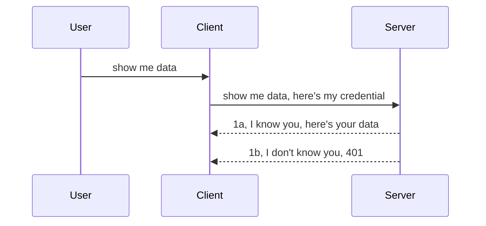

<!--
CO_OP_TRANSLATOR_METADATA:
{
  "original_hash": "5b00b8a8971a07d2d8803be4c9f138f8",
  "translation_date": "2025-10-07T01:05:04+00:00",
  "source_file": "03-GettingStarted/11-simple-auth/README.md",
  "language_code": "bg"
}
-->
# Простo удостоверяване

MCP SDK поддържа използването на OAuth 2.1, което, честно казано, е доста сложен процес, включващ концепции като сървър за удостоверяване, сървър за ресурси, изпращане на идентификационни данни, получаване на код, обмен на кода за токен за достъп, докато най-накрая получите данните за ресурса си. Ако не сте запознати с OAuth, което е страхотен механизъм за внедряване, добра идея е да започнете с основно ниво на удостоверяване и постепенно да преминете към по-добра и по-сигурна защита. Затова съществува тази глава – за да ви подготви за по-напреднали методи за удостоверяване.

## Какво означава удостоверяване?

Удостоверяване е съкращение от автентикация и авторизация. Идеята е, че трябва да направим две неща:

- **Автентикация** – процесът на установяване дали да позволим на даден човек да влезе в нашия "дом", т.е. дали има право да бъде "тук", което означава достъп до нашия сървър за ресурси, където се намират функциите на MCP сървъра.
- **Авторизация** – процесът на установяване дали даден потребител трябва да има достъп до конкретните ресурси, които иска, например тези поръчки или тези продукти, или дали му е позволено да чете съдържанието, но не и да го изтрива, като друг пример.

## Идентификационни данни: как казваме на системата кои сме

Повечето уеб разработчици започват да мислят в посока предоставяне на идентификационни данни на сървъра, обикновено тайна, която показва дали имат право да бъдат "тук" (автентикация). Тази идентификационна информация обикновено е base64-кодирана версия на потребителско име и парола или API ключ, който уникално идентифицира конкретен потребител.

Това включва изпращане чрез заглавие, наречено "Authorization", както следва:

```json
{ "Authorization": "secret123" }
```

Това обикновено се нарича основно удостоверяване. Общият поток работи по следния начин:



Сега, когато разбираме как работи от гледна точка на потока, как да го внедрим? Повечето уеб сървъри имат концепция, наречена middleware – парче код, което се изпълнява като част от заявката и може да проверява идентификационните данни. Ако идентификационните данни са валидни, заявката се пропуска. Ако заявката няма валидни идентификационни данни, получавате грешка за удостоверяване. Нека видим как това може да бъде внедрено:

**Python**

```python
class AuthMiddleware(BaseHTTPMiddleware):
    async def dispatch(self, request, call_next):

        has_header = request.headers.get("Authorization")
        if not has_header:
            print("-> Missing Authorization header!")
            return Response(status_code=401, content="Unauthorized")

        if not valid_token(has_header):
            print("-> Invalid token!")
            return Response(status_code=403, content="Forbidden")

        print("Valid token, proceeding...")
       
        response = await call_next(request)
        # add any customer headers or change in the response in some way
        return response


starlette_app.add_middleware(CustomHeaderMiddleware)
```

Тук сме:

- Създали middleware, наречено `AuthMiddleware`, чийто метод `dispatch` се извиква от уеб сървъра.
- Добавили middleware към уеб сървъра:

    ```python
    starlette_app.add_middleware(AuthMiddleware)
    ```

- Написали логика за валидиране, която проверява дали заглавието Authorization присъства и дали изпратената тайна е валидна:

    ```python
    has_header = request.headers.get("Authorization")
    if not has_header:
        print("-> Missing Authorization header!")
        return Response(status_code=401, content="Unauthorized")

    if not valid_token(has_header):
        print("-> Invalid token!")
        return Response(status_code=403, content="Forbidden")
    ```

    Ако тайната присъства и е валидна, позволяваме заявката да премине, като извикваме `call_next` и връщаме отговора.

    ```python
    response = await call_next(request)
    # add any customer headers or change in the response in some way
    return response
    ```

Как работи: ако към сървъра се направи уеб заявка, middleware ще бъде извикано и според неговата имплементация или ще позволи заявката да премине, или ще върне грешка, която показва, че клиентът няма право да продължи.

**TypeScript**

Тук създаваме middleware с популярния фреймуърк Express и прихващаме заявката, преди тя да достигне MCP сървъра. Ето кода за това:

```typescript
function isValid(secret) {
    return secret === "secret123";
}

app.use((req, res, next) => {
    // 1. Authorization header present?  
    if(!req.headers["Authorization"]) {
        res.status(401).send('Unauthorized');
    }
    
    let token = req.headers["Authorization"];

    // 2. Check validity.
    if(!isValid(token)) {
        res.status(403).send('Forbidden');
    }

   
    console.log('Middleware executed');
    // 3. Passes request to the next step in the request pipeline.
    next();
});
```

В този код:

1. Проверяваме дали заглавието Authorization присъства. Ако не, изпращаме грешка 401.
2. Уверяваме се, че идентификационните данни/токенът са валидни. Ако не, изпращаме грешка 403.
3. Накрая пропускаме заявката в потока на заявките и връщаме искания ресурс.

## Упражнение: Внедряване на удостоверяване

Нека използваме знанията си и опитаме да го внедрим. Ето плана:

Сървър

- Създайте уеб сървър и MCP инстанция.
- Внедрете middleware за сървъра.

Клиент

- Изпратете уеб заявка с идентификационни данни чрез заглавие.

### -1- Създайте уеб сървър и MCP инстанция

В първата стъпка трябва да създадем инстанция на уеб сървър и MCP сървър.

**Python**

Тук създаваме MCP сървър, създаваме starlette уеб приложение и го хостваме с uvicorn.

```python
# creating MCP Server

app = FastMCP(
    name="MCP Resource Server",
    instructions="Resource Server that validates tokens via Authorization Server introspection",
    host=settings["host"],
    port=settings["port"],
    debug=True
)

# creating starlette web app
starlette_app = app.streamable_http_app()

# serving app via uvicorn
async def run(starlette_app):
    import uvicorn
    config = uvicorn.Config(
            starlette_app,
            host=app.settings.host,
            port=app.settings.port,
            log_level=app.settings.log_level.lower(),
        )
    server = uvicorn.Server(config)
    await server.serve()

run(starlette_app)
```

В този код:

- Създаваме MCP сървър.
- Конструираме starlette уеб приложение от MCP сървъра, `app.streamable_http_app()`.
- Хостваме и обслужваме уеб приложението с uvicorn `server.serve()`.

**TypeScript**

Тук създаваме MCP сървър.

```typescript
const server = new McpServer({
      name: "example-server",
      version: "1.0.0"
    });

    // ... set up server resources, tools, and prompts ...
```

Това създаване на MCP сървър трябва да се случи в дефиницията на маршрута POST /mcp, така че нека преместим горния код така:

```typescript
import express from "express";
import { randomUUID } from "node:crypto";
import { McpServer } from "@modelcontextprotocol/sdk/server/mcp.js";
import { StreamableHTTPServerTransport } from "@modelcontextprotocol/sdk/server/streamableHttp.js";
import { isInitializeRequest } from "@modelcontextprotocol/sdk/types.js"

const app = express();
app.use(express.json());

// Map to store transports by session ID
const transports: { [sessionId: string]: StreamableHTTPServerTransport } = {};

// Handle POST requests for client-to-server communication
app.post('/mcp', async (req, res) => {
  // Check for existing session ID
  const sessionId = req.headers['mcp-session-id'] as string | undefined;
  let transport: StreamableHTTPServerTransport;

  if (sessionId && transports[sessionId]) {
    // Reuse existing transport
    transport = transports[sessionId];
  } else if (!sessionId && isInitializeRequest(req.body)) {
    // New initialization request
    transport = new StreamableHTTPServerTransport({
      sessionIdGenerator: () => randomUUID(),
      onsessioninitialized: (sessionId) => {
        // Store the transport by session ID
        transports[sessionId] = transport;
      },
      // DNS rebinding protection is disabled by default for backwards compatibility. If you are running this server
      // locally, make sure to set:
      // enableDnsRebindingProtection: true,
      // allowedHosts: ['127.0.0.1'],
    });

    // Clean up transport when closed
    transport.onclose = () => {
      if (transport.sessionId) {
        delete transports[transport.sessionId];
      }
    };
    const server = new McpServer({
      name: "example-server",
      version: "1.0.0"
    });

    // ... set up server resources, tools, and prompts ...

    // Connect to the MCP server
    await server.connect(transport);
  } else {
    // Invalid request
    res.status(400).json({
      jsonrpc: '2.0',
      error: {
        code: -32000,
        message: 'Bad Request: No valid session ID provided',
      },
      id: null,
    });
    return;
  }

  // Handle the request
  await transport.handleRequest(req, res, req.body);
});

// Reusable handler for GET and DELETE requests
const handleSessionRequest = async (req: express.Request, res: express.Response) => {
  const sessionId = req.headers['mcp-session-id'] as string | undefined;
  if (!sessionId || !transports[sessionId]) {
    res.status(400).send('Invalid or missing session ID');
    return;
  }
  
  const transport = transports[sessionId];
  await transport.handleRequest(req, res);
};

// Handle GET requests for server-to-client notifications via SSE
app.get('/mcp', handleSessionRequest);

// Handle DELETE requests for session termination
app.delete('/mcp', handleSessionRequest);

app.listen(3000);
```

Сега виждате как създаването на MCP сървър беше преместено в `app.post("/mcp")`.

Нека преминем към следващата стъпка – създаване на middleware, за да можем да валидираме входящите идентификационни данни.

### -2- Внедрете middleware за сървъра

Нека преминем към частта с middleware. Тук ще създадем middleware, което търси идентификационни данни в заглавието `Authorization` и ги валидира. Ако са приемливи, заявката ще продължи да прави това, което трябва (например списък с инструменти, четене на ресурс или каквато и да е функционалност на MCP, която клиентът е поискал).

**Python**

За да създадем middleware, трябва да създадем клас, който наследява `BaseHTTPMiddleware`. Има два интересни елемента:

- Заявката `request`, от която четем информацията за заглавието.
- `call_next` – обратното извикване, което трябва да извикаме, ако клиентът е предоставил идентификационни данни, които приемаме.

Първо, трябва да обработим случая, ако заглавието `Authorization` липсва:

```python
has_header = request.headers.get("Authorization")

# no header present, fail with 401, otherwise move on.
if not has_header:
    print("-> Missing Authorization header!")
    return Response(status_code=401, content="Unauthorized")
```

Тук изпращаме съобщение за 401 Unauthorized, тъй като клиентът не успява да се удостовери.

След това, ако са предоставени идентификационни данни, трябва да проверим тяхната валидност, както следва:

```python
 if not valid_token(has_header):
    print("-> Invalid token!")
    return Response(status_code=403, content="Forbidden")
```

Обърнете внимание как изпращаме съобщение за 403 Forbidden по-горе. Нека видим пълното middleware по-долу, което имплементира всичко, което споменахме:

```python
class AuthMiddleware(BaseHTTPMiddleware):
    async def dispatch(self, request, call_next):

        has_header = request.headers.get("Authorization")
        if not has_header:
            print("-> Missing Authorization header!")
            return Response(status_code=401, content="Unauthorized")

        if not valid_token(has_header):
            print("-> Invalid token!")
            return Response(status_code=403, content="Forbidden")

        print("Valid token, proceeding...")
        print(f"-> Received {request.method} {request.url}")
        response = await call_next(request)
        response.headers['Custom'] = 'Example'
        return response

```

Чудесно, но какво да кажем за функцията `valid_token`? Ето я по-долу:

```python
# DON'T use for production - improve it !!
def valid_token(token: str) -> bool:
    # remove the "Bearer " prefix
    if token.startswith("Bearer "):
        token = token[7:]
        return token == "secret-token"
    return False
```

Това очевидно трябва да се подобри.

ВАЖНО: Никога не трябва да имате тайни като тази в кода. Идеално е да извлечете стойността за сравнение от база данни или от IDP (доставчик на идентичност) или още по-добре, да оставите IDP да извърши валидирането.

**TypeScript**

За да внедрим това с Express, трябва да извикаме метода `use`, който приема функции за middleware.

Трябва да:

- Взаимодействаме с променливата за заявката, за да проверим подадените идентификационни данни в свойството `Authorization`.
- Валидираме идентификационните данни и, ако са валидни, да позволим заявката да продължи и да изпълни MCP заявката на клиента (например списък с инструменти, четене на ресурс или каквото и да е друго, свързано с MCP).

Тук проверяваме дали заглавието `Authorization` присъства и ако не, спираме заявката:

```typescript
if(!req.headers["authorization"]) {
    res.status(401).send('Unauthorized');
    return;
}
```

Ако заглавието не е изпратено, получавате грешка 401.

След това проверяваме дали идентификационните данни са валидни. Ако не, отново спираме заявката, но с малко по-различно съобщение:

```typescript
if(!isValid(token)) {
    res.status(403).send('Forbidden');
    return;
} 
```

Обърнете внимание как сега получавате грешка 403.

Ето пълния код:

```typescript
app.use((req, res, next) => {
    console.log('Request received:', req.method, req.url, req.headers);
    console.log('Headers:', req.headers["authorization"]);
    if(!req.headers["authorization"]) {
        res.status(401).send('Unauthorized');
        return;
    }
    
    let token = req.headers["authorization"];

    if(!isValid(token)) {
        res.status(403).send('Forbidden');
        return;
    }  

    console.log('Middleware executed');
    next();
});
```

Настроили сме уеб сървъра да приема middleware, което проверява идентификационните данни, които клиентът евентуално ни изпраща. А какво да кажем за самия клиент?

### -3- Изпратете уеб заявка с идентификационни данни чрез заглавие

Трябва да се уверим, че клиентът предава идентификационните данни чрез заглавието. Тъй като ще използваме MCP клиент за това, трябва да разберем как се прави.

**Python**

За клиента трябва да предадем заглавие с нашите идентификационни данни, както следва:

```python
# DON'T hardcode the value, have it at minimum in an environment variable or a more secure storage
token = "secret-token"

async with streamablehttp_client(
        url = f"http://localhost:{port}/mcp",
        headers = {"Authorization": f"Bearer {token}"}
    ) as (
        read_stream,
        write_stream,
        session_callback,
    ):
        async with ClientSession(
            read_stream,
            write_stream
        ) as session:
            await session.initialize()
      
            # TODO, what you want done in the client, e.g list tools, call tools etc.
```

Обърнете внимание как попълваме свойството `headers`, както следва: `headers = {"Authorization": f"Bearer {token}"}`.

**TypeScript**

Можем да решим това в две стъпки:

1. Попълнете конфигурационен обект с нашите идентификационни данни.
2. Предайте конфигурационния обект на транспорта.

```typescript

// DON'T hardcode the value like shown here. At minimum have it as a env variable and use something like dotenv (in dev mode).
let token = "secret123"

// define a client transport option object
let options: StreamableHTTPClientTransportOptions = {
  sessionId: sessionId,
  requestInit: {
    headers: {
      "Authorization": "secret123"
    }
  }
};

// pass the options object to the transport
async function main() {
   const transport = new StreamableHTTPClientTransport(
      new URL(serverUrl),
      options
   );
```

Тук виждате как трябваше да създадем обект `options` и да поставим нашите заглавия под свойството `requestInit`.

ВАЖНО: Как можем да го подобрим оттук нататък? Е, текущата имплементация има някои проблеми. На първо място, предаването на идентификационни данни по този начин е доста рисковано, освен ако поне нямате HTTPS. Дори тогава идентификационните данни могат да бъдат откраднати, така че ви трябва система, в която лесно можете да отмените токена и да добавите допълнителни проверки, като например откъде идва заявката, дали заявката се случва твърде често (поведение като бот) и други подобни. 

Трябва да се каже обаче, че за много прости API-та, където не искате никой да извиква вашия API без удостоверяване, това, което имаме тук, е добро начало.

С това казано, нека опитаме да засилим сигурността малко, като използваме стандартизиран формат като JSON Web Token, известен още като JWT или "JOT" токени.

## JSON Web Tokens, JWT

И така, опитваме се да подобрим нещата, като не изпращаме много прости идентификационни данни. Какви са непосредствените подобрения, които получаваме, когато приемем JWT?

- **Подобрения в сигурността**. При основното удостоверяване изпращате потребителско име и парола като base64-кодиран токен (или изпращате API ключ) отново и отново, което увеличава риска. С JWT изпращате потребителско име и парола и получавате токен в замяна, който също е времево ограничен, което означава, че ще изтече. JWT ви позволява лесно да използвате фино управление на достъпа чрез роли, обхвати и разрешения.
- **Безсесийност и мащабируемост**. JWT са самостоятелни, съдържат цялата информация за потребителя и премахват нуждата от съхранение на сесии на сървъра. Токенът може също да бъде валидиран локално.
- **Интероперативност и федерация**. JWT са централни за Open ID Connect и се използват с известни доставчици на идентичност като Entra ID, Google Identity и Auth0. Те също така правят възможно използването на единно удостоверяване и много други, което ги прави подходящи за корпоративна употреба.
- **Модулност и гъвкавост**. JWT могат също да се използват с API Gateways като Azure API Management, NGINX и други. Те също така поддържат сценарии за удостоверяване и комуникация между сървъри, включително сценарии за имперсонация и делегация.
- **Производителност и кеширане**. JWT могат да бъдат кеширани след декодиране, което намалява нуждата от парсинг. Това помага особено при приложения с висок трафик, тъй като подобрява пропускателната способност и намалява натоварването на избраната инфраструктура.
- **Разширени функции**. Те също така поддържат инспекция (проверка на валидността на сървъра) и отмяна (правене на токена невалиден).

С всички тези предимства, нека видим как можем да издигнем нашата имплементация на следващо ниво.

## Превръщане на основното удостоверяване в JWT

И така, промените, които трябва да направим на високо ниво, са:

- **Научете се да конструирате JWT токен** и го направете готов за изпращане от клиент към сървър.
- **Валидирайте JWT токен** и, ако е валиден, позволете на клиента да получи нашите ресурси.
- **Сигурно съхранение на токена**. Как съхраняваме този токен.
- **Защитете маршрутите**. Трябва да защитим маршрутите, в нашия случай трябва да защитим маршрутите и специфичните функции на MCP.
- **Добавете токени за обновяване**. Уверете се, че създаваме токени, които са краткотрайни, но токени за обновяване, които са дълготрайни и могат да се използват за получаване на нови токени, ако изтекат. Също така осигурете крайна точка за обновяване и стратегия за ротация.

### -1- Конструиране на JWT токен

Първо, JWT токен има следните части:

- **header** – алгоритъмът, който се използва, и типът на токена.
- **payload** – твърдения, като sub (потребителят или обектът, който токенът представлява. В сценарий за удостоверяване това обикновено е потребителският идентификатор), exp (кога изтича), role (ролята).
- **signature** – подписан с тайна или частен ключ.

За това ще трябва да конструираме header, payload и кодирания токен.

**Python**

```python

import jwt
import jwt
from jwt.exceptions import ExpiredSignatureError, InvalidTokenError
import datetime

# Secret key used to sign the JWT
secret_key = 'your-secret-key'

header = {
    "alg": "HS256",
    "typ": "JWT"
}

# the user info andits claims and expiry time
payload = {
    "sub": "1234567890",               # Subject (user ID)
    "name": "User Userson",                # Custom claim
    "admin": True,                     # Custom claim
    "iat": datetime.datetime.utcnow(),# Issued at
    "exp": datetime.datetime.utcnow() + datetime.timedelta(hours=1)  # Expiry
}

# encode it
encoded_jwt = jwt.encode(payload, secret_key, algorithm="HS256", headers=header)
```

В горния код сме:

- Дефинирали header, използвайки HS256 като алгоритъм и тип JWT.
- Конструирали payload, който съдържа sub или потребителски идентификатор, потребителско име, роля, кога е издаден и кога е настроен да изтече, като по този начин имплементираме времевото ограничение, което споменахме по-рано.

**TypeScript**

Тук ще ни трябват някои зависимости, които ще ни помогнат да конструираме JWT токен.

Зависимости

```sh

npm install jsonwebtoken
npm install --save-dev @types/jsonwebtoken
```

Сега, когато имаме това на място, нека създадем header, payload и чрез тях създадем кодирания токен.

```typescript
import jwt from 'jsonwebtoken';

const secretKey = 'your-secret-key'; // Use env vars in production

// Define the payload
const payload = {
  sub: '1234567890',
  name: 'User usersson',
  admin: true,
  iat: Math.floor(Date.now() / 1000), // Issued at
  exp: Math.floor(Date.now() / 1000) + 60 * 60 // Expires in 1 hour
};

// Define the header (optional, jsonwebtoken sets defaults)
const header = {
  alg: 'HS256',
  typ: 'JWT'
};

// Create the token
const token = jwt.sign(payload, secretKey, {
  algorithm: 'HS256',
  header: header
});

console.log('JWT:', token);
```

Този токен е:

Подписан с HS256  
Валиден за 1 час  
Включва твърдения като sub, name, admin, iat и exp.

### -2- Валидиране на токен

Също така ще трябва да валидираме токен, което трябва да направим на сървъра, за да се уверим, че това, което клиентът ни изпраща, е валидно. Има много проверки, които трябва да направим тук – от валидиране на структурата му до неговата валидност. Също така се препоръчва да добавите други проверки, за да видите дали потребителят е в системата ви и други.

За да валидираме токен, трябва да го декодираме, за да можем да го прочетем, и след това да започнем да проверяваме неговата валидност:

**Python**

```python

# Decode and verify the JWT
try:
    decoded = jwt.decode(token, secret_key, algorithms=["HS256"])
    print("✅ Token is valid.")
    print("Decoded claims:")
    for key, value in decoded.items():
        print(f"  {key}: {value}")
except ExpiredSignatureError:
    print("❌ Token has expired.")
except InvalidTokenError as e:
    print(f"❌ Invalid token: {e}")

```

В този код извикваме `jwt.decode`, използвайки токена, тайния ключ и избрания алгоритъм като вход. Обър
След това нека разгледаме контрол на достъпа, базиран на роли, известен още като RBAC.

## Добавяне на контрол на достъпа, базиран на роли

Идеята е, че искаме да изразим, че различните роли имат различни разрешения. Например, приемаме, че администраторът може да прави всичко, обикновените потребители могат да четат/пишат, а гостите могат само да четат. Ето защо, тук са някои възможни нива на разрешения:

- Admin.Write 
- User.Read
- Guest.Read

Нека разгледаме как можем да приложим такъв контрол с помощта на middleware. Middleware може да се добавя както за конкретни маршрути, така и за всички маршрути.

**Python**

```python
from starlette.middleware.base import BaseHTTPMiddleware
from starlette.responses import JSONResponse
import jwt

# DON'T have the secret in the code like, this is for demonstration purposes only. Read it from a safe place.
SECRET_KEY = "your-secret-key" # put this in env variable
REQUIRED_PERMISSION = "User.Read"

class JWTPermissionMiddleware(BaseHTTPMiddleware):
    async def dispatch(self, request, call_next):
        auth_header = request.headers.get("Authorization")
        if not auth_header or not auth_header.startswith("Bearer "):
            return JSONResponse({"error": "Missing or invalid Authorization header"}, status_code=401)

        token = auth_header.split(" ")[1]
        try:
            decoded = jwt.decode(token, SECRET_KEY, algorithms=["HS256"])
        except jwt.ExpiredSignatureError:
            return JSONResponse({"error": "Token expired"}, status_code=401)
        except jwt.InvalidTokenError:
            return JSONResponse({"error": "Invalid token"}, status_code=401)

        permissions = decoded.get("permissions", [])
        if REQUIRED_PERMISSION not in permissions:
            return JSONResponse({"error": "Permission denied"}, status_code=403)

        request.state.user = decoded
        return await call_next(request)


```

Има няколко различни начина за добавяне на middleware, както е показано по-долу:

```python

# Alt 1: add middleware while constructing starlette app
middleware = [
    Middleware(JWTPermissionMiddleware)
]

app = Starlette(routes=routes, middleware=middleware)

# Alt 2: add middleware after starlette app is a already constructed
starlette_app.add_middleware(JWTPermissionMiddleware)

# Alt 3: add middleware per route
routes = [
    Route(
        "/mcp",
        endpoint=..., # handler
        middleware=[Middleware(JWTPermissionMiddleware)]
    )
]
```

**TypeScript**

Можем да използваме `app.use` и middleware, който ще се изпълнява за всички заявки.

```typescript
app.use((req, res, next) => {
    console.log('Request received:', req.method, req.url, req.headers);
    console.log('Headers:', req.headers["authorization"]);

    // 1. Check if authorization header has been sent

    if(!req.headers["authorization"]) {
        res.status(401).send('Unauthorized');
        return;
    }
    
    let token = req.headers["authorization"];

    // 2. Check if token is valid
    if(!isValid(token)) {
        res.status(403).send('Forbidden');
        return;
    }  

    // 3. Check if token user exist in our system
    if(!isExistingUser(token)) {
        res.status(403).send('Forbidden');
        console.log("User does not exist");
        return;
    }
    console.log("User exists");

    // 4. Verify the token has the right permissions
    if(!hasScopes(token, ["User.Read"])){
        res.status(403).send('Forbidden - insufficient scopes');
    }

    console.log("User has required scopes");

    console.log('Middleware executed');
    next();
});

```

Има доста неща, които можем да позволим на нашия middleware да прави и които той ТРЯБВА да прави, а именно:

1. Проверка дали заглавието за авторизация присъства.
2. Проверка дали токенът е валиден, като извикваме `isValid`, метод, който сме написали за проверка на целостта и валидността на JWT токена.
3. Проверка дали потребителят съществува в нашата система, което трябва да направим.

   ```typescript
    // users in DB
   const users = [
     "user1",
     "User usersson",
   ]

   function isExistingUser(token) {
     let decodedToken = verifyToken(token);

     // TODO, check if user exists in DB
     return users.includes(decodedToken?.name || "");
   }
   ```

   По-горе сме създали много прост списък с `users`, който очевидно трябва да бъде в база данни.

4. Освен това трябва да проверим дали токенът има правилните разрешения.

   ```typescript
   if(!hasScopes(token, ["User.Read"])){
        res.status(403).send('Forbidden - insufficient scopes');
   }
   ```

   В кода по-горе от middleware проверяваме дали токенът съдържа разрешението User.Read, ако не, изпращаме грешка 403. По-долу е помощният метод `hasScopes`.

   ```typescript
   function hasScopes(scope: string, requiredScopes: string[]) {
     let decodedToken = verifyToken(scope);
    return requiredScopes.every(scope => decodedToken?.scopes.includes(scope));
  }
   ```

Have a think which additional checks you should be doing, but these are the absolute minimum of checks you should be doing.

Using Express as a web framework is a common choice. There are helpers library when you use JWT so you can write less code.

- `express-jwt`, helper library that provides a middleware that helps decode your token.
- `express-jwt-permissions`, this provides a middleware `guard` that helps check if a certain permission is on the token.

Here's what these libraries can look like when used:

```typescript
const express = require('express');
const jwt = require('express-jwt');
const guard = require('express-jwt-permissions')();

const app = express();
const secretKey = 'your-secret-key'; // put this in env variable

// Decode JWT and attach to req.user
app.use(jwt({ secret: secretKey, algorithms: ['HS256'] }));

// Check for User.Read permission
app.use(guard.check('User.Read'));

// multiple permissions
// app.use(guard.check(['User.Read', 'Admin.Access']));

app.get('/protected', (req, res) => {
  res.json({ message: `Welcome ${req.user.name}` });
});

// Error handler
app.use((err, req, res, next) => {
  if (err.code === 'permission_denied') {
    return res.status(403).send('Forbidden');
  }
  next(err);
});

```

Сега видяхте как middleware може да се използва както за автентикация, така и за авторизация. А какво да кажем за MCP, променя ли това начина, по който правим автентикация? Нека разберем в следващия раздел.

### -3- Добавяне на RBAC към MCP

Досега видяхте как можете да добавите RBAC чрез middleware, но за MCP няма лесен начин да добавите RBAC за всяка функция на MCP. Какво да правим тогава? Просто трябва да добавим код, който проверява дали клиентът има права да извика конкретен инструмент:

Имате няколко различни избора как да постигнете RBAC за всяка функция, ето някои от тях:

- Добавете проверка за всеки инструмент, ресурс, prompt, където трябва да проверите нивото на разрешение.

   **Python**

   ```python
   @tool()
   def delete_product(id: int):
      try:
          check_permissions(role="Admin.Write", request)
      catch:
        pass # client failed authorization, raise authorization error
   ```

   **TypeScript**

   ```typescript
   server.registerTool(
    "delete-product",
    {
      title: Delete a product",
      description: "Deletes a product",
      inputSchema: { id: z.number() }
    },
    async ({ id }) => {
      
      try {
        checkPermissions("Admin.Write", request);
        // todo, send id to productService and remote entry
      } catch(Exception e) {
        console.log("Authorization error, you're not allowed");  
      }

      return {
        content: [{ type: "text", text: `Deletected product with id ${id}` }]
      };
    }
   );
   ```


- Използвайте подход с напреднал сървър и обработвачи на заявки, за да минимизирате местата, където трябва да направите проверката.

   **Python**

   ```python
   
   tool_permission = {
      "create_product": ["User.Write", "Admin.Write"],
      "delete_product": ["Admin.Write"]
   }

   def has_permission(user_permissions, required_permissions) -> bool:
      # user_permissions: list of permissions the user has
      # required_permissions: list of permissions required for the tool
      return any(perm in user_permissions for perm in required_permissions)

   @server.call_tool()
   async def handle_call_tool(
     name: str, arguments: dict[str, str] | None
   ) -> list[types.TextContent]:
    # Assume request.user.permissions is a list of permissions for the user
     user_permissions = request.user.permissions
     required_permissions = tool_permission.get(name, [])
     if not has_permission(user_permissions, required_permissions):
        # Raise error "You don't have permission to call tool {name}"
        raise Exception(f"You don't have permission to call tool {name}")
     # carry on and call tool
     # ...
   ```   
   

   **TypeScript**

   ```typescript
   function hasPermission(userPermissions: string[], requiredPermissions: string[]): boolean {
       if (!Array.isArray(userPermissions) || !Array.isArray(requiredPermissions)) return false;
       // Return true if user has at least one required permission
       
       return requiredPermissions.some(perm => userPermissions.includes(perm));
   }
  
   server.setRequestHandler(CallToolRequestSchema, async (request) => {
      const { params: { name } } = request;
  
      let permissions = request.user.permissions;
  
      if (!hasPermission(permissions, toolPermissions[name])) {
         return new Error(`You don't have permission to call ${name}`);
      }
  
      // carry on..
   });
   ```

   Забележете, че трябва да се уверите, че вашият middleware присвоява декодиран токен на свойството user на заявката, за да се опрости горния код.

### Обобщение

Сега, след като обсъдихме как да добавим поддръжка за RBAC като цяло и за MCP в частност, е време да опитате да приложите сигурност сами, за да се уверите, че сте разбрали представените концепции.

## Задача 1: Създайте MCP сървър и MCP клиент с използване на базова автентикация

Тук ще използвате наученото за изпращане на идентификационни данни чрез заглавия.

## Решение 1

[Решение 1](./code/basic/README.md)

## Задача 2: Надградете решението от Задача 1, за да използва JWT

Вземете първото решение, но този път го подобрете.

Вместо да използвате Basic Auth, използвайте JWT.

## Решение 2

[Решение 2](./solution/jwt-solution/README.md)

## Предизвикателство

Добавете RBAC за всеки инструмент, както описахме в раздела "Добавяне на RBAC към MCP".

## Обобщение

Надяваме се, че сте научили много в тази глава — от липса на сигурност, до базова сигурност, до JWT и как може да се добави към MCP.

Изградихме солидна основа с персонализирани JWT, но с разрастването си преминаваме към модел за идентичност, базиран на стандарти. Приемането на IdP като Entra или Keycloak ни позволява да прехвърлим издаването, валидирането и управлението на жизнения цикъл на токените към надеждна платформа — освобождавайки ни да се фокусираме върху логиката на приложението и потребителското изживяване.

За това имаме по-напреднала [глава за Entra](../../05-AdvancedTopics/mcp-security-entra/README.md)

---

**Отказ от отговорност**:  
Този документ е преведен с помощта на AI услуга за превод [Co-op Translator](https://github.com/Azure/co-op-translator). Въпреки че се стремим към точност, моля, имайте предвид, че автоматизираните преводи може да съдържат грешки или неточности. Оригиналният документ на неговия роден език трябва да се счита за авторитетен източник. За критична информация се препоръчва професионален човешки превод. Не носим отговорност за недоразумения или погрешни интерпретации, произтичащи от използването на този превод.