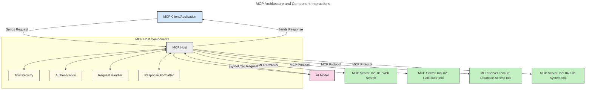
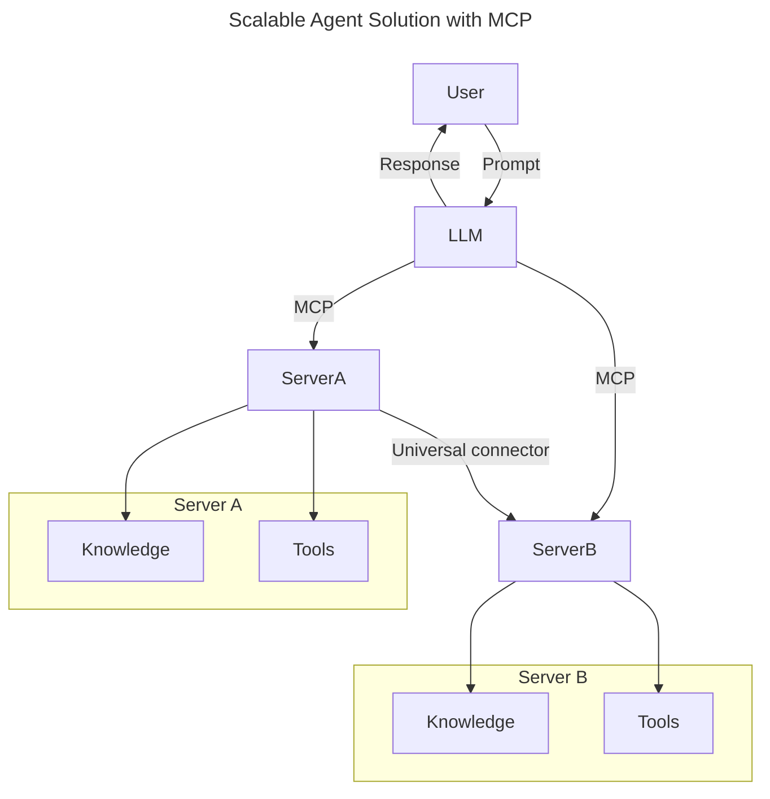

<!--
CO_OP_TRANSLATOR_METADATA:
{
  "original_hash": "9678e0c6945b8e0c23586869b0e26783",
  "translation_date": "2025-10-06T10:55:50+00:00",
  "source_file": "00-Introduction/README.md",
  "language_code": "bn"
}
-->
# মডেল কনটেক্সট প্রোটোকল (MCP) পরিচিতি: স্কেলযোগ্য AI অ্যাপ্লিকেশনের জন্য কেন এটি গুরুত্বপূর্ণ

_(উপরের ছবিতে ক্লিক করে এই পাঠের ভিডিও দেখুন)_

জেনারেটিভ AI অ্যাপ্লিকেশনগুলো একটি বড় অগ্রগতি, কারণ এগুলো প্রায়শই ব্যবহারকারীকে প্রাকৃতিক ভাষার প্রম্পট ব্যবহার করে অ্যাপের সাথে যোগাযোগ করতে দেয়। তবে, যখন এই ধরনের অ্যাপগুলোর উন্নয়নে আরও সময় এবং সম্পদ বিনিয়োগ করা হয়, তখন নিশ্চিত করতে হবে যে আপনি সহজেই কার্যকারিতা এবং সম্পদ একত্রিত করতে পারেন, যাতে এটি সহজে সম্প্রসারণযোগ্য হয়, আপনার অ্যাপ একাধিক মডেল ব্যবহার করতে পারে এবং বিভিন্ন মডেলের জটিলতা পরিচালনা করতে পারে। সংক্ষেপে, জেনারেটিভ AI অ্যাপ তৈরি করা শুরুতে সহজ, কিন্তু যখন এগুলো বৃদ্ধি পায় এবং আরও জটিল হয়ে ওঠে, তখন আপনাকে একটি আর্কিটেকচার সংজ্ঞায়িত করতে হবে এবং সম্ভবত একটি মান নির্ভর করতে হবে যাতে আপনার অ্যাপগুলো একটি সঙ্গতিপূর্ণ উপায়ে তৈরি হয়। এখানেই MCP আসে জিনিসগুলো সংগঠিত করতে এবং একটি মান প্রদান করতে।

---

## **🔍 মডেল কনটেক্সট প্রোটোকল (MCP) কী?**

**মডেল কনটেক্সট প্রোটোকল (MCP)** একটি **উন্মুক্ত, মানসম্মত ইন্টারফেস**, যা বড় ভাষার মডেলগুলোকে (LLMs) বাইরের টুল, API এবং ডেটা সোর্সের সাথে নির্বিঘ্নে যোগাযোগ করতে দেয়। এটি একটি সঙ্গতিপূর্ণ আর্কিটেকচার প্রদান করে, যা AI মডেলের কার্যকারিতা তাদের প্রশিক্ষণ ডেটার বাইরে উন্নত করে, স্মার্ট, স্কেলযোগ্য এবং আরও প্রতিক্রিয়াশীল AI সিস্টেম সক্ষম করে।

---

## **🎯 AI-তে মান নির্ধারণ কেন গুরুত্বপূর্ণ**

যখন জেনারেটিভ AI অ্যাপ্লিকেশনগুলো আরও জটিল হয়ে ওঠে, তখন এমন মান গ্রহণ করা অপরিহার্য যা **স্কেলযোগ্যতা, সম্প্রসারণযোগ্যতা, রক্ষণাবেক্ষণযোগ্যতা** এবং **ভেন্ডর লক-ইন এড়ানো** নিশ্চিত করে। MCP এই প্রয়োজনগুলো পূরণ করে:

- মডেল-টুল ইন্টিগ্রেশন একীভূত করা
- ভঙ্গুর, এককালীন কাস্টম সমাধান কমানো
- এক ইকোসিস্টেমে বিভিন্ন ভেন্ডরের একাধিক মডেল সহাবস্থান নিশ্চিত করা

**নোট:** যদিও MCP নিজেকে একটি উন্মুক্ত মান হিসেবে উপস্থাপন করে, MCP-কে IEEE, IETF, W3C, ISO বা অন্য কোনো মান সংস্থা দ্বারা মানসম্মত করার কোনো পরিকল্পনা নেই।

---

## **📚 শেখার লক্ষ্য**

এই নিবন্ধের শেষে, আপনি সক্ষম হবেন:

- **মডেল কনটেক্সট প্রোটোকল (MCP)** এবং এর ব্যবহার ক্ষেত্র সংজ্ঞায়িত করতে
- MCP কীভাবে মডেল-টুল যোগাযোগকে মানসম্মত করে তা বুঝতে
- MCP আর্কিটেকচারের মূল উপাদানগুলো চিহ্নিত করতে
- এন্টারপ্রাইজ এবং ডেভেলপমেন্ট প্রসঙ্গে MCP-এর বাস্তব জীবনের প্রয়োগ অন্বেষণ করতে

---

## **💡 মডেল কনটেক্সট প্রোটোকল (MCP) কেন একটি গেম-চেঞ্জার**

### **🔗 MCP AI ইন্টারঅ্যাকশনের বিভাজন সমাধান করে**

MCP-এর আগে, টুলের সাথে মডেল ইন্টিগ্রেশন প্রয়োজন ছিল:

- প্রতিটি টুল-মডেল জোড়ার জন্য কাস্টম কোড
- প্রতিটি ভেন্ডরের জন্য অ-মানসম্মত API
- আপডেটের কারণে ঘন ঘন ভাঙন
- আরও টুলের সাথে খারাপ স্কেলযোগ্যতা

### **✅ MCP মান নির্ধারণের সুবিধা**

| **সুবিধা**                | **বর্ণনা**                                                                     |
|--------------------------|--------------------------------------------------------------------------------|
| আন্তঃপরিচালনযোগ্যতা       | LLMs বিভিন্ন ভেন্ডরের টুলের সাথে নির্বিঘ্নে কাজ করে                              |
| সঙ্গতি                   | প্ল্যাটফর্ম এবং টুল জুড়ে একক আচরণ                                              |
| পুনঃব্যবহারযোগ্যতা        | একবার তৈরি করা টুল বিভিন্ন প্রকল্প এবং সিস্টেমে ব্যবহার করা যায়                  |
| উন্নত ডেভেলপমেন্ট         | মানসম্মত, প্লাগ-এন্ড-প্লে ইন্টারফেস ব্যবহার করে ডেভেলপমেন্ট সময় কমানো          |

---

## **🧱 MCP আর্কিটেকচারের উচ্চ-স্তরের ওভারভিউ**

MCP একটি **ক্লায়েন্ট-সার্ভার মডেল** অনুসরণ করে, যেখানে:

- **MCP হোস্ট** AI মডেল চালায়
- **MCP ক্লায়েন্ট** অনুরোধ শুরু করে
- **MCP সার্ভার** প্রসঙ্গ, টুল এবং সক্ষমতা প্রদান করে

### **মূল উপাদান:**

- **রিসোর্স** – মডেলের জন্য স্থির বা গতিশীল ডেটা  
- **প্রম্পট** – নির্দেশিত জেনারেশনের জন্য পূর্বনির্ধারিত ওয়ার্কফ্লো  
- **টুল** – অনুসন্ধান, গণনা ইত্যাদির মতো কার্যকরী ফাংশন  
- **স্যাম্পলিং** – পুনরাবৃত্তি ইন্টারঅ্যাকশনের মাধ্যমে এজেন্টিক আচরণ  

---

## MCP সার্ভার কীভাবে কাজ করে

MCP সার্ভার নিম্নলিখিতভাবে কাজ করে:

- **অনুরোধ প্রবাহ**:
    1. একটি অনুরোধ শেষ ব্যবহারকারী বা তাদের পক্ষ থেকে কাজ করা সফটওয়্যার দ্বারা শুরু হয়।
    2. **MCP ক্লায়েন্ট** অনুরোধটি **MCP হোস্ট**-এ পাঠায়, যা AI মডেল রানটাইম পরিচালনা করে।
    3. **AI মডেল** ব্যবহারকারীর প্রম্পট গ্রহণ করে এবং এক বা একাধিক টুল কলের মাধ্যমে বাইরের টুল বা ডেটা অ্যাক্সেসের অনুরোধ করতে পারে।
    4. **MCP হোস্ট**, সরাসরি মডেল নয়, মানসম্মত প্রোটোকল ব্যবহার করে উপযুক্ত **MCP সার্ভার(গুলো)**-এর সাথে যোগাযোগ করে।
- **MCP হোস্ট কার্যকারিতা**:
    - **টুল রেজিস্ট্রি**: উপলব্ধ টুল এবং তাদের সক্ষমতার একটি ক্যাটালগ বজায় রাখে।
    - **প্রমাণীকরণ**: টুল অ্যাক্সেসের অনুমতি যাচাই করে।
    - **অনুরোধ হ্যান্ডলার**: মডেল থেকে আসা টুল অনুরোধ প্রক্রিয়া করে।
    - **প্রতিক্রিয়া ফরম্যাটার**: টুল আউটপুটকে এমন ফরম্যাটে গঠন করে যা মডেল বুঝতে পারে।
- **MCP সার্ভার কার্যকরীতা**:
    - **MCP হোস্ট** টুল কলগুলো এক বা একাধিক **MCP সার্ভার**-এ রুট করে, প্রতিটি বিশেষায়িত ফাংশন (যেমন অনুসন্ধান, গণনা, ডেটাবেস প্রশ্ন) প্রকাশ করে।
    - **MCP সার্ভারগুলো** তাদের নিজ নিজ অপারেশন সম্পাদন করে এবং **MCP হোস্ট**-এ একটি সঙ্গতিপূর্ণ ফরম্যাটে ফলাফল ফেরত দেয়।
    - **MCP হোস্ট** এই ফলাফলগুলো ফরম্যাট করে এবং AI মডেলে প্রেরণ করে।
- **প্রতিক্রিয়া সম্পূর্ণকরণ**:
    - **AI মডেল** টুল আউটপুটগুলোকে চূড়ান্ত প্রতিক্রিয়ায় অন্তর্ভুক্ত করে।
    - **MCP হোস্ট** এই প্রতিক্রিয়াটি **MCP ক্লায়েন্ট**-এ পাঠায়, যা এটি শেষ ব্যবহারকারী বা কলিং সফটওয়্যারে সরবরাহ করে।

## 👨‍💻 MCP সার্ভার তৈরি করার উপায় (উদাহরণ সহ)

MCP সার্ভারগুলো LLM-এর সক্ষমতা প্রসারিত করতে ডেটা এবং কার্যকারিতা প্রদান করে।

প্রস্তুত? এখানে বিভিন্ন ভাষা/স্ট্যাকের জন্য SDK এবং উদাহরণ রয়েছে, যা সহজ MCP সার্ভার তৈরি করতে সাহায্য করবে:

- **Python SDK**: https://github.com/modelcontextprotocol/python-sdk

- **TypeScript SDK**: https://github.com/modelcontextprotocol/typescript-sdk

- **Java SDK**: https://github.com/modelcontextprotocol/java-sdk

- **C#/.NET SDK**: https://github.com/modelcontextprotocol/csharp-sdk

## 🌍 MCP-এর বাস্তব জীবনের ব্যবহার ক্ষেত্র

MCP AI-এর সক্ষমতা প্রসারিত করে বিভিন্ন অ্যাপ্লিকেশন সক্ষম করে:

| **অ্যাপ্লিকেশন**              | **বর্ণনা**                                                                     |
|------------------------------|--------------------------------------------------------------------------------|
| এন্টারপ্রাইজ ডেটা ইন্টিগ্রেশন  | LLM-কে ডেটাবেস, CRM বা অভ্যন্তরীণ টুলের সাথে সংযুক্ত করুন                      |
| এজেন্টিক AI সিস্টেম           | টুল অ্যাক্সেস এবং সিদ্ধান্ত গ্রহণের ওয়ার্কফ্লো সহ স্বায়ত্তশাসিত এজেন্ট সক্ষম করুন |
| মাল্টি-মোডাল অ্যাপ্লিকেশন     | একক AI অ্যাপে টেক্সট, ইমেজ এবং অডিও টুল একত্রিত করুন                           |
| রিয়েল-টাইম ডেটা ইন্টিগ্রেশন  | AI ইন্টারঅ্যাকশনে লাইভ ডেটা নিয়ে আসুন আরও সঠিক, বর্তমান আউটপুটের জন্য            |

### 🧠 MCP = AI ইন্টারঅ্যাকশনের জন্য সার্বজনীন মান

মডেল কনটেক্সট প্রোটোকল (MCP) AI ইন্টারঅ্যাকশনের জন্য একটি সার্বজনীন মান হিসেবে কাজ করে, যেমন USB-C ডিভাইসের জন্য শারীরিক সংযোগকে মানসম্মত করেছে। AI-এর জগতে, MCP একটি সঙ্গতিপূর্ণ ইন্টারফেস প্রদান করে, যা মডেল (ক্লায়েন্ট) বাইরের টুল এবং ডেটা প্রদানকারীদের (সার্ভার) সাথে নির্বিঘ্নে ইন্টিগ্রেট করতে দেয়। এটি প্রতিটি API বা ডেটা সোর্সের জন্য বৈচিত্র্যময়, কাস্টম প্রোটোকলের প্রয়োজন দূর করে।

MCP-এর অধীনে, একটি MCP-সঙ্গতিপূর্ণ টুল (MCP সার্ভার নামে পরিচিত) একটি একীভূত মান অনুসরণ করে। এই সার্ভারগুলো তাদের দেওয়া টুল বা অ্যাকশনগুলো তালিকাভুক্ত করতে পারে এবং AI এজেন্টের অনুরোধে সেই অ্যাকশনগুলো সম্পাদন করতে পারে। MCP সমর্থনকারী AI এজেন্ট প্ল্যাটফর্মগুলো সার্ভার থেকে উপলব্ধ টুলগুলো আবিষ্কার করতে এবং এই মান প্রোটোকলের মাধ্যমে সেগুলোকে আহ্বান করতে সক্ষম।

### 💡 জ্ঞান অ্যাক্সেস সহজতর করে

টুল সরবরাহের বাইরে, MCP জ্ঞান অ্যাক্সেস সহজতর করে। এটি বড় ভাষার মডেলগুলোকে (LLMs) বিভিন্ন ডেটা সোর্সের সাথে সংযুক্ত করে অ্যাপ্লিকেশনগুলোকে প্রসঙ্গ প্রদান করতে সক্ষম করে। উদাহরণস্বরূপ, একটি MCP সার্ভার একটি কোম্পানির ডকুমেন্ট রিপোজিটরি উপস্থাপন করতে পারে, যা এজেন্টকে প্রাসঙ্গিক তথ্য চাহিদা অনুযায়ী পুনরুদ্ধার করতে দেয়। অন্য একটি সার্ভার নির্দিষ্ট অ্যাকশন পরিচালনা করতে পারে, যেমন ইমেইল পাঠানো বা রেকর্ড আপডেট করা। এজেন্টের দৃষ্টিকোণ থেকে, এগুলো শুধুমাত্র টুল যা এটি ব্যবহার করতে পারে—কিছু টুল ডেটা ফেরত দেয় (জ্ঞান প্রসঙ্গ), অন্যগুলো অ্যাকশন সম্পাদন করে। MCP উভয়কেই দক্ষতার সাথে পরিচালনা করে।

একটি MCP সার্ভারের সাথে সংযুক্ত এজেন্ট একটি মান ফরম্যাটের মাধ্যমে সার্ভারের উপলব্ধ সক্ষমতা এবং অ্যাক্সেসযোগ্য ডেটা স্বয়ংক্রিয়ভাবে শিখে। এই মান নির্ধারণ গতিশীল টুল উপলব্ধতা সক্ষম করে। উদাহরণস্বরূপ, একটি এজেন্টের সিস্টেমে একটি নতুন MCP সার্ভার যোগ করা হলে, তার ফাংশনগুলো এজেন্টের নির্দেশনার আরও কাস্টমাইজেশন ছাড়াই তাৎক্ষণিকভাবে ব্যবহারযোগ্য হয়ে যায়।

এই সরলীকৃত ইন্টিগ্রেশন নিম্নলিখিত চিত্রে প্রদর্শিত প্রবাহের সাথে সামঞ্জস্যপূর্ণ, যেখানে সার্ভারগুলো টুল এবং জ্ঞান উভয়ই প্রদান করে, সিস্টেম জুড়ে নির্বিঘ্ন সহযোগিতা নিশ্চিত করে।

### 👉 উদাহরণ: স্কেলযোগ্য এজেন্ট সমাধান

ইউনিভার্সাল কানেক্টর MCP সার্ভারগুলোকে একে অপরের সাথে যোগাযোগ করতে এবং সক্ষমতা ভাগ করতে সক্ষম করে, ServerA-কে ServerB-তে কাজ অর্পণ করতে বা তার টুল এবং জ্ঞান অ্যাক্সেস করতে দেয়। এটি সার্ভার জুড়ে টুল এবং ডেটা ফেডারেট করে, স্কেলযোগ্য এবং মডুলার এজেন্ট আর্কিটেকচার সমর্থন করে। MCP টুল এক্সপোজার মানসম্মত করে বলে, এজেন্টগুলো হার্ডকোডেড ইন্টিগ্রেশন ছাড়াই সার্ভারগুলোর মধ্যে অনুরোধ আবিষ্কার এবং রুট করতে পারে।

টুল এবং জ্ঞান ফেডারেশন: টুল এবং ডেটা সার্ভার জুড়ে অ্যাক্সেসযোগ্য, আরও স্কেলযোগ্য এবং মডুলার এজেন্টিক আর্কিটেকচার সক্ষম করে।

### 🔄 ক্লায়েন্ট-সাইড LLM ইন্টিগ্রেশন সহ উন্নত MCP দৃশ্যপট

মৌলিক MCP আর্কিটেকচারের বাইরে, এমন উন্নত দৃশ্যপট রয়েছে যেখানে ক্লায়েন্ট এবং সার্ভার উভয়ই LLM ধারণ করে, আরও পরিশীলিত ইন্টারঅ্যাকশন সক্ষম করে। নিম্নলিখিত চিত্রে, **ক্লায়েন্ট অ্যাপ** একটি IDE হতে পারে, যেখানে ব্যবহারকারীর জন্য LLM-এর জন্য উপলব্ধ MCP টুল রয়েছে:

```mermaid
---
title: Advanced MCP Scenarios with Client-Server LLM Integration
description: A sequence diagram showing the detailed interaction flow between user, client application, client LLM, multiple MCP servers, and server LLM, illustrating tool discovery, user interaction, direct tool calling, and feature negotiation phases
---
sequenceDiagram
    autonumber
    actor User as 👤 User
    participant ClientApp as 🖥️ Client App
    participant ClientLLM as 🧠 Client LLM
    participant Server1 as 🔧 MCP Server 1
    participant Server2 as 📚 MCP Server 2
    participant ServerLLM as 🤖 Server LLM
    
    %% Discovery Phase
    rect rgb(220, 240, 255)
        Note over ClientApp, Server2: TOOL DISCOVERY PHASE
        ClientApp->>+Server1: Request available tools/resources
        Server1-->>-ClientApp: Return tool list (JSON)
        ClientApp->>+Server2: Request available tools/resources
        Server2-->>-ClientApp: Return tool list (JSON)
        Note right of ClientApp: Store combined tool<br/>catalog locally
    end
    
    %% User Interaction
    rect rgb(255, 240, 220)
        Note over User, ClientLLM: USER INTERACTION PHASE
        User->>+ClientApp: Enter natural language prompt
        ClientApp->>+ClientLLM: Forward prompt + tool catalog
        ClientLLM->>-ClientLLM: Analyze prompt & select tools
    end
    
    %% Scenario A: Direct Tool Calling
    alt Direct Tool Calling
        rect rgb(220, 255, 220)
            Note over ClientApp, Server1: SCENARIO A: DIRECT TOOL CALLING
            ClientLLM->>+ClientApp: Request tool execution
            ClientApp->>+Server1: Execute specific tool
            Server1-->>-ClientApp: Return results
            ClientApp->>+ClientLLM: Process results
            ClientLLM-->>-ClientApp: Generate response
            ClientApp-->>-User: Display final answer
        end
    
    %% Scenario B: Feature Negotiation (VS Code style)
    else Feature Negotiation (VS Code style)
        rect rgb(255, 220, 220)
            Note over ClientApp, ServerLLM: SCENARIO B: FEATURE NEGOTIATION
            ClientLLM->>+ClientApp: Identify needed capabilities
            ClientApp->>+Server2: Negotiate features/capabilities
            Server2->>+ServerLLM: Request additional context
            ServerLLM-->>-Server2: Provide context
            Server2-->>-ClientApp: Return available features
            ClientApp->>+Server2: Call negotiated tools
            Server2-->>-ClientApp: Return results
            ClientApp->>+ClientLLM: Process results
            ClientLLM-->>-ClientApp: Generate response
            ClientApp-->>-User: Display final answer
        end
    end
```

## 🔐 MCP-এর ব্যবহারিক সুবিধা

MCP ব্যবহারের ব্যবহারিক সুবিধাগুলো হলো:

- **তাজা তথ্য**: মডেলগুলো তাদের প্রশিক্ষণ ডেটার বাইরে আপ-টু-ডেট তথ্য অ্যাক্সেস করতে পারে
- **সক্ষমতা সম্প্রসারণ**: মডেলগুলো এমন বিশেষায়িত টুল ব্যবহার করতে পারে, যা তাদের প্রশিক্ষণ করা হয়নি
- **হ্যালুসিনেশন কমানো**: বাইরের ডেটা সোর্সগুলো বাস্তব তথ্য প্রদান করে
- **গোপনীয়তা**: সংবেদনশীল ডেটা নিরাপদ পরিবেশে থাকতে পারে, প্রম্পটে এম্বেড না হয়ে

## 📌 মূল বিষয়গুলো

MCP ব্যবহারের জন্য নিম্নলিখিত মূল বিষয়গুলো:

- **MCP** AI মডেলগুলো কীভাবে টুল এবং ডেটার সাথে যোগাযোগ করে তা মানসম্মত করে
- **সম্প্রসারণযোগ্যতা, সঙ্গতি এবং আন্তঃপরিচালনযোগ্যতা** প্রচার করে
- MCP **ডেভেলপমেন্ট সময় কমাতে, নির্ভরযোগ্যতা উন্নত করতে এবং মডেলের সক্ষমতা প্রসারিত করতে সাহায্য করে**
- ক্লায়েন্ট-সার্ভার আর্কিটেকচার **নমনীয়, সম্প্রসারণযোগ্য AI অ্যাপ্লিকেশন সক্ষম করে**

## 🧠 অনুশীলন

আপনার তৈরি করতে আগ্রহী একটি AI অ্যাপ্লিকেশন সম্পর্কে চিন্তা করুন।

- কোন **বাইরের টুল বা ডেটা** এর সক্ষমতা উন্নত করতে পারে?
- MCP কীভাবে ইন্টিগ্রেশন **সহজ এবং আরও নির্ভরযোগ্য** করতে পারে?

## অতিরিক্ত সম্পদ

- [MCP GitHub রিপোজিটরি](https://github.com/modelcontextprotocol)

## পরবর্তী কী

পরবর্তী: [অধ্যায় ১: মূল ধারণা](../01-CoreConcepts/README.md)

---

**অস্বীকৃতি**:  
এই নথিটি AI অনুবাদ পরিষেবা [Co-op Translator](https://github.com/Azure/co-op-translator) ব্যবহার করে অনুবাদ করা হয়েছে। আমরা যথাসাধ্য সঠিকতার জন্য চেষ্টা করি, তবে অনুগ্রহ করে মনে রাখবেন যে স্বয়ংক্রিয় অনুবাদে ত্রুটি বা অসঙ্গতি থাকতে পারে। মূল ভাষায় থাকা নথিটিকে প্রামাণিক উৎস হিসেবে বিবেচনা করা উচিত। গুরুত্বপূর্ণ তথ্যের জন্য, পেশাদার মানব অনুবাদ সুপারিশ করা হয়। এই অনুবাদ ব্যবহারের ফলে কোনো ভুল বোঝাবুঝি বা ভুল ব্যাখ্যা হলে আমরা দায়বদ্ধ থাকব না।