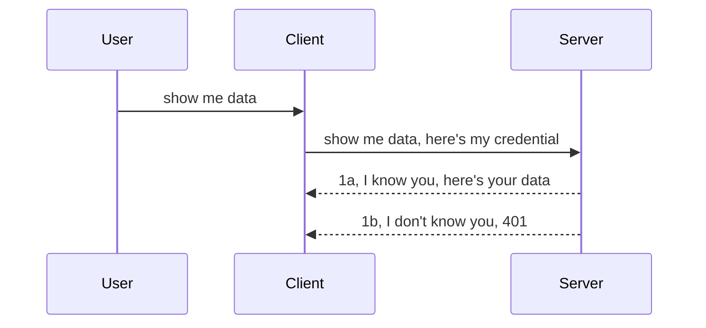

<!--
CO_OP_TRANSLATOR_METADATA:
{
  "original_hash": "5b00b8a8971a07d2d8803be4c9f138f8",
  "translation_date": "2025-10-07T00:40:06+00:00",
  "source_file": "03-GettingStarted/11-simple-auth/README.md",
  "language_code": "bn"
}
-->
# সহজ অথ

MCP SDK-গুলো OAuth 2.1 ব্যবহার সমর্থন করে, যা বেশ জটিল একটি প্রক্রিয়া। এতে অন্তর্ভুক্ত থাকে যেমন অথ সার্ভার, রিসোর্স সার্ভার, ক্রেডেনশিয়াল পোস্ট করা, কোড পাওয়া, কোডকে বেয়ারার টোকেনে রূপান্তর করা, এবং শেষ পর্যন্ত রিসোর্স ডেটা পাওয়া। যদি আপনি OAuth-এর সাথে পরিচিত না হন, যা বাস্তবায়নের জন্য একটি চমৎকার পদ্ধতি, তাহলে একটি সাধারণ অথ দিয়ে শুরু করা এবং ধীরে ধীরে আরও উন্নত নিরাপত্তার দিকে এগিয়ে যাওয়া ভালো। এই অধ্যায়টি সেই উদ্দেশ্যেই তৈরি হয়েছে, যাতে আপনাকে আরও উন্নত অথ-এর দিকে নিয়ে যাওয়া যায়।

## অথ বলতে আমরা কী বুঝি?

অথ বলতে বোঝায় **অথেন্টিকেশন** এবং **অথরাইজেশন**। এর মূল ধারণা হলো আমাদের দুটি কাজ করতে হবে:

- **অথেন্টিকেশন**, যা হলো প্রক্রিয়া যেখানে আমরা যাচাই করি কেউ আমাদের বাড়িতে প্রবেশ করতে পারবে কিনা, অর্থাৎ তারা আমাদের রিসোর্স সার্ভারে প্রবেশের অধিকার রাখে কিনা যেখানে MCP সার্ভারের ফিচারগুলো রয়েছে।
- **অথরাইজেশন**, যা হলো প্রক্রিয়া যেখানে আমরা যাচাই করি ব্যবহারকারী তাদের চাওয়া নির্দিষ্ট রিসোর্সগুলোতে প্রবেশের অধিকার রাখে কিনা। উদাহরণস্বরূপ, তারা এই অর্ডারগুলো বা প্রোডাক্টগুলো দেখতে পারবে কিনা, অথবা তারা কন্টেন্ট পড়তে পারবে কিন্তু মুছতে পারবে না।

## ক্রেডেনশিয়াল: আমরা সিস্টেমকে কীভাবে জানাই আমরা কে

ওয়েব ডেভেলপাররা সাধারণত ক্রেডেনশিয়াল সরবরাহ করার কথা চিন্তা করেন, যা একটি গোপন তথ্য যা বলে দেয় তারা এখানে থাকার অনুমতি পেয়েছে কিনা (**অথেন্টিকেশন**)। এই ক্রেডেনশিয়াল সাধারণত একটি বেস64 এনকোডেড ইউজারনেম এবং পাসওয়ার্ড বা একটি API কী যা নির্দিষ্ট ব্যবহারকারীকে চিহ্নিত করে।

এটি "Authorization" নামক একটি হেডারের মাধ্যমে পাঠানো হয়, যেমন:

```json
{ "Authorization": "secret123" }
```

এটি সাধারণত বেসিক অথেন্টিকেশন নামে পরিচিত। পুরো প্রক্রিয়াটি সাধারণত নিম্নলিখিতভাবে কাজ করে:



এখন আমরা বুঝতে পারি এটি কীভাবে কাজ করে। তাহলে এটি কীভাবে বাস্তবায়ন করা যায়? বেশিরভাগ ওয়েব সার্ভারে একটি ধারণা থাকে যাকে বলা হয় **মিডলওয়্যার**, যা একটি কোডের অংশ যা অনুরোধের অংশ হিসেবে চলে এবং ক্রেডেনশিয়াল যাচাই করতে পারে। যদি ক্রেডেনশিয়াল বৈধ হয়, তাহলে অনুরোধটি পাস করতে দেয়। যদি অনুরোধে বৈধ ক্রেডেনশিয়াল না থাকে, তাহলে অথ ত্রুটি পাওয়া যায়। চলুন দেখে নেওয়া যাক এটি কীভাবে বাস্তবায়ন করা যায়:

**Python**

```python
class AuthMiddleware(BaseHTTPMiddleware):
    async def dispatch(self, request, call_next):

        has_header = request.headers.get("Authorization")
        if not has_header:
            print("-> Missing Authorization header!")
            return Response(status_code=401, content="Unauthorized")

        if not valid_token(has_header):
            print("-> Invalid token!")
            return Response(status_code=403, content="Forbidden")

        print("Valid token, proceeding...")
       
        response = await call_next(request)
        # add any customer headers or change in the response in some way
        return response


starlette_app.add_middleware(CustomHeaderMiddleware)
```

এখানে আমরা:

- `AuthMiddleware` নামে একটি মিডলওয়্যার তৈরি করেছি, যার `dispatch` মেথড ওয়েব সার্ভার দ্বারা আহ্বান করা হয়।
- মিডলওয়্যারটি ওয়েব সার্ভারে যোগ করেছি:

    ```python
    starlette_app.add_middleware(AuthMiddleware)
    ```

- যাচাই করার লজিক লিখেছি যা চেক করে Authorization হেডার উপস্থিত আছে কিনা এবং পাঠানো গোপন তথ্য বৈধ কিনা:

    ```python
    has_header = request.headers.get("Authorization")
    if not has_header:
        print("-> Missing Authorization header!")
        return Response(status_code=401, content="Unauthorized")

    if not valid_token(has_header):
        print("-> Invalid token!")
        return Response(status_code=403, content="Forbidden")
    ```

    যদি গোপন তথ্য উপস্থিত থাকে এবং বৈধ হয়, তাহলে আমরা `call_next` কল করে অনুরোধটি পাস করতে দিই এবং রেসপন্স ফেরত দিই।

    ```python
    response = await call_next(request)
    # add any customer headers or change in the response in some way
    return response
    ```

এটি কাজ করে এভাবে: যদি ওয়েব সার্ভারের দিকে একটি অনুরোধ করা হয়, তাহলে মিডলওয়্যারটি আহ্বান করা হয় এবং এর বাস্তবায়ন অনুযায়ী এটি হয় অনুরোধটি পাস করতে দেয় অথবা একটি ত্রুটি ফেরত দেয় যা নির্দেশ করে ক্লায়েন্টকে এগিয়ে যেতে অনুমতি দেওয়া হয়নি।

**TypeScript**

এখানে আমরা জনপ্রিয় ফ্রেমওয়ার্ক Express ব্যবহার করে একটি মিডলওয়্যার তৈরি করি এবং MCP সার্ভারে পৌঁছানোর আগে অনুরোধটি আটকাই। এর জন্য কোডটি হলো:

```typescript
function isValid(secret) {
    return secret === "secret123";
}

app.use((req, res, next) => {
    // 1. Authorization header present?  
    if(!req.headers["Authorization"]) {
        res.status(401).send('Unauthorized');
    }
    
    let token = req.headers["Authorization"];

    // 2. Check validity.
    if(!isValid(token)) {
        res.status(403).send('Forbidden');
    }

   
    console.log('Middleware executed');
    // 3. Passes request to the next step in the request pipeline.
    next();
});
```

এই কোডে আমরা:

1. প্রথমে চেক করি Authorization হেডার উপস্থিত আছে কিনা। যদি না থাকে, তাহলে আমরা 401 ত্রুটি পাঠাই।
2. ক্রেডেনশিয়াল/টোকেন বৈধ কিনা নিশ্চিত করি। যদি না হয়, তাহলে আমরা 403 ত্রুটি পাঠাই।
3. শেষ পর্যন্ত অনুরোধটি পাইপলাইনে পাস করি এবং চাওয়া রিসোর্সটি ফেরত দিই।

## অনুশীলন: অথেন্টিকেশন বাস্তবায়ন করুন

চলুন আমাদের জ্ঞান ব্যবহার করে এটি বাস্তবায়ন করার চেষ্টা করি। পরিকল্পনাটি হলো:

### সার্ভার

- একটি ওয়েব সার্ভার এবং MCP ইনস্ট্যান্স তৈরি করুন।
- সার্ভারের জন্য একটি মিডলওয়্যার বাস্তবায়ন করুন।

### ক্লায়েন্ট

- হেডারের মাধ্যমে ক্রেডেনশিয়াল সহ ওয়েব অনুরোধ পাঠান।

### -1- একটি ওয়েব সার্ভার এবং MCP ইনস্ট্যান্স তৈরি করুন

প্রথম ধাপে, আমাদের একটি ওয়েব সার্ভার ইনস্ট্যান্স এবং MCP সার্ভার তৈরি করতে হবে।

**Python**

এখানে আমরা একটি MCP সার্ভার ইনস্ট্যান্স তৈরি করি, একটি starlette ওয়েব অ্যাপ তৈরি করি এবং এটি uvicorn দিয়ে হোস্ট করি।

```python
# creating MCP Server

app = FastMCP(
    name="MCP Resource Server",
    instructions="Resource Server that validates tokens via Authorization Server introspection",
    host=settings["host"],
    port=settings["port"],
    debug=True
)

# creating starlette web app
starlette_app = app.streamable_http_app()

# serving app via uvicorn
async def run(starlette_app):
    import uvicorn
    config = uvicorn.Config(
            starlette_app,
            host=app.settings.host,
            port=app.settings.port,
            log_level=app.settings.log_level.lower(),
        )
    server = uvicorn.Server(config)
    await server.serve()

run(starlette_app)
```

এই কোডে আমরা:

- MCP সার্ভার তৈরি করেছি।
- MCP সার্ভার থেকে starlette ওয়েব অ্যাপ তৈরি করেছি, `app.streamable_http_app()`।
- uvicorn ব্যবহার করে ওয়েব অ্যাপটি হোস্ট এবং সার্ভ করেছি `server.serve()`।

**TypeScript**

এখানে আমরা একটি MCP সার্ভার ইনস্ট্যান্স তৈরি করি।

```typescript
const server = new McpServer({
      name: "example-server",
      version: "1.0.0"
    });

    // ... set up server resources, tools, and prompts ...
```

এই MCP সার্ভার তৈরি আমাদের POST /mcp রুট ডেফিনিশনের মধ্যে করতে হবে। চলুন উপরের কোডটি নিচের মতো সরিয়ে নিই:

```typescript
import express from "express";
import { randomUUID } from "node:crypto";
import { McpServer } from "@modelcontextprotocol/sdk/server/mcp.js";
import { StreamableHTTPServerTransport } from "@modelcontextprotocol/sdk/server/streamableHttp.js";
import { isInitializeRequest } from "@modelcontextprotocol/sdk/types.js"

const app = express();
app.use(express.json());

// Map to store transports by session ID
const transports: { [sessionId: string]: StreamableHTTPServerTransport } = {};

// Handle POST requests for client-to-server communication
app.post('/mcp', async (req, res) => {
  // Check for existing session ID
  const sessionId = req.headers['mcp-session-id'] as string | undefined;
  let transport: StreamableHTTPServerTransport;

  if (sessionId && transports[sessionId]) {
    // Reuse existing transport
    transport = transports[sessionId];
  } else if (!sessionId && isInitializeRequest(req.body)) {
    // New initialization request
    transport = new StreamableHTTPServerTransport({
      sessionIdGenerator: () => randomUUID(),
      onsessioninitialized: (sessionId) => {
        // Store the transport by session ID
        transports[sessionId] = transport;
      },
      // DNS rebinding protection is disabled by default for backwards compatibility. If you are running this server
      // locally, make sure to set:
      // enableDnsRebindingProtection: true,
      // allowedHosts: ['127.0.0.1'],
    });

    // Clean up transport when closed
    transport.onclose = () => {
      if (transport.sessionId) {
        delete transports[transport.sessionId];
      }
    };
    const server = new McpServer({
      name: "example-server",
      version: "1.0.0"
    });

    // ... set up server resources, tools, and prompts ...

    // Connect to the MCP server
    await server.connect(transport);
  } else {
    // Invalid request
    res.status(400).json({
      jsonrpc: '2.0',
      error: {
        code: -32000,
        message: 'Bad Request: No valid session ID provided',
      },
      id: null,
    });
    return;
  }

  // Handle the request
  await transport.handleRequest(req, res, req.body);
});

// Reusable handler for GET and DELETE requests
const handleSessionRequest = async (req: express.Request, res: express.Response) => {
  const sessionId = req.headers['mcp-session-id'] as string | undefined;
  if (!sessionId || !transports[sessionId]) {
    res.status(400).send('Invalid or missing session ID');
    return;
  }
  
  const transport = transports[sessionId];
  await transport.handleRequest(req, res);
};

// Handle GET requests for server-to-client notifications via SSE
app.get('/mcp', handleSessionRequest);

// Handle DELETE requests for session termination
app.delete('/mcp', handleSessionRequest);

app.listen(3000);
```

এখন আপনি দেখতে পাচ্ছেন MCP সার্ভার তৈরি `app.post("/mcp")` এর মধ্যে সরানো হয়েছে।

চলুন মিডলওয়্যার তৈরি করার পরবর্তী ধাপে এগিয়ে যাই যাতে আমরা আসা ক্রেডেনশিয়াল যাচাই করতে পারি।

### -2- সার্ভারের জন্য একটি মিডলওয়্যার বাস্তবায়ন করুন

এবার মিডলওয়্যার অংশে আসি। এখানে আমরা একটি মিডলওয়্যার তৈরি করব যা `Authorization` হেডারে ক্রেডেনশিয়াল খুঁজে এবং যাচাই করবে। যদি এটি গ্রহণযোগ্য হয়, তাহলে অনুরোধটি তার কাজ করতে এগিয়ে যাবে (যেমন টুলের তালিকা দেখানো, রিসোর্স পড়া বা ক্লায়েন্টের চাওয়া MCP কার্যকারিতা)।

**Python**

মিডলওয়্যার তৈরি করতে, আমাদের একটি ক্লাস তৈরি করতে হবে যা `BaseHTTPMiddleware` থেকে উত্তরাধিকারী হবে। এখানে দুটি গুরুত্বপূর্ণ অংশ রয়েছে:

- অনুরোধ `request`, যেখান থেকে আমরা হেডার তথ্য পড়ি।
- `call_next`, কলব্যাক যা আমরা আহ্বান করি যদি ক্লায়েন্ট গ্রহণযোগ্য ক্রেডেনশিয়াল নিয়ে আসে।

প্রথমে, আমাদের `Authorization` হেডার অনুপস্থিত থাকলে সেই ক্ষেত্রে হ্যান্ডেল করতে হবে:

```python
has_header = request.headers.get("Authorization")

# no header present, fail with 401, otherwise move on.
if not has_header:
    print("-> Missing Authorization header!")
    return Response(status_code=401, content="Unauthorized")
```

এখানে আমরা 401 অননুমোদিত বার্তা পাঠাই কারণ ক্লায়েন্ট অথেন্টিকেশনে ব্যর্থ হচ্ছে।

পরবর্তী ধাপে, যদি ক্রেডেনশিয়াল জমা দেওয়া হয়, তাহলে আমরা এর বৈধতা যাচাই করি:

```python
 if not valid_token(has_header):
    print("-> Invalid token!")
    return Response(status_code=403, content="Forbidden")
```

উপরের কোডে আমরা 403 নিষিদ্ধ বার্তা পাঠাই। চলুন পুরো মিডলওয়্যারটি দেখি যা আমরা উপরে উল্লেখিত সবকিছু বাস্তবায়ন করে:

```python
class AuthMiddleware(BaseHTTPMiddleware):
    async def dispatch(self, request, call_next):

        has_header = request.headers.get("Authorization")
        if not has_header:
            print("-> Missing Authorization header!")
            return Response(status_code=401, content="Unauthorized")

        if not valid_token(has_header):
            print("-> Invalid token!")
            return Response(status_code=403, content="Forbidden")

        print("Valid token, proceeding...")
        print(f"-> Received {request.method} {request.url}")
        response = await call_next(request)
        response.headers['Custom'] = 'Example'
        return response

```

দারুণ, কিন্তু `valid_token` ফাংশনটি কী? এটি নিচে দেওয়া হলো:

```python
# DON'T use for production - improve it !!
def valid_token(token: str) -> bool:
    # remove the "Bearer " prefix
    if token.startswith("Bearer "):
        token = token[7:]
        return token == "secret-token"
    return False
```

এটি অবশ্যই উন্নত করা উচিত।

গুরুত্বপূর্ণ: কোডে কখনোই গোপন তথ্য রাখা উচিত নয়। আদর্শভাবে, আপনি ডেটা সোর্স বা IDP (আইডেন্টিটি সার্ভিস প্রোভাইডার) থেকে তুলনা করার জন্য মানটি পুনরুদ্ধার করবেন বা আরও ভালো, IDP-কে যাচাই করতে দেবেন।

**TypeScript**

Express দিয়ে এটি বাস্তবায়ন করতে, আমাদের `use` মেথড কল করতে হবে যা মিডলওয়্যার ফাংশন গ্রহণ করে।

আমাদের করতে হবে:

- অনুরোধ ভেরিয়েবল নিয়ে কাজ করতে হবে যাতে `Authorization` প্রপার্টিতে পাঠানো ক্রেডেনশিয়াল চেক করা যায়।
- ক্রেডেনশিয়াল যাচাই করতে হবে, এবং যদি বৈধ হয়, তাহলে অনুরোধটি চালিয়ে যেতে দিতে হবে এবং ক্লায়েন্টের MCP অনুরোধটি তার কাজ করতে দেবে (যেমন টুলের তালিকা দেখানো, রিসোর্স পড়া বা MCP সম্পর্কিত অন্য কিছু)।

এখানে আমরা চেক করি `Authorization` হেডার উপস্থিত আছে কিনা। যদি না থাকে, তাহলে আমরা অনুরোধটি থামিয়ে দিই:

```typescript
if(!req.headers["authorization"]) {
    res.status(401).send('Unauthorized');
    return;
}
```

যদি হেডার প্রথমেই পাঠানো না হয়, তাহলে আপনি 401 পাবেন।

পরবর্তী ধাপে, আমরা ক্রেডেনশিয়াল বৈধ কিনা চেক করি। যদি না হয়, তাহলে আমরা আবার অনুরোধ থামিয়ে দিই কিন্তু একটু ভিন্ন বার্তা দিয়ে:

```typescript
if(!isValid(token)) {
    res.status(403).send('Forbidden');
    return;
} 
```

এখানে আপনি 403 ত্রুটি পান।

পুরো কোডটি এখানে:

```typescript
app.use((req, res, next) => {
    console.log('Request received:', req.method, req.url, req.headers);
    console.log('Headers:', req.headers["authorization"]);
    if(!req.headers["authorization"]) {
        res.status(401).send('Unauthorized');
        return;
    }
    
    let token = req.headers["authorization"];

    if(!isValid(token)) {
        res.status(403).send('Forbidden');
        return;
    }  

    console.log('Middleware executed');
    next();
});
```

আমরা ওয়েব সার্ভার সেটআপ করেছি যাতে এটি মিডলওয়্যার গ্রহণ করে এবং ক্লায়েন্ট আমাদের পাঠানো ক্রেডেনশিয়াল চেক করে। কিন্তু ক্লায়েন্ট নিজেই কীভাবে কাজ করবে?

### -3- হেডারের মাধ্যমে ক্রেডেনশিয়াল সহ ওয়েব অনুরোধ পাঠান

আমাদের নিশ্চিত করতে হবে ক্লায়েন্ট হেডারের মাধ্যমে ক্রেডেনশিয়াল পাঠাচ্ছে। যেহেতু আমরা MCP ক্লায়েন্ট ব্যবহার করতে যাচ্ছি, আমাদের জানতে হবে এটি কীভাবে করা হয়।

**Python**

ক্লায়েন্টের জন্য, আমাদের একটি হেডার সহ ক্রেডেনশিয়াল পাঠাতে হবে, যেমন:

```python
# DON'T hardcode the value, have it at minimum in an environment variable or a more secure storage
token = "secret-token"

async with streamablehttp_client(
        url = f"http://localhost:{port}/mcp",
        headers = {"Authorization": f"Bearer {token}"}
    ) as (
        read_stream,
        write_stream,
        session_callback,
    ):
        async with ClientSession(
            read_stream,
            write_stream
        ) as session:
            await session.initialize()
      
            # TODO, what you want done in the client, e.g list tools, call tools etc.
```

এখানে আমরা `headers` প্রপার্টি এভাবে পূরণ করেছি: `headers = {"Authorization": f"Bearer {token}"}`।

**TypeScript**

আমরা এটি দুটি ধাপে সমাধান করতে পারি:

1. একটি কনফিগারেশন অবজেক্ট তৈরি করুন যাতে আমাদের ক্রেডেনশিয়াল থাকে।
2. কনফিগারেশন অবজেক্টটি ট্রান্সপোর্টে পাঠান।

```typescript

// DON'T hardcode the value like shown here. At minimum have it as a env variable and use something like dotenv (in dev mode).
let token = "secret123"

// define a client transport option object
let options: StreamableHTTPClientTransportOptions = {
  sessionId: sessionId,
  requestInit: {
    headers: {
      "Authorization": "secret123"
    }
  }
};

// pass the options object to the transport
async function main() {
   const transport = new StreamableHTTPClientTransport(
      new URL(serverUrl),
      options
   );
```

এখানে আপনি দেখতে পাচ্ছেন আমরা একটি `options` অবজেক্ট তৈরি করেছি এবং আমাদের হেডারগুলো `requestInit` প্রপার্টির অধীনে রেখেছি।

গুরুত্বপূর্ণ: এখান থেকে কীভাবে উন্নতি করা যায়? বর্তমান বাস্তবায়নে কিছু সমস্যা রয়েছে। প্রথমত, এভাবে ক্রেডেনশিয়াল পাঠানো বেশ ঝুঁকিপূর্ণ যদি আপনার কমপক্ষে HTTPS না থাকে। এমনকি তখনও, ক্রেডেনশিয়াল চুরি হতে পারে, তাই আপনার এমন একটি সিস্টেম দরকার যেখানে আপনি সহজেই টোকেনটি বাতিল করতে পারেন এবং অতিরিক্ত চেক যোগ করতে পারেন যেমন এটি কোথা থেকে আসছে, অনুরোধটি খুব বেশি ঘন ঘন হচ্ছে কিনা (বটের মতো আচরণ), সংক্ষেপে, অনেক বিষয় বিবেচনা করতে হবে।

তবে, খুব সাধারণ API-এর জন্য যেখানে আপনি চান না কেউ আপনার API অথেন্টিকেশন ছাড়া কল করুক, এখানে যা আছে তা একটি ভালো শুরু।

এটি বলার পর, চলুন নিরাপত্তা একটু শক্তিশালী করার চেষ্টা করি এবং JSON Web Token, যা JWT বা "JOT" টোকেন নামে পরিচিত, ব্যবহার করি।

## JSON Web Tokens, JWT

তাহলে, আমরা খুব সাধারণ ক্রেডেনশিয়াল পাঠানোর পরিবর্তে উন্নতি করার চেষ্টা করছি। JWT গ্রহণ করলে আমরা কী কী তাৎক্ষণিক উন্নতি পাই?

- **নিরাপত্তার উন্নতি**। বেসিক অথ-এ, আপনি বারবার ইউজারনেম এবং পাসওয়ার্ড বেস64 এনকোডেড টোকেন (অথবা API কী) পাঠান যা ঝুঁকি বাড়ায়। JWT-এ, আপনি আপনার ইউজারনেম এবং পাসওয়ার্ড পাঠান এবং একটি টোকেন পান যা সময়সীমাবদ্ধ অর্থাৎ এটি মেয়াদোত্তীর্ণ হবে। JWT আপনাকে সহজেই রোল, স্কোপ এবং পারমিশন ব্যবহার করে সূক্ষ্ম-গ্রেড অথরাইজেশন নিয়ন্ত্রণ করতে দেয়।
- **স্টেটলেসনেস এবং স্কেলেবিলিটি**। JWT স্বয়ংসম্পূর্ণ, এটি সমস্ত ব্যবহারকারীর তথ্য বহন করে এবং সার্ভার-সাইড সেশন স্টোরেজের প্রয়োজনীয়তা দূর করে। টোকেন স্থানীয়ভাবে যাচাই করা যায়।
- **ইন্টারঅপারেবিলিটি এবং ফেডারেশন**। JWT Open ID Connect-এর কেন্দ্রে রয়েছে এবং এটি Entra ID, Google Identity এবং Auth0-এর মতো পরিচিত আইডেন্টিটি প্রোভাইডারগুলোর সাথে ব্যবহার করা হয়। এটি সিঙ্গেল সাইন অন এবং আরও অনেক কিছু সম্ভব করে তোলে যা এটিকে এন্টারপ্রাইজ-গ্রেড করে তোলে।
- **মডুলারিটি এবং নমনীয়তা**। JWT API গেটওয়ে যেমন Azure API Management, NGINX এবং আরও অনেক কিছুর সাথে ব্যবহার করা যায়। এটি অথেন্টিকেশন এবং সার্ভার-টু-সার্ভিস যোগাযোগের মতো বিভিন্ন পরিস্থিতি সমর্থন করে।
- **পারফরম্যান্স এবং ক্যাশিং**। JWT ডিকোড করার পরে ক্যাশ করা যায় যা পার্সিংয়ের প্রয়োজনীয়তা কমায়। এটি বিশেষভাবে উচ্চ-ট্রাফিক অ্যাপগুলোর ক্ষেত্রে throughput উন্নত করে এবং আপনার নির্বাচিত অবকাঠামোর উপর লোড কমায়।
- **উন্নত বৈশিষ্ট্য**। এটি ইন্ট্রোস্পেকশন (সার্ভারে বৈধতা পরীক্ষা) এবং রিভোকেশন (টোকেনকে অকার্যকর করা) সমর্থন করে।

এই সমস্ত সুবিধার সাথে, চলুন দেখি আমরা কীভাবে আমাদের বাস্তবায়নকে পরবর্তী স্তরে নিয়ে যেতে পারি।

## বেসিক অথ থেকে JWT-এ রূপান্তর

তাহলে, আমাদের যে পরিবর্তনগুলো করতে হবে তা হলো:

- **JWT টোকেন তৈরি করা শিখুন** এবং এটি ক্লায়েন্ট থেকে সার্ভারে পাঠানোর জন্য প্রস্তুত করুন।
- **JWT টোকেন যাচাই করুন**, এবং যদি বৈধ হয়, তাহলে ক্লায়েন্টকে আমাদের রিসোর্স দিতে দিন।
- **টোকেন সংরক্ষণের নিরাপত্তা**। আমরা এই টোকেন কীভাবে সংরক্ষণ করব।
- **রুটগুলো সুরক্ষিত করুন**। আমাদের রুট এবং নির্দিষ্ট MCP ফিচারগুলো সুরক্ষিত করতে হবে।
- **রিফ্রেশ টোকেন যোগ করুন**। নিশ্চিত করুন আমরা স্বল্প-মেয়াদী টোকেন তৈরি করছি কিন্তু দীর্ঘ-মেয়াদী রিফ্রেশ টোকেন তৈরি করছি যা মেয়াদোত্তীর্ণ হলে নতুন টোকেন পেতে ব্যবহার করা যায়। এছাড়াও একটি রিফ্রেশ এন্ডপয়েন্ট এবং একটি রোটেশন স্ট্র্যাটেজি নিশ্চিত করুন।

### -1- JWT টোকেন তৈরি করা

প্রথমত, একটি JWT টোকেনের নিম্নলিখিত অংশগুলো থাকে:

- **হেডার**, ব্যবহৃত অ্যালগরিদম এবং টোকেনের ধরন।
- **পেলোড**, ক্লেইমস, যেমন sub (ব্যবহারকারী বা টোকেন যে সত্তাকে প্রতিনিধিত্ব করে। অথেন্টিকেশন ক্ষেত্রে এটি সাধারণত userid), exp (মেয়াদোত্তীর্ণ হওয়ার সময়), role (রোল)।
- **সিগনেচার**, একটি গোপন বা প্রাইভেট কী দিয়ে সাইন করা।

এর জন্য, আমাদের হেডার, পেলোড এবং এনকোডেড টোকেন তৈরি করতে হবে।

**Python**

```python

import jwt
import jwt
from jwt.exceptions import ExpiredSignatureError, InvalidTokenError
import datetime

# Secret key used to sign the JWT
secret_key = 'your-secret-key'

header = {
    "alg": "HS256",
    "typ": "JWT"
}

# the user info andits claims and expiry time
payload = {
    "sub": "1234567890",               # Subject (user ID)
    "name": "User Userson",                # Custom claim
    "admin": True,                     # Custom claim
    "iat": datetime.datetime.utcnow(),# Issued at
    "exp": datetime.datetime.utcnow() + datetime.timedelta(hours=1)  # Expiry
}

# encode it
encoded_jwt = jwt.encode(payload, secret_key, algorithm="HS256", headers=header)
```

উপরের কোডে আমরা:

- HS256 অ্যালগরিদম এবং JWT টাইপ ব্যবহার করে একটি হেডার সংজ্ঞায়িত করেছি।
- একটি পেলোড তৈরি করেছি যা একটি সাবজেক্ট বা ইউজার আইডি, একটি ইউজারনেম, একটি রোল, কখন এটি ইস্যু করা হয়েছে এবং কখন এটি মেয়াদোত্তীর্ণ হবে তা অন্তর্ভুক্ত করে। এর মাধ্যমে আমরা পূর্বে উল্লেখিত সময়সীমাবদ্ধ দিকটি বাস্তবায়ন করেছি।

**TypeScript**

এখানে আমাদের কিছু ডিপেনডেন্সি লাগবে যা আমাদের JWT টোকেন তৈরি করতে সাহায্য করবে।

ডিপেনডেন্সি

```sh

npm install jsonwebtoken
npm install --save-dev @types/jsonwebtoken
```

এখন যেহেতু এটি প্রস্তুত, চলুন হেডার, পেলোড তৈরি করি এবং এর মাধ্যমে এনকোডেড টোকেন তৈরি করি।

```typescript
import jwt from 'jsonwebtoken';

const secretKey = 'your-secret-key'; // Use env vars in production

// Define the payload
const payload = {
  sub: '1234567890',
  name: 'User usersson',
  admin: true,
  iat: Math.floor(Date.now() / 1000), // Issued at
  exp: Math.floor(Date.now() / 1000) + 60 * 60 // Expires in 1 hour
};

// Define the header (optional, jsonwebtoken sets defaults)
const header = {
  alg: 'HS256',
  typ: 'JWT'
};

// Create the token
const token = jwt.sign(payload, secretKey, {
  algorithm: 'HS256',
  header: header
});

console.log('JWT:', token);
```

এই টোকেনটি:

HS256 ব্যবহার করে সাইন করা হয়েছে।
1 ঘণ্টার জন্য বৈধ।
sub, name, admin, iat এবং exp-এর মতো ক্লেইম অন্তর্ভুক্ত করে।

### -2- টোকেন যাচাই করা

আমাদের টোকেন যাচাই করতেও হবে। এটি সার্ভারে করা উচিত যাতে নিশ্চিত করা যায় ক্লায়েন্ট আমাদের যা পাঠাচ্ছে তা আসলে বৈধ। এখানে অনেক চেক করা উচিত, যেমন এর গঠন যাচাই করা এবং এর বৈধতা। এছাড়াও, আপনি অতিরিক্ত চেক যোগ করতে পারেন, যেমন ব্যবহারকারী আমাদের সিস্টেমে আছে কিনা এবং আরও অনেক কিছু।

টোকেন যাচাই করতে, আমাদের এটি ডিকোড করতে হবে যাতে আমরা এটি পড়তে পারি এবং তারপর এর বৈধতা যাচাই করতে পারি:

**Python**

```python

# Decode and verify the JWT
try:
    decoded = jwt.decode(token, secret_key, algorithms=["HS256"])
    print("✅ Token is valid.")
    print("Decoded claims:")
    for key, value in decoded.items():
        print(f"  {key}: {value}")
except ExpiredSignatureError:
    print("❌ Token has expired.")
except InvalidTokenError as e:
    print(f"❌ Invalid token: {e}")

```

এই কোডে, আমরা `jwt.decode` কল করি টোকেন, গোপন কী এবং নির্বাচিত অ্যালগরিদম ইনপুট হিসেবে ব্যবহার করে। লক্ষ্য করুন আমরা একটি try-catch কনস্ট্রাক্ট ব্যবহার করেছি কারণ ব্যর্থ যাচাই একটি ত্রুটি তৈরি করে।

**TypeScript**

এখানে আমাদের `jwt.verify`
পরবর্তী ধাপে, আসুন ভূমিকা ভিত্তিক অ্যাক্সেস নিয়ন্ত্রণ, যা RBAC নামেও পরিচিত, সম্পর্কে আলোচনা করি।

## ভূমিকা ভিত্তিক অ্যাক্সেস নিয়ন্ত্রণ যোগ করা

মূল ধারণাটি হলো আমরা প্রকাশ করতে চাই যে বিভিন্ন ভূমিকার বিভিন্ন অনুমতি রয়েছে। উদাহরণস্বরূপ, আমরা ধরে নিচ্ছি যে একজন অ্যাডমিন সবকিছু করতে পারে, একজন সাধারণ ব্যবহারকারী পড়া/লেখা করতে পারে এবং একজন অতিথি শুধুমাত্র পড়তে পারে। সুতরাং, এখানে কিছু সম্ভাব্য অনুমতির স্তর রয়েছে:

- Admin.Write 
- User.Read
- Guest.Read

আসুন দেখি কীভাবে আমরা এই ধরনের নিয়ন্ত্রণ মিডলওয়্যারের মাধ্যমে বাস্তবায়ন করতে পারি। মিডলওয়্যারগুলি নির্দিষ্ট রুটের জন্য এবং সমস্ত রুটের জন্য যোগ করা যেতে পারে।

**Python**

```python
from starlette.middleware.base import BaseHTTPMiddleware
from starlette.responses import JSONResponse
import jwt

# DON'T have the secret in the code like, this is for demonstration purposes only. Read it from a safe place.
SECRET_KEY = "your-secret-key" # put this in env variable
REQUIRED_PERMISSION = "User.Read"

class JWTPermissionMiddleware(BaseHTTPMiddleware):
    async def dispatch(self, request, call_next):
        auth_header = request.headers.get("Authorization")
        if not auth_header or not auth_header.startswith("Bearer "):
            return JSONResponse({"error": "Missing or invalid Authorization header"}, status_code=401)

        token = auth_header.split(" ")[1]
        try:
            decoded = jwt.decode(token, SECRET_KEY, algorithms=["HS256"])
        except jwt.ExpiredSignatureError:
            return JSONResponse({"error": "Token expired"}, status_code=401)
        except jwt.InvalidTokenError:
            return JSONResponse({"error": "Invalid token"}, status_code=401)

        permissions = decoded.get("permissions", [])
        if REQUIRED_PERMISSION not in permissions:
            return JSONResponse({"error": "Permission denied"}, status_code=403)

        request.state.user = decoded
        return await call_next(request)


```

নিচের মতো কয়েকটি ভিন্ন উপায়ে মিডলওয়্যার যোগ করা যেতে পারে:

```python

# Alt 1: add middleware while constructing starlette app
middleware = [
    Middleware(JWTPermissionMiddleware)
]

app = Starlette(routes=routes, middleware=middleware)

# Alt 2: add middleware after starlette app is a already constructed
starlette_app.add_middleware(JWTPermissionMiddleware)

# Alt 3: add middleware per route
routes = [
    Route(
        "/mcp",
        endpoint=..., # handler
        middleware=[Middleware(JWTPermissionMiddleware)]
    )
]
```

**TypeScript**

আমরা `app.use` এবং একটি মিডলওয়্যার ব্যবহার করতে পারি যা সমস্ত অনুরোধের জন্য চলবে।

```typescript
app.use((req, res, next) => {
    console.log('Request received:', req.method, req.url, req.headers);
    console.log('Headers:', req.headers["authorization"]);

    // 1. Check if authorization header has been sent

    if(!req.headers["authorization"]) {
        res.status(401).send('Unauthorized');
        return;
    }
    
    let token = req.headers["authorization"];

    // 2. Check if token is valid
    if(!isValid(token)) {
        res.status(403).send('Forbidden');
        return;
    }  

    // 3. Check if token user exist in our system
    if(!isExistingUser(token)) {
        res.status(403).send('Forbidden');
        console.log("User does not exist");
        return;
    }
    console.log("User exists");

    // 4. Verify the token has the right permissions
    if(!hasScopes(token, ["User.Read"])){
        res.status(403).send('Forbidden - insufficient scopes');
    }

    console.log("User has required scopes");

    console.log('Middleware executed');
    next();
});

```

আমাদের মিডলওয়্যার দিয়ে আমরা অনেক কিছু করতে পারি এবং আমাদের মিডলওয়্যার যা করা উচিত তা হলো:

1. চেক করা যে অথরাইজেশন হেডার উপস্থিত আছে কিনা
2. চেক করা যে টোকেন বৈধ কিনা, আমরা `isValid` নামক একটি মেথড কল করি যা JWT টোকেনের অখণ্ডতা এবং বৈধতা পরীক্ষা করে।
3. যাচাই করা যে ব্যবহারকারী আমাদের সিস্টেমে বিদ্যমান কিনা, আমাদের এটি পরীক্ষা করা উচিত।

   ```typescript
    // users in DB
   const users = [
     "user1",
     "User usersson",
   ]

   function isExistingUser(token) {
     let decodedToken = verifyToken(token);

     // TODO, check if user exists in DB
     return users.includes(decodedToken?.name || "");
   }
   ```

   উপরে, আমরা একটি খুব সাধারণ `users` তালিকা তৈরি করেছি, যা অবশ্যই একটি ডাটাবেসে থাকা উচিত।

4. অতিরিক্তভাবে, আমাদের টোকেনের সঠিক অনুমতি আছে কিনা তাও পরীক্ষা করা উচিত।

   ```typescript
   if(!hasScopes(token, ["User.Read"])){
        res.status(403).send('Forbidden - insufficient scopes');
   }
   ```

   উপরের কোডে মিডলওয়্যার থেকে, আমরা পরীক্ষা করি যে টোকেনটি User.Read অনুমতি ধারণ করে কিনা, যদি না করে তবে আমরা একটি 403 ত্রুটি পাঠাই। নিচে `hasScopes` হেল্পার মেথড রয়েছে।

   ```typescript
   function hasScopes(scope: string, requiredScopes: string[]) {
     let decodedToken = verifyToken(scope);
    return requiredScopes.every(scope => decodedToken?.scopes.includes(scope));
  }
   ```

Have a think which additional checks you should be doing, but these are the absolute minimum of checks you should be doing.

Using Express as a web framework is a common choice. There are helpers library when you use JWT so you can write less code.

- `express-jwt`, helper library that provides a middleware that helps decode your token.
- `express-jwt-permissions`, this provides a middleware `guard` that helps check if a certain permission is on the token.

Here's what these libraries can look like when used:

```typescript
const express = require('express');
const jwt = require('express-jwt');
const guard = require('express-jwt-permissions')();

const app = express();
const secretKey = 'your-secret-key'; // put this in env variable

// Decode JWT and attach to req.user
app.use(jwt({ secret: secretKey, algorithms: ['HS256'] }));

// Check for User.Read permission
app.use(guard.check('User.Read'));

// multiple permissions
// app.use(guard.check(['User.Read', 'Admin.Access']));

app.get('/protected', (req, res) => {
  res.json({ message: `Welcome ${req.user.name}` });
});

// Error handler
app.use((err, req, res, next) => {
  if (err.code === 'permission_denied') {
    return res.status(403).send('Forbidden');
  }
  next(err);
});

```

এখন আপনি দেখেছেন কীভাবে মিডলওয়্যার ব্যবহার করে প্রমাণীকরণ এবং অনুমোদন করা যায়, কিন্তু MCP এর ক্ষেত্রে কী হবে, এটি কি আমাদের প্রমাণীকরণ পদ্ধতিতে পরিবর্তন আনে? আসুন পরবর্তী অংশে এটি খুঁজে বের করি।

### -3- MCP-তে RBAC যোগ করা

আপনি এতক্ষণ দেখেছেন কীভাবে মিডলওয়্যার ব্যবহার করে RBAC যোগ করা যায়, তবে MCP-এর জন্য প্রতি MCP ফিচারে RBAC যোগ করার সহজ উপায় নেই, তাহলে আমরা কী করব? ঠিক আছে, আমাদের এই ধরনের কোড যোগ করতে হবে যা এই ক্ষেত্রে পরীক্ষা করে যে ক্লায়েন্টের নির্দিষ্ট টুল কল করার অধিকার আছে কিনা:

প্রতি ফিচারে RBAC সম্পন্ন করার জন্য আপনার কয়েকটি ভিন্ন পছন্দ রয়েছে, এখানে কিছু:

- প্রতিটি টুল, রিসোর্স, প্রম্পটের জন্য একটি চেক যোগ করুন যেখানে আপনাকে অনুমতির স্তর পরীক্ষা করতে হবে।

   **python**

   ```python
   @tool()
   def delete_product(id: int):
      try:
          check_permissions(role="Admin.Write", request)
      catch:
        pass # client failed authorization, raise authorization error
   ```

   **typescript**

   ```typescript
   server.registerTool(
    "delete-product",
    {
      title: Delete a product",
      description: "Deletes a product",
      inputSchema: { id: z.number() }
    },
    async ({ id }) => {
      
      try {
        checkPermissions("Admin.Write", request);
        // todo, send id to productService and remote entry
      } catch(Exception e) {
        console.log("Authorization error, you're not allowed");  
      }

      return {
        content: [{ type: "text", text: `Deletected product with id ${id}` }]
      };
    }
   );
   ```


- উন্নত সার্ভার পদ্ধতি এবং অনুরোধ হ্যান্ডলার ব্যবহার করুন যাতে আপনি যতটা সম্ভব কম জায়গায় চেক করতে পারেন।

   **Python**

   ```python
   
   tool_permission = {
      "create_product": ["User.Write", "Admin.Write"],
      "delete_product": ["Admin.Write"]
   }

   def has_permission(user_permissions, required_permissions) -> bool:
      # user_permissions: list of permissions the user has
      # required_permissions: list of permissions required for the tool
      return any(perm in user_permissions for perm in required_permissions)

   @server.call_tool()
   async def handle_call_tool(
     name: str, arguments: dict[str, str] | None
   ) -> list[types.TextContent]:
    # Assume request.user.permissions is a list of permissions for the user
     user_permissions = request.user.permissions
     required_permissions = tool_permission.get(name, [])
     if not has_permission(user_permissions, required_permissions):
        # Raise error "You don't have permission to call tool {name}"
        raise Exception(f"You don't have permission to call tool {name}")
     # carry on and call tool
     # ...
   ```   
   

   **TypeScript**

   ```typescript
   function hasPermission(userPermissions: string[], requiredPermissions: string[]): boolean {
       if (!Array.isArray(userPermissions) || !Array.isArray(requiredPermissions)) return false;
       // Return true if user has at least one required permission
       
       return requiredPermissions.some(perm => userPermissions.includes(perm));
   }
  
   server.setRequestHandler(CallToolRequestSchema, async (request) => {
      const { params: { name } } = request;
  
      let permissions = request.user.permissions;
  
      if (!hasPermission(permissions, toolPermissions[name])) {
         return new Error(`You don't have permission to call ${name}`);
      }
  
      // carry on..
   });
   ```

   মনে রাখবেন, আপনাকে নিশ্চিত করতে হবে যে আপনার মিডলওয়্যার অনুরোধের user প্রপার্টিতে একটি ডিকোড করা টোকেন অ্যাসাইন করে যাতে উপরের কোডটি সহজ হয়।

### সংক্ষেপে

এখন আমরা সাধারণভাবে এবং MCP-এর জন্য RBAC যোগ করার বিষয়ে আলোচনা করেছি, এটি আপনার নিজের নিরাপত্তা বাস্তবায়নের চেষ্টা করার সময় যাতে আপনি উপস্থাপিত ধারণাগুলি বুঝতে পারেন।

## অ্যাসাইনমেন্ট ১: বেসিক অথেন্টিকেশন ব্যবহার করে একটি MCP সার্ভার এবং MCP ক্লায়েন্ট তৈরি করুন

এখানে আপনি যা শিখেছেন তা ব্যবহার করবেন, যেমন হেডারের মাধ্যমে ক্রেডেনশিয়াল পাঠানো।

## সমাধান ১

[Solution 1](./code/basic/README.md)

## অ্যাসাইনমেন্ট ২: অ্যাসাইনমেন্ট ১-এর সমাধানটি JWT ব্যবহার করে আপগ্রেড করুন

প্রথম সমাধানটি নিন তবে এবার, এটি উন্নত করুন।

বেসিক অথেন্টিকেশন ব্যবহার করার পরিবর্তে, এবার JWT ব্যবহার করুন।

## সমাধান ২

[Solution 2](./solution/jwt-solution/README.md)

## চ্যালেঞ্জ

"Add RBAC to MCP" অংশে আমরা যা বর্ণনা করেছি তা অনুযায়ী প্রতি টুলে RBAC যোগ করুন।

## সারসংক্ষেপ

এই অধ্যায়ে আপনি আশা করি অনেক কিছু শিখেছেন, কোনো নিরাপত্তা না থাকা থেকে শুরু করে বেসিক নিরাপত্তা, JWT এবং কীভাবে এটি MCP-তে যোগ করা যায়।

আমরা কাস্টম JWT-এর সাথে একটি শক্ত ভিত্তি তৈরি করেছি, তবে যখন আমরা স্কেল করি, তখন আমরা একটি স্ট্যান্ডার্ড-ভিত্তিক পরিচয় মডেলের দিকে এগিয়ে যাচ্ছি। Entra বা Keycloak-এর মতো একটি IdP গ্রহণ করলে আমাদের টোকেন ইস্যু করা, যাচাই করা এবং লাইফসাইকেল ম্যানেজমেন্ট একটি বিশ্বস্ত প্ল্যাটফর্মে স্থানান্তর করতে দেয় — যা আমাদের অ্যাপ্লিকেশন লজিক এবং ব্যবহারকারীর অভিজ্ঞতার উপর মনোযোগ কেন্দ্রীভূত করতে মুক্ত করে।

এর জন্য, আমাদের কাছে একটি আরও [উন্নত অধ্যায় Entra নিয়ে](../../05-AdvancedTopics/mcp-security-entra/README.md) রয়েছে।

---

**অস্বীকৃতি**:  
এই নথিটি AI অনুবাদ পরিষেবা [Co-op Translator](https://github.com/Azure/co-op-translator) ব্যবহার করে অনুবাদ করা হয়েছে। আমরা যথাসাধ্য সঠিকতা নিশ্চিত করার চেষ্টা করি, তবে অনুগ্রহ করে মনে রাখবেন যে স্বয়ংক্রিয় অনুবাদে ত্রুটি বা অসঙ্গতি থাকতে পারে। মূল ভাষায় থাকা নথিটিকে প্রামাণিক উৎস হিসেবে বিবেচনা করা উচিত। গুরুত্বপূর্ণ তথ্যের জন্য, পেশাদার মানব অনুবাদ সুপারিশ করা হয়। এই অনুবাদ ব্যবহারের ফলে কোনো ভুল বোঝাবুঝি বা ভুল ব্যাখ্যা হলে আমরা দায়বদ্ধ থাকব না।