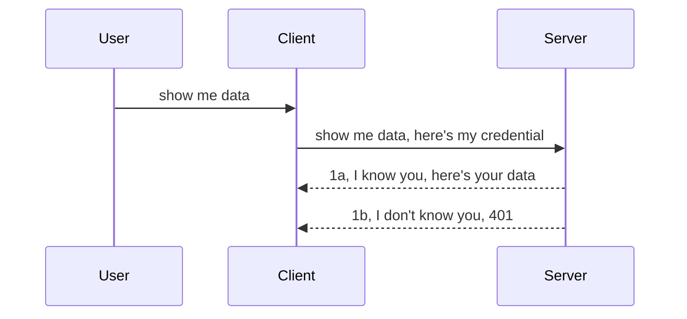

<!--
CO_OP_TRANSLATOR_METADATA:
{
  "original_hash": "5b00b8a8971a07d2d8803be4c9f138f8",
  "translation_date": "2025-10-07T00:46:27+00:00",
  "source_file": "03-GettingStarted/11-simple-auth/README.md",
  "language_code": "br"
}
-->
# Autenticação simples

Os SDKs do MCP suportam o uso de OAuth 2.1, que, para ser justo, é um processo bastante complexo envolvendo conceitos como servidor de autenticação, servidor de recursos, envio de credenciais, obtenção de um código, troca do código por um token de acesso até que você finalmente possa acessar os dados do recurso. Se você não está acostumado com OAuth, que é uma ótima solução para implementar, é uma boa ideia começar com um nível básico de autenticação e evoluir para uma segurança cada vez melhor. É por isso que este capítulo existe: para ajudá-lo a avançar para métodos de autenticação mais avançados.

## Autenticação, o que queremos dizer?

Autenticação é uma abreviação para autenticação e autorização. A ideia é que precisamos fazer duas coisas:

- **Autenticação**, que é o processo de determinar se permitimos que uma pessoa entre em nossa casa, ou seja, se ela tem o direito de estar "aqui", ou seja, ter acesso ao nosso servidor de recursos onde as funcionalidades do MCP Server estão.
- **Autorização**, que é o processo de descobrir se um usuário deve ter acesso aos recursos específicos que está solicitando, por exemplo, esses pedidos ou esses produtos, ou se ele pode apenas ler o conteúdo, mas não excluí-lo, como outro exemplo.

## Credenciais: como informamos ao sistema quem somos

Bem, a maioria dos desenvolvedores web começa pensando em fornecer uma credencial ao servidor, geralmente um segredo que indica se eles têm permissão para estar "aqui" (autenticação). Essa credencial geralmente é uma versão codificada em base64 de nome de usuário e senha ou uma chave de API que identifica exclusivamente um usuário específico.

Isso envolve enviá-la por meio de um cabeçalho chamado "Authorization", como segue:

```json
{ "Authorization": "secret123" }
```

Isso geralmente é chamado de autenticação básica. O fluxo geral funciona da seguinte maneira:



Agora que entendemos como funciona do ponto de vista do fluxo, como implementá-lo? Bem, a maioria dos servidores web tem um conceito chamado middleware, um pedaço de código que é executado como parte da solicitação e pode verificar as credenciais. Se as credenciais forem válidas, a solicitação pode prosseguir. Se a solicitação não tiver credenciais válidas, você receberá um erro de autenticação. Vamos ver como isso pode ser implementado:

**Python**

```python
class AuthMiddleware(BaseHTTPMiddleware):
    async def dispatch(self, request, call_next):

        has_header = request.headers.get("Authorization")
        if not has_header:
            print("-> Missing Authorization header!")
            return Response(status_code=401, content="Unauthorized")

        if not valid_token(has_header):
            print("-> Invalid token!")
            return Response(status_code=403, content="Forbidden")

        print("Valid token, proceeding...")
       
        response = await call_next(request)
        # add any customer headers or change in the response in some way
        return response


starlette_app.add_middleware(CustomHeaderMiddleware)
```

Aqui temos:

- Criado um middleware chamado `AuthMiddleware`, onde seu método `dispatch` é invocado pelo servidor web.
- Adicionado o middleware ao servidor web:

    ```python
    starlette_app.add_middleware(AuthMiddleware)
    ```

- Escrito a lógica de validação que verifica se o cabeçalho Authorization está presente e se o segredo enviado é válido:

    ```python
    has_header = request.headers.get("Authorization")
    if not has_header:
        print("-> Missing Authorization header!")
        return Response(status_code=401, content="Unauthorized")

    if not valid_token(has_header):
        print("-> Invalid token!")
        return Response(status_code=403, content="Forbidden")
    ```

    Se o segredo estiver presente e for válido, permitimos que a solicitação prossiga chamando `call_next` e retornamos a resposta.

    ```python
    response = await call_next(request)
    # add any customer headers or change in the response in some way
    return response
    ```

Como funciona: se uma solicitação web for feita ao servidor, o middleware será invocado e, com base em sua implementação, permitirá que a solicitação prossiga ou retornará um erro indicando que o cliente não tem permissão para continuar.

**TypeScript**

Aqui criamos um middleware com o popular framework Express e interceptamos a solicitação antes que ela chegue ao MCP Server. Aqui está o código para isso:

```typescript
function isValid(secret) {
    return secret === "secret123";
}

app.use((req, res, next) => {
    // 1. Authorization header present?  
    if(!req.headers["Authorization"]) {
        res.status(401).send('Unauthorized');
    }
    
    let token = req.headers["Authorization"];

    // 2. Check validity.
    if(!isValid(token)) {
        res.status(403).send('Forbidden');
    }

   
    console.log('Middleware executed');
    // 3. Passes request to the next step in the request pipeline.
    next();
});
```

Neste código, fazemos o seguinte:

1. Verificamos se o cabeçalho Authorization está presente; caso contrário, enviamos um erro 401.
2. Garantimos que a credencial/token seja válida; caso contrário, enviamos um erro 403.
3. Finalmente, passamos a solicitação no pipeline de requisições e retornamos o recurso solicitado.

## Exercício: Implementar autenticação

Vamos usar nosso conhecimento e tentar implementá-lo. Aqui está o plano:

Servidor

- Criar um servidor web e uma instância do MCP.
- Implementar um middleware para o servidor.

Cliente 

- Enviar uma solicitação web, com credencial, via cabeçalho.

### -1- Criar um servidor web e uma instância do MCP

No primeiro passo, precisamos criar a instância do servidor web e do MCP Server.

**Python**

Aqui criamos uma instância do MCP Server, um aplicativo web starlette e o hospedamos com uvicorn.

```python
# creating MCP Server

app = FastMCP(
    name="MCP Resource Server",
    instructions="Resource Server that validates tokens via Authorization Server introspection",
    host=settings["host"],
    port=settings["port"],
    debug=True
)

# creating starlette web app
starlette_app = app.streamable_http_app()

# serving app via uvicorn
async def run(starlette_app):
    import uvicorn
    config = uvicorn.Config(
            starlette_app,
            host=app.settings.host,
            port=app.settings.port,
            log_level=app.settings.log_level.lower(),
        )
    server = uvicorn.Server(config)
    await server.serve()

run(starlette_app)
```

Neste código, fazemos o seguinte:

- Criamos o MCP Server.
- Construímos o aplicativo web starlette a partir do MCP Server, `app.streamable_http_app()`.
- Hospedamos e servimos o aplicativo web usando uvicorn `server.serve()`.

**TypeScript**

Aqui criamos uma instância do MCP Server.

```typescript
const server = new McpServer({
      name: "example-server",
      version: "1.0.0"
    });

    // ... set up server resources, tools, and prompts ...
```

Essa criação do MCP Server precisará acontecer dentro da definição da rota POST /mcp, então vamos pegar o código acima e movê-lo assim:

```typescript
import express from "express";
import { randomUUID } from "node:crypto";
import { McpServer } from "@modelcontextprotocol/sdk/server/mcp.js";
import { StreamableHTTPServerTransport } from "@modelcontextprotocol/sdk/server/streamableHttp.js";
import { isInitializeRequest } from "@modelcontextprotocol/sdk/types.js"

const app = express();
app.use(express.json());

// Map to store transports by session ID
const transports: { [sessionId: string]: StreamableHTTPServerTransport } = {};

// Handle POST requests for client-to-server communication
app.post('/mcp', async (req, res) => {
  // Check for existing session ID
  const sessionId = req.headers['mcp-session-id'] as string | undefined;
  let transport: StreamableHTTPServerTransport;

  if (sessionId && transports[sessionId]) {
    // Reuse existing transport
    transport = transports[sessionId];
  } else if (!sessionId && isInitializeRequest(req.body)) {
    // New initialization request
    transport = new StreamableHTTPServerTransport({
      sessionIdGenerator: () => randomUUID(),
      onsessioninitialized: (sessionId) => {
        // Store the transport by session ID
        transports[sessionId] = transport;
      },
      // DNS rebinding protection is disabled by default for backwards compatibility. If you are running this server
      // locally, make sure to set:
      // enableDnsRebindingProtection: true,
      // allowedHosts: ['127.0.0.1'],
    });

    // Clean up transport when closed
    transport.onclose = () => {
      if (transport.sessionId) {
        delete transports[transport.sessionId];
      }
    };
    const server = new McpServer({
      name: "example-server",
      version: "1.0.0"
    });

    // ... set up server resources, tools, and prompts ...

    // Connect to the MCP server
    await server.connect(transport);
  } else {
    // Invalid request
    res.status(400).json({
      jsonrpc: '2.0',
      error: {
        code: -32000,
        message: 'Bad Request: No valid session ID provided',
      },
      id: null,
    });
    return;
  }

  // Handle the request
  await transport.handleRequest(req, res, req.body);
});

// Reusable handler for GET and DELETE requests
const handleSessionRequest = async (req: express.Request, res: express.Response) => {
  const sessionId = req.headers['mcp-session-id'] as string | undefined;
  if (!sessionId || !transports[sessionId]) {
    res.status(400).send('Invalid or missing session ID');
    return;
  }
  
  const transport = transports[sessionId];
  await transport.handleRequest(req, res);
};

// Handle GET requests for server-to-client notifications via SSE
app.get('/mcp', handleSessionRequest);

// Handle DELETE requests for session termination
app.delete('/mcp', handleSessionRequest);

app.listen(3000);
```

Agora você vê como a criação do MCP Server foi movida para dentro de `app.post("/mcp")`.

Vamos para o próximo passo de criar o middleware para validar a credencial recebida.

### -2- Implementar um middleware para o servidor

Vamos para a parte do middleware. Aqui, criaremos um middleware que procura uma credencial no cabeçalho `Authorization` e a valida. Se for aceitável, a solicitação seguirá para fazer o que precisa (por exemplo, listar ferramentas, ler um recurso ou qualquer funcionalidade do MCP que o cliente esteja solicitando).

**Python**

Para criar o middleware, precisamos criar uma classe que herda de `BaseHTTPMiddleware`. Há dois pontos interessantes:

- A solicitação `request`, da qual lemos as informações do cabeçalho.
- `call_next`, o callback que precisamos invocar se o cliente trouxer uma credencial que aceitamos.

Primeiro, precisamos lidar com o caso em que o cabeçalho `Authorization` está ausente:

```python
has_header = request.headers.get("Authorization")

# no header present, fail with 401, otherwise move on.
if not has_header:
    print("-> Missing Authorization header!")
    return Response(status_code=401, content="Unauthorized")
```

Aqui enviamos uma mensagem 401 não autorizado, pois o cliente está falhando na autenticação.

Em seguida, se uma credencial foi enviada, precisamos verificar sua validade assim:

```python
 if not valid_token(has_header):
    print("-> Invalid token!")
    return Response(status_code=403, content="Forbidden")
```

Observe como enviamos uma mensagem 403 proibido acima. Vamos ver o middleware completo abaixo, implementando tudo o que mencionamos acima:

```python
class AuthMiddleware(BaseHTTPMiddleware):
    async def dispatch(self, request, call_next):

        has_header = request.headers.get("Authorization")
        if not has_header:
            print("-> Missing Authorization header!")
            return Response(status_code=401, content="Unauthorized")

        if not valid_token(has_header):
            print("-> Invalid token!")
            return Response(status_code=403, content="Forbidden")

        print("Valid token, proceeding...")
        print(f"-> Received {request.method} {request.url}")
        response = await call_next(request)
        response.headers['Custom'] = 'Example'
        return response

```

Ótimo, mas e a função `valid_token`? Aqui está ela abaixo:

```python
# DON'T use for production - improve it !!
def valid_token(token: str) -> bool:
    # remove the "Bearer " prefix
    if token.startswith("Bearer "):
        token = token[7:]
        return token == "secret-token"
    return False
```

Isso obviamente deve ser melhorado.

IMPORTANTE: Você NUNCA deve ter segredos como este no código. Idealmente, você deve recuperar o valor para comparar de uma fonte de dados ou de um IDP (provedor de identidade) ou, melhor ainda, deixar o IDP fazer a validação.

**TypeScript**

Para implementar isso com Express, precisamos chamar o método `use`, que aceita funções de middleware.

Precisamos:

- Interagir com a variável de solicitação para verificar a credencial passada na propriedade `Authorization`.
- Validar a credencial e, se for válida, permitir que a solicitação continue e que a solicitação do MCP do cliente faça o que deve (por exemplo, listar ferramentas, ler recursos ou qualquer outra coisa relacionada ao MCP).

Aqui, estamos verificando se o cabeçalho `Authorization` está presente e, se não estiver, interrompemos a solicitação:

```typescript
if(!req.headers["authorization"]) {
    res.status(401).send('Unauthorized');
    return;
}
```

Se o cabeçalho não for enviado, você recebe um erro 401.

Em seguida, verificamos se a credencial é válida; caso contrário, interrompemos a solicitação novamente, mas com uma mensagem ligeiramente diferente:

```typescript
if(!isValid(token)) {
    res.status(403).send('Forbidden');
    return;
} 
```

Observe como agora você recebe um erro 403.

Aqui está o código completo:

```typescript
app.use((req, res, next) => {
    console.log('Request received:', req.method, req.url, req.headers);
    console.log('Headers:', req.headers["authorization"]);
    if(!req.headers["authorization"]) {
        res.status(401).send('Unauthorized');
        return;
    }
    
    let token = req.headers["authorization"];

    if(!isValid(token)) {
        res.status(403).send('Forbidden');
        return;
    }  

    console.log('Middleware executed');
    next();
});
```

Configuramos o servidor web para aceitar um middleware que verifica a credencial que o cliente está, esperamos, nos enviando. E quanto ao próprio cliente?

### -3- Enviar solicitação web com credencial via cabeçalho

Precisamos garantir que o cliente está passando a credencial pelo cabeçalho. Como vamos usar um cliente MCP para fazer isso, precisamos descobrir como isso é feito.

**Python**

Para o cliente, precisamos passar um cabeçalho com nossa credencial assim:

```python
# DON'T hardcode the value, have it at minimum in an environment variable or a more secure storage
token = "secret-token"

async with streamablehttp_client(
        url = f"http://localhost:{port}/mcp",
        headers = {"Authorization": f"Bearer {token}"}
    ) as (
        read_stream,
        write_stream,
        session_callback,
    ):
        async with ClientSession(
            read_stream,
            write_stream
        ) as session:
            await session.initialize()
      
            # TODO, what you want done in the client, e.g list tools, call tools etc.
```

Observe como populamos a propriedade `headers` assim: `headers = {"Authorization": f"Bearer {token}"}`.

**TypeScript**

Podemos resolver isso em dois passos:

1. Preencher um objeto de configuração com nossa credencial.
2. Passar o objeto de configuração para o transporte.

```typescript

// DON'T hardcode the value like shown here. At minimum have it as a env variable and use something like dotenv (in dev mode).
let token = "secret123"

// define a client transport option object
let options: StreamableHTTPClientTransportOptions = {
  sessionId: sessionId,
  requestInit: {
    headers: {
      "Authorization": "secret123"
    }
  }
};

// pass the options object to the transport
async function main() {
   const transport = new StreamableHTTPClientTransport(
      new URL(serverUrl),
      options
   );
```

Aqui você vê acima como tivemos que criar um objeto `options` e colocar nossos cabeçalhos na propriedade `requestInit`.

IMPORTANTE: Como podemos melhorar isso daqui para frente? Bem, a implementação atual tem alguns problemas. Primeiro, passar uma credencial assim é bastante arriscado, a menos que você tenha, no mínimo, HTTPS. Mesmo assim, a credencial pode ser roubada, então você precisa de um sistema onde possa revogar facilmente o token e adicionar verificações adicionais, como de onde no mundo ele está vindo, se a solicitação ocorre com muita frequência (comportamento de bot), em resumo, há uma série de preocupações. 

Dito isso, para APIs muito simples onde você não quer que ninguém chame sua API sem estar autenticado, o que temos aqui é um bom começo. 

Com isso dito, vamos tentar aumentar a segurança um pouco usando um formato padronizado como JSON Web Token, também conhecido como JWT ou tokens "JOT".

## JSON Web Tokens, JWT

Então, estamos tentando melhorar as coisas em relação ao envio de credenciais muito simples. Quais são as melhorias imediatas que obtemos ao adotar JWT?

- **Melhorias de segurança**. Na autenticação básica, você envia o nome de usuário e a senha como um token codificado em base64 (ou envia uma chave de API) repetidamente, o que aumenta o risco. Com JWT, você envia seu nome de usuário e senha e recebe um token em troca, que também é limitado no tempo, ou seja, expira. O JWT permite usar facilmente controle de acesso detalhado usando funções, escopos e permissões. 
- **Sem estado e escalabilidade**. Os JWTs são autossuficientes, carregam todas as informações do usuário e eliminam a necessidade de armazenar sessões no lado do servidor. O token também pode ser validado localmente.
- **Interoperabilidade e federação**. Os JWTs são centrais no Open ID Connect e são usados com provedores de identidade conhecidos como Entra ID, Google Identity e Auth0. Eles também possibilitam o uso de login único e muito mais, tornando-o de nível empresarial.
- **Modularidade e flexibilidade**. Os JWTs também podem ser usados com gateways de API como Azure API Management, NGINX e outros. Eles também suportam cenários de autenticação e comunicação de servidor para serviço, incluindo cenários de impersonação e delegação.
- **Desempenho e cache**. Os JWTs podem ser armazenados em cache após a decodificação, o que reduz a necessidade de análise. Isso ajuda especialmente em aplicativos de alto tráfego, pois melhora o throughput e reduz a carga na infraestrutura escolhida.
- **Recursos avançados**. Também suporta introspecção (verificação de validade no servidor) e revogação (tornar um token inválido).

Com todos esses benefícios, vamos ver como podemos levar nossa implementação para o próximo nível.

## Transformando autenticação básica em JWT

Então, as mudanças que precisamos fazer em um nível alto são:

- **Aprender a construir um token JWT** e torná-lo pronto para ser enviado do cliente para o servidor.
- **Validar um token JWT**, e, se for válido, permitir que o cliente acesse nossos recursos.
- **Armazenamento seguro de tokens**. Como armazenamos esse token.
- **Proteger as rotas**. Precisamos proteger as rotas, no nosso caso, precisamos proteger rotas e funcionalidades específicas do MCP.
- **Adicionar tokens de atualização**. Garantir que criamos tokens de curta duração, mas tokens de atualização de longa duração que podem ser usados para adquirir novos tokens se expirarem. Também garantir que haja um endpoint de atualização e uma estratégia de rotação.

### -1- Construir um token JWT

Primeiro, um token JWT tem as seguintes partes:

- **Cabeçalho**, algoritmo usado e tipo de token.
- **Payload**, declarações, como sub (o usuário ou entidade que o token representa. Em um cenário de autenticação, isso geralmente é o ID do usuário), exp (quando expira), role (a função).
- **Assinatura**, assinada com um segredo ou chave privada.

Para isso, precisaremos construir o cabeçalho, o payload e o token codificado.

**Python**

```python

import jwt
import jwt
from jwt.exceptions import ExpiredSignatureError, InvalidTokenError
import datetime

# Secret key used to sign the JWT
secret_key = 'your-secret-key'

header = {
    "alg": "HS256",
    "typ": "JWT"
}

# the user info andits claims and expiry time
payload = {
    "sub": "1234567890",               # Subject (user ID)
    "name": "User Userson",                # Custom claim
    "admin": True,                     # Custom claim
    "iat": datetime.datetime.utcnow(),# Issued at
    "exp": datetime.datetime.utcnow() + datetime.timedelta(hours=1)  # Expiry
}

# encode it
encoded_jwt = jwt.encode(payload, secret_key, algorithm="HS256", headers=header)
```

No código acima, fizemos o seguinte:

- Definimos um cabeçalho usando HS256 como algoritmo e tipo como JWT.
- Construímos um payload que contém um sujeito ou ID de usuário, um nome de usuário, uma função, quando foi emitido e quando está definido para expirar, implementando assim o aspecto de limite de tempo que mencionamos anteriormente. 

**TypeScript**

Aqui precisaremos de algumas dependências que nos ajudarão a construir o token JWT.

Dependências

```sh

npm install jsonwebtoken
npm install --save-dev @types/jsonwebtoken
```

Agora que temos isso em funcionamento, vamos criar o cabeçalho, o payload e, com isso, criar o token codificado.

```typescript
import jwt from 'jsonwebtoken';

const secretKey = 'your-secret-key'; // Use env vars in production

// Define the payload
const payload = {
  sub: '1234567890',
  name: 'User usersson',
  admin: true,
  iat: Math.floor(Date.now() / 1000), // Issued at
  exp: Math.floor(Date.now() / 1000) + 60 * 60 // Expires in 1 hour
};

// Define the header (optional, jsonwebtoken sets defaults)
const header = {
  alg: 'HS256',
  typ: 'JWT'
};

// Create the token
const token = jwt.sign(payload, secretKey, {
  algorithm: 'HS256',
  header: header
});

console.log('JWT:', token);
```

Este token é:

Assinado usando HS256  
Válido por 1 hora  
Inclui declarações como sub, name, admin, iat e exp.

### -2- Validar um token

Também precisaremos validar um token, algo que devemos fazer no servidor para garantir que o que o cliente está nos enviando é de fato válido. Há muitas verificações que devemos fazer aqui, desde validar sua estrutura até sua validade. Também é recomendável adicionar outras verificações para ver se o usuário está no seu sistema e mais.

Para validar um token, precisamos decodificá-lo para que possamos lê-lo e, em seguida, começar a verificar sua validade:

**Python**

```python

# Decode and verify the JWT
try:
    decoded = jwt.decode(token, secret_key, algorithms=["HS256"])
    print("✅ Token is valid.")
    print("Decoded claims:")
    for key, value in decoded.items():
        print(f"  {key}: {value}")
except ExpiredSignatureError:
    print("❌ Token has expired.")
except InvalidTokenError as e:
    print(f"❌ Invalid token: {e}")

```

Neste código, chamamos `jwt.decode` usando o token, a chave secreta e o algoritmo escolhido como entrada. Observe como usamos uma estrutura try-catch, pois uma validação falha leva a um erro sendo gerado.

**TypeScript**

Aqui precisamos chamar `jwt.verify` para obter uma versão decodificada do token que podemos analisar mais detalhadamente. Se essa chamada falhar, isso significa que a estrutura do token está incorreta ou não é mais válida. 

```typescript

try {
  const decoded = jwt.verify(token, secretKey);
  console.log('Decoded Payload:', decoded);
} catch (err) {
  console.error('Token verification failed:', err);
}
```

NOTA: conforme mencionado anteriormente, devemos realizar verificações adicionais para garantir que este token aponta para um usuário no nosso sistema e garantir que o usuário tenha os direitos que afirma ter.
Em seguida, vamos explorar o controle de acesso baseado em funções, também conhecido como RBAC.

## Adicionando controle de acesso baseado em funções

A ideia é que queremos expressar que diferentes funções têm diferentes permissões. Por exemplo, assumimos que um administrador pode fazer tudo, que um usuário normal pode ler/escrever e que um convidado pode apenas ler. Portanto, aqui estão alguns possíveis níveis de permissão:

- Admin.Write 
- User.Read
- Guest.Read

Vamos ver como podemos implementar esse controle com middleware. Middlewares podem ser adicionados por rota, bem como para todas as rotas.

**Python**

```python
from starlette.middleware.base import BaseHTTPMiddleware
from starlette.responses import JSONResponse
import jwt

# DON'T have the secret in the code like, this is for demonstration purposes only. Read it from a safe place.
SECRET_KEY = "your-secret-key" # put this in env variable
REQUIRED_PERMISSION = "User.Read"

class JWTPermissionMiddleware(BaseHTTPMiddleware):
    async def dispatch(self, request, call_next):
        auth_header = request.headers.get("Authorization")
        if not auth_header or not auth_header.startswith("Bearer "):
            return JSONResponse({"error": "Missing or invalid Authorization header"}, status_code=401)

        token = auth_header.split(" ")[1]
        try:
            decoded = jwt.decode(token, SECRET_KEY, algorithms=["HS256"])
        except jwt.ExpiredSignatureError:
            return JSONResponse({"error": "Token expired"}, status_code=401)
        except jwt.InvalidTokenError:
            return JSONResponse({"error": "Invalid token"}, status_code=401)

        permissions = decoded.get("permissions", [])
        if REQUIRED_PERMISSION not in permissions:
            return JSONResponse({"error": "Permission denied"}, status_code=403)

        request.state.user = decoded
        return await call_next(request)


```

Existem algumas maneiras diferentes de adicionar o middleware, como mostrado abaixo:

```python

# Alt 1: add middleware while constructing starlette app
middleware = [
    Middleware(JWTPermissionMiddleware)
]

app = Starlette(routes=routes, middleware=middleware)

# Alt 2: add middleware after starlette app is a already constructed
starlette_app.add_middleware(JWTPermissionMiddleware)

# Alt 3: add middleware per route
routes = [
    Route(
        "/mcp",
        endpoint=..., # handler
        middleware=[Middleware(JWTPermissionMiddleware)]
    )
]
```

**TypeScript**

Podemos usar `app.use` e um middleware que será executado para todas as requisições.

```typescript
app.use((req, res, next) => {
    console.log('Request received:', req.method, req.url, req.headers);
    console.log('Headers:', req.headers["authorization"]);

    // 1. Check if authorization header has been sent

    if(!req.headers["authorization"]) {
        res.status(401).send('Unauthorized');
        return;
    }
    
    let token = req.headers["authorization"];

    // 2. Check if token is valid
    if(!isValid(token)) {
        res.status(403).send('Forbidden');
        return;
    }  

    // 3. Check if token user exist in our system
    if(!isExistingUser(token)) {
        res.status(403).send('Forbidden');
        console.log("User does not exist");
        return;
    }
    console.log("User exists");

    // 4. Verify the token has the right permissions
    if(!hasScopes(token, ["User.Read"])){
        res.status(403).send('Forbidden - insufficient scopes');
    }

    console.log("User has required scopes");

    console.log('Middleware executed');
    next();
});

```

Há várias coisas que podemos deixar nosso middleware fazer e que ele DEVE fazer, a saber:

1. Verificar se o cabeçalho de autorização está presente.
2. Verificar se o token é válido, chamamos `isValid`, que é um método que escrevemos para verificar a integridade e validade do token JWT.
3. Verificar se o usuário existe em nosso sistema, devemos verificar isso.

   ```typescript
    // users in DB
   const users = [
     "user1",
     "User usersson",
   ]

   function isExistingUser(token) {
     let decodedToken = verifyToken(token);

     // TODO, check if user exists in DB
     return users.includes(decodedToken?.name || "");
   }
   ```

   Acima, criamos uma lista muito simples de `users`, que obviamente deveria estar em um banco de dados.

4. Além disso, também devemos verificar se o token tem as permissões corretas.

   ```typescript
   if(!hasScopes(token, ["User.Read"])){
        res.status(403).send('Forbidden - insufficient scopes');
   }
   ```

   No código acima do middleware, verificamos se o token contém a permissão User.Read; caso contrário, enviamos um erro 403. Abaixo está o método auxiliar `hasScopes`.

   ```typescript
   function hasScopes(scope: string, requiredScopes: string[]) {
     let decodedToken = verifyToken(scope);
    return requiredScopes.every(scope => decodedToken?.scopes.includes(scope));
  }
   ```

Have a think which additional checks you should be doing, but these are the absolute minimum of checks you should be doing.

Using Express as a web framework is a common choice. There are helpers library when you use JWT so you can write less code.

- `express-jwt`, helper library that provides a middleware that helps decode your token.
- `express-jwt-permissions`, this provides a middleware `guard` that helps check if a certain permission is on the token.

Here's what these libraries can look like when used:

```typescript
const express = require('express');
const jwt = require('express-jwt');
const guard = require('express-jwt-permissions')();

const app = express();
const secretKey = 'your-secret-key'; // put this in env variable

// Decode JWT and attach to req.user
app.use(jwt({ secret: secretKey, algorithms: ['HS256'] }));

// Check for User.Read permission
app.use(guard.check('User.Read'));

// multiple permissions
// app.use(guard.check(['User.Read', 'Admin.Access']));

app.get('/protected', (req, res) => {
  res.json({ message: `Welcome ${req.user.name}` });
});

// Error handler
app.use((err, req, res, next) => {
  if (err.code === 'permission_denied') {
    return res.status(403).send('Forbidden');
  }
  next(err);
});

```

Agora que você viu como o middleware pode ser usado tanto para autenticação quanto para autorização, e quanto ao MCP? Isso muda como fazemos autenticação? Vamos descobrir na próxima seção.

### -3- Adicionar RBAC ao MCP

Você viu até agora como pode adicionar RBAC via middleware, no entanto, para MCP não há uma maneira fácil de adicionar RBAC por recurso MCP. Então, o que fazemos? Bem, simplesmente adicionamos código como este que verifica, neste caso, se o cliente tem os direitos para chamar uma ferramenta específica:

Você tem algumas opções diferentes sobre como realizar RBAC por recurso, aqui estão algumas:

- Adicionar uma verificação para cada ferramenta, recurso ou prompt onde você precisa verificar o nível de permissão.

   **Python**

   ```python
   @tool()
   def delete_product(id: int):
      try:
          check_permissions(role="Admin.Write", request)
      catch:
        pass # client failed authorization, raise authorization error
   ```

   **TypeScript**

   ```typescript
   server.registerTool(
    "delete-product",
    {
      title: Delete a product",
      description: "Deletes a product",
      inputSchema: { id: z.number() }
    },
    async ({ id }) => {
      
      try {
        checkPermissions("Admin.Write", request);
        // todo, send id to productService and remote entry
      } catch(Exception e) {
        console.log("Authorization error, you're not allowed");  
      }

      return {
        content: [{ type: "text", text: `Deletected product with id ${id}` }]
      };
    }
   );
   ```


- Usar uma abordagem avançada de servidor e os manipuladores de requisição para minimizar quantos lugares você precisa fazer a verificação.

   **Python**

   ```python
   
   tool_permission = {
      "create_product": ["User.Write", "Admin.Write"],
      "delete_product": ["Admin.Write"]
   }

   def has_permission(user_permissions, required_permissions) -> bool:
      # user_permissions: list of permissions the user has
      # required_permissions: list of permissions required for the tool
      return any(perm in user_permissions for perm in required_permissions)

   @server.call_tool()
   async def handle_call_tool(
     name: str, arguments: dict[str, str] | None
   ) -> list[types.TextContent]:
    # Assume request.user.permissions is a list of permissions for the user
     user_permissions = request.user.permissions
     required_permissions = tool_permission.get(name, [])
     if not has_permission(user_permissions, required_permissions):
        # Raise error "You don't have permission to call tool {name}"
        raise Exception(f"You don't have permission to call tool {name}")
     # carry on and call tool
     # ...
   ```   
   

   **TypeScript**

   ```typescript
   function hasPermission(userPermissions: string[], requiredPermissions: string[]): boolean {
       if (!Array.isArray(userPermissions) || !Array.isArray(requiredPermissions)) return false;
       // Return true if user has at least one required permission
       
       return requiredPermissions.some(perm => userPermissions.includes(perm));
   }
  
   server.setRequestHandler(CallToolRequestSchema, async (request) => {
      const { params: { name } } = request;
  
      let permissions = request.user.permissions;
  
      if (!hasPermission(permissions, toolPermissions[name])) {
         return new Error(`You don't have permission to call ${name}`);
      }
  
      // carry on..
   });
   ```

   Nota: você precisará garantir que seu middleware atribua um token decodificado à propriedade de usuário da requisição para que o código acima seja simplificado.

### Resumindo

Agora que discutimos como adicionar suporte ao RBAC em geral e ao MCP em particular, é hora de tentar implementar a segurança por conta própria para garantir que você entendeu os conceitos apresentados.

## Tarefa 1: Construir um servidor MCP e um cliente MCP usando autenticação básica

Aqui você aplicará o que aprendeu em termos de envio de credenciais através de cabeçalhos.

## Solução 1

[Solução 1](./code/basic/README.md)

## Tarefa 2: Atualizar a solução da Tarefa 1 para usar JWT

Pegue a primeira solução, mas desta vez, vamos melhorá-la.

Em vez de usar autenticação básica, vamos usar JWT.

## Solução 2

[Solução 2](./solution/jwt-solution/README.md)

## Desafio

Adicione o RBAC por ferramenta que descrevemos na seção "Adicionar RBAC ao MCP".

## Resumo

Esperamos que você tenha aprendido muito neste capítulo, desde nenhuma segurança até segurança básica, passando por JWT e como ele pode ser adicionado ao MCP.

Construímos uma base sólida com JWTs personalizados, mas à medida que escalamos, estamos nos movendo em direção a um modelo de identidade baseado em padrões. Adotar um IdP como Entra ou Keycloak nos permite delegar a emissão, validação e gerenciamento de ciclo de vida de tokens a uma plataforma confiável — liberando-nos para focar na lógica do aplicativo e na experiência do usuário.

Para isso, temos um [capítulo mais avançado sobre Entra](../../05-AdvancedTopics/mcp-security-entra/README.md)

---

**Aviso Legal**:  
Este documento foi traduzido utilizando o serviço de tradução por IA [Co-op Translator](https://github.com/Azure/co-op-translator). Embora nos esforcemos para garantir a precisão, esteja ciente de que traduções automatizadas podem conter erros ou imprecisões. O documento original em seu idioma nativo deve ser considerado a fonte autoritativa. Para informações críticas, recomenda-se a tradução profissional realizada por humanos. Não nos responsabilizamos por quaisquer mal-entendidos ou interpretações equivocadas decorrentes do uso desta tradução.