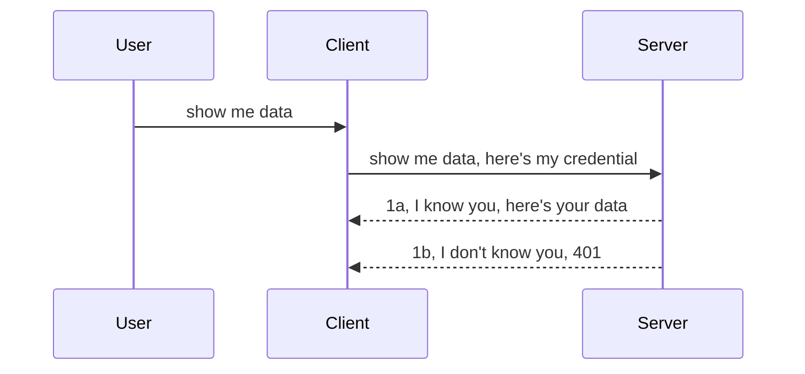

<!--
CO_OP_TRANSLATOR_METADATA:
{
  "original_hash": "5b00b8a8971a07d2d8803be4c9f138f8",
  "translation_date": "2025-10-07T01:02:00+00:00",
  "source_file": "03-GettingStarted/11-simple-auth/README.md",
  "language_code": "cs"
}
-->
# Jednoduché ověřování

MCP SDK podporují použití OAuth 2.1, což je poměrně složitý proces zahrnující koncepty jako ověřovací server, server zdrojů, odesílání přihlašovacích údajů, získání kódu, výměnu kódu za přístupový token, až nakonec získáte data svého zdroje. Pokud nejste zvyklí na OAuth, což je skvělý mechanismus k implementaci, je dobré začít s nějakou základní úrovní ověřování a postupně přejít k lepšímu zabezpečení. Proto tato kapitola existuje – aby vás připravila na pokročilejší ověřování.

## Co myslíme ověřováním?

Ověřování zahrnuje autentizaci a autorizaci. Potřebujeme provést dvě věci:

- **Autentizace**, což je proces zjištění, zda někomu dovolíme vstoupit do našeho domu, tedy zda má právo být „zde“, což znamená mít přístup k našemu serveru zdrojů, kde se nacházejí funkce MCP Serveru.
- **Autorizace**, což je proces zjištění, zda uživatel má přístup ke konkrétním zdrojům, o které žádá, například k těmto objednávkám nebo produktům, nebo zda má povolení číst obsah, ale ne ho mazat, jako další příklad.

## Přihlašovací údaje: jak systému sdělujeme, kdo jsme

Většina webových vývojářů začne přemýšlet o poskytování přihlašovacích údajů serveru, obvykle tajného klíče, který říká, zda mají povolení být „zde“ (autentizace). Tento přihlašovací údaj je obvykle base64 kódovaná verze uživatelského jména a hesla nebo API klíč, který jednoznačně identifikuje konkrétního uživatele.

To zahrnuje jeho odeslání prostřednictvím hlavičky nazvané „Authorization“ takto:

```json
{ "Authorization": "secret123" }
```

Toto se obvykle označuje jako základní autentizace. Celkový tok funguje následujícím způsobem:



Nyní, když chápeme, jak to funguje z hlediska toku, jak to implementujeme? Většina webových serverů má koncept nazvaný middleware, což je část kódu, která se spouští jako součást požadavku a může ověřit přihlašovací údaje. Pokud jsou přihlašovací údaje platné, middleware umožní požadavku projít. Pokud požadavek nemá platné přihlašovací údaje, obdržíte chybu ověřování. Podívejme se, jak to lze implementovat:

**Python**

```python
class AuthMiddleware(BaseHTTPMiddleware):
    async def dispatch(self, request, call_next):

        has_header = request.headers.get("Authorization")
        if not has_header:
            print("-> Missing Authorization header!")
            return Response(status_code=401, content="Unauthorized")

        if not valid_token(has_header):
            print("-> Invalid token!")
            return Response(status_code=403, content="Forbidden")

        print("Valid token, proceeding...")
       
        response = await call_next(request)
        # add any customer headers or change in the response in some way
        return response


starlette_app.add_middleware(CustomHeaderMiddleware)
```

Zde jsme:

- Vytvořili middleware nazvaný `AuthMiddleware`, jehož metoda `dispatch` je volána webovým serverem.
- Přidali middleware do webového serveru:

    ```python
    starlette_app.add_middleware(AuthMiddleware)
    ```

- Napsali logiku ověřování, která kontroluje, zda je přítomna hlavička Authorization a zda je zaslaný tajný klíč platný:

    ```python
    has_header = request.headers.get("Authorization")
    if not has_header:
        print("-> Missing Authorization header!")
        return Response(status_code=401, content="Unauthorized")

    if not valid_token(has_header):
        print("-> Invalid token!")
        return Response(status_code=403, content="Forbidden")
    ```

    Pokud je tajný klíč přítomen a platný, umožníme požadavku projít voláním `call_next` a vrátíme odpověď.

    ```python
    response = await call_next(request)
    # add any customer headers or change in the response in some way
    return response
    ```

Jak to funguje: pokud je na server odeslán webový požadavek, middleware bude spuštěn a na základě jeho implementace buď umožní požadavku projít, nebo vrátí chybu, která naznačuje, že klient nemá povolení pokračovat.

**TypeScript**

Zde vytvoříme middleware pomocí populárního frameworku Express a zachytíme požadavek předtím, než dosáhne MCP Serveru. Zde je kód:

```typescript
function isValid(secret) {
    return secret === "secret123";
}

app.use((req, res, next) => {
    // 1. Authorization header present?  
    if(!req.headers["Authorization"]) {
        res.status(401).send('Unauthorized');
    }
    
    let token = req.headers["Authorization"];

    // 2. Check validity.
    if(!isValid(token)) {
        res.status(403).send('Forbidden');
    }

   
    console.log('Middleware executed');
    // 3. Passes request to the next step in the request pipeline.
    next();
});
```

V tomto kódu:

1. Kontrolujeme, zda je hlavička Authorization vůbec přítomna. Pokud není, odešleme chybu 401.
2. Ověřujeme, zda je přihlašovací údaj/token platný. Pokud není, odešleme chybu 403.
3. Nakonec předáme požadavek v pipeline požadavků a vrátíme požadovaný zdroj.

## Cvičení: Implementace autentizace

Využijme naše znalosti a pokusme se ji implementovat. Zde je plán:

Server

- Vytvořte webový server a instanci MCP.
- Implementujte middleware pro server.

Klient 

- Odešlete webový požadavek s přihlašovacími údaji prostřednictvím hlavičky.

### -1- Vytvoření webového serveru a instance MCP

V prvním kroku musíme vytvořit instanci webového serveru a MCP Serveru.

**Python**

Zde vytvoříme instanci MCP Serveru, vytvoříme webovou aplikaci starlette a hostujeme ji pomocí uvicorn.

```python
# creating MCP Server

app = FastMCP(
    name="MCP Resource Server",
    instructions="Resource Server that validates tokens via Authorization Server introspection",
    host=settings["host"],
    port=settings["port"],
    debug=True
)

# creating starlette web app
starlette_app = app.streamable_http_app()

# serving app via uvicorn
async def run(starlette_app):
    import uvicorn
    config = uvicorn.Config(
            starlette_app,
            host=app.settings.host,
            port=app.settings.port,
            log_level=app.settings.log_level.lower(),
        )
    server = uvicorn.Server(config)
    await server.serve()

run(starlette_app)
```

V tomto kódu jsme:

- Vytvořili MCP Server.
- Sestavili webovou aplikaci starlette z MCP Serveru, `app.streamable_http_app()`.
- Hostovali a spustili webovou aplikaci pomocí uvicorn `server.serve()`.

**TypeScript**

Zde vytvoříme instanci MCP Serveru.

```typescript
const server = new McpServer({
      name: "example-server",
      version: "1.0.0"
    });

    // ... set up server resources, tools, and prompts ...
```

Toto vytvoření MCP Serveru bude muset proběhnout v rámci definice našeho POST /mcp route, takže vezměme výše uvedený kód a přesuneme ho takto:

```typescript
import express from "express";
import { randomUUID } from "node:crypto";
import { McpServer } from "@modelcontextprotocol/sdk/server/mcp.js";
import { StreamableHTTPServerTransport } from "@modelcontextprotocol/sdk/server/streamableHttp.js";
import { isInitializeRequest } from "@modelcontextprotocol/sdk/types.js"

const app = express();
app.use(express.json());

// Map to store transports by session ID
const transports: { [sessionId: string]: StreamableHTTPServerTransport } = {};

// Handle POST requests for client-to-server communication
app.post('/mcp', async (req, res) => {
  // Check for existing session ID
  const sessionId = req.headers['mcp-session-id'] as string | undefined;
  let transport: StreamableHTTPServerTransport;

  if (sessionId && transports[sessionId]) {
    // Reuse existing transport
    transport = transports[sessionId];
  } else if (!sessionId && isInitializeRequest(req.body)) {
    // New initialization request
    transport = new StreamableHTTPServerTransport({
      sessionIdGenerator: () => randomUUID(),
      onsessioninitialized: (sessionId) => {
        // Store the transport by session ID
        transports[sessionId] = transport;
      },
      // DNS rebinding protection is disabled by default for backwards compatibility. If you are running this server
      // locally, make sure to set:
      // enableDnsRebindingProtection: true,
      // allowedHosts: ['127.0.0.1'],
    });

    // Clean up transport when closed
    transport.onclose = () => {
      if (transport.sessionId) {
        delete transports[transport.sessionId];
      }
    };
    const server = new McpServer({
      name: "example-server",
      version: "1.0.0"
    });

    // ... set up server resources, tools, and prompts ...

    // Connect to the MCP server
    await server.connect(transport);
  } else {
    // Invalid request
    res.status(400).json({
      jsonrpc: '2.0',
      error: {
        code: -32000,
        message: 'Bad Request: No valid session ID provided',
      },
      id: null,
    });
    return;
  }

  // Handle the request
  await transport.handleRequest(req, res, req.body);
});

// Reusable handler for GET and DELETE requests
const handleSessionRequest = async (req: express.Request, res: express.Response) => {
  const sessionId = req.headers['mcp-session-id'] as string | undefined;
  if (!sessionId || !transports[sessionId]) {
    res.status(400).send('Invalid or missing session ID');
    return;
  }
  
  const transport = transports[sessionId];
  await transport.handleRequest(req, res);
};

// Handle GET requests for server-to-client notifications via SSE
app.get('/mcp', handleSessionRequest);

// Handle DELETE requests for session termination
app.delete('/mcp', handleSessionRequest);

app.listen(3000);
```

Nyní vidíte, jak bylo vytvoření MCP Serveru přesunuto do `app.post("/mcp")`.

Přejděme k dalšímu kroku vytvoření middleware, abychom mohli ověřit příchozí přihlašovací údaje.

### -2- Implementace middleware pro server

Přejděme k části middleware. Zde vytvoříme middleware, který hledá přihlašovací údaj v hlavičce `Authorization` a ověří jej. Pokud je přijatelný, požadavek pokračuje v tom, co potřebuje (např. seznam nástrojů, čtení zdroje nebo jakákoli funkce MCP, kterou klient požadoval).

**Python**

Pro vytvoření middleware musíme vytvořit třídu, která dědí z `BaseHTTPMiddleware`. Existují dva zajímavé prvky:

- Požadavek `request`, ze kterého čteme informace z hlavičky.
- `call_next`, callback, který musíme zavolat, pokud klient přinesl přihlašovací údaj, který přijímáme.

Nejprve musíme řešit případ, kdy chybí hlavička `Authorization`:

```python
has_header = request.headers.get("Authorization")

# no header present, fail with 401, otherwise move on.
if not has_header:
    print("-> Missing Authorization header!")
    return Response(status_code=401, content="Unauthorized")
```

Zde odešleme zprávu 401 Unauthorized, protože klient selhává v autentizaci.

Dále, pokud byl přihlašovací údaj předložen, musíme ověřit jeho platnost takto:

```python
 if not valid_token(has_header):
    print("-> Invalid token!")
    return Response(status_code=403, content="Forbidden")
```

Všimněte si, jak výše odesíláme zprávu 403 Forbidden. Podívejme se na kompletní middleware níže, který implementuje vše, co jsme zmínili výše:

```python
class AuthMiddleware(BaseHTTPMiddleware):
    async def dispatch(self, request, call_next):

        has_header = request.headers.get("Authorization")
        if not has_header:
            print("-> Missing Authorization header!")
            return Response(status_code=401, content="Unauthorized")

        if not valid_token(has_header):
            print("-> Invalid token!")
            return Response(status_code=403, content="Forbidden")

        print("Valid token, proceeding...")
        print(f"-> Received {request.method} {request.url}")
        response = await call_next(request)
        response.headers['Custom'] = 'Example'
        return response

```

Skvělé, ale co funkce `valid_token`? Zde je níže:

```python
# DON'T use for production - improve it !!
def valid_token(token: str) -> bool:
    # remove the "Bearer " prefix
    if token.startswith("Bearer "):
        token = token[7:]
        return token == "secret-token"
    return False
```

Toto by mělo být samozřejmě vylepšeno.

DŮLEŽITÉ: Nikdy byste neměli mít tajné klíče přímo v kódu. Ideálně byste měli hodnotu pro porovnání získat z datového zdroje nebo z IDP (poskytovatele identit) nebo ještě lépe, nechat IDP provést ověření.

**TypeScript**

Pro implementaci tohoto s Express musíme zavolat metodu `use`, která přijímá funkce middleware.

Musíme:

- Interagovat s proměnnou požadavku, abychom zkontrolovali předaný přihlašovací údaj v vlastnosti `Authorization`.
- Ověřit přihlašovací údaj, a pokud je platný, nechat požadavek pokračovat a provést požadovanou funkci MCP (např. seznam nástrojů, čtení zdroje nebo cokoli jiného souvisejícího s MCP).

Zde kontrolujeme, zda je hlavička `Authorization` přítomna, a pokud není, zastavíme požadavek:

```typescript
if(!req.headers["authorization"]) {
    res.status(401).send('Unauthorized');
    return;
}
```

Pokud hlavička není vůbec odeslána, obdržíte chybu 401.

Dále kontrolujeme, zda je přihlašovací údaj platný, a pokud není, opět zastavíme požadavek, ale s mírně odlišnou zprávou:

```typescript
if(!isValid(token)) {
    res.status(403).send('Forbidden');
    return;
} 
```

Všimněte si, jak nyní obdržíte chybu 403.

Zde je kompletní kód:

```typescript
app.use((req, res, next) => {
    console.log('Request received:', req.method, req.url, req.headers);
    console.log('Headers:', req.headers["authorization"]);
    if(!req.headers["authorization"]) {
        res.status(401).send('Unauthorized');
        return;
    }
    
    let token = req.headers["authorization"];

    if(!isValid(token)) {
        res.status(403).send('Forbidden');
        return;
    }  

    console.log('Middleware executed');
    next();
});
```

Nastavili jsme webový server tak, aby přijímal middleware pro kontrolu přihlašovacího údaje, který nám klient doufejme posílá. Co samotný klient?

### -3- Odeslání webového požadavku s přihlašovacím údajem prostřednictvím hlavičky

Musíme zajistit, že klient předává přihlašovací údaj prostřednictvím hlavičky. Protože budeme používat MCP klienta, musíme zjistit, jak to udělat.

**Python**

Pro klienta musíme předat hlavičku s naším přihlašovacím údajem takto:

```python
# DON'T hardcode the value, have it at minimum in an environment variable or a more secure storage
token = "secret-token"

async with streamablehttp_client(
        url = f"http://localhost:{port}/mcp",
        headers = {"Authorization": f"Bearer {token}"}
    ) as (
        read_stream,
        write_stream,
        session_callback,
    ):
        async with ClientSession(
            read_stream,
            write_stream
        ) as session:
            await session.initialize()
      
            # TODO, what you want done in the client, e.g list tools, call tools etc.
```

Všimněte si, jak vyplňujeme vlastnost `headers` takto: `headers = {"Authorization": f"Bearer {token}"}`.

**TypeScript**

Můžeme to vyřešit ve dvou krocích:

1. Naplníme konfigurační objekt naším přihlašovacím údajem.
2. Předáme konfigurační objekt transportu.

```typescript

// DON'T hardcode the value like shown here. At minimum have it as a env variable and use something like dotenv (in dev mode).
let token = "secret123"

// define a client transport option object
let options: StreamableHTTPClientTransportOptions = {
  sessionId: sessionId,
  requestInit: {
    headers: {
      "Authorization": "secret123"
    }
  }
};

// pass the options object to the transport
async function main() {
   const transport = new StreamableHTTPClientTransport(
      new URL(serverUrl),
      options
   );
```

Zde vidíte výše, jak jsme museli vytvořit objekt `options` a umístit naše hlavičky pod vlastnost `requestInit`.

DŮLEŽITÉ: Jak to odtud vylepšit? Současná implementace má několik problémů. Za prvé, předávání přihlašovacího údaje tímto způsobem je poměrně riskantní, pokud nemáte alespoň HTTPS. I tak může být přihlašovací údaj odcizen, takže potřebujete systém, kde můžete snadno zrušit platnost tokenu a přidat další kontroly, jako například odkud na světě požadavek přichází, zda se požadavky opakují příliš často (chování podobné botům) a další. 

Je však třeba říci, že pro velmi jednoduché API, kde nechcete, aby vaše API volal někdo bez autentizace, je to, co máme zde, dobrý začátek.

S tím řečeno, pojďme zkusit trochu zvýšit zabezpečení pomocí standardizovaného formátu, jako je JSON Web Token, známý jako JWT nebo „JOT“ tokeny.

## JSON Web Tokeny, JWT

Snažíme se zlepšit věci oproti posílání velmi jednoduchých přihlašovacích údajů. Jaké okamžité zlepšení získáme přijetím JWT?

- **Zlepšení zabezpečení**. Při základní autentizaci posíláte uživatelské jméno a heslo jako base64 kódovaný token (nebo posíláte API klíč) znovu a znovu, což zvyšuje riziko. S JWT posíláte uživatelské jméno a heslo a získáte token jako odpověď, který je také časově omezený, což znamená, že vyprší. JWT vám umožňuje snadno používat jemně odstupňovanou kontrolu přístupu pomocí rolí, rozsahů a oprávnění. 
- **Bezustavovost a škálovatelnost**. JWT jsou samostatné, obsahují všechny informace o uživateli a eliminují potřebu ukládat serverové relace. Token může být také ověřen lokálně.
- **Interoperabilita a federace**. JWT jsou centrální součástí Open ID Connect a používají se s známými poskytovateli identit, jako je Entra ID, Google Identity a Auth0. Umožňují také použití jednotného přihlášení a mnoho dalšího, což je vhodné pro podnikové prostředí.
- **Modularita a flexibilita**. JWT lze také použít s API bránami, jako je Azure API Management, NGINX a další. Podporují také scénáře autentizace a komunikace server-server, včetně scénářů impersonace a delegace.
- **Výkon a ukládání do mezipaměti**. JWT mohou být ukládány do mezipaměti po dekódování, což snižuje potřebu jejich analýzy. To pomáhá zejména u aplikací s vysokým provozem, protože zlepšuje propustnost a snižuje zatížení vaší infrastruktury.
- **Pokročilé funkce**. Podporují také introspekci (kontrolu platnosti na serveru) a zrušení platnosti (zneplatnění tokenu).

S těmito výhodami se podívejme, jak můžeme naši implementaci posunout na vyšší úroveň.

## Přeměna základní autentizace na JWT

Změny, které musíme provést na vysoké úrovni, jsou:

- **Naučit se vytvořit JWT token** a připravit jej na odeslání z klienta na server.
- **Ověřit JWT token**, a pokud je platný, umožnit klientovi přístup k našim zdrojům.
- **Zabezpečit úložiště tokenů**. Jak tento token ukládáme.
- **Ochránit cesty**. Musíme chránit cesty, v našem případě musíme chránit cesty a konkrétní funkce MCP.
- **Přidat obnovovací tokeny**. Zajistit, že vytvoříme tokeny, které jsou krátkodobé, ale obnovovací tokeny, které jsou dlouhodobé a mohou být použity k získání nových tokenů, pokud vyprší. Také zajistit, že existuje endpoint pro obnovu a strategie rotace.

### -1- Vytvoření JWT tokenu

Nejprve má JWT token následující části:

- **Hlavička**, algoritmus použitý a typ tokenu.
- **Payload**, tvrzení, jako sub (uživatel nebo entita, kterou token reprezentuje. V autentizačním scénáři je to obvykle userid), exp (kdy vyprší), role (role).
- **Podpis**, podepsaný tajným klíčem nebo soukromým klíčem.

Pro toto musíme vytvořit hlavičku, payload a kódovaný token.

**Python**

```python

import jwt
import jwt
from jwt.exceptions import ExpiredSignatureError, InvalidTokenError
import datetime

# Secret key used to sign the JWT
secret_key = 'your-secret-key'

header = {
    "alg": "HS256",
    "typ": "JWT"
}

# the user info andits claims and expiry time
payload = {
    "sub": "1234567890",               # Subject (user ID)
    "name": "User Userson",                # Custom claim
    "admin": True,                     # Custom claim
    "iat": datetime.datetime.utcnow(),# Issued at
    "exp": datetime.datetime.utcnow() + datetime.timedelta(hours=1)  # Expiry
}

# encode it
encoded_jwt = jwt.encode(payload, secret_key, algorithm="HS256", headers=header)
```

V tomto kódu jsme:

- Definovali hlavičku pomocí HS256 jako algoritmu a typu jako JWT.
- Sestavili payload, který obsahuje subjekt nebo userid, uživatelské jméno, roli, kdy byl vydán a kdy má vypršet, čímž jsme implementovali časově omezený aspekt, který jsme zmínili dříve. 

**TypeScript**

Zde budeme potřebovat některé závislosti, které nám pomohou vytvořit JWT token.

Závislosti

```sh

npm install jsonwebtoken
npm install --save-dev @types/jsonwebtoken
```

Nyní, když to máme na místě, vytvoříme hlavičku, payload a prostřednictvím toho vytvoříme kódovaný token.

```typescript
import jwt from 'jsonwebtoken';

const secretKey = 'your-secret-key'; // Use env vars in production

// Define the payload
const payload = {
  sub: '1234567890',
  name: 'User usersson',
  admin: true,
  iat: Math.floor(Date.now() / 1000), // Issued at
  exp: Math.floor(Date.now() / 1000) + 60 * 60 // Expires in 1 hour
};

// Define the header (optional, jsonwebtoken sets defaults)
const header = {
  alg: 'HS256',
  typ: 'JWT'
};

// Create the token
const token = jwt.sign(payload, secretKey, {
  algorithm: 'HS256',
  header: header
});

console.log('JWT:', token);
```

Tento token je:

Podepsaný pomocí HS256
Platný po dobu 1 hodiny
Obsahuje tvrzení jako sub, name, admin, iat a exp.

### -2- Ověření tokenu

Budeme také muset ověřit token, což bychom měli provést na serveru, abychom zajistili, že to, co nám klient posílá, je skutečně platné. Existuje mnoho kontrol, které bychom zde měli provést, od ověření jeho struktury až po jeho platnost. Doporučuje se také přidat další kontroly, například zda uživatel existuje v našem systému a další.

Pro ověření tokenu jej musíme dekódovat, abychom jej mohli přečíst, a poté začít kontrolovat jeho platnost:

**Python**

```python

# Decode and verify the JWT
try:
    decoded = jwt.decode(token, secret_key, algorithms=["HS256"])
    print("✅ Token is valid.")
    print("Decoded claims:")
    for key, value in decoded.items():
        print(f"  {key}: {value}")
except ExpiredSignatureError:
    print("❌ Token has expired.")
except InvalidTokenError as e:
    print(f"❌ Invalid token: {e}")

```

V tomto kódu voláme `jwt.decode` pomocí tokenu, tajného klíče a zvoleného algoritmu jako vstupu. Všimněte si, jak používáme konstrukci try-catch, protože neúspěšné ověření vede k vyvolání chyby.

**TypeScript**

Zde musíme zavolat `jwt.verify`, abychom získali dekódovanou verzi tokenu, kterou můžeme dále analyzovat. Pokud tento hovor selže, znamená to, že struktura tokenu je nesprávná nebo již není platná. 

```typescript

try {
  const decoded = jwt.verify(token, secretKey);
  console.log('Decoded Payload:', decoded);
} catch (err) {
  console.error('Token verification failed:', err);
}
```

POZNÁMKA: Jak bylo zmíněno dříve, měli bychom provést další kontroly, abychom zajistili, že tento token odkazuje na uživatele v našem systému a zajistili, že uživatel má práva, která tvrdí, že má.
Dále se podíváme na řízení přístupu na základě rolí, známé také jako RBAC.

## Přidání řízení přístupu na základě rolí

Myšlenkou je vyjádřit, že různé role mají různá oprávnění. Například předpokládáme, že administrátor může dělat vše, běžní uživatelé mohou číst a zapisovat a hosté mohou pouze číst. Zde jsou některé možné úrovně oprávnění:

- Admin.Write 
- User.Read
- Guest.Read

Podívejme se, jak můžeme takové řízení implementovat pomocí middleware. Middleware lze přidat na konkrétní trasu i na všechny trasy.

**Python**

```python
from starlette.middleware.base import BaseHTTPMiddleware
from starlette.responses import JSONResponse
import jwt

# DON'T have the secret in the code like, this is for demonstration purposes only. Read it from a safe place.
SECRET_KEY = "your-secret-key" # put this in env variable
REQUIRED_PERMISSION = "User.Read"

class JWTPermissionMiddleware(BaseHTTPMiddleware):
    async def dispatch(self, request, call_next):
        auth_header = request.headers.get("Authorization")
        if not auth_header or not auth_header.startswith("Bearer "):
            return JSONResponse({"error": "Missing or invalid Authorization header"}, status_code=401)

        token = auth_header.split(" ")[1]
        try:
            decoded = jwt.decode(token, SECRET_KEY, algorithms=["HS256"])
        except jwt.ExpiredSignatureError:
            return JSONResponse({"error": "Token expired"}, status_code=401)
        except jwt.InvalidTokenError:
            return JSONResponse({"error": "Invalid token"}, status_code=401)

        permissions = decoded.get("permissions", [])
        if REQUIRED_PERMISSION not in permissions:
            return JSONResponse({"error": "Permission denied"}, status_code=403)

        request.state.user = decoded
        return await call_next(request)


```

Existuje několik různých způsobů, jak přidat middleware, například:

```python

# Alt 1: add middleware while constructing starlette app
middleware = [
    Middleware(JWTPermissionMiddleware)
]

app = Starlette(routes=routes, middleware=middleware)

# Alt 2: add middleware after starlette app is a already constructed
starlette_app.add_middleware(JWTPermissionMiddleware)

# Alt 3: add middleware per route
routes = [
    Route(
        "/mcp",
        endpoint=..., # handler
        middleware=[Middleware(JWTPermissionMiddleware)]
    )
]
```

**TypeScript**

Můžeme použít `app.use` a middleware, který bude spuštěn pro všechny požadavky.

```typescript
app.use((req, res, next) => {
    console.log('Request received:', req.method, req.url, req.headers);
    console.log('Headers:', req.headers["authorization"]);

    // 1. Check if authorization header has been sent

    if(!req.headers["authorization"]) {
        res.status(401).send('Unauthorized');
        return;
    }
    
    let token = req.headers["authorization"];

    // 2. Check if token is valid
    if(!isValid(token)) {
        res.status(403).send('Forbidden');
        return;
    }  

    // 3. Check if token user exist in our system
    if(!isExistingUser(token)) {
        res.status(403).send('Forbidden');
        console.log("User does not exist");
        return;
    }
    console.log("User exists");

    // 4. Verify the token has the right permissions
    if(!hasScopes(token, ["User.Read"])){
        res.status(403).send('Forbidden - insufficient scopes');
    }

    console.log("User has required scopes");

    console.log('Middleware executed');
    next();
});

```

Existuje několik věcí, které může naše middleware dělat a které by mělo dělat, konkrétně:

1. Zkontrolovat, zda je přítomna hlavička autorizace.
2. Zkontrolovat, zda je token platný, voláme `isValid`, což je metoda, kterou jsme napsali pro kontrolu integrity a platnosti JWT tokenu.
3. Ověřit, zda uživatel existuje v našem systému, to bychom měli zkontrolovat.

   ```typescript
    // users in DB
   const users = [
     "user1",
     "User usersson",
   ]

   function isExistingUser(token) {
     let decodedToken = verifyToken(token);

     // TODO, check if user exists in DB
     return users.includes(decodedToken?.name || "");
   }
   ```

   Výše jsme vytvořili velmi jednoduchý seznam `users`, který by měl být samozřejmě v databázi.

4. Dále bychom měli také zkontrolovat, zda token má správná oprávnění.

   ```typescript
   if(!hasScopes(token, ["User.Read"])){
        res.status(403).send('Forbidden - insufficient scopes');
   }
   ```

   V kódu výše z middleware kontrolujeme, zda token obsahuje oprávnění User.Read, pokud ne, posíláme chybu 403. Níže je pomocná metoda `hasScopes`.

   ```typescript
   function hasScopes(scope: string, requiredScopes: string[]) {
     let decodedToken = verifyToken(scope);
    return requiredScopes.every(scope => decodedToken?.scopes.includes(scope));
  }
   ```

Have a think which additional checks you should be doing, but these are the absolute minimum of checks you should be doing.

Using Express as a web framework is a common choice. There are helpers library when you use JWT so you can write less code.

- `express-jwt`, helper library that provides a middleware that helps decode your token.
- `express-jwt-permissions`, this provides a middleware `guard` that helps check if a certain permission is on the token.

Here's what these libraries can look like when used:

```typescript
const express = require('express');
const jwt = require('express-jwt');
const guard = require('express-jwt-permissions')();

const app = express();
const secretKey = 'your-secret-key'; // put this in env variable

// Decode JWT and attach to req.user
app.use(jwt({ secret: secretKey, algorithms: ['HS256'] }));

// Check for User.Read permission
app.use(guard.check('User.Read'));

// multiple permissions
// app.use(guard.check(['User.Read', 'Admin.Access']));

app.get('/protected', (req, res) => {
  res.json({ message: `Welcome ${req.user.name}` });
});

// Error handler
app.use((err, req, res, next) => {
  if (err.code === 'permission_denied') {
    return res.status(403).send('Forbidden');
  }
  next(err);
});

```

Nyní jste viděli, jak lze middleware použít pro autentizaci i autorizaci, ale co MCP, mění to způsob, jakým provádíme autentizaci? Pojďme to zjistit v další sekci.

### -3- Přidání RBAC do MCP

Viděli jste, jak můžete přidat RBAC prostřednictvím middleware, nicméně pro MCP neexistuje snadný způsob, jak přidat RBAC pro jednotlivé funkce MCP, takže co dělat? Musíme jednoduše přidat kód, který v tomto případě kontroluje, zda má klient práva na volání konkrétního nástroje:

Máte několik různých možností, jak dosáhnout RBAC pro jednotlivé funkce, zde jsou některé:

- Přidat kontrolu pro každý nástroj, zdroj, prompt, kde je potřeba zkontrolovat úroveň oprávnění.

   **Python**

   ```python
   @tool()
   def delete_product(id: int):
      try:
          check_permissions(role="Admin.Write", request)
      catch:
        pass # client failed authorization, raise authorization error
   ```

   **TypeScript**

   ```typescript
   server.registerTool(
    "delete-product",
    {
      title: Delete a product",
      description: "Deletes a product",
      inputSchema: { id: z.number() }
    },
    async ({ id }) => {
      
      try {
        checkPermissions("Admin.Write", request);
        // todo, send id to productService and remote entry
      } catch(Exception e) {
        console.log("Authorization error, you're not allowed");  
      }

      return {
        content: [{ type: "text", text: `Deletected product with id ${id}` }]
      };
    }
   );
   ```


- Použít pokročilý serverový přístup a obslužné rutiny požadavků, abyste minimalizovali počet míst, kde je potřeba provést kontrolu.

   **Python**

   ```python
   
   tool_permission = {
      "create_product": ["User.Write", "Admin.Write"],
      "delete_product": ["Admin.Write"]
   }

   def has_permission(user_permissions, required_permissions) -> bool:
      # user_permissions: list of permissions the user has
      # required_permissions: list of permissions required for the tool
      return any(perm in user_permissions for perm in required_permissions)

   @server.call_tool()
   async def handle_call_tool(
     name: str, arguments: dict[str, str] | None
   ) -> list[types.TextContent]:
    # Assume request.user.permissions is a list of permissions for the user
     user_permissions = request.user.permissions
     required_permissions = tool_permission.get(name, [])
     if not has_permission(user_permissions, required_permissions):
        # Raise error "You don't have permission to call tool {name}"
        raise Exception(f"You don't have permission to call tool {name}")
     # carry on and call tool
     # ...
   ```   
   

   **TypeScript**

   ```typescript
   function hasPermission(userPermissions: string[], requiredPermissions: string[]): boolean {
       if (!Array.isArray(userPermissions) || !Array.isArray(requiredPermissions)) return false;
       // Return true if user has at least one required permission
       
       return requiredPermissions.some(perm => userPermissions.includes(perm));
   }
  
   server.setRequestHandler(CallToolRequestSchema, async (request) => {
      const { params: { name } } = request;
  
      let permissions = request.user.permissions;
  
      if (!hasPermission(permissions, toolPermissions[name])) {
         return new Error(`You don't have permission to call ${name}`);
      }
  
      // carry on..
   });
   ```

   Poznámka: Musíte zajistit, aby vaše middleware přiřadilo dekódovaný token do vlastnosti uživatele požadavku, aby byl výše uvedený kód jednoduchý.

### Shrnutí

Nyní, když jsme diskutovali, jak obecně přidat podporu pro RBAC a konkrétně pro MCP, je čas pokusit se implementovat zabezpečení sami, abyste si ověřili, že jste pochopili představené koncepty.

## Úkol 1: Vytvořte MCP server a MCP klient s použitím základní autentizace

Zde využijete to, co jste se naučili o posílání přihlašovacích údajů prostřednictvím hlaviček.

## Řešení 1

[Řešení 1](./code/basic/README.md)

## Úkol 2: Vylepšete řešení z Úkolu 1 na použití JWT

Vezměte první řešení, ale tentokrát ho vylepšete. 

Namísto použití základní autentizace použijte JWT.

## Řešení 2

[Řešení 2](./solution/jwt-solution/README.md)

## Výzva

Přidejte RBAC pro jednotlivé nástroje, jak jsme popsali v sekci "Přidání RBAC do MCP".

## Shrnutí

Doufáme, že jste se v této kapitole hodně naučili, od žádného zabezpečení, přes základní zabezpečení, až po JWT a jak ho lze přidat do MCP.

Vybudovali jsme solidní základ s vlastními JWT, ale jak se rozšiřujeme, přecházíme k modelu identity založenému na standardech. Přijetí IdP jako Entra nebo Keycloak nám umožňuje přenést vydávání tokenů, jejich validaci a správu životního cyklu na důvěryhodnou platformu — což nám uvolní ruce pro zaměření na logiku aplikace a uživatelskou zkušenost.

Pro to máme více [pokročilou kapitolu o Entra](../../05-AdvancedTopics/mcp-security-entra/README.md)

---

**Prohlášení**:  
Tento dokument byl přeložen pomocí služby AI pro překlady [Co-op Translator](https://github.com/Azure/co-op-translator). I když se snažíme o přesnost, mějte prosím na paměti, že automatizované překlady mohou obsahovat chyby nebo nepřesnosti. Původní dokument v jeho původním jazyce by měl být považován za autoritativní zdroj. Pro důležité informace se doporučuje profesionální lidský překlad. Neodpovídáme za žádná nedorozumění nebo nesprávné interpretace vyplývající z použití tohoto překladu.