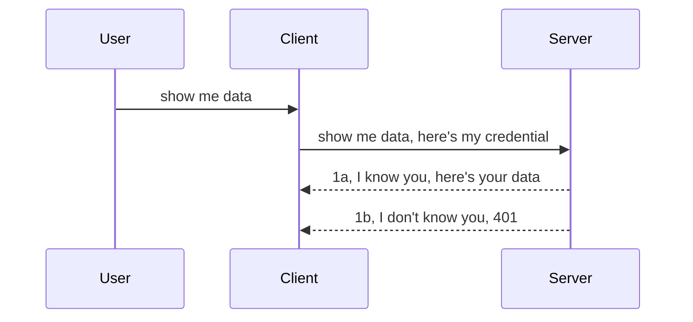

<!--
CO_OP_TRANSLATOR_METADATA:
{
  "original_hash": "5b00b8a8971a07d2d8803be4c9f138f8",
  "translation_date": "2025-10-07T00:52:59+00:00",
  "source_file": "03-GettingStarted/11-simple-auth/README.md",
  "language_code": "da"
}
-->
# Enkel godkendelse

MCP SDK'er understøtter brugen af OAuth 2.1, som ærligt talt er en ret kompleks proces, der involverer begreber som godkendelsesserver, ressourcesserver, indsendelse af legitimationsoplysninger, modtagelse af en kode, udveksling af koden for en bearer-token, indtil du endelig kan få adgang til dine ressourcedata. Hvis du ikke er vant til OAuth, som er en fantastisk ting at implementere, er det en god idé at starte med en grundlæggende form for godkendelse og gradvist opbygge bedre og bedre sikkerhed. Det er derfor, dette kapitel eksisterer – for at hjælpe dig med at opbygge mere avanceret godkendelse.

## Godkendelse, hvad mener vi?

Godkendelse er en forkortelse for autentifikation og autorisation. Ideen er, at vi skal gøre to ting:

- **Autentifikation**, som er processen med at finde ud af, om vi skal lade en person komme ind i vores hus, altså om de har ret til at være "her" – det vil sige adgang til vores ressourcesserver, hvor MCP Server-funktionerne findes.
- **Autorisation**, som er processen med at afgøre, om en bruger skal have adgang til de specifikke ressourcer, de beder om, for eksempel bestemte ordrer eller produkter, eller om de kun må læse indholdet, men ikke slette det, som et andet eksempel.

## Legitimationsoplysninger: hvordan vi fortæller systemet, hvem vi er

De fleste webudviklere begynder at tænke på at give serveren en legitimationsoplysning, normalt en hemmelighed, der angiver, om de har tilladelse til at være her ("autentifikation"). Denne legitimationsoplysning er typisk en base64-kodet version af brugernavn og adgangskode eller en API-nøgle, der unikt identificerer en specifik bruger.

Dette indebærer, at legitimationsoplysningen sendes via en header kaldet "Authorization" som vist her:

```json
{ "Authorization": "secret123" }
```

Dette kaldes normalt grundlæggende godkendelse. Den overordnede proces fungerer på følgende måde:



Nu hvor vi forstår, hvordan det fungerer fra et procesperspektiv, hvordan implementerer vi det? De fleste webservere har et koncept kaldet middleware – et stykke kode, der kører som en del af anmodningen og kan verificere legitimationsoplysninger. Hvis legitimationsoplysningerne er gyldige, kan anmodningen fortsætte. Hvis anmodningen ikke har gyldige legitimationsoplysninger, får du en godkendelsesfejl. Lad os se, hvordan dette kan implementeres:

**Python**

```python
class AuthMiddleware(BaseHTTPMiddleware):
    async def dispatch(self, request, call_next):

        has_header = request.headers.get("Authorization")
        if not has_header:
            print("-> Missing Authorization header!")
            return Response(status_code=401, content="Unauthorized")

        if not valid_token(has_header):
            print("-> Invalid token!")
            return Response(status_code=403, content="Forbidden")

        print("Valid token, proceeding...")
       
        response = await call_next(request)
        # add any customer headers or change in the response in some way
        return response


starlette_app.add_middleware(CustomHeaderMiddleware)
```

Her har vi:

- Oprettet en middleware kaldet `AuthMiddleware`, hvor dens `dispatch`-metode bliver kaldt af webserveren.
- Tilføjet middleware til webserveren:

    ```python
    starlette_app.add_middleware(AuthMiddleware)
    ```

- Skrevet valideringslogik, der kontrollerer, om Authorization-headeren er til stede, og om den hemmelighed, der sendes, er gyldig:

    ```python
    has_header = request.headers.get("Authorization")
    if not has_header:
        print("-> Missing Authorization header!")
        return Response(status_code=401, content="Unauthorized")

    if not valid_token(has_header):
        print("-> Invalid token!")
        return Response(status_code=403, content="Forbidden")
    ```

    Hvis hemmeligheden er til stede og gyldig, lader vi anmodningen passere ved at kalde `call_next` og returnere svaret.

    ```python
    response = await call_next(request)
    # add any customer headers or change in the response in some way
    return response
    ```

Sådan fungerer det: Hvis en webanmodning sendes til serveren, vil middleware blive kaldt, og baseret på dens implementering vil den enten lade anmodningen passere eller returnere en fejl, der angiver, at klienten ikke har tilladelse til at fortsætte.

**TypeScript**

Her opretter vi en middleware med det populære framework Express og afbryder anmodningen, før den når MCP Serveren. Her er koden:

```typescript
function isValid(secret) {
    return secret === "secret123";
}

app.use((req, res, next) => {
    // 1. Authorization header present?  
    if(!req.headers["Authorization"]) {
        res.status(401).send('Unauthorized');
    }
    
    let token = req.headers["Authorization"];

    // 2. Check validity.
    if(!isValid(token)) {
        res.status(403).send('Forbidden');
    }

   
    console.log('Middleware executed');
    // 3. Passes request to the next step in the request pipeline.
    next();
});
```

I denne kode gør vi følgende:

1. Kontrollerer, om Authorization-headeren overhovedet er til stede; hvis ikke, sender vi en 401-fejl.
2. Sikrer, at legitimationsoplysningen/token er gyldig; hvis ikke, sender vi en 403-fejl.
3. Lader til sidst anmodningen fortsætte i anmodningskæden og returnerer den ønskede ressource.

## Øvelse: Implementer godkendelse

Lad os tage vores viden og prøve at implementere den. Her er planen:

Server

- Opret en webserver og MCP-instans.
- Implementer en middleware til serveren.

Klient 

- Send webanmodning med legitimationsoplysning via header.

### -1- Opret en webserver og MCP-instans

I vores første trin skal vi oprette webserverinstansen og MCP Serveren.

**Python**

Her opretter vi en MCP-serverinstans, en Starlette-webapp og hoster den med uvicorn.

```python
# creating MCP Server

app = FastMCP(
    name="MCP Resource Server",
    instructions="Resource Server that validates tokens via Authorization Server introspection",
    host=settings["host"],
    port=settings["port"],
    debug=True
)

# creating starlette web app
starlette_app = app.streamable_http_app()

# serving app via uvicorn
async def run(starlette_app):
    import uvicorn
    config = uvicorn.Config(
            starlette_app,
            host=app.settings.host,
            port=app.settings.port,
            log_level=app.settings.log_level.lower(),
        )
    server = uvicorn.Server(config)
    await server.serve()

run(starlette_app)
```

I denne kode gør vi følgende:

- Opretter MCP Serveren.
- Konstruerer Starlette-webappen fra MCP Serveren, `app.streamable_http_app()`.
- Hoster og serverer webappen ved hjælp af uvicorn `server.serve()`.

**TypeScript**

Her opretter vi en MCP Server-instans.

```typescript
const server = new McpServer({
      name: "example-server",
      version: "1.0.0"
    });

    // ... set up server resources, tools, and prompts ...
```

Denne MCP Server-oprettelse skal ske inden for vores POST /mcp-rute-definition, så lad os tage ovenstående kode og flytte den som vist her:

```typescript
import express from "express";
import { randomUUID } from "node:crypto";
import { McpServer } from "@modelcontextprotocol/sdk/server/mcp.js";
import { StreamableHTTPServerTransport } from "@modelcontextprotocol/sdk/server/streamableHttp.js";
import { isInitializeRequest } from "@modelcontextprotocol/sdk/types.js"

const app = express();
app.use(express.json());

// Map to store transports by session ID
const transports: { [sessionId: string]: StreamableHTTPServerTransport } = {};

// Handle POST requests for client-to-server communication
app.post('/mcp', async (req, res) => {
  // Check for existing session ID
  const sessionId = req.headers['mcp-session-id'] as string | undefined;
  let transport: StreamableHTTPServerTransport;

  if (sessionId && transports[sessionId]) {
    // Reuse existing transport
    transport = transports[sessionId];
  } else if (!sessionId && isInitializeRequest(req.body)) {
    // New initialization request
    transport = new StreamableHTTPServerTransport({
      sessionIdGenerator: () => randomUUID(),
      onsessioninitialized: (sessionId) => {
        // Store the transport by session ID
        transports[sessionId] = transport;
      },
      // DNS rebinding protection is disabled by default for backwards compatibility. If you are running this server
      // locally, make sure to set:
      // enableDnsRebindingProtection: true,
      // allowedHosts: ['127.0.0.1'],
    });

    // Clean up transport when closed
    transport.onclose = () => {
      if (transport.sessionId) {
        delete transports[transport.sessionId];
      }
    };
    const server = new McpServer({
      name: "example-server",
      version: "1.0.0"
    });

    // ... set up server resources, tools, and prompts ...

    // Connect to the MCP server
    await server.connect(transport);
  } else {
    // Invalid request
    res.status(400).json({
      jsonrpc: '2.0',
      error: {
        code: -32000,
        message: 'Bad Request: No valid session ID provided',
      },
      id: null,
    });
    return;
  }

  // Handle the request
  await transport.handleRequest(req, res, req.body);
});

// Reusable handler for GET and DELETE requests
const handleSessionRequest = async (req: express.Request, res: express.Response) => {
  const sessionId = req.headers['mcp-session-id'] as string | undefined;
  if (!sessionId || !transports[sessionId]) {
    res.status(400).send('Invalid or missing session ID');
    return;
  }
  
  const transport = transports[sessionId];
  await transport.handleRequest(req, res);
};

// Handle GET requests for server-to-client notifications via SSE
app.get('/mcp', handleSessionRequest);

// Handle DELETE requests for session termination
app.delete('/mcp', handleSessionRequest);

app.listen(3000);
```

Nu kan du se, hvordan MCP Server-oprettelsen blev flyttet inden for `app.post("/mcp")`.

Lad os gå videre til næste trin med at oprette middleware, så vi kan validere den indkommende legitimationsoplysning.

### -2- Implementer en middleware til serveren

Lad os komme til middleware-delen. Her vil vi oprette en middleware, der leder efter en legitimationsoplysning i `Authorization`-headeren og validerer den. Hvis den er acceptabel, vil anmodningen fortsætte med at udføre det, den skal (f.eks. liste værktøjer, læse en ressource eller hvad end MCP-funktionalitet klienten bad om).

**Python**

For at oprette middleware skal vi oprette en klasse, der arver fra `BaseHTTPMiddleware`. Der er to interessante dele:

- Anmodningen `request`, som vi læser headeroplysninger fra.
- `call_next`, callbacken vi skal kalde, hvis klienten har medbragt en legitimationsoplysning, vi accepterer.

Først skal vi håndtere tilfælde, hvor `Authorization`-headeren mangler:

```python
has_header = request.headers.get("Authorization")

# no header present, fail with 401, otherwise move on.
if not has_header:
    print("-> Missing Authorization header!")
    return Response(status_code=401, content="Unauthorized")
```

Her sender vi en 401 Unauthorized-meddelelse, da klienten fejler autentifikation.

Hvis en legitimationsoplysning blev sendt, skal vi kontrollere dens gyldighed som vist her:

```python
 if not valid_token(has_header):
    print("-> Invalid token!")
    return Response(status_code=403, content="Forbidden")
```

Bemærk, hvordan vi sender en 403 Forbidden-meddelelse ovenfor. Lad os se den fulde middleware nedenfor, der implementerer alt, vi har nævnt:

```python
class AuthMiddleware(BaseHTTPMiddleware):
    async def dispatch(self, request, call_next):

        has_header = request.headers.get("Authorization")
        if not has_header:
            print("-> Missing Authorization header!")
            return Response(status_code=401, content="Unauthorized")

        if not valid_token(has_header):
            print("-> Invalid token!")
            return Response(status_code=403, content="Forbidden")

        print("Valid token, proceeding...")
        print(f"-> Received {request.method} {request.url}")
        response = await call_next(request)
        response.headers['Custom'] = 'Example'
        return response

```

Fantastisk, men hvad med `valid_token`-funktionen? Her er den nedenfor:

```python
# DON'T use for production - improve it !!
def valid_token(token: str) -> bool:
    # remove the "Bearer " prefix
    if token.startswith("Bearer "):
        token = token[7:]
        return token == "secret-token"
    return False
```

Dette bør naturligvis forbedres.

VIGTIGT: Du bør ALDRIG have hemmeligheder som denne i koden. Du bør ideelt set hente værdien til sammenligning fra en datakilde eller fra en IDP (Identity Service Provider) eller endnu bedre, lade IDP'en udføre valideringen.

**TypeScript**

For at implementere dette med Express skal vi kalde `use`-metoden, der tager middleware-funktioner.

Vi skal:

- Interagere med anmodningsvariablen for at kontrollere den sendte legitimationsoplysning i `Authorization`-egenskaben.
- Validere legitimationsoplysningen, og hvis den er gyldig, lade anmodningen fortsætte og lade klientens MCP-anmodning udføre det, den skal (f.eks. liste værktøjer, læse ressourcer eller noget andet MCP-relateret).

Her kontrollerer vi, om `Authorization`-headeren er til stede, og hvis ikke, stopper vi anmodningen fra at fortsætte:

```typescript
if(!req.headers["authorization"]) {
    res.status(401).send('Unauthorized');
    return;
}
```

Hvis headeren ikke sendes, modtager du en 401-fejl.

Derefter kontrollerer vi, om legitimationsoplysningen er gyldig; hvis ikke, stopper vi igen anmodningen, men med en lidt anderledes meddelelse:

```typescript
if(!isValid(token)) {
    res.status(403).send('Forbidden');
    return;
} 
```

Bemærk, hvordan du nu får en 403-fejl.

Her er den fulde kode:

```typescript
app.use((req, res, next) => {
    console.log('Request received:', req.method, req.url, req.headers);
    console.log('Headers:', req.headers["authorization"]);
    if(!req.headers["authorization"]) {
        res.status(401).send('Unauthorized');
        return;
    }
    
    let token = req.headers["authorization"];

    if(!isValid(token)) {
        res.status(403).send('Forbidden');
        return;
    }  

    console.log('Middleware executed');
    next();
});
```

Vi har opsat webserveren til at acceptere en middleware, der kontrollerer den legitimationsoplysning, klienten forhåbentlig sender os. Hvad med selve klienten?

### -3- Send webanmodning med legitimationsoplysning via header

Vi skal sikre, at klienten sender legitimationsoplysningen gennem headeren. Da vi skal bruge en MCP-klient til dette, skal vi finde ud af, hvordan det gøres.

**Python**

For klienten skal vi sende en header med vores legitimationsoplysning som vist her:

```python
# DON'T hardcode the value, have it at minimum in an environment variable or a more secure storage
token = "secret-token"

async with streamablehttp_client(
        url = f"http://localhost:{port}/mcp",
        headers = {"Authorization": f"Bearer {token}"}
    ) as (
        read_stream,
        write_stream,
        session_callback,
    ):
        async with ClientSession(
            read_stream,
            write_stream
        ) as session:
            await session.initialize()
      
            # TODO, what you want done in the client, e.g list tools, call tools etc.
```

Bemærk, hvordan vi udfylder `headers`-egenskaben som vist: `headers = {"Authorization": f"Bearer {token}"}`.

**TypeScript**

Vi kan løse dette i to trin:

1. Udfyld en konfigurationsobjekt med vores legitimationsoplysning.
2. Send konfigurationsobjektet til transporten.

```typescript

// DON'T hardcode the value like shown here. At minimum have it as a env variable and use something like dotenv (in dev mode).
let token = "secret123"

// define a client transport option object
let options: StreamableHTTPClientTransportOptions = {
  sessionId: sessionId,
  requestInit: {
    headers: {
      "Authorization": "secret123"
    }
  }
};

// pass the options object to the transport
async function main() {
   const transport = new StreamableHTTPClientTransport(
      new URL(serverUrl),
      options
   );
```

Her ser du ovenfor, hvordan vi måtte oprette en `options`-objekt og placere vores headers under `requestInit`-egenskaben.

VIGTIGT: Hvordan forbedrer vi det herfra? Den nuværende implementering har nogle problemer. For det første er det ret risikabelt at sende en legitimationsoplysning som denne, medmindre du som minimum har HTTPS. Selv da kan legitimationsoplysningen blive stjålet, så du har brug for et system, hvor du nemt kan tilbagekalde token og tilføje yderligere kontrol, som hvor i verden anmodningen kommer fra, om anmodningen sker alt for ofte (bot-lignende adfærd) – kort sagt, der er en hel række bekymringer.

Det skal dog siges, at for meget simple API'er, hvor du ikke ønsker, at nogen skal kalde din API uden at være godkendt, er det, vi har her, et godt udgangspunkt.

Med det sagt, lad os prøve at styrke sikkerheden lidt ved at bruge et standardiseret format som JSON Web Token, også kendt som JWT eller "JOT"-tokens.

## JSON Web Tokens, JWT

Så vi prøver at forbedre tingene fra at sende meget simple legitimationsoplysninger. Hvad er de umiddelbare forbedringer, vi får ved at adoptere JWT?

- **Sikkerhedsforbedringer**. Ved grundlæggende godkendelse sender du brugernavn og adgangskode som en base64-kodet token (eller du sender en API-nøgle) igen og igen, hvilket øger risikoen. Med JWT sender du dit brugernavn og adgangskode og får en token til gengæld, som også er tidsbegrænset, hvilket betyder, at den vil udløbe. JWT giver dig mulighed for nemt at bruge finmasket adgangskontrol ved hjælp af roller, scopes og tilladelser.
- **Statelessness og skalerbarhed**. JWT'er er selvstændige, de bærer alle brugeroplysninger og eliminerer behovet for server-side session storage. Token kan også valideres lokalt.
- **Interoperabilitet og federation**. JWT'er er centrale i Open ID Connect og bruges med kendte identitetsudbydere som Entra ID, Google Identity og Auth0. De gør det også muligt at bruge single sign-on og meget mere, hvilket gør dem enterprise-grade.
- **Modularitet og fleksibilitet**. JWT'er kan også bruges med API Gateways som Azure API Management, NGINX og mere. De understøtter også brugergodkendelsesscenarier og server-til-server-kommunikation, herunder impersonation og delegation.
- **Ydeevne og caching**. JWT'er kan caches efter dekodning, hvilket reducerer behovet for parsing. Dette hjælper især med højtrafik-applikationer, da det forbedrer gennemstrømningen og reducerer belastningen på din valgte infrastruktur.
- **Avancerede funktioner**. De understøtter også introspektion (kontrol af gyldighed på serveren) og tilbagekaldelse (gør en token ugyldig).

Med alle disse fordele, lad os se, hvordan vi kan tage vores implementering til det næste niveau.

## Fra grundlæggende godkendelse til JWT

Så de ændringer, vi skal foretage på et overordnet niveau, er:

- **Lær at konstruere en JWT-token** og gør den klar til at blive sendt fra klient til server.
- **Valider en JWT-token**, og hvis den er gyldig, lad klienten få adgang til vores ressourcer.
- **Sikker token-lagring**. Hvordan vi opbevarer denne token.
- **Beskyt ruterne**. Vi skal beskytte ruterne, i vores tilfælde skal vi beskytte ruter og specifikke MCP-funktioner.
- **Tilføj refresh tokens**. Sørg for at oprette tokens, der er kortvarige, men refresh tokens, der er langvarige, og som kan bruges til at få nye tokens, hvis de udløber. Sørg også for, at der er en refresh-endpoint og en rotationsstrategi.

### -1- Konstruer en JWT-token

Først og fremmest har en JWT-token følgende dele:

- **Header**, algoritme, der bruges, og token-type.
- **Payload**, claims, som sub (brugeren eller enheden, tokenen repræsenterer. I et godkendelsesscenarie er dette typisk bruger-id), exp (hvornår den udløber), role (rollen).
- **Signature**, signeret med en hemmelighed eller privat nøgle.

For dette skal vi konstruere headeren, payloaden og den kodede token.

**Python**

```python

import jwt
import jwt
from jwt.exceptions import ExpiredSignatureError, InvalidTokenError
import datetime

# Secret key used to sign the JWT
secret_key = 'your-secret-key'

header = {
    "alg": "HS256",
    "typ": "JWT"
}

# the user info andits claims and expiry time
payload = {
    "sub": "1234567890",               # Subject (user ID)
    "name": "User Userson",                # Custom claim
    "admin": True,                     # Custom claim
    "iat": datetime.datetime.utcnow(),# Issued at
    "exp": datetime.datetime.utcnow() + datetime.timedelta(hours=1)  # Expiry
}

# encode it
encoded_jwt = jwt.encode(payload, secret_key, algorithm="HS256", headers=header)
```

I ovenstående kode har vi:

- Defineret en header, der bruger HS256 som algoritme og type til at være JWT.
- Konstrueret en payload, der indeholder en subject eller bruger-id, et brugernavn, en rolle, hvornår den blev udstedt, og hvornår den er sat til at udløbe, hvilket implementerer den tidsbegrænsede aspekt, vi nævnte tidligere.

**TypeScript**

Her skal vi bruge nogle afhængigheder, der vil hjælpe os med at konstruere JWT-tokenen.

Afhængigheder

```sh

npm install jsonwebtoken
npm install --save-dev @types/jsonwebtoken
```

Nu hvor vi har det på plads, lad os oprette headeren, payloaden og gennem det oprette den kodede token.

```typescript
import jwt from 'jsonwebtoken';

const secretKey = 'your-secret-key'; // Use env vars in production

// Define the payload
const payload = {
  sub: '1234567890',
  name: 'User usersson',
  admin: true,
  iat: Math.floor(Date.now() / 1000), // Issued at
  exp: Math.floor(Date.now() / 1000) + 60 * 60 // Expires in 1 hour
};

// Define the header (optional, jsonwebtoken sets defaults)
const header = {
  alg: 'HS256',
  typ: 'JWT'
};

// Create the token
const token = jwt.sign(payload, secretKey, {
  algorithm: 'HS256',
  header: header
});

console.log('JWT:', token);
```

Denne token er:

Signeret ved hjælp af HS256  
Gyldig i 1 time  
Indeholder claims som sub, name, admin, iat og exp.

### -2- Valider en token

Vi skal også validere en token, dette bør gøres på serveren for at sikre, at det, klienten sender os, faktisk er gyldigt. Der er mange kontrolpunkter, vi bør udføre her, fra validering af dens struktur til dens gyldighed. Du opfordres også til at tilføje andre kontrolpunkter for at se, om brugeren er i dit system og mere.

For at validere en token skal vi dekode den, så vi kan læse den og derefter begynde at kontrollere dens gyldighed:

**Python**

```python

# Decode and verify the JWT
try:
    decoded = jwt.decode(token, secret_key, algorithms=["HS256"])
    print("✅ Token is valid.")
    print("Decoded claims:")
    for key, value in decoded.items():
        print(f"  {key}: {value}")
except ExpiredSignatureError:
    print("❌ Token has expired.")
except InvalidTokenError as e:
    print(f"❌ Invalid token: {e}")

```

I denne kode kalder vi `jwt.decode` ved hjælp af tokenen, den hemmelige nøgle og den valgte algoritme som input. Bemærk, hvordan vi bruger en try-catch-konstruktion, da en mislykket validering fører til, at der opstår en fejl.

**TypeScript**

Her skal vi kalde `jwt.verify` for at få en dekodet version af tokenen, som vi kan analysere yderligere. Hvis dette kald mislykkes, betyder det, at tokenens struktur er forkert, eller at den ikke længere er gyldig.

```typescript

try {
  const decoded = jwt.verify(token, secretKey);
  console.log('Decoded Payload:', decoded);
} catch (err) {
  console.error('Token verification failed:', err);
}
```

BEMÆRK: Som nævnt tidligere bør vi udføre yderligere kontrol for at sikre, at denne token peger på en bruger i vores system og sikre, at brugeren har de rettigheder, den hævder at have.
Lad os nu se nærmere på rollebaseret adgangskontrol, også kendt som RBAC.

## Tilføjelse af rollebaseret adgangskontrol

Ideen er, at vi ønsker at udtrykke, at forskellige roller har forskellige tilladelser. For eksempel antager vi, at en administrator kan gøre alt, at en almindelig bruger kan læse/skrive, og at en gæst kun kan læse. Derfor er her nogle mulige tilladelsesniveauer:

- Admin.Write 
- User.Read
- Guest.Read

Lad os se, hvordan vi kan implementere sådan en kontrol med middleware. Middleware kan tilføjes pr. route såvel som for alle routes.

**Python**

```python
from starlette.middleware.base import BaseHTTPMiddleware
from starlette.responses import JSONResponse
import jwt

# DON'T have the secret in the code like, this is for demonstration purposes only. Read it from a safe place.
SECRET_KEY = "your-secret-key" # put this in env variable
REQUIRED_PERMISSION = "User.Read"

class JWTPermissionMiddleware(BaseHTTPMiddleware):
    async def dispatch(self, request, call_next):
        auth_header = request.headers.get("Authorization")
        if not auth_header or not auth_header.startswith("Bearer "):
            return JSONResponse({"error": "Missing or invalid Authorization header"}, status_code=401)

        token = auth_header.split(" ")[1]
        try:
            decoded = jwt.decode(token, SECRET_KEY, algorithms=["HS256"])
        except jwt.ExpiredSignatureError:
            return JSONResponse({"error": "Token expired"}, status_code=401)
        except jwt.InvalidTokenError:
            return JSONResponse({"error": "Invalid token"}, status_code=401)

        permissions = decoded.get("permissions", [])
        if REQUIRED_PERMISSION not in permissions:
            return JSONResponse({"error": "Permission denied"}, status_code=403)

        request.state.user = decoded
        return await call_next(request)


```

Der er flere forskellige måder at tilføje middleware på, som vist nedenfor:

```python

# Alt 1: add middleware while constructing starlette app
middleware = [
    Middleware(JWTPermissionMiddleware)
]

app = Starlette(routes=routes, middleware=middleware)

# Alt 2: add middleware after starlette app is a already constructed
starlette_app.add_middleware(JWTPermissionMiddleware)

# Alt 3: add middleware per route
routes = [
    Route(
        "/mcp",
        endpoint=..., # handler
        middleware=[Middleware(JWTPermissionMiddleware)]
    )
]
```

**TypeScript**

Vi kan bruge `app.use` og en middleware, der vil køre for alle forespørgsler.

```typescript
app.use((req, res, next) => {
    console.log('Request received:', req.method, req.url, req.headers);
    console.log('Headers:', req.headers["authorization"]);

    // 1. Check if authorization header has been sent

    if(!req.headers["authorization"]) {
        res.status(401).send('Unauthorized');
        return;
    }
    
    let token = req.headers["authorization"];

    // 2. Check if token is valid
    if(!isValid(token)) {
        res.status(403).send('Forbidden');
        return;
    }  

    // 3. Check if token user exist in our system
    if(!isExistingUser(token)) {
        res.status(403).send('Forbidden');
        console.log("User does not exist");
        return;
    }
    console.log("User exists");

    // 4. Verify the token has the right permissions
    if(!hasScopes(token, ["User.Read"])){
        res.status(403).send('Forbidden - insufficient scopes');
    }

    console.log("User has required scopes");

    console.log('Middleware executed');
    next();
});

```

Der er en række ting, vi kan lade vores middleware gøre, og som vores middleware BØR gøre, nemlig:

1. Kontrollere, om der er en autorisationsheader til stede.
2. Kontrollere, om token er gyldig. Vi kalder `isValid`, som er en metode, vi har skrevet, der kontrollerer integriteten og gyldigheden af JWT-token.
3. Bekræfte, at brugeren eksisterer i vores system. Dette bør vi kontrollere.

   ```typescript
    // users in DB
   const users = [
     "user1",
     "User usersson",
   ]

   function isExistingUser(token) {
     let decodedToken = verifyToken(token);

     // TODO, check if user exists in DB
     return users.includes(decodedToken?.name || "");
   }
   ```

   Ovenfor har vi oprettet en meget simpel `users`-liste, som selvfølgelig burde være i en database.

4. Derudover bør vi også kontrollere, om token har de rigtige tilladelser.

   ```typescript
   if(!hasScopes(token, ["User.Read"])){
        res.status(403).send('Forbidden - insufficient scopes');
   }
   ```

   I koden ovenfor fra middleware kontrollerer vi, at token indeholder User.Read-tilladelsen. Hvis ikke, sender vi en 403-fejl. Nedenfor er `hasScopes`-hjælpermetoden.

   ```typescript
   function hasScopes(scope: string, requiredScopes: string[]) {
     let decodedToken = verifyToken(scope);
    return requiredScopes.every(scope => decodedToken?.scopes.includes(scope));
  }
   ```

Have a think which additional checks you should be doing, but these are the absolute minimum of checks you should be doing.

Using Express as a web framework is a common choice. There are helpers library when you use JWT so you can write less code.

- `express-jwt`, helper library that provides a middleware that helps decode your token.
- `express-jwt-permissions`, this provides a middleware `guard` that helps check if a certain permission is on the token.

Here's what these libraries can look like when used:

```typescript
const express = require('express');
const jwt = require('express-jwt');
const guard = require('express-jwt-permissions')();

const app = express();
const secretKey = 'your-secret-key'; // put this in env variable

// Decode JWT and attach to req.user
app.use(jwt({ secret: secretKey, algorithms: ['HS256'] }));

// Check for User.Read permission
app.use(guard.check('User.Read'));

// multiple permissions
// app.use(guard.check(['User.Read', 'Admin.Access']));

app.get('/protected', (req, res) => {
  res.json({ message: `Welcome ${req.user.name}` });
});

// Error handler
app.use((err, req, res, next) => {
  if (err.code === 'permission_denied') {
    return res.status(403).send('Forbidden');
  }
  next(err);
});

```

Nu har du set, hvordan middleware kan bruges til både autentifikation og autorisation. Men hvad med MCP? Ændrer det, hvordan vi håndterer autentifikation? Lad os finde ud af det i næste afsnit.

### -3- Tilføj RBAC til MCP

Du har indtil videre set, hvordan du kan tilføje RBAC via middleware. Men for MCP er der ingen nem måde at tilføje RBAC pr. MCP-funktion, så hvad gør vi? Vi er nødt til at tilføje kode som denne, der i dette tilfælde kontrollerer, om klienten har rettigheder til at kalde et specifikt værktøj:

Du har flere forskellige muligheder for at opnå RBAC pr. funktion. Her er nogle:

- Tilføj en kontrol for hvert værktøj, ressource, prompt, hvor du skal kontrollere tilladelsesniveauet.

   **Python**

   ```python
   @tool()
   def delete_product(id: int):
      try:
          check_permissions(role="Admin.Write", request)
      catch:
        pass # client failed authorization, raise authorization error
   ```

   **TypeScript**

   ```typescript
   server.registerTool(
    "delete-product",
    {
      title: Delete a product",
      description: "Deletes a product",
      inputSchema: { id: z.number() }
    },
    async ({ id }) => {
      
      try {
        checkPermissions("Admin.Write", request);
        // todo, send id to productService and remote entry
      } catch(Exception e) {
        console.log("Authorization error, you're not allowed");  
      }

      return {
        content: [{ type: "text", text: `Deletected product with id ${id}` }]
      };
    }
   );
   ```


- Brug en avanceret servertilgang og request handlers, så du minimerer, hvor mange steder du skal foretage kontrollen.

   **Python**

   ```python
   
   tool_permission = {
      "create_product": ["User.Write", "Admin.Write"],
      "delete_product": ["Admin.Write"]
   }

   def has_permission(user_permissions, required_permissions) -> bool:
      # user_permissions: list of permissions the user has
      # required_permissions: list of permissions required for the tool
      return any(perm in user_permissions for perm in required_permissions)

   @server.call_tool()
   async def handle_call_tool(
     name: str, arguments: dict[str, str] | None
   ) -> list[types.TextContent]:
    # Assume request.user.permissions is a list of permissions for the user
     user_permissions = request.user.permissions
     required_permissions = tool_permission.get(name, [])
     if not has_permission(user_permissions, required_permissions):
        # Raise error "You don't have permission to call tool {name}"
        raise Exception(f"You don't have permission to call tool {name}")
     # carry on and call tool
     # ...
   ```   
   

   **TypeScript**

   ```typescript
   function hasPermission(userPermissions: string[], requiredPermissions: string[]): boolean {
       if (!Array.isArray(userPermissions) || !Array.isArray(requiredPermissions)) return false;
       // Return true if user has at least one required permission
       
       return requiredPermissions.some(perm => userPermissions.includes(perm));
   }
  
   server.setRequestHandler(CallToolRequestSchema, async (request) => {
      const { params: { name } } = request;
  
      let permissions = request.user.permissions;
  
      if (!hasPermission(permissions, toolPermissions[name])) {
         return new Error(`You don't have permission to call ${name}`);
      }
  
      // carry on..
   });
   ```

   Bemærk, at du skal sikre, at din middleware tildeler en dekodet token til request's user-egenskab, så koden ovenfor bliver enkel.

### Opsummering

Nu hvor vi har diskuteret, hvordan man generelt tilføjer support til RBAC og specifikt for MCP, er det tid til at prøve at implementere sikkerhed selv for at sikre, at du har forstået de præsenterede begreber.

## Opgave 1: Byg en MCP-server og MCP-klient ved hjælp af grundlæggende autentifikation

Her skal du bruge det, du har lært om at sende legitimationsoplysninger gennem headers.

## Løsning 1

[Løsning 1](./code/basic/README.md)

## Opgave 2: Opgrader løsningen fra Opgave 1 til at bruge JWT

Tag den første løsning, men denne gang forbedrer vi den. 

I stedet for at bruge Basic Auth, lad os bruge JWT.

## Løsning 2

[Løsning 2](./solution/jwt-solution/README.md)

## Udfordring

Tilføj RBAC pr. værktøj, som vi beskrev i afsnittet "Tilføj RBAC til MCP".

## Opsummering

Forhåbentlig har du lært meget i dette kapitel, fra ingen sikkerhed overhovedet, til grundlæggende sikkerhed, til JWT og hvordan det kan tilføjes til MCP.

Vi har bygget et solidt fundament med brugerdefinerede JWT'er, men efterhånden som vi skalerer, bevæger vi os mod en standardbaseret identitetsmodel. Ved at adoptere en IdP som Entra eller Keycloak kan vi overlade tokenudstedelse, validering og livscyklusstyring til en betroet platform — hvilket frigør os til at fokusere på applikationslogik og brugeroplevelse.

Til det har vi et mere [avanceret kapitel om Entra](../../05-AdvancedTopics/mcp-security-entra/README.md)

---

**Ansvarsfraskrivelse**:  
Dette dokument er blevet oversat ved hjælp af AI-oversættelsestjenesten [Co-op Translator](https://github.com/Azure/co-op-translator). Selvom vi bestræber os på nøjagtighed, skal det bemærkes, at automatiserede oversættelser kan indeholde fejl eller unøjagtigheder. Det originale dokument på dets oprindelige sprog bør betragtes som den autoritative kilde. For kritisk information anbefales professionel menneskelig oversættelse. Vi påtager os ikke ansvar for eventuelle misforståelser eller fejltolkninger, der opstår som følge af brugen af denne oversættelse.