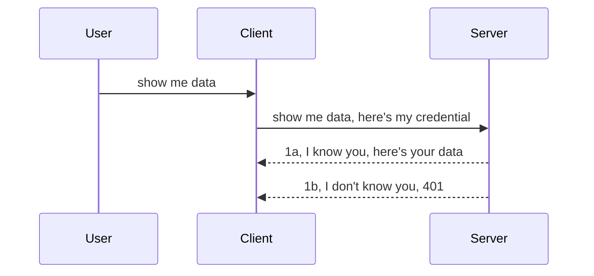

<!--
CO_OP_TRANSLATOR_METADATA:
{
  "original_hash": "5b00b8a8971a07d2d8803be4c9f138f8",
  "translation_date": "2025-10-07T00:31:06+00:00",
  "source_file": "03-GettingStarted/11-simple-auth/README.md",
  "language_code": "de"
}
-->
# Einfache Authentifizierung

Die MCP SDKs unterstützen die Verwendung von OAuth 2.1, was ehrlich gesagt ein ziemlich komplexer Prozess ist, der Konzepte wie Authentifizierungsserver, Ressourcenserver, das Übermitteln von Zugangsdaten, das Erhalten eines Codes, den Austausch des Codes gegen ein Bearer-Token und schließlich den Zugriff auf die Ressourcendaten umfasst. Wenn Sie mit OAuth nicht vertraut sind – was eine großartige Implementierung ist –, ist es eine gute Idee, mit einer grundlegenden Authentifizierung zu beginnen und sich schrittweise zu einer besseren Sicherheit zu entwickeln. Genau aus diesem Grund existiert dieses Kapitel: um Sie zu fortgeschrittener Authentifizierung hinzuführen.

## Authentifizierung – Was meinen wir damit?

"Auth" steht für Authentifizierung und Autorisierung. Die Idee dahinter ist, dass wir zwei Dinge tun müssen:

- **Authentifizierung**: Der Prozess, bei dem wir herausfinden, ob wir einer Person erlauben, unser Haus zu betreten, ob sie das Recht hat, "hier" zu sein, also Zugriff auf unseren Ressourcenserver zu haben, auf dem die MCP-Serverfunktionen laufen.
- **Autorisierung**: Der Prozess, bei dem wir herausfinden, ob ein Benutzer Zugriff auf die spezifischen Ressourcen haben sollte, die er anfordert – beispielsweise bestimmte Bestellungen oder Produkte – oder ob er beispielsweise Inhalte lesen, aber nicht löschen darf.

## Zugangsdaten: Wie wir dem System mitteilen, wer wir sind

Die meisten Webentwickler denken zunächst daran, dem Server Zugangsdaten bereitzustellen, normalerweise ein Geheimnis, das angibt, ob sie berechtigt sind, "hier" zu sein (Authentifizierung). Diese Zugangsdaten sind normalerweise eine Base64-codierte Version von Benutzername und Passwort oder ein API-Schlüssel, der einen bestimmten Benutzer eindeutig identifiziert.

Dies geschieht über einen Header namens "Authorization", etwa so:

```json
{ "Authorization": "secret123" }
```

Dies wird üblicherweise als Basis-Authentifizierung bezeichnet. Der gesamte Ablauf funktioniert dann wie folgt:



Jetzt, da wir verstehen, wie es aus Sicht des Ablaufs funktioniert, wie setzen wir es um? Nun, die meisten Webserver haben ein Konzept namens Middleware – ein Stück Code, das als Teil der Anfrage ausgeführt wird, um Zugangsdaten zu überprüfen. Wenn die Zugangsdaten gültig sind, wird die Anfrage durchgelassen. Wenn die Zugangsdaten ungültig sind, erhalten Sie einen Authentifizierungsfehler. Schauen wir uns an, wie dies implementiert werden kann:

**Python**

```python
class AuthMiddleware(BaseHTTPMiddleware):
    async def dispatch(self, request, call_next):

        has_header = request.headers.get("Authorization")
        if not has_header:
            print("-> Missing Authorization header!")
            return Response(status_code=401, content="Unauthorized")

        if not valid_token(has_header):
            print("-> Invalid token!")
            return Response(status_code=403, content="Forbidden")

        print("Valid token, proceeding...")
       
        response = await call_next(request)
        # add any customer headers or change in the response in some way
        return response


starlette_app.add_middleware(CustomHeaderMiddleware)
```

Hier haben wir:

- Eine Middleware namens `AuthMiddleware` erstellt, deren `dispatch`-Methode vom Webserver aufgerufen wird.
- Die Middleware dem Webserver hinzugefügt:

    ```python
    starlette_app.add_middleware(AuthMiddleware)
    ```

- Validierungslogik geschrieben, die überprüft, ob der Authorization-Header vorhanden ist und ob das übermittelte Geheimnis gültig ist:

    ```python
    has_header = request.headers.get("Authorization")
    if not has_header:
        print("-> Missing Authorization header!")
        return Response(status_code=401, content="Unauthorized")

    if not valid_token(has_header):
        print("-> Invalid token!")
        return Response(status_code=403, content="Forbidden")
    ```

    Wenn das Geheimnis vorhanden und gültig ist, lassen wir die Anfrage durch, indem wir `call_next` aufrufen und die Antwort zurückgeben.

    ```python
    response = await call_next(request)
    # add any customer headers or change in the response in some way
    return response
    ```

So funktioniert es: Wenn eine Webanfrage an den Server gestellt wird, wird die Middleware aufgerufen. Je nach Implementierung lässt sie die Anfrage durch oder gibt einen Fehler zurück, der anzeigt, dass der Client nicht fortfahren darf.

**TypeScript**

Hier erstellen wir eine Middleware mit dem beliebten Framework Express und fangen die Anfrage ab, bevor sie den MCP-Server erreicht. Hier ist der Code dazu:

```typescript
function isValid(secret) {
    return secret === "secret123";
}

app.use((req, res, next) => {
    // 1. Authorization header present?  
    if(!req.headers["Authorization"]) {
        res.status(401).send('Unauthorized');
    }
    
    let token = req.headers["Authorization"];

    // 2. Check validity.
    if(!isValid(token)) {
        res.status(403).send('Forbidden');
    }

   
    console.log('Middleware executed');
    // 3. Passes request to the next step in the request pipeline.
    next();
});
```

In diesem Code:

1. Überprüfen wir zunächst, ob der Authorization-Header überhaupt vorhanden ist. Falls nicht, senden wir einen 401-Fehler.
2. Stellen sicher, dass die Zugangsdaten/Token gültig sind. Falls nicht, senden wir einen 403-Fehler.
3. Lassen die Anfrage schließlich in der Verarbeitungspipeline weiterlaufen und geben die angeforderte Ressource zurück.

## Übung: Authentifizierung implementieren

Lassen Sie uns unser Wissen nutzen und versuchen, es umzusetzen. Hier ist der Plan:

Server

- Erstellen Sie einen Webserver und eine MCP-Instanz.
- Implementieren Sie eine Middleware für den Server.

Client 

- Senden Sie eine Webanfrage mit Zugangsdaten über den Header.

### -1- Erstellen eines Webservers und einer MCP-Instanz

Im ersten Schritt müssen wir die Webserver-Instanz und den MCP-Server erstellen.

**Python**

Hier erstellen wir eine MCP-Server-Instanz, eine Starlette-Web-App und hosten sie mit uvicorn.

```python
# creating MCP Server

app = FastMCP(
    name="MCP Resource Server",
    instructions="Resource Server that validates tokens via Authorization Server introspection",
    host=settings["host"],
    port=settings["port"],
    debug=True
)

# creating starlette web app
starlette_app = app.streamable_http_app()

# serving app via uvicorn
async def run(starlette_app):
    import uvicorn
    config = uvicorn.Config(
            starlette_app,
            host=app.settings.host,
            port=app.settings.port,
            log_level=app.settings.log_level.lower(),
        )
    server = uvicorn.Server(config)
    await server.serve()

run(starlette_app)
```

In diesem Code:

- Erstellen wir den MCP-Server.
- Konstruieren die Starlette-Web-App aus dem MCP-Server, `app.streamable_http_app()`.
- Hosten und bedienen die Web-App mit uvicorn `server.serve()`.

**TypeScript**

Hier erstellen wir eine MCP-Server-Instanz.

```typescript
const server = new McpServer({
      name: "example-server",
      version: "1.0.0"
    });

    // ... set up server resources, tools, and prompts ...
```

Diese MCP-Server-Erstellung muss innerhalb unserer POST-/mcp-Routen-Definition erfolgen. Nehmen wir also den obigen Code und verschieben ihn wie folgt:

```typescript
import express from "express";
import { randomUUID } from "node:crypto";
import { McpServer } from "@modelcontextprotocol/sdk/server/mcp.js";
import { StreamableHTTPServerTransport } from "@modelcontextprotocol/sdk/server/streamableHttp.js";
import { isInitializeRequest } from "@modelcontextprotocol/sdk/types.js"

const app = express();
app.use(express.json());

// Map to store transports by session ID
const transports: { [sessionId: string]: StreamableHTTPServerTransport } = {};

// Handle POST requests for client-to-server communication
app.post('/mcp', async (req, res) => {
  // Check for existing session ID
  const sessionId = req.headers['mcp-session-id'] as string | undefined;
  let transport: StreamableHTTPServerTransport;

  if (sessionId && transports[sessionId]) {
    // Reuse existing transport
    transport = transports[sessionId];
  } else if (!sessionId && isInitializeRequest(req.body)) {
    // New initialization request
    transport = new StreamableHTTPServerTransport({
      sessionIdGenerator: () => randomUUID(),
      onsessioninitialized: (sessionId) => {
        // Store the transport by session ID
        transports[sessionId] = transport;
      },
      // DNS rebinding protection is disabled by default for backwards compatibility. If you are running this server
      // locally, make sure to set:
      // enableDnsRebindingProtection: true,
      // allowedHosts: ['127.0.0.1'],
    });

    // Clean up transport when closed
    transport.onclose = () => {
      if (transport.sessionId) {
        delete transports[transport.sessionId];
      }
    };
    const server = new McpServer({
      name: "example-server",
      version: "1.0.0"
    });

    // ... set up server resources, tools, and prompts ...

    // Connect to the MCP server
    await server.connect(transport);
  } else {
    // Invalid request
    res.status(400).json({
      jsonrpc: '2.0',
      error: {
        code: -32000,
        message: 'Bad Request: No valid session ID provided',
      },
      id: null,
    });
    return;
  }

  // Handle the request
  await transport.handleRequest(req, res, req.body);
});

// Reusable handler for GET and DELETE requests
const handleSessionRequest = async (req: express.Request, res: express.Response) => {
  const sessionId = req.headers['mcp-session-id'] as string | undefined;
  if (!sessionId || !transports[sessionId]) {
    res.status(400).send('Invalid or missing session ID');
    return;
  }
  
  const transport = transports[sessionId];
  await transport.handleRequest(req, res);
};

// Handle GET requests for server-to-client notifications via SSE
app.get('/mcp', handleSessionRequest);

// Handle DELETE requests for session termination
app.delete('/mcp', handleSessionRequest);

app.listen(3000);
```

Jetzt sehen Sie, wie die MCP-Server-Erstellung innerhalb von `app.post("/mcp")` verschoben wurde.

Lassen Sie uns zum nächsten Schritt übergehen, die Middleware zu erstellen, um die eingehenden Zugangsdaten zu validieren.

### -2- Implementieren einer Middleware für den Server

Als Nächstes kümmern wir uns um die Middleware. Hier erstellen wir eine Middleware, die nach Zugangsdaten im `Authorization`-Header sucht und diese validiert. Wenn sie akzeptabel sind, wird die Anfrage weiterverarbeitet (z. B. Werkzeuge auflisten, eine Ressource lesen oder welche MCP-Funktionalität der Client auch immer angefordert hat).

**Python**

Um die Middleware zu erstellen, müssen wir eine Klasse erstellen, die von `BaseHTTPMiddleware` erbt. Es gibt zwei interessante Aspekte:

- Die Anfrage `request`, aus der wir die Header-Informationen lesen.
- `call_next`, der Callback, den wir aufrufen müssen, wenn der Client Zugangsdaten mitbringt, die wir akzeptieren.

Zuerst müssen wir den Fall behandeln, wenn der `Authorization`-Header fehlt:

```python
has_header = request.headers.get("Authorization")

# no header present, fail with 401, otherwise move on.
if not has_header:
    print("-> Missing Authorization header!")
    return Response(status_code=401, content="Unauthorized")
```

Hier senden wir eine 401 Unauthorized-Nachricht, da der Client die Authentifizierung nicht besteht.

Als Nächstes, wenn Zugangsdaten übermittelt wurden, müssen wir deren Gültigkeit überprüfen, etwa so:

```python
 if not valid_token(has_header):
    print("-> Invalid token!")
    return Response(status_code=403, content="Forbidden")
```

Beachten Sie, wie wir oben eine 403 Forbidden-Nachricht senden. Sehen wir uns die vollständige Middleware an, die alles implementiert, was wir oben erwähnt haben:

```python
class AuthMiddleware(BaseHTTPMiddleware):
    async def dispatch(self, request, call_next):

        has_header = request.headers.get("Authorization")
        if not has_header:
            print("-> Missing Authorization header!")
            return Response(status_code=401, content="Unauthorized")

        if not valid_token(has_header):
            print("-> Invalid token!")
            return Response(status_code=403, content="Forbidden")

        print("Valid token, proceeding...")
        print(f"-> Received {request.method} {request.url}")
        response = await call_next(request)
        response.headers['Custom'] = 'Example'
        return response

```

Gut, aber was ist mit der Funktion `valid_token`? Hier ist sie unten:

```python
# DON'T use for production - improve it !!
def valid_token(token: str) -> bool:
    # remove the "Bearer " prefix
    if token.startswith("Bearer "):
        token = token[7:]
        return token == "secret-token"
    return False
```

Dies sollte natürlich verbessert werden.

WICHTIG: Sie sollten NIEMALS Geheimnisse wie diese im Code haben. Idealerweise sollten Sie den Wert aus einer Datenquelle oder einem IDP (Identity Service Provider) abrufen oder besser noch, die Validierung dem IDP überlassen.

**TypeScript**

Um dies mit Express zu implementieren, müssen wir die Methode `use` aufrufen, die Middleware-Funktionen akzeptiert.

Wir müssen:

- Mit der Anfrage-Variable interagieren, um die übergebenen Zugangsdaten in der `Authorization`-Eigenschaft zu überprüfen.
- Die Zugangsdaten validieren und, falls gültig, die Anfrage weiterleiten, damit die MCP-Anfrage des Clients das tun kann, was sie soll (z. B. Werkzeuge auflisten, Ressource lesen oder andere MCP-bezogene Aufgaben).

Hier überprüfen wir, ob der `Authorization`-Header vorhanden ist, und wenn nicht, stoppen wir die Anfrage:

```typescript
if(!req.headers["authorization"]) {
    res.status(401).send('Unauthorized');
    return;
}
```

Wenn der Header nicht gesendet wird, erhalten Sie eine 401.

Als Nächstes überprüfen wir, ob die Zugangsdaten gültig sind. Wenn nicht, stoppen wir die Anfrage erneut, aber mit einer leicht anderen Nachricht:

```typescript
if(!isValid(token)) {
    res.status(403).send('Forbidden');
    return;
} 
```

Beachten Sie, wie Sie jetzt einen 403-Fehler erhalten.

Hier ist der vollständige Code:

```typescript
app.use((req, res, next) => {
    console.log('Request received:', req.method, req.url, req.headers);
    console.log('Headers:', req.headers["authorization"]);
    if(!req.headers["authorization"]) {
        res.status(401).send('Unauthorized');
        return;
    }
    
    let token = req.headers["authorization"];

    if(!isValid(token)) {
        res.status(403).send('Forbidden');
        return;
    }  

    console.log('Middleware executed');
    next();
});
```

Wir haben den Webserver so eingerichtet, dass er eine Middleware akzeptiert, die die Zugangsdaten überprüft, die der Client hoffentlich sendet. Was ist mit dem Client selbst?

### -3- Senden einer Webanfrage mit Zugangsdaten über den Header

Wir müssen sicherstellen, dass der Client die Zugangsdaten über den Header übergibt. Da wir einen MCP-Client verwenden werden, müssen wir herausfinden, wie das gemacht wird.

**Python**

Für den Client müssen wir einen Header mit unseren Zugangsdaten übergeben, etwa so:

```python
# DON'T hardcode the value, have it at minimum in an environment variable or a more secure storage
token = "secret-token"

async with streamablehttp_client(
        url = f"http://localhost:{port}/mcp",
        headers = {"Authorization": f"Bearer {token}"}
    ) as (
        read_stream,
        write_stream,
        session_callback,
    ):
        async with ClientSession(
            read_stream,
            write_stream
        ) as session:
            await session.initialize()
      
            # TODO, what you want done in the client, e.g list tools, call tools etc.
```

Beachten Sie, wie wir die Eigenschaft `headers` so befüllen: `headers = {"Authorization": f"Bearer {token}"}`.

**TypeScript**

Wir können dies in zwei Schritten lösen:

1. Ein Konfigurationsobjekt mit unseren Zugangsdaten befüllen.
2. Das Konfigurationsobjekt an den Transport übergeben.

```typescript

// DON'T hardcode the value like shown here. At minimum have it as a env variable and use something like dotenv (in dev mode).
let token = "secret123"

// define a client transport option object
let options: StreamableHTTPClientTransportOptions = {
  sessionId: sessionId,
  requestInit: {
    headers: {
      "Authorization": "secret123"
    }
  }
};

// pass the options object to the transport
async function main() {
   const transport = new StreamableHTTPClientTransport(
      new URL(serverUrl),
      options
   );
```

Hier sehen Sie oben, wie wir ein `options`-Objekt erstellen mussten und unsere Header unter der Eigenschaft `requestInit` platziert haben.

WICHTIG: Wie können wir dies von hier aus verbessern? Nun, die aktuelle Implementierung hat einige Probleme. Erstens ist das Übermitteln von Zugangsdaten auf diese Weise ziemlich riskant, es sei denn, Sie verwenden mindestens HTTPS. Selbst dann können die Zugangsdaten gestohlen werden, sodass Sie ein System benötigen, in dem Sie das Token leicht widerrufen und zusätzliche Prüfungen hinzufügen können, wie z. B. woher es kommt, ob die Anfrage viel zu häufig erfolgt (botartiges Verhalten). Kurz gesagt, es gibt eine ganze Reihe von Bedenken.

Es sollte jedoch gesagt werden, dass dies für sehr einfache APIs, bei denen Sie nicht möchten, dass jemand Ihre API ohne Authentifizierung aufruft, ein guter Anfang ist.

Damit gesagt, versuchen wir, die Sicherheit ein wenig zu verbessern, indem wir ein standardisiertes Format wie JSON Web Token, auch bekannt als JWT oder "JOT"-Token, verwenden.

## JSON Web Tokens, JWT

Also, wir versuchen, uns von der Übermittlung sehr einfacher Zugangsdaten zu verbessern. Welche unmittelbaren Verbesserungen erhalten wir durch die Einführung von JWT?

- **Sicherheitsverbesserungen**: Bei der Basis-Authentifizierung senden Sie den Benutzernamen und das Passwort als Base64-codiertes Token (oder Sie senden einen API-Schlüssel) immer wieder, was das Risiko erhöht. Mit JWT senden Sie Ihren Benutzernamen und Ihr Passwort und erhalten ein Token zurück, das zudem zeitlich begrenzt ist, d. h. es wird ablaufen. JWT ermöglicht Ihnen eine feingranulare Zugriffskontrolle mithilfe von Rollen, Scopes und Berechtigungen.
- **Zustandslosigkeit und Skalierbarkeit**: JWTs sind eigenständig, sie enthalten alle Benutzerinformationen und eliminieren die Notwendigkeit, serverseitigen Sitzungs-Speicher zu verwenden. Token können auch lokal validiert werden.
- **Interoperabilität und Föderation**: JWTs sind zentral für Open ID Connect und werden mit bekannten Identitätsanbietern wie Entra ID, Google Identity und Auth0 verwendet. Sie ermöglichen auch die Nutzung von Single Sign-On und vieles mehr, was sie unternehmensfähig macht.
- **Modularität und Flexibilität**: JWTs können auch mit API-Gateways wie Azure API Management, NGINX und mehr verwendet werden. Sie unterstützen auch Authentifizierungsszenarien und Server-zu-Server-Kommunikation, einschließlich Szenarien wie Impersonation und Delegation.
- **Leistung und Caching**: JWTs können nach dem Decodieren zwischengespeichert werden, was die Notwendigkeit des Parsens reduziert. Dies hilft insbesondere bei hochfrequentierten Apps, da es den Durchsatz verbessert und die Belastung Ihrer Infrastruktur verringert.
- **Erweiterte Funktionen**: Sie unterstützen auch Introspektion (Überprüfung der Gültigkeit auf dem Server) und Widerruf (Ungültigmachen eines Tokens).

Mit all diesen Vorteilen sehen wir uns an, wie wir unsere Implementierung auf die nächste Stufe bringen können.

## Basis-Authentifizierung in JWT umwandeln

Die Änderungen, die wir auf einer hohen Ebene vornehmen müssen, sind:

- **JWT-Token erstellen**: Lernen, wie man ein JWT-Token konstruiert und es bereit macht, vom Client an den Server gesendet zu werden.
- **JWT-Token validieren**: Überprüfen, ob ein JWT-Token gültig ist, und falls ja, dem Client Zugriff auf unsere Ressourcen gewähren.
- **Sichere Token-Speicherung**: Wie wir dieses Token speichern.
- **Routen schützen**: Wir müssen die Routen schützen, in unserem Fall müssen wir Routen und spezifische MCP-Funktionen schützen.
- **Refresh-Tokens hinzufügen**: Sicherstellen, dass wir Tokens erstellen, die kurzlebig sind, aber Refresh-Tokens, die langlebig sind und verwendet werden können, um neue Tokens zu erhalten, wenn sie ablaufen. Außerdem sicherstellen, dass es einen Refresh-Endpunkt und eine Rotationsstrategie gibt.

### -1- JWT-Token erstellen

Ein JWT-Token hat folgende Bestandteile:

- **Header**: Algorithmus und Token-Typ.
- **Payload**: Claims, wie `sub` (der Benutzer oder die Entität, die das Token repräsentiert – in einem Authentifizierungsszenario ist dies typischerweise die Benutzer-ID), `exp` (wann es abläuft), `role` (die Rolle).
- **Signatur**: Signiert mit einem Geheimnis oder privaten Schlüssel.

Dazu müssen wir den Header, die Payload und das codierte Token erstellen.

**Python**

```python

import jwt
import jwt
from jwt.exceptions import ExpiredSignatureError, InvalidTokenError
import datetime

# Secret key used to sign the JWT
secret_key = 'your-secret-key'

header = {
    "alg": "HS256",
    "typ": "JWT"
}

# the user info andits claims and expiry time
payload = {
    "sub": "1234567890",               # Subject (user ID)
    "name": "User Userson",                # Custom claim
    "admin": True,                     # Custom claim
    "iat": datetime.datetime.utcnow(),# Issued at
    "exp": datetime.datetime.utcnow() + datetime.timedelta(hours=1)  # Expiry
}

# encode it
encoded_jwt = jwt.encode(payload, secret_key, algorithm="HS256", headers=header)
```

In dem obigen Code haben wir:

- Einen Header definiert, der HS256 als Algorithmus und JWT als Typ verwendet.
- Eine Payload erstellt, die ein Subjekt oder eine Benutzer-ID, einen Benutzernamen, eine Rolle, den Zeitpunkt der Ausstellung und den Zeitpunkt des Ablaufs enthält, wodurch der zeitlich begrenzte Aspekt implementiert wird, den wir zuvor erwähnt haben.

**TypeScript**

Hier benötigen wir einige Abhängigkeiten, die uns beim Erstellen des JWT-Tokens helfen.

Abhängigkeiten

```sh

npm install jsonwebtoken
npm install --save-dev @types/jsonwebtoken
```

Jetzt, da wir das eingerichtet haben, erstellen wir den Header, die Payload und daraus das codierte Token.

```typescript
import jwt from 'jsonwebtoken';

const secretKey = 'your-secret-key'; // Use env vars in production

// Define the payload
const payload = {
  sub: '1234567890',
  name: 'User usersson',
  admin: true,
  iat: Math.floor(Date.now() / 1000), // Issued at
  exp: Math.floor(Date.now() / 1000) + 60 * 60 // Expires in 1 hour
};

// Define the header (optional, jsonwebtoken sets defaults)
const header = {
  alg: 'HS256',
  typ: 'JWT'
};

// Create the token
const token = jwt.sign(payload, secretKey, {
  algorithm: 'HS256',
  header: header
});

console.log('JWT:', token);
```

Dieses Token ist:

- Mit HS256 signiert.
- Für 1 Stunde gültig.
- Enthält Claims wie `sub`, `name`, `admin`, `iat` und `exp`.

### -2- Token validieren

Wir müssen auch ein Token validieren, was wir auf dem Server tun sollten, um sicherzustellen, dass das, was der Client uns sendet, tatsächlich gültig ist. Es gibt viele Prüfungen, die wir hier durchführen sollten, von der Validierung der Struktur bis zur Gültigkeit. Es wird auch empfohlen, zusätzliche Prüfungen durchzuführen, um sicherzustellen, dass der Benutzer in Ihrem System existiert und mehr.

Um ein Token zu validieren, müssen wir es decodieren, damit wir es lesen und dann seine Gültigkeit überprüfen können:

**Python**

```python

# Decode and verify the JWT
try:
    decoded = jwt.decode(token, secret_key, algorithms=["HS256"])
    print("✅ Token is valid.")
    print("Decoded claims:")
    for key, value in decoded.items():
        print(f"  {key}: {value}")
except ExpiredSignatureError:
    print("❌ Token has expired.")
except InvalidTokenError as e:
    print(f"❌ Invalid token: {e}")

```

In diesem Code rufen wir `jwt.decode` auf, wobei das Token, der geheime Schlüssel und der gewählte Algorithmus als Eingabe verwendet werden. Beachten Sie, wie wir eine Try-Catch-Konstruktion verwenden, da eine fehlgeschlagene Validierung zu einem Fehler führt.

**TypeScript**

Hier müssen wir `jwt.verify` aufrufen, um eine decodierte Version des Tokens zu erhalten, die wir weiter analysieren können. Wenn dieser Aufruf fehlschlägt, bedeutet das, dass die Struktur des Tokens falsch ist oder es nicht mehr gültig ist.

```typescript

try {
  const decoded = jwt.verify(token, secretKey);
  console.log('Decoded Payload:', decoded);
} catch (err) {
  console.error('Token verification failed:', err);
}
```

HINWEIS: Wie bereits erwähnt, sollten wir zusätzliche Prüfungen durchführen, um sicherzustellen, dass dieses Token auf einen Benutzer in unserem System verweist und dass der Benutzer die Rechte hat, die er beansprucht.
Als Nächstes schauen wir uns rollenbasierte Zugriffskontrolle an, auch bekannt als RBAC.

## Hinzufügen von rollenbasierter Zugriffskontrolle

Die Idee ist, dass wir ausdrücken möchten, dass verschiedene Rollen unterschiedliche Berechtigungen haben. Zum Beispiel gehen wir davon aus, dass ein Admin alles tun kann, ein normaler Benutzer lesen/schreiben kann und ein Gast nur lesen darf. Daher sind hier einige mögliche Berechtigungsstufen:

- Admin.Write 
- User.Read
- Guest.Read

Schauen wir uns an, wie wir eine solche Kontrolle mit Middleware implementieren können. Middleware kann sowohl pro Route als auch für alle Routen hinzugefügt werden.

**Python**

```python
from starlette.middleware.base import BaseHTTPMiddleware
from starlette.responses import JSONResponse
import jwt

# DON'T have the secret in the code like, this is for demonstration purposes only. Read it from a safe place.
SECRET_KEY = "your-secret-key" # put this in env variable
REQUIRED_PERMISSION = "User.Read"

class JWTPermissionMiddleware(BaseHTTPMiddleware):
    async def dispatch(self, request, call_next):
        auth_header = request.headers.get("Authorization")
        if not auth_header or not auth_header.startswith("Bearer "):
            return JSONResponse({"error": "Missing or invalid Authorization header"}, status_code=401)

        token = auth_header.split(" ")[1]
        try:
            decoded = jwt.decode(token, SECRET_KEY, algorithms=["HS256"])
        except jwt.ExpiredSignatureError:
            return JSONResponse({"error": "Token expired"}, status_code=401)
        except jwt.InvalidTokenError:
            return JSONResponse({"error": "Invalid token"}, status_code=401)

        permissions = decoded.get("permissions", [])
        if REQUIRED_PERMISSION not in permissions:
            return JSONResponse({"error": "Permission denied"}, status_code=403)

        request.state.user = decoded
        return await call_next(request)


```

Es gibt einige verschiedene Möglichkeiten, die Middleware wie unten hinzuzufügen:

```python

# Alt 1: add middleware while constructing starlette app
middleware = [
    Middleware(JWTPermissionMiddleware)
]

app = Starlette(routes=routes, middleware=middleware)

# Alt 2: add middleware after starlette app is a already constructed
starlette_app.add_middleware(JWTPermissionMiddleware)

# Alt 3: add middleware per route
routes = [
    Route(
        "/mcp",
        endpoint=..., # handler
        middleware=[Middleware(JWTPermissionMiddleware)]
    )
]
```

**TypeScript**

Wir können `app.use` verwenden und eine Middleware hinzufügen, die für alle Anfragen ausgeführt wird.

```typescript
app.use((req, res, next) => {
    console.log('Request received:', req.method, req.url, req.headers);
    console.log('Headers:', req.headers["authorization"]);

    // 1. Check if authorization header has been sent

    if(!req.headers["authorization"]) {
        res.status(401).send('Unauthorized');
        return;
    }
    
    let token = req.headers["authorization"];

    // 2. Check if token is valid
    if(!isValid(token)) {
        res.status(403).send('Forbidden');
        return;
    }  

    // 3. Check if token user exist in our system
    if(!isExistingUser(token)) {
        res.status(403).send('Forbidden');
        console.log("User does not exist");
        return;
    }
    console.log("User exists");

    // 4. Verify the token has the right permissions
    if(!hasScopes(token, ["User.Read"])){
        res.status(403).send('Forbidden - insufficient scopes');
    }

    console.log("User has required scopes");

    console.log('Middleware executed');
    next();
});

```

Es gibt einige wichtige Dinge, die unsere Middleware tun kann und tun SOLLTE, nämlich:

1. Überprüfen, ob der Authorization-Header vorhanden ist.
2. Überprüfen, ob das Token gültig ist. Wir rufen `isValid` auf, eine Methode, die wir geschrieben haben, um die Integrität und Gültigkeit des JWT-Tokens zu überprüfen.
3. Verifizieren, dass der Benutzer in unserem System existiert. Dies sollten wir überprüfen.

   ```typescript
    // users in DB
   const users = [
     "user1",
     "User usersson",
   ]

   function isExistingUser(token) {
     let decodedToken = verifyToken(token);

     // TODO, check if user exists in DB
     return users.includes(decodedToken?.name || "");
   }
   ```

   Oben haben wir eine sehr einfache `users`-Liste erstellt, die natürlich in einer Datenbank gespeichert werden sollte.

4. Zusätzlich sollten wir auch überprüfen, ob das Token die richtigen Berechtigungen hat.

   ```typescript
   if(!hasScopes(token, ["User.Read"])){
        res.status(403).send('Forbidden - insufficient scopes');
   }
   ```

   In diesem Code oben aus der Middleware überprüfen wir, ob das Token die Berechtigung User.Read enthält. Falls nicht, senden wir einen 403-Fehler. Unten ist die Hilfsmethode `hasScopes`.

   ```typescript
   function hasScopes(scope: string, requiredScopes: string[]) {
     let decodedToken = verifyToken(scope);
    return requiredScopes.every(scope => decodedToken?.scopes.includes(scope));
  }
   ```

Have a think which additional checks you should be doing, but these are the absolute minimum of checks you should be doing.

Using Express as a web framework is a common choice. There are helpers library when you use JWT so you can write less code.

- `express-jwt`, helper library that provides a middleware that helps decode your token.
- `express-jwt-permissions`, this provides a middleware `guard` that helps check if a certain permission is on the token.

Here's what these libraries can look like when used:

```typescript
const express = require('express');
const jwt = require('express-jwt');
const guard = require('express-jwt-permissions')();

const app = express();
const secretKey = 'your-secret-key'; // put this in env variable

// Decode JWT and attach to req.user
app.use(jwt({ secret: secretKey, algorithms: ['HS256'] }));

// Check for User.Read permission
app.use(guard.check('User.Read'));

// multiple permissions
// app.use(guard.check(['User.Read', 'Admin.Access']));

app.get('/protected', (req, res) => {
  res.json({ message: `Welcome ${req.user.name}` });
});

// Error handler
app.use((err, req, res, next) => {
  if (err.code === 'permission_denied') {
    return res.status(403).send('Forbidden');
  }
  next(err);
});

```

Jetzt haben Sie gesehen, wie Middleware sowohl für Authentifizierung als auch für Autorisierung verwendet werden kann. Aber was ist mit MCP? Ändert sich dadurch, wie wir Authentifizierung durchführen? Finden wir es im nächsten Abschnitt heraus.

### -3- RBAC zu MCP hinzufügen

Sie haben bisher gesehen, wie Sie RBAC über Middleware hinzufügen können. Für MCP gibt es jedoch keinen einfachen Weg, RBAC pro MCP-Funktion hinzuzufügen. Was tun wir also? Nun, wir müssen einfach Code hinzufügen, der in diesem Fall überprüft, ob der Client die Rechte hat, ein bestimmtes Tool aufzurufen:

Es gibt einige verschiedene Möglichkeiten, wie Sie RBAC pro Funktion umsetzen können. Hier sind einige:

- Fügen Sie eine Überprüfung für jedes Tool, jede Ressource und jeden Prompt hinzu, bei denen Sie die Berechtigungsstufe überprüfen müssen.

   **Python**

   ```python
   @tool()
   def delete_product(id: int):
      try:
          check_permissions(role="Admin.Write", request)
      catch:
        pass # client failed authorization, raise authorization error
   ```

   **TypeScript**

   ```typescript
   server.registerTool(
    "delete-product",
    {
      title: Delete a product",
      description: "Deletes a product",
      inputSchema: { id: z.number() }
    },
    async ({ id }) => {
      
      try {
        checkPermissions("Admin.Write", request);
        // todo, send id to productService and remote entry
      } catch(Exception e) {
        console.log("Authorization error, you're not allowed");  
      }

      return {
        content: [{ type: "text", text: `Deletected product with id ${id}` }]
      };
    }
   );
   ```


- Verwenden Sie einen erweiterten Serveransatz und die Request-Handler, um die Anzahl der Stellen zu minimieren, an denen Sie die Überprüfung durchführen müssen.

   **Python**

   ```python
   
   tool_permission = {
      "create_product": ["User.Write", "Admin.Write"],
      "delete_product": ["Admin.Write"]
   }

   def has_permission(user_permissions, required_permissions) -> bool:
      # user_permissions: list of permissions the user has
      # required_permissions: list of permissions required for the tool
      return any(perm in user_permissions for perm in required_permissions)

   @server.call_tool()
   async def handle_call_tool(
     name: str, arguments: dict[str, str] | None
   ) -> list[types.TextContent]:
    # Assume request.user.permissions is a list of permissions for the user
     user_permissions = request.user.permissions
     required_permissions = tool_permission.get(name, [])
     if not has_permission(user_permissions, required_permissions):
        # Raise error "You don't have permission to call tool {name}"
        raise Exception(f"You don't have permission to call tool {name}")
     # carry on and call tool
     # ...
   ```   
   

   **TypeScript**

   ```typescript
   function hasPermission(userPermissions: string[], requiredPermissions: string[]): boolean {
       if (!Array.isArray(userPermissions) || !Array.isArray(requiredPermissions)) return false;
       // Return true if user has at least one required permission
       
       return requiredPermissions.some(perm => userPermissions.includes(perm));
   }
  
   server.setRequestHandler(CallToolRequestSchema, async (request) => {
      const { params: { name } } = request;
  
      let permissions = request.user.permissions;
  
      if (!hasPermission(permissions, toolPermissions[name])) {
         return new Error(`You don't have permission to call ${name}`);
      }
  
      // carry on..
   });
   ```

   Beachten Sie, dass Ihre Middleware sicherstellen muss, dass ein dekodiertes Token der Benutzer-Eigenschaft der Anfrage zugewiesen wird, damit der obige Code vereinfacht wird.

### Zusammenfassung

Nachdem wir besprochen haben, wie man RBAC im Allgemeinen und speziell für MCP unterstützt, ist es an der Zeit, selbst Sicherheitsmaßnahmen zu implementieren, um sicherzustellen, dass Sie die vorgestellten Konzepte verstanden haben.

## Aufgabe 1: Erstellen Sie einen MCP-Server und einen MCP-Client mit einfacher Authentifizierung

Hier wenden Sie an, was Sie über das Senden von Anmeldedaten durch Header gelernt haben.

## Lösung 1

[Solution 1](./code/basic/README.md)

## Aufgabe 2: Aktualisieren Sie die Lösung aus Aufgabe 1, um JWT zu verwenden

Nehmen Sie die erste Lösung, aber verbessern Sie sie diesmal.

Anstatt Basic Auth zu verwenden, verwenden wir JWT.

## Lösung 2

[Solution 2](./solution/jwt-solution/README.md)

## Herausforderung

Fügen Sie RBAC pro Tool hinzu, wie wir es im Abschnitt "RBAC zu MCP hinzufügen" beschrieben haben.

## Zusammenfassung

Hoffentlich haben Sie in diesem Kapitel viel gelernt, von keiner Sicherheit über grundlegende Sicherheit bis hin zu JWT und wie es zu MCP hinzugefügt werden kann.

Wir haben eine solide Grundlage mit benutzerdefinierten JWTs geschaffen, aber während wir skalieren, bewegen wir uns zu einem standardbasierten Identitätsmodell. Die Einführung eines IdP wie Entra oder Keycloak ermöglicht es uns, die Token-Ausstellung, Validierung und Lebenszyklusverwaltung an eine vertrauenswürdige Plattform auszulagern — so können wir uns auf die App-Logik und die Benutzererfahrung konzentrieren.

Dazu haben wir ein [fortgeschrittenes Kapitel über Entra](../../05-AdvancedTopics/mcp-security-entra/README.md).

---

**Haftungsausschluss**:  
Dieses Dokument wurde mit dem KI-Übersetzungsdienst [Co-op Translator](https://github.com/Azure/co-op-translator) übersetzt. Obwohl wir uns um Genauigkeit bemühen, beachten Sie bitte, dass automatisierte Übersetzungen Fehler oder Ungenauigkeiten enthalten können. Das Originaldokument in seiner ursprünglichen Sprache sollte als maßgebliche Quelle betrachtet werden. Für kritische Informationen wird eine professionelle menschliche Übersetzung empfohlen. Wir übernehmen keine Haftung für Missverständnisse oder Fehlinterpretationen, die sich aus der Nutzung dieser Übersetzung ergeben.