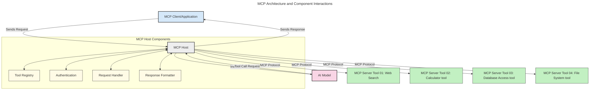
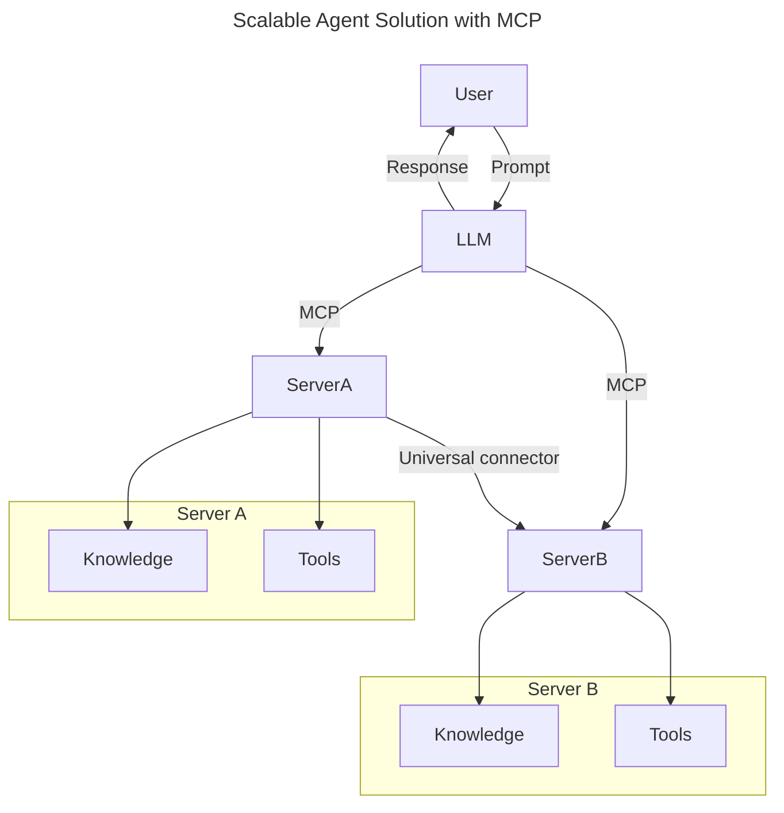
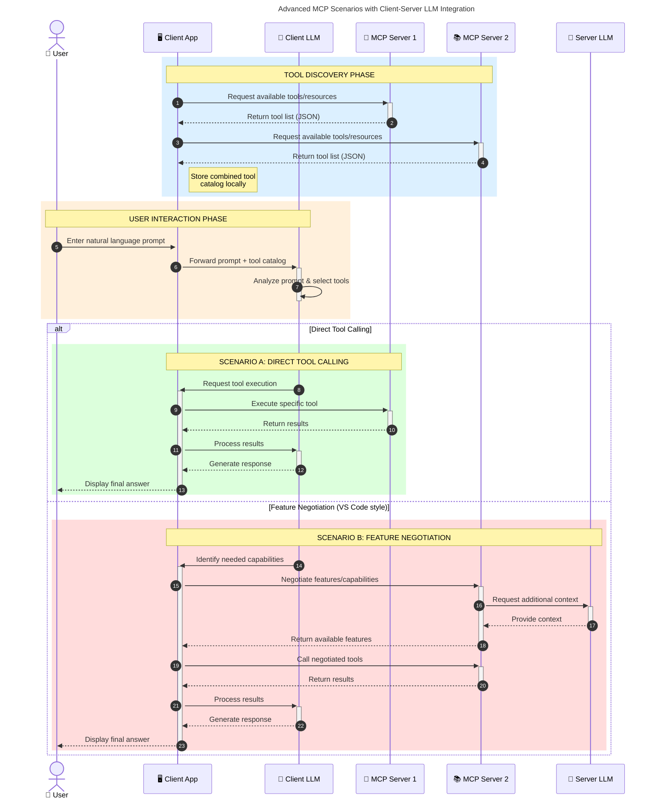

<!--
CO_OP_TRANSLATOR_METADATA:
{
  "original_hash": "9678e0c6945b8e0c23586869b0e26783",
  "translation_date": "2025-10-06T11:01:43+00:00",
  "source_file": "00-Introduction/README.md",
  "language_code": "el"
}
-->
# Εισαγωγή στο Πρωτόκολλο Πλαισίου Μοντέλου (MCP): Γιατί Είναι Σημαντικό για Επεκτάσιμες Εφαρμογές AI

_(Κάντε κλικ στην εικόνα παραπάνω για να δείτε το βίντεο αυτού του μαθήματος)_

Οι εφαρμογές γενετικής AI αποτελούν ένα σημαντικό βήμα προς τα εμπρός, καθώς συχνά επιτρέπουν στον χρήστη να αλληλεπιδρά με την εφαρμογή χρησιμοποιώντας φυσική γλώσσα. Ωστόσο, καθώς επενδύονται περισσότερος χρόνος και πόροι σε τέτοιες εφαρμογές, θέλετε να βεβαιωθείτε ότι μπορείτε εύκολα να ενσωματώσετε λειτουργίες και πόρους με τρόπο που να είναι εύκολο να επεκταθεί, να υποστηρίζει περισσότερα από ένα μοντέλα και να διαχειρίζεται διάφορες ιδιαιτερότητες μοντέλων. Με λίγα λόγια, η δημιουργία εφαρμογών Gen AI είναι εύκολη στην αρχή, αλλά καθώς μεγαλώνουν και γίνονται πιο περίπλοκες, χρειάζεται να αρχίσετε να ορίζετε μια αρχιτεκτονική και πιθανότατα να βασιστείτε σε ένα πρότυπο για να διασφαλίσετε ότι οι εφαρμογές σας χτίζονται με συνεπή τρόπο. Εδώ έρχεται το MCP για να οργανώσει τα πράγματα και να παρέχει ένα πρότυπο.

---

## **🔍 Τι Είναι το Πρωτόκολλο Πλαισίου Μοντέλου (MCP);**

Το **Πρωτόκολλο Πλαισίου Μοντέλου (MCP)** είναι μια **ανοιχτή, τυποποιημένη διεπαφή** που επιτρέπει στα Μεγάλα Μοντέλα Γλώσσας (LLMs) να αλληλεπιδρούν απρόσκοπτα με εξωτερικά εργαλεία, APIs και πηγές δεδομένων. Παρέχει μια συνεπή αρχιτεκτονική για την ενίσχυση της λειτουργικότητας των μοντέλων AI πέρα από τα δεδομένα εκπαίδευσής τους, επιτρέποντας πιο έξυπνα, επεκτάσιμα και πιο ευέλικτα συστήματα AI.

---

## **🎯 Γιατί Η Τυποποίηση στην AI Είναι Σημαντική**

Καθώς οι εφαρμογές γενετικής AI γίνονται πιο περίπλοκες, είναι απαραίτητο να υιοθετηθούν πρότυπα που εξασφαλίζουν **επεκτασιμότητα, ευελιξία, συντηρησιμότητα** και **αποφυγή εξάρτησης από συγκεκριμένους προμηθευτές**. Το MCP ανταποκρίνεται σε αυτές τις ανάγκες μέσω:

- Ενοποίησης των ενσωματώσεων μοντέλων-εργαλείων
- Μείωσης των εύθραυστων, μοναδικών λύσεων
- Επιτρέποντας τη συνύπαρξη πολλαπλών μοντέλων από διαφορετικούς προμηθευτές σε ένα οικοσύστημα

**Σημείωση:** Παρόλο που το MCP παρουσιάζεται ως ανοιχτό πρότυπο, δεν υπάρχουν σχέδια για την τυποποίηση του MCP μέσω οποιουδήποτε υπάρχοντος οργανισμού τυποποίησης, όπως IEEE, IETF, W3C, ISO ή οποιοδήποτε άλλο.

---

## **📚 Στόχοι Μάθησης**

Μέχρι το τέλος αυτού του άρθρου, θα μπορείτε να:

- Ορίσετε το **Πρωτόκολλο Πλαισίου Μοντέλου (MCP)** και τις χρήσεις του
- Κατανοήσετε πώς το MCP τυποποιεί την επικοινωνία μοντέλου-εργαλείου
- Αναγνωρίσετε τα βασικά στοιχεία της αρχιτεκτονικής MCP
- Εξερευνήσετε πραγματικές εφαρμογές του MCP σε επιχειρηματικά και αναπτυξιακά περιβάλλοντα

---

## **💡 Γιατί Το Πρωτόκολλο Πλαισίου Μοντέλου (MCP) Είναι Επαναστατικό**

### **🔗 Το MCP Λύνει τη Κατακερματισμένη Επικοινωνία στην AI**

Πριν το MCP, η ενσωμάτωση μοντέλων με εργαλεία απαιτούσε:

- Ειδικό κώδικα για κάθε ζεύγος εργαλείου-μοντέλου
- Μη τυποποιημένα APIs για κάθε προμηθευτή
- Συχνές διακοπές λόγω ενημερώσεων
- Κακή επεκτασιμότητα με περισσότερα εργαλεία

### **✅ Οφέλη της Τυποποίησης MCP**

| **Όφελος**              | **Περιγραφή**                                                                |
|--------------------------|--------------------------------------------------------------------------------|
| Διαλειτουργικότητα       | Τα LLMs λειτουργούν απρόσκοπτα με εργαλεία από διαφορετικούς προμηθευτές       |
| Συνέπεια                | Ομοιόμορφη συμπεριφορά σε πλατφόρμες και εργαλεία                              |
| Επαναχρησιμότητα         | Εργαλεία που δημιουργούνται μία φορά μπορούν να χρησιμοποιηθούν σε διάφορα έργα |
| Επιτάχυνση Ανάπτυξης     | Μείωση χρόνου ανάπτυξης μέσω τυποποιημένων διεπαφών plug-and-play             |

---

## **🧱 Επισκόπηση Υψηλού Επιπέδου Αρχιτεκτονικής MCP**

Το MCP ακολουθεί ένα **μοντέλο πελάτη-διακομιστή**, όπου:

- **MCP Hosts** εκτελούν τα μοντέλα AI
- **MCP Clients** ξεκινούν αιτήματα
- **MCP Servers** παρέχουν πλαίσιο, εργαλεία και δυνατότητες

### **Βασικά Στοιχεία:**

- **Πόροι** – Στατικά ή δυναμικά δεδομένα για μοντέλα  
- **Προτροπές** – Προκαθορισμένες ροές εργασίας για καθοδηγούμενη δημιουργία  
- **Εργαλεία** – Εκτελέσιμες λειτουργίες όπως αναζήτηση, υπολογισμοί  
- **Δειγματοληψία** – Συμπεριφορά πρακτόρων μέσω επαναληπτικών αλληλεπιδράσεων

---

## Πώς Λειτουργούν οι MCP Servers

Οι MCP servers λειτουργούν ως εξής:

- **Ροή Αιτήματος**:
    1. Ένα αίτημα ξεκινά από έναν τελικό χρήστη ή λογισμικό που ενεργεί εκ μέρους του.
    2. Ο **MCP Client** στέλνει το αίτημα σε έναν **MCP Host**, ο οποίος διαχειρίζεται το runtime του μοντέλου AI.
    3. Το **Μοντέλο AI** λαμβάνει την προτροπή του χρήστη και μπορεί να ζητήσει πρόσβαση σε εξωτερικά εργαλεία ή δεδομένα μέσω μιας ή περισσότερων κλήσεων εργαλείων.
    4. Ο **MCP Host**, όχι το μοντέλο απευθείας, επικοινωνεί με τον κατάλληλο **MCP Server(s)** χρησιμοποιώντας το τυποποιημένο πρωτόκολλο.
- **Λειτουργικότητα MCP Host**:
    - **Κατάλογος Εργαλείων**: Διατηρεί έναν κατάλογο διαθέσιμων εργαλείων και των δυνατοτήτων τους.
    - **Αυθεντικοποίηση**: Επαληθεύει δικαιώματα πρόσβασης στα εργαλεία.
    - **Διαχειριστής Αιτημάτων**: Επεξεργάζεται εισερχόμενα αιτήματα εργαλείων από το μοντέλο.
    - **Διαμορφωτής Απαντήσεων**: Δομεί τις εξόδους εργαλείων σε μορφή που κατανοεί το μοντέλο.
- **Εκτέλεση MCP Server**:
    - Ο **MCP Host** δρομολογεί κλήσεις εργαλείων σε έναν ή περισσότερους **MCP Servers**, καθένας από τους οποίους εκθέτει εξειδικευμένες λειτουργίες (π.χ., αναζήτηση, υπολογισμοί, ερωτήματα βάσεων δεδομένων).
    - Οι **MCP Servers** εκτελούν τις αντίστοιχες λειτουργίες τους και επιστρέφουν αποτελέσματα στον **MCP Host** σε συνεπή μορφή.
    - Ο **MCP Host** διαμορφώνει και μεταφέρει αυτά τα αποτελέσματα στο **Μοντέλο AI**.
- **Ολοκλήρωση Απάντησης**:
    - Το **Μοντέλο AI** ενσωματώνει τις εξόδους εργαλείων σε μια τελική απάντηση.
    - Ο **MCP Host** στέλνει αυτήν την απάντηση πίσω στον **MCP Client**, ο οποίος την παραδίδει στον τελικό χρήστη ή το καλούν λογισμικό.

## 👨‍💻 Πώς να Δημιουργήσετε έναν MCP Server (Με Παραδείγματα)

Οι MCP servers σας επιτρέπουν να επεκτείνετε τις δυνατότητες των LLMs παρέχοντας δεδομένα και λειτουργικότητα.

Έτοιμοι να το δοκιμάσετε; Ακολουθούν SDKs με παραδείγματα για τη δημιουργία απλών MCP servers σε διαφορετικές γλώσσες/στοίβες:

- **Python SDK**: https://github.com/modelcontextprotocol/python-sdk

- **TypeScript SDK**: https://github.com/modelcontextprotocol/typescript-sdk

- **Java SDK**: https://github.com/modelcontextprotocol/java-sdk

- **C#/.NET SDK**: https://github.com/modelcontextprotocol/csharp-sdk

## 🌍 Πραγματικές Χρήσεις του MCP

Το MCP επιτρέπει ένα ευρύ φάσμα εφαρμογών επεκτείνοντας τις δυνατότητες της AI:

| **Εφαρμογή**               | **Περιγραφή**                                                                |
|----------------------------|--------------------------------------------------------------------------------|
| Ενσωμάτωση Δεδομένων Επιχειρήσεων | Σύνδεση LLMs με βάσεις δεδομένων, CRMs ή εσωτερικά εργαλεία                 |
| Πρακτορικά Συστήματα AI     | Ενεργοποίηση αυτόνομων πρακτόρων με πρόσβαση σε εργαλεία και ροές εργασίας αποφάσεων |
| Πολυτροπικές Εφαρμογές      | Συνδυασμός εργαλείων κειμένου, εικόνας και ήχου σε μία ενιαία εφαρμογή AI      |
| Ενσωμάτωση Δεδομένων σε Πραγματικό Χρόνο | Εισαγωγή ζωντανών δεδομένων στις αλληλεπιδράσεις AI για πιο ακριβή, τρέχοντα αποτελέσματα |

### 🧠 MCP = Καθολικό Πρότυπο για Αλληλεπιδράσεις AI

Το Πρωτόκολλο Πλαισίου Μοντέλου (MCP) λειτουργεί ως καθολικό πρότυπο για αλληλεπιδράσεις AI, όπως το USB-C τυποποίησε τις φυσικές συνδέσεις για συσκευές. Στον κόσμο της AI, το MCP παρέχει μια συνεπή διεπαφή, επιτρέποντας στα μοντέλα (πελάτες) να ενσωματώνονται απρόσκοπτα με εξωτερικά εργαλεία και παρόχους δεδομένων (διακομιστές). Αυτό εξαλείφει την ανάγκη για διαφορετικά, προσαρμοσμένα πρωτόκολλα για κάθε API ή πηγή δεδομένων.

Στο MCP, ένα εργαλείο συμβατό με MCP (αναφερόμενο ως MCP server) ακολουθεί ένα ενιαίο πρότυπο. Αυτοί οι διακομιστές μπορούν να καταγράψουν τα εργαλεία ή τις ενέργειες που προσφέρουν και να εκτελέσουν αυτές τις ενέργειες όταν ζητηθούν από έναν πράκτορα AI. Οι πλατφόρμες πρακτόρων AI που υποστηρίζουν MCP είναι ικανές να ανακαλύπτουν διαθέσιμα εργαλεία από τους διακομιστές και να τα καλούν μέσω αυτού του τυποποιημένου πρωτοκόλλου.

### 💡 Διευκολύνει την πρόσβαση στη γνώση

Πέρα από την προσφορά εργαλείων, το MCP διευκολύνει επίσης την πρόσβαση στη γνώση. Επιτρέπει στις εφαρμογές να παρέχουν πλαίσιο στα μεγάλα μοντέλα γλώσσας (LLMs) συνδέοντάς τα με διάφορες πηγές δεδομένων. Για παράδειγμα, ένας MCP server μπορεί να αντιπροσωπεύει το αποθετήριο εγγράφων μιας εταιρείας, επιτρέποντας στους πράκτορες να ανακτούν σχετικές πληροφορίες κατά παραγγελία. Ένας άλλος διακομιστής μπορεί να χειρίζεται συγκεκριμένες ενέργειες όπως η αποστολή email ή η ενημέρωση εγγραφών. Από την οπτική του πράκτορα, αυτά είναι απλώς εργαλεία που μπορεί να χρησιμοποιήσει—ορισμένα εργαλεία επιστρέφουν δεδομένα (πλαίσιο γνώσης), ενώ άλλα εκτελούν ενέργειες. Το MCP διαχειρίζεται αποτελεσματικά και τα δύο.

Ένας πράκτορας που συνδέεται με έναν MCP server μαθαίνει αυτόματα τις διαθέσιμες δυνατότητες και τα προσβάσιμα δεδομένα του διακομιστή μέσω μιας τυποποιημένης μορφής. Αυτή η τυποποίηση επιτρέπει τη δυναμική διαθεσιμότητα εργαλείων. Για παράδειγμα, η προσθήκη ενός νέου MCP server στο σύστημα ενός πράκτορα καθιστά τις λειτουργίες του άμεσα διαθέσιμες χωρίς να απαιτείται περαιτέρω προσαρμογή των οδηγιών του πράκτορα.

Αυτή η απλοποιημένη ενσωμάτωση ευθυγραμμίζεται με τη ροή που απεικονίζεται στο παρακάτω διάγραμμα, όπου οι διακομιστές παρέχουν τόσο εργαλεία όσο και γνώση, εξασφαλίζοντας απρόσκοπτη συνεργασία μεταξύ συστημάτων.

### 👉 Παράδειγμα: Επεκτάσιμη Λύση Πρακτόρων

Ο Καθολικός Συνδετήρας επιτρέπει στους MCP servers να επικοινωνούν και να μοιράζονται δυνατότητες μεταξύ τους, επιτρέποντας στον ServerA να αναθέτει εργασίες στον ServerB ή να έχει πρόσβαση στα εργαλεία και τη γνώση του. Αυτό ομοσπονδοποιεί εργαλεία και δεδομένα μεταξύ διακομιστών, υποστηρίζοντας επεκτάσιμες και αρθρωτές αρχιτεκτονικές πρακτόρων. Επειδή το MCP τυποποιεί την έκθεση εργαλείων, οι πράκτορες μπορούν να ανακαλύπτουν δυναμικά και να δρομολογούν αιτήματα μεταξύ διακομιστών χωρίς σκληροκωδικοποιημένες ενσωματώσεις.

Ομοσπονδία εργαλείων και γνώσης: Εργαλεία και δεδομένα μπορούν να προσπελαστούν μεταξύ διακομιστών, επιτρέποντας πιο επεκτάσιμες και αρθρωτές αρχιτεκτονικές πρακτόρων.

### 🔄 Προχωρημένα Σενάρια MCP με Ενσωμάτωση LLM στην Πλευρά του Πελάτη

Πέρα από τη βασική αρχιτεκτονική MCP, υπάρχουν προχωρημένα σενάρια όπου τόσο ο πελάτης όσο και ο διακομιστής περιέχουν LLMs, επιτρέποντας πιο εξελιγμένες αλληλεπιδράσεις. Στο παρακάτω διάγραμμα, η **Εφαρμογή Πελάτη** θα μπορούσε να είναι ένα IDE με μια σειρά από MCP εργαλεία διαθέσιμα για χρήση από το LLM:

## 🔐 Πρακτικά Οφέλη του MCP

Ακολουθούν τα πρακτικά οφέλη της χρήσης του MCP:

- **Φρεσκάδα**: Τα μοντέλα μπορούν να έχουν πρόσβαση σε ενημερωμένες πληροφορίες πέρα από τα δεδομένα εκπαίδευσής τους
- **Επέκταση Δυνατοτήτων**: Τα μοντέλα μπορούν να αξιοποιήσουν εξειδικευμένα εργαλεία για εργασίες που δεν έχουν εκπαιδευτεί
- **Μείωση Παραισθήσεων**: Εξωτερικές πηγές δεδομένων παρέχουν πραγματική βάση
- **Απόρρητο**: Ευαίσθητα δεδομένα μπορούν να παραμείνουν σε ασφαλή περιβάλλοντα αντί να ενσωματώνονται σε προτροπές

## 📌 Βασικά Σημεία

Τα παρακάτω είναι βασικά σημεία για τη χρήση του MCP:

- Το **MCP** τυποποιεί τον τρόπο με τον οποίο τα μοντέλα AI αλληλεπιδρούν με εργαλεία και δεδομένα
- Προάγει την **επέκταση, συνέπεια και διαλειτουργικότητα**
- Το MCP βοηθά στη **μείωση του χρόνου ανάπτυξης, τη βελτίωση της αξιοπιστίας και την επέκταση των δυνατοτήτων των μοντέλων**
- Η αρχιτεκτονική πελάτη-διακομιστή **επιτρέπει ευέλικτες, επεκτάσιμες εφαρμογές AI**

## 🧠 Άσκηση

Σκεφτείτε μια εφαρμογή AI που σας ενδιαφέρει να δημιουργήσετε.

- Ποια **εξωτερικά εργαλεία ή δεδομένα** θα μπορούσαν να ενισχύσουν τις δυνατότητές της;
- Πώς θα μπορούσε

---

**Αποποίηση ευθύνης**:  
Αυτό το έγγραφο έχει μεταφραστεί χρησιμοποιώντας την υπηρεσία αυτόματης μετάφρασης [Co-op Translator](https://github.com/Azure/co-op-translator). Παρόλο που καταβάλλουμε προσπάθειες για ακρίβεια, παρακαλούμε να έχετε υπόψη ότι οι αυτοματοποιημένες μεταφράσεις ενδέχεται να περιέχουν λάθη ή ανακρίβειες. Το πρωτότυπο έγγραφο στη μητρική του γλώσσα θα πρέπει να θεωρείται η αυθεντική πηγή. Για κρίσιμες πληροφορίες, συνιστάται επαγγελματική ανθρώπινη μετάφραση. Δεν φέρουμε ευθύνη για τυχόν παρεξηγήσεις ή εσφαλμένες ερμηνείες που προκύπτουν από τη χρήση αυτής της μετάφρασης.