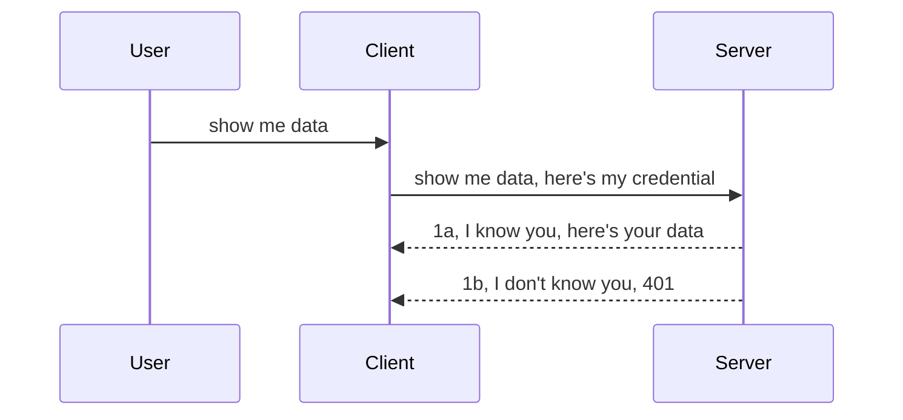

<!--
CO_OP_TRANSLATOR_METADATA:
{
  "original_hash": "5b00b8a8971a07d2d8803be4c9f138f8",
  "translation_date": "2025-10-07T00:50:34+00:00",
  "source_file": "03-GettingStarted/11-simple-auth/README.md",
  "language_code": "el"
}
-->
# Απλή πιστοποίηση

Οι MCP SDKs υποστηρίζουν τη χρήση του OAuth 2.1, το οποίο, για να είμαστε ειλικρινείς, είναι μια αρκετά περίπλοκη διαδικασία που περιλαμβάνει έννοιες όπως διακομιστής πιστοποίησης, διακομιστής πόρων, αποστολή διαπιστευτηρίων, λήψη κωδικού, ανταλλαγή του κωδικού με ένα bearer token, μέχρι να μπορέσετε τελικά να αποκτήσετε πρόσβαση στα δεδομένα των πόρων σας. Αν δεν είστε εξοικειωμένοι με το OAuth, το οποίο είναι εξαιρετικό για υλοποίηση, είναι καλή ιδέα να ξεκινήσετε με ένα βασικό επίπεδο πιστοποίησης και να προχωρήσετε σταδιακά σε καλύτερη και πιο ασφαλή πιστοποίηση. Γι' αυτό υπάρχει αυτό το κεφάλαιο, για να σας βοηθήσει να εξελιχθείτε σε πιο προηγμένες μεθόδους πιστοποίησης.

## Πιστοποίηση, τι εννοούμε;

Η πιστοποίηση περιλαμβάνει δύο βασικές έννοιες: την αυθεντικοποίηση και την εξουσιοδότηση. Η ιδέα είναι ότι πρέπει να κάνουμε δύο πράγματα:

- **Αυθεντικοποίηση**, η διαδικασία με την οποία αποφασίζουμε αν θα επιτρέψουμε σε κάποιον να μπει στο "σπίτι" μας, δηλαδή αν έχει το δικαίωμα να είναι "εδώ", δηλαδή να έχει πρόσβαση στον διακομιστή πόρων μας όπου βρίσκονται οι λειτουργίες του MCP Server.
- **Εξουσιοδότηση**, η διαδικασία με την οποία αποφασίζουμε αν ένας χρήστης πρέπει να έχει πρόσβαση σε συγκεκριμένους πόρους που ζητά, για παράδειγμα σε αυτές τις παραγγελίες ή αυτά τα προϊόντα, ή αν επιτρέπεται να διαβάσει το περιεχόμενο αλλά όχι να το διαγράψει, ως άλλο παράδειγμα.

## Διαπιστευτήρια: πώς λέμε στο σύστημα ποιοι είμαστε

Οι περισσότεροι web developers σκέφτονται συνήθως την παροχή ενός διαπιστευτηρίου στον διακομιστή, συνήθως ενός μυστικού που δηλώνει αν επιτρέπεται να είναι "εδώ" (Αυθεντικοποίηση). Αυτό το διαπιστευτήριο είναι συνήθως μια base64 κωδικοποιημένη έκδοση του ονόματος χρήστη και του κωδικού πρόσβασης ή ένα API key που αναγνωρίζει μοναδικά έναν συγκεκριμένο χρήστη.

Αυτό περιλαμβάνει την αποστολή του μέσω μιας κεφαλίδας που ονομάζεται "Authorization", όπως φαίνεται παρακάτω:

```json
{ "Authorization": "secret123" }
```

Αυτό συνήθως αναφέρεται ως βασική πιστοποίηση. Η συνολική ροή λειτουργεί ως εξής:



Τώρα που κατανοούμε πώς λειτουργεί από την άποψη της ροής, πώς το υλοποιούμε; Οι περισσότεροι web servers έχουν μια έννοια που ονομάζεται middleware, ένα κομμάτι κώδικα που εκτελείται ως μέρος του αιτήματος και μπορεί να επαληθεύσει τα διαπιστευτήρια. Αν τα διαπιστευτήρια είναι έγκυρα, το αίτημα μπορεί να περάσει. Αν το αίτημα δεν έχει έγκυρα διαπιστευτήρια, τότε λαμβάνετε ένα σφάλμα πιστοποίησης. Ας δούμε πώς μπορεί να υλοποιηθεί αυτό:

**Python**

```python
class AuthMiddleware(BaseHTTPMiddleware):
    async def dispatch(self, request, call_next):

        has_header = request.headers.get("Authorization")
        if not has_header:
            print("-> Missing Authorization header!")
            return Response(status_code=401, content="Unauthorized")

        if not valid_token(has_header):
            print("-> Invalid token!")
            return Response(status_code=403, content="Forbidden")

        print("Valid token, proceeding...")
       
        response = await call_next(request)
        # add any customer headers or change in the response in some way
        return response


starlette_app.add_middleware(CustomHeaderMiddleware)
```

Εδώ έχουμε:

- Δημιουργήσει ένα middleware που ονομάζεται `AuthMiddleware`, όπου η μέθοδος `dispatch` καλείται από τον web server.
- Προσθέσει το middleware στον web server:

    ```python
    starlette_app.add_middleware(AuthMiddleware)
    ```

- Γράψει λογική επαλήθευσης που ελέγχει αν η κεφαλίδα Authorization είναι παρούσα και αν το μυστικό που αποστέλλεται είναι έγκυρο:

    ```python
    has_header = request.headers.get("Authorization")
    if not has_header:
        print("-> Missing Authorization header!")
        return Response(status_code=401, content="Unauthorized")

    if not valid_token(has_header):
        print("-> Invalid token!")
        return Response(status_code=403, content="Forbidden")
    ```

    Αν το μυστικό είναι παρόν και έγκυρο, τότε αφήνουμε το αίτημα να περάσει καλώντας το `call_next` και επιστρέφουμε την απάντηση.

    ```python
    response = await call_next(request)
    # add any customer headers or change in the response in some way
    return response
    ```

Πώς λειτουργεί: Αν γίνει ένα web αίτημα προς τον διακομιστή, το middleware θα κληθεί και, βάσει της υλοποίησής του, είτε θα αφήσει το αίτημα να περάσει είτε θα επιστρέψει ένα σφάλμα που υποδεικνύει ότι ο πελάτης δεν επιτρέπεται να προχωρήσει.

**TypeScript**

Εδώ δημιουργούμε ένα middleware με το δημοφιλές framework Express και παρεμβαίνουμε στο αίτημα πριν φτάσει στον MCP Server. Ο κώδικας είναι ο εξής:

```typescript
function isValid(secret) {
    return secret === "secret123";
}

app.use((req, res, next) => {
    // 1. Authorization header present?  
    if(!req.headers["Authorization"]) {
        res.status(401).send('Unauthorized');
    }
    
    let token = req.headers["Authorization"];

    // 2. Check validity.
    if(!isValid(token)) {
        res.status(403).send('Forbidden');
    }

   
    console.log('Middleware executed');
    // 3. Passes request to the next step in the request pipeline.
    next();
});
```

Σε αυτόν τον κώδικα:

1. Ελέγχουμε αν η κεφαλίδα Authorization είναι παρούσα. Αν όχι, στέλνουμε ένα σφάλμα 401.
2. Εξασφαλίζουμε ότι το διαπιστευτήριο/το token είναι έγκυρο. Αν όχι, στέλνουμε ένα σφάλμα 403.
3. Τελικά, αφήνουμε το αίτημα να περάσει στη ροή αιτημάτων και επιστρέφουμε τον ζητούμενο πόρο.

## Άσκηση: Υλοποίηση πιστοποίησης

Ας πάρουμε τις γνώσεις μας και ας προσπαθήσουμε να τις υλοποιήσουμε. Το σχέδιο είναι το εξής:

Server

- Δημιουργία ενός web server και μιας MCP instance.
- Υλοποίηση ενός middleware για τον server.

Client 

- Αποστολή web αιτήματος, με διαπιστευτήριο, μέσω κεφαλίδας.

### -1- Δημιουργία web server και MCP instance

Στο πρώτο μας βήμα, πρέπει να δημιουργήσουμε το web server instance και τον MCP Server.

**Python**

Εδώ δημιουργούμε ένα MCP server instance, μια starlette web εφαρμογή και τη φιλοξενούμε με το uvicorn.

```python
# creating MCP Server

app = FastMCP(
    name="MCP Resource Server",
    instructions="Resource Server that validates tokens via Authorization Server introspection",
    host=settings["host"],
    port=settings["port"],
    debug=True
)

# creating starlette web app
starlette_app = app.streamable_http_app()

# serving app via uvicorn
async def run(starlette_app):
    import uvicorn
    config = uvicorn.Config(
            starlette_app,
            host=app.settings.host,
            port=app.settings.port,
            log_level=app.settings.log_level.lower(),
        )
    server = uvicorn.Server(config)
    await server.serve()

run(starlette_app)
```

Σε αυτόν τον κώδικα:

- Δημιουργούμε τον MCP Server.
- Κατασκευάζουμε τη starlette web εφαρμογή από τον MCP Server, `app.streamable_http_app()`.
- Φιλοξενούμε και εξυπηρετούμε την web εφαρμογή χρησιμοποιώντας το uvicorn `server.serve()`.

**TypeScript**

Εδώ δημιουργούμε ένα MCP Server instance.

```typescript
const server = new McpServer({
      name: "example-server",
      version: "1.0.0"
    });

    // ... set up server resources, tools, and prompts ...
```

Αυτή η δημιουργία του MCP Server πρέπει να γίνει μέσα στον ορισμό της διαδρομής POST /mcp, οπότε ας μετακινήσουμε τον παραπάνω κώδικα ως εξής:

```typescript
import express from "express";
import { randomUUID } from "node:crypto";
import { McpServer } from "@modelcontextprotocol/sdk/server/mcp.js";
import { StreamableHTTPServerTransport } from "@modelcontextprotocol/sdk/server/streamableHttp.js";
import { isInitializeRequest } from "@modelcontextprotocol/sdk/types.js"

const app = express();
app.use(express.json());

// Map to store transports by session ID
const transports: { [sessionId: string]: StreamableHTTPServerTransport } = {};

// Handle POST requests for client-to-server communication
app.post('/mcp', async (req, res) => {
  // Check for existing session ID
  const sessionId = req.headers['mcp-session-id'] as string | undefined;
  let transport: StreamableHTTPServerTransport;

  if (sessionId && transports[sessionId]) {
    // Reuse existing transport
    transport = transports[sessionId];
  } else if (!sessionId && isInitializeRequest(req.body)) {
    // New initialization request
    transport = new StreamableHTTPServerTransport({
      sessionIdGenerator: () => randomUUID(),
      onsessioninitialized: (sessionId) => {
        // Store the transport by session ID
        transports[sessionId] = transport;
      },
      // DNS rebinding protection is disabled by default for backwards compatibility. If you are running this server
      // locally, make sure to set:
      // enableDnsRebindingProtection: true,
      // allowedHosts: ['127.0.0.1'],
    });

    // Clean up transport when closed
    transport.onclose = () => {
      if (transport.sessionId) {
        delete transports[transport.sessionId];
      }
    };
    const server = new McpServer({
      name: "example-server",
      version: "1.0.0"
    });

    // ... set up server resources, tools, and prompts ...

    // Connect to the MCP server
    await server.connect(transport);
  } else {
    // Invalid request
    res.status(400).json({
      jsonrpc: '2.0',
      error: {
        code: -32000,
        message: 'Bad Request: No valid session ID provided',
      },
      id: null,
    });
    return;
  }

  // Handle the request
  await transport.handleRequest(req, res, req.body);
});

// Reusable handler for GET and DELETE requests
const handleSessionRequest = async (req: express.Request, res: express.Response) => {
  const sessionId = req.headers['mcp-session-id'] as string | undefined;
  if (!sessionId || !transports[sessionId]) {
    res.status(400).send('Invalid or missing session ID');
    return;
  }
  
  const transport = transports[sessionId];
  await transport.handleRequest(req, res);
};

// Handle GET requests for server-to-client notifications via SSE
app.get('/mcp', handleSessionRequest);

// Handle DELETE requests for session termination
app.delete('/mcp', handleSessionRequest);

app.listen(3000);
```

Τώρα βλέπετε πώς η δημιουργία του MCP Server μετακινήθηκε μέσα στο `app.post("/mcp")`.

Ας προχωρήσουμε στο επόμενο βήμα της δημιουργίας του middleware, ώστε να μπορούμε να επαληθεύσουμε το εισερχόμενο διαπιστευτήριο.

### -2- Υλοποίηση middleware για τον server

Ας προχωρήσουμε στο κομμάτι του middleware. Εδώ θα δημιουργήσουμε ένα middleware που αναζητά ένα διαπιστευτήριο στην κεφαλίδα `Authorization` και το επαληθεύει. Αν είναι αποδεκτό, τότε το αίτημα θα προχωρήσει για να κάνει ό,τι χρειάζεται (π.χ. λίστα εργαλείων, ανάγνωση πόρου ή οποιαδήποτε λειτουργία MCP που ζητά ο πελάτης).

**Python**

Για να δημιουργήσουμε το middleware, πρέπει να δημιουργήσουμε μια κλάση που κληρονομεί από το `BaseHTTPMiddleware`. Υπάρχουν δύο ενδιαφέροντα κομμάτια:

- Το αίτημα `request`, από το οποίο διαβάζουμε τις πληροφορίες της κεφαλίδας.
- Το `call_next`, η callback μέθοδος που πρέπει να καλέσουμε αν ο πελάτης έχει φέρει ένα αποδεκτό διαπιστευτήριο.

Πρώτα, πρέπει να χειριστούμε την περίπτωση που η κεφαλίδα `Authorization` λείπει:

```python
has_header = request.headers.get("Authorization")

# no header present, fail with 401, otherwise move on.
if not has_header:
    print("-> Missing Authorization header!")
    return Response(status_code=401, content="Unauthorized")
```

Εδώ στέλνουμε ένα μήνυμα 401 unauthorized καθώς ο πελάτης αποτυγχάνει στην αυθεντικοποίηση.

Στη συνέχεια, αν υποβλήθηκε ένα διαπιστευτήριο, πρέπει να ελέγξουμε την εγκυρότητά του ως εξής:

```python
 if not valid_token(has_header):
    print("-> Invalid token!")
    return Response(status_code=403, content="Forbidden")
```

Παρατηρήστε πώς στέλνουμε ένα μήνυμα 403 forbidden παραπάνω. Ας δούμε το πλήρες middleware παρακάτω που υλοποιεί όλα όσα αναφέραμε:

```python
class AuthMiddleware(BaseHTTPMiddleware):
    async def dispatch(self, request, call_next):

        has_header = request.headers.get("Authorization")
        if not has_header:
            print("-> Missing Authorization header!")
            return Response(status_code=401, content="Unauthorized")

        if not valid_token(has_header):
            print("-> Invalid token!")
            return Response(status_code=403, content="Forbidden")

        print("Valid token, proceeding...")
        print(f"-> Received {request.method} {request.url}")
        response = await call_next(request)
        response.headers['Custom'] = 'Example'
        return response

```

Ωραία, αλλά τι γίνεται με τη συνάρτηση `valid_token`; Εδώ είναι παρακάτω:

```python
# DON'T use for production - improve it !!
def valid_token(token: str) -> bool:
    # remove the "Bearer " prefix
    if token.startswith("Bearer "):
        token = token[7:]
        return token == "secret-token"
    return False
```

Αυτό πρέπει προφανώς να βελτιωθεί.

ΣΗΜΑΝΤΙΚΟ: Ποτέ δεν πρέπει να έχετε μυστικά όπως αυτό στον κώδικα. Ιδανικά, πρέπει να ανακτάτε την τιμή για σύγκριση από μια πηγή δεδομένων ή από έναν IDP (identity service provider) ή, ακόμα καλύτερα, να αφήνετε τον IDP να κάνει την επαλήθευση.

**TypeScript**

Για να το υλοποιήσουμε με το Express, πρέπει να καλέσουμε τη μέθοδο `use` που δέχεται συναρτήσεις middleware.

Πρέπει να:

- Αλληλεπιδράσουμε με τη μεταβλητή του αιτήματος για να ελέγξουμε το διαπιστευτήριο που περνά στην ιδιότητα `Authorization`.
- Επαληθεύσουμε το διαπιστευτήριο και, αν είναι έγκυρο, να αφήσουμε το αίτημα να συνεχίσει και να εκτελέσει τη λειτουργία MCP που ζητά ο πελάτης (π.χ. λίστα εργαλείων, ανάγνωση πόρου ή οτιδήποτε σχετικό με MCP).

Εδώ, ελέγχουμε αν η κεφαλίδα `Authorization` είναι παρούσα και, αν όχι, σταματάμε το αίτημα από το να προχωρήσει:

```typescript
if(!req.headers["authorization"]) {
    res.status(401).send('Unauthorized');
    return;
}
```

Αν η κεφαλίδα δεν αποσταλεί εξαρχής, λαμβάνετε ένα 401.

Στη συνέχεια, ελέγχουμε αν το διαπιστευτήριο είναι έγκυρο. Αν όχι, σταματάμε ξανά το αίτημα αλλά με ένα ελαφρώς διαφορετικό μήνυμα:

```typescript
if(!isValid(token)) {
    res.status(403).send('Forbidden');
    return;
} 
```

Παρατηρήστε πώς τώρα λαμβάνετε ένα σφάλμα 403.

Εδώ είναι ο πλήρης κώδικας:

```typescript
app.use((req, res, next) => {
    console.log('Request received:', req.method, req.url, req.headers);
    console.log('Headers:', req.headers["authorization"]);
    if(!req.headers["authorization"]) {
        res.status(401).send('Unauthorized');
        return;
    }
    
    let token = req.headers["authorization"];

    if(!isValid(token)) {
        res.status(403).send('Forbidden');
        return;
    }  

    console.log('Middleware executed');
    next();
});
```

Έχουμε ρυθμίσει τον web server να δέχεται ένα middleware για να ελέγξει το διαπιστευτήριο που ελπίζουμε ότι στέλνει ο πελάτης. Τι γίνεται όμως με τον ίδιο τον πελάτη;

### -3- Αποστολή web αιτήματος με διαπιστευτήριο μέσω κεφαλίδας

Πρέπει να διασφαλίσουμε ότι ο πελάτης περνά το διαπιστευτήριο μέσω της κεφαλίδας. Καθώς πρόκειται να χρησιμοποιήσουμε έναν MCP client για να το κάνουμε αυτό, πρέπει να καταλάβουμε πώς γίνεται.

**Python**

Για τον πελάτη, πρέπει να περάσουμε μια κεφαλίδα με το διαπιστευτήριο μας ως εξής:

```python
# DON'T hardcode the value, have it at minimum in an environment variable or a more secure storage
token = "secret-token"

async with streamablehttp_client(
        url = f"http://localhost:{port}/mcp",
        headers = {"Authorization": f"Bearer {token}"}
    ) as (
        read_stream,
        write_stream,
        session_callback,
    ):
        async with ClientSession(
            read_stream,
            write_stream
        ) as session:
            await session.initialize()
      
            # TODO, what you want done in the client, e.g list tools, call tools etc.
```

Παρατηρήστε πώς γεμίζουμε την ιδιότητα `headers` ως εξής: `headers = {"Authorization": f"Bearer {token}"}`.

**TypeScript**

Μπορούμε να το λύσουμε σε δύο βήματα:

1. Γεμίζουμε ένα αντικείμενο ρυθμίσεων με το διαπιστευτήριο μας.
2. Περνάμε το αντικείμενο ρυθμίσεων στη μεταφορά.

```typescript

// DON'T hardcode the value like shown here. At minimum have it as a env variable and use something like dotenv (in dev mode).
let token = "secret123"

// define a client transport option object
let options: StreamableHTTPClientTransportOptions = {
  sessionId: sessionId,
  requestInit: {
    headers: {
      "Authorization": "secret123"
    }
  }
};

// pass the options object to the transport
async function main() {
   const transport = new StreamableHTTPClientTransport(
      new URL(serverUrl),
      options
   );
```

Εδώ βλέπετε παραπάνω πώς έπρεπε να δημιουργήσουμε ένα αντικείμενο `options` και να τοποθετήσουμε τις κεφαλίδες μας κάτω από την ιδιότητα `requestInit`.

ΣΗΜΑΝΤΙΚΟ: Πώς το βελτιώνουμε από εδώ και πέρα; Λοιπόν, η τρέχουσα υλοποίηση έχει κάποια προβλήματα. Πρώτα απ' όλα, η αποστολή ενός διαπιστευτηρίου με αυτόν τον τρόπο είναι αρκετά επικίνδυνη εκτός αν έχετε τουλάχιστον HTTPS. Ακόμα και τότε, το διαπιστευτήριο μπορεί να κλαπεί, οπότε χρειάζεστε ένα σύστημα όπου μπορείτε εύκολα να ανακαλέσετε το token και να προσθέσετε επιπλέον ελέγχους, όπως από πού προέρχεται το αίτημα, αν το αίτημα γίνεται υπερβολικά συχνά (συμπεριφορά bot), με λίγα λόγια, υπάρχουν πολλές ανησυχίες.

Πρέπει να ειπωθεί, όμως, ότι για πολύ απλά APIs όπου δεν θέλετε κανέναν να καλεί το API σας χωρίς να είναι πιστοποιημένος, αυτό που έχουμε εδώ είναι μια καλή αρχή.

Με αυτά τα δεδομένα, ας προσπαθήσουμε να ενισχύσουμε την ασφάλεια λίγο περισσότερο χρησιμοποιώντας μια τυποποιημένη μορφή όπως το JSON Web Token, επίσης γνωστό ως JWT ή "JOT" tokens.

## JSON Web Tokens, JWT

Λοιπόν, προσπαθούμε να βελτιώσουμε τα πράγματα από την αποστολή πολύ απλών διαπιστευτηρίων. Ποια είναι τα άμεσα οφέλη που αποκτούμε υιοθετώντας το JWT;

- **Βελτιώσεις ασφάλειας**. Στη βασική πιστοποίηση, στέλνετε το όνομα χρήστη και τον κωδικό πρόσβασης ως base64 κωδικοποιημένο token (ή στέλνετε ένα API key) ξανά και ξανά, κάτι που αυξάνει τον κίνδυνο. Με το JWT, στέλνετε το όνομα χρήστη και τον κωδικό πρόσβασης και λαμβάνετε ένα token σε αντάλλαγμα, το οποίο είναι επίσης χρονικά περιορισμένο, δηλαδή θα λήξει. Το JWT σας επιτρέπει να χρησιμοποιείτε εύκολα λεπτομερή έλεγχο πρόσβασης χρησιμοποιώντας ρόλους, πεδία και δικαιώματα.
- **Ανεξαρτησία κατάστασης και κλιμακωσιμότητα**. Τα JWTs είναι αυτοτελή, περιέχουν όλες τις πληροφορίες χρήστη και εξαλείφουν την ανάγκη για αποθήκευση συνεδρίας στον διακομιστή. Το token μπορεί επίσης να επαληθευτεί τοπικά.
- **Διαλειτουργικότητα και ομοσπονδία**. Τα JWTs είναι κεντρικά στο Open ID Connect και χρησιμοποιούνται με γνωστούς παρόχους ταυτότητας όπως το Entra ID, το Google Identity και το Auth0. Επιτρέπουν επίσης τη χρήση του single sign-on και πολλά άλλα, καθιστώντας τα κατάλληλα για επιχειρήσεις.
- **Μοναδικότητα και ευελιξία**. Τα JWTs μπορούν επίσης να χρησιμοποιηθούν με API Gateways όπως το Azure API Management, το NGINX και άλλα. Υποστηρίζουν επίσης σενάρια χρήσης πιστοποίησης και επικοινωνία server-to-service, συμπεριλαμβανομένων σεναρίων προσωποποίησης και ανάθεσης.
- **Απόδοση και caching**. Τα JWTs μπορούν να αποθηκευτούν προσωρινά μετά την αποκωδικοποίηση, κάτι που μειώνει την ανάγκη για ανάλυση. Αυτό βοηθά ειδικά σε εφαρμογές υψηλής κυκλοφορίας, καθώς βελτιώνει τη διακίνηση και μειώνει το φορτίο στην υποδομή που έχετε επιλέξει.
- **Προηγμένες δυνατότητες**. Υποστηρίζουν επίσης introspection (έλεγχο εγκυρότητας στον διακομιστή) και revocation (καθιστώντας ένα token άκυρο).

Με όλα αυτά τα οφέλη, ας δούμε πώς μπορούμε να πάμε την υλοποίησή μας στο επόμενο επίπεδο.

## Μετατροπή βασικής πιστοποίησης σε JWT

Οι αλλαγές που πρέπει να κάνουμε σε υψηλό επίπεδο είναι:

- **Μάθηση για τη δημιουργία ενός JWT token** και προετοιμασία για αποστολή από τον πελάτη στον διακομιστή.
- **Επαλήθευση ενός JWT token**, και αν είναι έγκυρο, να επιτρέψουμε στον πελάτη να έχει πρόσβαση στους πόρους μας.
- **Ασφαλής αποθήκευση token**. Πώς αποθηκεύουμε αυτό το token.
- **Προστασία των διαδρομών**. Πρέπει να προστατεύσουμε τις διαδρομές, στην περίπτωσή μας, πρέπει να προστατεύσουμε διαδρομές και συγκεκριμένες λειτουργίες MCP.
- **Προσθήκη refresh tokens**. Διασφάλιση ότι δημιουργούμε tokens που είναι βραχύβια αλλά refresh tokens που είναι μακροχρόνια και μπορούν να χρησιμοποιηθούν για την απόκτηση νέων tokens αν λήξουν. Επίσης, διασφάλιση ότι υπάρχει ένα refresh endpoint και μια στρατηγική περιστροφής.

### -1- Δημιουργία ενός JWT token

Πρώτα απ' όλα, ένα JWT token έχει τα εξής μέρη:

- **header**, ο αλγόριθμος που χρησιμοποιείται και ο τύπος του token.
- **payload**, claims, όπως sub (ο χρήστης ή η οντότητα που αντιπροσωπεύει το token. Σε ένα σενάριο πιστοποίησης, αυτό είναι συνήθως το userid), exp (πότε λήγει), role (ο ρόλος).
- **signature**, υπογεγραμμένο με ένα μυστικό ή ιδιωτικό κλειδί.

Για αυτό, θα χρειαστεί να δημιουργήσουμε το header, το payload και το κω
Στη συνέχεια, ας εξετάσουμε τον έλεγχο πρόσβασης βάσει ρόλων, γνωστό και ως RBAC.

## Προσθήκη ελέγχου πρόσβασης βάσει ρόλων

Η ιδέα είναι να εκφράσουμε ότι διαφορετικοί ρόλοι έχουν διαφορετικά δικαιώματα. Για παράδειγμα, υποθέτουμε ότι ένας διαχειριστής μπορεί να κάνει τα πάντα, ένας κανονικός χρήστης μπορεί να διαβάσει/γράψει και ένας επισκέπτης μπορεί μόνο να διαβάσει. Επομένως, εδώ είναι μερικά πιθανά επίπεδα δικαιωμάτων:

- Admin.Write 
- User.Read
- Guest.Read

Ας δούμε πώς μπορούμε να υλοποιήσουμε έναν τέτοιο έλεγχο με middleware. Τα middleware μπορούν να προστεθούν ανά διαδρομή καθώς και για όλες τις διαδρομές.

**Python**

```python
from starlette.middleware.base import BaseHTTPMiddleware
from starlette.responses import JSONResponse
import jwt

# DON'T have the secret in the code like, this is for demonstration purposes only. Read it from a safe place.
SECRET_KEY = "your-secret-key" # put this in env variable
REQUIRED_PERMISSION = "User.Read"

class JWTPermissionMiddleware(BaseHTTPMiddleware):
    async def dispatch(self, request, call_next):
        auth_header = request.headers.get("Authorization")
        if not auth_header or not auth_header.startswith("Bearer "):
            return JSONResponse({"error": "Missing or invalid Authorization header"}, status_code=401)

        token = auth_header.split(" ")[1]
        try:
            decoded = jwt.decode(token, SECRET_KEY, algorithms=["HS256"])
        except jwt.ExpiredSignatureError:
            return JSONResponse({"error": "Token expired"}, status_code=401)
        except jwt.InvalidTokenError:
            return JSONResponse({"error": "Invalid token"}, status_code=401)

        permissions = decoded.get("permissions", [])
        if REQUIRED_PERMISSION not in permissions:
            return JSONResponse({"error": "Permission denied"}, status_code=403)

        request.state.user = decoded
        return await call_next(request)


```

Υπάρχουν διάφοροι τρόποι για να προσθέσετε το middleware όπως παρακάτω:

```python

# Alt 1: add middleware while constructing starlette app
middleware = [
    Middleware(JWTPermissionMiddleware)
]

app = Starlette(routes=routes, middleware=middleware)

# Alt 2: add middleware after starlette app is a already constructed
starlette_app.add_middleware(JWTPermissionMiddleware)

# Alt 3: add middleware per route
routes = [
    Route(
        "/mcp",
        endpoint=..., # handler
        middleware=[Middleware(JWTPermissionMiddleware)]
    )
]
```

**TypeScript**

Μπορούμε να χρησιμοποιήσουμε το `app.use` και ένα middleware που θα εκτελείται για όλα τα αιτήματα.

```typescript
app.use((req, res, next) => {
    console.log('Request received:', req.method, req.url, req.headers);
    console.log('Headers:', req.headers["authorization"]);

    // 1. Check if authorization header has been sent

    if(!req.headers["authorization"]) {
        res.status(401).send('Unauthorized');
        return;
    }
    
    let token = req.headers["authorization"];

    // 2. Check if token is valid
    if(!isValid(token)) {
        res.status(403).send('Forbidden');
        return;
    }  

    // 3. Check if token user exist in our system
    if(!isExistingUser(token)) {
        res.status(403).send('Forbidden');
        console.log("User does not exist");
        return;
    }
    console.log("User exists");

    // 4. Verify the token has the right permissions
    if(!hasScopes(token, ["User.Read"])){
        res.status(403).send('Forbidden - insufficient scopes');
    }

    console.log("User has required scopes");

    console.log('Middleware executed');
    next();
});

```

Υπάρχουν αρκετά πράγματα που μπορούμε να αφήσουμε το middleware μας να κάνει και που ΠΡΕΠΕΙ να κάνει, συγκεκριμένα:

1. Έλεγχος αν υπάρχει το authorization header.
2. Έλεγχος αν το token είναι έγκυρο, καλούμε τη μέθοδο `isValid` που γράψαμε για να ελέγξουμε την ακεραιότητα και την εγκυρότητα του JWT token.
3. Επαλήθευση ότι ο χρήστης υπάρχει στο σύστημά μας, πρέπει να το ελέγξουμε.

   ```typescript
    // users in DB
   const users = [
     "user1",
     "User usersson",
   ]

   function isExistingUser(token) {
     let decodedToken = verifyToken(token);

     // TODO, check if user exists in DB
     return users.includes(decodedToken?.name || "");
   }
   ```

   Εδώ, έχουμε δημιουργήσει μια πολύ απλή λίστα `users`, η οποία προφανώς θα πρέπει να βρίσκεται σε μια βάση δεδομένων.

4. Επιπλέον, πρέπει επίσης να ελέγξουμε ότι το token έχει τα σωστά δικαιώματα.

   ```typescript
   if(!hasScopes(token, ["User.Read"])){
        res.status(403).send('Forbidden - insufficient scopes');
   }
   ```

   Στον παραπάνω κώδικα από το middleware, ελέγχουμε ότι το token περιέχει το δικαίωμα User.Read, αν όχι, στέλνουμε ένα σφάλμα 403. Παρακάτω είναι η βοηθητική μέθοδος `hasScopes`.

   ```typescript
   function hasScopes(scope: string, requiredScopes: string[]) {
     let decodedToken = verifyToken(scope);
    return requiredScopes.every(scope => decodedToken?.scopes.includes(scope));
  }
   ```

Have a think which additional checks you should be doing, but these are the absolute minimum of checks you should be doing.

Using Express as a web framework is a common choice. There are helpers library when you use JWT so you can write less code.

- `express-jwt`, helper library that provides a middleware that helps decode your token.
- `express-jwt-permissions`, this provides a middleware `guard` that helps check if a certain permission is on the token.

Here's what these libraries can look like when used:

```typescript
const express = require('express');
const jwt = require('express-jwt');
const guard = require('express-jwt-permissions')();

const app = express();
const secretKey = 'your-secret-key'; // put this in env variable

// Decode JWT and attach to req.user
app.use(jwt({ secret: secretKey, algorithms: ['HS256'] }));

// Check for User.Read permission
app.use(guard.check('User.Read'));

// multiple permissions
// app.use(guard.check(['User.Read', 'Admin.Access']));

app.get('/protected', (req, res) => {
  res.json({ message: `Welcome ${req.user.name}` });
});

// Error handler
app.use((err, req, res, next) => {
  if (err.code === 'permission_denied') {
    return res.status(403).send('Forbidden');
  }
  next(err);
});

```

Τώρα που είδατε πώς μπορεί να χρησιμοποιηθεί το middleware για αυθεντικοποίηση και εξουσιοδότηση, τι γίνεται με το MCP; Αλλάζει τον τρόπο που κάνουμε αυθεντικοποίηση; Ας το ανακαλύψουμε στην επόμενη ενότητα.

### -3- Προσθήκη RBAC στο MCP

Έχετε δει μέχρι τώρα πώς μπορείτε να προσθέσετε RBAC μέσω middleware, ωστόσο, για το MCP δεν υπάρχει εύκολος τρόπος να προσθέσετε RBAC ανά λειτουργία MCP, οπότε τι κάνουμε; Λοιπόν, απλώς πρέπει να προσθέσουμε κώδικα όπως αυτός που ελέγχει σε αυτήν την περίπτωση αν ο πελάτης έχει τα δικαιώματα να καλέσει ένα συγκεκριμένο εργαλείο:

Έχετε μερικές διαφορετικές επιλογές για το πώς να επιτύχετε RBAC ανά λειτουργία, εδώ είναι μερικές:

- Προσθέστε έναν έλεγχο για κάθε εργαλείο, πόρο, προτροπή όπου πρέπει να ελέγξετε το επίπεδο δικαιωμάτων.

   **Python**

   ```python
   @tool()
   def delete_product(id: int):
      try:
          check_permissions(role="Admin.Write", request)
      catch:
        pass # client failed authorization, raise authorization error
   ```

   **TypeScript**

   ```typescript
   server.registerTool(
    "delete-product",
    {
      title: Delete a product",
      description: "Deletes a product",
      inputSchema: { id: z.number() }
    },
    async ({ id }) => {
      
      try {
        checkPermissions("Admin.Write", request);
        // todo, send id to productService and remote entry
      } catch(Exception e) {
        console.log("Authorization error, you're not allowed");  
      }

      return {
        content: [{ type: "text", text: `Deletected product with id ${id}` }]
      };
    }
   );
   ```


- Χρησιμοποιήστε μια προηγμένη προσέγγιση διακομιστή και τους χειριστές αιτημάτων ώστε να ελαχιστοποιήσετε τα σημεία όπου πρέπει να κάνετε τον έλεγχο.

   **Python**

   ```python
   
   tool_permission = {
      "create_product": ["User.Write", "Admin.Write"],
      "delete_product": ["Admin.Write"]
   }

   def has_permission(user_permissions, required_permissions) -> bool:
      # user_permissions: list of permissions the user has
      # required_permissions: list of permissions required for the tool
      return any(perm in user_permissions for perm in required_permissions)

   @server.call_tool()
   async def handle_call_tool(
     name: str, arguments: dict[str, str] | None
   ) -> list[types.TextContent]:
    # Assume request.user.permissions is a list of permissions for the user
     user_permissions = request.user.permissions
     required_permissions = tool_permission.get(name, [])
     if not has_permission(user_permissions, required_permissions):
        # Raise error "You don't have permission to call tool {name}"
        raise Exception(f"You don't have permission to call tool {name}")
     # carry on and call tool
     # ...
   ```   
   

   **TypeScript**

   ```typescript
   function hasPermission(userPermissions: string[], requiredPermissions: string[]): boolean {
       if (!Array.isArray(userPermissions) || !Array.isArray(requiredPermissions)) return false;
       // Return true if user has at least one required permission
       
       return requiredPermissions.some(perm => userPermissions.includes(perm));
   }
  
   server.setRequestHandler(CallToolRequestSchema, async (request) => {
      const { params: { name } } = request;
  
      let permissions = request.user.permissions;
  
      if (!hasPermission(permissions, toolPermissions[name])) {
         return new Error(`You don't have permission to call ${name}`);
      }
  
      // carry on..
   });
   ```

   Σημειώστε ότι θα χρειαστεί να διασφαλίσετε ότι το middleware σας αναθέτει ένα αποκωδικοποιημένο token στην ιδιότητα χρήστη του αιτήματος, ώστε ο παραπάνω κώδικας να είναι απλός.

### Συνοψίζοντας

Τώρα που συζητήσαμε πώς να προσθέσουμε υποστήριξη για RBAC γενικά και για MCP ειδικότερα, είναι ώρα να προσπαθήσετε να υλοποιήσετε την ασφάλεια μόνοι σας για να βεβαιωθείτε ότι κατανοήσατε τις έννοιες που σας παρουσιάστηκαν.

## Εργασία 1: Δημιουργήστε έναν MCP διακομιστή και έναν MCP πελάτη χρησιμοποιώντας βασική αυθεντικοποίηση

Εδώ θα χρησιμοποιήσετε όσα μάθατε σχετικά με την αποστολή διαπιστευτηρίων μέσω headers.

## Λύση 1

[Λύση 1](./code/basic/README.md)

## Εργασία 2: Αναβαθμίστε τη λύση από την Εργασία 1 για να χρησιμοποιεί JWT

Πάρτε την πρώτη λύση αλλά αυτή τη φορά, ας την βελτιώσουμε.

Αντί να χρησιμοποιήσουμε Basic Auth, ας χρησιμοποιήσουμε JWT.

## Λύση 2

[Λύση 2](./solution/jwt-solution/README.md)

## Πρόκληση

Προσθέστε RBAC ανά εργαλείο όπως περιγράφεται στην ενότητα "Προσθήκη RBAC στο MCP".

## Περίληψη

Ελπίζουμε να μάθατε πολλά σε αυτό το κεφάλαιο, από καθόλου ασφάλεια, σε βασική ασφάλεια, σε JWT και πώς μπορεί να προστεθεί στο MCP.

Χτίσαμε μια ισχυρή βάση με προσαρμοσμένα JWT, αλλά καθώς κλιμακώνουμε, προχωράμε προς ένα μοντέλο ταυτότητας βασισμένο σε πρότυπα. Η υιοθέτηση ενός IdP όπως το Entra ή το Keycloak μας επιτρέπει να αναθέσουμε την έκδοση, την επαλήθευση και τη διαχείριση κύκλου ζωής των tokens σε μια αξιόπιστη πλατφόρμα — απελευθερώνοντάς μας να επικεντρωθούμε στη λογική της εφαρμογής και την εμπειρία χρήστη.

Για αυτό, έχουμε ένα πιο [προχωρημένο κεφάλαιο για το Entra](../../05-AdvancedTopics/mcp-security-entra/README.md)

---

**Αποποίηση ευθύνης**:  
Αυτό το έγγραφο έχει μεταφραστεί χρησιμοποιώντας την υπηρεσία αυτόματης μετάφρασης [Co-op Translator](https://github.com/Azure/co-op-translator). Παρόλο που καταβάλλουμε προσπάθειες για ακρίβεια, παρακαλούμε να έχετε υπόψη ότι οι αυτόματες μεταφράσεις ενδέχεται να περιέχουν λάθη ή ανακρίβειες. Το πρωτότυπο έγγραφο στη μητρική του γλώσσα θα πρέπει να θεωρείται η αυθεντική πηγή. Για κρίσιμες πληροφορίες, συνιστάται επαγγελματική ανθρώπινη μετάφραση. Δεν φέρουμε ευθύνη για τυχόν παρεξηγήσεις ή εσφαλμένες ερμηνείες που προκύπτουν από τη χρήση αυτής της μετάφρασης.