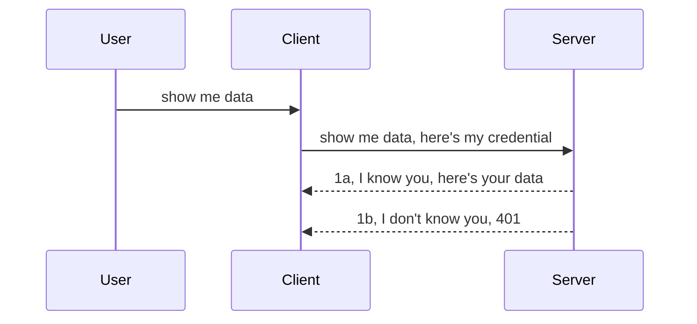

<!--
CO_OP_TRANSLATOR_METADATA:
{
  "original_hash": "5b00b8a8971a07d2d8803be4c9f138f8",
  "translation_date": "2025-10-07T00:29:01+00:00",
  "source_file": "03-GettingStarted/11-simple-auth/README.md",
  "language_code": "en"
}
-->
# Simple Authentication

MCP SDKs support the use of OAuth 2.1, which, to be fair, is a fairly complex process involving concepts like an authentication server, resource server, posting credentials, obtaining a code, exchanging the code for a bearer token, and finally accessing your resource data. If you're not familiar with OAuth—though it's a great system to implement—it might be a good idea to start with a simpler level of authentication and gradually work your way up to more robust security. That's the purpose of this chapter: to guide you toward more advanced authentication methods.

## What do we mean by "Auth"?

"Auth" is short for authentication and authorization. Essentially, we need to address two key aspects:

- **Authentication**: This is the process of determining whether someone is allowed to "enter the house," meaning they have the right to access our resource server where the MCP Server features are hosted.
- **Authorization**: This is the process of determining whether a user is permitted to access specific resources they are requesting, such as certain orders or products, or whether they are allowed to read content but not delete it, for example.

## Credentials: How we identify ourselves to the system

Most web developers think of providing credentials to the server, typically a secret that indicates whether they are authorized to access it ("Authentication"). This credential is often a base64-encoded combination of a username and password or an API key that uniquely identifies a specific user.

This credential is sent via a header called "Authorization," like this:

```json
{ "Authorization": "secret123" }
```

This is commonly referred to as basic authentication. The overall flow works as follows:



Now that we understand the flow, how do we implement it? Most web servers use a concept called middleware—a piece of code that runs as part of the request to verify credentials. If the credentials are valid, the request is allowed to proceed. If not, an authentication error is returned. Here's how this can be implemented:

**Python**

```python
class AuthMiddleware(BaseHTTPMiddleware):
    async def dispatch(self, request, call_next):

        has_header = request.headers.get("Authorization")
        if not has_header:
            print("-> Missing Authorization header!")
            return Response(status_code=401, content="Unauthorized")

        if not valid_token(has_header):
            print("-> Invalid token!")
            return Response(status_code=403, content="Forbidden")

        print("Valid token, proceeding...")
       
        response = await call_next(request)
        # add any customer headers or change in the response in some way
        return response


starlette_app.add_middleware(CustomHeaderMiddleware)
```

Here’s what we’ve done:

- Created a middleware called `AuthMiddleware`, where its `dispatch` method is invoked by the web server.
- Added the middleware to the web server:

    ```python
    starlette_app.add_middleware(AuthMiddleware)
    ```

- Written validation logic to check if the Authorization header is present and if the provided secret is valid:

    ```python
    has_header = request.headers.get("Authorization")
    if not has_header:
        print("-> Missing Authorization header!")
        return Response(status_code=401, content="Unauthorized")

    if not valid_token(has_header):
        print("-> Invalid token!")
        return Response(status_code=403, content="Forbidden")
    ```

    If the secret is valid, the request is allowed to proceed by calling `call_next`, and the response is returned.

    ```python
    response = await call_next(request)
    # add any customer headers or change in the response in some way
    return response
    ```

How it works: When a web request is made to the server, the middleware is invoked. Based on its implementation, it either allows the request to proceed or returns an error indicating that the client is not authorized to continue.

**TypeScript**

Here, we create middleware using the popular Express framework to intercept the request before it reaches the MCP Server. Here's the code:

```typescript
function isValid(secret) {
    return secret === "secret123";
}

app.use((req, res, next) => {
    // 1. Authorization header present?  
    if(!req.headers["Authorization"]) {
        res.status(401).send('Unauthorized');
    }
    
    let token = req.headers["Authorization"];

    // 2. Check validity.
    if(!isValid(token)) {
        res.status(403).send('Forbidden');
    }

   
    console.log('Middleware executed');
    // 3. Passes request to the next step in the request pipeline.
    next();
});
```

In this code, we:

1. Check if the Authorization header is present. If not, we send a 401 error.
2. Validate the credential/token. If it's invalid, we send a 403 error.
3. Finally, pass the request along the pipeline and return the requested resource.

## Exercise: Implement Authentication

Let’s put our knowledge into practice by implementing authentication. Here’s the plan:

Server:

- Create a web server and an MCP instance.
- Implement middleware for the server.

Client:

- Send a web request with credentials via a header.

### -1- Create a Web Server and MCP Instance

In the first step, we need to create the web server instance and the MCP Server.

**Python**

Here, we create an MCP server instance, a Starlette web app, and host it using Uvicorn.

```python
# creating MCP Server

app = FastMCP(
    name="MCP Resource Server",
    instructions="Resource Server that validates tokens via Authorization Server introspection",
    host=settings["host"],
    port=settings["port"],
    debug=True
)

# creating starlette web app
starlette_app = app.streamable_http_app()

# serving app via uvicorn
async def run(starlette_app):
    import uvicorn
    config = uvicorn.Config(
            starlette_app,
            host=app.settings.host,
            port=app.settings.port,
            log_level=app.settings.log_level.lower(),
        )
    server = uvicorn.Server(config)
    await server.serve()

run(starlette_app)
```

In this code, we:

- Create the MCP Server.
- Build the Starlette web app from the MCP Server using `app.streamable_http_app()`.
- Host and serve the web app using Uvicorn with `server.serve()`.

**TypeScript**

Here, we create an MCP Server instance.

```typescript
const server = new McpServer({
      name: "example-server",
      version: "1.0.0"
    });

    // ... set up server resources, tools, and prompts ...
```

This MCP Server creation needs to happen within our POST /mcp route definition. Let’s move the code like this:

```typescript
import express from "express";
import { randomUUID } from "node:crypto";
import { McpServer } from "@modelcontextprotocol/sdk/server/mcp.js";
import { StreamableHTTPServerTransport } from "@modelcontextprotocol/sdk/server/streamableHttp.js";
import { isInitializeRequest } from "@modelcontextprotocol/sdk/types.js"

const app = express();
app.use(express.json());

// Map to store transports by session ID
const transports: { [sessionId: string]: StreamableHTTPServerTransport } = {};

// Handle POST requests for client-to-server communication
app.post('/mcp', async (req, res) => {
  // Check for existing session ID
  const sessionId = req.headers['mcp-session-id'] as string | undefined;
  let transport: StreamableHTTPServerTransport;

  if (sessionId && transports[sessionId]) {
    // Reuse existing transport
    transport = transports[sessionId];
  } else if (!sessionId && isInitializeRequest(req.body)) {
    // New initialization request
    transport = new StreamableHTTPServerTransport({
      sessionIdGenerator: () => randomUUID(),
      onsessioninitialized: (sessionId) => {
        // Store the transport by session ID
        transports[sessionId] = transport;
      },
      // DNS rebinding protection is disabled by default for backwards compatibility. If you are running this server
      // locally, make sure to set:
      // enableDnsRebindingProtection: true,
      // allowedHosts: ['127.0.0.1'],
    });

    // Clean up transport when closed
    transport.onclose = () => {
      if (transport.sessionId) {
        delete transports[transport.sessionId];
      }
    };
    const server = new McpServer({
      name: "example-server",
      version: "1.0.0"
    });

    // ... set up server resources, tools, and prompts ...

    // Connect to the MCP server
    await server.connect(transport);
  } else {
    // Invalid request
    res.status(400).json({
      jsonrpc: '2.0',
      error: {
        code: -32000,
        message: 'Bad Request: No valid session ID provided',
      },
      id: null,
    });
    return;
  }

  // Handle the request
  await transport.handleRequest(req, res, req.body);
});

// Reusable handler for GET and DELETE requests
const handleSessionRequest = async (req: express.Request, res: express.Response) => {
  const sessionId = req.headers['mcp-session-id'] as string | undefined;
  if (!sessionId || !transports[sessionId]) {
    res.status(400).send('Invalid or missing session ID');
    return;
  }
  
  const transport = transports[sessionId];
  await transport.handleRequest(req, res);
};

// Handle GET requests for server-to-client notifications via SSE
app.get('/mcp', handleSessionRequest);

// Handle DELETE requests for session termination
app.delete('/mcp', handleSessionRequest);

app.listen(3000);
```

Now you can see how the MCP Server creation was moved within `app.post("/mcp")`.

Next, let’s create middleware to validate the incoming credentials.

### -2- Implement Middleware for the Server

Now, let’s focus on the middleware. We’ll create middleware that checks for credentials in the `Authorization` header and validates them. If the credentials are valid, the request proceeds to perform its intended action (e.g., listing tools, reading a resource, or any other MCP functionality the client requested).

**Python**

To create middleware, we need to define a class that inherits from `BaseHTTPMiddleware`. Two key components are:

- The `request` object, from which we read the header information.
- The `call_next` callback, which we invoke if the client provides valid credentials.

First, let’s handle the case where the `Authorization` header is missing:

```python
has_header = request.headers.get("Authorization")

# no header present, fail with 401, otherwise move on.
if not has_header:
    print("-> Missing Authorization header!")
    return Response(status_code=401, content="Unauthorized")
```

Here, we send a 401 Unauthorized response because the client failed authentication.

Next, if credentials are provided, we validate them like this:

```python
 if not valid_token(has_header):
    print("-> Invalid token!")
    return Response(status_code=403, content="Forbidden")
```

Note how we send a 403 Forbidden response above. Here’s the complete middleware implementation:

```python
class AuthMiddleware(BaseHTTPMiddleware):
    async def dispatch(self, request, call_next):

        has_header = request.headers.get("Authorization")
        if not has_header:
            print("-> Missing Authorization header!")
            return Response(status_code=401, content="Unauthorized")

        if not valid_token(has_header):
            print("-> Invalid token!")
            return Response(status_code=403, content="Forbidden")

        print("Valid token, proceeding...")
        print(f"-> Received {request.method} {request.url}")
        response = await call_next(request)
        response.headers['Custom'] = 'Example'
        return response

```

But what about the `valid_token` function? Here it is:

```python
# DON'T use for production - improve it !!
def valid_token(token: str) -> bool:
    # remove the "Bearer " prefix
    if token.startswith("Bearer "):
        token = token[7:]
        return token == "secret-token"
    return False
```

This function should obviously be improved.

IMPORTANT: You should NEVER hard-code secrets in your code. Ideally, retrieve the value from a data source or an identity service provider (IDP), or better yet, let the IDP handle the validation.

**TypeScript**

To implement this in Express, we use the `use` method, which accepts middleware functions.

We need to:

- Interact with the request object to check the `Authorization` header.
- Validate the credentials. If valid, allow the request to proceed and let the client’s MCP request perform its intended action.

Here, we check if the `Authorization` header is present. If not, we stop the request:

```typescript
if(!req.headers["authorization"]) {
    res.status(401).send('Unauthorized');
    return;
}
```

If the header is missing, a 401 error is returned.

Next, we validate the credentials. If invalid, we stop the request with a different error message:

```typescript
if(!isValid(token)) {
    res.status(403).send('Forbidden');
    return;
} 
```

Note how a 403 error is returned here.

Here’s the complete code:

```typescript
app.use((req, res, next) => {
    console.log('Request received:', req.method, req.url, req.headers);
    console.log('Headers:', req.headers["authorization"]);
    if(!req.headers["authorization"]) {
        res.status(401).send('Unauthorized');
        return;
    }
    
    let token = req.headers["authorization"];

    if(!isValid(token)) {
        res.status(403).send('Forbidden');
        return;
    }  

    console.log('Middleware executed');
    next();
});
```

We’ve set up the web server to use middleware for credential validation. Now, let’s look at the client.

### -3- Send a Web Request with Credentials via Header

The client must send credentials through the header. Since we’re using an MCP client, let’s see how to do this.

**Python**

For the client, we pass a header with the credentials like this:

```python
# DON'T hardcode the value, have it at minimum in an environment variable or a more secure storage
token = "secret-token"

async with streamablehttp_client(
        url = f"http://localhost:{port}/mcp",
        headers = {"Authorization": f"Bearer {token}"}
    ) as (
        read_stream,
        write_stream,
        session_callback,
    ):
        async with ClientSession(
            read_stream,
            write_stream
        ) as session:
            await session.initialize()
      
            # TODO, what you want done in the client, e.g list tools, call tools etc.
```

Note how we populate the `headers` property: `headers = {"Authorization": f"Bearer {token}"}`.

**TypeScript**

We can achieve this in two steps:

1. Create a configuration object with the credentials.
2. Pass the configuration object to the transport.

```typescript

// DON'T hardcode the value like shown here. At minimum have it as a env variable and use something like dotenv (in dev mode).
let token = "secret123"

// define a client transport option object
let options: StreamableHTTPClientTransportOptions = {
  sessionId: sessionId,
  requestInit: {
    headers: {
      "Authorization": "secret123"
    }
  }
};

// pass the options object to the transport
async function main() {
   const transport = new StreamableHTTPClientTransport(
      new URL(serverUrl),
      options
   );
```

Here, we create an `options` object and place the headers under the `requestInit` property.

IMPORTANT: How can we improve this? Passing credentials like this is risky unless you’re using HTTPS. Even then, credentials can be stolen, so you need a system that allows you to revoke tokens easily and implement additional checks, such as verifying the request’s origin or detecting suspicious activity. In short, there are many security considerations.

For simple APIs where you just want to ensure that only authenticated users can access your API, this is a good starting point.

Now, let’s enhance security by using a standardized format like JSON Web Tokens (JWT).

## JSON Web Tokens (JWT)

To improve upon basic authentication, we can use JSON Web Tokens (JWT). What are the immediate benefits of adopting JWT?

- **Enhanced security**: In basic authentication, you repeatedly send the username and password as a base64-encoded token (or an API key), which increases risk. With JWT, you send your username and password once to obtain a token, which is time-bound and will expire. JWT also allows for fine-grained access control using roles, scopes, and permissions.
- **Statelessness and scalability**: JWTs are self-contained, carrying all user information, which eliminates the need for server-side session storage. Tokens can also be validated locally.
- **Interoperability and federation**: JWTs are central to OpenID Connect and are used by well-known identity providers like Entra ID, Google Identity, and Auth0. They enable single sign-on and other enterprise-grade features.
- **Modularity and flexibility**: JWTs can be used with API gateways like Azure API Management, NGINX, and more. They support various authentication scenarios, including server-to-server communication, impersonation, and delegation.
- **Performance and caching**: JWTs can be cached after decoding, reducing the need for repeated parsing. This is particularly beneficial for high-traffic applications, as it improves throughput and reduces infrastructure load.
- **Advanced features**: JWTs support introspection (server-side validation) and revocation (invalidating tokens).

With these benefits in mind, let’s take our implementation to the next level.

## Upgrading Basic Authentication to JWT

Here’s what we need to do at a high level:

- **Create a JWT token**: Generate a token that the client can send to the server.
- **Validate the JWT token**: Ensure the token is valid before granting access to resources.
- **Secure token storage**: Safeguard the token.
- **Protect routes**: Secure specific routes and MCP features.
- **Add refresh tokens**: Use short-lived tokens with long-lived refresh tokens to obtain new tokens when they expire. Implement a refresh endpoint and a rotation strategy.

### -1- Create a JWT Token

A JWT token consists of three parts:

- **Header**: Specifies the algorithm used and the token type.
- **Payload**: Contains claims, such as `sub` (the user or entity the token represents, typically the user ID), `exp` (expiration time), and `role` (user role).
- **Signature**: Signed with a secret or private key.

Let’s construct the header, payload, and encoded token.

**Python**

```python

import jwt
import jwt
from jwt.exceptions import ExpiredSignatureError, InvalidTokenError
import datetime

# Secret key used to sign the JWT
secret_key = 'your-secret-key'

header = {
    "alg": "HS256",
    "typ": "JWT"
}

# the user info andits claims and expiry time
payload = {
    "sub": "1234567890",               # Subject (user ID)
    "name": "User Userson",                # Custom claim
    "admin": True,                     # Custom claim
    "iat": datetime.datetime.utcnow(),# Issued at
    "exp": datetime.datetime.utcnow() + datetime.timedelta(hours=1)  # Expiry
}

# encode it
encoded_jwt = jwt.encode(payload, secret_key, algorithm="HS256", headers=header)
```

In this code, we:

- Define a header using the HS256 algorithm and specify the token type as JWT.
- Create a payload containing a subject (user ID), username, role, issue time, and expiration time, implementing the time-bound aspect of the token.

**TypeScript**

We’ll need some dependencies to construct the JWT token.

Dependencies:

```sh

npm install jsonwebtoken
npm install --save-dev @types/jsonwebtoken
```

Now, let’s create the header, payload, and encoded token.

```typescript
import jwt from 'jsonwebtoken';

const secretKey = 'your-secret-key'; // Use env vars in production

// Define the payload
const payload = {
  sub: '1234567890',
  name: 'User usersson',
  admin: true,
  iat: Math.floor(Date.now() / 1000), // Issued at
  exp: Math.floor(Date.now() / 1000) + 60 * 60 // Expires in 1 hour
};

// Define the header (optional, jsonwebtoken sets defaults)
const header = {
  alg: 'HS256',
  typ: 'JWT'
};

// Create the token
const token = jwt.sign(payload, secretKey, {
  algorithm: 'HS256',
  header: header
});

console.log('JWT:', token);
```

This token is:

- Signed using HS256.
- Valid for 1 hour.
- Includes claims such as `sub`, `name`, `admin`, `iat`, and `exp`.

### -2- Validate a Token

We also need to validate the token on the server to ensure the client’s token is legitimate. Validation involves checking the token’s structure and verifying its authenticity. Additional checks, such as ensuring the user exists in your system, are also recommended.

To validate a token, we decode it to read its contents and verify its validity.

**Python**

```python

# Decode and verify the JWT
try:
    decoded = jwt.decode(token, secret_key, algorithms=["HS256"])
    print("✅ Token is valid.")
    print("Decoded claims:")
    for key, value in decoded.items():
        print(f"  {key}: {value}")
except ExpiredSignatureError:
    print("❌ Token has expired.")
except InvalidTokenError as e:
    print(f"❌ Invalid token: {e}")

```

In this code, we use `jwt.decode` with the token, secret key, and algorithm as inputs. Note the use of a try-except block to handle validation errors.

**TypeScript**

Here, we use `jwt.verify` to decode the token and analyze it further. If the call fails, it means the token’s structure is invalid or it has expired.

```typescript

try {
  const decoded = jwt.verify(token, secretKey);
  console.log('Decoded Payload:', decoded);
} catch (err) {
  console.error('Token verification failed:', err);
}
```

NOTE: As mentioned earlier, additional checks should be performed to ensure the token corresponds to a valid user in your system and that the user has the claimed permissions.
Next, let's explore role-based access control, commonly referred to as RBAC.

## Adding role-based access control

The concept is to define different permissions for different roles. For instance, we assume an admin has full access, a regular user can perform read/write operations, and a guest can only read. Here are some possible permission levels:

- Admin.Write 
- User.Read
- Guest.Read

Let’s examine how we can implement such control using middleware. Middleware can be applied to specific routes or globally to all routes.

**Python**

```python
from starlette.middleware.base import BaseHTTPMiddleware
from starlette.responses import JSONResponse
import jwt

# DON'T have the secret in the code like, this is for demonstration purposes only. Read it from a safe place.
SECRET_KEY = "your-secret-key" # put this in env variable
REQUIRED_PERMISSION = "User.Read"

class JWTPermissionMiddleware(BaseHTTPMiddleware):
    async def dispatch(self, request, call_next):
        auth_header = request.headers.get("Authorization")
        if not auth_header or not auth_header.startswith("Bearer "):
            return JSONResponse({"error": "Missing or invalid Authorization header"}, status_code=401)

        token = auth_header.split(" ")[1]
        try:
            decoded = jwt.decode(token, SECRET_KEY, algorithms=["HS256"])
        except jwt.ExpiredSignatureError:
            return JSONResponse({"error": "Token expired"}, status_code=401)
        except jwt.InvalidTokenError:
            return JSONResponse({"error": "Invalid token"}, status_code=401)

        permissions = decoded.get("permissions", [])
        if REQUIRED_PERMISSION not in permissions:
            return JSONResponse({"error": "Permission denied"}, status_code=403)

        request.state.user = decoded
        return await call_next(request)


```

There are several ways to add middleware, as shown below:

```python

# Alt 1: add middleware while constructing starlette app
middleware = [
    Middleware(JWTPermissionMiddleware)
]

app = Starlette(routes=routes, middleware=middleware)

# Alt 2: add middleware after starlette app is a already constructed
starlette_app.add_middleware(JWTPermissionMiddleware)

# Alt 3: add middleware per route
routes = [
    Route(
        "/mcp",
        endpoint=..., # handler
        middleware=[Middleware(JWTPermissionMiddleware)]
    )
]
```

**TypeScript**

We can use `app.use` along with middleware that will execute for all incoming requests.

```typescript
app.use((req, res, next) => {
    console.log('Request received:', req.method, req.url, req.headers);
    console.log('Headers:', req.headers["authorization"]);

    // 1. Check if authorization header has been sent

    if(!req.headers["authorization"]) {
        res.status(401).send('Unauthorized');
        return;
    }
    
    let token = req.headers["authorization"];

    // 2. Check if token is valid
    if(!isValid(token)) {
        res.status(403).send('Forbidden');
        return;
    }  

    // 3. Check if token user exist in our system
    if(!isExistingUser(token)) {
        res.status(403).send('Forbidden');
        console.log("User does not exist");
        return;
    }
    console.log("User exists");

    // 4. Verify the token has the right permissions
    if(!hasScopes(token, ["User.Read"])){
        res.status(403).send('Forbidden - insufficient scopes');
    }

    console.log("User has required scopes");

    console.log('Middleware executed');
    next();
});

```

There are several tasks that middleware can and should perform, including:

1. Checking if the authorization header is present.
2. Validating the token by calling `isValid`, a method we created to verify the integrity and validity of the JWT token.
3. Ensuring the user exists in our system; this should be verified.

   ```typescript
    // users in DB
   const users = [
     "user1",
     "User usersson",
   ]

   function isExistingUser(token) {
     let decodedToken = verifyToken(token);

     // TODO, check if user exists in DB
     return users.includes(decodedToken?.name || "");
   }
   ```

   In the example above, we’ve created a simple `users` list, which should ideally be stored in a database.

4. Additionally, verifying that the token has the appropriate permissions.

   ```typescript
   if(!hasScopes(token, ["User.Read"])){
        res.status(403).send('Forbidden - insufficient scopes');
   }
   ```

   In the middleware code above, we check if the token contains the User.Read permission. If not, we return a 403 error. Below is the `hasScopes` helper method.

   ```typescript
   function hasScopes(scope: string, requiredScopes: string[]) {
     let decodedToken = verifyToken(scope);
    return requiredScopes.every(scope => decodedToken?.scopes.includes(scope));
  }
   ```

Have a think which additional checks you should be doing, but these are the absolute minimum of checks you should be doing.

Using Express as a web framework is a common choice. There are helpers library when you use JWT so you can write less code.

- `express-jwt`, helper library that provides a middleware that helps decode your token.
- `express-jwt-permissions`, this provides a middleware `guard` that helps check if a certain permission is on the token.

Here's what these libraries can look like when used:

```typescript
const express = require('express');
const jwt = require('express-jwt');
const guard = require('express-jwt-permissions')();

const app = express();
const secretKey = 'your-secret-key'; // put this in env variable

// Decode JWT and attach to req.user
app.use(jwt({ secret: secretKey, algorithms: ['HS256'] }));

// Check for User.Read permission
app.use(guard.check('User.Read'));

// multiple permissions
// app.use(guard.check(['User.Read', 'Admin.Access']));

app.get('/protected', (req, res) => {
  res.json({ message: `Welcome ${req.user.name}` });
});

// Error handler
app.use((err, req, res, next) => {
  if (err.code === 'permission_denied') {
    return res.status(403).send('Forbidden');
  }
  next(err);
});

```

Now that you’ve seen how middleware can be used for both authentication and authorization, what about MCP? Does it change the way we handle authentication? Let’s explore this in the next section.

### -3- Adding RBAC to MCP

So far, you’ve learned how to implement RBAC using middleware. However, for MCP, there isn’t a straightforward way to add RBAC for each MCP feature. So, what’s the solution? Essentially, we need to write code that checks whether the client has the necessary permissions to access a specific tool.

There are several approaches to implementing feature-specific RBAC. Here are some options:

- Add a permission check for each tool, resource, or prompt where access control is required.

   **Python**

   ```python
   @tool()
   def delete_product(id: int):
      try:
          check_permissions(role="Admin.Write", request)
      catch:
        pass # client failed authorization, raise authorization error
   ```

   **TypeScript**

   ```typescript
   server.registerTool(
    "delete-product",
    {
      title: Delete a product",
      description: "Deletes a product",
      inputSchema: { id: z.number() }
    },
    async ({ id }) => {
      
      try {
        checkPermissions("Admin.Write", request);
        // todo, send id to productService and remote entry
      } catch(Exception e) {
        console.log("Authorization error, you're not allowed");  
      }

      return {
        content: [{ type: "text", text: `Deletected product with id ${id}` }]
      };
    }
   );
   ```


- Use an advanced server approach with request handlers to minimize the number of places where permission checks are needed.

   **Python**

   ```python
   
   tool_permission = {
      "create_product": ["User.Write", "Admin.Write"],
      "delete_product": ["Admin.Write"]
   }

   def has_permission(user_permissions, required_permissions) -> bool:
      # user_permissions: list of permissions the user has
      # required_permissions: list of permissions required for the tool
      return any(perm in user_permissions for perm in required_permissions)

   @server.call_tool()
   async def handle_call_tool(
     name: str, arguments: dict[str, str] | None
   ) -> list[types.TextContent]:
    # Assume request.user.permissions is a list of permissions for the user
     user_permissions = request.user.permissions
     required_permissions = tool_permission.get(name, [])
     if not has_permission(user_permissions, required_permissions):
        # Raise error "You don't have permission to call tool {name}"
        raise Exception(f"You don't have permission to call tool {name}")
     # carry on and call tool
     # ...
   ```   
   

   **TypeScript**

   ```typescript
   function hasPermission(userPermissions: string[], requiredPermissions: string[]): boolean {
       if (!Array.isArray(userPermissions) || !Array.isArray(requiredPermissions)) return false;
       // Return true if user has at least one required permission
       
       return requiredPermissions.some(perm => userPermissions.includes(perm));
   }
  
   server.setRequestHandler(CallToolRequestSchema, async (request) => {
      const { params: { name } } = request;
  
      let permissions = request.user.permissions;
  
      if (!hasPermission(permissions, toolPermissions[name])) {
         return new Error(`You don't have permission to call ${name}`);
      }
  
      // carry on..
   });
   ```

   Note: Ensure your middleware assigns a decoded token to the request’s user property to simplify the code above.

### Summing up

Now that we’ve discussed how to implement RBAC in general and specifically for MCP, it’s time for you to try implementing security on your own to ensure you’ve understood the concepts presented.

## Assignment 1: Build an MCP server and MCP client using basic authentication

In this task, you’ll apply what you’ve learned about sending credentials through headers.

## Solution 1

[Solution 1](./code/basic/README.md)

## Assignment 2: Upgrade the solution from Assignment 1 to use JWT

Take the first solution and enhance it. 

Instead of using Basic Authentication, implement JWT.

## Solution 2

[Solution 2](./solution/jwt-solution/README.md)

## Challenge

Implement RBAC for each tool as described in the "Add RBAC to MCP" section.

## Summary

In this chapter, you’ve hopefully gained a solid understanding of security concepts, starting from no security, progressing to basic security, and finally implementing JWT for MCP.

We’ve established a strong foundation with custom JWTs, but as we scale, transitioning to a standards-based identity model becomes essential. Adopting an identity provider (IdP) like Entra or Keycloak allows us to delegate token issuance, validation, and lifecycle management to a trusted platform — enabling us to focus on application logic and user experience.

For more on this, check out our [advanced chapter on Entra](../../05-AdvancedTopics/mcp-security-entra/README.md)

---

**Disclaimer**:  
This document has been translated using the AI translation service [Co-op Translator](https://github.com/Azure/co-op-translator). While we strive for accuracy, please note that automated translations may contain errors or inaccuracies. The original document in its native language should be regarded as the authoritative source. For critical information, professional human translation is recommended. We are not responsible for any misunderstandings or misinterpretations resulting from the use of this translation.