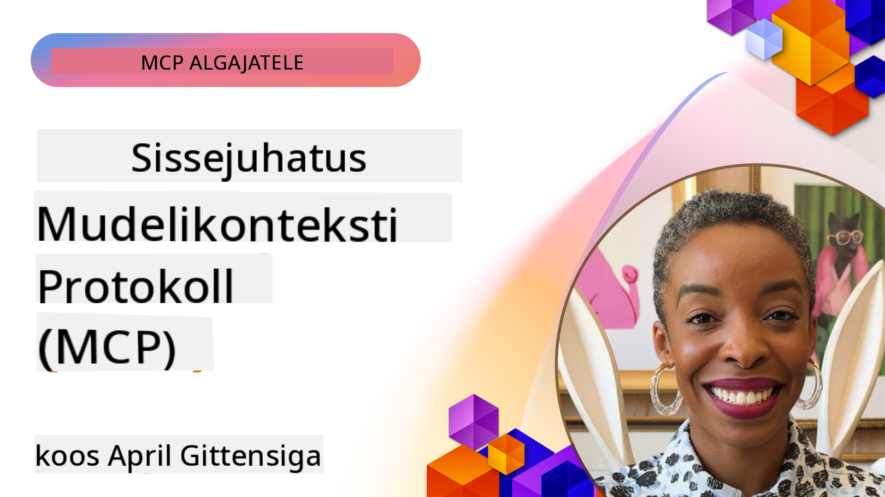
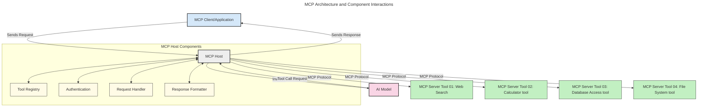
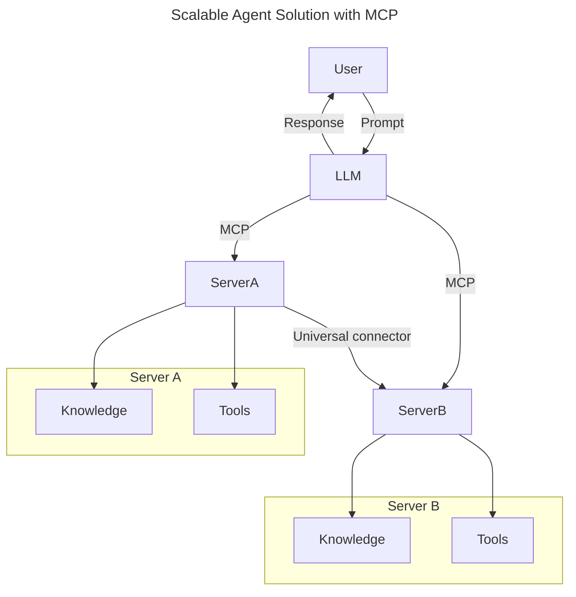
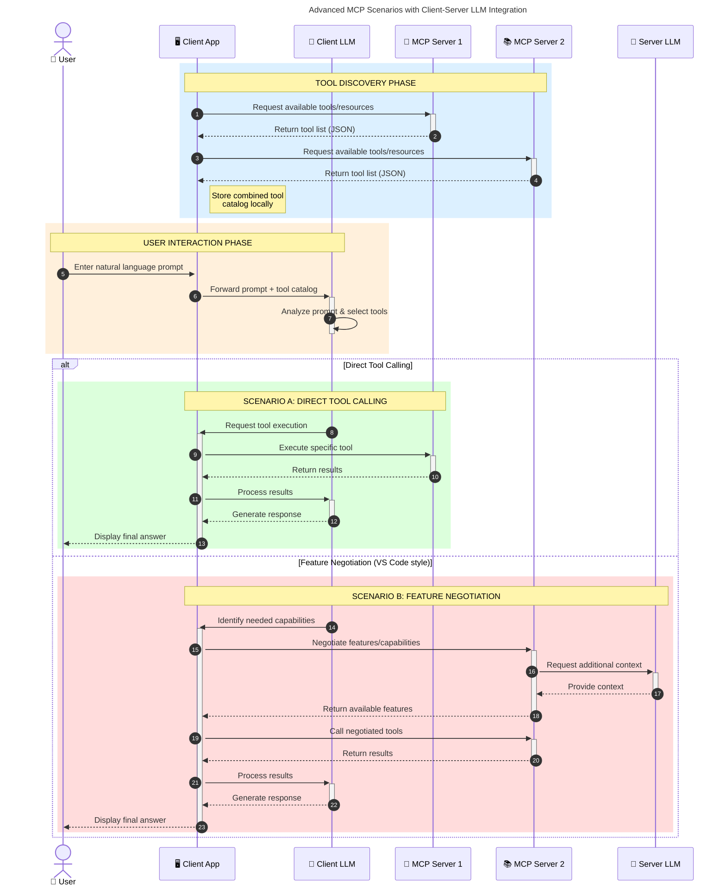

<!--
CO_OP_TRANSLATOR_METADATA:
{
  "original_hash": "9678e0c6945b8e0c23586869b0e26783",
  "translation_date": "2025-10-11T12:34:21+00:00",
  "source_file": "00-Introduction/README.md",
  "language_code": "et"
}
-->
# Sissejuhatus mudeli kontekstiprotokolli (MCP): Miks see on oluline skaleeritavate AI-rakenduste jaoks

_(Klõpsake ülaloleval pildil, et vaadata selle õppetunni videot)_

Generatiivsed AI-rakendused on suur edasiminek, kuna need võimaldavad kasutajal sageli suhelda rakendusega loomuliku keele kaudu. Kuid mida rohkem aega ja ressursse sellistesse rakendustesse investeeritakse, seda olulisem on tagada, et funktsionaalsusi ja ressursse oleks lihtne integreerida, rakendust oleks lihtne laiendada, see toetaks mitut mudelit ja suudaks toime tulla erinevate mudelite keerukustega. Lühidalt öeldes on generatiivsete AI-rakenduste loomine alguses lihtne, kuid nende kasvades ja keerukamaks muutudes tuleb hakata määratlema arhitektuuri ning tõenäoliselt on vaja standardit, et tagada rakenduste järjepidev ülesehitus. Siin tulebki MCP mängu, et asju organiseerida ja pakkuda standardit.

---

## **🔍 Mis on mudeli kontekstiprotokoll (MCP)?**

**Mudeli kontekstiprotokoll (MCP)** on **avatud ja standardiseeritud liides**, mis võimaldab suurte keelemudelite (LLM-id) sujuvat suhtlust väliste tööriistade, API-de ja andmeallikatega. See pakub järjepidevat arhitektuuri, et laiendada AI-mudelite funktsionaalsust väljapoole nende treeningandmeid, võimaldades targemaid, skaleeritavamaid ja reageerivamaid AI-süsteeme.

---

## **🎯 Miks on standardiseerimine AI-s oluline**

Generatiivsete AI-rakenduste keerukuse kasvades on oluline võtta kasutusele standardid, mis tagavad **skaleeritavuse, laiendatavuse, hooldatavuse** ja **vältida sõltuvust konkreetsetest tarnijatest**. MCP vastab nendele vajadustele, pakkudes:

- Mudelite ja tööriistade integreerimise ühtlustamist
- Vähem hapraid ja ühekordseid kohandatud lahendusi
- Võimalust mitme erineva tarnija mudelite kooseksisteerimiseks ühes ökosüsteemis

**Märkus:** Kuigi MCP esitleb end avatud standardina, ei ole plaanis MCP-d standardiseerida ühegi olemasoleva standardiorganisatsiooni, nagu IEEE, IETF, W3C, ISO või mõne muu kaudu.

---

## **📚 Õpieesmärgid**

Selle artikli lõpuks suudate:

- Defineerida **mudeli kontekstiprotokolli (MCP)** ja selle kasutusjuhtumid
- Mõista, kuidas MCP standardiseerib mudelite ja tööriistade vahelist suhtlust
- Tuvastada MCP arhitektuuri põhikomponendid
- Uurida MCP reaalseid rakendusi ettevõtete ja arenduskontekstides

---

## **💡 Miks mudeli kontekstiprotokoll (MCP) on murranguline**

### **🔗 MCP lahendab AI-interaktsioonide killustatuse**

Enne MCP-d nõudis mudelite integreerimine tööriistadega:

- Kohandatud koodi iga tööriista-mudeli paari jaoks
- Iga tarnija jaoks mittestandardseid API-sid
- Sagedasi katkestusi uuenduste tõttu
- Kehva skaleeritavust suurema tööriistade arvu korral

### **✅ MCP standardiseerimise eelised**

| **Eelis**                 | **Kirjeldus**                                                                  |
|---------------------------|-------------------------------------------------------------------------------|
| Interoperatiivsus         | LLM-id töötavad sujuvalt tööriistadega erinevatelt tarnijatelt               |
| Järjepidevus              | Ühtne käitumine platvormide ja tööriistade vahel                              |
| Taaskasutatavus           | Üks kord loodud tööriistu saab kasutada erinevates projektides ja süsteemides |
| Kiirendatud arendus       | Vähendab arendusaega, kasutades standardiseeritud, plug-and-play liideseid    |

---

## **🧱 MCP arhitektuuri ülevaade kõrgel tasemel**

MCP järgib **klient-serveri mudelit**, kus:

- **MCP Hostid** käitavad AI-mudeleid
- **MCP Kliendid** algatavad päringuid
- **MCP Serverid** pakuvad konteksti, tööriistu ja võimekusi

### **Põhikomponendid:**

- **Ressursid** – Staatilised või dünaamilised andmed mudelite jaoks  
- **Küsimused** – Eelmääratletud töövood juhendatud generatsiooniks  
- **Tööriistad** – Käivitatavad funktsioonid nagu otsing, arvutused  
- **Proovivõtmine** – Agentlik käitumine rekursiivsete interaktsioonide kaudu

---

## Kuidas MCP serverid töötavad

MCP serverid toimivad järgmiselt:

- **Päringuvoog**:
    1. Päringu algatab lõppkasutaja või tarkvara, mis tegutseb tema nimel.
    2. **MCP Klient** saadab päringu **MCP Hostile**, mis haldab AI-mudeli käitusaega.
    3. **AI Mudel** võtab vastu kasutaja küsimuse ja võib taotleda juurdepääsu välistele tööriistadele või andmetele ühe või mitme tööriistakõne kaudu.
    4. **MCP Host**, mitte mudel ise, suhtleb vastavate **MCP Serveritega** kasutades standardiseeritud protokolli.
- **MCP Host funktsionaalsus**:
    - **Tööriistade register**: Hoiab kataloogi saadaolevatest tööriistadest ja nende võimekustest.
    - **Autentimine**: Kontrollib tööriistadele juurdepääsu õigusi.
    - **Päringute haldur**: Töötleb mudelilt tulevaid tööriistapäringuid.
    - **Vastuse vormindaja**: Struktureerib tööriistade väljundid mudeli jaoks arusaadavasse vormingusse.
- **MCP Serveri täitmine**:
    - **MCP Host** suunab tööriistakõned ühele või mitmele **MCP Serverile**, millest igaüks pakub spetsialiseeritud funktsioone (nt otsing, arvutused, andmebaasi päringud).
    - **MCP Serverid** täidavad oma vastavad operatsioonid ja tagastavad tulemused **MCP Hostile** ühtses vormingus.
    - **MCP Host** vormindab ja edastab need tulemused **AI Mudelile**.
- **Vastuse lõpetamine**:
    - **AI Mudel** integreerib tööriistade väljundid lõplikku vastusesse.
    - **MCP Host** saadab selle vastuse tagasi **MCP Kliendile**, kes edastab selle lõppkasutajale või päringut teinud tarkvarale.

## 👨‍💻 Kuidas ehitada MCP serverit (koos näidetega)

MCP serverid võimaldavad laiendada LLM-i võimekusi, pakkudes andmeid ja funktsionaalsust.

Valmis proovima? Siin on keele- ja/või stack-spetsiifilised SDK-d koos näidetega lihtsate MCP serverite loomiseks erinevates keeltes/stackides:

- **Python SDK**: https://github.com/modelcontextprotocol/python-sdk

- **TypeScript SDK**: https://github.com/modelcontextprotocol/typescript-sdk

- **Java SDK**: https://github.com/modelcontextprotocol/java-sdk

- **C#/.NET SDK**: https://github.com/modelcontextprotocol/csharp-sdk

## 🌍 MCP reaalsed kasutusjuhtumid

MCP võimaldab laia valikut rakendusi, laiendades AI võimekusi:

| **Rakendus**               | **Kirjeldus**                                                                  |
|----------------------------|-------------------------------------------------------------------------------|
| Ettevõtte andmete integreerimine | Ühendage LLM-id andmebaaside, CRM-ide või sisemiste tööriistadega          |
| Agentlikud AI-süsteemid    | Võimaldage autonoomseid agente tööriistade juurdepääsu ja otsustusprotsessidega |
| Multimodaalsed rakendused  | Kombineerige teksti-, pildi- ja helitööriistad ühes ühtses AI-rakenduses       |
| Reaalajas andmete integreerimine | Tooge AI-interaktsioonidesse reaalajas andmeid täpsemate ja ajakohasemate väljundite jaoks |

### 🧠 MCP = universaalne standard AI-interaktsioonide jaoks

Mudeli kontekstiprotokoll (MCP) toimib universaalse standardina AI-interaktsioonide jaoks, sarnaselt sellele, kuidas USB-C standardiseeris füüsilised ühendused seadmete jaoks. AI maailmas pakub MCP järjepidevat liidest, võimaldades mudelitel (kliendid) integreeruda sujuvalt väliste tööriistade ja andmeallikatega (serverid). See kõrvaldab vajaduse mitmekesiste, kohandatud protokollide järele iga API või andmeallika jaoks.

MCP raames järgib MCP-ühilduv tööriist (nimetatakse MCP serveriks) ühtset standardit. Need serverid saavad loetleda pakutavaid tööriistu või toiminguid ja täita neid toiminguid, kui AI-agent neid taotleb. MCP-d toetavad AI-agentide platvormid suudavad avastada serverite pakutavaid tööriistu ja neid standardprotokolli kaudu kasutada.

### 💡 Hõlbustab juurdepääsu teadmistele

Lisaks tööriistade pakkumisele hõlbustab MCP ka juurdepääsu teadmistele. See võimaldab rakendustel pakkuda suurtele keelemudelitele (LLM-id) konteksti, ühendades need erinevate andmeallikatega. Näiteks võib MCP server esindada ettevõtte dokumendirepositooriumi, võimaldades agentidel nõudmisel asjakohast teavet hankida. Teine server võib hallata konkreetseid toiminguid, nagu e-kirjade saatmine või kirjete uuendamine. Agendi vaatenurgast on need lihtsalt tööriistad, mida ta saab kasutada—mõned tööriistad tagastavad andmeid (teadmiste kontekst), teised teostavad toiminguid. MCP haldab mõlemat tõhusalt.

Agent, kes ühendub MCP serveriga, õpib automaatselt serveri saadaolevaid võimekusi ja juurdepääsetavaid andmeid standardvormingus. See standardiseerimine võimaldab dünaamilist tööriistade kättesaadavust. Näiteks uue MCP serveri lisamine agendi süsteemi muudab selle funktsioonid kohe kasutatavaks, ilma et oleks vaja agendi juhiseid täiendavalt kohandada.

See sujuv integreerimine vastab allpool kujutatud voole, kus serverid pakuvad nii tööriistu kui ka teadmisi, tagades süsteemide vahelise sujuva koostöö.

### 👉 Näide: skaleeritav agendilahendus

Universaalne ühendaja võimaldab MCP serveritel omavahel suhelda ja võimekusi jagada, võimaldades ServerA-l delegeerida ülesandeid ServerB-le või kasutada selle tööriistu ja teadmisi. See ühendab tööriistad ja andmed serverite vahel, toetades skaleeritavaid ja modulaarseid agendi arhitektuure. Kuna MCP standardiseerib tööriistade eksponeerimist, saavad agendid dünaamiliselt avastada ja suunata päringuid serverite vahel ilma kõvakoodiga integreerimisteta.

Tööriistade ja teadmiste ühendamine: Tööriistad ja andmed on kättesaadavad serverite vahel, võimaldades skaleeritavamaid ja modulaarsemaid agentlikke arhitektuure.

### 🔄 Täiustatud MCP stsenaariumid kliendipoolse LLM-i integreerimisega

Lisaks MCP põhiarhitektuurile on olemas täiustatud stsenaariumid, kus nii klient kui ka server sisaldavad LLM-e, võimaldades keerukamaid interaktsioone. Järgnevas diagrammis võib **Kliendirakendus** olla IDE, millel on mitmeid MCP tööriistu, mida LLM saab kasutada:

## 🔐 MCP praktilised eelised

Siin on MCP kasutamise praktilised eelised:

- **Värskus**: Mudelid saavad juurdepääsu ajakohasele teabele väljaspool nende treeningandmeid
- **Võimekuse laiendamine**: Mudelid saavad kasutada spetsialiseeritud tööriistu ülesannete jaoks, milleks neid ei ole treenitud
- **Vähem hallutsinatsioone**: Välised andmeallikad pakuvad faktipõhist alust
- **Privaatsus**: Tundlikud andmed võivad jääda turvalistesse keskkondadesse, mitte olla sisestatud küsimustesse

## 📌 Olulised punktid

Järgnevad on MCP kasutamise olulised punktid:

- **MCP** standardiseerib, kuidas AI-mudelid suhtlevad tööriistade ja andmetega
- Edendab **laiendatavust, järjepidevust ja koostalitlusvõimet**
- MCP aitab **vähendada arendusaega, parandada töökindlust ja laiendada mudeli võimekusi**
- Kliendi-serveri arhitektuur **võimaldab paindlikke ja laiendatavaid AI-rakendusi**

## 🧠 Harjutus

Mõelge AI-rakendusele, mida soovite luua.

- Millised **välised tööriistad või andmed** võiksid selle võimekust parandada?
- Kuidas võiks MCP muuta integreerimise **lihtsamaks ja usaldusväärsemaks?**

## Täiendavad ressursid

- [MCP GitHubi repositoorium](https://github.com/modelcontextprotocol)

## Mis edasi

Järgmine: [1. peatükk: Põhimõisted](../01-CoreConcepts/README.md)

---

**Lahtiütlus**:  
See dokument on tõlgitud AI tõlketeenuse [Co-op Translator](https://github.com/Azure/co-op-translator) abil. Kuigi püüame tagada täpsust, palume arvestada, et automaatsed tõlked võivad sisaldada vigu või ebatäpsusi. Algne dokument selle algses keeles tuleks pidada autoriteetseks allikaks. Olulise teabe puhul soovitame kasutada professionaalset inimtõlget. Me ei vastuta selle tõlke kasutamisest tulenevate arusaamatuste või valesti tõlgenduste eest.