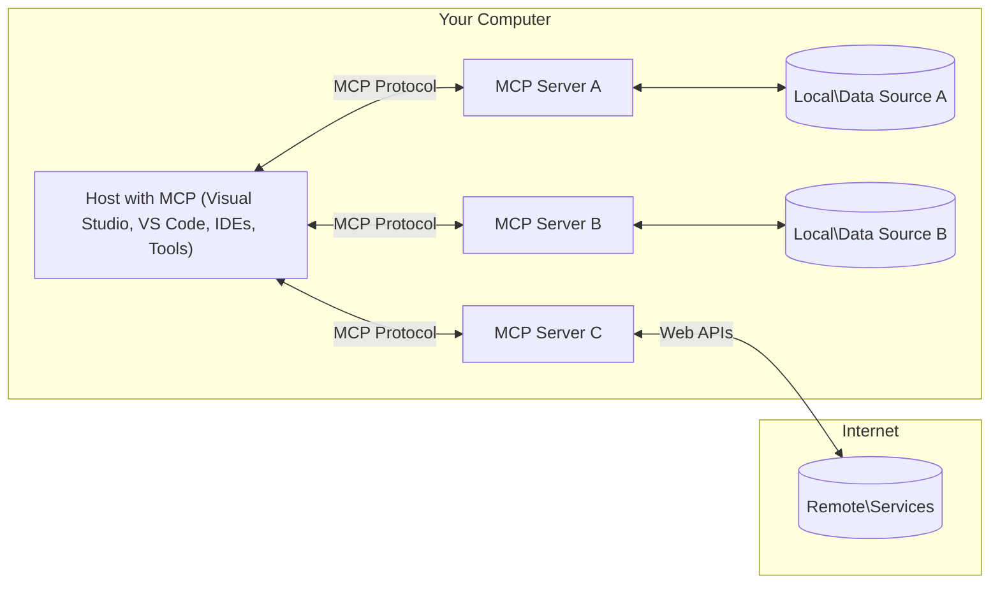

<!--
CO_OP_TRANSLATOR_METADATA:
{
  "original_hash": "904b59de1de9264801242d90a42cdd9d",
  "translation_date": "2025-10-11T12:32:42+00:00",
  "source_file": "01-CoreConcepts/README.md",
  "language_code": "et"
}
-->
# MCP Põhimõisted: Model Context Protocoli valdamine AI integreerimiseks

[](https://youtu.be/earDzWGtE84)

_(Klõpsake ülaloleval pildil, et vaadata selle õppetunni videot)_

[Model Context Protocol (MCP)](https://github.com/modelcontextprotocol) on võimas ja standardiseeritud raamistik, mis optimeerib suhtlust suurte keelemudelite (LLM-ide) ja väliste tööriistade, rakenduste ning andmeallikate vahel. 
See juhend tutvustab MCP põhikontseptsioone. Õpite selle kliendi-serveri arhitektuuri, olulisi komponente, suhtlusmehhanisme ja parimaid rakendustavasid.

- **Kasutaja selgesõnaline nõusolek**: Kõik andmete kasutamise ja toimingute teostamise nõuded vajavad kasutaja selgesõnalist heakskiitu enne täitmist. Kasutajad peavad selgelt mõistma, milliseid andmeid kasutatakse ja milliseid toiminguid tehakse, omades üksikasjalikku kontrolli lubade ja autoriseerimiste üle.

- **Andmete privaatsuse kaitse**: Kasutaja andmeid avaldatakse ainult selgesõnalise nõusolekuga ning neid tuleb kaitsta tugevate juurdepääsukontrollide abil kogu suhtluse elutsükli vältel. Rakendused peavad takistama volitamata andmeedastust ja säilitama ranget privaatsuspiiri.

- **Tööriistade kasutamise ohutus**: Iga tööriista kasutamine nõuab kasutaja selgesõnalist nõusolekut koos selge arusaamaga tööriista funktsionaalsusest, parameetritest ja võimalikust mõjust. Tugevad turvapiirid peavad takistama tahtmatut, ohtlikku või pahatahtlikku tööriistade kasutamist.

- **Transportkihi turvalisus**: Kõik suhtluskanalid peaksid kasutama sobivaid krüpteerimis- ja autentimismehhanisme. Kaugühendused peaksid rakendama turvalisi transpordiprotokolle ja korrektset mandaadihaldust.

#### Rakendamise juhised:

- **Lubade haldamine**: Rakendage peeneteralisi lubade süsteeme, mis võimaldavad kasutajatel kontrollida, millised serverid, tööriistad ja ressursid on juurdepääsetavad
- **Autentimine ja autoriseerimine**: Kasutage turvalisi autentimismeetodeid (OAuth, API võtmed) koos korrektse tokenihalduse ja aegumisega  
- **Sisendi valideerimine**: Kontrollige kõiki parameetreid ja andmesisendeid vastavalt määratletud skeemidele, et vältida süstimisrünnakuid
- **Auditilogimine**: Säilitage kõigi toimingute põhjalikud logid turvaseireks ja vastavuse tagamiseks

## Ülevaade

See õppetund uurib Model Context Protocoli (MCP) ökosüsteemi põhialuseid ja komponente. Õpite kliendi-serveri arhitektuuri, võtmekomponente ja suhtlusmehhanisme, mis MCP interaktsioone toetavad.

## Põhilised õpieesmärgid

Selle õppetunni lõpuks saate:

- Mõista MCP kliendi-serveri arhitektuuri.
- Tuvastada Hostide, Klientide ja Serverite rollid ja vastutused.
- Analüüsida MCP paindlikkust võimaldavaid põhifunktsioone.
- Õppida, kuidas teave MCP ökosüsteemis liigub.
- Saada praktilisi teadmisi .NET-i, Java, Python'i ja JavaScripti koodinäidete kaudu.

## MCP Arhitektuur: Süvavaade

MCP ökosüsteem põhineb kliendi-serveri mudelil. See modulaarne struktuur võimaldab AI rakendustel tõhusalt suhelda tööriistade, andmebaaside, API-de ja kontekstuaalsete ressurssidega. Vaatame selle arhitektuuri põhikomponente.

MCP järgib kliendi-serveri arhitektuuri, kus hostrakendus saab ühenduda mitme serveriga:



- **MCP Hostid**: Programmid nagu VSCode, Claude Desktop, IDE-d või AI tööriistad, mis soovivad MCP kaudu andmetele juurde pääseda
- **MCP Kliendid**: Protokolli kliendid, mis hoiavad 1:1 ühendusi serveritega
- **MCP Serverid**: Kerged programmid, mis pakuvad standardiseeritud Model Context Protocoli kaudu konkreetseid võimalusi
- **Kohalikud andmeallikad**: Teie arvuti failid, andmebaasid ja teenused, millele MCP serverid saavad turvaliselt juurde pääseda
- **Kaugteenused**: Välised süsteemid, mis on interneti kaudu kättesaadavad ja millele MCP serverid saavad API-de kaudu ühenduda.

MCP protokoll on arenev standard, mis kasutab kuupäevapõhist versioonimist (YYYY-MM-DD formaat). Praegune protokolli versioon on **2025-06-18**. Viimaseid uuendusi protokolli spetsifikatsioonis saate vaadata [siit](https://modelcontextprotocol.io/specification/2025-06-18/).

### 1. Hostid

Model Context Protocolis (MCP) on **Hostid** AI rakendused, mis toimivad peamise liidesena, mille kaudu kasutajad protokolliga suhtlevad. Hostid koordineerivad ja haldavad ühendusi mitme MCP serveriga, luues iga serveriühenduse jaoks spetsiaalsed MCP kliendid. Hostide näited hõlmavad:

- **AI Rakendused**: Claude Desktop, Visual Studio Code, Claude Code
- **Arenduskeskkonnad**: IDE-d ja koodiredaktorid MCP integratsiooniga  
- **Kohandatud Rakendused**: Eesmärgipõhised AI agendid ja tööriistad

**Hostid** on rakendused, mis koordineerivad AI mudelite interaktsioone. Nad:

- **Orkestreerivad AI Modelle**: Käivitavad või suhtlevad LLM-idega, et genereerida vastuseid ja koordineerida AI töövooge
- **Haldavad Kliendiühendusi**: Loovad ja hoiavad iga MCP serveriühenduse jaoks ühe MCP kliendi
- **Kontrollivad Kasutajaliidest**: Haldavad vestluse voogu, kasutajainteraktsioone ja vastuste esitlust  
- **Tagavad Turvalisuse**: Kontrollivad lubasid, turvapiiranguid ja autentimist
- **Haldavad Kasutaja Nõusolekut**: Korraldavad kasutaja heakskiitu andmete jagamiseks ja tööriistade kasutamiseks

### 2. Kliendid

**Kliendid** on olulised komponendid, mis hoiavad pühendunud üks-ühele ühendusi Hostide ja MCP serverite vahel. Iga MCP klient luuakse Hostis, et ühendada konkreetse MCP serveriga, tagades organiseeritud ja turvalised suhtluskanalid. Mitme kliendi olemasolu võimaldab Hostidel ühendada mitme serveriga samaaegselt.

**Kliendid** on ühenduskomponendid hostrakenduses. Nad:

- **Protokollisuhtlus**: Saadavad JSON-RPC 2.0 päringuid serveritele koos juhiste ja käsklustega
- **Võimekuste Läbirääkimine**: Läbirääkimised toetatud funktsioonide ja protokolliversioonide üle serveritega initsialiseerimise ajal
- **Tööriistade Käivitamine**: Haldavad mudelite tööriistade kasutamise päringuid ja töötlevad vastuseid
- **Reaalajas Uuendused**: Haldavad serverite teavitusi ja reaalajas uuendusi
- **Vastuste Töötlemine**: Töötlevad ja vormindavad serveri vastuseid kasutajatele kuvamiseks

### 3. Serverid

**Serverid** on programmid, mis pakuvad konteksti, tööriistu ja võimalusi MCP klientidele. Nad võivad töötada kohapeal (samal masinal kui Host) või kaugelt (välisel platvormil) ning vastutavad kliendipäringute töötlemise ja struktureeritud vastuste pakkumise eest. Serverid pakuvad konkreetset funktsionaalsust standardiseeritud Model Context Protocoli kaudu.

**Serverid** on teenused, mis pakuvad konteksti ja võimalusi. Nad:

- **Funktsioonide Registreerimine**: Registreerivad ja pakuvad klientidele kättesaadavaid primitiive (ressursse, juhiseid, tööriistu)
- **Päringute Töötlemine**: Võtavad vastu ja täidavad tööriistakõnesid, ressursipäringuid ja juhiste päringuid klientidelt
- **Konteksti Pakkumine**: Pakuvad kontekstuaalset teavet ja andmeid mudelivastuste täiustamiseks
- **Seisundi Haldamine**: Säilitavad sessiooni seisundit ja haldavad vajadusel seisundipõhiseid interaktsioone
- **Reaalajas Teavitused**: Saadavad teavitusi võimekuste muutuste ja uuenduste kohta ühendatud klientidele

Servereid saab arendada igaüks, et laiendada mudeli võimalusi spetsialiseeritud funktsionaalsusega, ning nad toetavad nii kohalikku kui ka kaugjuurutuse stsenaariume.

### 4. Serveri Primitiivid

Model Context Protocoli (MCP) serverid pakuvad kolme põhiklassi **primitiive**, mis määratlevad rikkalike interaktsioonide põhielemendid klientide, hostide ja keelemudelite vahel. Need primitiivid määratlevad protokolli kaudu kättesaadava kontekstuaalse teabe ja toimingute tüübid.

MCP serverid võivad pakkuda mis tahes kombinatsiooni järgmistest kolmest põhiklassist primitiividest:

#### Ressursid

**Ressursid** on andmeallikad, mis pakuvad AI rakendustele kontekstuaalset teavet. Nad esindavad staatilist või dünaamilist sisu, mis võib täiustada mudeli arusaamist ja otsuste tegemist:

- **Kontekstuaalsed Andmed**: Struktureeritud teave ja kontekst AI mudeli tarbimiseks
- **Teadmiste Baasid**: Dokumendikogud, artiklid, käsiraamatud ja teadusartiklid
- **Kohalikud Andmeallikad**: Failid, andmebaasid ja kohaliku süsteemi teave  
- **Välised Andmed**: API vastused, veebiteenused ja kaugandmesüsteemid
- **Dünaamiline Sisu**: Reaalajas andmed, mis uuenevad vastavalt välistele tingimustele

Ressursid identifitseeritakse URI-de abil ja toetavad avastamist `resources/list` ning lugemist `resources/read` meetodite kaudu:

```text
file://documents/project-spec.md
database://production/users/schema
api://weather/current
```

#### Juhised

**Juhised** on korduvkasutatavad mallid, mis aitavad struktureerida interaktsioone keelemudelitega. Nad pakuvad standardiseeritud suhtlusmustreid ja mallipõhiseid töövooge:

- **Mallipõhised Interaktsioonid**: Eelstruktureeritud sõnumid ja vestluse alustajad
- **Töövoo Mallid**: Standardiseeritud järjestused tavapäraste ülesannete ja interaktsioonide jaoks
- **Few-shot Näited**: Näitepõhised mallid mudeli juhendamiseks
- **Süsteemijuhised**: Põhijuhised, mis määratlevad mudeli käitumise ja konteksti
- **Dünaamilised Mallid**: Parameetritega juhised, mis kohanduvad konkreetsete kontekstidega

Juhised toetavad muutujate asendamist ja neid saab avastada `prompts/list` ning hankida `prompts/get` meetodite kaudu:

```markdown
Generate a {{task_type}} for {{product}} targeting {{audience}} with the following requirements: {{requirements}}
```

#### Tööriistad

**Tööriistad** on täidetavad funktsioonid, mida AI mudelid saavad kasutada konkreetsete toimingute tegemiseks. Nad esindavad MCP ökosüsteemi "tegusõnu", võimaldades mudelitel suhelda väliste süsteemidega:

- **Täidetavad Funktsioonid**: Diskreetsed operatsioonid, mida mudelid saavad konkreetsete parameetritega käivitada
- **Väliste Süsteemide Integratsioon**: API kõned, andmebaasi päringud, failitoimingud, arvutused
- **Unikaalne Identiteet**: Igal tööriistal on eraldi nimi, kirjeldus ja parameetrite skeem
- **Struktureeritud Sisend/Väljund**: Tööriistad aktsepteerivad valideeritud parameetreid ja tagastavad struktureeritud, tüübitud vastuseid
- **Toimimisvõimekus**: Võimaldavad mudelitel teha reaalseid toiminguid ja hankida reaalajas andmeid

Tööriistad määratletakse JSON Schema abil parameetrite valideerimiseks ning neid saab avastada `tools/list` ja käivitada `tools/call` meetodite kaudu:

```typescript
server.tool(
  "search_products", 
  {
    query: z.string().describe("Search query for products"),
    category: z.string().optional().describe("Product category filter"),
    max_results: z.number().default(10).describe("Maximum results to return")
  }, 
  async (params) => {
    // Execute search and return structured results
    return await productService.search(params);
  }
);
```

## Kliendi Primitiivid

Model Context Protocolis (MCP) võivad **kliendid** pakkuda primitiive, mis võimaldavad serveritel taotleda täiendavaid võimekusi hostrakenduselt. Need kliendipoolsed primitiivid võimaldavad rikkalikumaid ja interaktiivsemaid serveri rakendusi, mis pääsevad juurde AI mudeli võimekustele ja kasutajainteraktsioonidele.

### Näidised

**Näidised** võimaldavad serveritel taotleda keelemudeli täiendusi kliendi AI rakendusest. See primitiiv võimaldab serveritel kasutada LLM-i võimekusi ilma oma mudelisõltuvusi lisamata:

- **Mudelist Sõltumatu Juurdepääs**: Serverid saavad taotleda täiendusi ilma LLM SDK-de lisamiseta või mudelile juurdepääsu haldamata
- **Serveri Algatatud AI**: Võimaldab serveritel iseseisvalt sisu genereerida kliendi AI mudeli abil
- **Korduvad LLM Interaktsioonid**: Toetab keerukaid stsenaariume, kus serverid vajavad AI abi töötlemiseks
- **Dünaamiline Sisu Loomine**: Võimaldab serveritel luua kontekstuaalseid vastuseid hosti mudeli abil

Näidised algatatakse `sampling/complete` meetodi kaudu, kus serverid saadavad täiendustaotlusi klientidele.

### Küsitlus  

**Küsitlus** võimaldab serveritel taotleda täiendavat teavet või kinnitust kasutajatelt kliendi liidese kaudu:

- **Kasutaja Sisendi Taotlused**: Serverid saavad küsida täiendavat teavet, kui seda on tööriista kasutamiseks vaja
- **Kinnituse Dialoogid**: Taotlevad kasutaja heakskiitu tundlike või mõjukate toimingute jaoks
- **Interaktiivsed Töövood**: Võimaldavad serveritel luua samm-sammulisi kasutajainteraktsioone
- **Dünaamiline Parameetrite Kogumine**: Koguvad puuduvaid või valikulisi parameetreid tööriista kasutamise ajal

Küsitlusetaotlused tehakse `elicitation/request` meetodi abil, et koguda kasutaja sisendit kliendi liidese kaudu.

### Logimine

**Logimine** võimaldab serveritel saata struktureeritud logisõnumeid klientidele silumiseks, jälgimiseks ja operatiivseks nähtavuseks:

- **Silumise Tugi**: Võimaldab serveritel pakkuda üksikasjalikke täitmislogisid tõrkeotsinguks
- **Operatiivne Jälgimine**: Saadab staatuse uuendusi ja jõudlusmõõdikuid klientidele
- **Vea Raporteerimine**: Pakub üksikasjalikku veakonteksti ja diagnostilist teavet
- **Auditijäljed**: Loob serveri toimingute ja otsuste põhjalikud logid

Logisõnumeid saadetakse klientidele, et pakkuda läbipaistvust serveri toimingutes ja hõlbustada silumist.

## Teabevoog MCP-s

Model Context Protocol (MCP) määratleb struktureeritud teabevoo hostide, klientide, serverite ja mudelite vahel. Selle voo mõistmine aitab selgitada, kuidas kasutajataotlusi töödeldakse ja kuidas välised tööriistad ning andmed integreeritakse mudelivastustesse.

- **Host Algatab Ühenduse**  
  Hostrakendus (näiteks IDE või vestlusliides) loob ühenduse MCP serveriga, tavaliselt STDIO, WebSocketi või muu toetatud transpordi kaudu.

- **Võimekuste Läbirääkimine**  
  Klient (hosti sees) ja server vahetavad teavet oma toetatud funktsioonide, tööriistade, ressursside ja protokolliversioonide kohta. See tagab, et mõlemad pooled mõistavad, millised võimekused on sessiooni jaoks saadaval.

- **Kasutaja Taotlus**  
  Kasutaja suhtleb hostiga (nt sisestab juhise või käsu). Host kogub selle sisendi ja edast
- **Elutsükli haldamine**: Hoolitseb ühenduse algatamise, võimekuse läbirääkimise ja sessiooni lõpetamise eest klientide ja serverite vahel
- **Serveri primitiivid**: Võimaldab serveritel pakkuda põhifunktsionaalsust tööriistade, ressursside ja mallide kaudu
- **Kliendi primitiivid**: Võimaldab serveritel taotleda LLM-ide proovivõtmist, kasutajasisendi küsimist ja logisõnumite saatmist
- **Reaalajas teavitused**: Toetab asünkroonseid teavitusi dünaamiliste uuenduste jaoks ilma pideva päringuta

#### Põhifunktsioonid:

- **Protokolli versiooni läbirääkimine**: Kasutab kuupäevapõhist versioonimist (YYYY-MM-DD), et tagada ühilduvus
- **Võimekuse avastamine**: Kliendid ja serverid vahetavad algatamise ajal toetatud funktsioonide teavet
- **Oleku säilitamine**: Säilitab ühenduse oleku mitme interaktsiooni jooksul, et tagada konteksti järjepidevus

### Transpordikiht

**Transpordikiht** haldab suhtluskanaleid, sõnumite raamimist ja autentimist MCP osalejate vahel:

#### Toetatud transpordimehhanismid:

1. **STDIO transport**:
   - Kasutab standardseid sisend-/väljundvooge otseseks protsessidevaheliseks suhtluseks
   - Optimaalne kohalike protsesside jaoks samas masinas, ilma võrgu koormuseta
   - Tavaliselt kasutatakse kohalike MCP serverite rakendustes

2. **Voogesitatav HTTP transport**:
   - Kasutab HTTP POST-i klient-server sõnumite jaoks  
   - Valikuline Server-Sent Events (SSE) serverist kliendile voogesitamiseks
   - Võimaldab kaugserveri suhtlust üle võrgu
   - Toetab standardset HTTP autentimist (kandjatokenid, API võtmed, kohandatud päised)
   - MCP soovitab turvaliseks tokenipõhiseks autentimiseks OAuth-i

#### Transpordi abstraktsioon:

Transpordikiht eraldab suhtlusdetailid andmekihist, võimaldades sama JSON-RPC 2.0 sõnumiformaati kõigi transpordimehhanismide puhul. See abstraktsioon võimaldab rakendustel sujuvalt vahetada kohalike ja kaugserverite vahel.

### Turvalisuse kaalutlused

MCP rakendused peavad järgima mitmeid kriitilisi turvapõhimõtteid, et tagada ohutud, usaldusväärsed ja turvalised interaktsioonid kõigi protokollitoimingute ajal:

- **Kasutaja nõusolek ja kontroll**: Kasutajad peavad andma selgesõnalise nõusoleku enne, kui andmeid kasutatakse või toiminguid tehakse. Neil peaks olema selge kontroll selle üle, milliseid andmeid jagatakse ja millised tegevused on lubatud, toetades intuitiivseid kasutajaliideseid tegevuste ülevaatamiseks ja heakskiitmiseks.

- **Andmete privaatsus**: Kasutaja andmeid tuleks avaldada ainult selgesõnalise nõusolekuga ja neid tuleb kaitsta sobivate juurdepääsukontrollidega. MCP rakendused peavad kaitsma volitamata andmeedastuse eest ja tagama privaatsuse säilimise kõigi interaktsioonide ajal.

- **Tööriistade ohutus**: Enne mis tahes tööriista kasutamist on vajalik selgesõnaline kasutaja nõusolek. Kasutajatel peaks olema selge arusaam iga tööriista funktsionaalsusest ning tuleb kehtestada tugevad turvapiirid, et vältida soovimatut või ohtlikku tööriista kasutamist.

Nende turvapõhimõtete järgimisega tagab MCP kasutajate usalduse, privaatsuse ja ohutuse säilimise kõigi protokolli interaktsioonide ajal, võimaldades samal ajal võimsaid AI integratsioone.

## Koodinäited: Põhikomponendid

Allpool on koodinäited mitmes populaarses programmeerimiskeeles, mis illustreerivad, kuidas rakendada MCP serveri põhikomponente ja tööriistu.

### .NET näide: Lihtsa MCP serveri loomine tööriistadega

Siin on praktiline .NET koodinäide, mis demonstreerib, kuidas rakendada lihtsat MCP serverit kohandatud tööriistadega. Näide näitab, kuidas määratleda ja registreerida tööriistu, käsitleda päringuid ja ühendada server Model Context Protocoli abil.

```csharp
using System;
using System.Threading.Tasks;
using ModelContextProtocol.Server;
using ModelContextProtocol.Server.Transport;
using ModelContextProtocol.Server.Tools;

public class WeatherServer
{
    public static async Task Main(string[] args)
    {
        // Create an MCP server
        var server = new McpServer(
            name: "Weather MCP Server",
            version: "1.0.0"
        );
        
        // Register our custom weather tool
        server.AddTool<string, WeatherData>("weatherTool", 
            description: "Gets current weather for a location",
            execute: async (location) => {
                // Call weather API (simplified)
                var weatherData = await GetWeatherDataAsync(location);
                return weatherData;
            });
        
        // Connect the server using stdio transport
        var transport = new StdioServerTransport();
        await server.ConnectAsync(transport);
        
        Console.WriteLine("Weather MCP Server started");
        
        // Keep the server running until process is terminated
        await Task.Delay(-1);
    }
    
    private static async Task<WeatherData> GetWeatherDataAsync(string location)
    {
        // This would normally call a weather API
        // Simplified for demonstration
        await Task.Delay(100); // Simulate API call
        return new WeatherData { 
            Temperature = 72.5,
            Conditions = "Sunny",
            Location = location
        };
    }
}

public class WeatherData
{
    public double Temperature { get; set; }
    public string Conditions { get; set; }
    public string Location { get; set; }
}
```

### Java näide: MCP serveri komponendid

See näide demonstreerib sama MCP serverit ja tööriistade registreerimist nagu ülaltoodud .NET näites, kuid rakendatud Java keeles.

```java
import io.modelcontextprotocol.server.McpServer;
import io.modelcontextprotocol.server.McpToolDefinition;
import io.modelcontextprotocol.server.transport.StdioServerTransport;
import io.modelcontextprotocol.server.tool.ToolExecutionContext;
import io.modelcontextprotocol.server.tool.ToolResponse;

public class WeatherMcpServer {
    public static void main(String[] args) throws Exception {
        // Create an MCP server
        McpServer server = McpServer.builder()
            .name("Weather MCP Server")
            .version("1.0.0")
            .build();
            
        // Register a weather tool
        server.registerTool(McpToolDefinition.builder("weatherTool")
            .description("Gets current weather for a location")
            .parameter("location", String.class)
            .execute((ToolExecutionContext ctx) -> {
                String location = ctx.getParameter("location", String.class);
                
                // Get weather data (simplified)
                WeatherData data = getWeatherData(location);
                
                // Return formatted response
                return ToolResponse.content(
                    String.format("Temperature: %.1f°F, Conditions: %s, Location: %s", 
                    data.getTemperature(), 
                    data.getConditions(), 
                    data.getLocation())
                );
            })
            .build());
        
        // Connect the server using stdio transport
        try (StdioServerTransport transport = new StdioServerTransport()) {
            server.connect(transport);
            System.out.println("Weather MCP Server started");
            // Keep server running until process is terminated
            Thread.currentThread().join();
        }
    }
    
    private static WeatherData getWeatherData(String location) {
        // Implementation would call a weather API
        // Simplified for example purposes
        return new WeatherData(72.5, "Sunny", location);
    }
}

class WeatherData {
    private double temperature;
    private String conditions;
    private String location;
    
    public WeatherData(double temperature, String conditions, String location) {
        this.temperature = temperature;
        this.conditions = conditions;
        this.location = location;
    }
    
    public double getTemperature() {
        return temperature;
    }
    
    public String getConditions() {
        return conditions;
    }
    
    public String getLocation() {
        return location;
    }
}
```

### Python näide: MCP serveri loomine

See näide kasutab fastmcp-d, seega veenduge, et see oleks eelnevalt installitud:

```python
pip install fastmcp
```
Koodi näidis:

```python
#!/usr/bin/env python3
import asyncio
from fastmcp import FastMCP
from fastmcp.transports.stdio import serve_stdio

# Create a FastMCP server
mcp = FastMCP(
    name="Weather MCP Server",
    version="1.0.0"
)

@mcp.tool()
def get_weather(location: str) -> dict:
    """Gets current weather for a location."""
    return {
        "temperature": 72.5,
        "conditions": "Sunny",
        "location": location
    }

# Alternative approach using a class
class WeatherTools:
    @mcp.tool()
    def forecast(self, location: str, days: int = 1) -> dict:
        """Gets weather forecast for a location for the specified number of days."""
        return {
            "location": location,
            "forecast": [
                {"day": i+1, "temperature": 70 + i, "conditions": "Partly Cloudy"}
                for i in range(days)
            ]
        }

# Register class tools
weather_tools = WeatherTools()

# Start the server
if __name__ == "__main__":
    asyncio.run(serve_stdio(mcp))
```

### JavaScript näide: MCP serveri loomine

See näide näitab MCP serveri loomist JavaScriptis ja kahe ilmaga seotud tööriista registreerimist.

```javascript
// Using the official Model Context Protocol SDK
import { McpServer } from "@modelcontextprotocol/sdk/server/mcp.js";
import { StdioServerTransport } from "@modelcontextprotocol/sdk/server/stdio.js";
import { z } from "zod"; // For parameter validation

// Create an MCP server
const server = new McpServer({
  name: "Weather MCP Server",
  version: "1.0.0"
});

// Define a weather tool
server.tool(
  "weatherTool",
  {
    location: z.string().describe("The location to get weather for")
  },
  async ({ location }) => {
    // This would normally call a weather API
    // Simplified for demonstration
    const weatherData = await getWeatherData(location);
    
    return {
      content: [
        { 
          type: "text", 
          text: `Temperature: ${weatherData.temperature}°F, Conditions: ${weatherData.conditions}, Location: ${weatherData.location}` 
        }
      ]
    };
  }
);

// Define a forecast tool
server.tool(
  "forecastTool",
  {
    location: z.string(),
    days: z.number().default(3).describe("Number of days for forecast")
  },
  async ({ location, days }) => {
    // This would normally call a weather API
    // Simplified for demonstration
    const forecast = await getForecastData(location, days);
    
    return {
      content: [
        { 
          type: "text", 
          text: `${days}-day forecast for ${location}: ${JSON.stringify(forecast)}` 
        }
      ]
    };
  }
);

// Helper functions
async function getWeatherData(location) {
  // Simulate API call
  return {
    temperature: 72.5,
    conditions: "Sunny",
    location: location
  };
}

async function getForecastData(location, days) {
  // Simulate API call
  return Array.from({ length: days }, (_, i) => ({
    day: i + 1,
    temperature: 70 + Math.floor(Math.random() * 10),
    conditions: i % 2 === 0 ? "Sunny" : "Partly Cloudy"
  }));
}

// Connect the server using stdio transport
const transport = new StdioServerTransport();
server.connect(transport).catch(console.error);

console.log("Weather MCP Server started");
```

See JavaScripti näide demonstreerib, kuidas luua MCP klient, mis ühendub serveriga, saadab päringu ja töötleb vastust, sealhulgas kõiki tehtud tööriistakõnesid.

## Turvalisus ja autoriseerimine

MCP sisaldab mitmeid sisseehitatud kontseptsioone ja mehhanisme turvalisuse ja autoriseerimise haldamiseks kogu protokolli ulatuses:

1. **Tööriistade lubade kontroll**:  
  Kliendid saavad määrata, milliseid tööriistu mudelil on lubatud sessiooni ajal kasutada. See tagab, et ainult selgesõnaliselt lubatud tööriistad on kättesaadavad, vähendades soovimatute või ohtlike toimingute riski. Lubasid saab dünaamiliselt konfigureerida vastavalt kasutaja eelistustele, organisatsiooni poliitikatele või interaktsiooni kontekstile.

2. **Autentimine**:  
  Serverid võivad nõuda autentimist enne tööriistade, ressursside või tundlike toimingute kasutamist. See võib hõlmata API võtmeid, OAuth tokenid või muid autentimisskeeme. Õige autentimine tagab, et ainult usaldusväärsed kliendid ja kasutajad saavad serveri funktsioone kasutada.

3. **Valideerimine**:  
  Parameetrite valideerimine on kohustuslik kõigi tööriistakõnede puhul. Iga tööriist määratleb oma parameetrite eeldatavad tüübid, formaadid ja piirangud ning server valideerib sissetulevad päringud vastavalt. See hoiab ära vigase või pahatahtliku sisendi jõudmise tööriista rakendusteni ja aitab säilitada toimingute terviklikkust.

4. **Kasutuspiirangud**:  
  Serverid võivad rakendada kasutuspiiranguid tööriistakõnedele ja ressursside kasutamisele, et vältida kuritarvitamist ja tagada serveri ressursside õiglane kasutamine. Piiranguid saab rakendada kasutaja, sessiooni või globaalsel tasemel, aidates kaitsta teenusetõkestusrünnakute või liigse ressursitarbimise eest.

Kombineerides neid mehhanisme, pakub MCP turvalist alust keelemudelite integreerimiseks väliste tööriistade ja andmeallikatega, andes kasutajatele ja arendajatele peenhäälestatud kontrolli juurdepääsu ja kasutamise üle.

## Protokollisõnumid ja suhtlusvoog

MCP suhtlus kasutab struktureeritud **JSON-RPC 2.0** sõnumeid, et hõlbustada selgeid ja usaldusväärseid interaktsioone hostide, klientide ja serverite vahel. Protokoll määratleb konkreetseid sõnumimustreid erinevat tüüpi toimingute jaoks:

### Põhisõnumite tüübid:

#### **Algatamise sõnumid**
- **`initialize` päring**: Loob ühenduse ja läbiräägib protokolli versiooni ja võimekused
- **`initialize` vastus**: Kinnitab toetatud funktsioonid ja serveri teabe  
- **`notifications/initialized`**: Märgib, et algatamine on lõpule viidud ja sessioon on valmis

#### **Avastamise sõnumid**
- **`tools/list` päring**: Avastab serveri saadaval olevad tööriistad
- **`resources/list` päring**: Loetleb saadaval olevad ressursid (andmeallikad)
- **`prompts/list` päring**: Hangib saadaval olevad mallid

#### **Täitmisesõnumid**  
- **`tools/call` päring**: Käivitab konkreetse tööriista koos antud parameetritega
- **`resources/read` päring**: Hangib sisu konkreetsest ressursist
- **`prompts/get` päring**: Hangib malli koos valikuliste parameetritega

#### **Kliendipoolsed sõnumid**
- **`sampling/complete` päring**: Server taotleb LLM-i lõpetamist kliendilt
- **`elicitation/request`**: Server taotleb kasutajasisendit kliendi liidese kaudu
- **Logisõnumid**: Server saadab struktureeritud logisõnumeid kliendile

#### **Teavitussõnumid**
- **`notifications/tools/list_changed`**: Server teavitab klienti tööriistade muudatustest
- **`notifications/resources/list_changed`**: Server teavitab klienti ressursside muudatustest  
- **`notifications/prompts/list_changed`**: Server teavitab klienti mallide muudatustest

### Sõnumite struktuur:

Kõik MCP sõnumid järgivad JSON-RPC 2.0 formaati:
- **Päringusõnumid**: Sisaldavad `id`, `method` ja valikulisi `params`
- **Vastussõnumid**: Sisaldavad `id` ja kas `result` või `error`  
- **Teavitussõnumid**: Sisaldavad `method` ja valikulisi `params` (ilma `id`-ta, vastust ei oodata)

See struktureeritud suhtlus tagab usaldusväärsed, jälgitavad ja laiendatavad interaktsioonid, toetades arenenud stsenaariume nagu reaalajas uuendused, tööriistade ahelad ja tugev veahaldus.

## Olulised punktid

- **Arhitektuur**: MCP kasutab klient-server arhitektuuri, kus hostid haldavad mitut kliendiühendust serveritega
- **Osalejad**: Ökosüsteem hõlmab hoste (AI rakendused), kliente (protokolli ühendajad) ja servereid (võimekuse pakkujad)
- **Transpordimehhanismid**: Suhtlus toetab STDIO-d (kohalik) ja voogesitatavat HTTP-d koos valikulise SSE-ga (kaug)
- **Põhiprimitiivid**: Serverid pakuvad tööriistu (käivitatavad funktsioonid), ressursse (andmeallikad) ja malle (mallid)
- **Kliendi primitiivid**: Serverid saavad taotleda proovivõtmist (LLM-i lõpetamised), küsimist (kasutajasisend) ja logimist klientidelt
- **Protokolli alus**: Põhineb JSON-RPC 2.0-l koos kuupäevapõhise versioonimisega (praegune: 2025-06-18)
- **Reaalajas võimekus**: Toetab teavitusi dünaamiliste uuenduste ja reaalajas sünkroniseerimise jaoks
- **Turvalisus eelkõige**: Selgesõnaline kasutaja nõusolek, andmete privaatsuse kaitse ja turvaline transport on põhinõuded

## Harjutus

Kavanda lihtne MCP tööriist, mis oleks kasulik sinu valdkonnas. Määra:
1. Mis nime tööriist kannaks
2. Milliseid parameetreid see aktsepteeriks
3. Millist väljundit see tagastaks
4. Kuidas mudel võiks seda tööriista kasutada kasutajaprobleemide lahendamiseks


---

## Mis edasi

Järgmine: [Peatükk 2: Turvalisus](../02-Security/README.md)

---

**Lahtiütlus**:  
See dokument on tõlgitud AI tõlketeenuse [Co-op Translator](https://github.com/Azure/co-op-translator) abil. Kuigi püüame tagada täpsust, palume arvestada, et automaatsed tõlked võivad sisaldada vigu või ebatäpsusi. Algne dokument selle algses keeles tuleks pidada autoriteetseks allikaks. Olulise teabe puhul soovitame kasutada professionaalset inimtõlget. Me ei vastuta selle tõlke kasutamisest tulenevate arusaamatuste või valesti tõlgenduste eest.