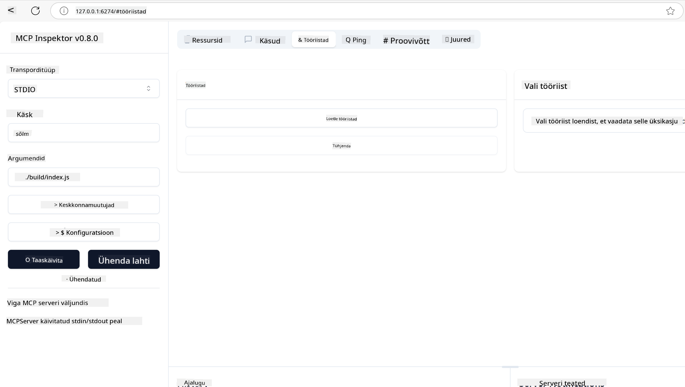
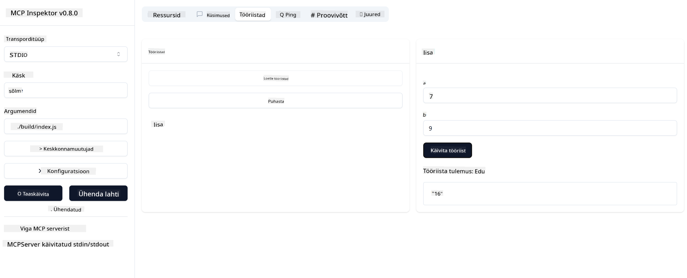

<!--
CO_OP_TRANSLATOR_METADATA:
{
  "original_hash": "ec11ee93f31fdadd94facd3e3d22f9e6",
  "translation_date": "2025-10-11T11:43:46+00:00",
  "source_file": "03-GettingStarted/01-first-server/README.md",
  "language_code": "et"
}
-->
# MCP-ga alustamine

Tere tulemast Model Context Protocoli (MCP) esimestesse sammudesse! Olgu MCP teile uus või soovite oma teadmisi süvendada, see juhend aitab teil läbi viia olulise seadistamise ja arendamise protsessi. Avastate, kuidas MCP võimaldab sujuvat integratsiooni AI mudelite ja rakenduste vahel ning õpite kiiresti oma keskkonda ette valmistama MCP-lahenduste loomiseks ja testimiseks.

> TLDR; Kui loote AI-rakendusi, teate, et saate lisada tööriistu ja muid ressursse oma LLM-i (suure keelemudeli) juurde, et muuta LLM targemaks. Kui aga paigutate need tööriistad ja ressursid serverisse, saavad rakendus ja serveri võimalused olla kasutatavad mis tahes kliendi poolt, olgu LLM-iga või ilma.

## Ülevaade

See õppetund pakub praktilisi juhiseid MCP keskkondade seadistamiseks ja esimeste MCP rakenduste loomiseks. Õpite, kuidas seadistada vajalikke tööriistu ja raamistikke, luua põhilisi MCP servereid, luua hostrakendusi ja testida oma rakendusi.

Model Context Protocol (MCP) on avatud protokoll, mis standardiseerib, kuidas rakendused pakuvad konteksti LLM-idele. Mõelge MCP-st kui USB-C pordist AI rakenduste jaoks – see pakub standardiseeritud viisi AI mudelite ühendamiseks erinevate andmeallikate ja tööriistadega.

## Õpieesmärgid

Selle õppetunni lõpuks suudate:

- Seadistada MCP arenduskeskkondi C#, Java, Python, TypeScripti ja Rusti jaoks
- Luua ja juurutada põhilisi MCP servereid kohandatud funktsioonidega (ressursid, käsud ja tööriistad)
- Luua hostrakendusi, mis ühenduvad MCP serveritega
- Testida ja siluda MCP rakendusi

## MCP keskkonna seadistamine

Enne MCP-ga töötamise alustamist on oluline ette valmistada oma arenduskeskkond ja mõista põhitöövoogu. See jaotis juhendab teid algseadistuse sammudes, et tagada MCP-ga sujuv algus.

### Eeltingimused

Enne MCP arendusse sukeldumist veenduge, et teil on:

- **Arenduskeskkond**: Valitud keele jaoks (C#, Java, Python, TypeScript või Rust)
- **IDE/redaktor**: Visual Studio, Visual Studio Code, IntelliJ, Eclipse, PyCharm või mõni kaasaegne koodiredaktor
- **Paketihaldurid**: NuGet, Maven/Gradle, pip, npm/yarn või Cargo
- **API võtmed**: AI teenuste jaoks, mida plaanite kasutada oma hostrakendustes

## MCP serveri põhiline struktuur

MCP server sisaldab tavaliselt:

- **Serveri konfiguratsioon**: Pordi, autentimise ja muude seadete seadistamine
- **Ressursid**: Andmed ja kontekst, mis tehakse LLM-idele kättesaadavaks
- **Tööriistad**: Funktsionaalsus, mida mudelid saavad kasutada
- **Käsud**: Mallid teksti genereerimiseks või struktureerimiseks

Siin on lihtsustatud näide TypeScriptis:

```typescript
import { McpServer, ResourceTemplate } from "@modelcontextprotocol/sdk/server/mcp.js";
import { StdioServerTransport } from "@modelcontextprotocol/sdk/server/stdio.js";
import { z } from "zod";

// Create an MCP server
const server = new McpServer({
  name: "Demo",
  version: "1.0.0"
});

// Add an addition tool
server.tool("add",
  { a: z.number(), b: z.number() },
  async ({ a, b }) => ({
    content: [{ type: "text", text: String(a + b) }]
  })
);

// Add a dynamic greeting resource
server.resource(
  "file",
  // The 'list' parameter controls how the resource lists available files. Setting it to undefined disables listing for this resource.
  new ResourceTemplate("file://{path}", { list: undefined }),
  async (uri, { path }) => ({
    contents: [{
      uri: uri.href,
      text: `File, ${path}!`
    }]
  })
);

// Add a file resource that reads the file contents
server.resource(
  "file",
  new ResourceTemplate("file://{path}", { list: undefined }),
  async (uri, { path }) => {
    let text;
    try {
      text = await fs.readFile(path, "utf8");
    } catch (err) {
      text = `Error reading file: ${err.message}`;
    }
    return {
      contents: [{
        uri: uri.href,
        text
      }]
    };
  }
);

server.prompt(
  "review-code",
  { code: z.string() },
  ({ code }) => ({
    messages: [{
      role: "user",
      content: {
        type: "text",
        text: `Please review this code:\n\n${code}`
      }
    }]
  })
);

// Start receiving messages on stdin and sending messages on stdout
const transport = new StdioServerTransport();
await server.connect(transport);
```

Eelnevas koodis me:

- Impordime vajalikud klassid MCP TypeScript SDK-st.
- Loome ja konfigureerime uue MCP serveri eksemplari.
- Registreerime kohandatud tööriista (`calculator`) koos käsitlusfunktsiooniga.
- Käivitame serveri, et kuulata sissetulevaid MCP päringuid.

## Testimine ja silumine

Enne MCP serveri testimise alustamist on oluline mõista saadaolevaid tööriistu ja parimaid praktikaid silumiseks. Tõhus testimine tagab, et teie server käitub ootuspäraselt ja aitab teil kiiresti tuvastada ning lahendada probleeme. Järgmine jaotis kirjeldab soovitatud lähenemisviise MCP rakenduse valideerimiseks.

MCP pakub tööriistu, mis aitavad teil servereid testida ja siluda:

- **Inspector tööriist**, see graafiline liides võimaldab teil serveriga ühendust luua ja testida tööriistu, käske ja ressursse.
- **curl**, saate serveriga ühendust luua ka käsurea tööriista curl või muude klientide abil, mis suudavad luua ja käivitada HTTP käske.

### MCP Inspectori kasutamine

[MCP Inspector](https://github.com/modelcontextprotocol/inspector) on visuaalne testimistööriist, mis aitab teil:

1. **Avastada serveri võimalusi**: Tuvastada automaatselt saadaolevaid ressursse, tööriistu ja käske
2. **Testida tööriistade täitmist**: Proovida erinevaid parameetreid ja näha vastuseid reaalajas
3. **Vaadata serveri metaandmeid**: Uurida serveri infot, skeeme ja konfiguratsioone

```bash
# ex TypeScript, installing and running MCP Inspector
npx @modelcontextprotocol/inspector node build/index.js
```

Kui käivitate ülaltoodud käsud, avab MCP Inspector teie brauseris kohaliku veebiliidese. Võite oodata, et näete armatuurlauda, mis kuvab teie registreeritud MCP serverid, nende saadaolevad tööriistad, ressursid ja käsud. Liides võimaldab teil interaktiivselt testida tööriistade täitmist, uurida serveri metaandmeid ja vaadata reaalajas vastuseid, muutes MCP serveri rakenduste valideerimise ja silumise lihtsamaks.

Siin on ekraanipilt sellest, kuidas see võib välja näha:



## Tavalised seadistusprobleemid ja lahendused

| Probleem | Võimalik lahendus |
|----------|-------------------|
| Ühendus keelatud | Kontrollige, kas server töötab ja port on õige |
| Tööriista täitmise vead | Vaadake üle parameetrite valideerimine ja veakäsitlus |
| Autentimise ebaõnnestumised | Kontrollige API võtmeid ja õigusi |
| Skeemi valideerimise vead | Veenduge, et parameetrid vastavad määratud skeemile |
| Server ei käivitu | Kontrollige pordikonflikte või puuduvaid sõltuvusi |
| CORS vead | Konfigureerige õiged CORS päised ristdomeeni päringute jaoks |
| Autentimise probleemid | Kontrollige tokeni kehtivust ja õigusi |

## Kohalik arendus

Kohalikuks arenduseks ja testimiseks saate MCP servereid käivitada otse oma masinas:

1. **Käivitage serveriprotsess**: Käivitage oma MCP serveri rakendus
2. **Konfigureerige võrgustik**: Veenduge, et server oleks juurdepääsetav oodatud pordil
3. **Ühendage kliendid**: Kasutage kohalikke ühenduse URL-e nagu `http://localhost:3000`

```bash
# Example: Running a TypeScript MCP server locally
npm run start
# Server running at http://localhost:3000
```

## Esimese MCP serveri loomine

Oleme käsitlenud [Põhimõisteid](/01-CoreConcepts/README.md) eelmises õppetunnis, nüüd on aeg need teadmised rakendada.

### Mida server suudab teha

Enne koodi kirjutamise alustamist tuletame meelde, mida server suudab teha:

MCP server võib näiteks:

- Juurdepääs kohalikele failidele ja andmebaasidele
- Ühendus kaug-API-dega
- Teha arvutusi
- Integreerimine teiste tööriistade ja teenustega
- Pakkuda kasutajaliidest interaktsiooniks

Suurepärane, nüüd kui teame, mida saame teha, alustame koodi kirjutamist.

## Harjutus: Serveri loomine

Serveri loomiseks peate järgima järgmisi samme:

- Installige MCP SDK.
- Looge projekt ja seadistage projekti struktuur.
- Kirjutage serveri kood.
- Testige serverit.

### -1- Projekti loomine

#### TypeScript

```sh
# Create project directory and initialize npm project
mkdir calculator-server
cd calculator-server
npm init -y
```

#### Python

```sh
# Create project dir
mkdir calculator-server
cd calculator-server
# Open the folder in Visual Studio Code - Skip this if you are using a different IDE
code .
```

#### .NET

```sh
dotnet new console -n McpCalculatorServer
cd McpCalculatorServer
```

#### Java

Java jaoks looge Spring Boot projekt:

```bash
curl https://start.spring.io/starter.zip \
  -d dependencies=web \
  -d javaVersion=21 \
  -d type=maven-project \
  -d groupId=com.example \
  -d artifactId=calculator-server \
  -d name=McpServer \
  -d packageName=com.microsoft.mcp.sample.server \
  -o calculator-server.zip
```

Pakkige zip-fail lahti:

```bash
unzip calculator-server.zip -d calculator-server
cd calculator-server
# optional remove the unused test
rm -rf src/test/java
```

Lisage järgmine täielik konfiguratsioon oma *pom.xml* faili:

```xml
<?xml version="1.0" encoding="UTF-8"?>
<project xmlns="http://maven.apache.org/POM/4.0.0"
    xmlns:xsi="http://www.w3.org/2001/XMLSchema-instance"
    xsi:schemaLocation="http://maven.apache.org/POM/4.0.0 http://maven.apache.org/xsd/maven-4.0.0.xsd">
    <modelVersion>4.0.0</modelVersion>
    
    <!-- Spring Boot parent for dependency management -->
    <parent>
        <groupId>org.springframework.boot</groupId>
        <artifactId>spring-boot-starter-parent</artifactId>
        <version>3.5.0</version>
        <relativePath />
    </parent>

    <!-- Project coordinates -->
    <groupId>com.example</groupId>
    <artifactId>calculator-server</artifactId>
    <version>0.0.1-SNAPSHOT</version>
    <name>Calculator Server</name>
    <description>Basic calculator MCP service for beginners</description>

    <!-- Properties -->
    <properties>
        <java.version>21</java.version>
        <maven.compiler.source>21</maven.compiler.source>
        <maven.compiler.target>21</maven.compiler.target>
    </properties>

    <!-- Spring AI BOM for version management -->
    <dependencyManagement>
        <dependencies>
            <dependency>
                <groupId>org.springframework.ai</groupId>
                <artifactId>spring-ai-bom</artifactId>
                <version>1.0.0-SNAPSHOT</version>
                <type>pom</type>
                <scope>import</scope>
            </dependency>
        </dependencies>
    </dependencyManagement>

    <!-- Dependencies -->
    <dependencies>
        <dependency>
            <groupId>org.springframework.ai</groupId>
            <artifactId>spring-ai-starter-mcp-server-webflux</artifactId>
        </dependency>
        <dependency>
            <groupId>org.springframework.boot</groupId>
            <artifactId>spring-boot-starter-actuator</artifactId>
        </dependency>
        <dependency>
         <groupId>org.springframework.boot</groupId>
         <artifactId>spring-boot-starter-test</artifactId>
         <scope>test</scope>
      </dependency>
    </dependencies>

    <!-- Build configuration -->
    <build>
        <plugins>
            <plugin>
                <groupId>org.springframework.boot</groupId>
                <artifactId>spring-boot-maven-plugin</artifactId>
            </plugin>
            <plugin>
                <groupId>org.apache.maven.plugins</groupId>
                <artifactId>maven-compiler-plugin</artifactId>
                <configuration>
                    <release>21</release>
                </configuration>
            </plugin>
        </plugins>
    </build>

    <!-- Repositories for Spring AI snapshots -->
    <repositories>
        <repository>
            <id>spring-milestones</id>
            <name>Spring Milestones</name>
            <url>https://repo.spring.io/milestone</url>
            <snapshots>
                <enabled>false</enabled>
            </snapshots>
        </repository>
        <repository>
            <id>spring-snapshots</id>
            <name>Spring Snapshots</name>
            <url>https://repo.spring.io/snapshot</url>
            <releases>
                <enabled>false</enabled>
            </releases>
        </repository>
    </repositories>
</project>
```

#### Rust

```sh
mkdir calculator-server
cd calculator-server
cargo init
```

### -2- Sõltuvuste lisamine

Nüüd, kui teie projekt on loodud, lisame järgmised sõltuvused:

#### TypeScript

```sh
# If not already installed, install TypeScript globally
npm install typescript -g

# Install the MCP SDK and Zod for schema validation
npm install @modelcontextprotocol/sdk zod
npm install -D @types/node typescript
```

#### Python

```sh
# Create a virtual env and install dependencies
python -m venv venv
venv\Scripts\activate
pip install "mcp[cli]"
```

#### Java

```bash
cd calculator-server
./mvnw clean install -DskipTests
```

#### Rust

```sh
cargo add rmcp --features server,transport-io
cargo add serde
cargo add tokio --features rt-multi-thread
```

### -3- Projekti failide loomine

#### TypeScript

Avage *package.json* fail ja asendage sisu järgmisega, et tagada serveri ehitamine ja käivitamine:

```json
{
  "name": "calculator-server",
  "version": "1.0.0",
  "main": "index.js",
  "type": "module",
  "scripts": {
    "start": "tsc && node ./build/index.js",
    "build": "tsc && node ./build/index.js"
  },
  "keywords": [],
  "author": "",
  "license": "ISC",
  "description": "A simple calculator server using Model Context Protocol",
  "dependencies": {
    "@modelcontextprotocol/sdk": "^1.16.0",
    "zod": "^3.25.76"
  },
  "devDependencies": {
    "@types/node": "^24.0.14",
    "typescript": "^5.8.3"
  }
}
```

Looge *tsconfig.json* järgmise sisuga:

```json
{
  "compilerOptions": {
    "target": "ES2022",
    "module": "Node16",
    "moduleResolution": "Node16",
    "outDir": "./build",
    "rootDir": "./src",
    "strict": true,
    "esModuleInterop": true,
    "skipLibCheck": true,
    "forceConsistentCasingInFileNames": true
  },
  "include": ["src/**/*"],
  "exclude": ["node_modules"]
}
```

Looge kataloog oma lähtekoodi jaoks:

```sh
mkdir src
touch src/index.ts
```

#### Python

Looge fail *server.py*

```sh
touch server.py
```

#### .NET

Installige vajalikud NuGet paketid:

```sh
dotnet add package ModelContextProtocol --prerelease
dotnet add package Microsoft.Extensions.Hosting
```

#### Java

Java Spring Boot projektide jaoks luuakse projekti struktuur automaatselt.

#### Rust

Rusti jaoks luuakse *src/main.rs* fail vaikimisi, kui käivitate `cargo init`. Avage fail ja kustutage vaikekood.

### -4- Serveri koodi loomine

#### TypeScript

Looge fail *index.ts* ja lisage järgmine kood:

```typescript
import { McpServer, ResourceTemplate } from "@modelcontextprotocol/sdk/server/mcp.js";
import { StdioServerTransport } from "@modelcontextprotocol/sdk/server/stdio.js";
import { z } from "zod";
 
// Create an MCP server
const server = new McpServer({
  name: "Calculator MCP Server",
  version: "1.0.0"
});
```

Nüüd on teil server, kuid see ei tee palju, parandame selle.

#### Python

```python
# server.py
from mcp.server.fastmcp import FastMCP

# Create an MCP server
mcp = FastMCP("Demo")
```

#### .NET

```csharp
using Microsoft.Extensions.DependencyInjection;
using Microsoft.Extensions.Hosting;
using Microsoft.Extensions.Logging;
using ModelContextProtocol.Server;
using System.ComponentModel;

var builder = Host.CreateApplicationBuilder(args);
builder.Logging.AddConsole(consoleLogOptions =>
{
    // Configure all logs to go to stderr
    consoleLogOptions.LogToStandardErrorThreshold = LogLevel.Trace;
});

builder.Services
    .AddMcpServer()
    .WithStdioServerTransport()
    .WithToolsFromAssembly();
await builder.Build().RunAsync();

// add features
```

#### Java

Java jaoks looge põhiserveri komponendid. Kõigepealt muutke peamist rakendusklassi:

*src/main/java/com/microsoft/mcp/sample/server/McpServerApplication.java*:

```java
package com.microsoft.mcp.sample.server;

import org.springframework.ai.tool.ToolCallbackProvider;
import org.springframework.ai.tool.method.MethodToolCallbackProvider;
import org.springframework.boot.SpringApplication;
import org.springframework.boot.autoconfigure.SpringBootApplication;
import org.springframework.context.annotation.Bean;
import com.microsoft.mcp.sample.server.service.CalculatorService;

@SpringBootApplication
public class McpServerApplication {

    public static void main(String[] args) {
        SpringApplication.run(McpServerApplication.class, args);
    }
    
    @Bean
    public ToolCallbackProvider calculatorTools(CalculatorService calculator) {
        return MethodToolCallbackProvider.builder().toolObjects(calculator).build();
    }
}
```

Looge kalkulaatori teenus *src/main/java/com/microsoft/mcp/sample/server/service/CalculatorService.java*:

```java
package com.microsoft.mcp.sample.server.service;

import org.springframework.ai.tool.annotation.Tool;
import org.springframework.stereotype.Service;

/**
 * Service for basic calculator operations.
 * This service provides simple calculator functionality through MCP.
 */
@Service
public class CalculatorService {

    /**
     * Add two numbers
     * @param a The first number
     * @param b The second number
     * @return The sum of the two numbers
     */
    @Tool(description = "Add two numbers together")
    public String add(double a, double b) {
        double result = a + b;
        return formatResult(a, "+", b, result);
    }

    /**
     * Subtract one number from another
     * @param a The number to subtract from
     * @param b The number to subtract
     * @return The result of the subtraction
     */
    @Tool(description = "Subtract the second number from the first number")
    public String subtract(double a, double b) {
        double result = a - b;
        return formatResult(a, "-", b, result);
    }

    /**
     * Multiply two numbers
     * @param a The first number
     * @param b The second number
     * @return The product of the two numbers
     */
    @Tool(description = "Multiply two numbers together")
    public String multiply(double a, double b) {
        double result = a * b;
        return formatResult(a, "*", b, result);
    }

    /**
     * Divide one number by another
     * @param a The numerator
     * @param b The denominator
     * @return The result of the division
     */
    @Tool(description = "Divide the first number by the second number")
    public String divide(double a, double b) {
        if (b == 0) {
            return "Error: Cannot divide by zero";
        }
        double result = a / b;
        return formatResult(a, "/", b, result);
    }

    /**
     * Calculate the power of a number
     * @param base The base number
     * @param exponent The exponent
     * @return The result of raising the base to the exponent
     */
    @Tool(description = "Calculate the power of a number (base raised to an exponent)")
    public String power(double base, double exponent) {
        double result = Math.pow(base, exponent);
        return formatResult(base, "^", exponent, result);
    }

    /**
     * Calculate the square root of a number
     * @param number The number to find the square root of
     * @return The square root of the number
     */
    @Tool(description = "Calculate the square root of a number")
    public String squareRoot(double number) {
        if (number < 0) {
            return "Error: Cannot calculate square root of a negative number";
        }
        double result = Math.sqrt(number);
        return String.format("√%.2f = %.2f", number, result);
    }

    /**
     * Calculate the modulus (remainder) of division
     * @param a The dividend
     * @param b The divisor
     * @return The remainder of the division
     */
    @Tool(description = "Calculate the remainder when one number is divided by another")
    public String modulus(double a, double b) {
        if (b == 0) {
            return "Error: Cannot divide by zero";
        }
        double result = a % b;
        return formatResult(a, "%", b, result);
    }

    /**
     * Calculate the absolute value of a number
     * @param number The number to find the absolute value of
     * @return The absolute value of the number
     */
    @Tool(description = "Calculate the absolute value of a number")
    public String absolute(double number) {
        double result = Math.abs(number);
        return String.format("|%.2f| = %.2f", number, result);
    }

    /**
     * Get help about available calculator operations
     * @return Information about available operations
     */
    @Tool(description = "Get help about available calculator operations")
    public String help() {
        return "Basic Calculator MCP Service\n\n" +
               "Available operations:\n" +
               "1. add(a, b) - Adds two numbers\n" +
               "2. subtract(a, b) - Subtracts the second number from the first\n" +
               "3. multiply(a, b) - Multiplies two numbers\n" +
               "4. divide(a, b) - Divides the first number by the second\n" +
               "5. power(base, exponent) - Raises a number to a power\n" +
               "6. squareRoot(number) - Calculates the square root\n" + 
               "7. modulus(a, b) - Calculates the remainder of division\n" +
               "8. absolute(number) - Calculates the absolute value\n\n" +
               "Example usage: add(5, 3) will return 5 + 3 = 8";
    }

    /**
     * Format the result of a calculation
     */
    private String formatResult(double a, String operator, double b, double result) {
        return String.format("%.2f %s %.2f = %.2f", a, operator, b, result);
    }
}
```

**Valikulised komponendid tootmisvalmis teenuse jaoks:**

Looge käivitamise konfiguratsioon *src/main/java/com/microsoft/mcp/sample/server/config/StartupConfig.java*:

```java
package com.microsoft.mcp.sample.server.config;

import org.springframework.boot.CommandLineRunner;
import org.springframework.context.annotation.Bean;
import org.springframework.context.annotation.Configuration;

@Configuration
public class StartupConfig {
    
    @Bean
    public CommandLineRunner startupInfo() {
        return args -> {
            System.out.println("\n" + "=".repeat(60));
            System.out.println("Calculator MCP Server is starting...");
            System.out.println("SSE endpoint: http://localhost:8080/sse");
            System.out.println("Health check: http://localhost:8080/actuator/health");
            System.out.println("=".repeat(60) + "\n");
        };
    }
}
```

Looge tervisekontroller *src/main/java/com/microsoft/mcp/sample/server/controller/HealthController.java*:

```java
package com.microsoft.mcp.sample.server.controller;

import org.springframework.http.ResponseEntity;
import org.springframework.web.bind.annotation.GetMapping;
import org.springframework.web.bind.annotation.RestController;
import java.time.LocalDateTime;
import java.util.HashMap;
import java.util.Map;

@RestController
public class HealthController {
    
    @GetMapping("/health")
    public ResponseEntity<Map<String, Object>> healthCheck() {
        Map<String, Object> response = new HashMap<>();
        response.put("status", "UP");
        response.put("timestamp", LocalDateTime.now().toString());
        response.put("service", "Calculator MCP Server");
        return ResponseEntity.ok(response);
    }
}
```

Looge erandite käsitleja *src/main/java/com/microsoft/mcp/sample/server/exception/GlobalExceptionHandler.java*:

```java
package com.microsoft.mcp.sample.server.exception;

import org.springframework.http.HttpStatus;
import org.springframework.http.ResponseEntity;
import org.springframework.web.bind.annotation.ExceptionHandler;
import org.springframework.web.bind.annotation.RestControllerAdvice;

@RestControllerAdvice
public class GlobalExceptionHandler {

    @ExceptionHandler(IllegalArgumentException.class)
    public ResponseEntity<ErrorResponse> handleIllegalArgumentException(IllegalArgumentException ex) {
        ErrorResponse error = new ErrorResponse(
            "Invalid_Input", 
            "Invalid input parameter: " + ex.getMessage());
        return new ResponseEntity<>(error, HttpStatus.BAD_REQUEST);
    }

    public static class ErrorResponse {
        private String code;
        private String message;

        public ErrorResponse(String code, String message) {
            this.code = code;
            this.message = message;
        }

        // Getters
        public String getCode() { return code; }
        public String getMessage() { return message; }
    }
}
```

Looge kohandatud bänner *src/main/resources/banner.txt*:

```text
_____      _            _       _             
 / ____|    | |          | |     | |            
| |     __ _| | ___ _   _| | __ _| |_ ___  _ __ 
| |    / _` | |/ __| | | | |/ _` | __/ _ \| '__|
| |___| (_| | | (__| |_| | | (_| | || (_) | |   
 \_____\__,_|_|\___|\__,_|_|\__,_|\__\___/|_|   
                                                
Calculator MCP Server v1.0
Spring Boot MCP Application
```

</details>

#### Rust

Lisage järgmine kood *src/main.rs* faili ülaossa. See impordib vajalikud teegid ja moodulid teie MCP serveri jaoks.

```rust
use rmcp::{
    handler::server::{router::tool::ToolRouter, tool::Parameters},
    model::{ServerCapabilities, ServerInfo},
    schemars, tool, tool_handler, tool_router,
    transport::stdio,
    ServerHandler, ServiceExt,
};
use std::error::Error;
```

Kalkulaatori server on lihtne, mis suudab liita kaks arvu. Loome struktuuri, mis esindab kalkulaatori päringut.

```rust
#[derive(Debug, serde::Deserialize, schemars::JsonSchema)]
pub struct CalculatorRequest {
    pub a: f64,
    pub b: f64,
}
```

Järgmisena loome struktuuri, mis esindab kalkulaatori serverit. See struktuur hoiab tööriista ruuterit, mida kasutatakse tööriistade registreerimiseks.

```rust
#[derive(Debug, Clone)]
pub struct Calculator {
    tool_router: ToolRouter<Self>,
}
```

Nüüd saame rakendada `Calculator` struktuuri, et luua serveri uus eksemplar ja rakendada serveri käsitlust, et pakkuda serveri infot.

```rust
#[tool_router]
impl Calculator {
    pub fn new() -> Self {
        Self {
            tool_router: Self::tool_router(),
        }
    }
}

#[tool_handler]
impl ServerHandler for Calculator {
    fn get_info(&self) -> ServerInfo {
        ServerInfo {
            instructions: Some("A simple calculator tool".into()),
            capabilities: ServerCapabilities::builder().enable_tools().build(),
            ..Default::default()
        }
    }
}
```

Lõpuks peame rakendama põhifunktsiooni serveri käivitamiseks. See funktsioon loob `Calculator` struktuuri eksemplari ja teenindab seda standardse sisendi/väljundi kaudu.

```rust
#[tokio::main]
async fn main() -> Result<(), Box<dyn Error>> {
    let service = Calculator::new().serve(stdio()).await?;
    service.waiting().await?;
    Ok(())
}
```

Server on nüüd seadistatud pakkuma põhilist infot enda kohta. Järgmisena lisame tööriista liitmise teostamiseks.

### -5- Tööriista ja ressursi lisamine

Lisage tööriist ja ressurss, lisades järgmise koodi:

#### TypeScript

```typescript
server.tool(
  "add",
  { a: z.number(), b: z.number() },
  async ({ a, b }) => ({
    content: [{ type: "text", text: String(a + b) }]
  })
);

server.resource(
  "greeting",
  new ResourceTemplate("greeting://{name}", { list: undefined }),
  async (uri, { name }) => ({
    contents: [{
      uri: uri.href,
      text: `Hello, ${name}!`
    }]
  })
);
```

Teie tööriist võtab parameetrid `a` ja `b` ning käivitab funktsiooni, mis toodab vastuse kujul:

```typescript
{
  contents: [{
    type: "text", content: "some content"
  }]
}
```

Teie ressurss on juurdepääsetav stringi "greeting" kaudu ja võtab parameetri `name`, mis toodab sarnase vastuse tööriistaga:

```typescript
{
  uri: "<href>",
  text: "a text"
}
```

#### Python

```python
# Add an addition tool
@mcp.tool()
def add(a: int, b: int) -> int:
    """Add two numbers"""
    return a + b


# Add a dynamic greeting resource
@mcp.resource("greeting://{name}")
def get_greeting(name: str) -> str:
    """Get a personalized greeting"""
    return f"Hello, {name}!"
```

Eelnevas koodis oleme:

- Määratlenud tööriista `add`, mis võtab parameetrid `a` ja `p`, mõlemad täisarvud.
- Loonud ressursi nimega `greeting`, mis võtab parameetri `name`.

#### .NET

Lisage see oma Program.cs faili:

```csharp
[McpServerToolType]
public static class CalculatorTool
{
    [McpServerTool, Description("Adds two numbers")]
    public static string Add(int a, int b) => $"Sum {a + b}";
}
```

#### Java

Tööriistad on juba eelmises etapis loodud.

#### Rust

Lisage uus tööriist `impl Calculator` ploki sisse:

```rust
#[tool(description = "Adds a and b")]
async fn add(
    &self,
    Parameters(CalculatorRequest { a, b }): Parameters<CalculatorRequest>,
) -> String {
    (a + b).to_string()
}
```

### -6- Lõplik kood

Lisame viimase koodi, mida vajame serveri käivitamiseks:

#### TypeScript

```typescript
// Start receiving messages on stdin and sending messages on stdout
const transport = new StdioServerTransport();
await server.connect(transport);
```

Siin on täielik kood:

```typescript
// index.ts
import { McpServer, ResourceTemplate } from "@modelcontextprotocol/sdk/server/mcp.js";
import { StdioServerTransport } from "@modelcontextprotocol/sdk/server/stdio.js";
import { z } from "zod";

// Create an MCP server
const server = new McpServer({
  name: "Calculator MCP Server",
  version: "1.0.0"
});

// Add an addition tool
server.tool(
  "add",
  { a: z.number(), b: z.number() },
  async ({ a, b }) => ({
    content: [{ type: "text", text: String(a + b) }]
  })
);

// Add a dynamic greeting resource
server.resource(
  "greeting",
  new ResourceTemplate("greeting://{name}", { list: undefined }),
  async (uri, { name }) => ({
    contents: [{
      uri: uri.href,
      text: `Hello, ${name}!`
    }]
  })
);

// Start receiving messages on stdin and sending messages on stdout
const transport = new StdioServerTransport();
server.connect(transport);
```

#### Python

```python
# server.py
from mcp.server.fastmcp import FastMCP

# Create an MCP server
mcp = FastMCP("Demo")


# Add an addition tool
@mcp.tool()
def add(a: int, b: int) -> int:
    """Add two numbers"""
    return a + b


# Add a dynamic greeting resource
@mcp.resource("greeting://{name}")
def get_greeting(name: str) -> str:
    """Get a personalized greeting"""
    return f"Hello, {name}!"

# Main execution block - this is required to run the server
if __name__ == "__main__":
    mcp.run()
```

#### .NET

Looge Program.cs fail järgmise sisuga:

```csharp
using Microsoft.Extensions.DependencyInjection;
using Microsoft.Extensions.Hosting;
using Microsoft.Extensions.Logging;
using ModelContextProtocol.Server;
using System.ComponentModel;

var builder = Host.CreateApplicationBuilder(args);
builder.Logging.AddConsole(consoleLogOptions =>
{
    // Configure all logs to go to stderr
    consoleLogOptions.LogToStandardErrorThreshold = LogLevel.Trace;
});

builder.Services
    .AddMcpServer()
    .WithStdioServerTransport()
    .WithToolsFromAssembly();
await builder.Build().RunAsync();

[McpServerToolType]
public static class CalculatorTool
{
    [McpServerTool, Description("Adds two numbers")]
    public static string Add(int a, int b) => $"Sum {a + b}";
}
```

#### Java

Teie täielik peamine rakendusklass peaks välja nägema selline:

```java
// McpServerApplication.java
package com.microsoft.mcp.sample.server;

import org.springframework.ai.tool.ToolCallbackProvider;
import org.springframework.ai.tool.method.MethodToolCallbackProvider;
import org.springframework.boot.SpringApplication;
import org.springframework.boot.autoconfigure.SpringBootApplication;
import org.springframework.context.annotation.Bean;
import com.microsoft.mcp.sample.server.service.CalculatorService;

@SpringBootApplication
public class McpServerApplication {

    public static void main(String[] args) {
        SpringApplication.run(McpServerApplication.class, args);
    }
    
    @Bean
    public ToolCallbackProvider calculatorTools(CalculatorService calculator) {
        return MethodToolCallbackProvider.builder().toolObjects(calculator).build();
    }
}
```

#### Rust

Rust serveri lõplik kood peaks välja nägema selline:

```rust
use rmcp::{
    ServerHandler, ServiceExt,
    handler::server::{router::tool::ToolRouter, tool::Parameters},
    model::{ServerCapabilities, ServerInfo},
    schemars, tool, tool_handler, tool_router,
    transport::stdio,
};
use std::error::Error;

#[derive(Debug, serde::Deserialize, schemars::JsonSchema)]
pub struct CalculatorRequest {
    pub a: f64,
    pub b: f64,
}

#[derive(Debug, Clone)]
pub struct Calculator {
    tool_router: ToolRouter<Self>,
}

#[tool_router]
impl Calculator {
    pub fn new() -> Self {
        Self {
            tool_router: Self::tool_router(),
        }
    }
    
    #[tool(description = "Adds a and b")]
    async fn add(
        &self,
        Parameters(CalculatorRequest { a, b }): Parameters<CalculatorRequest>,
    ) -> String {
        (a + b).to_string()
    }
}

#[tool_handler]
impl ServerHandler for Calculator {
    fn get_info(&self) -> ServerInfo {
        ServerInfo {
            instructions: Some("A simple calculator tool".into()),
            capabilities: ServerCapabilities::builder().enable_tools().build(),
            ..Default::default()
        }
    }
}

#[tokio::main]
async fn main() -> Result<(), Box<dyn Error>> {
    let service = Calculator::new().serve(stdio()).await?;
    service.waiting().await?;
    Ok(())
}
```

### -7- Serveri testimine

Käivitage server järgmise käsuga:

#### TypeScript

```sh
npm run build
```

#### Python

```sh
mcp run server.py
```

> MCP Inspectori kasutamiseks kasutage `mcp dev server.py`, mis käivitab automaatselt Inspectori ja pakub vajalikku proxy sessiooni tokenit. Kui kasutate `mcp run server.py`, peate Inspectori käsitsi käivitama ja ühenduse konfigureerima.

#### .NET

Veenduge, et olete oma projekti kataloogis:

```sh
cd McpCalculatorServer
dotnet run
```

#### Java

```bash
./mvnw clean install -DskipTests
java -jar target/calculator-server-0.0.1-SNAPSHOT.jar
```

#### Rust

Käivitage järgmised käsud serveri vormindamiseks ja käivitamiseks:

```sh
cargo fmt
cargo run
```

### -8- Inspectori kasutamine

Inspector on suurepärane tööriist, mis suudab teie serveri käivitada ja võimaldab teil sellega suhelda, et testida selle toimimist. Käivitame selle:

> [!NOTE]
> "command" väli võib välja näha erinev, kuna see sisaldab käsku serveri käivitamiseks teie konkreetse runtime'iga.

#### TypeScript

```sh
npx @modelcontextprotocol/inspector node build/index.js
```

või lisage see oma *package.json* faili järgmiselt: `"inspector": "npx @modelcontextprotocol/inspector node build/index.js"` ja seejärel käivitage `npm run inspector`

Python kasutab Node.js tööriista nimega inspector. Seda tööriista on võimalik kutsuda järgmiselt:

```sh
mcp dev server.py
```

Siiski ei rakenda see tööriista kõiki meetodeid, seega on soovitatav käivitada Node.js tööriist otse järgmiselt:

```sh
npx @modelcontextprotocol/inspector mcp run server.py
```

Kui kasutate tööriista või IDE-d, mis võimaldab teil konfigureerida käske ja argumente skriptide käivitamiseks,
Veenduge, et `Command` väljal oleks määratud `python` ja `Arguments` väljal `server.py`. See tagab skripti korrektse töötamise.

#### .NET

Veenduge, et olete oma projekti kataloogis:

```sh
cd McpCalculatorServer
npx @modelcontextprotocol/inspector dotnet run
```

#### Java

Veenduge, et kalkulaatori server töötab. Seejärel käivitage inspektor:

```cmd
npx @modelcontextprotocol/inspector
```

Inspektori veebiliideses:

1. Valige transporditüübiks "SSE"
2. Määrake URL: `http://localhost:8080/sse`
3. Klõpsake "Connect"


**Olete nüüd serveriga ühendatud**
**Java serveri testimise osa on nüüd lõpetatud**

Järgmine osa käsitleb serveriga suhtlemist.

Peaksite nägema järgmist kasutajaliidest:


1. Ühendage serveriga, valides Connect-nupu.  
   Kui olete serveriga ühendatud, peaksite nägema järgmist:

   

1. Valige "Tools" ja "listTools". Peaksite nägema "Add", valige "Add" ja täitke parameetrite väärtused.

   Peaksite nägema järgmist vastust, st tulemust "add" tööriistast:

   

Palju õnne, olete edukalt loonud ja käivitanud oma esimese serveri!

#### Rust

Rust-serveri käivitamiseks MCP Inspector CLI-ga kasutage järgmist käsku:

```sh
npx @modelcontextprotocol/inspector cargo run --cli --method tools/call --tool-name add --tool-arg a=1 b=2
```

### Ametlikud SDK-d

MCP pakub ametlikke SDK-sid mitmele keelele:

- [C# SDK](https://github.com/modelcontextprotocol/csharp-sdk) - Hallatakse koostöös Microsoftiga
- [Java SDK](https://github.com/modelcontextprotocol/java-sdk) - Hallatakse koostöös Spring AI-ga
- [TypeScript SDK](https://github.com/modelcontextprotocol/typescript-sdk) - Ametlik TypeScripti teostus
- [Python SDK](https://github.com/modelcontextprotocol/python-sdk) - Ametlik Python teostus
- [Kotlin SDK](https://github.com/modelcontextprotocol/kotlin-sdk) - Ametlik Kotlin teostus
- [Swift SDK](https://github.com/modelcontextprotocol/swift-sdk) - Hallatakse koostöös Loopwork AI-ga
- [Rust SDK](https://github.com/modelcontextprotocol/rust-sdk) - Ametlik Rust teostus

## Olulised punktid

- MCP arenduskeskkonna seadistamine on lihtne keelespetsiifiliste SDK-de abil
- MCP serverite loomine hõlmab tööriistade loomist ja registreerimist selgete skeemidega
- Testimine ja silumine on usaldusväärsete MCP teostuste jaoks hädavajalik

## Näited

- [Java Kalkulaator](../samples/java/calculator/README.md)
- [.Net Kalkulaator](../../../../03-GettingStarted/samples/csharp)
- [JavaScript Kalkulaator](../samples/javascript/README.md)
- [TypeScript Kalkulaator](../samples/typescript/README.md)
- [Python Kalkulaator](../../../../03-GettingStarted/samples/python)
- [Rust Kalkulaator](../../../../03-GettingStarted/samples/rust)

## Ülesanne

Looge lihtne MCP server, kasutades enda valitud tööriista:

1. Rakendage tööriist oma eelistatud keeles (.NET, Java, Python, TypeScript või Rust).
2. Määratlege sisendparameetrid ja tagastatavad väärtused.
3. Käivitage inspektori tööriist, et veenduda serveri korrektses töös.
4. Testige teostust erinevate sisenditega.

## Lahendus

[Lahendus](./solution/README.md)

## Täiendavad ressursid

- [Ehitage agente Model Context Protocol abil Azure'is](https://learn.microsoft.com/azure/developer/ai/intro-agents-mcp)
- [Kaug-MCP Azure Container Apps abil (Node.js/TypeScript/JavaScript)](https://learn.microsoft.com/samples/azure-samples/mcp-container-ts/mcp-container-ts/)
- [.NET OpenAI MCP Agent](https://learn.microsoft.com/samples/azure-samples/openai-mcp-agent-dotnet/openai-mcp-agent-dotnet/)

## Mis edasi

Järgmine: [MCP klientidega alustamine](../02-client/README.md)

---

**Lahtiütlus**:  
See dokument on tõlgitud AI tõlketeenuse [Co-op Translator](https://github.com/Azure/co-op-translator) abil. Kuigi püüame tagada täpsust, palume arvestada, et automaatsed tõlked võivad sisaldada vigu või ebatäpsusi. Algne dokument selle algses keeles tuleks pidada autoriteetseks allikaks. Olulise teabe puhul soovitame kasutada professionaalset inimtõlget. Me ei vastuta selle tõlke kasutamisest tulenevate arusaamatuste või valesti tõlgenduste eest.