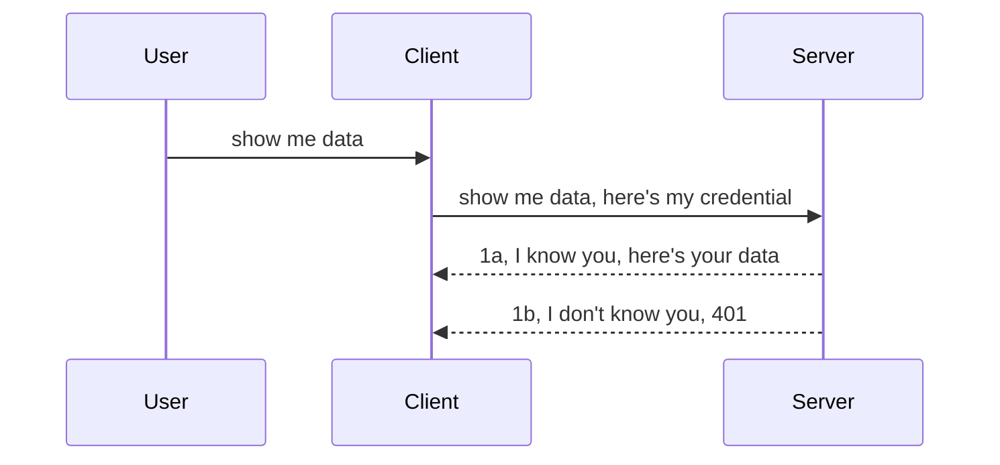

<!--
CO_OP_TRANSLATOR_METADATA:
{
  "original_hash": "5b00b8a8971a07d2d8803be4c9f138f8",
  "translation_date": "2025-10-11T11:54:13+00:00",
  "source_file": "03-GettingStarted/11-simple-auth/README.md",
  "language_code": "et"
}
-->
# Lihtne autentimine

MCP SDK-d toetavad OAuth 2.1 kasutamist, mis on ausalt öeldes üsna keeruline protsess, hõlmates selliseid kontseptsioone nagu autentimisserver, ressursiserver, mandaadi edastamine, koodi hankimine, koodi vahetamine kandjatunnuse vastu, kuni lõpuks pääsete oma ressursiandmetele. Kui te pole OAuthiga harjunud, mis on suurepärane asi rakendamiseks, on hea alustada lihtsama autentimise tasemega ja liikuda järk-järgult parema ja turvalisema lahenduse poole. Sellepärast see peatükk eksisteeribki – et aidata teil liikuda keerukama autentimise suunas.

## Mis on autentimine?

Autentimine tähendab lühidalt identiteedi ja õiguste kontrollimist. Idee seisneb kahes asjas:

- **Autentimine** – protsess, mille käigus otsustatakse, kas lubame inimesel meie "majja" siseneda, st kas tal on õigus olla "siin", ehk kas tal on juurdepääs meie ressursiserverile, kus MCP Serveri funktsioonid asuvad.
- **Autoriseerimine** – protsess, mille käigus otsustatakse, kas kasutajal peaks olema juurdepääs konkreetsetele ressurssidele, mida ta küsib, näiteks tellimustele või toodetele, või kas tal on lubatud sisu lugeda, kuid mitte kustutada, kui tuua teine näide.

## Mandaat: kuidas süsteemile öelda, kes me oleme

Enamik veebiarendajaid hakkab mõtlema mandaadi edastamisele serverile, tavaliselt salajase võtme kaudu, mis näitab, kas neil on lubatud "siin" olla (autentimine). See mandaat on tavaliselt base64 kodeeritud versioon kasutajanimest ja paroolist või API-võtmest, mis unikaalselt identifitseerib konkreetset kasutajat.

See edastatakse päise kaudu nimega "Authorization", näiteks:

```json
{ "Authorization": "secret123" }
```

Seda nimetatakse tavaliselt lihtsaks autentimiseks. Üldine voog toimib järgmiselt:



Nüüd, kui me mõistame, kuidas see voog töötab, kuidas seda rakendada? Enamik veebiservereid toetab kontseptsiooni nimega "middleware" (vahevara), mis on koodilõik, mis töötab päringu osana ja saab mandaate kontrollida. Kui mandaadid on kehtivad, lubatakse päring edasi. Kui mandaadid pole kehtivad, saadakse autentimisviga. Vaatame, kuidas seda rakendada:

**Python**

```python
class AuthMiddleware(BaseHTTPMiddleware):
    async def dispatch(self, request, call_next):

        has_header = request.headers.get("Authorization")
        if not has_header:
            print("-> Missing Authorization header!")
            return Response(status_code=401, content="Unauthorized")

        if not valid_token(has_header):
            print("-> Invalid token!")
            return Response(status_code=403, content="Forbidden")

        print("Valid token, proceeding...")
       
        response = await call_next(request)
        # add any customer headers or change in the response in some way
        return response


starlette_app.add_middleware(CustomHeaderMiddleware)
```

Siin oleme:

- Loonud vahevara nimega `AuthMiddleware`, mille `dispatch` meetodit kutsub veebiserver.
- Lisanud vahevara veebiserverile:

    ```python
    starlette_app.add_middleware(AuthMiddleware)
    ```

- Kirjutanud valideerimisloogika, mis kontrollib, kas Authorization-päis on olemas ja kas edastatud salajane võti on kehtiv:

    ```python
    has_header = request.headers.get("Authorization")
    if not has_header:
        print("-> Missing Authorization header!")
        return Response(status_code=401, content="Unauthorized")

    if not valid_token(has_header):
        print("-> Invalid token!")
        return Response(status_code=403, content="Forbidden")
    ```

    Kui salajane võti on olemas ja kehtiv, lubame päringu edasi, kutsudes `call_next` ja tagastame vastuse.

    ```python
    response = await call_next(request)
    # add any customer headers or change in the response in some way
    return response
    ```

Kuidas see töötab: kui veebipäring tehakse serverile, kutsutakse vahevara ja selle rakenduse põhjal kas lubatakse päring edasi või tagastatakse viga, mis näitab, et kliendil pole lubatud jätkata.

**TypeScript**

Siin loome vahevara populaarse raamistikuga Express ja püüame päringu kinni enne, kui see jõuab MCP Serverini. Kood näeb välja selline:

```typescript
function isValid(secret) {
    return secret === "secret123";
}

app.use((req, res, next) => {
    // 1. Authorization header present?  
    if(!req.headers["Authorization"]) {
        res.status(401).send('Unauthorized');
    }
    
    let token = req.headers["Authorization"];

    // 2. Check validity.
    if(!isValid(token)) {
        res.status(403).send('Forbidden');
    }

   
    console.log('Middleware executed');
    // 3. Passes request to the next step in the request pipeline.
    next();
});
```

Selles koodis:

1. Kontrollime, kas Authorization-päis on üldse olemas; kui ei, saadame 401 vea.
2. Kontrollime mandaadi/tunnuse kehtivust; kui see pole kehtiv, saadame 403 vea.
3. Lõpuks edastame päringu päringupipeline'is ja tagastame küsitud ressursi.

## Harjutus: autentimise rakendamine

Võtame oma teadmised ja proovime seda rakendada. Plaan on järgmine:

Server

- Loo veebiserver ja MCP instants.
- Rakenda serverile vahevara.

Klient 

- Saada veebipäring koos mandaadiga päise kaudu.

### -1- Loo veebiserver ja MCP instants

Esimeses etapis peame looma veebiserveri instantsi ja MCP Serveri.

**Python**

Siin loome MCP Serveri instantsi, Starlette veebirakenduse ja hostime seda uvicorniga.

```python
# creating MCP Server

app = FastMCP(
    name="MCP Resource Server",
    instructions="Resource Server that validates tokens via Authorization Server introspection",
    host=settings["host"],
    port=settings["port"],
    debug=True
)

# creating starlette web app
starlette_app = app.streamable_http_app()

# serving app via uvicorn
async def run(starlette_app):
    import uvicorn
    config = uvicorn.Config(
            starlette_app,
            host=app.settings.host,
            port=app.settings.port,
            log_level=app.settings.log_level.lower(),
        )
    server = uvicorn.Server(config)
    await server.serve()

run(starlette_app)
```

Selles koodis oleme:

- Loonud MCP Serveri.
- Koostanud Starlette veebirakenduse MCP Serverist, `app.streamable_http_app()`.
- Hostinud ja teenindanud veebirakendust uvicorniga `server.serve()`.

**TypeScript**

Siin loome MCP Serveri instantsi.

```typescript
const server = new McpServer({
      name: "example-server",
      version: "1.0.0"
    });

    // ... set up server resources, tools, and prompts ...
```

See MCP Serveri loomine tuleb teha meie POST /mcp marsruudi määratluse sees, nii et võtame ülaltoodud koodi ja liigutame selle järgmiselt:

```typescript
import express from "express";
import { randomUUID } from "node:crypto";
import { McpServer } from "@modelcontextprotocol/sdk/server/mcp.js";
import { StreamableHTTPServerTransport } from "@modelcontextprotocol/sdk/server/streamableHttp.js";
import { isInitializeRequest } from "@modelcontextprotocol/sdk/types.js"

const app = express();
app.use(express.json());

// Map to store transports by session ID
const transports: { [sessionId: string]: StreamableHTTPServerTransport } = {};

// Handle POST requests for client-to-server communication
app.post('/mcp', async (req, res) => {
  // Check for existing session ID
  const sessionId = req.headers['mcp-session-id'] as string | undefined;
  let transport: StreamableHTTPServerTransport;

  if (sessionId && transports[sessionId]) {
    // Reuse existing transport
    transport = transports[sessionId];
  } else if (!sessionId && isInitializeRequest(req.body)) {
    // New initialization request
    transport = new StreamableHTTPServerTransport({
      sessionIdGenerator: () => randomUUID(),
      onsessioninitialized: (sessionId) => {
        // Store the transport by session ID
        transports[sessionId] = transport;
      },
      // DNS rebinding protection is disabled by default for backwards compatibility. If you are running this server
      // locally, make sure to set:
      // enableDnsRebindingProtection: true,
      // allowedHosts: ['127.0.0.1'],
    });

    // Clean up transport when closed
    transport.onclose = () => {
      if (transport.sessionId) {
        delete transports[transport.sessionId];
      }
    };
    const server = new McpServer({
      name: "example-server",
      version: "1.0.0"
    });

    // ... set up server resources, tools, and prompts ...

    // Connect to the MCP server
    await server.connect(transport);
  } else {
    // Invalid request
    res.status(400).json({
      jsonrpc: '2.0',
      error: {
        code: -32000,
        message: 'Bad Request: No valid session ID provided',
      },
      id: null,
    });
    return;
  }

  // Handle the request
  await transport.handleRequest(req, res, req.body);
});

// Reusable handler for GET and DELETE requests
const handleSessionRequest = async (req: express.Request, res: express.Response) => {
  const sessionId = req.headers['mcp-session-id'] as string | undefined;
  if (!sessionId || !transports[sessionId]) {
    res.status(400).send('Invalid or missing session ID');
    return;
  }
  
  const transport = transports[sessionId];
  await transport.handleRequest(req, res);
};

// Handle GET requests for server-to-client notifications via SSE
app.get('/mcp', handleSessionRequest);

// Handle DELETE requests for session termination
app.delete('/mcp', handleSessionRequest);

app.listen(3000);
```

Nüüd näete, kuidas MCP Serveri loomine viidi `app.post("/mcp")` sisse.

Liigume järgmise sammu juurde, kus loome vahevara, et saaksime sissetulevat mandaati valideerida.

### -2- Rakenda serverile vahevara

Järgmine samm on vahevara loomine. Siin loome vahevara, mis otsib mandaati `Authorization` päisest ja valideerib selle. Kui see on aktsepteeritav, liigub päring edasi ja teeb, mida vaja (nt loetleb tööriistu, loeb ressursse või mis iganes MCP funktsionaalsust klient küsis).

**Python**

Vahevara loomiseks peame looma klassi, mis pärib `BaseHTTPMiddleware`. Kaks huvitavat osa on:

- Päring `request`, millest loeme päiseinfo.
- `call_next`, tagasikutse, mida peame kutsuma, kui klient on esitanud mandaadi, mida me aktsepteerime.

Esmalt peame käsitlema juhtumit, kui `Authorization` päis puudub:

```python
has_header = request.headers.get("Authorization")

# no header present, fail with 401, otherwise move on.
if not has_header:
    print("-> Missing Authorization header!")
    return Response(status_code=401, content="Unauthorized")
```

Siin saadame 401 volitamata sõnumi, kuna klient ei suuda autentimist.

Järgmisena, kui mandaat on esitatud, peame kontrollima selle kehtivust järgmiselt:

```python
 if not valid_token(has_header):
    print("-> Invalid token!")
    return Response(status_code=403, content="Forbidden")
```

Pange tähele, kuidas me saadame 403 keelatud sõnumi ülal. Vaatame täisvahevara, mis rakendab kõike, mida ülal mainisime:

```python
class AuthMiddleware(BaseHTTPMiddleware):
    async def dispatch(self, request, call_next):

        has_header = request.headers.get("Authorization")
        if not has_header:
            print("-> Missing Authorization header!")
            return Response(status_code=401, content="Unauthorized")

        if not valid_token(has_header):
            print("-> Invalid token!")
            return Response(status_code=403, content="Forbidden")

        print("Valid token, proceeding...")
        print(f"-> Received {request.method} {request.url}")
        response = await call_next(request)
        response.headers['Custom'] = 'Example'
        return response

```

Suurepärane, aga mis saab `valid_token` funktsioonist? Siin see on:

```python
# DON'T use for production - improve it !!
def valid_token(token: str) -> bool:
    # remove the "Bearer " prefix
    if token.startswith("Bearer "):
        token = token[7:]
        return token == "secret-token"
    return False
```

See peaks ilmselgelt paranema.

OLULINE: Te ei tohiks KUNAGI hoida selliseid salajasi võtmeid koodis. Ideaalis peaksite võrdlusväärtuse hankima andmeallikast või IDP-st (identiteediteenuse pakkuja) või veel parem, laske IDP-l teha valideerimine.

**TypeScript**

Selle rakendamiseks Expressiga peame kutsuma `use` meetodit, mis võtab vastu vahevara funktsioone.

Peame:

- Suhtlema päringu muutujaga, et kontrollida edastatud mandaati `Authorization` omaduses.
- Valideerima mandaadi ja kui see on kehtiv, lubama päringu jätkata, et kliendi MCP päring saaks teha, mida vaja (nt loetleda tööriistu, lugeda ressursse või mis iganes MCP-ga seotud).

Siin kontrollime, kas `Authorization` päis on olemas, ja kui ei, peatame päringu edasiliikumise:

```typescript
if(!req.headers["authorization"]) {
    res.status(401).send('Unauthorized');
    return;
}
```

Kui päist pole üldse saadetud, saate 401 vea.

Järgmisena kontrollime mandaadi kehtivust ja kui see pole kehtiv, peatame päringu, kuid veidi teistsuguse sõnumiga:

```typescript
if(!isValid(token)) {
    res.status(403).send('Forbidden');
    return;
} 
```

Pange tähele, kuidas te nüüd saate 403 vea.

Siin on täiskood:

```typescript
app.use((req, res, next) => {
    console.log('Request received:', req.method, req.url, req.headers);
    console.log('Headers:', req.headers["authorization"]);
    if(!req.headers["authorization"]) {
        res.status(401).send('Unauthorized');
        return;
    }
    
    let token = req.headers["authorization"];

    if(!isValid(token)) {
        res.status(403).send('Forbidden');
        return;
    }  

    console.log('Middleware executed');
    next();
});
```

Oleme seadistanud veebiserveri aktsepteerima vahevara, mis kontrollib mandaati, mida klient meile loodetavasti saadab. Aga mis saab kliendist endast?

### -3- Saada veebipäring koos mandaadiga päise kaudu

Peame tagama, et klient edastab mandaadi päise kaudu. Kuna kasutame MCP klienti, peame välja selgitama, kuidas seda teha.

**Python**

Kliendi jaoks peame edastama päise koos mandaadiga järgmiselt:

```python
# DON'T hardcode the value, have it at minimum in an environment variable or a more secure storage
token = "secret-token"

async with streamablehttp_client(
        url = f"http://localhost:{port}/mcp",
        headers = {"Authorization": f"Bearer {token}"}
    ) as (
        read_stream,
        write_stream,
        session_callback,
    ):
        async with ClientSession(
            read_stream,
            write_stream
        ) as session:
            await session.initialize()
      
            # TODO, what you want done in the client, e.g list tools, call tools etc.
```

Pange tähele, kuidas me täidame `headers` omaduse järgmiselt: `headers = {"Authorization": f"Bearer {token}"}`.

**TypeScript**

Selle lahendamiseks on kaks sammu:

1. Täida konfiguratsiooniobjekt oma mandaadiga.
2. Edasta konfiguratsiooniobjekt transpordile.

```typescript

// DON'T hardcode the value like shown here. At minimum have it as a env variable and use something like dotenv (in dev mode).
let token = "secret123"

// define a client transport option object
let options: StreamableHTTPClientTransportOptions = {
  sessionId: sessionId,
  requestInit: {
    headers: {
      "Authorization": "secret123"
    }
  }
};

// pass the options object to the transport
async function main() {
   const transport = new StreamableHTTPClientTransport(
      new URL(serverUrl),
      options
   );
```

Siin näete, kuidas me pidime looma `options` objekti ja paigutama oma päised `requestInit` omaduse alla.

OLULINE: Kuidas seda siit edasi parandada? Praegusel rakendusel on mõned probleemid. Esiteks, mandaadi edastamine sellisel viisil on üsna riskantne, kui teil pole vähemalt HTTPS-i. Isegi siis võib mandaat varastatud saada, seega vajate süsteemi, kus saate tunnuse hõlpsasti tühistada ja lisada täiendavaid kontrolle, näiteks kust maailmast see pärineb, kas päring toimub liiga sageli (robotilaadne käitumine) jne. Lühidalt, murekohti on palju.

Siiski, väga lihtsate API-de puhul, kus te ei soovi, et keegi teie API-d ilma autentimiseta kutsuks, on see, mida me siin oleme teinud, hea algus.

Sellega seoses proovime turvalisust veidi tugevdada, kasutades standardiseeritud formaati nagu JSON Web Token, tuntud ka kui JWT või "JOT" tunnused.

## JSON Web Tokenid, JWT

Niisiis, proovime parandada mandaadi edastamist. Millised on kohesed parandused, mida saame JWT kasutuselevõtuga?

- **Turvalisuse parandused**. Lihtsa autentimise korral saadate kasutajanime ja parooli base64 kodeeritud tunnusena (või API-võtmena) ikka ja jälle, mis suurendab riski. JWT-ga saadate oma kasutajanime ja parooli ning saate vastutasuks tunnuse, mis on ka ajaliselt piiratud, st see aegub. JWT võimaldab hõlpsasti kasutada peeneteralist juurdepääsukontrolli, kasutades rolle, ulatusi ja õigusi.
- **Olekuvabadus ja skaleeritavus**. JWT-d on iseseisvad, nad kannavad kogu kasutajainfot ja välistavad vajaduse serveripoolse sessioonisalvestuse järele. Tunnust saab ka lokaalselt valideerida.
- **Interoperatiivsus ja föderatsioon**. JWT-d on Open ID Connecti keskne osa ja neid kasutatakse tuntud identiteediteenuse pakkujatega nagu Entra ID, Google Identity ja Auth0. Need võimaldavad ka kasutada ühekordset sisselogimist ja palju muud, muutes selle ettevõtte tasemel lahenduseks.
- **Modulaarsus ja paindlikkus**. JWT-d saab kasutada ka API Gatewaydega nagu Azure API Management, NGINX ja rohkem. Samuti toetavad need autentimissenaariume ja serveritevahelist suhtlust, sealhulgas impersonatsiooni ja delegatsiooni.
- **Jõudlus ja vahemällu salvestamine**. JWT-d saab dekodeerimise järel vahemällu salvestada, mis vähendab vajadust parsida. See aitab eriti suure liiklusega rakenduste puhul, kuna see parandab läbilaskevõimet ja vähendab koormust teie valitud infrastruktuurile.
- **Täiustatud funktsioonid**. Samuti toetavad introspektsiooni (kehtivuse kontroll serveris) ja tühistamist (tunnuse kehtetuks muutmine).

Kõigi nende eelistega vaatame, kuidas saame oma rakendust järgmisele tasemele viia.

## Lihtsa autentimise muutmine JWT-ks

Niisiis, muudatused, mida peame tegema, on kõrgel tasemel järgmised:

- **Õpi looma JWT tunnust** ja valmista see ette kliendilt serverile saatmiseks.
- **Valideeri JWT tunnus**, ja kui see on kehtiv, anna kliendile juurdepääs meie ressurssidele.
- **Turvaline tunnuse salvestamine**. Kuidas seda tunnust salvestada.
- **Kaitse marsruute**. Peame kaitsma marsruute, meie puhul MCP funktsioone ja konkreetseid marsruute.
- **Lisa värskendustunnused**. Tagame, et loome lühiajalised tunnused, kuid pikaajalised värskendustunnused, mida saab kasutada uute tunnuste hankimiseks, kui need aeguvad. Samuti tagame, et on olemas värskenduse lõpp-punkt ja rotatsioonistrateegia.

### -1- JWT tunnuse loomine

Esiteks, JWT tunnusel on järgmised osad:

- **päis**, kasutatav algoritm ja tunnuse tüüp.
- **sisu**, väited, nagu sub (kasutaja või üksus, mida tunnus esindab. Autentimise korral on see tavaliselt kasutaja ID), exp (millal see aegub), role (roll).
- **allkiri**, allkirjastatud salajase võtme või privaatvõtmega.

Selleks peame koostama päise, sisu ja kodeeritud tunnuse.

**Python**

```python

import jwt
import jwt
from jwt.exceptions import ExpiredSignatureError, InvalidTokenError
import datetime

# Secret key used to sign the JWT
secret_key = 'your-secret-key'

header = {
    "alg": "HS256",
    "typ": "JWT"
}

# the user info andits claims and expiry time
payload = {
    "sub": "1234567890",               # Subject (user ID)
    "name": "User Userson",                # Custom claim
    "admin": True,                     # Custom claim
    "iat": datetime.datetime.utcnow(),# Issued at
    "exp": datetime.datetime.utcnow() + datetime.timedelta(hours=1)  # Expiry
}

# encode it
encoded_jwt = jwt.encode(payload, secret_key, algorithm="HS256", headers=header)
```

Ülaltoodud koodis oleme:

- Määratlenud päise, kasutades algoritmi HS256 ja tüübiks JWT.
- Koostanud sisu, mis sisaldab subjekti või kasutaja ID-d, kasutajanime, rolli, millal see väljastati ja millal see aegub, rakendades seega ajaliselt piiratud aspekti, mida varem mainisime.

**TypeScript**

Siin vajame mõningaid sõltuvusi, mis aitavad meil JWT tunnust koostada.

Sõltuvused

```sh

npm install jsonwebtoken
npm install --save-dev @types/jsonwebtoken
```

Nüüd, kui see on paigas, loome päise, sisu ja selle kaudu kodeeritud tunnuse.

```typescript
import jwt from 'jsonwebtoken';

const secretKey = 'your-secret-key'; // Use env vars in production

// Define the payload
const payload = {
  sub: '1234567890',
  name: 'User usersson',
  admin: true,
  iat: Math.floor(Date.now() / 1000), // Issued at
  exp: Math.floor(Date.now() / 1000) + 60 * 60 // Expires in 1 hour
};

// Define the header (optional, jsonwebtoken sets defaults)
const header = {
  alg: 'HS256',
  typ: 'JWT'
};

// Create the token
const token = jwt.sign(payload, secretKey, {
  algorithm: 'HS256',
  header: header
});

console.log('JWT:', token);
```

See tunnus on:

Allkirjastatud HS256-ga
Kehtiv 1 tund
Sisaldab väiteid nagu sub, name, admin, iat ja exp.

### -2- Tunnuse valideerimine

Peame ka tunnust valideerima, seda tuleks teha serveris, et tagada, et klient saadab meile tegelikult kehtiva tunnuse. Siin tuleks teha mitmeid kontrolle, alates selle struktuuri valideerimisest kuni selle kehtivuse kontrollimiseni. Soovitatav on lisada täiendavaid kontrolle, et näha, kas kasutaja on teie süsteemis ja palju muud.

Tunnuse valideerimiseks peame selle dekodeerima, et saaksime seda lugeda ja seejärel alustada selle kehtivuse kontrollimist:

**Python**

```python

# Decode and verify the JWT
try:
    decoded = jwt.decode(token, secret_key, algorithms=["HS256"])
    print("✅ Token is valid.")
    print("Decoded claims:")
    for key, value in decoded.items():
        print(f"  {key}: {value}")
except ExpiredSignatureError:
    print("❌ Token has expired.")
except InvalidTokenError as e:
    print(f"❌ Invalid token: {e}")

```

Selles koodis kutsume `jwt.decode`, kasutades tunnust, salajast võtit ja valitud algoritmi sisendina. Pange tähele, kuidas me kasutame try-catch konstruktsiooni, kuna ebaõnnestunud valideerimine põhjustab vea.

**TypeScript**

Siin peame kutsuma `jwt.verify`, et saada dekodeeritud versioon tunnusest, mida saame edasi analüüsida. Kui see kõne ebaõnnestub, tähendab see, et tunnuse struktuur on vale või see pole enam kehtiv.

```typescript

try {
  const decoded = jwt.verify(token, secretKey);
  console.log('Decoded Payload:', decoded);
} catch (err) {
  console.error('Token verification failed:', err);
}
```

MÄRKUS: nagu varem mainitud, peaksime tegema täiendavaid kontrolle, et tagada, et see tunnus viitab kasutajale meie süsteemis ja et kasutajal on õigused, mida ta väidab omavat.
Järgmine, vaatame rollipõhist juurdepääsukontrolli, tuntud ka kui RBAC.

## Rollipõhise juurdepääsukontrolli lisamine

Idee seisneb selles, et tahame väljendada, et erinevatel rollidel on erinevad õigused. Näiteks eeldame, et administraator saab teha kõike, tavaline kasutaja saab lugeda/kirjutada ja külaline saab ainult lugeda. Seega, siin on mõned võimalikud õigustasemed:

- Admin.Write 
- User.Read
- Guest.Read

Vaatame, kuidas sellist kontrolli saab rakendada vahendustarkvara abil. Vahendustarkvara saab lisada nii konkreetsetele marsruutidele kui ka kõigile marsruutidele.

**Python**

```python
from starlette.middleware.base import BaseHTTPMiddleware
from starlette.responses import JSONResponse
import jwt

# DON'T have the secret in the code like, this is for demonstration purposes only. Read it from a safe place.
SECRET_KEY = "your-secret-key" # put this in env variable
REQUIRED_PERMISSION = "User.Read"

class JWTPermissionMiddleware(BaseHTTPMiddleware):
    async def dispatch(self, request, call_next):
        auth_header = request.headers.get("Authorization")
        if not auth_header or not auth_header.startswith("Bearer "):
            return JSONResponse({"error": "Missing or invalid Authorization header"}, status_code=401)

        token = auth_header.split(" ")[1]
        try:
            decoded = jwt.decode(token, SECRET_KEY, algorithms=["HS256"])
        except jwt.ExpiredSignatureError:
            return JSONResponse({"error": "Token expired"}, status_code=401)
        except jwt.InvalidTokenError:
            return JSONResponse({"error": "Invalid token"}, status_code=401)

        permissions = decoded.get("permissions", [])
        if REQUIRED_PERMISSION not in permissions:
            return JSONResponse({"error": "Permission denied"}, status_code=403)

        request.state.user = decoded
        return await call_next(request)


```

Vahendustarkvara lisamiseks on mitu erinevat viisi, näiteks:

```python

# Alt 1: add middleware while constructing starlette app
middleware = [
    Middleware(JWTPermissionMiddleware)
]

app = Starlette(routes=routes, middleware=middleware)

# Alt 2: add middleware after starlette app is a already constructed
starlette_app.add_middleware(JWTPermissionMiddleware)

# Alt 3: add middleware per route
routes = [
    Route(
        "/mcp",
        endpoint=..., # handler
        middleware=[Middleware(JWTPermissionMiddleware)]
    )
]
```

**TypeScript**

Me saame kasutada `app.use` ja vahendustarkvara, mis käivitub kõigi päringute puhul.

```typescript
app.use((req, res, next) => {
    console.log('Request received:', req.method, req.url, req.headers);
    console.log('Headers:', req.headers["authorization"]);

    // 1. Check if authorization header has been sent

    if(!req.headers["authorization"]) {
        res.status(401).send('Unauthorized');
        return;
    }
    
    let token = req.headers["authorization"];

    // 2. Check if token is valid
    if(!isValid(token)) {
        res.status(403).send('Forbidden');
        return;
    }  

    // 3. Check if token user exist in our system
    if(!isExistingUser(token)) {
        res.status(403).send('Forbidden');
        console.log("User does not exist");
        return;
    }
    console.log("User exists");

    // 4. Verify the token has the right permissions
    if(!hasScopes(token, ["User.Read"])){
        res.status(403).send('Forbidden - insufficient scopes');
    }

    console.log("User has required scopes");

    console.log('Middleware executed');
    next();
});

```

Vahendustarkvara saab teha mitmeid asju, mida ta PEAKS tegema, nimelt:

1. Kontrollida, kas autoriseerimispealkiri on olemas.
2. Kontrollida, kas token on kehtiv. Me kutsume `isValid`, mis on meetod, mille kirjutasime JWT tokeni terviklikkuse ja kehtivuse kontrollimiseks.
3. Kontrollida, kas kasutaja eksisteerib meie süsteemis. Seda peaksime kontrollima.

   ```typescript
    // users in DB
   const users = [
     "user1",
     "User usersson",
   ]

   function isExistingUser(token) {
     let decodedToken = verifyToken(token);

     // TODO, check if user exists in DB
     return users.includes(decodedToken?.name || "");
   }
   ```

   Ülal oleme loonud väga lihtsa `users` nimekirja, mis peaks tegelikult olema andmebaasis.

4. Lisaks peaksime kontrollima, kas tokenil on õiged õigused.

   ```typescript
   if(!hasScopes(token, ["User.Read"])){
        res.status(403).send('Forbidden - insufficient scopes');
   }
   ```

   Ülaltoodud koodis vahendustarkvarast kontrollime, et token sisaldab User.Read õigust, kui mitte, saadame 403 vea. Allpool on `hasScopes` abimeetod.

   ```typescript
   function hasScopes(scope: string, requiredScopes: string[]) {
     let decodedToken = verifyToken(scope);
    return requiredScopes.every(scope => decodedToken?.scopes.includes(scope));
  }
   ```

Have a think which additional checks you should be doing, but these are the absolute minimum of checks you should be doing.

Using Express as a web framework is a common choice. There are helpers library when you use JWT so you can write less code.

- `express-jwt`, helper library that provides a middleware that helps decode your token.
- `express-jwt-permissions`, this provides a middleware `guard` that helps check if a certain permission is on the token.

Here's what these libraries can look like when used:

```typescript
const express = require('express');
const jwt = require('express-jwt');
const guard = require('express-jwt-permissions')();

const app = express();
const secretKey = 'your-secret-key'; // put this in env variable

// Decode JWT and attach to req.user
app.use(jwt({ secret: secretKey, algorithms: ['HS256'] }));

// Check for User.Read permission
app.use(guard.check('User.Read'));

// multiple permissions
// app.use(guard.check(['User.Read', 'Admin.Access']));

app.get('/protected', (req, res) => {
  res.json({ message: `Welcome ${req.user.name}` });
});

// Error handler
app.use((err, req, res, next) => {
  if (err.code === 'permission_denied') {
    return res.status(403).send('Forbidden');
  }
  next(err);
});

```

Nüüd, kui olete näinud, kuidas vahendustarkvara saab kasutada nii autentimiseks kui ka autoriseerimiseks, mis saab MCP-st? Kas see muudab, kuidas me autentimist teeme? Uurime seda järgmises osas.

### -3- RBAC-i lisamine MCP-le

Olete seni näinud, kuidas RBAC-i saab lisada vahendustarkvara kaudu, kuid MCP jaoks pole lihtsat viisi lisada RBAC-i iga MCP funktsiooni jaoks. Mida me siis teeme? Peame lihtsalt lisama koodi, mis kontrollib, kas kliendil on õigused konkreetse tööriista kasutamiseks:

Teil on mitu valikut, kuidas saavutada RBAC iga funktsiooni jaoks, siin on mõned:

- Lisage kontroll iga tööriista, ressursi, prompti jaoks, kus peate kontrollima õigustaset.

   **Python**

   ```python
   @tool()
   def delete_product(id: int):
      try:
          check_permissions(role="Admin.Write", request)
      catch:
        pass # client failed authorization, raise authorization error
   ```

   **TypeScript**

   ```typescript
   server.registerTool(
    "delete-product",
    {
      title: Delete a product",
      description: "Deletes a product",
      inputSchema: { id: z.number() }
    },
    async ({ id }) => {
      
      try {
        checkPermissions("Admin.Write", request);
        // todo, send id to productService and remote entry
      } catch(Exception e) {
        console.log("Authorization error, you're not allowed");  
      }

      return {
        content: [{ type: "text", text: `Deletected product with id ${id}` }]
      };
    }
   );
   ```


- Kasutage täiustatud serveri lähenemist ja päringukäsitlejaid, et minimeerida kohtade arvu, kus peate kontrolli tegema.

   **Python**

   ```python
   
   tool_permission = {
      "create_product": ["User.Write", "Admin.Write"],
      "delete_product": ["Admin.Write"]
   }

   def has_permission(user_permissions, required_permissions) -> bool:
      # user_permissions: list of permissions the user has
      # required_permissions: list of permissions required for the tool
      return any(perm in user_permissions for perm in required_permissions)

   @server.call_tool()
   async def handle_call_tool(
     name: str, arguments: dict[str, str] | None
   ) -> list[types.TextContent]:
    # Assume request.user.permissions is a list of permissions for the user
     user_permissions = request.user.permissions
     required_permissions = tool_permission.get(name, [])
     if not has_permission(user_permissions, required_permissions):
        # Raise error "You don't have permission to call tool {name}"
        raise Exception(f"You don't have permission to call tool {name}")
     # carry on and call tool
     # ...
   ```   
   

   **TypeScript**

   ```typescript
   function hasPermission(userPermissions: string[], requiredPermissions: string[]): boolean {
       if (!Array.isArray(userPermissions) || !Array.isArray(requiredPermissions)) return false;
       // Return true if user has at least one required permission
       
       return requiredPermissions.some(perm => userPermissions.includes(perm));
   }
  
   server.setRequestHandler(CallToolRequestSchema, async (request) => {
      const { params: { name } } = request;
  
      let permissions = request.user.permissions;
  
      if (!hasPermission(permissions, toolPermissions[name])) {
         return new Error(`You don't have permission to call ${name}`);
      }
  
      // carry on..
   });
   ```

   Märkus: peate tagama, et teie vahendustarkvara määrab dekodeeritud tokeni päringu `user` omadusele, et ülaltoodud kood oleks lihtne.

### Kokkuvõte

Nüüd, kui arutasime, kuidas lisada RBAC-i üldiselt ja MCP jaoks konkreetselt, on aeg proovida ise turvalisust rakendada, et veenduda, et mõistsite esitatud kontseptsioone.

## Ülesanne 1: Ehitage MCP server ja MCP klient, kasutades põhiautentimist

Siin rakendate õpitut, saates mandaate pealkirjade kaudu.

## Lahendus 1

[Lahendus 1](./code/basic/README.md)

## Ülesanne 2: Täiendage ülesande 1 lahendust, et kasutada JWT-d

Võtke esimene lahendus, kuid seekord täiustame seda.

Põhiautentimise asemel kasutame JWT-d.

## Lahendus 2

[Lahendus 2](./solution/jwt-solution/README.md)

## Väljakutse

Lisage RBAC iga tööriista jaoks, nagu kirjeldatud jaotises "RBAC-i lisamine MCP-le".

## Kokkuvõte

Loodetavasti õppisite selles peatükis palju, alates turvalisuse puudumisest kuni põhitõdede turvalisuseni, JWT-ni ja kuidas seda MCP-le lisada.

Oleme loonud tugeva aluse kohandatud JWT-dega, kuid kui me skaleerime, liigume standardipõhise identiteedimudeli poole. IdP nagu Entra või Keycloak kasutuselevõtt võimaldab meil delegeerida tokenite väljastamise, valideerimise ja elutsükli haldamise usaldusväärsele platvormile — vabastades meid rakenduse loogika ja kasutajakogemuse arendamiseks.

Selleks on meil [edasijõudnute peatükk Entrast](../../05-AdvancedTopics/mcp-security-entra/README.md)

---

**Lahtiütlus**:  
See dokument on tõlgitud AI tõlketeenuse [Co-op Translator](https://github.com/Azure/co-op-translator) abil. Kuigi püüame tagada täpsust, palume arvestada, et automaatsed tõlked võivad sisaldada vigu või ebatäpsusi. Algne dokument selle algses keeles tuleks pidada autoriteetseks allikaks. Olulise teabe puhul soovitame kasutada professionaalset inimtõlget. Me ei vastuta selle tõlke kasutamisest tulenevate arusaamatuste või valesti tõlgenduste eest.