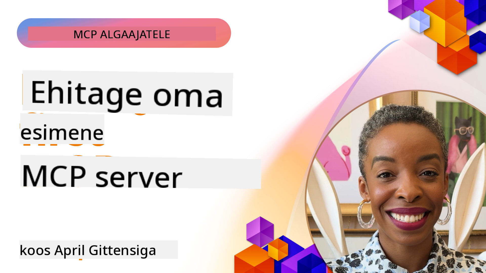

<!--
CO_OP_TRANSLATOR_METADATA:
{
  "original_hash": "f400d87053221363769113c24f117248",
  "translation_date": "2025-10-11T11:29:10+00:00",
  "source_file": "03-GettingStarted/README.md",
  "language_code": "et"
}
-->
## Alustamine  

_(Klõpsa ülaloleval pildil, et vaadata selle õppetunni videot)_

See osa koosneb mitmest õppetunnist:

- **1 Sinu esimene server**, esimeses õppetunnis õpid, kuidas luua oma esimene server ja uurida seda inspektori tööriistaga, mis on väärtuslik viis serveri testimiseks ja silumiseks, [õppetunnini](01-first-server/README.md)

- **2 Klient**, selles õppetunnis õpid, kuidas kirjutada klienti, mis saab serveriga ühendust luua, [õppetunnini](02-client/README.md)

- **3 Klient koos LLM-iga**, veelgi parem viis kliendi kirjutamiseks on lisada sellele LLM, et see saaks serveriga "läbirääkimisi pidada", mida teha, [õppetunnini](03-llm-client/README.md)

- **4 Serveri kasutamine GitHub Copilot Agent režiimis Visual Studio Code'is**. Siin vaatame, kuidas käivitada MCP serverit Visual Studio Code'i sees, [õppetunnini](04-vscode/README.md)

- **5 stdio Transport Server** stdio transport on praeguses spetsifikatsioonis soovitatav standard MCP serveri ja kliendi vaheliseks suhtluseks, pakkudes turvalist alamsüsteemipõhist kommunikatsiooni [õppetunnini](05-stdio-server/README.md)

- **6 HTTP voogedastus MCP-ga (Streamable HTTP)**. Õpi kaasaegse HTTP voogedastuse, edenemisteavituste ja skaleeritavate reaalajas MCP serverite ja klientide rakendamise kohta Streamable HTTP abil. [õppetunnini](06-http-streaming/README.md)

- **7 AI tööriistakomplekti kasutamine VSCode'is** MCP klientide ja serverite tarbimiseks ja testimiseks [õppetunnini](07-aitk/README.md)

- **8 Testimine**. Siin keskendume eriti sellele, kuidas testida serverit ja klienti erinevatel viisidel, [õppetunnini](08-testing/README.md)

- **9 Juurutamine**. Selles peatükis vaatame erinevaid viise MCP lahenduste juurutamiseks, [õppetunnini](09-deployment/README.md)

- **10 Täiustatud serveri kasutamine**. See peatükk käsitleb serveri täiustatud kasutamist, [õppetunnini](./10-advanced/README.md)

- **11 Autentimine**. See peatükk käsitleb lihtsa autentimise lisamist, alates Basic Authist kuni JWT ja RBAC-i kasutamiseni. Soovitame alustada siit ja seejärel vaadata Täiustatud teemasid 5. peatükis ning rakendada täiendavat turvalisuse tugevdamist 2. peatüki soovituste järgi, [õppetunnini](./11-simple-auth/README.md)

Model Context Protocol (MCP) on avatud protokoll, mis standardiseerib, kuidas rakendused pakuvad konteksti LLM-idele. MCP-d võib mõelda kui USB-C porti AI rakenduste jaoks - see pakub standardiseeritud viisi AI mudelite ühendamiseks erinevate andmeallikate ja tööriistadega.

## Õpieesmärgid

Selle õppetunni lõpuks oskad:

- Seadistada MCP arenduskeskkondi C#, Java, Python, TypeScripti ja JavaScripti jaoks
- Luua ja juurutada põhifunktsioonidega MCP servereid (ressursid, käsud ja tööriistad)
- Luua hostrakendusi, mis ühenduvad MCP serveritega
- Testida ja siluda MCP rakendusi
- Mõista levinud seadistusprobleeme ja nende lahendusi
- Ühendada oma MCP rakendusi populaarsete LLM teenustega

## MCP keskkonna seadistamine

Enne MCP-ga töötamise alustamist on oluline ette valmistada oma arenduskeskkond ja mõista põhitöövoogu. See osa juhendab sind algseadistuse sammude kaudu, et tagada MCP-ga sujuv algus.

### Eeltingimused

Enne MCP arendusse sukeldumist veendu, et sul oleks:

- **Arenduskeskkond**: Valitud keele jaoks (C#, Java, Python, TypeScript või JavaScript)
- **IDE/Redaktor**: Visual Studio, Visual Studio Code, IntelliJ, Eclipse, PyCharm või mõni kaasaegne koodiredaktor
- **Paketihaldurid**: NuGet, Maven/Gradle, pip või npm/yarn
- **API võtmed**: AI teenuste jaoks, mida plaanid kasutada oma hostrakendustes

### Ametlikud SDK-d

Järgmistes peatükkides näed lahendusi, mis on ehitatud Pythonis, TypeScriptis, Javas ja .NET-is. Siin on kõik ametlikult toetatud SDK-d.

MCP pakub ametlikke SDK-sid mitmele keelele:
- [C# SDK](https://github.com/modelcontextprotocol/csharp-sdk) - Hooldatud koostöös Microsoftiga
- [Java SDK](https://github.com/modelcontextprotocol/java-sdk) - Hooldatud koostöös Spring AI-ga
- [TypeScript SDK](https://github.com/modelcontextprotocol/typescript-sdk) - Ametlik TypeScripti rakendus
- [Python SDK](https://github.com/modelcontextprotocol/python-sdk) - Ametlik Pythoni rakendus
- [Kotlin SDK](https://github.com/modelcontextprotocol/kotlin-sdk) - Ametlik Kotlin rakendus
- [Swift SDK](https://github.com/modelcontextprotocol/swift-sdk) - Hooldatud koostöös Loopwork AI-ga
- [Rust SDK](https://github.com/modelcontextprotocol/rust-sdk) - Ametlik Rusti rakendus

## Olulised punktid

- MCP arenduskeskkonna seadistamine on lihtne keelespetsiifiliste SDK-dega
- MCP serverite loomine hõlmab tööriistade loomist ja registreerimist selgete skeemidega
- MCP kliendid ühenduvad serverite ja mudelitega, et kasutada laiendatud võimalusi
- Testimine ja silumine on usaldusväärsete MCP rakenduste jaoks hädavajalik
- Juurutamisvõimalused ulatuvad kohalikust arendusest pilvepõhiste lahendusteni

## Harjutamine

Meil on harjutuste komplekt, mis täiendab kõigi selle osa peatükkide ülesandeid. Lisaks on igal peatükil oma harjutused ja ülesanded.

- [Java kalkulaator](./samples/java/calculator/README.md)
- [.Net kalkulaator](../../../03-GettingStarted/samples/csharp)
- [JavaScript kalkulaator](./samples/javascript/README.md)
- [TypeScript kalkulaator](./samples/typescript/README.md)
- [Python kalkulaator](../../../03-GettingStarted/samples/python)

## Täiendavad ressursid

- [Ehita agendid Model Context Protocoli abil Azure'is](https://learn.microsoft.com/azure/developer/ai/intro-agents-mcp)
- [Kaug-MCP Azure Container Appsiga (Node.js/TypeScript/JavaScript)](https://learn.microsoft.com/samples/azure-samples/mcp-container-ts/mcp-container-ts/)
- [.NET OpenAI MCP Agent](https://learn.microsoft.com/samples/azure-samples/openai-mcp-agent-dotnet/openai-mcp-agent-dotnet/)

## Mis edasi

Järgmine: [Esimese MCP serveri loomine](01-first-server/README.md)

---

**Lahtiütlus**:  
See dokument on tõlgitud, kasutades AI tõlketeenust [Co-op Translator](https://github.com/Azure/co-op-translator). Kuigi püüame tagada täpsust, palun arvestage, et automaatsed tõlked võivad sisaldada vigu või ebatäpsusi. Algne dokument selle algkeeles tuleks lugeda autoriteetseks allikaks. Olulise teabe puhul on soovitatav kasutada professionaalset inimtõlget. Me ei vastuta selle tõlke kasutamisest tulenevate arusaamatuste või valede tõlgenduste eest.