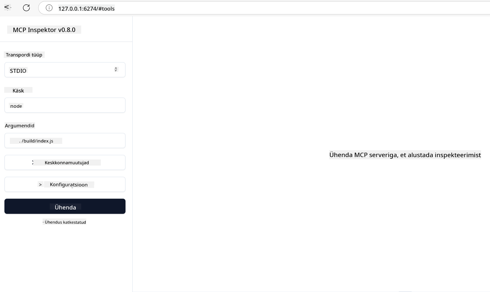

<!--
CO_OP_TRANSLATOR_METADATA:
{
  "original_hash": "83efa75a69bc831277263a6f1ae53669",
  "translation_date": "2025-10-11T13:01:07+00:00",
  "source_file": "04-PracticalImplementation/README.md",
  "language_code": "et"
}
-->
# Praktiline Rakendamine

[](https://youtu.be/vCN9-mKBDfQ)

_(Klõpsake ülaloleval pildil, et vaadata selle õppetunni videot)_

Praktiline rakendamine on koht, kus Model Context Protocol (MCP) jõud muutub käegakatsutavaks. Kuigi MCP teooria ja arhitektuuri mõistmine on oluline, ilmneb tõeline väärtus siis, kui rakendate neid kontseptsioone, et luua, testida ja juurutada lahendusi, mis lahendavad reaalseid probleeme. See peatükk ühendab kontseptuaalse teadmise ja praktilise arenduse, juhendades teid MCP-põhiste rakenduste elluviimise protsessis.

Olenemata sellest, kas arendate intelligentseid assistente, integreerite tehisintellekti äriprotsessidesse või loote kohandatud tööriistu andmetöötluseks, pakub MCP paindlikku alust. Selle keeleagnostiline disain ja ametlikud SDK-d populaarsetele programmeerimiskeeltele muudavad selle kättesaadavaks paljudele arendajatele. Kasutades neid SDK-sid, saate kiiresti prototüüpida, iteratsioonida ja skaleerida oma lahendusi erinevatel platvormidel ja keskkondades.

Järgmistes jaotistes leiate praktilisi näiteid, näidiskoodi ja juurutusstrateegiaid, mis näitavad, kuidas MCP-d rakendada C#, Java Springiga, TypeScripti, JavaScripti ja Pythoniga. Samuti õpite, kuidas MCP servereid siluda ja testida, hallata API-sid ning juurutada lahendusi pilve, kasutades Azure'i. Need praktilised ressursid on loodud teie õppimise kiirendamiseks ja aitavad teil enesekindlalt luua tugevaid, tootmisvalmis MCP rakendusi.

## Ülevaade

See õppetund keskendub MCP rakendamise praktilistele aspektidele mitmes programmeerimiskeeles. Uurime, kuidas kasutada MCP SDK-sid C#, Java Springiga, TypeScripti, JavaScripti ja Pythoniga, et luua tugevaid rakendusi, siluda ja testida MCP servereid ning luua korduvkasutatavaid ressursse, viipasid ja tööriistu.

## Õpieesmärgid

Selle õppetunni lõpuks suudate:

- Rakendada MCP lahendusi, kasutades ametlikke SDK-sid erinevates programmeerimiskeeltes
- Süsteemselt siluda ja testida MCP servereid
- Luua ja kasutada serveri funktsioone (Ressursid, Viipad ja Tööriistad)
- Kavandada tõhusaid MCP töövooge keerukate ülesannete jaoks
- Optimeerida MCP rakendusi jõudluse ja töökindluse jaoks

## Ametlikud SDK ressursid

Model Context Protocol pakub ametlikke SDK-sid mitmele keelele:

- [C# SDK](https://github.com/modelcontextprotocol/csharp-sdk)
- [Java Springiga SDK](https://github.com/modelcontextprotocol/java-sdk) **Märkus:** vajab sõltuvust [Project Reactor](https://projectreactor.io). (Vaata [arutelu teemat 246](https://github.com/orgs/modelcontextprotocol/discussions/246).)
- [TypeScript SDK](https://github.com/modelcontextprotocol/typescript-sdk)
- [Python SDK](https://github.com/modelcontextprotocol/python-sdk)
- [Kotlin SDK](https://github.com/modelcontextprotocol/kotlin-sdk)

## Töö MCP SDK-dega

See jaotis pakub praktilisi näiteid MCP rakendamisest mitmes programmeerimiskeeles. Näidiskoodi leiate `samples` kataloogist, mis on organiseeritud keele järgi.

### Saadaval olevad näited

Repo sisaldab [näidisrakendusi](../../../04-PracticalImplementation/samples) järgmistes keeltes:

- [C#](./samples/csharp/README.md)
- [Java Springiga](./samples/java/containerapp/README.md)
- [TypeScript](./samples/typescript/README.md)
- [JavaScript](./samples/javascript/README.md)
- [Python](./samples/python/README.md)

Iga näidis demonstreerib MCP põhikontseptsioone ja rakendusmustreid konkreetse keele ja ökosüsteemi jaoks.

## Põhilised serveri funktsioonid

MCP serverid võivad rakendada mis tahes kombinatsiooni järgmistest funktsioonidest:

### Ressursid

Ressursid pakuvad konteksti ja andmeid, mida kasutaja või AI mudel saab kasutada:

- Dokumendirepositooriumid
- Teadmistebaasid
- Struktureeritud andmeallikad
- Failisüsteemid

### Viipad

Viipad on kasutajatele mõeldud mallitud sõnumid ja töövood:

- Eelmääratletud vestlusmallid
- Juhendatud interaktsioonimustrid
- Spetsialiseeritud dialoogistruktuurid

### Tööriistad

Tööriistad on funktsioonid, mida AI mudel saab täita:

- Andmetöötlusvahendid
- Väliste API-de integreerimine
- Arvutusvõimalused
- Otsingufunktsioonid

## Näidisrakendused: C# rakendus

Ametlik C# SDK repo sisaldab mitmeid näidisrakendusi, mis demonstreerivad MCP erinevaid aspekte:

- **Lihtne MCP klient**: Lihtne näide, kuidas luua MCP klienti ja kutsuda tööriistu
- **Lihtne MCP server**: Minimaalne serveri rakendus koos põhilise tööriistade registreerimisega
- **Täiustatud MCP server**: Täisfunktsionaalne server koos tööriistade registreerimise, autentimise ja veakäsitlusega
- **ASP.NET integratsioon**: Näited ASP.NET Core'iga integreerimisest
- **Tööriistade rakendusmustrid**: Erinevad mustrid tööriistade rakendamiseks erineva keerukusega

C# MCP SDK on eelvaates ja API-d võivad muutuda. Uuendame pidevalt seda blogi, kui SDK areneb.

### Põhifunktsioonid

- [C# MCP Nuget ModelContextProtocol](https://www.nuget.org/packages/ModelContextProtocol)
- Oma [esimese MCP serveri loomine](https://devblogs.microsoft.com/dotnet/build-a-model-context-protocol-mcp-server-in-csharp/).

Täielike C# rakenduse näidiste jaoks külastage [ametlikku C# SDK näidiste repo](https://github.com/modelcontextprotocol/csharp-sdk)

## Näidisrakendus: Java Springiga rakendus

Java Springiga SDK pakub tugevaid MCP rakendusvõimalusi ettevõtte tasemel funktsioonidega.

### Põhifunktsioonid

- Spring Framework integratsioon
- Tugev tüübikindlus
- Reaktiivse programmeerimise tugi
- Põhjalik veakäsitlus

Täieliku Java Springiga rakenduse näidise jaoks vaadake [Java Springiga näidist](samples/java/containerapp/README.md) näidiste kataloogis.

## Näidisrakendus: JavaScripti rakendus

JavaScripti SDK pakub kerget ja paindlikku lähenemist MCP rakendamisele.

### Põhifunktsioonid

- Node.js ja brauseri tugi
- Lubadustel põhinev API
- Lihtne integratsioon Expressi ja teiste raamistikudega
- WebSocketi tugi voogesituseks

Täieliku JavaScripti rakenduse näidise jaoks vaadake [JavaScripti näidist](samples/javascript/README.md) näidiste kataloogis.

## Näidisrakendus: Pythoni rakendus

Pythoni SDK pakub Pythonile omast lähenemist MCP rakendamisele, suurepärase ML raamistikute integreerimisega.

### Põhifunktsioonid

- Async/await tugi asyncio abil
- FastAPI integratsioon
- Lihtne tööriistade registreerimine
- Loomulik integratsioon populaarsete ML teekidega

Täieliku Pythoni rakenduse näidise jaoks vaadake [Pythoni näidist](samples/python/README.md) näidiste kataloogis.

## API haldamine

Azure API Management on suurepärane lahendus MCP serverite turvamiseks. Idee on paigutada Azure API Management instants MCP serveri ette ja lasta sellel hallata funktsioone, mida tõenäoliselt vajate, nagu:

- kiiruse piiramine
- tokenite haldamine
- jälgimine
- koormuse tasakaalustamine
- turvalisus

### Azure'i näidis

Siin on Azure'i näidis, mis teeb täpselt seda, st [MCP serveri loomine ja selle turvamine Azure API Managementiga](https://github.com/Azure-Samples/remote-mcp-apim-functions-python).

Vaadake, kuidas autoriseerimisvoog toimub alloleval pildil:


Eelneval pildil toimub järgnev:

- Autentimine/autoriseerimine toimub Microsoft Entra abil.
- Azure API Management toimib väravana ja kasutab poliitikaid liikluse suunamiseks ja haldamiseks.
- Azure Monitor logib kõik päringud edasiseks analüüsiks.

#### Autoriseerimisvoog

Vaatame autoriseerimisvoogu üksikasjalikumalt:


#### MCP autoriseerimise spetsifikatsioon

Lisateavet [MCP autoriseerimise spetsifikatsiooni](https://modelcontextprotocol.io/specification/2025-03-26/basic/authorization#2-10-third-party-authorization-flow) kohta.

## Kaug-MCP serveri juurutamine Azure'i

Vaatame, kas saame juurutada varem mainitud näidise:

1. Klooni repo

    ```bash
    git clone https://github.com/Azure-Samples/remote-mcp-apim-functions-python.git
    cd remote-mcp-apim-functions-python
    ```

1. Registreeri `Microsoft.App` ressursipakkuja.

   - Kui kasutate Azure CLI-d, käivitage `az provider register --namespace Microsoft.App --wait`.
   - Kui kasutate Azure PowerShelli, käivitage `Register-AzResourceProvider -ProviderNamespace Microsoft.App`. Seejärel käivitage `(Get-AzResourceProvider -ProviderNamespace Microsoft.App).RegistrationState` mõne aja pärast, et kontrollida, kas registreerimine on lõpule viidud.

1. Käivitage see [azd](https://aka.ms/azd) käsk, et luua API haldusteenus, funktsioonirakendus (koos koodiga) ja kõik muud vajalikud Azure'i ressursid.

    ```shell
    azd up
    ```

    See käsk peaks juurutama kõik pilveressursid Azure'is.

### Serveri testimine MCP Inspectoriga

1. **Uues terminaliaknas** installige ja käivitage MCP Inspector

    ```shell
    npx @modelcontextprotocol/inspector
    ```

    Peaksite nägema liidest, mis näeb välja sarnane:

    

1. CTRL-klõpsake, et laadida MCP Inspectori veebirakendus URL-ist, mida rakendus kuvab (nt [http://127.0.0.1:6274/#resources](http://127.0.0.1:6274/#resources)).
1. Määrake transporditüübiks `SSE`.
1. Määrake URL oma töötava API halduse SSE lõpp-punktile, mida kuvatakse pärast `azd up` ja **Ühendage**:

    ```shell
    https://<apim-servicename-from-azd-output>.azure-api.net/mcp/sse
    ```

1. **Loetlege tööriistad**. Klõpsake tööriistal ja **Käivitage tööriist**.

Kui kõik sammud on õnnestunud, peaksite nüüd olema ühendatud MCP serveriga ja suutma tööriista käivitada.

## MCP serverid Azure'i jaoks

[Remote-mcp-functions](https://github.com/Azure-Samples/remote-mcp-functions-dotnet): See reposiitoriumide komplekt on kiirstartmall MCP (Model Context Protocol) kaugserverite loomiseks ja juurutamiseks, kasutades Azure Functions'i koos Pythoniga, C# .NET-iga või Node/TypeScriptiga.

Näidised pakuvad täielikku lahendust, mis võimaldab arendajatel:

- Kohapeal arendada ja käivitada: Arendada ja siluda MCP serverit kohalikus masinas
- Juurutada Azure'i: Lihtne juurutamine pilve, kasutades lihtsat azd up käsku
- Ühendamine klientidega: Ühendamine MCP serveriga erinevatest klientidest, sealhulgas VS Code'i Copilot agent mode ja MCP Inspectori tööriist

### Põhifunktsioonid

- Turvalisus disainiga: MCP server on turvatud võtmete ja HTTPS-iga
- Autentimisvõimalused: Toetab OAuth-i, kasutades sisseehitatud autentimist ja/või API haldust
- Võrgueraldus: Võimaldab võrgueraldust, kasutades Azure Virtual Networks (VNET)
- Serverivaba arhitektuur: Kasutab Azure Functions'i skaleeritavaks, sündmuspõhiseks täitmiseks
- Kohalik arendus: Põhjalik kohalik arendus- ja silumistoetus
- Lihtne juurutamine: Lihtsustatud juurutusprotsess Azure'i

Repos sisaldab kõiki vajalikke konfiguratsioonifaile, lähtekoodi ja infrastruktuuri määratlusi, et kiiresti alustada tootmisvalmis MCP serveri rakendamisega.

- [Azure Remote MCP Functions Python](https://github.com/Azure-Samples/remote-mcp-functions-python) - MCP näidisrakendus, kasutades Azure Functions'i koos Pythoniga

- [Azure Remote MCP Functions .NET](https://github.com/Azure-Samples/remote-mcp-functions-dotnet) - MCP näidisrakendus, kasutades Azure Functions'i koos C# .NET-iga

- [Azure Remote MCP Functions Node/Typescript](https://github.com/Azure-Samples/remote-mcp-functions-typescript) - MCP näidisrakendus, kasutades Azure Functions'i koos Node/TypeScriptiga.

## Olulised punktid

- MCP SDK-d pakuvad keelespetsiifilisi tööriistu MCP lahenduste rakendamiseks
- Silumis- ja testimisprotsess on usaldusväärsete MCP rakenduste jaoks kriitiline
- Korduvkasutatavad viipamallid võimaldavad järjepidevaid AI interaktsioone
- Hästi kavandatud töövood võivad korraldada keerukaid ülesandeid, kasutades mitmeid tööriistu
- MCP lahenduste rakendamine nõuab turvalisuse, jõudluse ja veakäsitluse kaalumist

## Harjutus

Kavandage praktiline MCP töövoog, mis lahendab teie valdkonnas reaalse probleemi:

1. Määrake 3-4 tööriista, mis oleksid kasulikud selle probleemi lahendamiseks
2. Looge töövoo diagramm, mis näitab, kuidas need tööriistad omavahel suhtlevad
3. Rakendage ühe tööriista põhiversioon oma eelistatud keeles
4. Looge viipamall, mis aitaks mudelil teie tööriista tõhusalt kasutada

## Täiendavad ressursid

---

Järgmine: [Täiustatud teemad](../05-AdvancedTopics/README.md)

---

**Lahtiütlus**:  
See dokument on tõlgitud, kasutades AI tõlketeenust [Co-op Translator](https://github.com/Azure/co-op-translator). Kuigi püüame tagada täpsust, palun arvestage, et automaatsed tõlked võivad sisaldada vigu või ebatäpsusi. Algne dokument selle algkeeles tuleks lugeda autoriteetseks allikaks. Olulise teabe puhul on soovitatav kasutada professionaalset inimtõlget. Me ei vastuta selle tõlke kasutamisest tulenevate arusaamatuste või valede tõlgenduste eest.