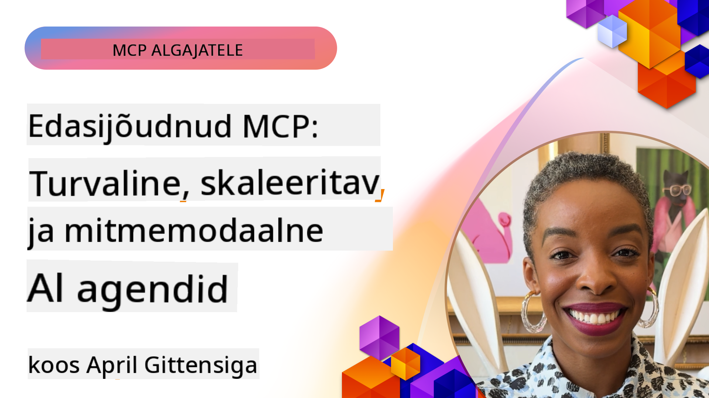

<!--
CO_OP_TRANSLATOR_METADATA:
{
  "original_hash": "d204bc94ea6027d06a703b21b711ca57",
  "translation_date": "2025-10-11T12:09:20+00:00",
  "source_file": "05-AdvancedTopics/README.md",
  "language_code": "et"
}
-->
# Täiustatud teemad MCP-s

_(Klõpsake ülaloleval pildil, et vaadata selle õppetunni videot)_

See peatükk käsitleb mitmeid Model Context Protocol (MCP) rakendamise täiustatud teemasid, sealhulgas multimodaalset integreerimist, skaleeritavust, turvalisuse parimaid tavasid ja ettevõtte integratsiooni. Need teemad on olulised, et luua vastupidavaid ja tootmisvalmis MCP-rakendusi, mis vastavad kaasaegsete AI-süsteemide nõudmistele.

## Ülevaade

See õppetund uurib MCP rakendamise täiustatud kontseptsioone, keskendudes multimodaalsele integreerimisele, skaleeritavusele, turvalisuse parimatele tavadele ja ettevõtte integratsioonile. Need teemad on hädavajalikud tootmiskvaliteediga MCP-rakenduste loomiseks, mis suudavad toime tulla keeruliste nõudmistega ettevõtte keskkondades.

## Õpieesmärgid

Selle õppetunni lõpuks suudate:

- Rakendada multimodaalseid funktsioone MCP raamistikus
- Kavandada skaleeritavaid MCP arhitektuure suure nõudlusega stsenaariumide jaoks
- Rakendada turvalisuse parimaid tavasid, mis vastavad MCP turvalisuse põhimõtetele
- Integreerida MCP ettevõtte AI-süsteemide ja raamistikuga
- Optimeerida jõudlust ja töökindlust tootmiskeskkondades

## Õppetunnid ja näidisprojektid

| Link | Pealkiri | Kirjeldus |
|------|---------|-----------|
| [5.1 Integratsioon Azure'iga](./mcp-integration/README.md) | Integratsioon Azure'iga | Õppige, kuidas integreerida oma MCP server Azure'is |
| [5.2 Multimodaalne näidis](./mcp-multi-modality/README.md) | MCP multimodaalsed näidised | Näidised heli, pildi ja multimodaalse vastuse jaoks |
| [5.3 MCP OAuth2 näidis](../../../05-AdvancedTopics/mcp-oauth2-demo) | MCP OAuth2 demo | Minimalistlik Spring Boot rakendus, mis näitab OAuth2 kasutamist MCP-s nii autoriseerimis- kui ressursiserverina. Näitab turvalist tokenite väljastamist, kaitstud lõpp-punkte, Azure Container Apps juurutamist ja API halduse integratsiooni. |
| [5.4 Juurekontekstid](./mcp-root-contexts/README.md) | Juurekontekstid | Lisateave juurekontekstide kohta ja nende rakendamine |
| [5.5 Marsruutimine](./mcp-routing/README.md) | Marsruutimine | Õppige erinevaid marsruutimise tüüpe |
| [5.6 Proovivõtmine](./mcp-sampling/README.md) | Proovivõtmine | Õppige, kuidas töötada proovivõtmisega |
| [5.7 Skaleerimine](./mcp-scaling/README.md) | Skaleerimine | Lisateave skaleerimise kohta |
| [5.8 Turvalisus](./mcp-security/README.md) | Turvalisus | Turvalisuse tagamine MCP serveris |
| [5.9 Veebiotsingu näidis](./web-search-mcp/README.md) | Veebiotsing MCP | Python MCP server ja klient, mis integreerub SerpAPI-ga reaalajas veebi-, uudiste-, tooteotsingu ja küsimuste-vastuste jaoks. Näitab mitme tööriista orkestreerimist, väliste API-de integreerimist ja tõhusat vigade käsitlemist. |
| [5.10 Reaalajas voogedastus](./mcp-realtimestreaming/README.md) | Voogedastus | Reaalajas andmevoogedastus on tänapäeva andmepõhises maailmas hädavajalik, kus ettevõtted ja rakendused vajavad kohest juurdepääsu teabele, et teha õigeaegseid otsuseid. |
| [5.11 Reaalajas veebiotsing](./mcp-realtimesearch/README.md) | Veebiotsing | Reaalajas veebiotsing, kuidas MCP muudab reaalajas veebiotsingut, pakkudes standardiseeritud lähenemist konteksti haldamiseks AI mudelite, otsingumootorite ja rakenduste vahel. |
| [5.12 Entra ID autentimine Model Context Protocol serverite jaoks](./mcp-security-entra/README.md) | Entra ID autentimine | Microsoft Entra ID pakub tugevat pilvepõhist identiteedi- ja juurdepääsuhalduslahendust, aidates tagada, et ainult volitatud kasutajad ja rakendused saavad teie MCP serveriga suhelda. |
| [5.13 Azure AI Foundry agendi integratsioon](./mcp-foundry-agent-integration/README.md) | Azure AI Foundry integratsioon | Õppige, kuidas integreerida Model Context Protocol serverid Azure AI Foundry agentidega, võimaldades võimsat tööriistade orkestreerimist ja ettevõtte AI võimekust standardiseeritud väliste andmeallikate ühendustega. |
| [5.14 Konteksti inseneeria](./mcp-contextengineering/README.md) | Konteksti inseneeria | Konteksti inseneeria tehnikate tulevikuvõimalused MCP serverite jaoks, sealhulgas konteksti optimeerimine, dünaamiline konteksti haldamine ja strateegiad tõhusaks promptide inseneeriaks MCP raamistikus. |

## Täiendavad viited

Kõige ajakohasema teabe saamiseks MCP täiustatud teemade kohta vaadake:
- [MCP dokumentatsioon](https://modelcontextprotocol.io/)
- [MCP spetsifikatsioon](https://spec.modelcontextprotocol.io/)
- [GitHubi hoidla](https://github.com/modelcontextprotocol)

## Olulised punktid

- Multimodaalsed MCP rakendused laiendavad AI võimekust tekstitöötlusest kaugemale
- Skaleeritavus on ettevõtte juurutuste jaoks hädavajalik ja seda saab lahendada horisontaalse ja vertikaalse skaleerimise kaudu
- Põhjalikud turvameetmed kaitsevad andmeid ja tagavad nõuetekohase juurdepääsukontrolli
- Ettevõtte integratsioon platvormidega nagu Azure OpenAI ja Microsoft AI Foundry suurendab MCP võimekust
- Täiustatud MCP rakendused saavad kasu optimeeritud arhitektuuridest ja hoolikast ressursside haldamisest

## Harjutus

Kavandage ettevõtte tasemel MCP rakendus konkreetse kasutusjuhtumi jaoks:

1. Määrake oma kasutusjuhtumi multimodaalsed nõuded
2. Kirjeldage turvakontrollid, mis on vajalikud tundlike andmete kaitsmiseks
3. Kavandage skaleeritav arhitektuur, mis suudab toime tulla erineva koormusega
4. Planeerige integratsioonipunktid ettevõtte AI-süsteemidega
5. Dokumenteerige võimalikud jõudluse kitsaskohad ja nende leevendamise strateegiad

## Täiendavad ressursid

- [Azure OpenAI dokumentatsioon](https://learn.microsoft.com/en-us/azure/ai-services/openai/)
- [Microsoft AI Foundry dokumentatsioon](https://learn.microsoft.com/en-us/ai-services/)

---

## Mis edasi

- [5.1 MCP integratsioon](./mcp-integration/README.md)

---

**Lahtiütlus**:  
See dokument on tõlgitud AI tõlketeenuse [Co-op Translator](https://github.com/Azure/co-op-translator) abil. Kuigi püüame tagada täpsust, palume arvestada, et automaatsed tõlked võivad sisaldada vigu või ebatäpsusi. Algne dokument selle algses keeles tuleks pidada autoriteetseks allikaks. Olulise teabe puhul soovitame kasutada professionaalset inimtõlget. Me ei vastuta selle tõlke kasutamisest tulenevate arusaamatuste või valesti tõlgenduste eest.