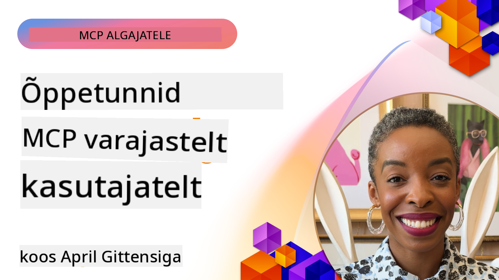

<!--
CO_OP_TRANSLATOR_METADATA:
{
  "original_hash": "41f16dac486d2086a53bc644a01cbe42",
  "translation_date": "2025-10-11T12:42:35+00:00",
  "source_file": "07-LessonsfromEarlyAdoption/README.md",
  "language_code": "et"
}
-->
# 🌟 Õppetunnid varajastelt kasutajatelt

[](https://youtu.be/jds7dSmNptE)

_(Klõpsake ülaloleval pildil, et vaadata selle õppetunni videot)_

## 🎯 Mida see moodul hõlmab

See moodul uurib, kuidas reaalsed organisatsioonid ja arendajad kasutavad Model Context Protocol'i (MCP), et lahendada tegelikke väljakutseid ja edendada innovatsiooni. Läbi detailsete juhtumiuuringute ja praktiliste näidete avastate, kuidas MCP võimaldab turvalist ja skaleeritavat tehisintellekti integreerimist, mis ühendab keelemudeleid, tööriistu ja ettevõtte andmeid.

### Juhtumiuuring 5: Azure MCP – ettevõtte tasemel Model Context Protocol teenusena

Azure MCP ([https://aka.ms/azmcp](https://aka.ms/azmcp)) on Microsofti hallatav, ettevõtte tasemel Model Context Protocol'i rakendus, mis on loodud pakkuma skaleeritavaid, turvalisi ja vastavuses olevaid MCP serveri võimalusi pilveteenusena. See terviklik lahendus sisaldab mitmeid spetsialiseeritud MCP servereid erinevate Azure'i teenuste ja stsenaariumide jaoks.

[Microsoft MCP Center](https://mcp.azure.com) Loo oma skaleeritav ja ettevõtteks valmis MCP register Azure API Centeri abil – see on kataloog saadaolevatest Microsofti MCP serveritest.

> **🎯 Tootmiskõlblikud tööriistad**
> 
> See juhtumiuuring esitleb mitmeid tootmiskõlblikke MCP servereid! Lisateavet Azure MCP Serveri ja teiste Azure'iga integreeritud serverite kohta leiate meie [**Microsoft MCP serverite juhendist**](microsoft-mcp-servers.md#2--azure-mcp-server).

**Peamised omadused:**
- Täielikult hallatav MCP serveri majutamine koos sisseehitatud skaleerimise, jälgimise ja turvalisusega
- Loomulik integreerimine Azure OpenAI, Azure AI Search'i ja teiste Azure'i teenustega
- Ettevõtte autentimine ja autoriseerimine Microsoft Entra ID kaudu
- Tugi kohandatud tööriistadele, viipade mallidele ja ressursside ühendajatele
- Vastavus ettevõtte turva- ja regulatiivsetele nõuetele
- 15+ spetsialiseeritud Azure'i teenuse ühendajat, sealhulgas andmebaas, jälgimine ja salvestus

**Azure MCP Serveri võimalused:**
- **Ressursside haldamine**: Täielik Azure'i ressursside elutsükli haldamine
- **Andmebaasi ühendajad**: Otsene juurdepääs Azure Database for PostgreSQL ja SQL Serverile
- **Azure Monitor**: KQL-põhine logianalüüs ja operatiivsed ülevaated
- **Autentimine**: DefaultAzureCredential ja hallatavate identiteetide mustrid
- **Salvestusteenused**: Blob Storage, Queue Storage ja Table Storage operatsioonid
- **Konteineriteenused**: Azure Container Apps, Container Instances ja AKS haldamine

### 📚 Vaata MCP-d tegevuses

Soovid näha, kuidas neid põhimõtteid rakendatakse tootmiskõlblikes tööriistades? Vaata meie [**10 Microsoft MCP serverit, mis muudavad arendajate produktiivsust**](microsoft-mcp-servers.md), kus tutvustatakse reaalseid Microsofti MCP servereid, mida saad juba täna kasutada.

## Ülevaade

See õppetund uurib, kuidas varajased kasutajad on kasutanud Model Context Protocol'i (MCP), et lahendada reaalseid väljakutseid ja edendada innovatsiooni erinevates tööstusharudes. Läbi detailsete juhtumiuuringute ja praktiliste projektide näete, kuidas MCP võimaldab standardiseeritud, turvalist ja skaleeritavat tehisintellekti integreerimist – ühendades suuri keelemudeleid, tööriistu ja ettevõtte andmeid ühtsesse raamistikku. Saate praktilisi kogemusi MCP-põhiste lahenduste kavandamisel ja ehitamisel, õpite tõestatud rakendusmustreid ning avastate parimaid tavasid MCP juurutamiseks tootmiskeskkondades. Õppetund toob esile ka tekkivaid trende, tuleviku suundi ja avatud lähtekoodiga ressursse, et aidata teil püsida MCP tehnoloogia ja selle areneva ökosüsteemi esirinnas.

## Õpieesmärgid

- Analüüsida reaalseid MCP rakendusi erinevates tööstusharudes
- Kavandada ja ehitada täielikke MCP-põhiseid rakendusi
- Uurida MCP tehnoloogia tekkivaid trende ja tuleviku suundi
- Rakendada parimaid tavasid tegelikes arendussituatsioonides

## Reaalsed MCP rakendused

### Juhtumiuuring 1: Ettevõtte klienditoe automatiseerimine

Rahvusvaheline korporatsioon rakendas MCP-põhist lahendust, et standardiseerida tehisintellekti interaktsioone oma klienditoesüsteemides. See võimaldas neil:

- Luua ühtne liides mitme LLM-i pakkuja jaoks
- Säilitada ühtne viipade haldamine osakondade vahel
- Rakendada tugevaid turva- ja vastavuskontrolle
- Lihtsasti vahetada erinevate tehisintellekti mudelite vahel vastavalt konkreetsetele vajadustele

**Tehniline teostus:**

```python
# Python MCP server implementation for customer support
import logging
import asyncio
from modelcontextprotocol import create_server, ServerConfig
from modelcontextprotocol.server import MCPServer
from modelcontextprotocol.transports import create_http_transport
from modelcontextprotocol.resources import ResourceDefinition
from modelcontextprotocol.prompts import PromptDefinition
from modelcontextprotocol.tool import ToolDefinition

# Configure logging
logging.basicConfig(level=logging.INFO)

async def main():
    # Create server configuration
    config = ServerConfig(
        name="Enterprise Customer Support Server",
        version="1.0.0",
        description="MCP server for handling customer support inquiries"
    )
    
    # Initialize MCP server
    server = create_server(config)
    
    # Register knowledge base resources
    server.resources.register(
        ResourceDefinition(
            name="customer_kb",
            description="Customer knowledge base documentation"
        ),
        lambda params: get_customer_documentation(params)
    )
    
    # Register prompt templates
    server.prompts.register(
        PromptDefinition(
            name="support_template",
            description="Templates for customer support responses"
        ),
        lambda params: get_support_templates(params)
    )
    
    # Register support tools
    server.tools.register(
        ToolDefinition(
            name="ticketing",
            description="Create and update support tickets"
        ),
        handle_ticketing_operations
    )
    
    # Start server with HTTP transport
    transport = create_http_transport(port=8080)
    await server.run(transport)

if __name__ == "__main__":
    asyncio.run(main())
```

**Tulemused:** 30% vähenemine mudelite kuludes, 45% paranemine vastuste järjepidevuses ja parem vastavus ülemaailmsetes operatsioonides.

### Juhtumiuuring 2: Tervishoiu diagnostika assistent

Tervishoiuteenuse osutaja arendas MCP infrastruktuuri, et integreerida mitmeid spetsialiseeritud meditsiinilisi tehisintellekti mudeleid, tagades samal ajal tundlike patsiendiandmete kaitse:

- Sujuv üleminek üldiste ja spetsialiseeritud meditsiiniliste mudelite vahel
- Rangete privaatsuskontrollide ja auditeerimisjälgede rakendamine
- Integreerimine olemasolevate elektrooniliste tervisekaartide (EHR) süsteemidega
- Järjepidev viipade inseneeria meditsiinilise terminoloogia jaoks

**Tehniline teostus:**

```csharp
// C# MCP host application implementation in healthcare application
using Microsoft.Extensions.DependencyInjection;
using ModelContextProtocol.SDK.Client;
using ModelContextProtocol.SDK.Security;
using ModelContextProtocol.SDK.Resources;

public class DiagnosticAssistant
{
    private readonly MCPHostClient _mcpClient;
    private readonly PatientContext _patientContext;
    
    public DiagnosticAssistant(PatientContext patientContext)
    {
        _patientContext = patientContext;
        
        // Configure MCP client with healthcare-specific settings
        var clientOptions = new ClientOptions
        {
            Name = "Healthcare Diagnostic Assistant",
            Version = "1.0.0",
            Security = new SecurityOptions
            {
                Encryption = EncryptionLevel.Medical,
                AuditEnabled = true
            }
        };
        
        _mcpClient = new MCPHostClientBuilder()
            .WithOptions(clientOptions)
            .WithTransport(new HttpTransport("https://healthcare-mcp.example.org"))
            .WithAuthentication(new HIPAACompliantAuthProvider())
            .Build();
    }
    
    public async Task<DiagnosticSuggestion> GetDiagnosticAssistance(
        string symptoms, string patientHistory)
    {
        // Create request with appropriate resources and tool access
        var resourceRequest = new ResourceRequest
        {
            Name = "patient_records",
            Parameters = new Dictionary<string, object>
            {
                ["patientId"] = _patientContext.PatientId,
                ["requestingProvider"] = _patientContext.ProviderId
            }
        };
        
        // Request diagnostic assistance using appropriate prompt
        var response = await _mcpClient.SendPromptRequestAsync(
            promptName: "diagnostic_assistance",
            parameters: new Dictionary<string, object>
            {
                ["symptoms"] = symptoms,
                patientHistory = patientHistory,
                relevantGuidelines = _patientContext.GetRelevantGuidelines()
            });
            
        return DiagnosticSuggestion.FromMCPResponse(response);
    }
}
```

**Tulemused:** Paranenud diagnostilised soovitused arstidele, säilitades samal ajal täieliku HIPAA vastavuse ja märkimisväärne süsteemide vahelise kontekstilülituse vähenemine.

### Juhtumiuuring 3: Finantsteenuste riskianalüüs

Finantsasutus rakendas MCP-d, et standardiseerida oma riskianalüüsi protsesse erinevates osakondades:

- Loodi ühtne liides krediidiriski, pettuste tuvastamise ja investeerimisriskide mudelite jaoks
- Rakendati ranged juurdepääsukontrollid ja mudelite versioonihaldus
- Tagati kõigi tehisintellekti soovituste auditeeritavus
- Säilitati järjepidev andmeformaat erinevates süsteemides

**Tehniline teostus:**

```java
// Java MCP server for financial risk assessment
import org.mcp.server.*;
import org.mcp.security.*;

public class FinancialRiskMCPServer {
    public static void main(String[] args) {
        // Create MCP server with financial compliance features
        MCPServer server = new MCPServerBuilder()
            .withModelProviders(
                new ModelProvider("risk-assessment-primary", new AzureOpenAIProvider()),
                new ModelProvider("risk-assessment-audit", new LocalLlamaProvider())
            )
            .withPromptTemplateDirectory("./compliance/templates")
            .withAccessControls(new SOCCompliantAccessControl())
            .withDataEncryption(EncryptionStandard.FINANCIAL_GRADE)
            .withVersionControl(true)
            .withAuditLogging(new DatabaseAuditLogger())
            .build();
            
        server.addRequestValidator(new FinancialDataValidator());
        server.addResponseFilter(new PII_RedactionFilter());
        
        server.start(9000);
        
        System.out.println("Financial Risk MCP Server running on port 9000");
    }
}
```

**Tulemused:** Paranenud regulatiivne vastavus, 40% kiirem mudelite juurutamise tsükkel ja parem riskihindamise järjepidevus osakondade vahel.

### Juhtumiuuring 4: Microsoft Playwright MCP Server brauseri automatiseerimiseks

Microsoft arendas [Playwright MCP serveri](https://github.com/microsoft/playwright-mcp), et võimaldada turvalist ja standardiseeritud brauseri automatiseerimist Model Context Protocol'i kaudu. See tootmiskõlblik server võimaldab tehisintellekti agentidel ja LLM-idel suhelda veebibrauseritega kontrollitud, auditeeritaval ja laiendataval viisil – võimaldades selliseid kasutusjuhtumeid nagu automatiseeritud veebitestimine, andmete kaevandamine ja otsast lõpuni töövood.

> **🎯 Tootmiskõlblik tööriist**
> 
> See juhtumiuuring esitleb reaalset MCP serverit, mida saate juba täna kasutada! Lisateavet Playwright MCP Serveri ja 9 muu tootmiskõlbliku Microsofti MCP serveri kohta leiate meie [**Microsoft MCP serverite juhendist**](microsoft-mcp-servers.md#8--playwright-mcp-server).

**Peamised omadused:**
- Pakub brauseri automatiseerimise võimalusi (navigatsioon, vormide täitmine, ekraanipiltide tegemine jne) MCP tööriistadena
- Rakendab rangeid juurdepääsukontrolle ja liivakastikeskkonda, et vältida volitamata toiminguid
- Pakub üksikasjalikke auditeerimislogisid kõigi brauseri interaktsioonide kohta
- Toetab integreerimist Azure OpenAI ja teiste LLM-i pakkujatega agentide juhitud automatiseerimiseks
- Toetab GitHub Copiloti koodikirjutaja veebisirvimise võimalusi

**Tehniline teostus:**

```typescript
// TypeScript: Registering Playwright browser automation tools in an MCP server
import { createServer, ToolDefinition } from 'modelcontextprotocol';
import { launch } from 'playwright';

const server = createServer({
  name: 'Playwright MCP Server',
  version: '1.0.0',
  description: 'MCP server for browser automation using Playwright'
});

// Register a tool for navigating to a URL and capturing a screenshot
server.tools.register(
  new ToolDefinition({
    name: 'navigate_and_screenshot',
    description: 'Navigate to a URL and capture a screenshot',
    parameters: {
      url: { type: 'string', description: 'The URL to visit' }
    }
  }),
  async ({ url }) => {
    const browser = await launch();
    const page = await browser.newPage();
    await page.goto(url);
    const screenshot = await page.screenshot();
    await browser.close();
    return { screenshot };
  }
);

// Start the MCP server
server.listen(8080);
```

**Tulemused:**

- Võimaldas turvalist, programmilist brauseri automatiseerimist tehisintellekti agentidele ja LLM-idele
- Vähendas manuaalse testimise koormust ja parandas veebirakenduste testimise ulatust
- Pakkus taaskasutatavat ja laiendatavat raamistikku brauseripõhiste tööriistade integreerimiseks ettevõtte keskkondades
- Toetab GitHub Copiloti veebisirvimise võimalusi

**Viited:**

- [Playwright MCP Server GitHub Repository](https://github.com/microsoft/playwright-mcp)
- [Microsoft AI ja automatiseerimise lahendused](https://azure.microsoft.com/en-us/products/ai-services/)

### Juhtumiuuring 5: Azure MCP – ettevõtte tasemel Model Context Protocol teenusena

Azure MCP Server ([https://aka.ms/azmcp](https://aka.ms/azmcp)) on Microsofti hallatav, ettevõtte tasemel Model Context Protocol'i rakendus, mis on loodud pakkuma skaleeritavaid, turvalisi ja vastavuses olevaid MCP serveri võimalusi pilveteenusena. Azure MCP võimaldab organisatsioonidel kiiresti juurutada, hallata ja integreerida MCP servereid Azure AI, andmete ja turvateenustega, vähendades tegevuskulusid ja kiirendades tehisintellekti kasutuselevõttu.

> **🎯 Tootmiskõlblik tööriist**
> 
> See on reaalne MCP server, mida saate juba täna kasutada! Lisateavet Azure AI Foundry MCP Serveri kohta leiate meie [**Microsoft MCP serverite juhendist**](microsoft-mcp-servers.md).

- Täielikult hallatav MCP serveri majutamine koos sisseehitatud skaleerimise, jälgimise ja turvalisusega
- Loomulik integreerimine Azure OpenAI, Azure AI Search'i ja teiste Azure'i teenustega
- Ettevõtte autentimine ja autoriseerimine Microsoft Entra ID kaudu
- Tugi kohandatud tööriistadele, viipade mallidele ja ressursside ühendajatele
- Vastavus ettevõtte turva- ja regulatiivsetele nõuetele

**Tehniline teostus:**

```yaml
# Example: Azure MCP server deployment configuration (YAML)
apiVersion: mcp.microsoft.com/v1
kind: McpServer
metadata:
  name: enterprise-mcp-server
spec:
  modelProviders:
    - name: azure-openai
      type: AzureOpenAI
      endpoint: https://<your-openai-resource>.openai.azure.com/
      apiKeySecret: <your-azure-keyvault-secret>
  tools:
    - name: document_search
      type: AzureAISearch
      endpoint: https://<your-search-resource>.search.windows.net/
      apiKeySecret: <your-azure-keyvault-secret>
  authentication:
    type: EntraID
    tenantId: <your-tenant-id>
  monitoring:
    enabled: true
    logAnalyticsWorkspace: <your-log-analytics-id>
```

**Tulemused:**  
- Vähenenud aeg ettevõtte tehisintellekti projektide väärtuse saavutamiseks, pakkudes kasutusvalmis ja vastavuses MCP serveri platvormi
- Lihtsustatud LLM-ide, tööriistade ja ettevõtte andmeallikate integreerimine
- Paranenud turvalisus, jälgitavus ja operatiivne tõhusus MCP töökoormuste jaoks
- Paranenud koodikvaliteet Azure SDK parimate tavade ja kaasaegsete autentimismustrite abil

**Viited:**  
- [Azure MCP dokumentatsioon](https://aka.ms/azmcp)
- [Azure MCP Server GitHub Repository](https://github.com/Azure/azure-mcp)
- [Azure AI teenused](https://azure.microsoft.com/en-us/products/ai-services/)
- [Microsoft MCP Center](https://mcp.azure.com)

## Juhtumiuuring 6: NLWeb 
MCP (Model Context Protocol) on uus protokoll, mis võimaldab vestlusrobotitel ja tehisintellekti assistentidel tööriistadega suhelda. Iga NLWebi instants on ka MCP server, mis toetab ühte põhimeetodit, "ask", mida kasutatakse veebisaidilt loomulikus keeles küsimuste küsimiseks. Tagastatud vastus kasutab schema.org-i, laialdaselt kasutatavat sõnavara veebis andmete kirjeldamiseks. Üldiselt on MCP NLWeb samamoodi nagu Http on HTML.

NLWeb ühendab protokollid, Schema.org formaadid ja näidiskoodi, et aidata saitidel kiiresti luua neid lõpp-punkte, pakkudes kasu nii inimestele vestlusliideste kaudu kui ka masinatele loomuliku agentidevahelise suhtluse kaudu.

NLWeb koosneb kahest eraldi komponendist:
- Protokoll, mis on alguses väga lihtne, et suhelda saidiga loomulikus keeles, ja formaat, mis kasutab jsoni ja schema.org-i tagastatud vastuse jaoks. Lisateabe saamiseks vaadake REST API dokumentatsiooni.
- Lihtne rakendus (1) jaoks, mis kasutab olemasolevat märgistust saitide jaoks, mida saab abstraheerida kui üksuste loendeid (tooted, retseptid, vaatamisväärsused, arvustused jne). Koos kasutajaliidese vidinatega saavad saidid hõlpsasti pakkuda oma sisule vestlusliideseid. Lisateabe saamiseks selle toimimise kohta vaadake dokumentatsiooni "Life of a chat query".

**Viited:**  
- [Azure MCP dokumentatsioon](https://aka.ms/azmcp)
- [NLWeb](https://github.com/microsoft/NlWeb)

### Juhtumiuuring 7: Azure AI Foundry MCP Server – ettevõtte tehisintellekti agentide integreerimine

Azure AI Foundry MCP serverid näitavad, kuidas MCP-d saab kasutada tehisintellekti agentide ja töövoogude korraldamiseks ja haldamiseks ettevõtte keskkondades. Integreerides MCP Azure AI Foundry'ga, saavad organisatsioonid standardiseerida agentide interaktsioone, kasutada Foundry töövoo haldust ja tagada turvalised, skaleeritavad juurutused.

> **🎯 Tootmiskõlblik tööriist**
> 
> See on reaalne MCP server, mida saate juba täna kasutada! Lisateavet Azure AI Foundry MCP Serveri kohta leiate meie [**Microsoft MCP serverite juhendist**](microsoft-mcp-servers.md#9--azure-ai-foundry-mcp-server).

**Peamised omadused:**
- Põhjalik juurdepääs Azure'i tehisintellekti ökosüsteemile, sealhulgas mudelikataloogidele ja juurutamise haldamisele
- Teadmiste indekseerimine Azure AI Search'i abil RAG rakenduste jaoks
- Hindamisvahendid tehisintellekti mudelite jõudluse ja kvaliteedi tagamiseks
- Integreerimine Azure AI Foundry kataloogi ja laboritega tipptasemel uurimismudelite jaoks
- Agentide haldamise ja hindamise võimalused tootmistsenaariumide jaoks

**Tulemused:**
- Kiire prototüüpimine ja töövoogude tugev jälgimine tehisintellekti agentide jaoks
- Sujuv integreerimine Azure AI teenustega keerukate stsenaariumide jaoks
- Ühtne liides agentide torujuhtmete loomiseks, juurutamiseks ja jälgimiseks
- Paranenud turvalisus, vastavus ja operatiivne tõhusus ettevõtetele
- Kiirendatud tehisintellekti kasutuselevõtt, säilitades samal ajal kontrolli keerukate agentide juhitud protsesside üle

**Viited:**
- [Azure AI Foundry MCP Server GitHub Repository](https://github.com/azure-ai-foundry/mcp-foundry)
- [Azure AI agentide integreerimine MCP-ga (Microsoft Foundry Blog)](https://devblogs.microsoft.com/foundry/integrating-azure-ai-agents-mcp/)

### Juhtumiuuring 8: Foundry MCP Playground – katsetamine ja prototüüpimine

Foundry MCP Playground pakub kasutusvalmis keskkonda MCP serverite ja Azure AI Foundry integratsioonide katsetamiseks. Arendajad saavad kiiresti prototüüpida, testida ja hinnata tehisintellekti mudeleid ja agentide töövooge, kasutades ressursse Azure AI Foundry kataloogist ja laboritest. Playground lihtsustab seadistamist, pakub näidisprojekte ja toetab koostööl põhinevat arendust, muutes parimate tavade ja uute stsenaariumide uurimise lihtsaks ja vähese vaevaga. See on eriti kasulik meeskondadele, kes soovivad ideid valideerida, katsetusi jagada ja õppimist kiirendada ilma keeruka infrastruktuurita. Madaldades sisenemisbarjääri, aitab playground edendada innovatsiooni ja kogukonna panust MCP ja Azure AI Foundry ökosüsteemis.

**Viited:**

- [Foundry MCP Playground GitHub
**Miks see on oluline:**
- Lahendab "aegunud AI teadmiste" probleemi Microsofti tehnoloogiate puhul
- Tagab, et AI assistentidel on juurdepääs uusimatele .NET, C#, Azure ja Microsoft 365 funktsioonidele
- Pakub autoriteetset, esmaklassilist teavet täpseks koodi genereerimiseks
- Hädavajalik arendajatele, kes töötavad kiiresti arenevate Microsofti tehnoloogiatega

**Tulemused:**
- Oluliselt paranenud AI poolt genereeritud koodi täpsus Microsofti tehnoloogiate jaoks
- Vähenenud aeg, mis kulub ajakohase dokumentatsiooni ja parimate praktikate otsimisele
- Suurenenud arendajate produktiivsus kontekstitundliku dokumentatsiooni leidmisega
- Sujuv integreerimine arendustöövoogudesse ilma IDE-st lahkumata

**Viited:**
- [Microsoft Learn Docs MCP Server GitHub Repository](https://github.com/MicrosoftDocs/mcp)
- [Microsoft Learn Documentation](https://learn.microsoft.com/)

## Praktilised projektid

### Projekt 1: Mitme pakkuja MCP serveri loomine

**Eesmärk:** Luua MCP server, mis suudab suunata päringuid mitmele AI mudeli pakkujale vastavalt konkreetsetele kriteeriumidele.

**Nõuded:**

- Toetada vähemalt kolme erinevat mudeli pakkujat (nt OpenAI, Anthropic, kohalikud mudelid)
- Rakendada suunamismehhanism päringu metaandmete põhjal
- Luua konfiguratsioonisüsteem pakkuja volituste haldamiseks
- Lisada vahemälu jõudluse ja kulude optimeerimiseks
- Ehita lihtne armatuurlaud kasutuse jälgimiseks

**Rakendamise sammud:**

1. Seadista MCP serveri põhistruktuur
2. Rakenda pakkuja adapterid iga AI mudeli teenuse jaoks
3. Loo suunamisloogika päringu atribuutide põhjal
4. Lisa vahemälu sagedaste päringute jaoks
5. Arenda jälgimisarmatuurlaud
6. Testi erinevate päringumustritega

**Tehnoloogiad:** Valik Python (.NET/Java/Python vastavalt eelistusele), Redis vahemälu jaoks ja lihtne veebiraamistik armatuurlaua jaoks.

### Projekt 2: Ettevõtte promptide haldamise süsteem

**Eesmärk:** Arendada MCP-põhine süsteem promptide mallide haldamiseks, versioonimiseks ja juurutamiseks organisatsioonis.

**Nõuded:**

- Loo tsentraliseeritud repository promptide mallide jaoks
- Rakenda versioonimise ja kinnitamise töövood
- Ehita mallide testimise võimalused näidisandmetega
- Arenda rollipõhised juurdepääsukontrollid
- Loo API mallide hankimiseks ja juurutamiseks

**Rakendamise sammud:**

1. Kujunda andmebaasi skeem mallide salvestamiseks
2. Loo põhifunktsioonid mallide CRUD operatsioonide jaoks
3. Rakenda versioonimissüsteem
4. Ehita kinnitamise töövoog
5. Arenda testimise raamistik
6. Loo lihtne veebiliides haldamiseks
7. Integreeri MCP serveriga

**Tehnoloogiad:** Valik tagapõhja raamistik, SQL või NoSQL andmebaas ja esipõhja raamistik haldusliidese jaoks.

### Projekt 3: MCP-põhine sisuloome platvorm

**Eesmärk:** Ehita sisuloome platvorm, mis kasutab MCP-d, et pakkuda järjepidevaid tulemusi erinevate sisutüüpide jaoks.

**Nõuded:**

- Toetada mitut sisuvormingut (blogipostitused, sotsiaalmeedia, turundustekstid)
- Rakendada mallipõhine loomine kohandamisvõimalustega
- Loo sisu ülevaatamise ja tagasiside süsteem
- Jälgi sisu jõudluse mõõdikuid
- Toeta sisu versioonimist ja iteratsiooni

**Rakendamise sammud:**

1. Seadista MCP kliendi infrastruktuur
2. Loo mallid erinevate sisutüüpide jaoks
3. Ehita sisuloome torustik
4. Rakenda ülevaatamise süsteem
5. Arenda mõõdikute jälgimise süsteem
6. Loo kasutajaliides mallide haldamiseks ja sisuloomeks

**Tehnoloogiad:** Valik programmeerimiskeel, veebiraamistik ja andmebaasisüsteem.

## MCP tehnoloogia tulevikusuunad

### Tekkivad trendid

1. **Multimodaalne MCP**
   - MCP laiendamine, et standardiseerida suhtlust pildi-, heli- ja videomudelitega
   - Ristmodaliteedi põhjendamise võimekuse arendamine
   - Standardiseeritud promptide vormingud erinevate modaliteetide jaoks

2. **Federatiivne MCP infrastruktuur**
   - Hajutatud MCP võrgustikud, mis jagavad ressursse organisatsioonide vahel
   - Standardiseeritud protokollid turvaliseks mudelite jagamiseks
   - Privaatsust säilitavad arvutustehnikad

3. **MCP turuplatsid**
   - Ökosüsteemid MCP mallide ja pluginade jagamiseks ja monetiseerimiseks
   - Kvaliteedi tagamise ja sertifitseerimise protsessid
   - Integreerimine mudelite turuplatsidega

4. **MCP serva arvutamiseks**
   - MCP standardite kohandamine ressursipiirangutega servaseadmete jaoks
   - Optimeeritud protokollid madala ribalaiusega keskkondade jaoks
   - Spetsialiseeritud MCP rakendused IoT ökosüsteemide jaoks

5. **Regulatiivsed raamistikud**
   - MCP laienduste arendamine regulatiivse vastavuse jaoks
   - Standardiseeritud auditeerimisjäljed ja selgitusliidesed
   - Integreerimine tekkivate AI juhtimisraamistikudega

### MCP lahendused Microsoftilt

Microsoft ja Azure on välja töötanud mitmeid avatud lähtekoodiga repository'sid, et aidata arendajatel MCP-d erinevates stsenaariumides rakendada:

#### Microsofti organisatsioon

1. [playwright-mcp](https://github.com/microsoft/playwright-mcp) - Playwright MCP server brauseri automatiseerimiseks ja testimiseks
2. [files-mcp-server](https://github.com/microsoft/files-mcp-server) - OneDrive MCP serveri rakendus kohalikuks testimiseks ja kogukonna panustamiseks
3. [NLWeb](https://github.com/microsoft/NlWeb) - NLWeb on avatud protokollide ja seotud avatud lähtekoodiga tööriistade kogum. Selle peamine fookus on AI veebile aluse loomine

#### Azure-Samples organisatsioon

1. [mcp](https://github.com/Azure-Samples/mcp) - Lingid näidetele, tööriistadele ja ressurssidele MCP serverite ehitamiseks ja integreerimiseks Azure'is, kasutades mitmeid keeli
2. [mcp-auth-servers](https://github.com/Azure-Samples/mcp-auth-servers) - Viite MCP serverid, mis demonstreerivad autentimist praeguse Model Context Protocol spetsifikatsiooniga
3. [remote-mcp-functions](https://github.com/Azure-Samples/remote-mcp-functions) - Kaug-MCP serverite rakenduste maandumisleht Azure Functions'is koos linkidega keelespetsiifiliste repository'de juurde
4. [remote-mcp-functions-python](https://github.com/Azure-Samples/remote-mcp-functions-python) - Kiirstardi mall kohandatud kaug-MCP serverite ehitamiseks ja juurutamiseks Azure Functions'is, kasutades Pythonit
5. [remote-mcp-functions-dotnet](https://github.com/Azure-Samples/remote-mcp-functions-dotnet) - Kiirstardi mall kohandatud kaug-MCP serverite ehitamiseks ja juurutamiseks Azure Functions'is, kasutades .NET/C#
6. [remote-mcp-functions-typescript](https://github.com/Azure-Samples/remote-mcp-functions-typescript) - Kiirstardi mall kohandatud kaug-MCP serverite ehitamiseks ja juurutamiseks Azure Functions'is, kasutades TypeScripti
7. [remote-mcp-apim-functions-python](https://github.com/Azure-Samples/remote-mcp-apim-functions-python) - Azure API Management kui AI Gateway kaug-MCP serveritele, kasutades Pythonit
8. [AI-Gateway](https://github.com/Azure-Samples/AI-Gateway) - APIM ❤️ AI eksperimendid, sealhulgas MCP võimekused, integreerimine Azure OpenAI ja AI Foundry'ga

Need repository'd pakuvad erinevaid rakendusi, malle ja ressursse Model Context Protocol'iga töötamiseks erinevates programmeerimiskeeltes ja Azure'i teenustes. Need hõlmavad mitmesuguseid kasutusjuhtumeid alates põhiserveri rakendustest kuni autentimise, pilve juurutamise ja ettevõtte integreerimise stsenaariumideni.

#### MCP ressursside kataloog

[MCP ressursside kataloog](https://github.com/microsoft/mcp/tree/main/Resources) ametlikus Microsoft MCP repository's pakub kureeritud kogumit näidisressursse, promptide malle ja tööriistade määratlusi Model Context Protocol serveritega kasutamiseks. See kataloog on loodud selleks, et aidata arendajatel MCP-ga kiiresti alustada, pakkudes taaskasutatavaid ehitusplokke ja parimate praktikate näiteid:

- **Promptide mallid:** Valmis kasutamiseks promptide mallid levinud AI ülesannete ja stsenaariumide jaoks, mida saab kohandada oma MCP serveri rakenduste jaoks.
- **Tööriistade määratlused:** Näidistööriistade skeemid ja metaandmed tööriistade integreerimise ja käivitamise standardiseerimiseks erinevate MCP serverite vahel.
- **Ressursside näidised:** Näidisressursside määratlused andmeallikate, API-de ja väliste teenuste ühendamiseks MCP raamistiku sees.
- **Viite rakendused:** Praktilised näited, mis näitavad, kuidas ressursse, promte ja tööriistu struktureerida ja korraldada reaalse maailma MCP projektides.

Need ressursid kiirendavad arendust, edendavad standardiseerimist ja aitavad tagada parimad praktikad MCP-põhiste lahenduste ehitamisel ja juurutamisel.

#### MCP ressursside kataloog

- [MCP Resources (Sample Prompts, Tools, and Resource Definitions)](https://github.com/microsoft/mcp/tree/main/Resources)

### Uurimisvõimalused

- Tõhusad promptide optimeerimise tehnikad MCP raamistikes
- Turvamudelid mitme rentniku MCP juurutuste jaoks
- Jõudluse võrdlusuuringud erinevate MCP rakenduste vahel
- Formaalsete verifitseerimismeetodite arendamine MCP serverite jaoks

## Kokkuvõte

Model Context Protocol (MCP) kujundab kiiresti standardiseeritud, turvalise ja koostalitlusvõimelise AI integratsiooni tulevikku erinevates tööstusharudes. Selle õppetunni juhtumiuuringute ja praktiliste projektide kaudu nägite, kuidas varased kasutuselevõtjad—sealhulgas Microsoft ja Azure—kasutavad MCP-d reaalsete probleemide lahendamiseks, AI kasutuselevõtu kiirendamiseks ning vastavuse, turvalisuse ja skaleeritavuse tagamiseks. MCP modulaarne lähenemine võimaldab organisatsioonidel ühendada suuri keelemudeleid, tööriistu ja ettevõtte andmeid ühtses, auditeeritavas raamistikus. Kuna MCP jätkab arengut, on kogukonnaga kaasas käimine, avatud lähtekoodiga ressursside uurimine ja parimate praktikate rakendamine võtmetähtsusega, et ehitada vastupidavaid, tulevikukindlaid AI lahendusi.

## Täiendavad ressursid

- [MCP Foundry GitHub Repository](https://github.com/azure-ai-foundry/mcp-foundry)
- [Foundry MCP Playground](https://github.com/azure-ai-foundry/foundry-mcp-playground)
- [Integrating Azure AI Agents with MCP (Microsoft Foundry Blog)](https://devblogs.microsoft.com/foundry/integrating-azure-ai-agents-mcp/)
- [MCP GitHub Repository (Microsoft)](https://github.com/microsoft/mcp)
- [MCP Resources Directory (Sample Prompts, Tools, and Resource Definitions)](https://github.com/microsoft/mcp/tree/main/Resources)
- [MCP Community & Documentation](https://modelcontextprotocol.io/introduction)
- [Azure MCP Documentation](https://aka.ms/azmcp)
- [Playwright MCP Server GitHub Repository](https://github.com/microsoft/playwright-mcp)
- [Files MCP Server (OneDrive)](https://github.com/microsoft/files-mcp-server)
- [Azure-Samples MCP](https://github.com/Azure-Samples/mcp)
- [MCP Auth Servers (Azure-Samples)](https://github.com/Azure-Samples/mcp-auth-servers)
- [Remote MCP Functions (Azure-Samples)](https://github.com/Azure-Samples/remote-mcp-functions)
- [Remote MCP Functions Python (Azure-Samples)](https://github.com/Azure-Samples/remote-mcp-functions-python)
- [Remote MCP Functions .NET (Azure-Samples)](https://github.com/Azure-Samples/remote-mcp-functions-dotnet)
- [Remote MCP Functions TypeScript (Azure-Samples)](https://github.com/Azure-Samples/remote-mcp-functions-typescript)
- [Remote MCP APIM Functions Python (Azure-Samples)](https://github.com/Azure-Samples/remote-mcp-apim-functions-python)
- [AI-Gateway (Azure-Samples)](https://github.com/Azure-Samples/AI-Gateway)
- [Microsoft AI and Automation Solutions](https://azure.microsoft.com/en-us/products/ai-services/)

## Harjutused

1. Analüüsi ühte juhtumiuuringut ja paku alternatiivset rakendusviisi.
2. Vali üks projektide ideedest ja loo detailne tehniline spetsifikatsioon.
3. Uuri tööstusharu, mida juhtumiuuringutes ei käsitletud, ja kirjelda, kuidas MCP võiks lahendada selle spetsiifilisi väljakutseid.
4. Uuri ühte tulevikusuunda ja loo kontseptsioon uue MCP laienduse toetamiseks.

Järgmine: [Microsoft MCP Server](../07-LessonsfromEarlyAdoption/microsoft-mcp-servers.md)

---

**Lahtiütlus**:  
See dokument on tõlgitud AI tõlketeenuse [Co-op Translator](https://github.com/Azure/co-op-translator) abil. Kuigi püüame tagada täpsust, palume arvestada, et automaatsed tõlked võivad sisaldada vigu või ebatäpsusi. Algne dokument selle algses keeles tuleks pidada autoriteetseks allikaks. Olulise teabe puhul soovitame kasutada professionaalset inimtõlget. Me ei vastuta selle tõlke kasutamisest tulenevate arusaamatuste või valesti tõlgenduste eest.