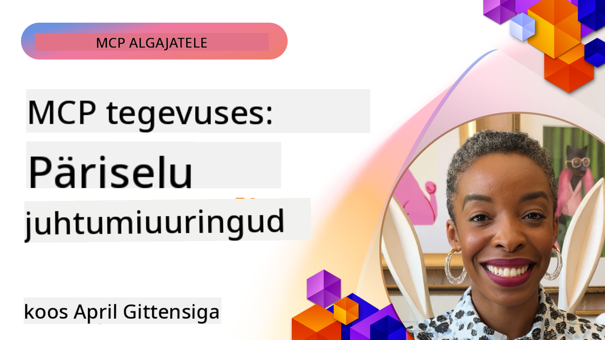

<!--
CO_OP_TRANSLATOR_METADATA:
{
  "original_hash": "1611dc5f6a2a35a789fc4c95fc5bfbe8",
  "translation_date": "2025-10-11T12:36:23+00:00",
  "source_file": "09-CaseStudy/README.md",
  "language_code": "et"
}
-->
# MCP tegevuses: päriselulised juhtumiuuringud

_(Klõpsa ülaloleval pildil, et vaadata selle õppetunni videot)_

Model Context Protocol (MCP) muudab viisi, kuidas AI-rakendused suhtlevad andmete, tööriistade ja teenustega. Selles jaotises tutvustatakse päriselulisi juhtumiuuringuid, mis näitavad MCP praktilisi rakendusi erinevates ettevõtte stsenaariumides.

## Ülevaade

See jaotis toob esile konkreetseid MCP rakendusi, näidates, kuidas organisatsioonid kasutavad seda protokolli keeruliste äriprobleemide lahendamiseks. Nende juhtumiuuringute uurimine annab ülevaate MCP mitmekülgsusest, skaleeritavusest ja praktilistest eelistest päriselulistes olukordades.

## Peamised õpieesmärgid

Nende juhtumiuuringute uurimise kaudu saate:

- Mõista, kuidas MCP-d saab rakendada konkreetsete äriprobleemide lahendamiseks
- Õppida erinevaid integreerimismustreid ja arhitektuurilisi lähenemisi
- Tunda ära parimad tavad MCP rakendamiseks ettevõtte keskkondades
- Saada ülevaate päriseluliste rakenduste väljakutsetest ja lahendustest
- Tuvastada võimalusi sarnaste mustrite rakendamiseks oma projektides

## Esiletõstetud juhtumiuuringud

### 1. [Azure AI reisibürood – viiteimplementatsioon](./travelagentsample.md)

See juhtumiuuring uurib Microsofti terviklikku viitelahendust, mis näitab, kuidas ehitada MCP, Azure OpenAI ja Azure AI Search abil mitme agendiga AI-põhine reisiplaneerimise rakendus. Projekt toob esile:

- Mitme agendi orkestreerimine MCP kaudu
- Ettevõtte andmete integreerimine Azure AI Searchiga
- Turvaline ja skaleeritav arhitektuur Azure'i teenuste abil
- Laiendatav tööriistakomplekt korduvkasutatavate MCP komponentidega
- Vestluslik kasutajakogemus, mida toetab Azure OpenAI

Arhitektuuri ja rakenduse üksikasjad pakuvad väärtuslikku ülevaadet keerukate mitme agendiga süsteemide ehitamisest MCP koordineerimiskihina.

### 2. [Azure DevOpsi üksuste uuendamine YouTube'i andmetest](./UpdateADOItemsFromYT.md)

See juhtumiuuring näitab MCP praktilist rakendust töövoogude automatiseerimiseks. See näitab, kuidas MCP tööriistu saab kasutada:

- Andmete ekstraheerimiseks veebiplatvormidelt (YouTube)
- Tööüksuste uuendamiseks Azure DevOpsi süsteemides
- Korduvate automatiseeritud töövoogude loomiseks
- Andmete integreerimiseks erinevate süsteemide vahel

See näide illustreerib, kuidas isegi suhteliselt lihtsad MCP rakendused võivad pakkuda märkimisväärset efektiivsuse kasvu, automatiseerides rutiinseid ülesandeid ja parandades andmete järjepidevust süsteemide vahel.

### 3. [Reaalajas dokumentatsiooni hankimine MCP-ga](./docs-mcp/README.md)

See juhtumiuuring juhendab teid Python konsoolikliendi ühendamisel Model Context Protocol (MCP) serveriga, et hankida ja logida reaalajas kontekstitundlikku Microsofti dokumentatsiooni. Õpite, kuidas:

- Ühendada MCP serveriga Python kliendi ja ametliku MCP SDK abil
- Kasutada voogesituse HTTP kliente tõhusaks reaalajas andmete hankimiseks
- Kutsuda serveri dokumentatsioonitööriistu ja logida vastuseid otse konsooli
- Integreerida ajakohast Microsofti dokumentatsiooni oma töövoogu ilma terminalist lahkumata

Peatükk sisaldab praktilist ülesannet, minimaalset töötavat koodinäidet ja linke täiendavate ressursside juurde sügavamaks õppimiseks. Vaadake seotud peatükis täielikku juhendit ja koodi, et mõista, kuidas MCP saab dokumentatsiooni juurdepääsu ja arendaja produktiivsust konsoolipõhistes keskkondades muuta.

### 4. [Interaktiivne õppeplaani generaatori veebirakendus MCP-ga](./docs-mcp/README.md)

See juhtumiuuring näitab, kuidas ehitada interaktiivne veebirakendus Chainlit'i ja Model Context Protocol (MCP) abil, et genereerida isikupärastatud õppeplaane mis tahes teemal. Kasutajad saavad määrata teema (näiteks "AI-900 sertifikaat") ja õppeperioodi (nt 8 nädalat), ning rakendus pakub nädalate kaupa jaotatud soovitusi. Chainlit võimaldab vestluslikku vestlusliidest, muutes kogemuse kaasahaaravaks ja kohanduvaks.

- Vestluslik veebirakendus, mida toetab Chainlit
- Kasutaja juhitud sisendid teema ja kestuse määramiseks
- Nädalate kaupa sisu soovitused MCP abil
- Reaalajas kohanduvad vastused vestlusliideses

Projekt illustreerib, kuidas vestluslik AI ja MCP saab kombineerida, et luua dünaamilisi, kasutajakeskseid haridusvahendeid kaasaegses veebikeskkonnas.

### 5. [Dokumentatsioon otse redaktoris MCP serveriga VS Code'is](./docs-mcp/README.md)

See juhtumiuuring näitab, kuidas tuua Microsoft Learn Docs otse oma VS Code'i keskkonda MCP serveri abil – enam pole vaja vahetada brauseri vahelehti! Näete, kuidas:

- Otsida ja lugeda dokumente VS Code'is MCP paneeli või käsupaleti kaudu
- Viidata dokumentatsioonile ja lisada linke otse oma README või kursuse markdown-failidesse
- Kasutada GitHub Copilotit ja MCP-d koos sujuvaks, AI-põhiseks dokumentatsiooni ja koodi töövoogudeks
- Kontrollida ja täiustada dokumentatsiooni reaalajas tagasiside ja Microsofti täpsusega
- Integreerida MCP GitHubi töövoogudega pidevaks dokumentatsiooni valideerimiseks

Rakendus sisaldab:

- Näidis `.vscode/mcp.json` konfiguratsiooni lihtsaks seadistamiseks
- Ekraanipiltidel põhinevaid juhendeid redaktori kogemuse kohta
- Näpunäiteid Copiloti ja MCP kombineerimiseks maksimaalse produktiivsuse saavutamiseks

See stsenaarium sobib ideaalselt kursuste autoritele, dokumentatsiooni kirjutajatele ja arendajatele, kes soovivad jääda keskendunuks oma redaktoris, töötades dokumentide, Copiloti ja valideerimistööriistadega – kõik MCP abil.

### 6. [APIM MCP serveri loomine](./apimsample.md)

See juhtumiuuring pakub samm-sammulist juhendit MCP serveri loomiseks Azure API Management (APIM) abil. See hõlmab:

- MCP serveri seadistamist Azure API Managementis
- API operatsioonide MCP tööriistadena avaldamist
- Poliitikate konfigureerimist kiiruse piiramiseks ja turvalisuseks
- MCP serveri testimist Visual Studio Code'i ja GitHub Copiloti abil

See näide illustreerib, kuidas kasutada Azure'i võimalusi, et luua tugev MCP server, mida saab kasutada erinevates rakendustes, parandades AI-süsteemide integreerimist ettevõtte API-dega.

### 7. [GitHub MCP register — agentide integreerimise kiirendamine](https://github.com/mcp)

See juhtumiuuring uurib, kuidas GitHubi MCP register, mis käivitati septembris 2025, lahendab AI ökosüsteemi kriitilise probleemi: Model Context Protocol (MCP) serverite killustatud avastamine ja juurutamine.

#### Ülevaade
**MCP register** lahendab kasvava probleemi MCP serverite hajutatud avastamisega erinevates repositooriumides ja registrites, mis varem muutis integreerimise aeglaseks ja vigadele vastuvõtlikuks. Need serverid võimaldavad AI agentidel suhelda väliste süsteemidega, nagu API-d, andmebaasid ja dokumentatsiooniallikad.

#### Probleemi kirjeldus
Agentide töövoogude arendajad seisid silmitsi mitmete väljakutsetega:
- **Halb avastatavus** MCP serverite osas erinevatel platvormidel
- **Korduvad seadistusküsimused** hajutatud foorumites ja dokumentatsioonis
- **Turvariskid** kontrollimata ja ebausaldusväärsetest allikatest
- **Standardiseerimise puudumine** serverite kvaliteedi ja ühilduvuse osas

#### Lahenduse arhitektuur
GitHubi MCP register koondab usaldusväärsed MCP serverid koos võtmefunktsioonidega:
- **Ühe klõpsuga installimine** integreerimine VS Code'i kaudu lihtsustatud seadistamiseks
- **Signaal üle müra sorteerimine** tähtede, aktiivsuse ja kogukonna valideerimise alusel
- **Otsene integreerimine** GitHub Copiloti ja teiste MCP-ühilduvate tööriistadega
- **Avatud panuse mudel** võimaldades nii kogukonna kui ka ettevõtte partneritel panustada

#### Äriline mõju
Register on toonud mõõdetavaid parandusi:
- **Kiirem kasutuselevõtt** arendajatele, kes kasutavad tööriistu nagu Microsoft Learn MCP server, mis voogesitab ametlikku dokumentatsiooni otse agentidesse
- **Paranenud produktiivsus** spetsialiseeritud serverite, nagu `github-mcp-server`, abil, mis võimaldab loomuliku keele GitHubi automatiseerimist (PR loomine, CI kordustestid, koodi skaneerimine)
- **Tugevam ökosüsteemi usaldus** kureeritud loendite ja läbipaistvate konfiguratsioonistandardite kaudu

#### Strateegiline väärtus
Agentide elutsükli haldamise ja korduvate töövoogude spetsialistidele pakub MCP register:
- **Modulaarne agentide juurutamine** standardiseeritud komponentidega
- **Registri toetatud hindamistorud** järjepidevaks testimiseks ja valideerimiseks
- **Tööriistadevaheline ühilduvus** võimaldades sujuvat integreerimist erinevate AI platvormide vahel

See juhtumiuuring näitab, et MCP register pole lihtsalt kataloog – see on alusplatvorm skaleeritavate, päriseluliste mudelite integreerimiseks ja agentide süsteemide juurutamiseks.

## Kokkuvõte

Need seitse põhjalikku juhtumiuuringut demonstreerivad Model Context Protocoli erakordset mitmekülgsust ja praktilisi rakendusi erinevates päriselulistes stsenaariumides. Alates keerukatest mitme agendiga reisiplaneerimise süsteemidest ja ettevõtte API haldamisest kuni dokumentatsiooni töövoogude lihtsustamiseni ja revolutsioonilise GitHub MCP registrini, need näited näitavad, kuidas MCP pakub standardiseeritud ja skaleeritavat viisi AI-süsteemide ühendamiseks vajalike tööriistade, andmete ja teenustega, et pakkuda erakordset väärtust.

Juhtumiuuringud hõlmavad MCP rakendamise mitut mõõdet:
- **Ettevõtte integreerimine**: Azure API Management ja Azure DevOpsi automatiseerimine
- **Mitme agendi orkestreerimine**: Reisiplaneerimine koordineeritud AI agentidega
- **Arendaja produktiivsus**: VS Code'i integreerimine ja reaalajas dokumentatsiooni juurdepääs
- **Ökosüsteemi arendamine**: GitHubi MCP register kui alusplatvorm
- **Hariduslikud rakendused**: Interaktiivsed õppeplaani generaatorid ja vestlusliidesed

Nende rakenduste uurimine annab kriitilise ülevaate:
- **Arhitektuurimustrid** erinevate ulatuste ja kasutusjuhtude jaoks
- **Rakendamisstrateegiad**, mis tasakaalustavad funktsionaalsust ja hooldatavust
- **Turvalisuse ja skaleeritavuse** kaalutlused tootmisrakenduste jaoks
- **Parimad tavad** MCP serverite arendamiseks ja klientide integreerimiseks
- **Ökosüsteemi mõtlemine** AI-põhiste lahenduste ühendatud ehitamiseks

Need näited näitavad ühiselt, et MCP pole pelgalt teoreetiline raamistik, vaid küps, tootmisvalmis protokoll, mis võimaldab praktilisi lahendusi keerukatele äriprobleemidele. Olgu tegemist lihtsate automatiseerimistööriistade või keerukate mitme agendiga süsteemidega, siin illustreeritud mustrid ja lähenemised pakuvad tugevat alust teie enda MCP projektidele.

## Täiendavad ressursid

- [Azure AI reisibüroode GitHubi repositoorium](https://github.com/Azure-Samples/azure-ai-travel-agents)
- [Azure DevOps MCP tööriist](https://github.com/microsoft/azure-devops-mcp)
- [Playwright MCP tööriist](https://github.com/microsoft/playwright-mcp)
- [Microsoft Docs MCP server](https://github.com/MicrosoftDocs/mcp)
- [GitHub MCP register — agentide integreerimise kiirendamine](https://github.com/mcp)
- [MCP kogukonna näited](https://github.com/microsoft/mcp)

Järgmine: Praktiline labor [AI töövoogude lihtsustamine: MCP serveri ehitamine AI tööriistakomplektiga](../10-StreamliningAIWorkflowsBuildingAnMCPServerWithAIToolkit/README.md)

---

**Lahtiütlus**:  
See dokument on tõlgitud, kasutades AI tõlketeenust [Co-op Translator](https://github.com/Azure/co-op-translator). Kuigi püüame tagada täpsust, palun arvestage, et automaatsed tõlked võivad sisaldada vigu või ebatäpsusi. Algne dokument selle algkeeles tuleks lugeda autoriteetseks allikaks. Olulise teabe puhul on soovitatav kasutada professionaalset inimtõlget. Me ei vastuta selle tõlke kasutamisest tulenevate arusaamatuste või valede tõlgenduste eest.