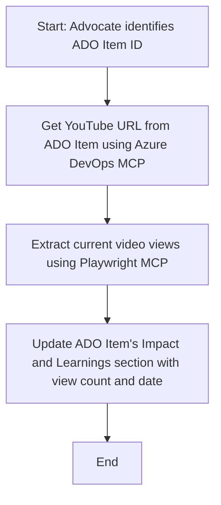

<!--
CO_OP_TRANSLATOR_METADATA:
{
  "original_hash": "14a2dfbea55ef735660a06bd6bdfe5f3",
  "translation_date": "2025-10-11T12:37:55+00:00",
  "source_file": "09-CaseStudy/UpdateADOItemsFromYT.md",
  "language_code": "et"
}
-->
# Juhtumiuuring: Azure DevOps üksuste uuendamine YouTube'i andmetega MCP abil

> **Vastutusest loobumine:** Olemas on veebipõhised tööriistad ja aruanded, mis automatiseerivad Azure DevOps üksuste uuendamise protsessi platvormide, nagu YouTube, andmetega. Järgnevat stsenaariumi esitatakse ainult näidisjuhtumina, et illustreerida, kuidas MCP tööriistu saab kasutada automatiseerimise ja integreerimise ülesannete jaoks.

## Ülevaade

See juhtumiuuring näitab üht näidet, kuidas Model Context Protocol (MCP) ja selle tööriistu saab kasutada Azure DevOps (ADO) tööüksuste uuendamise automatiseerimiseks, kasutades teavet, mis pärineb veebiplatvormidelt, nagu YouTube. Kirjeldatud stsenaarium on vaid üks illustratsioon nende tööriistade laiematest võimalustest, mida saab kohandada paljudele sarnastele automatiseerimisvajadustele.

Näites jälgib advokaat veebisessioone, kasutades ADO üksusi, kus iga üksus sisaldab YouTube'i video URL-i. MCP tööriistade abil saab advokaat hoida ADO üksusi ajakohasena, lisades neile uusimad videomeetrikad, nagu vaatamiste arv, korduvate ja automatiseeritud protsesside kaudu. Seda lähenemist saab üldistada ka teistele juhtumitele, kus veebiallikatest pärit teavet tuleb integreerida ADO-sse või teistesse süsteemidesse.

## Stsenaarium

Advokaat vastutab veebisessioonide ja kogukonna kaasamiste mõju jälgimise eest. Iga sessioon logitakse ADO tööüksusena projektis 'DevRel', kus tööüksus sisaldab välja YouTube'i video URL-i. Sessiooni ulatuse täpseks aruandluseks peab advokaat uuendama ADO üksust, lisades praeguse videovaatamiste arvu ja kuupäeva, millal see teave hangiti.

## Kasutatud tööriistad

- [Azure DevOps MCP](https://github.com/microsoft/azure-devops-mcp): Võimaldab MCP kaudu ADO tööüksustele programmilist juurdepääsu ja nende uuendamist.
- [Playwright MCP](https://github.com/microsoft/playwright-mcp): Automatiseerib brauseri toiminguid, et hankida reaalajas andmeid veebilehtedelt, näiteks YouTube'i videostatistikat.

## Samm-sammuline töövoog

1. **ADO üksuse tuvastamine**: Alusta ADO tööüksuse ID-ga (nt 1234) projektis 'DevRel'.
2. **YouTube'i URL-i hankimine**: Kasuta Azure DevOps MCP tööriista, et saada tööüksusest YouTube'i URL.
3. **Videovaatamiste arvu väljavõtmine**: Kasuta Playwright MCP tööriista, et navigeerida YouTube'i URL-ile ja hankida praegune vaatamiste arv.
4. **ADO üksuse uuendamine**: Kirjuta uusim vaatamiste arv ja hankimise kuupäev ADO tööüksuse jaotisse 'Impact and Learnings', kasutades Azure DevOps MCP tööriista.

## Näidisviip

```bash
- Work with the ADO Item ID: 1234
- The project is '2025-Awesome'
- Get the YouTube URL for the ADO item
- Use Playwright to get the current views from the YouTube video
- Update the ADO item with the current video views and the updated date of the information
```

## Mermaid vooskeem



## Tehniline teostus

- **MCP orkestreerimine**: Töövoogu juhib MCP server, mis koordineerib nii Azure DevOps MCP kui ka Playwright MCP tööriistade kasutamist.
- **Automatiseerimine**: Protsessi saab käivitada käsitsi või ajastada regulaarselt töötama, et hoida ADO üksused ajakohasena.
- **Laiendatavus**: Sama mustrit saab laiendada, et uuendada ADO üksusi teiste veebimõõdikute (nt meeldimised, kommentaarid) või teiste platvormide andmetega.

## Tulemused ja mõju

- **Tõhusus**: Vähendab advokaatide käsitsi tööd, automatiseerides videomeetrikate hankimise ja uuendamise.
- **Täpsus**: Tagab, et ADO üksused kajastavad kõige ajakohasemat veebiallikatest saadavat teavet.
- **Korduvus**: Pakub korduvkasutatavat töövoogu sarnaste stsenaariumide jaoks, mis hõlmavad muid andmeallikaid või mõõdikuid.

## Viited

- [Azure DevOps MCP](https://github.com/microsoft/azure-devops-mcp)
- [Playwright MCP](https://github.com/microsoft/playwright-mcp)
- [Model Context Protocol (MCP)](https://modelcontextprotocol.io/)

---

**Lahtiütlus**:  
See dokument on tõlgitud AI tõlketeenuse [Co-op Translator](https://github.com/Azure/co-op-translator) abil. Kuigi püüame tagada täpsust, palume arvestada, et automaatsed tõlked võivad sisaldada vigu või ebatäpsusi. Algne dokument selle algses keeles tuleks pidada autoriteetseks allikaks. Olulise teabe puhul soovitame kasutada professionaalset inimtõlget. Me ei vastuta selle tõlke kasutamisest tulenevate arusaamatuste või valesti tõlgenduste eest.