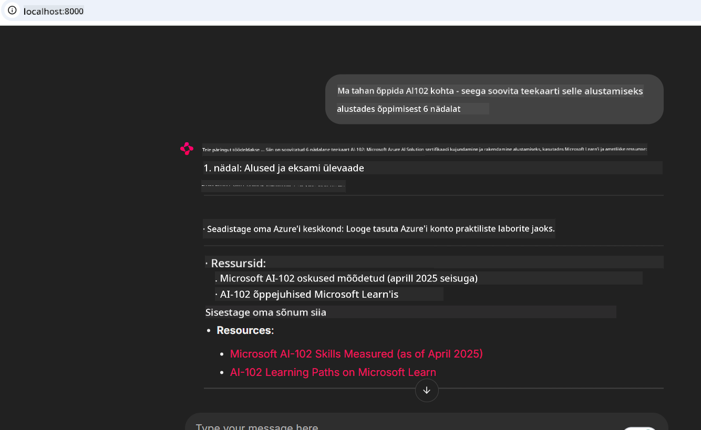
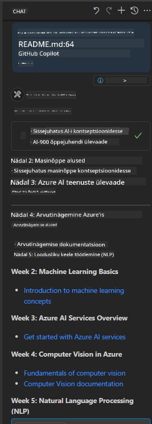

<!--
CO_OP_TRANSLATOR_METADATA:
{
  "original_hash": "4319d291c9d124ecafea52b3d04bfa0e",
  "translation_date": "2025-10-11T12:38:33+00:00",
  "source_file": "09-CaseStudy/docs-mcp/README.md",
  "language_code": "et"
}
-->
# Juhtumiuuring: Ühenduse loomine Microsoft Learn Docs MCP serveriga kliendi kaudu

Kas oled kunagi leidnud end dokumentatsioonisaitide, Stack Overflow ja lõputute otsingumootori vahekaartide vahel laveerimas, püüdes samal ajal oma koodis probleemi lahendada? Võib-olla hoiad teist monitori ainult dokumentatsiooni jaoks või vahetad pidevalt alt-tabiga oma IDE ja brauseri vahel. Kas poleks parem, kui saaksid tuua dokumentatsiooni otse oma töövoogu—integreerituna oma rakendustesse, IDE-sse või isegi oma kohandatud tööriistadesse? Selles juhtumiuuringus uurime, kuidas seda täpselt teha, luues ühenduse Microsoft Learn Docs MCP serveriga otse oma kliendirakendusest.

## Ülevaade

Kaasaegne arendus ei seisne ainult koodi kirjutamises—see hõlmab õige teabe leidmist õigel ajal. Dokumentatsioon on kõikjal, kuid harva seal, kus seda kõige rohkem vaja on: sinu tööriistades ja töövoogudes. Dokumentatsiooni otsese integreerimisega oma rakendustesse saad säästa aega, vähendada konteksti vahetamist ja suurendada produktiivsust. Selles osas näitame, kuidas luua ühendus Microsoft Learn Docs MCP serveriga, et pääseda reaalajas ja kontekstitundlikule dokumentatsioonile ligi ilma rakendusest lahkumata.

Läbime protsessi, kuidas luua ühendus, saata päring ja käsitleda voogesituse vastuseid tõhusalt. See lähenemine mitte ainult ei lihtsusta töövoogu, vaid avab ka ukse nutikamate ja kasulikumate arendustööriistade loomiseks.

## Õpieesmärgid

Miks me seda teeme? Sest parimad arendajakogemused on need, mis eemaldavad takistused. Kujuta ette maailma, kus sinu koodiredaktor, vestlusrobot või veebirakendus suudab dokumentatsiooniküsimustele koheselt vastata, kasutades Microsoft Learn'i uusimat sisu. Selle peatüki lõpuks oskad:

- Mõista MCP serveri ja kliendi vahelise suhtluse põhitõdesid dokumentatsiooni jaoks
- Rakendada konsooli- või veebirakendust, et luua ühendus Microsoft Learn Docs MCP serveriga
- Kasutada voogesituse HTTP kliente reaalajas dokumentatsiooni hankimiseks
- Logida ja tõlgendada dokumentatsiooni vastuseid oma rakenduses

Näed, kuidas need oskused aitavad sul luua tööriistu, mis pole mitte ainult reaktiivsed, vaid tõeliselt interaktiivsed ja kontekstitundlikud.

## Stsenaarium 1 - Reaalajas dokumentatsiooni hankimine MCP-ga

Selles stsenaariumis näitame, kuidas luua kliendiühendus Microsoft Learn Docs MCP serveriga, et pääseda reaalajas ja kontekstitundlikule dokumentatsioonile ligi ilma rakendusest lahkumata.

Võtame selle praktikas ette. Sinu ülesanne on kirjutada rakendus, mis ühendub Microsoft Learn Docs MCP serveriga, kutsub `microsoft_docs_search` tööriista ja logib voogesituse vastuse konsooli.

### Miks just see lähenemine?
Sest see on alus keerukamate integratsioonide loomiseks—olgu selleks vestlusrobot, IDE laiendus või veebidashboard.

Leiad koodi ja juhised selle stsenaariumi jaoks [`solution`](./solution/README.md) kaustast selle juhtumiuuringu raames. Sammud juhendavad sind ühenduse loomisel:
- Kasuta ametlikku MCP SDK-d ja voogesituse HTTP klienti ühenduse loomiseks
- Kutsu `microsoft_docs_search` tööriista päringuga dokumentatsiooni hankimiseks
- Rakenda korrektne logimine ja vigade käsitlemine
- Loo interaktiivne konsooliliides, mis võimaldab kasutajatel sisestada mitu otsingupäringut

See stsenaarium demonstreerib, kuidas:
- Ühendada Docs MCP serveriga
- Saata päring
- Parsida ja kuvada tulemused

Siin on näide lahenduse käivitamisest:

```
Prompt> What is Azure Key Vault?
Answer> Azure Key Vault is a cloud service for securely storing and accessing secrets. ...
```

Allpool on minimaalne näidislahendus. Täielik kood ja üksikasjad on saadaval lahenduse kaustas.

<details>
<summary>Python</summary>

```python
import asyncio
from mcp.client.streamable_http import streamablehttp_client
from mcp import ClientSession

async def main():
    async with streamablehttp_client("https://learn.microsoft.com/api/mcp") as (read_stream, write_stream, _):
        async with ClientSession(read_stream, write_stream) as session:
            await session.initialize()
            result = await session.call_tool("microsoft_docs_search", {"query": "Azure Functions best practices"})
            print(result.content)

if __name__ == "__main__":
    asyncio.run(main())
```

- Täieliku rakenduse ja logimise jaoks vaata [`scenario1.py`](../../../../09-CaseStudy/docs-mcp/solution/python/scenario1.py).
- Paigaldamise ja kasutamise juhised leiad [`README.md`](./solution/python/README.md) failist samas kaustas.
</details>

## Stsenaarium 2 - Interaktiivne õppeplaani generaator veebirakendusega MCP abil

Selles stsenaariumis õpid, kuidas integreerida Docs MCP veebiarendusprojekti. Eesmärk on võimaldada kasutajatel otsida Microsoft Learn dokumentatsiooni otse veebiliidesest, muutes dokumentatsiooni koheselt kättesaadavaks sinu rakenduses või saidil.

Õpid, kuidas:
- Seadistada veebirakendust
- Ühendada Docs MCP serveriga
- Käsitleda kasutaja sisestust ja kuvada tulemusi

Siin on näide lahenduse käivitamisest:

```
User> I want to learn about AI102 - so suggest the roadmap to get it started from learn for 6 weeks

Assistant> Here’s a detailed 6-week roadmap to start your preparation for the AI-102: Designing and Implementing a Microsoft Azure AI Solution certification, using official Microsoft resources and focusing on exam skills areas:

---
## Week 1: Introduction & Fundamentals
- **Understand the Exam**: Review the [AI-102 exam skills outline](https://learn.microsoft.com/en-us/credentials/certifications/exams/ai-102/).
- **Set up Azure**: Sign up for a free Azure account if you don't have one.
- **Learning Path**: [Introduction to Azure AI services](https://learn.microsoft.com/en-us/training/modules/intro-to-azure-ai/)
- **Focus**: Get familiar with Azure portal, AI capabilities, and necessary tools.

....more weeks of the roadmap...

Let me know if you want module-specific recommendations or need more customized weekly tasks!
```

Allpool on minimaalne näidislahendus. Täielik kood ja üksikasjad on saadaval lahenduse kaustas.



<details>
<summary>Python (Chainlit)</summary>

Chainlit on raamistik vestlusrobotite ja interaktiivsete AI veebirakenduste loomiseks. See muudab MCP tööriistade kutsumise ja tulemuste reaalajas kuvamise lihtsaks. Ideaalne kiireks prototüüpimiseks ja kasutajasõbralike liideste loomiseks.

```python
import chainlit as cl
import requests

MCP_URL = "https://learn.microsoft.com/api/mcp"

@cl.on_message
def handle_message(message):
    query = {"question": message}
    response = requests.post(MCP_URL, json=query)
    if response.ok:
        result = response.json()
        cl.Message(content=result.get("answer", "No answer found.")).send()
    else:
        cl.Message(content="Error: " + response.text).send()
```

- Täieliku rakenduse jaoks vaata [`scenario2.py`](../../../../09-CaseStudy/docs-mcp/solution/python/scenario2.py).
- Seadistamise ja käivitamise juhised leiad [`README.md`](./solution/python/README.md).
</details>

## Stsenaarium 3: Dokumentatsioon otse VS Code'is MCP serveriga

Kui soovid saada Microsoft Learn dokumentatsiooni otse oma VS Code'i (ilma brauseri vahekaartide vahel vahetamata), saad kasutada MCP serverit oma redaktoris. See võimaldab:
- Otsida ja lugeda dokumentatsiooni VS Code'is ilma koodikeskkonnast lahkumata.
- Viidata dokumentatsioonile ja lisada linke otse oma README või kursusefailidesse.
- Kasutada GitHub Copilotit ja MCP-d koos sujuvaks, AI-põhiseks dokumentatsioonitöövooguks.

**Õpid, kuidas:**
- Lisada kehtiv `.vscode/mcp.json` fail oma tööruumi juurkausta (vt näidet allpool).
- Avada MCP paneel või kasutada VS Code'i käsupaletti dokumentatsiooni otsimiseks ja lisamiseks.
- Viidata dokumentatsioonile otse markdown-failides töötamise ajal.
- Kombineerida see töövoog GitHub Copilotiga veelgi suurema produktiivsuse saavutamiseks.

Siin on näide, kuidas seadistada MCP server VS Code'is:

```json
{
  "servers": {
    "LearnDocsMCP": {
      "url": "https://learn.microsoft.com/api/mcp"
    }
  }
}
```

</details>

> Üksikasjaliku juhendi koos ekraanipiltide ja samm-sammulise juhendiga leiad [`README.md`](./solution/scenario3/README.md).



See lähenemine sobib ideaalselt kõigile, kes loovad tehnilisi kursusi, kirjutavad dokumentatsiooni või arendavad koodi sagedaste viidete vajadusega.

## Peamised järeldused

Dokumentatsiooni integreerimine otse oma tööriistadesse pole lihtsalt mugavus—see on produktiivsuse mängumuutja. Ühenduse loomisega Microsoft Learn Docs MCP serveriga oma kliendi kaudu saad:

- Likvideerida konteksti vahetamise koodi ja dokumentatsiooni vahel
- Hankida ajakohast ja kontekstitundlikku dokumentatsiooni reaalajas
- Luua nutikamaid ja interaktiivsemaid arendustööriistu

Need oskused aitavad sul luua lahendusi, mis pole mitte ainult tõhusad, vaid ka meeldivad kasutada.

## Täiendavad ressursid

Et oma teadmisi süvendada, tutvu nende ametlike ressurssidega:

- [Microsoft Learn Docs MCP Server (GitHub)](https://github.com/MicrosoftDocs/mcp)
- [Alustamine Azure MCP Serveriga (mcp-python)](https://learn.microsoft.com/en-us/azure/developer/azure-mcp-server/get-started#create-the-python-app)
- [Mis on Azure MCP Server?](https://learn.microsoft.com/en-us/azure/developer/azure-mcp-server/)
- [Model Context Protocol (MCP) Sissejuhatus](https://modelcontextprotocol.io/introduction)
- [Lisa MCP Serveri pluginaid (Python)](https://learn.microsoft.com/en-us/semantic-kernel/concepts/plugins/adding-mcp-plugins)

---

**Lahtiütlus**:  
See dokument on tõlgitud, kasutades AI tõlketeenust [Co-op Translator](https://github.com/Azure/co-op-translator). Kuigi püüame tagada täpsust, palun arvestage, et automaatsed tõlked võivad sisaldada vigu või ebatäpsusi. Algne dokument selle algses keeles tuleks lugeda autoriteetseks allikaks. Olulise teabe puhul on soovitatav kasutada professionaalset inimtõlget. Me ei vastuta selle tõlke kasutamisest tulenevate arusaamatuste või valede tõlgenduste eest.