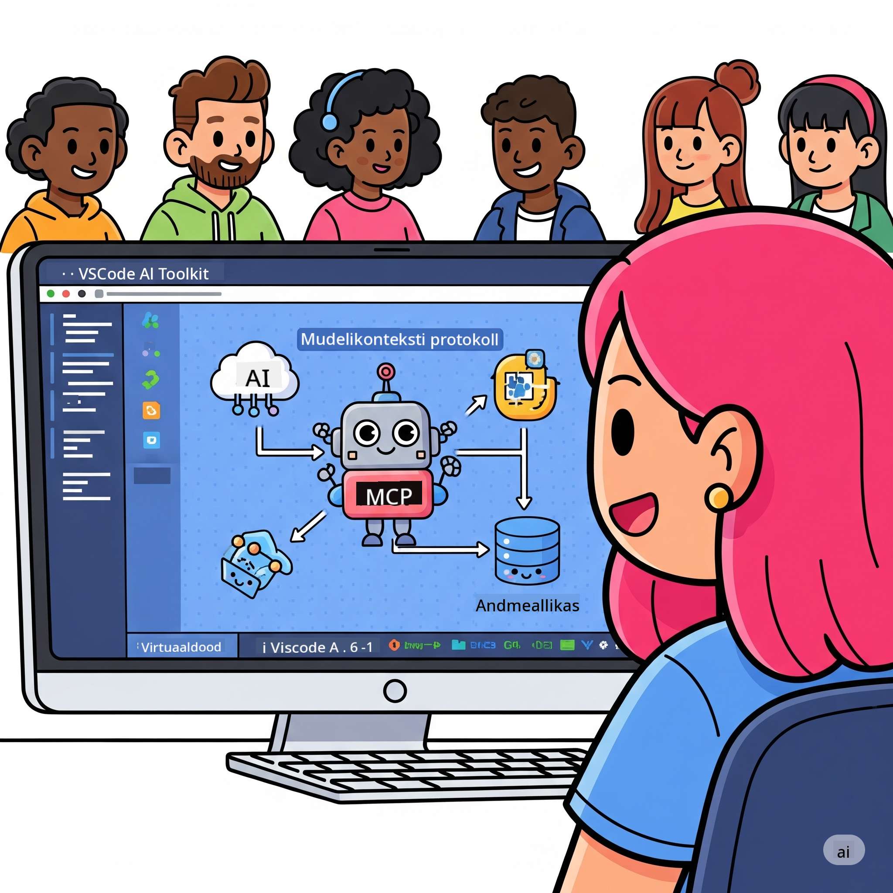
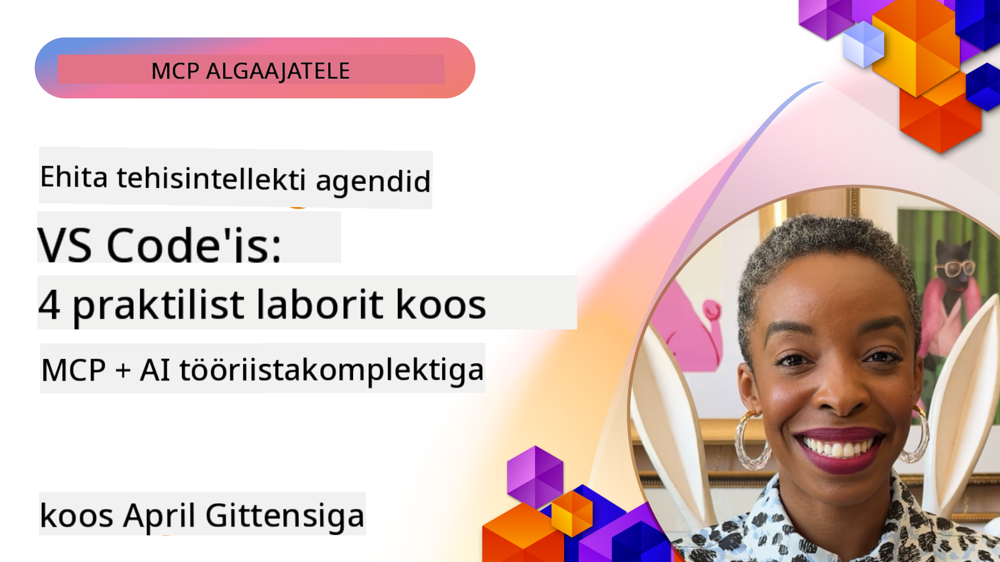

<!--
CO_OP_TRANSLATOR_METADATA:
{
  "original_hash": "1b000fd6e1b04c047578bfc5d07d54eb",
  "translation_date": "2025-10-11T11:21:58+00:00",
  "source_file": "10-StreamliningAIWorkflowsBuildingAnMCPServerWithAIToolkit/README.md",
  "language_code": "et"
}
-->
# AI-töövoogude optimeerimine: MCP-serveri loomine AI Toolkitiga

## 🎯 Ülevaade

_(Klõpsa ülaloleval pildil, et vaadata selle õppetunni videot)_

Tere tulemast **Model Context Protocol (MCP) töötoale**! See põhjalik praktiline töötuba ühendab kaks tipptasemel tehnoloogiat, et viia AI-rakenduste arendus uuele tasemele:

- **🔗 Model Context Protocol (MCP)**: Avatud standard AI-tööriistade sujuvaks integreerimiseks
- **🛠️ AI Toolkit Visual Studio Code'ile (AITK)**: Microsofti võimas AI-arenduse laiendus

### 🎓 Mida õpid

Töötoa lõpuks oled omandanud oskused luua intelligentseid rakendusi, mis ühendavad AI-mudelid reaalmaailma tööriistade ja teenustega. Alates automatiseeritud testimisest kuni kohandatud API-integratsioonideni saad praktilisi oskusi keeruliste äriprobleemide lahendamiseks.

## 🏗️ Tehnoloogiline virn

### 🔌 Model Context Protocol (MCP)

MCP on **"USB-C AI jaoks"** – universaalne standard, mis ühendab AI-mudelid väliste tööriistade ja andmeallikatega.

**✨ Põhifunktsioonid:**

- 🔄 **Standardiseeritud integratsioon**: Universaalne liides AI-tööriistade ühendamiseks
- 🏛️ **Paindlik arhitektuur**: Kohalikud ja kaugserverid stdio/SSE transpordi kaudu
- 🧰 **Rikas ökosüsteem**: Tööriistad, juhendid ja ressursid ühes protokollis
- 🔒 **Ettevõttevalmidus**: Sisseehitatud turvalisus ja töökindlus

**🎯 Miks MCP on oluline:**
Nii nagu USB-C kõrvaldas kaablite kaose, kõrvaldab MCP AI-integratsioonide keerukuse. Üks protokoll, lõputud võimalused.

### 🤖 AI Toolkit Visual Studio Code'ile (AITK)

Microsofti lipulaev AI-arenduse laienduste seas, mis muudab VS Code'i AI-tööriistade keskuseks.

**🚀 Põhivõimalused:**

- 📦 **Mudelikataloog**: Juurdepääs mudelitele Azure AI-st, GitHubist, Hugging Face'ist, Ollamast
- ⚡ **Kohalik järeldamine**: ONNX-optimeeritud CPU/GPU/NPU täitmine
- 🏗️ **Agendi ehitaja**: Visuaalne AI-agentide arendus MCP integratsiooniga
- 🎭 **Mitme modaalne**: Teksti, visiooni ja struktureeritud väljundi tugi

**💡 Arenduse eelised:**

- Nullkonfiguratsiooniga mudelite juurutamine
- Visuaalne juhendite loomine
- Reaalajas testimise mänguväljak
- Sujuv MCP-serveri integreerimine

## 📚 Õppereis

### [🚀 Moodul 1: AI Toolkiti alused](./lab1/README.md)

**Kestus**: 15 minutit

- 🛠️ AI Toolkiti installimine ja seadistamine VS Code'is
- 🗂️ Mudelikataloogi uurimine (100+ mudelit GitHubist, ONNXist, OpenAI-st, Anthropicust, Google'ist)
- 🎮 Reaalajas mudelite testimise interaktiivse mänguväljaku valdamine
- 🤖 Esimese AI-agendi loomine Agendi ehitajaga
- 📊 Mudelite jõudluse hindamine sisseehitatud mõõdikutega (F1, asjakohasus, sarnasus, sidusus)
- ⚡ Partii töötlemise ja mitme modaalsuse tugi

**🎯 Õpitulemus**: Funktsionaalse AI-agendi loomine ja AITK võimaluste põhjalik mõistmine

### [🌐 Moodul 2: MCP ja AI Toolkiti alused](./lab2/README.md)

**Kestus**: 20 minutit

- 🧠 Model Context Protocol (MCP) arhitektuuri ja kontseptsioonide valdamine
- 🌐 Microsofti MCP-serveri ökosüsteemi uurimine
- 🤖 Brauseri automatiseerimisagendi loomine Playwright MCP-serveri abil
- 🔧 MCP-serverite integreerimine AI Toolkiti Agendi ehitajaga
- 📊 MCP-tööriistade konfigureerimine ja testimine oma agentides
- 🚀 MCP-toega agentide eksportimine ja juurutamine tootmiskeskkonda

**🎯 Õpitulemus**: AI-agendi juurutamine, mis on täiustatud väliste tööriistadega MCP kaudu

### [🔧 Moodul 3: Edasijõudnud MCP arendus AI Toolkitiga](./lab3/README.md)

**Kestus**: 20 minutit

- 💻 Kohandatud MCP-serverite loomine AI Toolkiti abil
- 🐍 Uusima MCP Python SDK (v1.9.3) konfigureerimine ja kasutamine
- 🔍 MCP Inspectori seadistamine ja kasutamine silumiseks
- 🛠️ Ilmateate MCP-serveri loomine professionaalsete silumisvoogudega
- 🧪 MCP-serverite silumine nii Agendi ehitajas kui ka Inspectori keskkonnas

**🎯 Õpitulemus**: Kohandatud MCP-serverite arendamine ja silumine kaasaegsete tööriistadega

### [🐙 Moodul 4: Praktiline MCP arendus - kohandatud GitHubi klooniserver](./lab4/README.md)

**Kestus**: 30 minutit

- 🏗️ Reaalmaailma GitHubi klooniserveri loomine arendustöövoogude jaoks
- 🔄 Nutika repositooriumi kloonimise rakendamine valideerimise ja veakäsitlusega
- 📁 Intelligente kataloogihaldus ja VS Code'i integreerimine
- 🤖 GitHub Copilot Agendi režiimi kasutamine kohandatud MCP-tööriistadega
- 🛡️ Tootmiskindluse ja platvormideülese ühilduvuse rakendamine

**🎯 Õpitulemus**: Tootmiskõlbuliku MCP-serveri juurutamine, mis optimeerib arendustöövooge

## 💡 Reaalmaailma rakendused ja mõju

### 🏢 Ettevõtte kasutusjuhtumid

#### 🔄 DevOps automatiseerimine

Muutke oma arendustöövoog intelligentse automatiseerimise abil:

- **Nutikas repositooriumihaldus**: AI-põhine koodide ülevaatus ja liitmisotsused
- **Intelligentne CI/CD**: Automaatne torujuhtme optimeerimine koodimuudatuste põhjal
- **Probleemide sorteerimine**: Automaatne vigade klassifitseerimine ja määramine

#### 🧪 Kvaliteedi tagamise revolutsioon

Tõstke testimist AI-põhise automatiseerimisega:

- **Intelligentne testide genereerimine**: Looge automaatselt põhjalikud testikomplektid
- **Visuaalne regressioonitestimine**: AI-põhine kasutajaliidese muudatuste tuvastamine
- **Jõudluse jälgimine**: Proaktiivne probleemide tuvastamine ja lahendamine

#### 📊 Andmetöötluse intelligentsus

Looge nutikamaid andmetöötlusvooge:

- **Kohanduvad ETL-protsessid**: Iseoptimeeruvad andmete teisendused
- **Anomaaliate tuvastamine**: Reaalajas andmekvaliteedi jälgimine
- **Intelligentne suunamine**: Nutikas andmevoo haldamine

#### 🎧 Kliendikogemuse täiustamine

Looge erakordseid kliendikogemusi:

- **Kontekstiteadlik tugi**: AI-agendid, kellel on juurdepääs kliendi ajaloole
- **Proaktiivne probleemide lahendamine**: Ennustav klienditeenindus
- **Mitmekanaliline integreerimine**: Ühtne AI-kogemus erinevatel platvormidel

## 🛠️ Eeltingimused ja seadistamine

### 💻 Süsteeminõuded

| Komponent | Nõue | Märkused |
|-----------|-------------|-------|
| **Operatsioonisüsteem** | Windows 10+, macOS 10.15+, Linux | Kaasaegne OS |
| **Visual Studio Code** | Viimane stabiilne versioon | Vajalik AITK jaoks |
| **Node.js** | v18.0+ ja npm | MCP-serveri arenduseks |
| **Python** | 3.10+ | Valikuline Python MCP-serverite jaoks |
| **Mälu** | Minimaalselt 8GB RAM | 16GB soovitatav kohalike mudelite jaoks |

### 🔧 Arenduskeskkond

#### Soovitatavad VS Code'i laiendused

- **AI Toolkit** (ms-windows-ai-studio.windows-ai-studio)
- **Python** (ms-python.python)
- **Python Debugger** (ms-python.debugpy)
- **GitHub Copilot** (GitHub.copilot) - Valikuline, kuid kasulik

#### Valikulised tööriistad

- **uv**: Kaasaegne Python pakettide haldur
- **MCP Inspector**: Visuaalne silumistööriist MCP-serverite jaoks
- **Playwright**: Veebiautomaatika näidete jaoks

## 🎖️ Õpitulemused ja sertifitseerimise tee

### 🏆 Oskuste omandamise kontrollnimekiri

Töötoa läbimisega saavutad meisterlikkuse järgmistes valdkondades:

#### 🎯 Põhipädevused

- [ ] **MCP protokolli valdamine**: Sügav arusaam arhitektuurist ja rakendusmustritest
- [ ] **AITK oskuslik kasutamine**: Ekspertide tasemel AI Toolkiti kasutamine kiireks arenduseks
- [ ] **Kohandatud serverite arendus**: MCP-serverite loomine, juurutamine ja hooldamine
- [ ] **Tööriistade integreerimise meisterlikkus**: AI sujuv ühendamine olemasolevate arendustöövoogudega
- [ ] **Probleemide lahendamise rakendamine**: Õpitud oskuste rakendamine reaalsetes äriprobleemides

#### 🔧 Tehnilised oskused

- [ ] AI Toolkiti seadistamine ja konfigureerimine VS Code'is
- [ ] Kohandatud MCP-serverite kujundamine ja rakendamine
- [ ] GitHubi mudelite integreerimine MCP arhitektuuriga
- [ ] Automatiseeritud testimisvoogude loomine Playwrightiga
- [ ] AI-agentide juurutamine tootmiskeskkonda
- [ ] MCP-serverite jõudluse silumine ja optimeerimine

#### 🚀 Edasijõudnud võimed

- [ ] Ettevõtte tasemel AI-integratsioonide arhitektuur
- [ ] AI-rakenduste turvaparimate tavade rakendamine
- [ ] Skaleeritavate MCP-serveri arhitektuuride kujundamine
- [ ] Kohandatud tööriistakettide loomine spetsiifilistele valdkondadele
- [ ] Teiste juhendamine AI-põhises arenduses

## 📖 Lisamaterjalid

- [MCP spetsifikatsioon](https://modelcontextprotocol.io/docs)
- [AI Toolkiti GitHubi repositoorium](https://github.com/microsoft/vscode-ai-toolkit)
- [Näidete MCP-serverite kogu](https://github.com/modelcontextprotocol/servers)
- [Parimate tavade juhend](https://modelcontextprotocol.io/docs/best-practices)

---

**🚀 Valmis oma AI-arenduse töövoogu revolutsioneerima?**

Loome koos MCP ja AI Toolkiti abil intelligentsete rakenduste tuleviku!

---

**Lahtiütlus**:  
See dokument on tõlgitud AI tõlketeenuse [Co-op Translator](https://github.com/Azure/co-op-translator) abil. Kuigi püüame tagada täpsust, palume arvestada, et automaatsed tõlked võivad sisaldada vigu või ebatäpsusi. Algne dokument selle algses keeles tuleks pidada autoriteetseks allikaks. Olulise teabe puhul soovitame kasutada professionaalset inimtõlget. Me ei vastuta selle tõlke kasutamisest tulenevate arusaamatuste või valesti tõlgenduste eest.