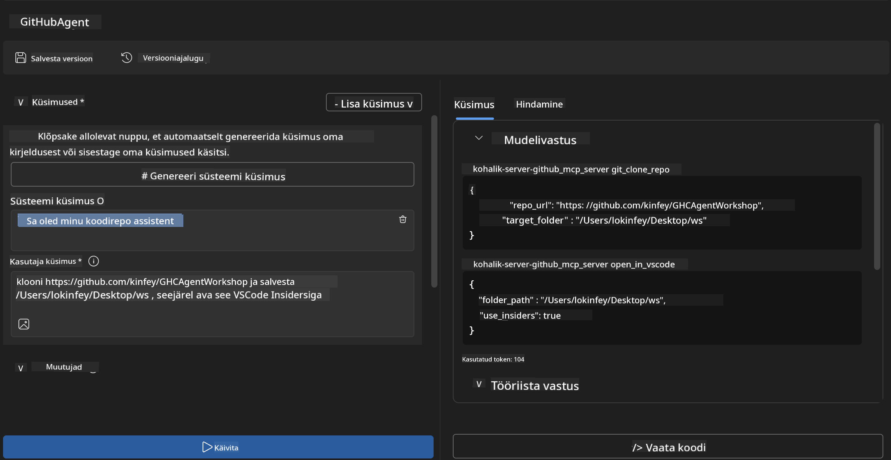
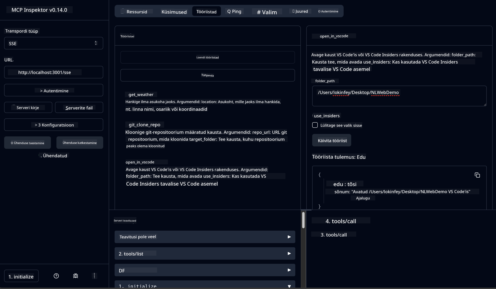

<!--
CO_OP_TRANSLATOR_METADATA:
{
  "original_hash": "f83bc722dc758efffd68667d6a1db470",
  "translation_date": "2025-10-11T11:25:03+00:00",
  "source_file": "10-StreamliningAIWorkflowsBuildingAnMCPServerWithAIToolkit/lab4/README.md",
  "language_code": "et"
}
-->
# 🐙 Moodul 4: Praktiline MCP arendus - Kohandatud GitHub klooniserver


> **⚡ Kiire algus:** Ehita tootmisvalmis MCP server, mis automatiseerib GitHubi repositooriumide kloonimise ja VS Code integratsiooni vaid 30 minutiga!

## 🎯 Õpieesmärgid

Selle labori lõpuks suudad:

- ✅ Luua kohandatud MCP serveri, mis sobib päriselu arendustöövoogudega
- ✅ Rakendada GitHubi repositooriumide kloonimise funktsionaalsust MCP kaudu
- ✅ Integreerida kohandatud MCP serverid VS Code'i ja Agent Builderiga
- ✅ Kasutada GitHub Copilot Agent Mode'i koos kohandatud MCP tööriistadega
- ✅ Testida ja juurutada kohandatud MCP servereid tootmiskeskkondades

## 📋 Eeltingimused

- Laborite 1-3 läbimine (MCP põhialused ja edasijõudnud arendus)
- GitHub Copilot tellimus ([tasuta registreerimine saadaval](https://github.com/github-copilot/signup))
- VS Code koos AI Toolkit'i ja GitHub Copilot laiendustega
- Git CLI paigaldatud ja seadistatud

## 🏗️ Projekti ülevaade

### **Päriselu arenduse väljakutse**
Arendajatena kasutame sageli GitHubi repositooriumide kloonimiseks ja nende avamiseks VS Code'is või VS Code Insiders'is. See käsitsi protsess hõlmab:
1. Terminali/käsurea avamist
2. Soovitud kataloogi liikumist
3. `git clone` käsu käivitamist
4. VS Code'i avamist kloonitud kataloogis

**Meie MCP lahendus lihtsustab seda üheks intelligentseks käsuks!**

### **Mida sa ehitad**
**GitHub kloonimise MCP server** (`git_mcp_server`), mis pakub:

| Funktsioon | Kirjeldus | Eelis |
|------------|-----------|-------|
| 🔄 **Nutikas repositooriumide kloonimine** | Klooni GitHubi repositooriumid valideerimisega | Automatiseeritud vigade kontroll |
| 📁 **Intelligentne kataloogihaldus** | Kontrolli ja loo katalooge turvaliselt | Väldib ülekirjutamist |
| 🚀 **Platvormidevaheline VS Code integratsioon** | Ava projektid VS Code'is/Insiders'is | Sujuv töövoo üleminek |
| 🛡️ **Tugev veakäsitlus** | Lahenda võrgu-, õiguste- ja teekonna probleemid | Tootmisvalmis usaldusväärsus |

---

## 📖 Samm-sammuline rakendamine

### Samm 1: Loo GitHubi agent Agent Builderis

1. **Käivita Agent Builder** AI Toolkit'i laienduse kaudu
2. **Loo uus agent** järgmise konfiguratsiooniga:
   ```
   Agent Name: GitHubAgent
   ```

3. **Initsialiseeri kohandatud MCP server:**
   - Liigu **Tools** → **Add Tool** → **MCP Server**
   - Vali **"Create A new MCP Server"**
   - Vali **Python template** maksimaalse paindlikkuse jaoks
   - **Serveri nimi:** `git_mcp_server`

### Samm 2: Konfigureeri GitHub Copilot Agent Mode

1. **Ava GitHub Copilot** VS Code'is (Ctrl/Cmd + Shift + P → "GitHub Copilot: Open")
2. **Vali Agent Model** Copiloti liideses
3. **Vali Claude 3.7 mudel** täiustatud põhjendusvõimekuse jaoks
4. **Luba MCP integratsioon** tööriistadele juurdepääsuks

> **💡 Kasulik nõuanne:** Claude 3.7 pakub paremat arusaamist arendustöövoogudest ja veakäsitlusmustritest.

### Samm 3: Rakenda MCP serveri põhifunktsionaalsus

**Kasuta järgmist üksikasjalikku käsku GitHub Copilot Agent Mode'is:**

```
Create two MCP tools with the following comprehensive requirements:

🔧 TOOL A: clone_repository
Requirements:
- Clone any GitHub repository to a specified local folder
- Return the absolute path of the successfully cloned project
- Implement comprehensive validation:
  ✓ Check if target directory already exists (return error if exists)
  ✓ Validate GitHub URL format (https://github.com/user/repo)
  ✓ Verify git command availability (prompt installation if missing)
  ✓ Handle network connectivity issues
  ✓ Provide clear error messages for all failure scenarios

🚀 TOOL B: open_in_vscode
Requirements:
- Open specified folder in VS Code or VS Code Insiders
- Cross-platform compatibility (Windows/Linux/macOS)
- Use direct application launch (not terminal commands)
- Auto-detect available VS Code installations
- Handle cases where VS Code is not installed
- Provide user-friendly error messages

Additional Requirements:
- Follow MCP 1.9.3 best practices
- Include proper type hints and documentation
- Implement logging for debugging purposes
- Add input validation for all parameters
- Include comprehensive error handling
```

### Samm 4: Testi oma MCP serverit

#### 4a. Testimine Agent Builderis

1. **Käivita silumise konfiguratsioon** Agent Builderis
2. **Seadista oma agent järgmise süsteemikäsuga:**

```
SYSTEM_PROMPT:
You are my intelligent coding repository assistant. You help developers efficiently clone GitHub repositories and set up their development environment. Always provide clear feedback about operations and handle errors gracefully.
```

3. **Testi realistlike kasutajastsenaariumidega:**

```
USER_PROMPT EXAMPLES:

Scenario : Basic Clone and Open
"Clone {Your GitHub Repo link such as https://github.com/kinfey/GHCAgentWorkshop
 } and save to {The global path you specify}, then open it with VS Code Insiders"
```



**Oodatud tulemused:**
- ✅ Edukas kloonimine teekonna kinnitusega
- ✅ Automaatne VS Code'i käivitamine
- ✅ Selged veateated kehtetute stsenaariumide korral
- ✅ Korralik äärmuslike juhtumite käsitlus

#### 4b. Testimine MCP Inspectoris



---

**🎉 Palju õnne!** Oled edukalt loonud praktilise, tootmisvalmis MCP serveri, mis lahendab reaalseid arendustöövoo väljakutseid. Sinu kohandatud GitHub klooniserver demonstreerib MCP võimsust arendajate produktiivsuse automatiseerimisel ja parandamisel.

### 🏆 Saavutused:
- ✅ **MCP arendaja** - Loodud kohandatud MCP server
- ✅ **Töövoo automatiseerija** - Lihtsustatud arendusprotsessid  
- ✅ **Integratsiooni ekspert** - Ühendatud mitmed arendustööriistad
- ✅ **Tootmisvalmis** - Loodud juurutatavad lahendused

---

## 🎓 Töötuba lõpetatud: Sinu teekond Model Context Protocoliga

**Lugupeetud töötuba osaleja,**

Palju õnne, et lõpetasid kõik neli Model Context Protocoli töötoa moodulit! Oled jõudnud kaugele, alustades AI Toolkit'i põhimõistete õppimisest kuni tootmisvalmis MCP serverite loomiseni, mis lahendavad reaalseid arenduse väljakutseid.

### 🚀 Sinu õpiteekonna kokkuvõte:

**[Moodul 1](../lab1/README.md)**: Alustasid AI Toolkit'i põhimõistete, mudelite testimise ja oma esimese AI agendi loomisega.

**[Moodul 2](../lab2/README.md)**: Õppisid MCP arhitektuuri, integreerisid Playwright MCP ja ehitasid oma esimese brauseri automatiseerimise agendi.

**[Moodul 3](../lab3/README.md)**: Liikusid edasi kohandatud MCP serveri arendamise juurde, luues Weather MCP serveri ja omandades silumistööriistad.

**[Moodul 4](../lab4/README.md)**: Rakendasid kõike, et luua praktiline GitHubi repositooriumi töövoo automatiseerimise tööriist.

### 🌟 Mida oled omandanud:

- ✅ **AI Toolkit ökosüsteem**: Mudelid, agendid ja integratsioonimustrid
- ✅ **MCP arhitektuur**: Kliendi-serveri disain, transpordiprotokollid ja turvalisus
- ✅ **Arendustööriistad**: Alates Playgroundist kuni Inspectorini ja tootmise juurutamiseni
- ✅ **Kohandatud arendus**: Oma MCP serverite loomine, testimine ja juurutamine
- ✅ **Praktilised rakendused**: Reaalsete töövoo väljakutsete lahendamine AI abil

### 🔮 Sinu järgmised sammud:

1. **Loo oma MCP server**: Rakenda neid oskusi, et automatiseerida oma unikaalseid töövooge
2. **Liitu MCP kogukonnaga**: Jaga oma loomingut ja õpi teistelt
3. **Uuri edasijõudnud integratsioone**: Ühenda MCP serverid ettevõttesüsteemidega
4. **Panusta avatud lähtekoodiga projektidesse**: Aita parandada MCP tööriistu ja dokumentatsiooni

Pea meeles, et see töötuba on alles algus. Model Context Protocoli ökosüsteem areneb kiiresti ja sul on nüüd oskused, et olla AI-põhiste arendustööriistade esirinnas.

**Täname osalemise ja pühendumise eest õppimisele!**

Loodame, et see töötuba on inspireerinud ideid, mis muudavad viisi, kuidas sa ehitad ja suhtled AI tööriistadega oma arendusteekonnal.

**Head kodeerimist!**

---

---

**Lahtiütlus**:  
See dokument on tõlgitud, kasutades AI tõlketeenust [Co-op Translator](https://github.com/Azure/co-op-translator). Kuigi püüame tagada täpsust, palun arvestage, et automaatsed tõlked võivad sisaldada vigu või ebatäpsusi. Algne dokument selle algses keeles tuleks lugeda autoriteetseks allikaks. Olulise teabe puhul on soovitatav kasutada professionaalset inimtõlget. Me ei vastuta selle tõlke kasutamisest tulenevate arusaamatuste või valede tõlgenduste eest.