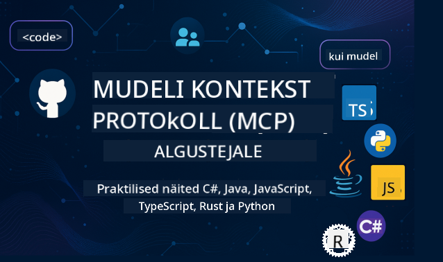

<!--
CO_OP_TRANSLATOR_METADATA:
{
  "original_hash": "0bb2a83ef33c1506d42d73902a95aa0b",
  "translation_date": "2025-10-11T11:14:57+00:00",
  "source_file": "README.md",
  "language_code": "et"
}
-->
 

Järgi neid samme, et alustada nende ressursside kasutamist:
1. **Forki repositoorium**: Klõpsa 
2. **Klooni repositoorium**:   `git clone https://github.com/microsoft/mcp-for-beginners.git`
3. [**Liitu Azure AI Foundry Discordiga ja kohtume ekspertide ning teiste arendajatega**](https://discord.com/invite/ByRwuEEgH4)

### 🌐 Mitmekeelne tugi

#### Toetatud GitHub Actioni kaudu (Automatiseeritud ja alati ajakohane)

<!-- CO-OP TRANSLATOR LANGUAGES TABLE START -->
[Araabia](../ar/README.md) | [Bengali](../bn/README.md) | [Bulgaaria](../bg/README.md) | [Birma (Myanmar)](../my/README.md) | [Hiina (lihtsustatud)](../zh/README.md) | [Hiina (traditsiooniline, Hongkong)](../hk/README.md) | [Hiina (traditsiooniline, Macau)](../mo/README.md) | [Hiina (traditsiooniline, Taiwan)](../tw/README.md) | [Horvaatia](../hr/README.md) | [Tšehhi](../cs/README.md) | [Taani](../da/README.md) | [Hollandi](../nl/README.md) | [Eesti](./README.md) | [Soome](../fi/README.md) | [Prantsuse](../fr/README.md) | [Saksa](../de/README.md) | [Kreeka](../el/README.md) | [Heebrea](../he/README.md) | [Hindi](../hi/README.md) | [Ungari](../hu/README.md) | [Indoneesia](../id/README.md) | [Itaalia](../it/README.md) | [Jaapani](../ja/README.md) | [Korea](../ko/README.md) | [Leedu](../lt/README.md) | [Malai](../ms/README.md) | [Marathi](../mr/README.md) | [Nepali](../ne/README.md) | [Norra](../no/README.md) | [Pärsia (Farsi)](../fa/README.md) | [Poola](../pl/README.md) | [Portugali (Brasiilia)](../br/README.md) | [Portugali (Portugal)](../pt/README.md) | [Punjabi (Gurmukhi)](../pa/README.md) | [Rumeenia](../ro/README.md) | [Vene](../ru/README.md) | [Serbia (kirillitsa)](../sr/README.md) | [Slovaki](../sk/README.md) | [Sloveeni](../sl/README.md) | [Hispaania](../es/README.md) | [Suahiili](../sw/README.md) | [Rootsi](../sv/README.md) | [Tagalogi (Filipino)](../tl/README.md) | [Tamili](../ta/README.md) | [Tai](../th/README.md) | [Türgi](../tr/README.md) | [Ukraina](../uk/README.md) | [Urdu](../ur/README.md) | [Vietnami](../vi/README.md)
<!-- CO-OP TRANSLATOR LANGUAGES TABLE END -->

# 🚀 Mudeli Konteksti Protokolli (MCP) õppekava algajatele

## **Õpi MCP-d praktiliste koodinäidete abil C#, Java, JavaScript, Rust, Python ja TypeScript keeles**

## 🧠 Mudeli Konteksti Protokolli õppekava ülevaade

**Mudeli Konteksti Protokoll (MCP)** on tipptasemel raamistik, mis on loodud standardiseerima suhtlust AI mudelite ja kliendirakenduste vahel. See avatud lähtekoodiga õppekava pakub struktureeritud õpiteekonda, mis sisaldab praktilisi koodinäiteid ja reaalseid kasutusjuhtumeid populaarsetes programmeerimiskeeltes nagu C#, Java, JavaScript, TypeScript ja Python.

Olenemata sellest, kas oled AI arendaja, süsteemi arhitekt või tarkvarainsener, on see juhend sinu põhjalik ressurss MCP põhitõdede ja rakendusstrateegiate omandamiseks.

## 🔗 Ametlikud MCP ressursid

- 📘 [MCP dokumentatsioon](https://modelcontextprotocol.io/) – Üksikasjalikud õpetused ja kasutusjuhendid  
- 📜 [MCP spetsifikatsioon](https://modelcontextprotocol.io/docs/) – Protokolli arhitektuur ja tehnilised viited  
- 📜 [Algne MCP spetsifikatsioon](https://spec.modelcontextprotocol.io/) – Legacy tehnilised viited (võib sisaldada täiendavaid üksikasju)  
- 🧑‍💻 [MCP GitHubi repositoorium](https://github.com/modelcontextprotocol) – Avatud lähtekoodiga SDK-d, tööriistad ja koodinäited
- 🌐 [MCP kogukond](https://github.com/orgs/modelcontextprotocol/discussions) – Liitu aruteludega ja panusta kogukonda

## 🧭 MCP õppekava ülevaade

### 📚 Täielik õppekava struktuur

| Moodul | Teema | Kirjeldus | Link |
|--------|-------|-------------|------|
| **Moodul 1-3: Põhitõed** | | | |
| 00 | MCP tutvustus | Ülevaade Mudeli Konteksti Protokollist ja selle tähtsusest AI torujuhtmetes | [Loe rohkem](./00-Introduction/README.md) |
| 01 | Põhikontseptsioonide selgitus | MCP põhikontseptsioonide põhjalik uurimine | [Loe rohkem](./01-CoreConcepts/README.md) |
| 02 | Turvalisus MCP-s | Turvaohtude ja parimate tavade ülevaade | [Loe rohkem](./02-Security/README.md) |
| 03 | MCP-ga alustamine | Keskkonna seadistamine, põhilised serverid/kliendid, integreerimine | [Loe rohkem](./03-GettingStarted/README.md) |
| **Moodul 3: Esimese serveri ja kliendi loomine** | | | |
| 3.1 | Esimene server | Loo oma esimene MCP server | [Juhend](./03-GettingStarted/01-first-server/README.md) |
| 3.2 | Esimene klient | Arenda põhiline MCP klient | [Juhend](./03-GettingStarted/02-client/README.md) |
| 3.3 | Klient LLM-iga | Integreeri suured keelemudelid | [Juhend](./03-GettingStarted/03-llm-client/README.md) |
| 3.4 | VS Code integratsioon | Kasuta MCP servereid VS Code'is | [Juhend](./03-GettingStarted/04-vscode/README.md) |
| 3.5 | stdio server | Loo servereid stdio transpordi abil | [Juhend](./03-GettingStarted/05-stdio-server/README.md) |
| 3.6 | HTTP voogedastus | Rakenda HTTP voogedastust MCP-s | [Juhend](./03-GettingStarted/06-http-streaming/README.md) |
| 3.7 | AI tööriistakomplekt | Kasuta AI tööriistakomplekti MCP-ga | [Juhend](./03-GettingStarted/07-aitk/README.md) |
| 3.8 | Testimine | Testi oma MCP serveri rakendust | [Juhend](./03-GettingStarted/08-testing/README.md) |
| 3.9 | Juurutamine | Juuruta MCP serverid tootmisesse | [Juhend](./03-GettingStarted/09-deployment/README.md) |
| 3.10 | Täiustatud serveri kasutamine | Kasuta täiustatud servereid keerukamate funktsioonide ja parema arhitektuuri jaoks | [Juhend](./03-GettingStarted/10-advanced/README.md) |
| 3.11 | Lihtne autentimine | Peatükk, mis näitab autentimist algusest ja RBAC-i | [Juhend](./03-GettingStarted/11-simple-auth/README.md) |
| **Moodul 4-5: Praktiline ja täiustatud** | | | |
| 04 | Praktiline rakendamine | SDK-d, silumine, testimine, korduvkasutatavad mallid | [Loe rohkem](./04-PracticalImplementation/README.md) |
| 05 | Täiustatud teemad MCP-s | Multimodaalne AI, skaleerimine, ettevõtte kasutus | [Loe rohkem](./05-AdvancedTopics/README.md) |
| 5.1 | Azure integratsioon | MCP integratsioon Azure'iga | [Juhend](./05-AdvancedTopics/mcp-integration/README.md) |
| 5.2 | Multimodaalsus | Töötamine mitme modaalsusega | [Juhend](./05-AdvancedTopics/mcp-multi-modality/README.md) |
| 5.3 | OAuth2 demo | Rakenda OAuth2 autentimine | [Juhend](./05-AdvancedTopics/mcp-oauth2-demo/README.md) |
| 5.4 | Juurekontekstid | Juurekontekstide mõistmine ja rakendamine | [Juhend](./05-AdvancedTopics/mcp-root-contexts/README.md) |
| 5.5 | Marsruutimine | MCP marsruutimisstrateegiad | [Juhend](./05-AdvancedTopics/mcp-routing/README.md) |
| 5.6 | Proovivõtmine | Proovivõtmise tehnikad MCP-s | [Juhend](./05-AdvancedTopics/mcp-sampling/README.md) |
| 5.7 | Skaleerimine | MCP rakenduste skaleerimine | [Juhend](./05-AdvancedTopics/mcp-scaling/README.md) |
| 5.8 | Turvalisus | Täiustatud turvalisuse kaalutlused | [Juhend](./05-AdvancedTopics/mcp-security/README.md) |
| 5.9 | Veebiotsing | Rakenda veebiotsingu võimalused | [Juhend](./05-AdvancedTopics/web-search-mcp/README.md) |
| 5.10 | Reaalajas voogedastus | Loo reaalajas voogedastuse funktsionaalsus | [Juhend](./05-AdvancedTopics/mcp-realtimestreaming/README.md) |
| 5.11 | Reaalajas otsing | Rakenda reaalajas otsing | [Juhend](./05-AdvancedTopics/mcp-realtimesearch/README.md) |
| 5.12 | Entra ID autentimine | Autentimine Microsoft Entra ID-ga | [Juhend](./05-AdvancedTopics/mcp-security-entra/README.md) |
| 5.13 | Foundry integratsioon | Integreeri Azure AI Foundry-ga | [Juhend](./05-AdvancedTopics/mcp-foundry-agent-integration/README.md) |
| 5.14 | Konteksti inseneritöö | Tõhusad konteksti inseneritöö tehnikad | [Juhend](./05-AdvancedTopics/mcp-contextengineering/README.md) |
| 5.15 | MCP kohandatud transport | Kohandatud transpordi rakendused | [Juhend](./05-AdvancedTopics/mcp-transport/README.md) |
| **Moodul 6-10: Kogukond ja parimad tavad** | | | |
| 06 | Kogukonna panused | Kuidas panustada MCP ökosüsteemi | [Juhend](./06-CommunityContributions/README.md) |
| 07 | Õppetunnid varajasest kasutuselevõtust | Reaalse maailma rakendamise lood | [Juhend](./07-LessonsFromEarlyAdoption/README.md) |
| 08 | MCP parimad tavad | Jõudlus, veakindlus, vastupidavus | [Juhend](./08-BestPractices/README.md) |
| 09 | MCP juhtumiuuringud | Praktilised rakendamise näited | [Juhend](./09-CaseStudy/README.md) |
| 10 | Praktiline töötuba | MCP serveri loomine AI tööriistakomplektiga | [Labor](./10-StreamliningAIWorkflowsBuildingAnMCPServerWithAIToolkit/README.md) |
| **Moodul 11: MCP serveri praktiline labor** | | | |
| 11 | MCP Serveri andmebaasi integreerimine | Põhjalik 13-labori praktiline õppeprogramm PostgreSQL integreerimiseks | [Laborid](./11-MCPServerHandsOnLabs/README.md) |
| 11.1 | Sissejuhatus | Ülevaade MCP-st koos andmebaasi integreerimise ja jaemüügi analüütika kasutusjuhtumiga | [Labor 00](./11-MCPServerHandsOnLabs/00-Introduction/README.md) |
| 11.2 | Põhiarhitektuur | MCP serveri arhitektuuri, andmebaasikihtide ja turvamustrite mõistmine | [Labor 01](./11-MCPServerHandsOnLabs/01-Architecture/README.md) |
| 11.3 | Turvalisus ja mitme rentniku tugi | Reataseme turvalisus, autentimine ja mitme rentniku andmete ligipääs | [Labor 02](./11-MCPServerHandsOnLabs/02-Security/README.md) |
| 11.4 | Keskkonna seadistamine | Arenduskeskkonna, Dockeri ja Azure'i ressursside seadistamine | [Labor 03](./11-MCPServerHandsOnLabs/03-Setup/README.md) |
| 11.5 | Andmebaasi disain | PostgreSQL seadistamine, jaemüügi skeemi disain ja näidisandmed | [Labor 04](./11-MCPServerHandsOnLabs/04-Database/README.md) |
| 11.6 | MCP Serveri rakendamine | FastMCP serveri loomine koos andmebaasi integreerimisega | [Labor 05](./11-MCPServerHandsOnLabs/05-MCP-Server/README.md) |
| 11.7 | Tööriistade arendamine | Andmebaasi päringutööriistade ja skeemi introspektsiooni loomine | [Labor 06](./11-MCPServerHandsOnLabs/06-Tools/README.md) |
| 11.8 | Semantiline otsing | Vektorite sisestuste rakendamine Azure OpenAI ja pgvectoriga | [Labor 07](./11-MCPServerHandsOnLabs/07-Semantic-Search/README.md) |
| 11.9 | Testimine ja silumine | Testimisstrateegiad, silumistööriistad ja valideerimismeetodid | [Labor 08](./11-MCPServerHandsOnLabs/08-Testing/README.md) |
| 11.10 | VS Code integreerimine | VS Code MCP integreerimise ja AI vestluse kasutamise seadistamine | [Labor 09](./11-MCPServerHandsOnLabs/09-VS-Code/README.md) |
| 11.11 | Juurutamisstrateegiad | Dockeri juurutamine, Azure Container Apps ja skaleerimise kaalutlused | [Labor 10](./11-MCPServerHandsOnLabs/10-Deployment/README.md) |
| 11.12 | Jälgimine | Rakenduse Insights, logimine ja jõudluse jälgimine | [Labor 11](./11-MCPServerHandsOnLabs/11-Monitoring/README.md) |
| 11.13 | Parimad praktikad | Jõudluse optimeerimine, turvalisuse tugevdamine ja tootmise näpunäited | [Labor 12](./11-MCPServerHandsOnLabs/12-Best-Practices/README.md) |

### 💻 Näidisprojektid

#### Põhilised MCP kalkulaatori näidised

| Keel | Kirjeldus | Link |
|------|-----------|------|
| C# | MCP Serveri näide | [Vaata koodi](./03-GettingStarted/samples/csharp/README.md) |
| Java | MCP kalkulaator | [Vaata koodi](./03-GettingStarted/samples/java/calculator/README.md) |
| JavaScript | MCP demo | [Vaata koodi](./03-GettingStarted/samples/javascript/README.md) |
| Python | MCP Server | [Vaata koodi](../../03-GettingStarted/samples/python/mcp_calculator_server.py) |
| TypeScript | MCP näide | [Vaata koodi](./03-GettingStarted/samples/typescript/README.md) |
| Rust | MCP näide | [Vaata koodi](./03-GettingStarted/samples/rust/README.md) |

#### Täiustatud MCP rakendused

| Keel | Kirjeldus | Link |
|------|-----------|------|
| C# | Täiustatud näidis | [Vaata koodi](./04-PracticalImplementation/samples/csharp/README.md) |
| Java koos Springiga | Konteinerirakenduse näide | [Vaata koodi](./04-PracticalImplementation/samples/java/containerapp/README.md) |
| JavaScript | Täiustatud näidis | [Vaata koodi](./04-PracticalImplementation/samples/javascript/README.md) |
| Python | Keerukas rakendus | [Vaata koodi](../../04-PracticalImplementation/samples/python/READMEmd) |
| TypeScript | Konteineri näidis | [Vaata koodi](./04-PracticalImplementation/samples/typescript/README.md) |

## 🎯 MCP õppimise eeldused

Selle õppekava maksimaalseks kasutamiseks peaks teil olema:

- Põhiteadmised programmeerimisest vähemalt ühes järgmistest keeltest: C#, Java, JavaScript, Python või TypeScript
- Arusaam kliendi-serveri mudelist ja API-dest
- REST ja HTTP kontseptsioonide tundmine
- (Valikuline) Taust AI/ML kontseptsioonides

- Liitumine meie kogukonna aruteludega toe saamiseks

## 📚 Õpijuhend ja ressursid

See repositoorium sisaldab mitmeid ressursse, mis aitavad teil tõhusalt õppida ja navigeerida:

### Õpijuhend

Põhjalik [Õpijuhend](./study_guide.md) on saadaval, et aidata teil seda repositooriumi tõhusalt kasutada. Juhend sisaldab:

- Visuaalset õppekava kaarti, mis näitab kõiki käsitletud teemasid
- Iga repositooriumi sektsiooni üksikasjalikku jaotust
- Juhiseid näidisprojektide kasutamiseks
- Soovitatud õppeprogramme erinevatele oskustasemetele
- Täiendavaid ressursse, mis täiendavad teie õppeprotsessi

### Muudatuste logi

Me hoiame üksikasjalikku [Muudatuste logi](./changelog.md), mis jälgib kõiki olulisi värskendusi õppekava materjalides, sealhulgas:

- Uue sisu lisamised
- Struktuurimuudatused
- Funktsioonide täiustused
- Dokumentatsiooni värskendused

## 🛠️ Kuidas seda õppekava tõhusalt kasutada

Iga õppetund selles juhendis sisaldab:

1. Selgeid selgitusi MCP kontseptsioonidest  
2. Reaalajas koodinäiteid mitmes keeles  
3. Harjutusi MCP rakenduste loomiseks  
4. Täiendavaid ressursse edasijõudnutele

## Sündmused 

### [MCP Dev Days juuli 2025](https://developer.microsoft.com/en-us/reactor/series/S-1563/)
#### [➡️Vaata nõudmisel - MCP Dev Days](https://developer.microsoft.com/en-us/reactor/series/S-1563/)
Valmistuge kaheks päevaks sügavate tehniliste teadmiste, kogukonna ühenduse ja praktilise õppimisega MCP Dev Days'il, virtuaalsel üritusel, mis on pühendatud Model Context Protocolile (MCP) — uuele standardile, mis ühendab AI mudelid ja tööriistad, millele need tuginevad.
MCP Dev Days'i vaatamiseks registreeruge meie ürituse lehel: https://aka.ms/mcpdevdays. 

#### [1. päev: MCP produktiivsus, arendustööriistad ja kogukond:](https://developer.microsoft.com/en-us/reactor/series/S-1563/)

Keskendub arendajate võimestamisele MCP kasutamiseks nende arendustöös ja MCP kogukonna tähistamisele. Meiega liituvad kogukonna liikmed ja partnerid nagu Arcade, Block, Okta ja Neon, et näha, kuidas nad teevad koostööd Microsoftiga, et kujundada avatud ja laiendatav MCP ökosüsteem. 
Reaalmaailma demod VS Code'is, Visual Studios, GitHub Copilotis ja populaarsetes kogukonna tööriistades
Praktilised, kontekstipõhised arendustöövood
Kogukonna juhitud sessioonid ja teadmised
Olenemata sellest, kas alles alustate MCP-ga või juba ehitate sellega, annab 1. päev inspiratsiooni ja praktilisi näpunäiteid.

#### [2. päev: MCP serverite ehitamine kindlusega](https://developer.microsoft.com/en-us/reactor/series/S-1563/)

Pühendatud MCP ehitajatele. Süveneme rakendamisstrateegiatesse ja parimatesse praktikatesse MCP serverite loomiseks ja MCP integreerimiseks teie AI töövoogudesse.

#### Teemad hõlmavad:

- MCP serverite ehitamine ja nende integreerimine agentide kogemustesse
- Prompt-põhine arendus
- Turvalisuse parimad praktikad
- Funktsioonide, ACA ja API halduse kasutamine
- Registri joondamine ja tööriistad (1P + 3P)

Kui olete arendaja, tööriistade looja või AI toodete strateeg, on see päev täis teadmisi, mida vajate skaleeritavate, turvaliste ja tulevikukindlate MCP lahenduste loomiseks.

### MCP Boot Camp august 2025
Õppige intensiivsetes videoseanssides, kuidas luua MCP servereid, integreerida VS Code'iga ja juurutada professionaalselt Azure'is, tuginedes MCP algajatele mõeldud õppekavale. Saate praktilised oskused tehnoloogias, mida suured ettevõtted juba kasutavad.

#### [➡️Vaata nõudmisel MCP Bootcamp | Inglise](https://developer.microsoft.com/en-us/reactor/series/s-1568/)
#### [➡️Vaata nõudmisel MCP Bootcamp | Brasiilia](https://developer.microsoft.com/en-us/reactor/series/S-1566/)
#### [➡️Vaata nõudmisel MCP Bootcamp | Hispaania](https://developer.microsoft.com/en-us/reactor/series/S-1567/)

### Õpime MCP-d C#-ga - Õpetuste sari
Õpime Model Context Protocoli (MCP) kohta, mis on tipptasemel raamistik, mis on loodud standardiseerima AI mudelite ja kliendirakenduste vahelisi interaktsioone. Selle algajasõbraliku sessiooni käigus tutvustame teile MCP-d ja juhendame teid teie esimese MCP serveri loomisel.
#### C#: [https://aka.ms/letslearnmcp-csharp](https://aka.ms/letslearnmcp-csharp)
#### Java: [https://aka.ms/letslearnmcp-java](https://aka.ms/letslearnmcp-java)
#### JavaScript: [https://aka.ms/letslearnmcp-javascript](https://aka.ms/letslearnmcp-javascript)
#### Python: [https://aka.ms/letslearnmcp-python](https://aka.ms/letslearnmcp-python)

## 🌟 Kogukonna tänu

Tänu Microsofti hinnatud professionaalile [Shivam Goyal](https://www.linkedin.com/in/shivam2003/) oluliste koodinäidiste panuse eest. 

## 📜 Litsentsi teave

See sisu on litsentsitud **MIT litsentsi** alusel. Tingimuste ja tingimuste kohta vaadake [LITSENTS](../../LICENSE).

## 🤝 Panustamise juhised

See projekt tervitab panuseid ja ettepanekuid. Enamik panuseid nõuab, et nõustuksite
Panustaja litsentsilepinguga (CLA), mis kinnitab, et teil on õigus ja tegelikult annate meile
õigused teie panuse kasutamiseks. Üksikasjad leiate siit: <https://cla.opensource.microsoft.com>.

Kui esitate tõmbepäringu, määrab CLA bot automaatselt, kas peate esitama
CLA ja kaunistab PR-i vastavalt (nt olekukontroll, kommentaar). Järgige lihtsalt juhiseid
botilt. Seda peate tegema ainult üks kord kõigi reposide puhul, mis kasutavad meie CLA-d.

See projekt on omaks võtnud [Microsofti avatud lähtekoodi käitumisjuhendi](https://opensource.microsoft.com/codeofconduct/).
Lisateabe saamiseks vaadake [Käitumisjuhendi KKK](https://opensource.microsoft.com/codeofconduct/faq/) või
võtke ühendust [opencode@microsoft.com](mailto:opencode@microsoft.com) mis tahes täiendavate küsimuste või kommentaaridega.

## 📂 Repositooriumi struktuur

Repositoorium on organiseeritud järgmiselt:

- **Põhiõppekava (00-11)**: Peamine sisu, mis on organiseeritud üheteistkümnes järjestikuses moodulis, sealhulgas põhjalikud andmebaasi integreerimise laborid
- **11-MCPServerHandsOnLabs/**: Täielik 13-labori õppeprogramm tootmisvalmis MCP serverite ehitamiseks PostgreSQL integreerimisega
- **images/**: Diagrammid ja illustratsioonid, mida kasutatakse kogu õppekavas
- **translations/**: Mitmekeelne tugi automaatsete tõlgetega
- **translated_images/**: Diagrammide ja illustratsioonide lokaliseeritud versioonid
- **study_guide.md**: Põhjalik juhend repositooriumi navigeerimiseks
- **changelog.md**: Kõigi oluliste muudatuste arvestus õppekava materjalides
- **mcp.json**: MCP spetsifikatsiooni konfiguratsioonifail
- **CODE_OF_CONDUCT.md, LICENSE, SECURITY.md, SUPPORT.md**: Projekti juhtimise dokumendid

## 🎒 Muud kursused
Meie meeskond toodab ka teisi kursusi! Vaadake:

- [**UUS** Edge AI algajatele](https://github.com/microsoft/edgeai-for-beginners?WT.mc_id=academic-105485-koreyst)
- [AI agendid algajatele](https://github.com/microsoft/ai-agents-for-beginners?WT.mc_id=academic-105485-koreyst)
- [Generatiivne AI algajatele, kasutades .NET-i](https://github.com/microsoft/Generative-AI-for-beginners-dotnet?WT.mc_id=academic-105485-koreyst)
- [Generatiivne AI algajatele, kasutades JavaScripti](https://github.com/microsoft/generative-ai-with-javascript?WT.mc_id=academic-105485-koreyst)
- [Generatiivne AI algajatele](https://github.com/microsoft/generative-ai-for-beginners?WT.mc_id=academic-105485-koreyst)
- [Generatiivne AI algajatele, kasutades Java](https://github.com/microsoft/generative-ai-for-beginners-java?WT.mc_id=academic-105485-koreyst)
- [ML algajatele](https://aka.ms/ml-beginners?WT.mc_id=academic-105485-koreyst)
- [Andmeteadus algajatele](https://aka.ms/datascience-beginners?WT.mc_id=academic-105485-koreyst)
- [AI algajatele](https://aka.ms/ai-beginners?WT.mc_id=academic-105485-koreyst)
- [Küberjulgeolek algajatele](https://github.com/microsoft/Security-101?WT.mc_id=academic-96948-sayoung)
- [Veebiarendus algajatele](https://aka.ms/webdev-beginners?WT.mc_id=academic-105485-koreyst)
- [IoT algajatele](https://aka.ms/iot-beginners?WT.mc_id=academic-105485-koreyst)
- [XR arendus algajatele](https://github.com/microsoft/xr-development-for-beginners?WT.mc_id=academic-105485-koreyst)
- [GitHub Copiloti valdamine AI paarisprogrammeerimiseks](https://aka.ms/GitHubCopilotAI?WT.mc_id=academic-105485-koreyst)
- [GitHub Copiloti valdamine C#/.NET arendajatele](https://github.com/microsoft/mastering-github-copilot-for-dotnet-csharp-developers?WT.mc_id=academic-105485-koreyst)
- [Vali oma Copiloti seiklus](https://github.com/microsoft/CopilotAdventures?WT.mc_id=academic-105485-koreyst)

## ™️ Kaubamärgi teade

See projekt võib sisaldada kaubamärke või logosid, mis viitavad projektidele, toodetele või teenustele. Microsofti kaubamärkide või logode volitatud kasutamine peab järgima [Microsofti kaubamärgi ja brändi juhiseid](https://www.microsoft.com/legal/intellectualproperty/trademarks/usage/general). Microsofti kaubamärkide või logode kasutamine muudetud versioonides ei tohi tekitada segadust ega viidata Microsofti sponsorlusele. Kolmandate osapoolte kaubamärkide või logode kasutamine peab järgima nende osapoolte poliitikat.

## Abi saamine

Kui jääd hätta või sul on küsimusi AI rakenduste loomise kohta, liitu:

Kui sul on tootetagasisidet või esineb vigu rakenduse loomisel, külasta:

---

**Lahtiütlus**:  
See dokument on tõlgitud AI tõlketeenuse [Co-op Translator](https://github.com/Azure/co-op-translator) abil. Kuigi püüame tagada täpsust, palume arvestada, et automaatsed tõlked võivad sisaldada vigu või ebatäpsusi. Algne dokument selle algses keeles tuleks pidada autoriteetseks allikaks. Olulise teabe puhul soovitame kasutada professionaalset inimtõlget. Me ei vastuta selle tõlke kasutamisest tulenevate arusaamatuste või valesti tõlgenduste eest.