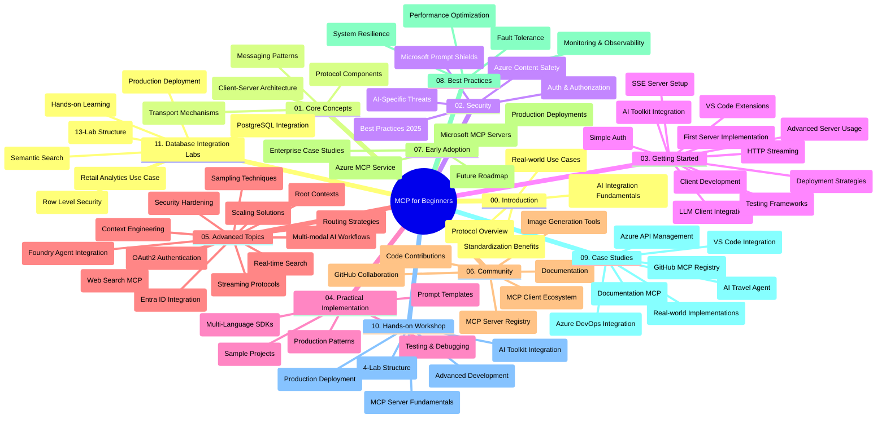

<!--
CO_OP_TRANSLATOR_METADATA:
{
  "original_hash": "af27b0acfae6caa134d9701453884df8",
  "translation_date": "2025-10-11T11:20:35+00:00",
  "source_file": "study_guide.md",
  "language_code": "et"
}
-->
# Mudeli Konteksti Protokoll (MCP) algajatele - Õppematerjal

See õppematerjal annab ülevaate "Mudeli Konteksti Protokoll (MCP) algajatele" õppekava hoidla struktuurist ja sisust. Kasutage seda juhendit, et hoidlas tõhusalt navigeerida ja saada maksimaalset kasu pakutavatest ressurssidest.

## Hoidla ülevaade

Mudeli Konteksti Protokoll (MCP) on standardiseeritud raamistik AI mudelite ja kliendirakenduste vaheliseks suhtluseks. Alguses loodud Anthropic'i poolt, haldab MCP-d nüüd laiem MCP kogukond ametliku GitHubi organisatsiooni kaudu. See hoidla pakub põhjalikku õppekava koos praktiliste koodinäidetega C#, Java, JavaScripti, Python'i ja TypeScripti keeles, mis on mõeldud AI arendajatele, süsteemi arhitektidele ja tarkvarainseneridele.

## Visuaalne õppekava kaart

## Hoidla struktuur

Hoidla on jaotatud üheteistkümneks põhiosaks, millest igaüks keskendub MCP erinevatele aspektidele:

1. **Sissejuhatus (00-Introduction/)**
   - Ülevaade Mudeli Konteksti Protokollist
   - Miks standardiseerimine on AI torujuhtmetes oluline
   - Praktilised kasutusjuhtumid ja eelised

2. **Põhikontseptsioonid (01-CoreConcepts/)**
   - Kliendi-serveri arhitektuur
   - Peamised protokolli komponendid
   - Sõnumimustrid MCP-s

3. **Turvalisus (02-Security/)**
   - Turvaohtude analüüs MCP-põhistes süsteemides
   - Parimad praktikad turvaliste rakenduste loomiseks
   - Autentimise ja autoriseerimise strateegiad
   - **Põhjalik turvalisuse dokumentatsioon**:
     - MCP turvalisuse parimad praktikad 2025
     - Azure'i sisu turvalisuse juhend
     - MCP turvakontrollid ja tehnikad
     - MCP kiire viite juhend
   - **Olulised turvateemad**:
     - Prompt injection ja tööriistade mürgitamise rünnakud
     - Sessiooni kaaperdamine ja segadusse aetud asendaja probleemid
     - Tokenite edastamise haavatavused
     - Liigne õiguste andmine ja juurdepääsukontroll
     - AI komponentide tarneahela turvalisus
     - Microsoft Prompt Shields integratsioon

4. **Alustamine (03-GettingStarted/)**
   - Keskkonna seadistamine ja konfigureerimine
   - Põhiliste MCP serverite ja klientide loomine
   - Integreerimine olemasolevate rakendustega
   - Sisaldab jaotisi:
     - Esimese serveri loomine
     - Kliendi arendamine
     - LLM kliendi integreerimine
     - VS Code integratsioon
     - Server-Sent Events (SSE) server
     - Täiustatud serveri kasutamine
     - HTTP voogedastus
     - AI tööriistakomplekti integreerimine
     - Testimisstrateegiad
     - Juurutamise juhised

5. **Praktiline rakendamine (04-PracticalImplementation/)**
   - SDK-de kasutamine erinevates programmeerimiskeeltes
   - Silumise, testimise ja valideerimise tehnikad
   - Taaskasutatavate prompt-mallide ja töövoogude loomine
   - Näidisprojektid koos rakendusnäidetega

6. **Täiustatud teemad (05-AdvancedTopics/)**
   - Konteksti inseneeria tehnikad
   - Foundry agendi integreerimine
   - Multimodaalsed AI töövood
   - OAuth2 autentimise näited
   - Reaalajas otsinguvõimalused
   - Reaalajas voogedastus
   - Põhikontekstide rakendamine
   - Marsruutimisstrateegiad
   - Proovivõtutehnikad
   - Skaalumise lähenemised
   - Turvalisuse kaalutlused
   - Entra ID turvalisuse integreerimine
   - Veebiotsingu integreerimine

7. **Kogukonna panused (06-CommunityContributions/)**
   - Koodi ja dokumentatsiooni panustamine
   - Koostöö GitHubi kaudu
   - Kogukonna juhitud täiustused ja tagasiside
   - Erinevate MCP klientide kasutamine (Claude Desktop, Cline, VSCode)
   - Töö populaarsete MCP serveritega, sealhulgas pildigeneratsioon

8. **Õppetunnid varasest kasutuselevõtust (07-LessonsfromEarlyAdoption/)**
   - Reaalmaailma rakendused ja edulood
   - MCP-põhiste lahenduste loomine ja juurutamine
   - Trendid ja tulevikuplaanid
   - **Microsoft MCP serverite juhend**: Põhjalik juhend 10 tootmiskõlbliku Microsofti MCP serveri kohta, sealhulgas:
     - Microsoft Learn Docs MCP server
     - Azure MCP server (15+ spetsialiseeritud ühendust)
     - GitHub MCP server
     - Azure DevOps MCP server
     - MarkItDown MCP server
     - SQL Server MCP server
     - Playwright MCP server
     - Dev Box MCP server
     - Azure AI Foundry MCP server
     - Microsoft 365 Agents Toolkit MCP server

9. **Parimad praktikad (08-BestPractices/)**
   - Jõudluse häälestamine ja optimeerimine
   - Tõrkekindlate MCP süsteemide projekteerimine
   - Testimis- ja vastupidavusstrateegiad

10. **Juhtumiuuringud (09-CaseStudy/)**
    - **Seitse põhjalikku juhtumiuuringut**, mis näitavad MCP mitmekülgsust erinevates stsenaariumides:
    - **Azure AI reisibürood**: Mitme agendi orkestreerimine Azure OpenAI ja AI otsinguga
    - **Azure DevOps integratsioon**: Töövoogude automatiseerimine YouTube'i andmete uuendustega
    - **Reaalajas dokumentatsiooni otsing**: Python'i konsooliklient HTTP voogedastusega
    - **Interaktiivne õppeplaani generaator**: Chainlit veebirakendus vestlus-AI-ga
    - **Toimetaja sisene dokumentatsioon**: VS Code integratsioon GitHub Copilot töövoogudega
    - **Azure API haldus**: Ettevõtte API integreerimine MCP serveri loomisega
    - **GitHub MCP register**: Ökosüsteemi arendamine ja agentide integreerimise platvorm
    - Rakendusnäited, mis hõlmavad ettevõtte integratsiooni, arendaja produktiivsust ja ökosüsteemi arendamist

11. **Praktiline töötuba (10-StreamliningAIWorkflowsBuildingAnMCPServerWithAIToolkit/)**
    - Põhjalik praktiline töötuba, mis ühendab MCP ja AI tööriistakomplekti
    - Nutikate rakenduste loomine, mis ühendavad AI mudeleid reaalse maailma tööriistadega
    - Praktilised moodulid, mis hõlmavad aluseid, kohandatud serveri arendamist ja tootmisse juurutamise strateegiaid
    - **Labori struktuur**:
      - Labor 1: MCP serveri alused
      - Labor 2: Täiustatud MCP serveri arendus
      - Labor 3: AI tööriistakomplekti integreerimine
      - Labor 4: Tootmisse juurutamine ja skaleerimine
    - Laboripõhine õppe lähenemine samm-sammult juhistega

12. **MCP serveri andmebaasi integreerimise laborid (11-MCPServerHandsOnLabs/)**
    - **Põhjalik 13-laboriline õppeprogramm** tootmiskõlblike MCP serverite loomiseks PostgreSQL integratsiooniga
    - **Reaalmaailma jaemüügi analüütika rakendamine** Zava Retaili kasutusjuhtumi põhjal
    - **Ettevõtte tasemel mustrid**, sealhulgas rea taseme turvalisus (RLS), semantiline otsing ja mitme rentniku andmetele juurdepääs
    - **Täielik labori struktuur**:
      - **Laborid 00-03: Alused** - Sissejuhatus, Arhitektuur, Turvalisus, Keskkonna seadistamine
      - **Laborid 04-06: MCP serveri loomine** - Andmebaasi disain, MCP serveri rakendamine, Tööriistade arendus
      - **Laborid 07-09: Täiustatud funktsioonid** - Semantiline otsing, Testimine ja silumine, VS Code integratsioon
      - **Laborid 10-12: Tootmine ja parimad praktikad** - Juurutamine, Jälgimine, Optimeerimine
    - **Käsitletavad tehnoloogiad**: FastMCP raamistik, PostgreSQL, Azure OpenAI, Azure Container Apps, Application Insights
    - **Õpitulemused**: Tootmiskõlblikud MCP serverid, andmebaasi integreerimise mustrid, AI-põhine analüütika, ettevõtte turvalisus

## Täiendavad ressursid

Hoidla sisaldab toetavaid ressursse:

- **Piltide kaust**: Diagrammid ja illustratsioonid, mida kasutatakse kogu õppekavas
- **Tõlked**: Mitmekeelne tugi dokumentatsiooni automaatsete tõlgetega
- **Ametlikud MCP ressursid**:
  - [MCP dokumentatsioon](https://modelcontextprotocol.io/)
  - [MCP spetsifikatsioon](https://spec.modelcontextprotocol.io/)
  - [MCP GitHubi hoidla](https://github.com/modelcontextprotocol)

## Kuidas seda hoidlat kasutada

1. **Järjestikune õppimine**: Järgige peatükke järjekorras (00 kuni 11), et saada struktureeritud õpikogemus.
2. **Keelepõhine fookus**: Kui olete huvitatud konkreetsest programmeerimiskeelest, uurige oma eelistatud keele näidiste kaustu.
3. **Praktiline rakendamine**: Alustage jaotisest "Alustamine", et seadistada oma keskkond ja luua oma esimene MCP server ja klient.
4. **Täiustatud uurimine**: Kui olete põhitõdedega kursis, süvenege täiustatud teemadesse, et oma teadmisi laiendada.
5. **Kogukonna kaasamine**: Liituge MCP kogukonnaga GitHubi arutelude ja Discordi kanalite kaudu, et suhelda ekspertide ja teiste arendajatega.

## MCP kliendid ja tööriistad

Õppekava hõlmab erinevaid MCP kliente ja tööriistu:

1. **Ametlikud kliendid**:
   - Visual Studio Code 
   - MCP Visual Studio Code'is
   - Claude Desktop
   - Claude VSCode'is 
   - Claude API

2. **Kogukonna kliendid**:
   - Cline (terminalipõhine)
   - Cursor (koodiredaktor)
   - ChatMCP
   - Windsurf

3. **MCP haldustööriistad**:
   - MCP CLI
   - MCP Manager
   - MCP Linker
   - MCP Router

## Populaarsed MCP serverid

Hoidla tutvustab erinevaid MCP servereid, sealhulgas:

1. **Ametlikud Microsofti MCP serverid**:
   - Microsoft Learn Docs MCP server
   - Azure MCP server (15+ spetsialiseeritud ühendust)
   - GitHub MCP server
   - Azure DevOps MCP server
   - MarkItDown MCP server
   - SQL Server MCP server
   - Playwright MCP server
   - Dev Box MCP server
   - Azure AI Foundry MCP server
   - Microsoft 365 Agents Toolkit MCP server

2. **Ametlikud viiteserverid**:
   - Failisüsteem
   - Fetch
   - Mälu
   - Järjestikune mõtlemine

3. **Pildigeneratsioon**:
   - Azure OpenAI DALL-E 3
   - Stable Diffusion WebUI
   - Replicate

4. **Arendustööriistad**:
   - Git MCP
   - Terminali juhtimine
   - Koodi assistent

5. **Spetsialiseeritud serverid**:
   - Salesforce
   - Microsoft Teams
   - Jira & Confluence

## Kaasamine

See hoidla tervitab kogukonna panust. Vaadake jaotist "Kogukonna panused", et saada juhiseid, kuidas MCP ökosüsteemi tõhusalt panustada.

----

*See õppematerjal uuendati 6. oktoobril 2025 ja annab ülevaate hoidlast seisuga sama kuupäev. Hoidla sisu võib pärast seda kuupäeva muutuda.*

---

**Lahtiütlus**:  
See dokument on tõlgitud AI tõlketeenuse [Co-op Translator](https://github.com/Azure/co-op-translator) abil. Kuigi püüame tagada täpsust, palume arvestada, et automaatsed tõlked võivad sisaldada vigu või ebatäpsusi. Algne dokument selle algses keeles tuleks pidada autoriteetseks allikaks. Olulise teabe puhul soovitame kasutada professionaalset inimtõlget. Me ei vastuta selle tõlke kasutamisest tulenevate arusaamatuste või valesti tõlgenduste eest.