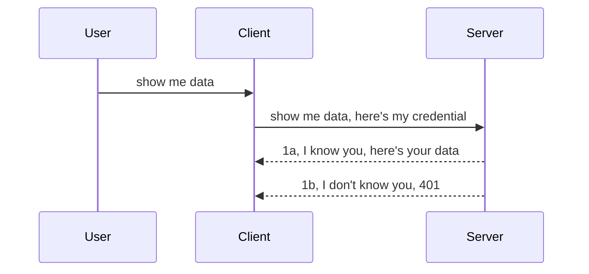

<!--
CO_OP_TRANSLATOR_METADATA:
{
  "original_hash": "5b00b8a8971a07d2d8803be4c9f138f8",
  "translation_date": "2025-10-07T00:33:16+00:00",
  "source_file": "03-GettingStarted/11-simple-auth/README.md",
  "language_code": "fa"
}
-->
# احراز هویت ساده

SDKهای MCP از OAuth 2.1 پشتیبانی می‌کنند که فرآیندی پیچیده است و شامل مفاهیمی مانند سرور احراز هویت، سرور منابع، ارسال اطلاعات کاربری، دریافت کد، تبدیل کد به توکن حامل و در نهایت دسترسی به داده‌های منابع می‌شود. اگر با OAuth آشنا نیستید، که البته پیاده‌سازی آن بسیار مفید است، بهتر است با یک سطح ابتدایی از احراز هویت شروع کنید و به تدریج امنیت را بهبود دهید. به همین دلیل این فصل وجود دارد، تا شما را به سمت احراز هویت پیشرفته‌تر هدایت کند.

## احراز هویت، منظورمان چیست؟

احراز هویت به معنای تأیید هویت و مجوز دسترسی است. هدف این است که دو کار انجام دهیم:

- **تأیید هویت**: فرآیندی که مشخص می‌کند آیا اجازه ورود به شخص داده شود یا خیر، یعنی اینکه آیا او حق دسترسی به سرور منابع ما را دارد، جایی که ویژگی‌های سرور MCP قرار دارند.
- **مجوز دسترسی**: فرآیندی که مشخص می‌کند آیا کاربر باید به منابع خاصی که درخواست کرده دسترسی داشته باشد یا خیر، برای مثال سفارش‌ها یا محصولات خاص، یا اینکه فقط اجازه خواندن محتوا را داشته باشد و نه حذف آن.

## اطلاعات کاربری: چگونه به سیستم می‌گوییم که چه کسی هستیم

بسیاری از توسعه‌دهندگان وب معمولاً به ارائه اطلاعات کاربری به سرور فکر می‌کنند، معمولاً یک رمز که نشان می‌دهد آیا اجازه دسترسی دارند یا خیر (تأیید هویت). این اطلاعات کاربری معمولاً نسخه‌ای رمزگذاری شده از نام کاربری و رمز عبور یا یک کلید API است که یک کاربر خاص را به طور منحصر به فرد شناسایی می‌کند.

این اطلاعات از طریق یک هدر به نام "Authorization" ارسال می‌شود، به این صورت:

```json
{ "Authorization": "secret123" }
```

این روش معمولاً به عنوان احراز هویت پایه شناخته می‌شود. جریان کلی به این صورت عمل می‌کند:



حالا که فهمیدیم از نظر جریان چگونه کار می‌کند، چگونه آن را پیاده‌سازی کنیم؟ خب، اکثر سرورهای وب مفهومی به نام میان‌افزار دارند، یک قطعه کد که به عنوان بخشی از درخواست اجرا می‌شود و می‌تواند اطلاعات کاربری را تأیید کند، و اگر اطلاعات معتبر باشد، اجازه می‌دهد درخواست ادامه یابد. اگر درخواست اطلاعات معتبر نداشته باشد، خطای احراز هویت دریافت می‌کنید. بیایید ببینیم چگونه می‌توان این را پیاده‌سازی کرد:

**پایتون**

```python
class AuthMiddleware(BaseHTTPMiddleware):
    async def dispatch(self, request, call_next):

        has_header = request.headers.get("Authorization")
        if not has_header:
            print("-> Missing Authorization header!")
            return Response(status_code=401, content="Unauthorized")

        if not valid_token(has_header):
            print("-> Invalid token!")
            return Response(status_code=403, content="Forbidden")

        print("Valid token, proceeding...")
       
        response = await call_next(request)
        # add any customer headers or change in the response in some way
        return response


starlette_app.add_middleware(CustomHeaderMiddleware)
```

در اینجا ما:

- یک میان‌افزار به نام `AuthMiddleware` ایجاد کرده‌ایم که متد `dispatch` آن توسط سرور وب فراخوانی می‌شود.
- میان‌افزار را به سرور وب اضافه کرده‌ایم:

    ```python
    starlette_app.add_middleware(AuthMiddleware)
    ```

- منطق اعتبارسنجی را نوشته‌ایم که بررسی می‌کند آیا هدر Authorization وجود دارد و آیا رمز ارسال شده معتبر است:

    ```python
    has_header = request.headers.get("Authorization")
    if not has_header:
        print("-> Missing Authorization header!")
        return Response(status_code=401, content="Unauthorized")

    if not valid_token(has_header):
        print("-> Invalid token!")
        return Response(status_code=403, content="Forbidden")
    ```

    اگر رمز وجود داشته باشد و معتبر باشد، اجازه می‌دهیم درخواست ادامه یابد با فراخوانی `call_next` و پاسخ را برمی‌گردانیم.

    ```python
    response = await call_next(request)
    # add any customer headers or change in the response in some way
    return response
    ```

نحوه کار این است که اگر یک درخواست وب به سمت سرور ارسال شود، میان‌افزار فراخوانی می‌شود و با توجه به پیاده‌سازی آن، یا اجازه می‌دهد درخواست ادامه یابد یا خطایی برمی‌گرداند که نشان می‌دهد مشتری اجازه ادامه ندارد.

**TypeScript**

در اینجا ما یک میان‌افزار با فریم‌ورک محبوب Express ایجاد می‌کنیم و درخواست را قبل از رسیدن به سرور MCP رهگیری می‌کنیم. کد آن به این صورت است:

```typescript
function isValid(secret) {
    return secret === "secret123";
}

app.use((req, res, next) => {
    // 1. Authorization header present?  
    if(!req.headers["Authorization"]) {
        res.status(401).send('Unauthorized');
    }
    
    let token = req.headers["Authorization"];

    // 2. Check validity.
    if(!isValid(token)) {
        res.status(403).send('Forbidden');
    }

   
    console.log('Middleware executed');
    // 3. Passes request to the next step in the request pipeline.
    next();
});
```

در این کد ما:

1. بررسی می‌کنیم آیا هدر Authorization وجود دارد یا خیر، اگر نه، خطای 401 ارسال می‌کنیم.
2. اطمینان حاصل می‌کنیم که اطلاعات کاربری/توکن معتبر است، اگر نه، خطای 403 ارسال می‌کنیم.
3. در نهایت درخواست را در خط لوله درخواست ادامه می‌دهیم و منبع درخواست شده را برمی‌گردانیم.

## تمرین: پیاده‌سازی احراز هویت

بیایید دانش خود را به کار بگیریم و آن را پیاده‌سازی کنیم. برنامه به این صورت است:

سرور

- ایجاد یک سرور وب و نمونه MCP.
- پیاده‌سازی یک میان‌افزار برای سرور.

مشتری 

- ارسال درخواست وب، با اطلاعات کاربری، از طریق هدر.

### -1- ایجاد یک سرور وب و نمونه MCP

در مرحله اول، باید نمونه سرور وب و سرور MCP را ایجاد کنیم.

**پایتون**

در اینجا ما یک نمونه سرور MCP ایجاد می‌کنیم، یک برنامه وب starlette ایجاد می‌کنیم و آن را با uvicorn میزبانی می‌کنیم.

```python
# creating MCP Server

app = FastMCP(
    name="MCP Resource Server",
    instructions="Resource Server that validates tokens via Authorization Server introspection",
    host=settings["host"],
    port=settings["port"],
    debug=True
)

# creating starlette web app
starlette_app = app.streamable_http_app()

# serving app via uvicorn
async def run(starlette_app):
    import uvicorn
    config = uvicorn.Config(
            starlette_app,
            host=app.settings.host,
            port=app.settings.port,
            log_level=app.settings.log_level.lower(),
        )
    server = uvicorn.Server(config)
    await server.serve()

run(starlette_app)
```

در این کد ما:

- سرور MCP را ایجاد می‌کنیم.
- برنامه وب starlette را از سرور MCP می‌سازیم، `app.streamable_http_app()`.
- برنامه وب را با uvicorn میزبانی و سرویس‌دهی می‌کنیم `server.serve()`.

**TypeScript**

در اینجا ما یک نمونه سرور MCP ایجاد می‌کنیم.

```typescript
const server = new McpServer({
      name: "example-server",
      version: "1.0.0"
    });

    // ... set up server resources, tools, and prompts ...
```

این ایجاد سرور MCP باید در تعریف مسیر POST /mcp انجام شود، بنابراین بیایید کد بالا را به این صورت منتقل کنیم:

```typescript
import express from "express";
import { randomUUID } from "node:crypto";
import { McpServer } from "@modelcontextprotocol/sdk/server/mcp.js";
import { StreamableHTTPServerTransport } from "@modelcontextprotocol/sdk/server/streamableHttp.js";
import { isInitializeRequest } from "@modelcontextprotocol/sdk/types.js"

const app = express();
app.use(express.json());

// Map to store transports by session ID
const transports: { [sessionId: string]: StreamableHTTPServerTransport } = {};

// Handle POST requests for client-to-server communication
app.post('/mcp', async (req, res) => {
  // Check for existing session ID
  const sessionId = req.headers['mcp-session-id'] as string | undefined;
  let transport: StreamableHTTPServerTransport;

  if (sessionId && transports[sessionId]) {
    // Reuse existing transport
    transport = transports[sessionId];
  } else if (!sessionId && isInitializeRequest(req.body)) {
    // New initialization request
    transport = new StreamableHTTPServerTransport({
      sessionIdGenerator: () => randomUUID(),
      onsessioninitialized: (sessionId) => {
        // Store the transport by session ID
        transports[sessionId] = transport;
      },
      // DNS rebinding protection is disabled by default for backwards compatibility. If you are running this server
      // locally, make sure to set:
      // enableDnsRebindingProtection: true,
      // allowedHosts: ['127.0.0.1'],
    });

    // Clean up transport when closed
    transport.onclose = () => {
      if (transport.sessionId) {
        delete transports[transport.sessionId];
      }
    };
    const server = new McpServer({
      name: "example-server",
      version: "1.0.0"
    });

    // ... set up server resources, tools, and prompts ...

    // Connect to the MCP server
    await server.connect(transport);
  } else {
    // Invalid request
    res.status(400).json({
      jsonrpc: '2.0',
      error: {
        code: -32000,
        message: 'Bad Request: No valid session ID provided',
      },
      id: null,
    });
    return;
  }

  // Handle the request
  await transport.handleRequest(req, res, req.body);
});

// Reusable handler for GET and DELETE requests
const handleSessionRequest = async (req: express.Request, res: express.Response) => {
  const sessionId = req.headers['mcp-session-id'] as string | undefined;
  if (!sessionId || !transports[sessionId]) {
    res.status(400).send('Invalid or missing session ID');
    return;
  }
  
  const transport = transports[sessionId];
  await transport.handleRequest(req, res);
};

// Handle GET requests for server-to-client notifications via SSE
app.get('/mcp', handleSessionRequest);

// Handle DELETE requests for session termination
app.delete('/mcp', handleSessionRequest);

app.listen(3000);
```

حالا می‌بینید که ایجاد سرور MCP به داخل `app.post("/mcp")` منتقل شده است.

بیایید به مرحله بعدی ایجاد میان‌افزار برویم تا بتوانیم اطلاعات کاربری ورودی را اعتبارسنجی کنیم.

### -2- پیاده‌سازی یک میان‌افزار برای سرور

بیایید به بخش میان‌افزار برویم. در اینجا ما یک میان‌افزار ایجاد می‌کنیم که به دنبال اطلاعات کاربری در هدر `Authorization` می‌گردد و آن را اعتبارسنجی می‌کند. اگر قابل قبول باشد، درخواست ادامه می‌دهد تا کاری که باید انجام دهد (مانند لیست ابزارها، خواندن یک منبع یا هر عملکرد MCP که مشتری درخواست کرده است).

**پایتون**

برای ایجاد میان‌افزار، باید یک کلاس ایجاد کنیم که از `BaseHTTPMiddleware` ارث‌بری کند. دو بخش جالب وجود دارد:

- درخواست `request`، که اطلاعات هدر را از آن می‌خوانیم.
- `call_next`، callback که باید فراخوانی شود اگر مشتری اطلاعات کاربری قابل قبولی ارائه داده باشد.

ابتدا باید حالت عدم وجود هدر `Authorization` را مدیریت کنیم:

```python
has_header = request.headers.get("Authorization")

# no header present, fail with 401, otherwise move on.
if not has_header:
    print("-> Missing Authorization header!")
    return Response(status_code=401, content="Unauthorized")
```

در اینجا ما یک پیام 401 غیرمجاز ارسال می‌کنیم زیرا مشتری در احراز هویت شکست خورده است.

سپس، اگر اطلاعات کاربری ارسال شده باشد، باید اعتبار آن را بررسی کنیم، به این صورت:

```python
 if not valid_token(has_header):
    print("-> Invalid token!")
    return Response(status_code=403, content="Forbidden")
```

توجه کنید که چگونه پیام 403 ممنوع ارسال می‌کنیم. بیایید میان‌افزار کامل را ببینیم که همه مواردی که در بالا ذکر شد را پیاده‌سازی می‌کند:

```python
class AuthMiddleware(BaseHTTPMiddleware):
    async def dispatch(self, request, call_next):

        has_header = request.headers.get("Authorization")
        if not has_header:
            print("-> Missing Authorization header!")
            return Response(status_code=401, content="Unauthorized")

        if not valid_token(has_header):
            print("-> Invalid token!")
            return Response(status_code=403, content="Forbidden")

        print("Valid token, proceeding...")
        print(f"-> Received {request.method} {request.url}")
        response = await call_next(request)
        response.headers['Custom'] = 'Example'
        return response

```

عالی، اما تابع `valid_token` چیست؟ در اینجا آن را می‌بینید:

```python
# DON'T use for production - improve it !!
def valid_token(token: str) -> bool:
    # remove the "Bearer " prefix
    if token.startswith("Bearer "):
        token = token[7:]
        return token == "secret-token"
    return False
```

این باید بهبود یابد.

مهم: شما هرگز نباید رمزها را به این صورت در کد قرار دهید. بهتر است مقدار مقایسه را از یک منبع داده یا از یک ارائه‌دهنده خدمات هویت (IDP) دریافت کنید یا بهتر از آن، اجازه دهید IDP اعتبارسنجی را انجام دهد.

**TypeScript**

برای پیاده‌سازی این مورد با Express، باید متد `use` را فراخوانی کنیم که توابع میان‌افزار را می‌پذیرد.

ما باید:

- با متغیر درخواست تعامل کنیم تا اطلاعات کاربری ارسال شده در خاصیت `Authorization` را بررسی کنیم.
- اطلاعات کاربری را اعتبارسنجی کنیم، و اگر معتبر باشد اجازه دهیم درخواست ادامه یابد و درخواست MCP مشتری کاری که باید انجام دهد را انجام دهد (مانند لیست ابزارها، خواندن منبع یا هر چیز مرتبط با MCP).

در اینجا، ما بررسی می‌کنیم که آیا هدر `Authorization` وجود دارد یا خیر، و اگر نه، درخواست را متوقف می‌کنیم:

```typescript
if(!req.headers["authorization"]) {
    res.status(401).send('Unauthorized');
    return;
}
```

اگر هدر در وهله اول ارسال نشده باشد، خطای 401 دریافت می‌کنید.

سپس، بررسی می‌کنیم که آیا اطلاعات کاربری معتبر است یا خیر، اگر نه، دوباره درخواست را متوقف می‌کنیم اما با پیام کمی متفاوت:

```typescript
if(!isValid(token)) {
    res.status(403).send('Forbidden');
    return;
} 
```

توجه کنید که چگونه اکنون خطای 403 دریافت می‌کنید.

در اینجا کد کامل آمده است:

```typescript
app.use((req, res, next) => {
    console.log('Request received:', req.method, req.url, req.headers);
    console.log('Headers:', req.headers["authorization"]);
    if(!req.headers["authorization"]) {
        res.status(401).send('Unauthorized');
        return;
    }
    
    let token = req.headers["authorization"];

    if(!isValid(token)) {
        res.status(403).send('Forbidden');
        return;
    }  

    console.log('Middleware executed');
    next();
});
```

ما سرور وب را تنظیم کرده‌ایم تا یک میان‌افزار برای بررسی اطلاعات کاربری که مشتری امیدوار است ارسال کند، بپذیرد. مشتری چطور؟

### -3- ارسال درخواست وب با اطلاعات کاربری از طریق هدر

ما باید اطمینان حاصل کنیم که مشتری اطلاعات کاربری را از طریق هدر ارسال می‌کند. از آنجا که قصد داریم از یک مشتری MCP برای این کار استفاده کنیم، باید بفهمیم چگونه این کار انجام می‌شود.

**پایتون**

برای مشتری، باید یک هدر با اطلاعات کاربری خود ارسال کنیم، به این صورت:

```python
# DON'T hardcode the value, have it at minimum in an environment variable or a more secure storage
token = "secret-token"

async with streamablehttp_client(
        url = f"http://localhost:{port}/mcp",
        headers = {"Authorization": f"Bearer {token}"}
    ) as (
        read_stream,
        write_stream,
        session_callback,
    ):
        async with ClientSession(
            read_stream,
            write_stream
        ) as session:
            await session.initialize()
      
            # TODO, what you want done in the client, e.g list tools, call tools etc.
```

توجه کنید که چگونه خاصیت `headers` را به این صورت پر می‌کنیم ` headers = {"Authorization": f"Bearer {token}"}`.

**TypeScript**

ما می‌توانیم این کار را در دو مرحله انجام دهیم:

1. یک شیء پیکربندی با اطلاعات کاربری خود پر کنیم.
2. شیء پیکربندی را به transport ارسال کنیم.

```typescript

// DON'T hardcode the value like shown here. At minimum have it as a env variable and use something like dotenv (in dev mode).
let token = "secret123"

// define a client transport option object
let options: StreamableHTTPClientTransportOptions = {
  sessionId: sessionId,
  requestInit: {
    headers: {
      "Authorization": "secret123"
    }
  }
};

// pass the options object to the transport
async function main() {
   const transport = new StreamableHTTPClientTransport(
      new URL(serverUrl),
      options
   );
```

در اینجا می‌بینید که چگونه مجبور شدیم یک شیء `options` ایجاد کنیم و هدرهای خود را تحت خاصیت `requestInit` قرار دهیم.

مهم: چگونه می‌توانیم از اینجا بهبود دهیم؟ خب، پیاده‌سازی فعلی مشکلاتی دارد. اول از همه، ارسال اطلاعات کاربری به این صورت بسیار خطرناک است مگر اینکه حداقل HTTPS داشته باشید. حتی در این صورت، اطلاعات کاربری ممکن است دزدیده شود، بنابراین شما به سیستمی نیاز دارید که بتوانید به راحتی توکن را لغو کنید و بررسی‌های اضافی مانند اینکه از کجا در جهان درخواست می‌آید، آیا درخواست خیلی زیاد اتفاق می‌افتد (رفتار شبیه به ربات)، و به طور کلی، مجموعه‌ای از نگرانی‌ها را اضافه کنید.

با این حال، باید گفت که برای APIهای بسیار ساده که نمی‌خواهید کسی بدون احراز هویت API شما را فراخوانی کند، چیزی که در اینجا داریم شروع خوبی است.

با این حال، بیایید سعی کنیم امنیت را کمی تقویت کنیم با استفاده از یک فرمت استاندارد مانند JSON Web Token، که به عنوان JWT یا "JOT" شناخته می‌شود.

## JSON Web Tokens، JWT

خب، ما سعی داریم از ارسال اطلاعات کاربری بسیار ساده بهبود پیدا کنیم. بهبودهای فوری که با پذیرش JWT به دست می‌آوریم چیست؟

- **بهبود امنیت**. در احراز هویت پایه، شما نام کاربری و رمز عبور را به عنوان یک توکن رمزگذاری شده base64 (یا یک کلید API) بارها و بارها ارسال می‌کنید که خطر را افزایش می‌دهد. با JWT، شما نام کاربری و رمز عبور خود را ارسال می‌کنید و یک توکن دریافت می‌کنید که همچنین زمان‌بندی شده است، به این معنی که منقضی می‌شود. JWT به شما امکان می‌دهد کنترل دسترسی دقیق با استفاده از نقش‌ها، محدوده‌ها و مجوزها را به راحتی پیاده‌سازی کنید.
- **بی‌حالتی و مقیاس‌پذیری**. JWTها خودکفا هستند، تمام اطلاعات کاربر را حمل می‌کنند و نیاز به ذخیره‌سازی جلسه سمت سرور را حذف می‌کنند. توکن همچنین می‌تواند به صورت محلی اعتبارسنجی شود.
- **قابلیت همکاری و فدراسیون**. JWTها در مرکز Open ID Connect قرار دارند و با ارائه‌دهندگان هویت شناخته شده مانند Entra ID، Google Identity و Auth0 استفاده می‌شوند. آنها همچنین امکان استفاده از ورود یکپارچه و موارد دیگر را فراهم می‌کنند که آن را در سطح سازمانی قرار می‌دهد.
- **ماژولاریت و انعطاف‌پذیری**. JWTها همچنین می‌توانند با دروازه‌های API مانند Azure API Management، NGINX و موارد دیگر استفاده شوند. همچنین از سناریوهای احراز هویت و ارتباط سرور به سرور از جمله سناریوهای جعل هویت و تفویض اختیار پشتیبانی می‌کند.
- **عملکرد و کشینگ**. JWTها می‌توانند پس از رمزگشایی کش شوند که نیاز به تجزیه را کاهش می‌دهد. این به ویژه در برنامه‌های پرترافیک کمک می‌کند زیرا باعث بهبود توان عملیاتی و کاهش بار بر زیرساخت انتخابی شما می‌شود.
- **ویژگی‌های پیشرفته**. همچنین از بررسی اعتبار (بررسی اعتبار در سرور) و لغو (بی‌اعتبار کردن یک توکن) پشتیبانی می‌کند.

با تمام این مزایا، بیایید ببینیم چگونه می‌توانیم پیاده‌سازی خود را به سطح بعدی ببریم.

## تبدیل احراز هویت پایه به JWT

خب، تغییراتی که باید در سطح کلی انجام دهیم عبارتند از:

- **یادگیری ساخت یک توکن JWT** و آماده کردن آن برای ارسال از مشتری به سرور.
- **اعتبارسنجی یک توکن JWT**، و اگر معتبر باشد، اجازه دسترسی به منابع مشتری.
- **ذخیره‌سازی امن توکن**. نحوه ذخیره این توکن.
- **محافظت از مسیرها**. باید مسیرها و ویژگی‌های خاص MCP را محافظت کنیم.
- **افزودن توکن‌های تازه‌سازی**. اطمینان حاصل کنیم که توکن‌هایی ایجاد می‌کنیم که کوتاه‌مدت هستند اما توکن‌های تازه‌سازی که بلندمدت هستند و می‌توانند برای دریافت توکن‌های جدید در صورت انقضا استفاده شوند. همچنین اطمینان حاصل کنیم که یک نقطه پایانی تازه‌سازی و یک استراتژی چرخش وجود دارد.

### -1- ساخت یک توکن JWT

اول از همه، یک توکن JWT دارای بخش‌های زیر است:

- **هدر**، الگوریتم استفاده شده و نوع توکن.
- **payload**، ادعاها، مانند sub (کاربر یا موجودیتی که توکن نمایانگر آن است. در یک سناریوی احراز هویت معمولاً شناسه کاربر)، exp (زمان انقضا)، role (نقش).
- **امضا**، امضا شده با یک رمز یا کلید خصوصی.

برای این کار، باید هدر، payload و توکن رمزگذاری شده را بسازیم.

**پایتون**

```python

import jwt
import jwt
from jwt.exceptions import ExpiredSignatureError, InvalidTokenError
import datetime

# Secret key used to sign the JWT
secret_key = 'your-secret-key'

header = {
    "alg": "HS256",
    "typ": "JWT"
}

# the user info andits claims and expiry time
payload = {
    "sub": "1234567890",               # Subject (user ID)
    "name": "User Userson",                # Custom claim
    "admin": True,                     # Custom claim
    "iat": datetime.datetime.utcnow(),# Issued at
    "exp": datetime.datetime.utcnow() + datetime.timedelta(hours=1)  # Expiry
}

# encode it
encoded_jwt = jwt.encode(payload, secret_key, algorithm="HS256", headers=header)
```

در کد بالا ما:

- یک هدر با استفاده از HS256 به عنوان الگوریتم و نوع به عنوان JWT تعریف کرده‌ایم.
- یک payload ساخته‌ایم که شامل یک موضوع یا شناسه کاربر، یک نام کاربری، یک نقش، زمان صدور و زمان انقضا است، بنابراین جنبه زمان‌بندی شده‌ای که قبلاً ذکر کردیم را پیاده‌سازی کرده‌ایم.

**TypeScript**

در اینجا ما به برخی وابستگی‌ها نیاز داریم که به ما در ساخت توکن JWT کمک می‌کنند.

وابستگی‌ها

```sh

npm install jsonwebtoken
npm install --save-dev @types/jsonwebtoken
```

حالا که این موارد را داریم، بیایید هدر، payload و از طریق آن توکن رمزگذاری شده را ایجاد کنیم.

```typescript
import jwt from 'jsonwebtoken';

const secretKey = 'your-secret-key'; // Use env vars in production

// Define the payload
const payload = {
  sub: '1234567890',
  name: 'User usersson',
  admin: true,
  iat: Math.floor(Date.now() / 1000), // Issued at
  exp: Math.floor(Date.now() / 1000) + 60 * 60 // Expires in 1 hour
};

// Define the header (optional, jsonwebtoken sets defaults)
const header = {
  alg: 'HS256',
  typ: 'JWT'
};

// Create the token
const token = jwt.sign(payload, secretKey, {
  algorithm: 'HS256',
  header: header
});

console.log('JWT:', token);
```

این توکن:

با استفاده از HS256 امضا شده است.
برای 1 ساعت معتبر است.
شامل ادعاهایی مانند sub، name، admin، iat و exp است.

### -2- اعتبارسنجی یک توکن

ما همچنین باید یک توکن را اعتبارسنجی کنیم، این چیزی است که باید در سرور انجام دهیم تا اطمینان حاصل کنیم چیزی که مشتری به ما ارسال می‌کند واقعاً معتبر است. بررسی‌های زیادی وجود دارد که باید انجام دهیم، از اعتبارسنجی ساختار آن تا اعتبار آن. همچنین توصیه می‌شود بررسی‌های دیگری انجام دهید تا ببینید آیا کاربر در سیستم شما وجود دارد و موارد دیگر.

برای اعتبارسنجی یک توکن، باید آن را رمزگشایی کنیم تا بتوانیم آن را بخوانیم و سپس شروع به بررسی اعتبار آن کنیم:

**پایتون**

```python

# Decode and verify the JWT
try:
    decoded = jwt.decode(token, secret_key, algorithms=["HS256"])
    print("✅ Token is valid.")
    print("Decoded claims:")
    for key, value in decoded.items():
        print(f"  {key}: {value}")
except ExpiredSignatureError:
    print("❌ Token has expired.")
except InvalidTokenError as e:
    print(f"❌ Invalid token: {e}")

```

در این کد، ما `jwt.decode` را با استفاده از توکن، کلید رمز و الگوریتم انتخابی به عنوان ورودی فراخوانی می‌کنیم. توجه کنید که چگونه از ساختار try-catch استفاده می‌کنیم زیرا اعتبارسنجی ناموفق منجر به ایجاد خطا می‌شود.

**TypeScript**

در اینجا باید `jwt.verify` را فراخوانی کنیم تا نسخه رمزگشایی شده توکن را دریافت کنیم که بتوانیم بیشتر آن را تحلیل کنیم. اگر این فراخوانی شکست بخورد، به این معنی است که ساختار توکن نادرست است یا دیگر معتبر نیست.

```typescript

try {
  const decoded = jwt.verify(token, secretKey);
  console.log('Decoded Payload:', decoded);
} catch (err) {
  console.error('Token verification failed:', err);
}
```

توجه: همانطور که قبلاً ذکر شد، باید بررسی‌های اضافی انجام دهید تا اطمینان حاصل کنید این توکن به یک کاربر در سیستم شما اشاره دارد و اطمینان حاصل کنید که کاربر حقوقی که ادعا می‌کند دارد را داراست.
بعدی، بیایید به کنترل دسترسی مبتنی بر نقش، که به RBAC نیز معروف است، بپردازیم.

## افزودن کنترل دسترسی مبتنی بر نقش

ایده این است که می‌خواهیم بیان کنیم که نقش‌های مختلف دارای مجوزهای متفاوتی هستند. به عنوان مثال، فرض می‌کنیم یک مدیر (admin) می‌تواند همه کارها را انجام دهد، یک کاربر معمولی می‌تواند خواندن/نوشتن انجام دهد و یک مهمان فقط می‌تواند بخواند. بنابراین، در اینجا برخی از سطوح مجوز ممکن آورده شده است:

- Admin.Write  
- User.Read  
- Guest.Read  

بیایید ببینیم چگونه می‌توانیم چنین کنترلی را با استفاده از middleware پیاده‌سازی کنیم. Middlewareها می‌توانند برای هر مسیر خاص یا برای همه مسیرها اضافه شوند.

**پایتون**

```python
from starlette.middleware.base import BaseHTTPMiddleware
from starlette.responses import JSONResponse
import jwt

# DON'T have the secret in the code like, this is for demonstration purposes only. Read it from a safe place.
SECRET_KEY = "your-secret-key" # put this in env variable
REQUIRED_PERMISSION = "User.Read"

class JWTPermissionMiddleware(BaseHTTPMiddleware):
    async def dispatch(self, request, call_next):
        auth_header = request.headers.get("Authorization")
        if not auth_header or not auth_header.startswith("Bearer "):
            return JSONResponse({"error": "Missing or invalid Authorization header"}, status_code=401)

        token = auth_header.split(" ")[1]
        try:
            decoded = jwt.decode(token, SECRET_KEY, algorithms=["HS256"])
        except jwt.ExpiredSignatureError:
            return JSONResponse({"error": "Token expired"}, status_code=401)
        except jwt.InvalidTokenError:
            return JSONResponse({"error": "Invalid token"}, status_code=401)

        permissions = decoded.get("permissions", [])
        if REQUIRED_PERMISSION not in permissions:
            return JSONResponse({"error": "Permission denied"}, status_code=403)

        request.state.user = decoded
        return await call_next(request)


```
  
چند روش مختلف برای افزودن middleware وجود دارد، مانند زیر:

```python

# Alt 1: add middleware while constructing starlette app
middleware = [
    Middleware(JWTPermissionMiddleware)
]

app = Starlette(routes=routes, middleware=middleware)

# Alt 2: add middleware after starlette app is a already constructed
starlette_app.add_middleware(JWTPermissionMiddleware)

# Alt 3: add middleware per route
routes = [
    Route(
        "/mcp",
        endpoint=..., # handler
        middleware=[Middleware(JWTPermissionMiddleware)]
    )
]
```
  

**TypeScript**

ما می‌توانیم از `app.use` و یک middleware استفاده کنیم که برای همه درخواست‌ها اجرا می‌شود.

```typescript
app.use((req, res, next) => {
    console.log('Request received:', req.method, req.url, req.headers);
    console.log('Headers:', req.headers["authorization"]);

    // 1. Check if authorization header has been sent

    if(!req.headers["authorization"]) {
        res.status(401).send('Unauthorized');
        return;
    }
    
    let token = req.headers["authorization"];

    // 2. Check if token is valid
    if(!isValid(token)) {
        res.status(403).send('Forbidden');
        return;
    }  

    // 3. Check if token user exist in our system
    if(!isExistingUser(token)) {
        res.status(403).send('Forbidden');
        console.log("User does not exist");
        return;
    }
    console.log("User exists");

    // 4. Verify the token has the right permissions
    if(!hasScopes(token, ["User.Read"])){
        res.status(403).send('Forbidden - insufficient scopes');
    }

    console.log("User has required scopes");

    console.log('Middleware executed');
    next();
});

```
  
چندین کار وجود دارد که می‌توانیم به middleware خود بدهیم و باید انجام دهد، از جمله:

1. بررسی اینکه آیا هدر authorization وجود دارد.  
2. بررسی اینکه آیا توکن معتبر است؛ ما متدی به نام `isValid` داریم که یکپارچگی و اعتبار توکن JWT را بررسی می‌کند.  
3. تأیید اینکه کاربر در سیستم ما وجود دارد؛ باید این مورد را بررسی کنیم.  

   ```typescript
    // users in DB
   const users = [
     "user1",
     "User usersson",
   ]

   function isExistingUser(token) {
     let decodedToken = verifyToken(token);

     // TODO, check if user exists in DB
     return users.includes(decodedToken?.name || "");
   }
   ```
  
در بالا، یک لیست ساده از `users` ایجاد کرده‌ایم که البته باید در یک پایگاه داده ذخیره شود.

4. علاوه بر این، باید بررسی کنیم که آیا توکن دارای مجوزهای صحیح است.

   ```typescript
   if(!hasScopes(token, ["User.Read"])){
        res.status(403).send('Forbidden - insufficient scopes');
   }
   ```
  
در کد بالا از middleware، بررسی می‌کنیم که آیا توکن شامل مجوز User.Read است یا خیر؛ اگر نه، خطای 403 ارسال می‌کنیم. در زیر متد کمکی `hasScopes` آورده شده است.

   ```typescript
   function hasScopes(scope: string, requiredScopes: string[]) {
     let decodedToken = verifyToken(scope);
    return requiredScopes.every(scope => decodedToken?.scopes.includes(scope));
  
   ```

Have a think which additional checks you should be doing, but these are the absolute minimum of checks you should be doing.

Using Express as a web framework is a common choice. There are helpers library when you use JWT so you can write less code.

- `express-jwt`, helper library that provides a middleware that helps decode your token.
- `express-jwt-permissions`, this provides a middleware `guard` that helps check if a certain permission is on the token.

Here's what these libraries can look like when used:

```typescript
const express = require('express');
const jwt = require('express-jwt');
const guard = require('express-jwt-permissions')();

const app = express();
const secretKey = 'your-secret-key'; // put this in env variable

// Decode JWT and attach to req.user
app.use(jwt({ secret: secretKey, algorithms: ['HS256'] }));

// Check for User.Read permission
app.use(guard.check('User.Read'));

// multiple permissions
// app.use(guard.check(['User.Read', 'Admin.Access']));

app.get('/protected', (req, res) => {
  res.json({ message: `Welcome ${req.user.name}` });
});

// Error handler
app.use((err, req, res, next) => {
  if (err.code === 'permission_denied') {
    return res.status(403).send('Forbidden');
  }
  next(err);
});

```
  
اکنون که دیدید چگونه می‌توان از middleware برای احراز هویت و مجوز استفاده کرد، در مورد MCP چطور؟ آیا این روش احراز هویت را تغییر می‌دهد؟ بیایید در بخش بعدی متوجه شویم.

### -3- افزودن RBAC به MCP

تا اینجا دیدید که چگونه می‌توانید RBAC را از طریق middleware اضافه کنید، اما برای MCP راه آسانی برای افزودن RBAC به ویژگی‌های خاص MCP وجود ندارد. پس چه باید کرد؟ خوب، باید کدی اضافه کنیم که در این مورد بررسی کند آیا کلاینت حق استفاده از ابزار خاصی را دارد یا خیر:

چند گزینه مختلف برای انجام RBAC در سطح ویژگی وجود دارد، در اینجا برخی از آنها آورده شده است:

- افزودن بررسی برای هر ابزار، منبع، یا prompt که نیاز به بررسی سطح مجوز دارد.

   **پایتون**

   ```python
   @tool()
   def delete_product(id: int):
      try:
          check_permissions(role="Admin.Write", request)
      catch:
        pass # client failed authorization, raise authorization error
   ```
  
   **TypeScript**

   ```typescript
   server.registerTool(
    "delete-product",
    {
      title: Delete a product",
      description: "Deletes a product",
      inputSchema: { id: z.number() }
    },
    async ({ id }) => {
      
      try {
        checkPermissions("Admin.Write", request);
        // todo, send id to productService and remote entry
      } catch(Exception e) {
        console.log("Authorization error, you're not allowed");  
      }

      return {
        content: [{ type: "text", text: `Deletected product with id ${id}` }]
      };
    }
   );
   ```
  

- استفاده از رویکرد پیشرفته سرور و handlers درخواست‌ها تا تعداد مکان‌هایی که نیاز به بررسی دارند کاهش یابد.

   **پایتون**

   ```python
   
   tool_permission = {
      "create_product": ["User.Write", "Admin.Write"],
      "delete_product": ["Admin.Write"]
   }

   def has_permission(user_permissions, required_permissions) -> bool:
      # user_permissions: list of permissions the user has
      # required_permissions: list of permissions required for the tool
      return any(perm in user_permissions for perm in required_permissions)

   @server.call_tool()
   async def handle_call_tool(
     name: str, arguments: dict[str, str] | None
   ) -> list[types.TextContent]:
    # Assume request.user.permissions is a list of permissions for the user
     user_permissions = request.user.permissions
     required_permissions = tool_permission.get(name, [])
     if not has_permission(user_permissions, required_permissions):
        # Raise error "You don't have permission to call tool {name}"
        raise Exception(f"You don't have permission to call tool {name}")
     # carry on and call tool
     # ...
   ```   
  

   **TypeScript**

   ```typescript
   function hasPermission(userPermissions: string[], requiredPermissions: string[]): boolean {
       if (!Array.isArray(userPermissions) || !Array.isArray(requiredPermissions)) return false;
       // Return true if user has at least one required permission
       
       return requiredPermissions.some(perm => userPermissions.includes(perm));
   }
  
   server.setRequestHandler(CallToolRequestSchema, async (request) => {
      const { params: { name } } = request;
  
      let permissions = request.user.permissions;
  
      if (!hasPermission(permissions, toolPermissions[name])) {
         return new Error(`You don't have permission to call ${name}`);
      }
  
      // carry on..
   });
   ```
  
   توجه داشته باشید که باید مطمئن شوید middleware شما یک توکن رمزگشایی شده را به ویژگی user درخواست اختصاص می‌دهد تا کد بالا ساده شود.

### جمع‌بندی

اکنون که درباره افزودن پشتیبانی از RBAC به طور کلی و برای MCP به طور خاص صحبت کردیم، وقت آن است که امنیت را خودتان پیاده‌سازی کنید تا مطمئن شوید مفاهیم ارائه شده را درک کرده‌اید.

## تمرین 1: ساخت یک سرور MCP و کلاینت MCP با استفاده از احراز هویت پایه

در اینجا شما باید آنچه در مورد ارسال اعتبارنامه‌ها از طریق هدرها یاد گرفته‌اید را به کار ببرید.

## راه‌حل 1

[راه‌حل 1](./code/basic/README.md)

## تمرین 2: ارتقاء راه‌حل تمرین 1 به استفاده از JWT

راه‌حل اول را بگیرید، اما این بار آن را بهبود دهید.

به جای استفاده از احراز هویت پایه، از JWT استفاده کنید.

## راه‌حل 2

[راه‌حل 2](./solution/jwt-solution/README.md)

## چالش

RBAC را برای هر ابزار که در بخش "افزودن RBAC به MCP" توضیح داده شده است، اضافه کنید.

## خلاصه

امیدواریم در این فصل چیزهای زیادی یاد گرفته باشید، از عدم وجود امنیت، تا امنیت پایه، تا JWT و نحوه افزودن آن به MCP.

ما یک پایه محکم با JWTهای سفارشی ساخته‌ایم، اما با گسترش مقیاس، به سمت یک مدل هویت مبتنی بر استاندارد حرکت می‌کنیم. پذیرش یک IdP مانند Entra یا Keycloak به ما امکان می‌دهد صدور توکن، اعتبارسنجی و مدیریت چرخه عمر را به یک پلتفرم قابل اعتماد واگذار کنیم — و ما را آزاد می‌کند تا بر منطق برنامه و تجربه کاربری تمرکز کنیم.

برای این منظور، فصل [پیشرفته‌ای درباره Entra](../../05-AdvancedTopics/mcp-security-entra/README.md) داریم.

---

**سلب مسئولیت**:  
این سند با استفاده از سرویس ترجمه هوش مصنوعی [Co-op Translator](https://github.com/Azure/co-op-translator) ترجمه شده است. در حالی که ما تلاش می‌کنیم دقت را حفظ کنیم، لطفاً توجه داشته باشید که ترجمه‌های خودکار ممکن است شامل خطاها یا نادرستی‌ها باشند. سند اصلی به زبان اصلی آن باید به عنوان منبع معتبر در نظر گرفته شود. برای اطلاعات حساس، ترجمه حرفه‌ای انسانی توصیه می‌شود. ما مسئولیتی در قبال سوء تفاهم‌ها یا تفسیرهای نادرست ناشی از استفاده از این ترجمه نداریم.