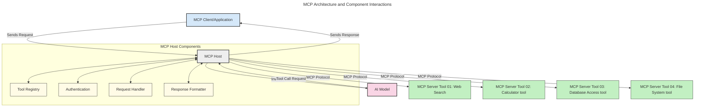
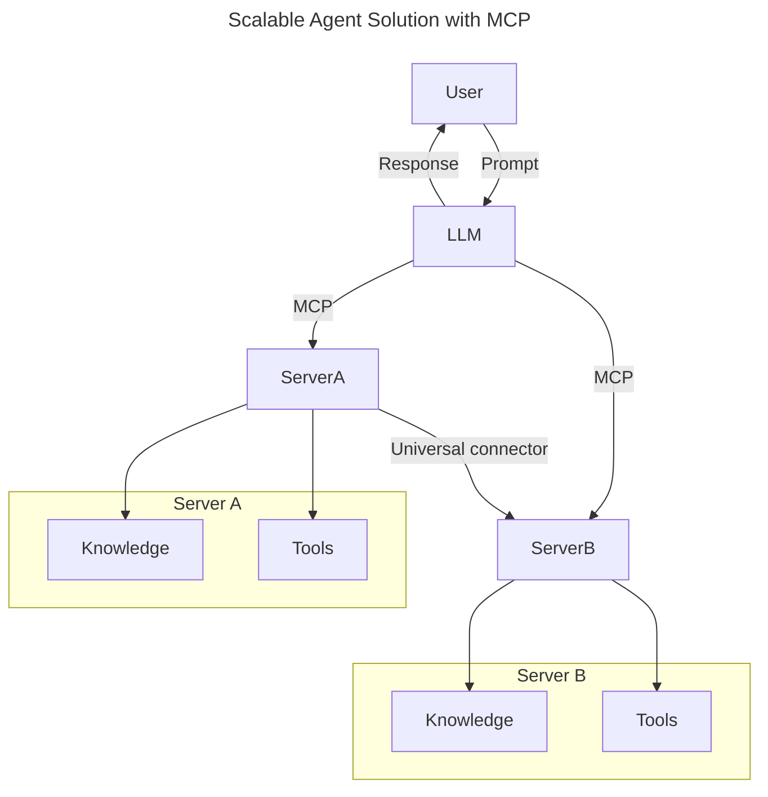
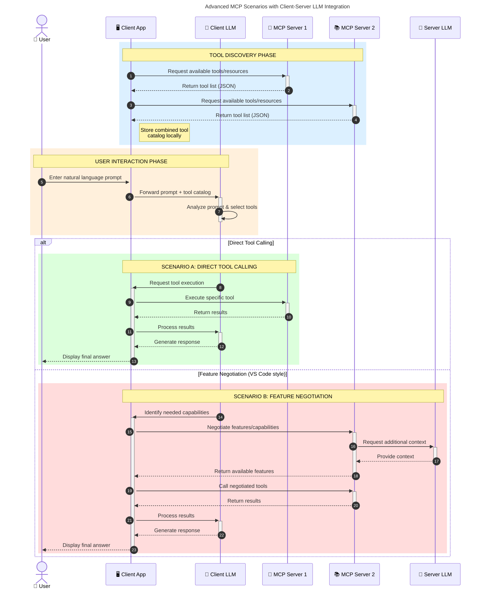

<!--
CO_OP_TRANSLATOR_METADATA:
{
  "original_hash": "9678e0c6945b8e0c23586869b0e26783",
  "translation_date": "2025-10-06T11:04:28+00:00",
  "source_file": "00-Introduction/README.md",
  "language_code": "fi"
}
-->
# Johdatus Model Context Protocoliin (MCP): Miksi se on tärkeä skaalautuville tekoälysovelluksille

_(Klikkaa yllä olevaa kuvaa nähdäksesi tämän oppitunnin videon)_

Generatiiviset tekoälysovellukset ovat merkittävä edistysaskel, sillä ne mahdollistavat usein käyttäjän vuorovaikutuksen sovelluksen kanssa luonnollisen kielen avulla. Kuitenkin, kun näihin sovelluksiin investoidaan enemmän aikaa ja resursseja, haluat varmistaa, että voit helposti integroida toimintoja ja resursseja tavalla, joka on helppo laajentaa, että sovelluksesi tukee useampia malleja ja pystyy käsittelemään eri mallien erityispiirteitä. Lyhyesti sanottuna generatiivisten tekoälysovellusten rakentaminen on helppoa aluksi, mutta niiden kasvaessa ja monimutkaistuessa sinun täytyy alkaa määritellä arkkitehtuuria ja todennäköisesti turvautua standardiin varmistaaksesi, että sovelluksesi rakennetaan johdonmukaisesti. Tässä MCP astuu kuvaan järjestämään asiat ja tarjoamaan standardin.

---

## **🔍 Mikä on Model Context Protocol (MCP)?**

**Model Context Protocol (MCP)** on **avoin, standardoitu rajapinta**, joka mahdollistaa suurten kielimallien (LLM) saumattoman vuorovaikutuksen ulkoisten työkalujen, API:iden ja tietolähteiden kanssa. Se tarjoaa yhtenäisen arkkitehtuurin tekoälymallien toiminnallisuuden laajentamiseksi niiden koulutusdatan ulkopuolelle, mahdollistaen älykkäämmät, skaalautuvammat ja reagoivammat tekoälyjärjestelmät.

---

## **🎯 Miksi standardointi tekoälyssä on tärkeää**

Generatiivisten tekoälysovellusten monimutkaistuessa on välttämätöntä omaksua standardeja, jotka takaavat **skaalautuvuuden, laajennettavuuden, ylläpidettävyyden** ja **toimittajalukon välttämisen**. MCP vastaa näihin tarpeisiin:

- Yhdistämällä mallien ja työkalujen integraatiot
- Vähentämällä hauraita, kertaluonteisia räätälöityjä ratkaisuja
- Mahdollistamalla useiden eri toimittajien mallien yhteiselo yhdessä ekosysteemissä

**Huom:** Vaikka MCP esittää itsensä avoimena standardina, MCP:tä ei ole suunniteltu standardoitavaksi minkään olemassa olevan standardointielimen, kuten IEEE:n, IETF:n, W3C:n, ISO:n tai muiden, kautta.

---

## **📚 Oppimistavoitteet**

Artikkelin lopussa osaat:

- Määritellä **Model Context Protocol (MCP)** ja sen käyttötapaukset
- Ymmärtää, miten MCP standardoi mallien ja työkalujen välisen viestinnän
- Tunnistaa MCP-arkkitehtuurin keskeiset komponentit
- Tutkia MCP:n käytännön sovelluksia yritys- ja kehityskonteksteissa

---

## **💡 Miksi Model Context Protocol (MCP) on mullistava**

### **🔗 MCP ratkaisee tekoälyvuorovaikutusten pirstoutumisen**

Ennen MCP:tä mallien integrointi työkaluihin vaati:

- Räätälöityä koodia jokaista työkalu-malliparia varten
- Ei-standardisoituja API:ita jokaiselle toimittajalle
- Usein rikkoutuvia integraatioita päivitysten vuoksi
- Huonoa skaalautuvuutta useamman työkalun kanssa

### **✅ MCP-standardoinnin hyödyt**

| **Hyöty**                  | **Kuvaus**                                                                     |
|----------------------------|-------------------------------------------------------------------------------|
| Yhteentoimivuus            | LLM:t toimivat saumattomasti eri toimittajien työkalujen kanssa               |
| Johdonmukaisuus            | Yhtenäinen käyttäytyminen eri alustoilla ja työkaluilla                      |
| Uudelleenkäytettävyys      | Kerran rakennetut työkalut voidaan käyttää eri projekteissa ja järjestelmissä |
| Nopeutettu kehitys         | Vähentää kehitysaikaa standardoitujen, plug-and-play -rajapintojen avulla     |

---

## **🧱 MCP-arkkitehtuurin yleiskatsaus**

MCP noudattaa **asiakas-palvelin-mallia**, jossa:

- **MCP Hostit** suorittavat tekoälymalleja
- **MCP Clientit** aloittavat pyynnöt
- **MCP Serverit** tarjoavat kontekstin, työkalut ja ominaisuudet

### **Keskeiset komponentit:**

- **Resurssit** – Staattiset tai dynaamiset datat malleille  
- **Promptit** – Ennalta määritellyt työnkulut ohjattua generointia varten  
- **Työkalut** – Suoritettavat toiminnot, kuten haku, laskelmat  
- **Näytteenotto** – Agenttikäyttäytyminen rekursiivisten vuorovaikutusten kautta  

---

## Miten MCP-serverit toimivat

MCP-serverit toimivat seuraavasti:

- **Pyyntöjen kulku**:
    1. Käyttäjä tai hänen puolestaan toimiva ohjelmisto aloittaa pyynnön.
    2. **MCP Client** lähettää pyynnön **MCP Hostille**, joka hallinnoi tekoälymallin suoritusympäristöä.
    3. **Tekoälymalli** vastaanottaa käyttäjän promptin ja saattaa pyytää pääsyä ulkoisiin työkaluihin tai dataan yhden tai useamman työkalukutsun kautta.
    4. **MCP Host**, ei malli suoraan, kommunikoi asianmukaisten **MCP Serverien** kanssa käyttäen standardoitua protokollaa.
- **MCP Hostin toiminnallisuus**:
    - **Työkalurekisteri**: Ylläpitää luetteloa saatavilla olevista työkaluista ja niiden ominaisuuksista.
    - **Autentikointi**: Varmistaa työkalujen käyttöoikeudet.
    - **Pyyntöjen käsittelijä**: Käsittelee mallin lähettämät työkalupyynnöt.
    - **Vastausmuotoilija**: Muotoilee työkalujen tuotokset mallin ymmärtämään muotoon.
- **MCP Serverin suoritus**:
    - **MCP Host** ohjaa työkalukutsut yhdelle tai useammalle **MCP Serverille**, joista kukin tarjoaa erikoistuneita toimintoja (esim. haku, laskelmat, tietokantakyselyt).
    - **MCP Serverit** suorittavat omat toimintonsa ja palauttavat tulokset **MCP Hostille** yhtenäisessä muodossa.
    - **MCP Host** muotoilee ja välittää nämä tulokset **tekoälymallille**.
- **Vastauksen viimeistely**:
    - **Tekoälymalli** sisällyttää työkalujen tuotokset lopulliseen vastaukseen.
    - **MCP Host** lähettää tämän vastauksen takaisin **MCP Clientille**, joka toimittaa sen loppukäyttäjälle tai kutsuvalle ohjelmistolle.

## 👨‍💻 MCP-serverin rakentaminen (esimerkkien avulla)

MCP-serverit mahdollistavat LLM-ominaisuuksien laajentamisen tarjoamalla dataa ja toiminnallisuutta.

Valmis kokeilemaan? Tässä kieli- ja/tai stack-kohtaisia SDK:ita esimerkkien kanssa yksinkertaisten MCP-serverien luomiseksi eri kielillä/stackeilla:

- **Python SDK**: https://github.com/modelcontextprotocol/python-sdk

- **TypeScript SDK**: https://github.com/modelcontextprotocol/typescript-sdk

- **Java SDK**: https://github.com/modelcontextprotocol/java-sdk

- **C#/.NET SDK**: https://github.com/modelcontextprotocol/csharp-sdk

## 🌍 MCP:n käytännön sovellukset

MCP mahdollistaa laajan valikoiman sovelluksia laajentamalla tekoälyn kyvykkyyksiä:

| **Sovellus**                | **Kuvaus**                                                                     |
|-----------------------------|-------------------------------------------------------------------------------|
| Yritysdatan integrointi     | Yhdistä LLM:t tietokantoihin, CRM-järjestelmiin tai sisäisiin työkaluihin     |
| Agenttiset tekoälyjärjestelmät | Mahdollista autonomiset agentit työkalujen käytöllä ja päätöksentekotyönkuluilla |
| Multimodaaliset sovellukset | Yhdistä teksti-, kuva- ja äänityökalut yhteen yhtenäiseen tekoälysovellukseen |
| Reaaliaikainen dataintegraatio | Tuo live-data tekoälyvuorovaikutuksiin tarkempia ja ajankohtaisempia tuloksia varten |

### 🧠 MCP = Universaali standardi tekoälyvuorovaikutuksille

Model Context Protocol (MCP) toimii universaalina standardina tekoälyvuorovaikutuksille, aivan kuten USB-C standardoi fyysiset liitännät laitteille. Tekoälyn maailmassa MCP tarjoaa yhtenäisen rajapinnan, joka mahdollistaa mallien (asiakkaiden) saumattoman integraation ulkoisten työkalujen ja datapalvelujen (serverien) kanssa. Tämä poistaa tarpeen monimuotoisille, räätälöidyille protokollille jokaiselle API:lle tai datalähteelle.

MCP:n alaisuudessa MCP-yhteensopiva työkalu (kutsutaan MCP-serveriksi) noudattaa yhtenäistä standardia. Nämä serverit voivat listata tarjoamansa työkalut tai toiminnot ja suorittaa ne, kun tekoälyagentti pyytää. MCP:tä tukevat tekoälyagenttialustat pystyvät löytämään saatavilla olevat työkalut servereiltä ja kutsumaan niitä tämän standardoidun protokollan kautta.

### 💡 Mahdollistaa tiedon saatavuuden

Työkalujen tarjoamisen lisäksi MCP mahdollistaa tiedon saatavuuden. Se mahdollistaa sovellusten tarjoavan kontekstia suurille kielimalleille (LLM) yhdistämällä ne erilaisiin tietolähteisiin. Esimerkiksi MCP-serveri voi edustaa yrityksen dokumenttivarastoa, jolloin agentit voivat hakea relevanttia tietoa tarpeen mukaan. Toinen serveri voi hoitaa tiettyjä toimintoja, kuten sähköpostien lähettämistä tai tietueiden päivittämistä. Agentin näkökulmasta nämä ovat yksinkertaisesti työkaluja, joita se voi käyttää—jotkut työkalut palauttavat dataa (tietokonteksti), kun taas toiset suorittavat toimintoja. MCP hallinnoi molempia tehokkaasti.

Agentti, joka yhdistyy MCP-serveriin, oppii automaattisesti serverin tarjoamat kyvykkyydet ja saatavilla olevan datan standardoidussa muodossa. Tämä standardointi mahdollistaa dynaamisen työkalujen saatavuuden. Esimerkiksi uuden MCP-serverin lisääminen agentin järjestelmään tekee sen toiminnot välittömästi käytettäviksi ilman, että agentin ohjeita tarvitsee räätälöidä.

Tämä virtaviivaistettu integraatio vastaa seuraavassa kaaviossa kuvattua kulkua, jossa serverit tarjoavat sekä työkaluja että tietoa, varmistaen saumattoman yhteistyön järjestelmien välillä.

### 👉 Esimerkki: Skaalautuva agenttiratkaisu

Universal Connector mahdollistaa MCP-serverien välisen viestinnän ja kyvykkyyksien jakamisen, jolloin ServerA voi delegoida tehtäviä ServerB:lle tai käyttää sen työkaluja ja tietoa. Tämä yhdistää työkalut ja datan serverien välillä, tukien skaalautuvia ja modulaarisia agenttiarkkitehtuureja. Koska MCP standardoi työkalujen esittelyn, agentit voivat dynaamisesti löytää ja ohjata pyyntöjä serverien välillä ilman kovakoodattuja integraatioita.

Työkalujen ja tiedon yhdistäminen: Työkalut ja data voivat olla saatavilla serverien välillä, mahdollistaen skaalautuvammat ja modulaarisemmat agenttiset arkkitehtuurit.

### 🔄 Kehittyneet MCP-skenaariot asiakaspuolen LLM-integraatiolla

Perus-MCP-arkkitehtuurin lisäksi on kehittyneitä skenaarioita, joissa sekä asiakas että serveri sisältävät LLM:t, mahdollistaen monimutkaisemmat vuorovaikutukset. Seuraavassa kaaviossa **Client App** voisi olla IDE, jossa on useita MCP-työkaluja käyttäjän LLM:n käytettävissä:

## 🔐 MCP:n käytännön hyödyt

Tässä MCP:n käytännön hyödyt:

- **Ajankohtaisuus**: Mallit voivat käyttää ajankohtaista tietoa koulutusdatansa ulkopuolelta
- **Kyvykkyyksien laajentaminen**: Mallit voivat hyödyntää erikoistuneita työkaluja tehtäviin, joihin niitä ei ole koulutettu
- **Vähentyneet harhat**: Ulkoiset tietolähteet tarjoavat faktapohjaa
- **Tietosuoja**: Arkaluontoinen data voi pysyä turvallisissa ympäristöissä sen sijaan, että se sisällytettäisiin promptteihin

## 📌 Keskeiset opit

Seuraavat ovat keskeisiä oppeja MCP:n käytöstä:

- **MCP** standardoi, miten tekoälymallit vuorovaikuttavat työkalujen ja datan kanssa
- Edistää **laajennettavuutta, johdonmukaisuutta ja yhteentoimivuutta**
- MCP auttaa **vähentämään kehitysaikaa, parantamaan luotettavuutta ja laajentamaan mallien kyvykkyyksiä**
- Asiakas-palvelin-arkkitehtuuri **mahdollistaa joustavat, laajennettavat tekoälysovellukset**

## 🧠 Harjoitus

Ajattele tekoälysovellusta, jonka haluaisit rakentaa.

- Mitkä **ulkoiset työkalut tai data** voisivat parantaa sen kyvykkyyksiä?
- Miten MCP voisi tehdä integraatiosta **yksinkertaisempaa ja luotettavampaa?**

## Lisäresurssit

- [MCP GitHub Repository](https://github.com/modelcontextprotocol)

## Mitä seuraavaksi

Seuraavaksi: [Luku 1: Keskeiset käsitteet](../01-CoreConcepts/README.md)

---

**Vastuuvapauslauseke**:  
Tämä asiakirja on käännetty käyttämällä tekoälypohjaista käännöspalvelua [Co-op Translator](https://github.com/Azure/co-op-translator). Vaikka pyrimme tarkkuuteen, huomioithan, että automaattiset käännökset voivat sisältää virheitä tai epätarkkuuksia. Alkuperäistä asiakirjaa sen alkuperäisellä kielellä tulisi pitää ensisijaisena lähteenä. Kriittisen tiedon osalta suositellaan ammattimaista ihmiskäännöstä. Emme ole vastuussa väärinkäsityksistä tai virhetulkinnoista, jotka johtuvat tämän käännöksen käytöstä.