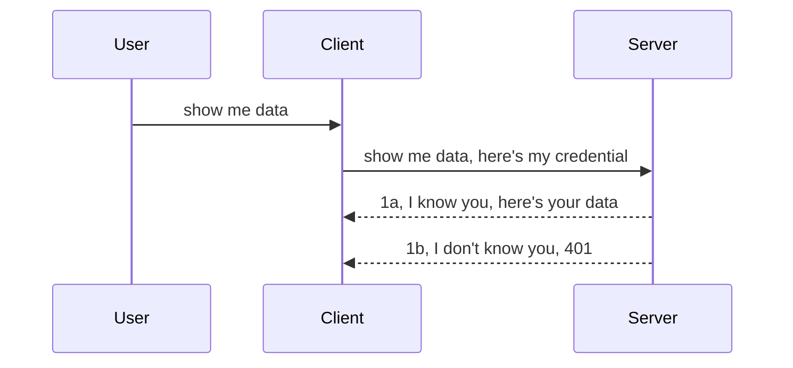

<!--
CO_OP_TRANSLATOR_METADATA:
{
  "original_hash": "5b00b8a8971a07d2d8803be4c9f138f8",
  "translation_date": "2025-10-07T00:54:31+00:00",
  "source_file": "03-GettingStarted/11-simple-auth/README.md",
  "language_code": "fi"
}
-->
# Yksinkertainen tunnistus

MCP SDK:t tukevat OAuth 2.1 -protokollan käyttöä, joka on rehellisesti sanottuna melko monimutkainen prosessi. Siihen liittyy käsitteitä, kuten tunnistuspalvelin, resurssipalvelin, tunnistetietojen lähettäminen, koodin hankkiminen, koodin vaihtaminen kantajatunnukseen, kunnes lopulta pääset käsiksi resurssitietoihisi. Jos et ole tottunut OAuthiin, joka on erinomainen toteutettava asia, on hyvä aloittaa perusautentikoinnista ja edetä kohti parempaa ja turvallisempaa järjestelmää. Juuri siksi tämä luku on olemassa: auttaakseen sinua kehittymään kohti edistyneempää tunnistusta.

## Mitä tunnistuksella tarkoitetaan?

Tunnistus tarkoittaa autentikointia ja auktorisointia. Ajatus on, että meidän täytyy tehdä kaksi asiaa:

- **Autentikointi**, eli prosessi, jossa selvitetään, sallimmeko henkilön tulla "taloomme", eli onko hänellä oikeus olla "tässä" eli pääsy MCP Serverin resurssipalvelimeen, jossa MCP Serverin ominaisuudet sijaitsevat.
- **Auktorisointi**, eli prosessi, jossa selvitetään, onko käyttäjällä oikeus käyttää juuri niitä resursseja, joita hän pyytää, esimerkiksi tiettyjä tilauksia tai tuotteita, tai onko hänellä oikeus lukea sisältöä mutta ei poistaa sitä.

## Tunnistetiedot: miten kerromme järjestelmälle, kuka olemme

Useimmat verkkokehittäjät ajattelevat tunnistetietojen tarjoamista palvelimelle, yleensä salaisuutta, joka kertoo, onko heillä oikeus olla "tässä" eli autentikointi. Tämä tunnistetieto on yleensä base64-koodattu versio käyttäjänimestä ja salasanasta tai API-avain, joka yksilöi tietyn käyttäjän.

Tämä tapahtuu lähettämällä tunnistetieto otsikon "Authorization" kautta, esimerkiksi näin:

```json
{ "Authorization": "secret123" }
```

Tätä kutsutaan yleensä perusautentikoinniksi. Kokonaisprosessin kulku toimii seuraavasti:



Kun ymmärrämme, miten tämä toimii prosessina, miten voimme toteuttaa sen? Useimmilla verkkopalvelimilla on käsite nimeltä middleware, eli koodinpätkä, joka suoritetaan osana pyyntöä ja joka voi tarkistaa tunnistetiedot. Jos tunnistetiedot ovat kelvollisia, pyyntö pääsee läpi. Jos tunnistetiedot eivät ole kelvollisia, saat tunnistusvirheen. Katsotaanpa, miten tämä voidaan toteuttaa:

**Python**

```python
class AuthMiddleware(BaseHTTPMiddleware):
    async def dispatch(self, request, call_next):

        has_header = request.headers.get("Authorization")
        if not has_header:
            print("-> Missing Authorization header!")
            return Response(status_code=401, content="Unauthorized")

        if not valid_token(has_header):
            print("-> Invalid token!")
            return Response(status_code=403, content="Forbidden")

        print("Valid token, proceeding...")
       
        response = await call_next(request)
        # add any customer headers or change in the response in some way
        return response


starlette_app.add_middleware(CustomHeaderMiddleware)
```

Tässä olemme:

- Luoneet middleware-nimisen `AuthMiddleware`, jonka `dispatch`-metodia verkkopalvelin kutsuu.
- Lisänneet middleware-palvelimen yhteyteen:

    ```python
    starlette_app.add_middleware(AuthMiddleware)
    ```

- Kirjoittaneet validointilogiikan, joka tarkistaa, onko Authorization-otsikko läsnä ja onko lähetetty salaisuus kelvollinen:

    ```python
    has_header = request.headers.get("Authorization")
    if not has_header:
        print("-> Missing Authorization header!")
        return Response(status_code=401, content="Unauthorized")

    if not valid_token(has_header):
        print("-> Invalid token!")
        return Response(status_code=403, content="Forbidden")
    ```

    Jos salaisuus on läsnä ja kelvollinen, annamme pyynnön mennä läpi kutsumalla `call_next` ja palautamme vastauksen.

    ```python
    response = await call_next(request)
    # add any customer headers or change in the response in some way
    return response
    ```

Näin se toimii: jos verkkopyyntö tehdään palvelimelle, middleware aktivoituu ja sen toteutuksen perusteella se joko antaa pyynnön mennä läpi tai palauttaa virheen, joka osoittaa, ettei asiakkaalla ole lupaa jatkaa.

**TypeScript**

Tässä luomme middleware:n suositulla Express-kehyksellä ja sieppaamme pyynnön ennen kuin se saavuttaa MCP Serverin. Tässä on koodi:

```typescript
function isValid(secret) {
    return secret === "secret123";
}

app.use((req, res, next) => {
    // 1. Authorization header present?  
    if(!req.headers["Authorization"]) {
        res.status(401).send('Unauthorized');
    }
    
    let token = req.headers["Authorization"];

    // 2. Check validity.
    if(!isValid(token)) {
        res.status(403).send('Forbidden');
    }

   
    console.log('Middleware executed');
    // 3. Passes request to the next step in the request pipeline.
    next();
});
```

Tässä koodissa:

1. Tarkistamme, onko Authorization-otsikko ylipäätään läsnä. Jos ei, lähetämme 401-virheen.
2. Varmistamme, että tunnistetieto/tunnus on kelvollinen. Jos ei, lähetämme 403-virheen.
3. Lopuksi annamme pyynnön jatkaa pyynnön käsittelyputkessa ja palautamme pyydetyn resurssin.

## Harjoitus: Toteuta autentikointi

Käytetään oppimaamme ja yritetään toteuttaa se. Tässä on suunnitelma:

Palvelin

- Luo verkkopalvelin ja MCP-instanssi.
- Toteuta middleware palvelimelle.

Asiakas

- Lähetä verkkopyyntö tunnistetiedon kanssa otsikon kautta.

### -1- Luo verkkopalvelin ja MCP-instanssi

Ensimmäisessä vaiheessa meidän täytyy luoda verkkopalvelininstanssi ja MCP Server.

**Python**

Tässä luomme MCP Server -instanssin, starlette-verkkosovelluksen ja isännöimme sen uvicornilla.

```python
# creating MCP Server

app = FastMCP(
    name="MCP Resource Server",
    instructions="Resource Server that validates tokens via Authorization Server introspection",
    host=settings["host"],
    port=settings["port"],
    debug=True
)

# creating starlette web app
starlette_app = app.streamable_http_app()

# serving app via uvicorn
async def run(starlette_app):
    import uvicorn
    config = uvicorn.Config(
            starlette_app,
            host=app.settings.host,
            port=app.settings.port,
            log_level=app.settings.log_level.lower(),
        )
    server = uvicorn.Server(config)
    await server.serve()

run(starlette_app)
```

Tässä koodissa:

- Luomme MCP Serverin.
- Rakennamme starlette-verkkosovelluksen MCP Serveristä, `app.streamable_http_app()`.
- Isännöimme ja palvelemme verkkosovellusta uvicornilla `server.serve()`.

**TypeScript**

Tässä luomme MCP Server -instanssin.

```typescript
const server = new McpServer({
      name: "example-server",
      version: "1.0.0"
    });

    // ... set up server resources, tools, and prompts ...
```

Tämä MCP Serverin luominen täytyy tehdä POST /mcp-reittimäärityksen sisällä, joten siirretään yllä oleva koodi näin:

```typescript
import express from "express";
import { randomUUID } from "node:crypto";
import { McpServer } from "@modelcontextprotocol/sdk/server/mcp.js";
import { StreamableHTTPServerTransport } from "@modelcontextprotocol/sdk/server/streamableHttp.js";
import { isInitializeRequest } from "@modelcontextprotocol/sdk/types.js"

const app = express();
app.use(express.json());

// Map to store transports by session ID
const transports: { [sessionId: string]: StreamableHTTPServerTransport } = {};

// Handle POST requests for client-to-server communication
app.post('/mcp', async (req, res) => {
  // Check for existing session ID
  const sessionId = req.headers['mcp-session-id'] as string | undefined;
  let transport: StreamableHTTPServerTransport;

  if (sessionId && transports[sessionId]) {
    // Reuse existing transport
    transport = transports[sessionId];
  } else if (!sessionId && isInitializeRequest(req.body)) {
    // New initialization request
    transport = new StreamableHTTPServerTransport({
      sessionIdGenerator: () => randomUUID(),
      onsessioninitialized: (sessionId) => {
        // Store the transport by session ID
        transports[sessionId] = transport;
      },
      // DNS rebinding protection is disabled by default for backwards compatibility. If you are running this server
      // locally, make sure to set:
      // enableDnsRebindingProtection: true,
      // allowedHosts: ['127.0.0.1'],
    });

    // Clean up transport when closed
    transport.onclose = () => {
      if (transport.sessionId) {
        delete transports[transport.sessionId];
      }
    };
    const server = new McpServer({
      name: "example-server",
      version: "1.0.0"
    });

    // ... set up server resources, tools, and prompts ...

    // Connect to the MCP server
    await server.connect(transport);
  } else {
    // Invalid request
    res.status(400).json({
      jsonrpc: '2.0',
      error: {
        code: -32000,
        message: 'Bad Request: No valid session ID provided',
      },
      id: null,
    });
    return;
  }

  // Handle the request
  await transport.handleRequest(req, res, req.body);
});

// Reusable handler for GET and DELETE requests
const handleSessionRequest = async (req: express.Request, res: express.Response) => {
  const sessionId = req.headers['mcp-session-id'] as string | undefined;
  if (!sessionId || !transports[sessionId]) {
    res.status(400).send('Invalid or missing session ID');
    return;
  }
  
  const transport = transports[sessionId];
  await transport.handleRequest(req, res);
};

// Handle GET requests for server-to-client notifications via SSE
app.get('/mcp', handleSessionRequest);

// Handle DELETE requests for session termination
app.delete('/mcp', handleSessionRequest);

app.listen(3000);
```

Nyt näet, miten MCP Serverin luominen siirrettiin `app.post("/mcp")`-sisälle.

Siirrytään seuraavaan vaiheeseen, jossa luodaan middleware, jotta voimme validoida saapuvan tunnistetiedon.

### -2- Toteuta middleware palvelimelle

Seuraavaksi luomme middleware:n, joka etsii tunnistetietoa `Authorization`-otsikosta ja validoi sen. Jos se hyväksytään, pyyntö jatkaa eteenpäin ja tekee, mitä sen pitää (esim. listaa työkaluja, lukee resurssin tai mitä tahansa MCP-toiminnallisuutta asiakas pyysi).

**Python**

Middleware:n luomiseksi meidän täytyy luoda luokka, joka perii `BaseHTTPMiddleware`-luokan. Kaksi mielenkiintoista osaa ovat:

- Pyyntö `request`, josta luemme otsikkotiedot.
- `call_next`, palautekutsu, jota meidän täytyy kutsua, jos asiakas tuo tunnistetiedon, jonka hyväksymme.

Ensiksi meidän täytyy käsitellä tapaus, jossa `Authorization`-otsikko puuttuu:

```python
has_header = request.headers.get("Authorization")

# no header present, fail with 401, otherwise move on.
if not has_header:
    print("-> Missing Authorization header!")
    return Response(status_code=401, content="Unauthorized")
```

Tässä lähetämme 401 Unauthorized -viestin, koska asiakas epäonnistuu autentikoinnissa.

Seuraavaksi, jos tunnistetieto on lähetetty, meidän täytyy tarkistaa sen kelvollisuus näin:

```python
 if not valid_token(has_header):
    print("-> Invalid token!")
    return Response(status_code=403, content="Forbidden")
```

Huomaa, miten lähetämme 403 Forbidden -viestin yllä. Katsotaan koko middleware, joka toteuttaa kaiken, mitä mainitsimme:

```python
class AuthMiddleware(BaseHTTPMiddleware):
    async def dispatch(self, request, call_next):

        has_header = request.headers.get("Authorization")
        if not has_header:
            print("-> Missing Authorization header!")
            return Response(status_code=401, content="Unauthorized")

        if not valid_token(has_header):
            print("-> Invalid token!")
            return Response(status_code=403, content="Forbidden")

        print("Valid token, proceeding...")
        print(f"-> Received {request.method} {request.url}")
        response = await call_next(request)
        response.headers['Custom'] = 'Example'
        return response

```

Hienoa, mutta entä `valid_token`-funktio? Tässä se on alla:

```python
# DON'T use for production - improve it !!
def valid_token(token: str) -> bool:
    # remove the "Bearer " prefix
    if token.startswith("Bearer "):
        token = token[7:]
        return token == "secret-token"
    return False
```

Tätä pitäisi tietenkin parantaa.

TÄRKEÄÄ: Sinun ei koskaan pitäisi pitää salaisuuksia koodissa. Sinun pitäisi mieluiten hakea vertailuarvo tietolähteestä tai IDP:stä (identiteettipalveluntarjoaja) tai vielä parempi, antaa IDP:n tehdä validointi.

**TypeScript**

Toteuttaaksemme tämän Expressillä meidän täytyy kutsua `use`-metodia, joka ottaa middleware-funktioita.

Meidän täytyy:

- Vuorovaikuttaa pyyntömuuttujan kanssa tarkistaaksemme lähetetyn tunnistetiedon `Authorization`-ominaisuudesta.
- Validoida tunnistetieto, ja jos se on kelvollinen, antaa pyynnön jatkaa ja antaa asiakkaan MCP-pyynnön tehdä, mitä sen pitää (esim. listata työkaluja, lukea resurssi tai mitä tahansa MCP:hen liittyvää).

Tässä tarkistamme, onko `Authorization`-otsikko läsnä, ja jos ei, pysäytämme pyynnön etenemisen:

```typescript
if(!req.headers["authorization"]) {
    res.status(401).send('Unauthorized');
    return;
}
```

Jos otsikkoa ei lähetetä, saat 401-virheen.

Seuraavaksi tarkistamme, onko tunnistetieto kelvollinen. Jos ei, pysäytämme pyynnön hieman eri viestillä:

```typescript
if(!isValid(token)) {
    res.status(403).send('Forbidden');
    return;
} 
```

Huomaa, miten saat nyt 403-virheen.

Tässä on koko koodi:

```typescript
app.use((req, res, next) => {
    console.log('Request received:', req.method, req.url, req.headers);
    console.log('Headers:', req.headers["authorization"]);
    if(!req.headers["authorization"]) {
        res.status(401).send('Unauthorized');
        return;
    }
    
    let token = req.headers["authorization"];

    if(!isValid(token)) {
        res.status(403).send('Forbidden');
        return;
    }  

    console.log('Middleware executed');
    next();
});
```

Olemme asettaneet verkkopalvelimen hyväksymään middleware:n, joka tarkistaa tunnistetiedon, jonka asiakas toivottavasti lähettää meille. Entä itse asiakas?

### -3- Lähetä verkkopyyntö tunnistetiedon kanssa otsikon kautta

Meidän täytyy varmistaa, että asiakas lähettää tunnistetiedon otsikon kautta. Koska aiomme käyttää MCP-asiakasta tähän, meidän täytyy selvittää, miten se tehdään.

**Python**

Asiakkaalle meidän täytyy lähettää otsikko tunnistetiedon kanssa näin:

```python
# DON'T hardcode the value, have it at minimum in an environment variable or a more secure storage
token = "secret-token"

async with streamablehttp_client(
        url = f"http://localhost:{port}/mcp",
        headers = {"Authorization": f"Bearer {token}"}
    ) as (
        read_stream,
        write_stream,
        session_callback,
    ):
        async with ClientSession(
            read_stream,
            write_stream
        ) as session:
            await session.initialize()
      
            # TODO, what you want done in the client, e.g list tools, call tools etc.
```

Huomaa, miten täytämme `headers`-ominaisuuden näin: `headers = {"Authorization": f"Bearer {token}"}`.

**TypeScript**

Voimme ratkaista tämän kahdessa vaiheessa:

1. Täytä konfiguraatio-objekti tunnistetiedollamme.
2. Lähetä konfiguraatio-objekti kuljetukselle.

```typescript

// DON'T hardcode the value like shown here. At minimum have it as a env variable and use something like dotenv (in dev mode).
let token = "secret123"

// define a client transport option object
let options: StreamableHTTPClientTransportOptions = {
  sessionId: sessionId,
  requestInit: {
    headers: {
      "Authorization": "secret123"
    }
  }
};

// pass the options object to the transport
async function main() {
   const transport = new StreamableHTTPClientTransport(
      new URL(serverUrl),
      options
   );
```

Tässä näet, miten meidän täytyi luoda `options`-objekti ja sijoittaa otsikot `requestInit`-ominaisuuden alle.

TÄRKEÄÄ: Miten voimme parantaa tätä tästä eteenpäin? Nykyisessä toteutuksessa on joitakin ongelmia. Ensinnäkin tunnistetiedon lähettäminen näin on melko riskialtista, ellei sinulla ole vähintään HTTPS:ää. Vaikka HTTPS olisi käytössä, tunnistetieto voidaan varastaa, joten tarvitset järjestelmän, jossa voit helposti peruuttaa tunnuksen ja lisätä lisätarkistuksia, kuten mistä päin maailmaa pyyntö tulee, tapahtuuko pyyntö liian usein (botin kaltainen käyttäytyminen) ja paljon muuta.

On kuitenkin sanottava, että hyvin yksinkertaisille API:ille, joissa et halua kenenkään kutsuvan API:ta ilman autentikointia, tämä on hyvä alku.

Tämän sanottuamme, yritetään parantaa turvallisuutta hieman käyttämällä standardoitua muotoa, kuten JSON Web Tokenia, joka tunnetaan myös nimellä JWT tai "JOT"-tunnukset.

## JSON Web Tokenit, JWT

Yritämme siis parantaa yksinkertaisten tunnistetietojen lähettämistä. Mitä välittömiä parannuksia saamme ottamalla käyttöön JWT:n?

- **Turvallisuusparannukset**. Perusautentikoinnissa lähetät käyttäjänimen ja salasanan base64-koodattuna tunnuksena (tai lähetät API-avaimen) uudelleen ja uudelleen, mikä lisää riskiä. JWT:n avulla lähetät käyttäjänimen ja salasanan ja saat tunnuksen vastineeksi, ja se on myös aikarajoitettu, eli se vanhenee. JWT mahdollistaa hienojakoisen käyttöoikeuksien hallinnan roolien, laajuuksien ja oikeuksien avulla.
- **Tilattomuus ja skaalautuvuus**. JWT:t ovat itsenäisiä, ne sisältävät kaikki käyttäjätiedot ja eliminoivat tarpeen tallentaa palvelinpuolen istuntotietoja. Tunnus voidaan myös validoida paikallisesti.
- **Yhteentoimivuus ja liittoutuminen**. JWT:t ovat keskeisiä Open ID Connectissä ja niitä käytetään tunnetuilla identiteettipalveluntarjoajilla, kuten Entra ID, Google Identity ja Auth0. Ne mahdollistavat myös kertakirjautumisen ja paljon muuta, mikä tekee niistä yritystason ratkaisuja.
- **Modulaarisuus ja joustavuus**. JWT:tä voidaan käyttää myös API-yhdyskäytävien, kuten Azure API Managementin, NGINX:n ja muiden kanssa. Se tukee myös käyttäjäautentikointiskenaarioita ja palvelimesta palvelimeen -kommunikaatiota, mukaan lukien roolinvaihto- ja delegointiskenaariot.
- **Suorituskyky ja välimuisti**. JWT:t voidaan välimuistittaa dekoodauksen jälkeen, mikä vähentää tarvetta jäsentämiseen. Tämä auttaa erityisesti suurten liikennemäärien sovelluksissa, sillä se parantaa läpimenoa ja vähentää kuormitusta valitulla infrastruktuurilla.
- **Edistyneet ominaisuudet**. Se tukee myös introspektiota (tarkistaa kelvollisuuden palvelimella) ja peruutusta (tekee tunnuksen kelvottomaksi).

Kaikkien näiden etujen avulla katsotaan, miten voimme viedä toteutuksemme seuraavalle tasolle.

## Perusautentikoinnin muuttaminen JWT:ksi

Muutokset, jotka meidän täytyy tehdä yleisellä tasolla, ovat:

- **Oppia rakentamaan JWT-tunnus** ja valmistella se lähetettäväksi asiakkaalta palvelimelle.
- **Validoida JWT-tunnus**, ja jos se on kelvollinen, antaa asiakkaan saada resurssimme.
- **Turvallinen tunnuksen tallennus**. Miten tallennamme tämän tunnuksen.
- **Reittien suojaaminen**. Meidän täytyy suojata reitit, meidän tapauksessamme MCP-ominaisuudet.
- **Lisätä päivitystunnukset**. Varmista, että luomme lyhytikäisiä tunnuksia mutta pitkäikäisiä päivitystunnuksia, joita voidaan käyttää uusien tunnusten hankkimiseen, jos ne vanhenevat. Varmista myös, että on olemassa päivityspäätepiste ja rotaatiostrategia.

### -1- Rakenna JWT-tunnus

Ensinnäkin JWT-tunnuksella on seuraavat osat:

- **Otsikko**, käytetty algoritmi ja tunnuksen tyyppi.
- **Sisältö**, väitteet, kuten sub (käyttäjä tai entiteetti, jota tunnus edustaa. Autentikointiskenaariossa tämä on tyypillisesti käyttäjä-ID), exp (milloin se vanhenee), rooli (rooli).
- **Allekirjoitus**, allekirjoitettu salaisuudella tai yksityisellä avaimella.

Tätä varten meidän täytyy rakentaa otsikko, sisältö ja koodattu tunnus.

**Python**

```python

import jwt
import jwt
from jwt.exceptions import ExpiredSignatureError, InvalidTokenError
import datetime

# Secret key used to sign the JWT
secret_key = 'your-secret-key'

header = {
    "alg": "HS256",
    "typ": "JWT"
}

# the user info andits claims and expiry time
payload = {
    "sub": "1234567890",               # Subject (user ID)
    "name": "User Userson",                # Custom claim
    "admin": True,                     # Custom claim
    "iat": datetime.datetime.utcnow(),# Issued at
    "exp": datetime.datetime.utcnow() + datetime.timedelta(hours=1)  # Expiry
}

# encode it
encoded_jwt = jwt.encode(payload, secret_key, algorithm="HS256", headers=header)
```

Yllä olevassa koodissa olemme:

- Määrittäneet otsikon, jossa käytetään HS256-algoritmia ja tyyppiä JWT.
- Rakentaneet sisällön, joka sisältää aiheen tai käyttäjä-ID:n, käyttäjänimen, roolin, milloin se on annettu ja milloin sen on määrä vanhentua, toteuttaen aikarajoituksen, jonka mainitsimme aiemmin.

**TypeScript**

Tässä tarvitsemme joitakin riippuvuuksia, jotka auttavat meitä rakentamaan JWT-tunnuksen.

Riippuvuudet

```sh

npm install jsonwebtoken
npm install --save-dev @types/jsonwebtoken
```

Kun tämä on paikallaan, luodaan otsikko, sisältö ja sen kautta koodattu tunnus.

```typescript
import jwt from 'jsonwebtoken';

const secretKey = 'your-secret-key'; // Use env vars in production

// Define the payload
const payload = {
  sub: '1234567890',
  name: 'User usersson',
  admin: true,
  iat: Math.floor(Date.now() / 1000), // Issued at
  exp: Math.floor(Date.now() / 1000) + 60 * 60 // Expires in 1 hour
};

// Define the header (optional, jsonwebtoken sets defaults)
const header = {
  alg: 'HS256',
  typ: 'JWT'
};

// Create the token
const token = jwt.sign(payload, secretKey, {
  algorithm: 'HS256',
  header: header
});

console.log('JWT:', token);
```

Tämä tunnus on:

Allekirjoitettu käyttäen HS256-algoritmia
Voimassa 1 tunnin ajan
Sisältää väitteitä, kuten sub, name, admin, iat ja exp.

### -2- Validoi tunnus

Meidän täytyy myös validoida tunnus, tämä pitäisi tehdä palvelimella varmistaaksemme, että asiakas lähettää meille kelvollisen tunnuksen. Tässä on monia tarkistuksia, jotka meidän pitäisi tehdä, rakenteen validoinnista kelvollisuuden tarkistamiseen. Sinua kannustetaan myös lisäämään muita tarkistuksia, kuten onko käyttäjä järjestelmässäsi ja paljon muuta.

Tunnuksen validointia varten meidän täytyy dekoodata se, jotta voimme lukea sen ja aloittaa sen kelvollisuuden tarkistamisen:

**Python**

```python

# Decode and verify the JWT
try:
    decoded = jwt.decode(token, secret_key, algorithms=["HS256"])
    print("✅ Token is valid.")
    print("Decoded claims:")
    for key, value in decoded.items():
        print(f"  {key}: {value}")
except ExpiredSignatureError:
    print("❌ Token has expired.")
except InvalidTokenError as e:
    print(f"❌ Invalid token: {e}")

```

Tässä koodissa kutsumme `jwt.decode`-metodia käyttäen tunnusta, salaisuutta ja valittua algoritmia syötteenä. Huomaa, miten käytämme try-catch-rakennetta, koska epäonnistunut validointi johtaa virheen syntymiseen.

**TypeScript**

Tässä meidän täytyy kutsua `jwt.verify` saadaksemme dekoodatun version tunnuksesta, jota voimme analysoida tarkemmin. Jos tämä kutsu epäonnistuu, se tarkoittaa, että tunnuksen rakenne on virheellinen tai se ei ole enää kelvollinen.

```typescript

try {
  const decoded = jwt.verify(token, secretKey);
  console.log('Decoded Payload:', decoded);
} catch (err) {
  console.error('Token verification failed:', err);
}
```

HUOM: kuten aiemmin mainittiin, meidän pitäisi tehdä lisätarkistuksia varmistaaksemme, että tämä tunnus viittaa käyttäjään järjestelmässämme ja että käyttäjällä on oikeudet, joita hän väittää omaavansa.
Seuraavaksi tarkastellaan roolipohjaista käyttöoikeuksien hallintaa, joka tunnetaan myös nimellä RBAC.

## Roolipohjaisen käyttöoikeuksien hallinnan lisääminen

Tavoitteena on ilmaista, että eri rooleilla on erilaiset käyttöoikeudet. Esimerkiksi oletamme, että ylläpitäjä voi tehdä kaiken, tavallinen käyttäjä voi lukea ja kirjoittaa, ja vierailija voi vain lukea. Tässä on joitakin mahdollisia käyttöoikeustasoja:

- Admin.Write 
- User.Read
- Guest.Read

Katsotaan, kuinka voimme toteuttaa tällaisen hallinnan väliohjelmiston avulla. Väliohjelmistoja voidaan lisätä yksittäisille reiteille sekä kaikille reiteille.

**Python**

```python
from starlette.middleware.base import BaseHTTPMiddleware
from starlette.responses import JSONResponse
import jwt

# DON'T have the secret in the code like, this is for demonstration purposes only. Read it from a safe place.
SECRET_KEY = "your-secret-key" # put this in env variable
REQUIRED_PERMISSION = "User.Read"

class JWTPermissionMiddleware(BaseHTTPMiddleware):
    async def dispatch(self, request, call_next):
        auth_header = request.headers.get("Authorization")
        if not auth_header or not auth_header.startswith("Bearer "):
            return JSONResponse({"error": "Missing or invalid Authorization header"}, status_code=401)

        token = auth_header.split(" ")[1]
        try:
            decoded = jwt.decode(token, SECRET_KEY, algorithms=["HS256"])
        except jwt.ExpiredSignatureError:
            return JSONResponse({"error": "Token expired"}, status_code=401)
        except jwt.InvalidTokenError:
            return JSONResponse({"error": "Invalid token"}, status_code=401)

        permissions = decoded.get("permissions", [])
        if REQUIRED_PERMISSION not in permissions:
            return JSONResponse({"error": "Permission denied"}, status_code=403)

        request.state.user = decoded
        return await call_next(request)


```

On olemassa muutamia eri tapoja lisätä väliohjelmisto, kuten alla:

```python

# Alt 1: add middleware while constructing starlette app
middleware = [
    Middleware(JWTPermissionMiddleware)
]

app = Starlette(routes=routes, middleware=middleware)

# Alt 2: add middleware after starlette app is a already constructed
starlette_app.add_middleware(JWTPermissionMiddleware)

# Alt 3: add middleware per route
routes = [
    Route(
        "/mcp",
        endpoint=..., # handler
        middleware=[Middleware(JWTPermissionMiddleware)]
    )
]
```

**TypeScript**

Voimme käyttää `app.use`-metodia ja väliohjelmistoa, joka suoritetaan kaikille pyynnöille.

```typescript
app.use((req, res, next) => {
    console.log('Request received:', req.method, req.url, req.headers);
    console.log('Headers:', req.headers["authorization"]);

    // 1. Check if authorization header has been sent

    if(!req.headers["authorization"]) {
        res.status(401).send('Unauthorized');
        return;
    }
    
    let token = req.headers["authorization"];

    // 2. Check if token is valid
    if(!isValid(token)) {
        res.status(403).send('Forbidden');
        return;
    }  

    // 3. Check if token user exist in our system
    if(!isExistingUser(token)) {
        res.status(403).send('Forbidden');
        console.log("User does not exist");
        return;
    }
    console.log("User exists");

    // 4. Verify the token has the right permissions
    if(!hasScopes(token, ["User.Read"])){
        res.status(403).send('Forbidden - insufficient scopes');
    }

    console.log("User has required scopes");

    console.log('Middleware executed');
    next();
});

```

Väliohjelmistolla on useita tehtäviä, jotka sen pitäisi suorittaa, nimittäin:

1. Tarkistaa, onko Authorization-otsikko läsnä
2. Tarkistaa, onko token voimassa. Käytämme `isValid`-metodia, jonka olemme kirjoittaneet tarkistamaan JWT-tokenin eheyttä ja voimassaoloa.
3. Varmistaa, että käyttäjä on olemassa järjestelmässämme. Tämä tulisi tarkistaa.

   ```typescript
    // users in DB
   const users = [
     "user1",
     "User usersson",
   ]

   function isExistingUser(token) {
     let decodedToken = verifyToken(token);

     // TODO, check if user exists in DB
     return users.includes(decodedToken?.name || "");
   }
   ```

   Yllä olemme luoneet hyvin yksinkertaisen `users`-listan, joka pitäisi tietenkin olla tietokannassa.

4. Lisäksi meidän tulisi myös tarkistaa, että tokenilla on oikeat käyttöoikeudet.

   ```typescript
   if(!hasScopes(token, ["User.Read"])){
        res.status(403).send('Forbidden - insufficient scopes');
   }
   ```

   Yllä olevassa väliohjelmiston koodissa tarkistamme, että token sisältää User.Read-käyttöoikeuden. Jos ei, lähetämme 403-virheen. Alla on `hasScopes`-apumetodi.

   ```typescript
   function hasScopes(scope: string, requiredScopes: string[]) {
     let decodedToken = verifyToken(scope);
    return requiredScopes.every(scope => decodedToken?.scopes.includes(scope));
  }
   ```

Have a think which additional checks you should be doing, but these are the absolute minimum of checks you should be doing.

Using Express as a web framework is a common choice. There are helpers library when you use JWT so you can write less code.

- `express-jwt`, helper library that provides a middleware that helps decode your token.
- `express-jwt-permissions`, this provides a middleware `guard` that helps check if a certain permission is on the token.

Here's what these libraries can look like when used:

```typescript
const express = require('express');
const jwt = require('express-jwt');
const guard = require('express-jwt-permissions')();

const app = express();
const secretKey = 'your-secret-key'; // put this in env variable

// Decode JWT and attach to req.user
app.use(jwt({ secret: secretKey, algorithms: ['HS256'] }));

// Check for User.Read permission
app.use(guard.check('User.Read'));

// multiple permissions
// app.use(guard.check(['User.Read', 'Admin.Access']));

app.get('/protected', (req, res) => {
  res.json({ message: `Welcome ${req.user.name}` });
});

// Error handler
app.use((err, req, res, next) => {
  if (err.code === 'permission_denied') {
    return res.status(403).send('Forbidden');
  }
  next(err);
});

```

Nyt kun olet nähnyt, kuinka väliohjelmistoa voidaan käyttää sekä autentikointiin että valtuutukseen, entä MCP? Muuttaako se tapaa, jolla teemme autentikointia? Otetaan selvää seuraavassa osiossa.

### -3- RBAC:n lisääminen MCP:hen

Olet tähän mennessä nähnyt, kuinka RBAC voidaan lisätä väliohjelmiston avulla. MCP:ssä ei kuitenkaan ole helppoa tapaa lisätä RBAC:ia yksittäisille MCP-ominaisuuksille. Mitä siis teemme? Meidän täytyy vain lisätä koodia, joka tarkistaa, onko asiakkaalla oikeudet kutsua tiettyä työkalua:

Sinulla on muutamia eri vaihtoehtoja, kuinka toteuttaa RBAC yksittäisille ominaisuuksille. Tässä joitakin:

- Lisää tarkistus jokaiselle työkalulle, resurssille tai kehotteelle, jossa sinun täytyy tarkistaa käyttöoikeustaso.

   **Python**

   ```python
   @tool()
   def delete_product(id: int):
      try:
          check_permissions(role="Admin.Write", request)
      catch:
        pass # client failed authorization, raise authorization error
   ```

   **TypeScript**

   ```typescript
   server.registerTool(
    "delete-product",
    {
      title: Delete a product",
      description: "Deletes a product",
      inputSchema: { id: z.number() }
    },
    async ({ id }) => {
      
      try {
        checkPermissions("Admin.Write", request);
        // todo, send id to productService and remote entry
      } catch(Exception e) {
        console.log("Authorization error, you're not allowed");  
      }

      return {
        content: [{ type: "text", text: `Deletected product with id ${id}` }]
      };
    }
   );
   ```


- Käytä kehittynyttä palvelinlähestymistapaa ja pyyntöjen käsittelijöitä, jotta voit minimoida paikat, joissa tarkistus täytyy tehdä.

   **Python**

   ```python
   
   tool_permission = {
      "create_product": ["User.Write", "Admin.Write"],
      "delete_product": ["Admin.Write"]
   }

   def has_permission(user_permissions, required_permissions) -> bool:
      # user_permissions: list of permissions the user has
      # required_permissions: list of permissions required for the tool
      return any(perm in user_permissions for perm in required_permissions)

   @server.call_tool()
   async def handle_call_tool(
     name: str, arguments: dict[str, str] | None
   ) -> list[types.TextContent]:
    # Assume request.user.permissions is a list of permissions for the user
     user_permissions = request.user.permissions
     required_permissions = tool_permission.get(name, [])
     if not has_permission(user_permissions, required_permissions):
        # Raise error "You don't have permission to call tool {name}"
        raise Exception(f"You don't have permission to call tool {name}")
     # carry on and call tool
     # ...
   ```   
   

   **TypeScript**

   ```typescript
   function hasPermission(userPermissions: string[], requiredPermissions: string[]): boolean {
       if (!Array.isArray(userPermissions) || !Array.isArray(requiredPermissions)) return false;
       // Return true if user has at least one required permission
       
       return requiredPermissions.some(perm => userPermissions.includes(perm));
   }
  
   server.setRequestHandler(CallToolRequestSchema, async (request) => {
      const { params: { name } } = request;
  
      let permissions = request.user.permissions;
  
      if (!hasPermission(permissions, toolPermissions[name])) {
         return new Error(`You don't have permission to call ${name}`);
      }
  
      // carry on..
   });
   ```

   Huomaa, että sinun täytyy varmistaa, että väliohjelmisto liittää dekoodatun tokenin pyynnön user-ominaisuuteen, jotta yllä oleva koodi yksinkertaistuu.

### Yhteenveto

Nyt kun olemme keskustelleet, kuinka lisätä tuki RBAC:lle yleisesti ja erityisesti MCP:lle, on aika yrittää toteuttaa turvallisuutta itse varmistaaksesi, että ymmärsit esitetyt käsitteet.

## Tehtävä 1: Rakenna MCP-palvelin ja MCP-asiakas käyttäen perusautentikointia

Tässä käytät oppimaasi tietoa lähettämällä tunnistetietoja otsikoiden kautta.

## Ratkaisu 1

[Ratkaisu 1](./code/basic/README.md)

## Tehtävä 2: Päivitä tehtävän 1 ratkaisu käyttämään JWT:tä

Ota ensimmäinen ratkaisu, mutta paranna sitä tällä kertaa.

Sen sijaan, että käyttäisit perusautentikointia, käytä JWT:tä.

## Ratkaisu 2

[Ratkaisu 2](./solution/jwt-solution/README.md)

## Haaste

Lisää RBAC työkalukohtaisesti, kuten kuvataan osiossa "RBAC:n lisääminen MCP:hen".

## Yhteenveto

Toivottavasti olet oppinut paljon tässä luvussa, alkaen täysin ilman turvallisuutta, siirtyen perusautentikointiin, JWT:hen ja siihen, kuinka se voidaan lisätä MCP:hen.

Olemme rakentaneet vankan perustan mukautetuilla JWT:illä, mutta kun skaalaamme, siirrymme kohti standardipohjaista identiteettimallia. Identiteettipalveluntarjoajan, kuten Entran tai Keycloak'n, käyttöönotto antaa meille mahdollisuuden siirtää tokenien luomisen, validoinnin ja elinkaaren hallinnan luotettavalle alustalle — vapauttaen meidät keskittymään sovelluslogiikkaan ja käyttäjäkokemukseen.

Tätä varten meillä on [edistyneempi luku Entrasta](../../05-AdvancedTopics/mcp-security-entra/README.md)

---

**Vastuuvapauslauseke**:  
Tämä asiakirja on käännetty käyttämällä tekoälypohjaista käännöspalvelua [Co-op Translator](https://github.com/Azure/co-op-translator). Vaikka pyrimme tarkkuuteen, huomioithan, että automaattiset käännökset voivat sisältää virheitä tai epätarkkuuksia. Alkuperäinen asiakirja sen alkuperäisellä kielellä tulisi pitää ensisijaisena lähteenä. Kriittisen tiedon osalta suositellaan ammattimaista ihmiskäännöstä. Emme ole vastuussa väärinkäsityksistä tai virhetulkinnoista, jotka johtuvat tämän käännöksen käytöstä.