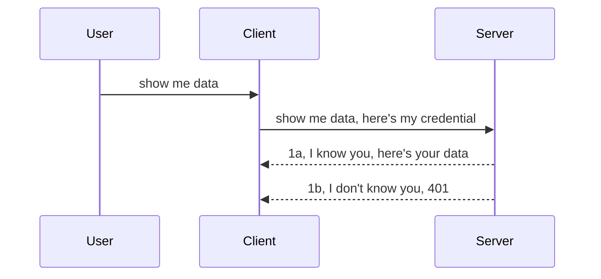

<!--
CO_OP_TRANSLATOR_METADATA:
{
  "original_hash": "5b00b8a8971a07d2d8803be4c9f138f8",
  "translation_date": "2025-10-07T00:29:44+00:00",
  "source_file": "03-GettingStarted/11-simple-auth/README.md",
  "language_code": "fr"
}
-->
# Authentification simple

Les SDK MCP prennent en charge l'utilisation d'OAuth 2.1, qui, pour être honnête, est un processus assez complexe impliquant des concepts tels que serveur d'authentification, serveur de ressources, envoi de données d'identification, obtention d'un code, échange du code contre un jeton d'accès jusqu'à ce que vous puissiez enfin accéder à vos données de ressources. Si vous n'êtes pas familier avec OAuth, qui est une excellente solution à implémenter, il est judicieux de commencer par un niveau d'authentification basique et de progresser vers une sécurité de plus en plus robuste. C'est pourquoi ce chapitre existe : pour vous guider vers des méthodes d'authentification plus avancées.

## Authentification, qu'entendons-nous par là ?

L'authentification est une abréviation pour "authentication" et "authorization". L'idée est que nous devons accomplir deux choses :

- **Authentication** : le processus qui consiste à déterminer si nous autorisons une personne à entrer dans notre maison, c'est-à-dire si elle a le droit d'être "ici", c'est-à-dire d'accéder à notre serveur de ressources où se trouvent les fonctionnalités du serveur MCP.
- **Authorization** : le processus qui consiste à déterminer si un utilisateur doit avoir accès aux ressources spécifiques qu'il demande, par exemple ces commandes ou ces produits, ou s'il est autorisé à lire le contenu mais pas à le supprimer, comme autre exemple.

## Identifiants : comment nous identifions auprès du système

La plupart des développeurs web pensent généralement en termes de fourniture d'un identifiant au serveur, généralement un secret qui indique s'ils sont autorisés à être là ("Authentication"). Cet identifiant est généralement une version encodée en base64 d'un nom d'utilisateur et d'un mot de passe ou une clé API qui identifie de manière unique un utilisateur spécifique.

Cela implique de l'envoyer via un en-tête appelé "Authorization", comme suit :

```json
{ "Authorization": "secret123" }
```

Cela est généralement appelé authentification basique. Voici comment fonctionne le flux global :



Maintenant que nous comprenons comment cela fonctionne d'un point de vue flux, comment l'implémenter ? Eh bien, la plupart des serveurs web ont un concept appelé middleware, un morceau de code qui s'exécute dans le cadre de la requête et qui peut vérifier les identifiants. Si les identifiants sont valides, la requête peut passer. Si la requête ne contient pas d'identifiants valides, vous obtenez une erreur d'authentification. Voyons comment cela peut être implémenté :

**Python**

```python
class AuthMiddleware(BaseHTTPMiddleware):
    async def dispatch(self, request, call_next):

        has_header = request.headers.get("Authorization")
        if not has_header:
            print("-> Missing Authorization header!")
            return Response(status_code=401, content="Unauthorized")

        if not valid_token(has_header):
            print("-> Invalid token!")
            return Response(status_code=403, content="Forbidden")

        print("Valid token, proceeding...")
       
        response = await call_next(request)
        # add any customer headers or change in the response in some way
        return response


starlette_app.add_middleware(CustomHeaderMiddleware)
```

Ici, nous avons :

- Créé un middleware appelé `AuthMiddleware` dont la méthode `dispatch` est invoquée par le serveur web.
- Ajouté le middleware au serveur web :

    ```python
    starlette_app.add_middleware(AuthMiddleware)
    ```

- Écrit une logique de validation qui vérifie si l'en-tête Authorization est présent et si le secret envoyé est valide :

    ```python
    has_header = request.headers.get("Authorization")
    if not has_header:
        print("-> Missing Authorization header!")
        return Response(status_code=401, content="Unauthorized")

    if not valid_token(has_header):
        print("-> Invalid token!")
        return Response(status_code=403, content="Forbidden")
    ```

    Si le secret est présent et valide, nous laissons la requête passer en appelant `call_next` et retournons la réponse.

    ```python
    response = await call_next(request)
    # add any customer headers or change in the response in some way
    return response
    ```

Voici comment cela fonctionne : si une requête web est effectuée vers le serveur, le middleware sera invoqué et, selon son implémentation, il laissera la requête passer ou renverra une erreur indiquant que le client n'est pas autorisé à continuer.

**TypeScript**

Ici, nous créons un middleware avec le framework populaire Express et interceptons la requête avant qu'elle n'atteigne le serveur MCP. Voici le code correspondant :

```typescript
function isValid(secret) {
    return secret === "secret123";
}

app.use((req, res, next) => {
    // 1. Authorization header present?  
    if(!req.headers["Authorization"]) {
        res.status(401).send('Unauthorized');
    }
    
    let token = req.headers["Authorization"];

    // 2. Check validity.
    if(!isValid(token)) {
        res.status(403).send('Forbidden');
    }

   
    console.log('Middleware executed');
    // 3. Passes request to the next step in the request pipeline.
    next();
});
```

Dans ce code, nous :

1. Vérifions si l'en-tête Authorization est présent, sinon, nous envoyons une erreur 401.
2. Vérifions si l'identifiant/le jeton est valide, sinon, nous envoyons une erreur 403.
3. Passons finalement la requête dans le pipeline de requêtes et retournons la ressource demandée.

## Exercice : Implémenter l'authentification

Prenons nos connaissances et essayons de les mettre en pratique. Voici le plan :

Serveur

- Créer un serveur web et une instance MCP.
- Implémenter un middleware pour le serveur.

Client 

- Envoyer une requête web, avec identifiant, via un en-tête.

### -1- Créer un serveur web et une instance MCP

Dans notre première étape, nous devons créer l'instance du serveur web et du serveur MCP.

**Python**

Ici, nous créons une instance de serveur MCP, une application web starlette et l'hébergeons avec uvicorn.

```python
# creating MCP Server

app = FastMCP(
    name="MCP Resource Server",
    instructions="Resource Server that validates tokens via Authorization Server introspection",
    host=settings["host"],
    port=settings["port"],
    debug=True
)

# creating starlette web app
starlette_app = app.streamable_http_app()

# serving app via uvicorn
async def run(starlette_app):
    import uvicorn
    config = uvicorn.Config(
            starlette_app,
            host=app.settings.host,
            port=app.settings.port,
            log_level=app.settings.log_level.lower(),
        )
    server = uvicorn.Server(config)
    await server.serve()

run(starlette_app)
```

Dans ce code, nous :

- Créons le serveur MCP.
- Construisons l'application web starlette à partir du serveur MCP, `app.streamable_http_app()`.
- Hébergeons et servons l'application web en utilisant uvicorn `server.serve()`.

**TypeScript**

Ici, nous créons une instance de serveur MCP.

```typescript
const server = new McpServer({
      name: "example-server",
      version: "1.0.0"
    });

    // ... set up server resources, tools, and prompts ...
```

Cette création de serveur MCP devra se faire dans notre définition de route POST /mcp, alors prenons le code ci-dessus et déplaçons-le comme suit :

```typescript
import express from "express";
import { randomUUID } from "node:crypto";
import { McpServer } from "@modelcontextprotocol/sdk/server/mcp.js";
import { StreamableHTTPServerTransport } from "@modelcontextprotocol/sdk/server/streamableHttp.js";
import { isInitializeRequest } from "@modelcontextprotocol/sdk/types.js"

const app = express();
app.use(express.json());

// Map to store transports by session ID
const transports: { [sessionId: string]: StreamableHTTPServerTransport } = {};

// Handle POST requests for client-to-server communication
app.post('/mcp', async (req, res) => {
  // Check for existing session ID
  const sessionId = req.headers['mcp-session-id'] as string | undefined;
  let transport: StreamableHTTPServerTransport;

  if (sessionId && transports[sessionId]) {
    // Reuse existing transport
    transport = transports[sessionId];
  } else if (!sessionId && isInitializeRequest(req.body)) {
    // New initialization request
    transport = new StreamableHTTPServerTransport({
      sessionIdGenerator: () => randomUUID(),
      onsessioninitialized: (sessionId) => {
        // Store the transport by session ID
        transports[sessionId] = transport;
      },
      // DNS rebinding protection is disabled by default for backwards compatibility. If you are running this server
      // locally, make sure to set:
      // enableDnsRebindingProtection: true,
      // allowedHosts: ['127.0.0.1'],
    });

    // Clean up transport when closed
    transport.onclose = () => {
      if (transport.sessionId) {
        delete transports[transport.sessionId];
      }
    };
    const server = new McpServer({
      name: "example-server",
      version: "1.0.0"
    });

    // ... set up server resources, tools, and prompts ...

    // Connect to the MCP server
    await server.connect(transport);
  } else {
    // Invalid request
    res.status(400).json({
      jsonrpc: '2.0',
      error: {
        code: -32000,
        message: 'Bad Request: No valid session ID provided',
      },
      id: null,
    });
    return;
  }

  // Handle the request
  await transport.handleRequest(req, res, req.body);
});

// Reusable handler for GET and DELETE requests
const handleSessionRequest = async (req: express.Request, res: express.Response) => {
  const sessionId = req.headers['mcp-session-id'] as string | undefined;
  if (!sessionId || !transports[sessionId]) {
    res.status(400).send('Invalid or missing session ID');
    return;
  }
  
  const transport = transports[sessionId];
  await transport.handleRequest(req, res);
};

// Handle GET requests for server-to-client notifications via SSE
app.get('/mcp', handleSessionRequest);

// Handle DELETE requests for session termination
app.delete('/mcp', handleSessionRequest);

app.listen(3000);
```

Vous voyez maintenant comment la création du serveur MCP a été déplacée dans `app.post("/mcp")`.

Passons à l'étape suivante de création du middleware pour valider l'identifiant entrant.

### -2- Implémenter un middleware pour le serveur

Passons à la partie middleware. Ici, nous allons créer un middleware qui recherche un identifiant dans l'en-tête `Authorization` et le valide. Si cet identifiant est acceptable, la requête pourra continuer pour effectuer ce qu'elle doit (par exemple, lister des outils, lire une ressource ou toute autre fonctionnalité MCP demandée par le client).

**Python**

Pour créer le middleware, nous devons créer une classe qui hérite de `BaseHTTPMiddleware`. Il y a deux éléments intéressants :

- La requête `request`, à partir de laquelle nous lisons les informations d'en-tête.
- `call_next`, le callback que nous devons invoquer si le client a fourni un identifiant que nous acceptons.

Tout d'abord, nous devons gérer le cas où l'en-tête `Authorization` est manquant :

```python
has_header = request.headers.get("Authorization")

# no header present, fail with 401, otherwise move on.
if not has_header:
    print("-> Missing Authorization header!")
    return Response(status_code=401, content="Unauthorized")
```

Ici, nous envoyons un message 401 non autorisé car le client échoue à l'authentification.

Ensuite, si un identifiant a été soumis, nous devons vérifier sa validité comme suit :

```python
 if not valid_token(has_header):
    print("-> Invalid token!")
    return Response(status_code=403, content="Forbidden")
```

Notez comment nous envoyons un message 403 interdit ci-dessus. Voyons le middleware complet ci-dessous qui implémente tout ce que nous avons mentionné :

```python
class AuthMiddleware(BaseHTTPMiddleware):
    async def dispatch(self, request, call_next):

        has_header = request.headers.get("Authorization")
        if not has_header:
            print("-> Missing Authorization header!")
            return Response(status_code=401, content="Unauthorized")

        if not valid_token(has_header):
            print("-> Invalid token!")
            return Response(status_code=403, content="Forbidden")

        print("Valid token, proceeding...")
        print(f"-> Received {request.method} {request.url}")
        response = await call_next(request)
        response.headers['Custom'] = 'Example'
        return response

```

Super, mais qu'en est-il de la fonction `valid_token` ? La voici ci-dessous :

```python
# DON'T use for production - improve it !!
def valid_token(token: str) -> bool:
    # remove the "Bearer " prefix
    if token.startswith("Bearer "):
        token = token[7:]
        return token == "secret-token"
    return False
```

Cela devrait évidemment être amélioré.

IMPORTANT : Vous ne devriez JAMAIS avoir de secrets comme celui-ci dans le code. Vous devriez idéalement récupérer la valeur à comparer à partir d'une source de données ou d'un IDP (fournisseur de services d'identité) ou, mieux encore, laisser l'IDP effectuer la validation.

**TypeScript**

Pour implémenter cela avec Express, nous devons appeler la méthode `use` qui prend des fonctions middleware.

Nous devons :

- Interagir avec la variable de requête pour vérifier l'identifiant passé dans la propriété `Authorization`.
- Valider l'identifiant, et si c'est le cas, laisser la requête continuer et permettre à la requête MCP du client de faire ce qu'elle doit (par exemple, lister des outils, lire une ressource ou tout autre élément lié au MCP).

Ici, nous vérifions si l'en-tête `Authorization` est présent et, sinon, nous arrêtons la requête :

```typescript
if(!req.headers["authorization"]) {
    res.status(401).send('Unauthorized');
    return;
}
```

Si l'en-tête n'est pas envoyé, vous recevez une erreur 401.

Ensuite, nous vérifions si l'identifiant est valide, sinon nous arrêtons à nouveau la requête mais avec un message légèrement différent :

```typescript
if(!isValid(token)) {
    res.status(403).send('Forbidden');
    return;
} 
```

Notez comment vous obtenez maintenant une erreur 403.

Voici le code complet :

```typescript
app.use((req, res, next) => {
    console.log('Request received:', req.method, req.url, req.headers);
    console.log('Headers:', req.headers["authorization"]);
    if(!req.headers["authorization"]) {
        res.status(401).send('Unauthorized');
        return;
    }
    
    let token = req.headers["authorization"];

    if(!isValid(token)) {
        res.status(403).send('Forbidden');
        return;
    }  

    console.log('Middleware executed');
    next();
});
```

Nous avons configuré le serveur web pour accepter un middleware qui vérifie l'identifiant que le client nous envoie. Qu'en est-il du client lui-même ?

### -3- Envoyer une requête web avec identifiant via un en-tête

Nous devons nous assurer que le client transmet l'identifiant via l'en-tête. Comme nous allons utiliser un client MCP pour cela, nous devons comprendre comment cela se fait.

**Python**

Pour le client, nous devons transmettre un en-tête avec notre identifiant comme suit :

```python
# DON'T hardcode the value, have it at minimum in an environment variable or a more secure storage
token = "secret-token"

async with streamablehttp_client(
        url = f"http://localhost:{port}/mcp",
        headers = {"Authorization": f"Bearer {token}"}
    ) as (
        read_stream,
        write_stream,
        session_callback,
    ):
        async with ClientSession(
            read_stream,
            write_stream
        ) as session:
            await session.initialize()
      
            # TODO, what you want done in the client, e.g list tools, call tools etc.
```

Notez comment nous remplissons la propriété `headers` comme suit : `headers = {"Authorization": f"Bearer {token}"}`.

**TypeScript**

Nous pouvons résoudre cela en deux étapes :

1. Remplir un objet de configuration avec notre identifiant.
2. Transmettre l'objet de configuration au transport.

```typescript

// DON'T hardcode the value like shown here. At minimum have it as a env variable and use something like dotenv (in dev mode).
let token = "secret123"

// define a client transport option object
let options: StreamableHTTPClientTransportOptions = {
  sessionId: sessionId,
  requestInit: {
    headers: {
      "Authorization": "secret123"
    }
  }
};

// pass the options object to the transport
async function main() {
   const transport = new StreamableHTTPClientTransport(
      new URL(serverUrl),
      options
   );
```

Ici, vous voyez ci-dessus comment nous avons dû créer un objet `options` et placer nos en-têtes sous la propriété `requestInit`.

IMPORTANT : Comment l'améliorer à partir de là ? Eh bien, l'implémentation actuelle présente quelques problèmes. Tout d'abord, transmettre un identifiant de cette manière est assez risqué, sauf si vous avez au minimum HTTPS. Même dans ce cas, l'identifiant peut être volé, donc vous avez besoin d'un système où vous pouvez facilement révoquer le jeton et ajouter des vérifications supplémentaires comme l'origine géographique de la requête, la fréquence des requêtes (comportement de type bot), en bref, il y a tout un ensemble de préoccupations.

Cela dit, pour des API très simples où vous ne voulez pas que quiconque appelle votre API sans être authentifié, ce que nous avons ici est un bon début.

Cela dit, essayons de renforcer un peu la sécurité en utilisant un format standardisé comme JSON Web Token, également connu sous le nom de JWT ou "JOT" tokens.

## JSON Web Tokens, JWT

Donc, nous essayons d'améliorer les choses en évitant d'envoyer des identifiants très simples. Quels sont les avantages immédiats que nous obtenons en adoptant JWT ?

- **Améliorations de la sécurité**. Dans l'authentification basique, vous envoyez le nom d'utilisateur et le mot de passe sous forme de jeton encodé en base64 (ou vous envoyez une clé API) encore et encore, ce qui augmente le risque. Avec JWT, vous envoyez votre nom d'utilisateur et votre mot de passe et obtenez un jeton en retour, qui est également limité dans le temps, ce qui signifie qu'il expirera. JWT vous permet d'utiliser facilement un contrôle d'accès granulaire avec des rôles, des portées et des permissions.
- **Statelessness et scalabilité**. Les JWT sont autonomes, ils contiennent toutes les informations utilisateur et éliminent le besoin de stockage de session côté serveur. Les jetons peuvent également être validés localement.
- **Interopérabilité et fédération**. Les JWT sont au cœur de Open ID Connect et sont utilisés avec des fournisseurs d'identité connus comme Entra ID, Google Identity et Auth0. Ils permettent également d'utiliser le single sign-on et bien plus, ce qui les rend adaptés aux entreprises.
- **Modularité et flexibilité**. Les JWT peuvent également être utilisés avec des passerelles API comme Azure API Management, NGINX et plus encore. Ils prennent également en charge des scénarios d'authentification et de communication serveur-à-serveur, y compris l'usurpation et la délégation.
- **Performance et mise en cache**. Les JWT peuvent être mis en cache après décodage, ce qui réduit le besoin d'analyse. Cela aide particulièrement les applications à fort trafic en améliorant le débit et en réduisant la charge sur votre infrastructure choisie.
- **Fonctionnalités avancées**. Ils prennent également en charge l'introspection (vérification de la validité sur le serveur) et la révocation (rendre un jeton invalide).

Avec tous ces avantages, voyons comment nous pouvons faire passer notre implémentation au niveau supérieur.

## Transformer l'authentification basique en JWT

Donc, les changements que nous devons effectuer à un niveau élevé sont :

- **Apprendre à construire un jeton JWT** et le préparer à être envoyé du client au serveur.
- **Valider un jeton JWT**, et si c'est le cas, permettre au client d'accéder à nos ressources.
- **Sécuriser le stockage des jetons**. Comment nous stockons ce jeton.
- **Protéger les routes**. Nous devons protéger les routes, dans notre cas, nous devons protéger les routes et les fonctionnalités spécifiques du MCP.
- **Ajouter des jetons de rafraîchissement**. Assurez-vous de créer des jetons de courte durée mais des jetons de rafraîchissement de longue durée qui peuvent être utilisés pour obtenir de nouveaux jetons s'ils expirent. Assurez-vous également qu'il existe un point de terminaison de rafraîchissement et une stratégie de rotation.

### -1- Construire un jeton JWT

Tout d'abord, un jeton JWT comporte les parties suivantes :

- **header**, algorithme utilisé et type de jeton.
- **payload**, revendications, comme sub (l'utilisateur ou l'entité que le jeton représente. Dans un scénario d'authentification, il s'agit généralement de l'identifiant utilisateur), exp (quand il expire), role (le rôle).
- **signature**, signée avec un secret ou une clé privée.

Pour cela, nous devrons construire l'en-tête, le payload et le jeton encodé.

**Python**

```python

import jwt
import jwt
from jwt.exceptions import ExpiredSignatureError, InvalidTokenError
import datetime

# Secret key used to sign the JWT
secret_key = 'your-secret-key'

header = {
    "alg": "HS256",
    "typ": "JWT"
}

# the user info andits claims and expiry time
payload = {
    "sub": "1234567890",               # Subject (user ID)
    "name": "User Userson",                # Custom claim
    "admin": True,                     # Custom claim
    "iat": datetime.datetime.utcnow(),# Issued at
    "exp": datetime.datetime.utcnow() + datetime.timedelta(hours=1)  # Expiry
}

# encode it
encoded_jwt = jwt.encode(payload, secret_key, algorithm="HS256", headers=header)
```

Dans le code ci-dessus, nous avons :

- Défini un en-tête utilisant HS256 comme algorithme et type comme JWT.
- Construit un payload contenant un sujet ou un identifiant utilisateur, un nom d'utilisateur, un rôle, la date d'émission et la date d'expiration, implémentant ainsi l'aspect limité dans le temps que nous avons mentionné précédemment.

**TypeScript**

Ici, nous aurons besoin de certaines dépendances qui nous aideront à construire le jeton JWT.

Dépendances

```sh

npm install jsonwebtoken
npm install --save-dev @types/jsonwebtoken
```

Maintenant que nous avons cela en place, créons l'en-tête, le payload et, à partir de là, créons le jeton encodé.

```typescript
import jwt from 'jsonwebtoken';

const secretKey = 'your-secret-key'; // Use env vars in production

// Define the payload
const payload = {
  sub: '1234567890',
  name: 'User usersson',
  admin: true,
  iat: Math.floor(Date.now() / 1000), // Issued at
  exp: Math.floor(Date.now() / 1000) + 60 * 60 // Expires in 1 hour
};

// Define the header (optional, jsonwebtoken sets defaults)
const header = {
  alg: 'HS256',
  typ: 'JWT'
};

// Create the token
const token = jwt.sign(payload, secretKey, {
  algorithm: 'HS256',
  header: header
});

console.log('JWT:', token);
```

Ce jeton est :

Signé en utilisant HS256  
Valide pendant 1 heure  
Inclut des revendications comme sub, name, admin, iat et exp.

### -2- Valider un jeton

Nous devrons également valider un jeton, ce que nous devrions faire sur le serveur pour nous assurer que ce que le client nous envoie est en fait valide. Il y a de nombreuses vérifications que nous devrions effectuer ici, de la validation de sa structure à sa validité. Vous êtes également encouragé à ajouter d'autres vérifications pour voir si l'utilisateur est dans votre système et plus encore.

Pour valider un jeton, nous devons le décoder afin de pouvoir le lire, puis commencer à vérifier sa validité :

**Python**

```python

# Decode and verify the JWT
try:
    decoded = jwt.decode(token, secret_key, algorithms=["HS256"])
    print("✅ Token is valid.")
    print("Decoded claims:")
    for key, value in decoded.items():
        print(f"  {key}: {value}")
except ExpiredSignatureError:
    print("❌ Token has expired.")
except InvalidTokenError as e:
    print(f"❌ Invalid token: {e}")

```

Dans ce code, nous appelons `jwt.decode` en utilisant le jeton, la clé secrète et l'algorithme choisi comme entrée. Notez comment nous utilisons une structure try-catch car une validation échouée entraîne une erreur.

**TypeScript**

Ici, nous devons appeler `jwt.verify` pour obtenir une version décodée du jeton que nous pouvons analyser davantage. Si cet appel échoue, cela signifie que la structure du jeton est incorrecte ou qu'il n'est plus valide.

```typescript

try {
  const decoded = jwt.verify(token, secretKey);
  console.log('Decoded Payload:', decoded);
} catch (err) {
  console.error('Token verification failed:', err);
}
```

NOTE : comme mentionné précédemment, nous devrions effectuer des vérifications supplémentaires pour nous assurer que ce jeton correspond à un utilisateur dans notre système et garantir que l'utilisateur dispose des droits qu'il prétend avoir.
Ensuite, examinons le contrôle d'accès basé sur les rôles, également connu sous le nom de RBAC.

## Ajout du contrôle d'accès basé sur les rôles

L'idée est d'exprimer que différents rôles ont des permissions différentes. Par exemple, nous supposons qu'un administrateur peut tout faire, qu'un utilisateur normal peut lire/écrire et qu'un invité peut seulement lire. Voici donc quelques niveaux de permission possibles :

- Admin.Write 
- User.Read
- Guest.Read

Voyons comment nous pouvons implémenter un tel contrôle avec un middleware. Les middlewares peuvent être ajoutés par route ainsi que pour toutes les routes.

**Python**

```python
from starlette.middleware.base import BaseHTTPMiddleware
from starlette.responses import JSONResponse
import jwt

# DON'T have the secret in the code like, this is for demonstration purposes only. Read it from a safe place.
SECRET_KEY = "your-secret-key" # put this in env variable
REQUIRED_PERMISSION = "User.Read"

class JWTPermissionMiddleware(BaseHTTPMiddleware):
    async def dispatch(self, request, call_next):
        auth_header = request.headers.get("Authorization")
        if not auth_header or not auth_header.startswith("Bearer "):
            return JSONResponse({"error": "Missing or invalid Authorization header"}, status_code=401)

        token = auth_header.split(" ")[1]
        try:
            decoded = jwt.decode(token, SECRET_KEY, algorithms=["HS256"])
        except jwt.ExpiredSignatureError:
            return JSONResponse({"error": "Token expired"}, status_code=401)
        except jwt.InvalidTokenError:
            return JSONResponse({"error": "Invalid token"}, status_code=401)

        permissions = decoded.get("permissions", [])
        if REQUIRED_PERMISSION not in permissions:
            return JSONResponse({"error": "Permission denied"}, status_code=403)

        request.state.user = decoded
        return await call_next(request)


```

Il existe plusieurs façons d'ajouter le middleware comme ci-dessous :

```python

# Alt 1: add middleware while constructing starlette app
middleware = [
    Middleware(JWTPermissionMiddleware)
]

app = Starlette(routes=routes, middleware=middleware)

# Alt 2: add middleware after starlette app is a already constructed
starlette_app.add_middleware(JWTPermissionMiddleware)

# Alt 3: add middleware per route
routes = [
    Route(
        "/mcp",
        endpoint=..., # handler
        middleware=[Middleware(JWTPermissionMiddleware)]
    )
]
```

**TypeScript**

Nous pouvons utiliser `app.use` et un middleware qui s'exécutera pour toutes les requêtes.

```typescript
app.use((req, res, next) => {
    console.log('Request received:', req.method, req.url, req.headers);
    console.log('Headers:', req.headers["authorization"]);

    // 1. Check if authorization header has been sent

    if(!req.headers["authorization"]) {
        res.status(401).send('Unauthorized');
        return;
    }
    
    let token = req.headers["authorization"];

    // 2. Check if token is valid
    if(!isValid(token)) {
        res.status(403).send('Forbidden');
        return;
    }  

    // 3. Check if token user exist in our system
    if(!isExistingUser(token)) {
        res.status(403).send('Forbidden');
        console.log("User does not exist");
        return;
    }
    console.log("User exists");

    // 4. Verify the token has the right permissions
    if(!hasScopes(token, ["User.Read"])){
        res.status(403).send('Forbidden - insufficient scopes');
    }

    console.log("User has required scopes");

    console.log('Middleware executed');
    next();
});

```

Il y a plusieurs choses que notre middleware peut et DOIT faire, à savoir :

1. Vérifier si l'en-tête d'autorisation est présent.
2. Vérifier si le token est valide, nous appelons `isValid`, une méthode que nous avons écrite pour vérifier l'intégrité et la validité du token JWT.
3. Vérifier que l'utilisateur existe dans notre système, nous devrions vérifier cela.

   ```typescript
    // users in DB
   const users = [
     "user1",
     "User usersson",
   ]

   function isExistingUser(token) {
     let decodedToken = verifyToken(token);

     // TODO, check if user exists in DB
     return users.includes(decodedToken?.name || "");
   }
   ```

   Ci-dessus, nous avons créé une liste très simple d'`utilisateurs`, qui devrait évidemment être dans une base de données.

4. En outre, nous devrions également vérifier que le token possède les bonnes permissions.

   ```typescript
   if(!hasScopes(token, ["User.Read"])){
        res.status(403).send('Forbidden - insufficient scopes');
   }
   ```

   Dans le code ci-dessus du middleware, nous vérifions que le token contient la permission User.Read, sinon nous envoyons une erreur 403. Voici la méthode d'assistance `hasScopes`.

   ```typescript
   function hasScopes(scope: string, requiredScopes: string[]) {
     let decodedToken = verifyToken(scope);
    return requiredScopes.every(scope => decodedToken?.scopes.includes(scope));
  }
   ```

Have a think which additional checks you should be doing, but these are the absolute minimum of checks you should be doing.

Using Express as a web framework is a common choice. There are helpers library when you use JWT so you can write less code.

- `express-jwt`, helper library that provides a middleware that helps decode your token.
- `express-jwt-permissions`, this provides a middleware `guard` that helps check if a certain permission is on the token.

Here's what these libraries can look like when used:

```typescript
const express = require('express');
const jwt = require('express-jwt');
const guard = require('express-jwt-permissions')();

const app = express();
const secretKey = 'your-secret-key'; // put this in env variable

// Decode JWT and attach to req.user
app.use(jwt({ secret: secretKey, algorithms: ['HS256'] }));

// Check for User.Read permission
app.use(guard.check('User.Read'));

// multiple permissions
// app.use(guard.check(['User.Read', 'Admin.Access']));

app.get('/protected', (req, res) => {
  res.json({ message: `Welcome ${req.user.name}` });
});

// Error handler
app.use((err, req, res, next) => {
  if (err.code === 'permission_denied') {
    return res.status(403).send('Forbidden');
  }
  next(err);
});

```

Maintenant que vous avez vu comment le middleware peut être utilisé pour l'authentification et l'autorisation, qu'en est-il de MCP ? Cela change-t-il la façon dont nous faisons l'authentification ? Découvrons-le dans la section suivante.

### -3- Ajouter RBAC à MCP

Vous avez vu jusqu'ici comment ajouter RBAC via un middleware, cependant, pour MCP, il n'y a pas de moyen simple d'ajouter un RBAC par fonctionnalité MCP. Alors, que faisons-nous ? Eh bien, nous devons simplement ajouter du code comme celui-ci qui vérifie, dans ce cas, si le client a les droits pour appeler un outil spécifique :

Vous avez plusieurs choix pour accomplir un RBAC par fonctionnalité, voici quelques options :

- Ajouter une vérification pour chaque outil, ressource, ou prompt où vous devez vérifier le niveau de permission.

   **Python**

   ```python
   @tool()
   def delete_product(id: int):
      try:
          check_permissions(role="Admin.Write", request)
      catch:
        pass # client failed authorization, raise authorization error
   ```

   **TypeScript**

   ```typescript
   server.registerTool(
    "delete-product",
    {
      title: Delete a product",
      description: "Deletes a product",
      inputSchema: { id: z.number() }
    },
    async ({ id }) => {
      
      try {
        checkPermissions("Admin.Write", request);
        // todo, send id to productService and remote entry
      } catch(Exception e) {
        console.log("Authorization error, you're not allowed");  
      }

      return {
        content: [{ type: "text", text: `Deletected product with id ${id}` }]
      };
    }
   );
   ```


- Utiliser une approche avancée côté serveur et les gestionnaires de requêtes pour minimiser le nombre d'endroits où vous devez effectuer la vérification.

   **Python**

   ```python
   
   tool_permission = {
      "create_product": ["User.Write", "Admin.Write"],
      "delete_product": ["Admin.Write"]
   }

   def has_permission(user_permissions, required_permissions) -> bool:
      # user_permissions: list of permissions the user has
      # required_permissions: list of permissions required for the tool
      return any(perm in user_permissions for perm in required_permissions)

   @server.call_tool()
   async def handle_call_tool(
     name: str, arguments: dict[str, str] | None
   ) -> list[types.TextContent]:
    # Assume request.user.permissions is a list of permissions for the user
     user_permissions = request.user.permissions
     required_permissions = tool_permission.get(name, [])
     if not has_permission(user_permissions, required_permissions):
        # Raise error "You don't have permission to call tool {name}"
        raise Exception(f"You don't have permission to call tool {name}")
     # carry on and call tool
     # ...
   ```   
   

   **TypeScript**

   ```typescript
   function hasPermission(userPermissions: string[], requiredPermissions: string[]): boolean {
       if (!Array.isArray(userPermissions) || !Array.isArray(requiredPermissions)) return false;
       // Return true if user has at least one required permission
       
       return requiredPermissions.some(perm => userPermissions.includes(perm));
   }
  
   server.setRequestHandler(CallToolRequestSchema, async (request) => {
      const { params: { name } } = request;
  
      let permissions = request.user.permissions;
  
      if (!hasPermission(permissions, toolPermissions[name])) {
         return new Error(`You don't have permission to call ${name}`);
      }
  
      // carry on..
   });
   ```

   Notez que vous devrez vous assurer que votre middleware attribue un token décodé à la propriété utilisateur de la requête pour simplifier le code ci-dessus.

### Résumé

Maintenant que nous avons discuté de la manière d'ajouter la prise en charge de RBAC en général et pour MCP en particulier, il est temps d'essayer de mettre en œuvre la sécurité par vous-même pour vous assurer que vous avez compris les concepts présentés.

## Exercice 1 : Construire un serveur MCP et un client MCP en utilisant une authentification basique

Ici, vous allez appliquer ce que vous avez appris en termes d'envoi de credentials via les en-têtes.

## Solution 1

[Solution 1](./code/basic/README.md)

## Exercice 2 : Améliorer la solution de l'exercice 1 pour utiliser JWT

Prenez la première solution, mais cette fois, améliorons-la.

Au lieu d'utiliser l'authentification basique, utilisons JWT.

## Solution 2

[Solution 2](./solution/jwt-solution/README.md)

## Défi

Ajoutez le RBAC par outil que nous avons décrit dans la section "Ajouter RBAC à MCP".

## Résumé

Vous avez, espérons-le, beaucoup appris dans ce chapitre, passant de l'absence de sécurité à une sécurité basique, puis à JWT et comment il peut être ajouté à MCP.

Nous avons construit une base solide avec des JWT personnalisés, mais à mesure que nous évoluons, nous nous dirigeons vers un modèle d'identité basé sur des standards. L'adoption d'un IdP comme Entra ou Keycloak nous permet de déléguer l'émission, la validation et la gestion du cycle de vie des tokens à une plateforme de confiance — nous libérant pour nous concentrer sur la logique de l'application et l'expérience utilisateur.

Pour cela, nous avons un [chapitre plus avancé sur Entra](../../05-AdvancedTopics/mcp-security-entra/README.md).

---

**Avertissement** :  
Ce document a été traduit à l'aide du service de traduction automatique [Co-op Translator](https://github.com/Azure/co-op-translator). Bien que nous nous efforcions d'assurer l'exactitude, veuillez noter que les traductions automatisées peuvent contenir des erreurs ou des inexactitudes. Le document original dans sa langue d'origine doit être considéré comme la source faisant autorité. Pour des informations critiques, il est recommandé de recourir à une traduction humaine professionnelle. Nous déclinons toute responsabilité en cas de malentendus ou d'interprétations erronées résultant de l'utilisation de cette traduction.