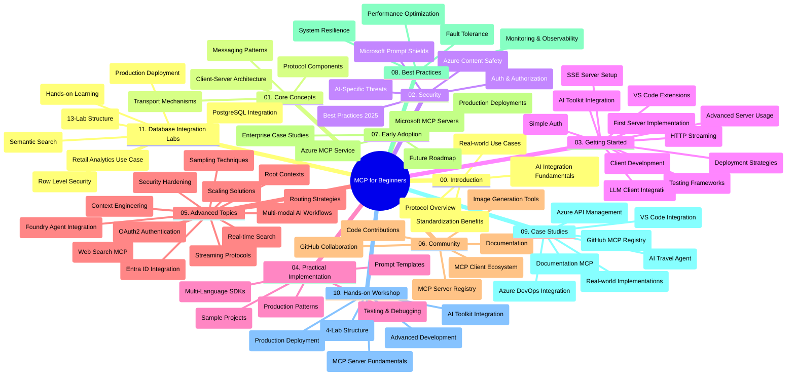

<!--
CO_OP_TRANSLATOR_METADATA:
{
  "original_hash": "af27b0acfae6caa134d9701453884df8",
  "translation_date": "2025-10-06T21:52:58+00:00",
  "source_file": "study_guide.md",
  "language_code": "fr"
}
-->
# Protocole de Contexte Modèle (MCP) pour Débutants - Guide d'Étude

Ce guide d'étude offre un aperçu de la structure et du contenu du dépôt pour le programme "Protocole de Contexte Modèle (MCP) pour Débutants". Utilisez ce guide pour naviguer efficacement dans le dépôt et tirer le meilleur parti des ressources disponibles.

## Aperçu du Dépôt

Le Protocole de Contexte Modèle (MCP) est un cadre standardisé pour les interactions entre les modèles d'IA et les applications clientes. Initialement créé par Anthropic, MCP est désormais maintenu par la communauté MCP via l'organisation officielle GitHub. Ce dépôt propose un programme complet avec des exemples de code pratiques en C#, Java, JavaScript, Python et TypeScript, conçu pour les développeurs d'IA, les architectes systèmes et les ingénieurs logiciels.

## Carte Visuelle du Programme

## Structure du Dépôt

Le dépôt est organisé en onze sections principales, chacune abordant différents aspects du MCP :

1. **Introduction (00-Introduction/)**
   - Vue d'ensemble du Protocole de Contexte Modèle
   - Importance de la standardisation dans les pipelines d'IA
   - Cas d'utilisation pratiques et avantages

2. **Concepts de Base (01-CoreConcepts/)**
   - Architecture client-serveur
   - Composants clés du protocole
   - Modèles de messagerie dans MCP

3. **Sécurité (02-Security/)**
   - Menaces de sécurité dans les systèmes basés sur MCP
   - Bonnes pratiques pour sécuriser les implémentations
   - Stratégies d'authentification et d'autorisation
   - **Documentation Complète sur la Sécurité** :
     - Bonnes Pratiques de Sécurité MCP 2025
     - Guide d'Implémentation de la Sécurité Azure
     - Contrôles et Techniques de Sécurité MCP
     - Référence Rapide des Bonnes Pratiques MCP
   - **Sujets Clés de Sécurité** :
     - Attaques par injection de prompt et empoisonnement d'outils
     - Détournement de session et problèmes de proxy confus
     - Vulnérabilités de transmission de jetons
     - Permissions excessives et contrôle d'accès
     - Sécurité de la chaîne d'approvisionnement pour les composants d'IA
     - Intégration des Microsoft Prompt Shields

4. **Premiers Pas (03-GettingStarted/)**
   - Configuration de l'environnement
   - Création de serveurs et clients MCP basiques
   - Intégration avec des applications existantes
   - Inclut des sections pour :
     - Première implémentation de serveur
     - Développement de client
     - Intégration de client LLM
     - Intégration avec VS Code
     - Serveur d'Événements Envoyés par le Serveur (SSE)
     - Utilisation avancée du serveur
     - Streaming HTTP
     - Intégration de l'AI Toolkit
     - Stratégies de test
     - Directives de déploiement

5. **Implémentation Pratique (04-PracticalImplementation/)**
   - Utilisation des SDK dans différents langages de programmation
   - Techniques de débogage, test et validation
   - Création de modèles de prompt réutilisables et de workflows
   - Projets d'exemple avec des implémentations pratiques

6. **Sujets Avancés (05-AdvancedTopics/)**
   - Techniques d'ingénierie de contexte
   - Intégration d'agents Foundry
   - Workflows IA multi-modaux
   - Démos d'authentification OAuth2
   - Capacités de recherche en temps réel
   - Streaming en temps réel
   - Implémentation de contextes racine
   - Stratégies de routage
   - Techniques d'échantillonnage
   - Approches de mise à l'échelle
   - Considérations de sécurité
   - Intégration de sécurité Entra ID
   - Intégration de recherche web

7. **Contributions Communautaires (06-CommunityContributions/)**
   - Comment contribuer au code et à la documentation
   - Collaboration via GitHub
   - Améliorations et retours pilotés par la communauté
   - Utilisation de divers clients MCP (Claude Desktop, Cline, VSCode)
   - Travail avec des serveurs MCP populaires, y compris la génération d'images

8. **Leçons de l'Adoption Précoce (07-LessonsfromEarlyAdoption/)**
   - Implémentations réelles et histoires de réussite
   - Construction et déploiement de solutions basées sur MCP
   - Tendances et feuille de route future
   - **Guide des Serveurs MCP Microsoft** : Guide complet de 10 serveurs MCP Microsoft prêts pour la production, y compris :
     - Serveur MCP Microsoft Learn Docs
     - Serveur MCP Azure (15+ connecteurs spécialisés)
     - Serveur MCP GitHub
     - Serveur MCP Azure DevOps
     - Serveur MCP MarkItDown
     - Serveur MCP SQL Server
     - Serveur MCP Playwright
     - Serveur MCP Dev Box
     - Serveur MCP Azure AI Foundry
     - Serveur MCP Microsoft 365 Agents Toolkit

9. **Bonnes Pratiques (08-BestPractices/)**
   - Optimisation des performances
   - Conception de systèmes MCP tolérants aux pannes
   - Stratégies de test et de résilience

10. **Études de Cas (09-CaseStudy/)**
    - **Sept études de cas complètes** démontrant la polyvalence du MCP dans divers scénarios :
    - **Agents de Voyage Azure AI** : Orchestration multi-agents avec Azure OpenAI et AI Search
    - **Intégration Azure DevOps** : Automatisation des processus de workflow avec mises à jour de données YouTube
    - **Récupération de Documentation en Temps Réel** : Client console Python avec streaming HTTP
    - **Générateur de Plan d'Étude Interactif** : Application web Chainlit avec IA conversationnelle
    - **Documentation dans l'Éditeur** : Intégration VS Code avec workflows GitHub Copilot
    - **Gestion des API Azure** : Intégration d'API d'entreprise avec création de serveur MCP
    - **Registre MCP GitHub** : Développement d'écosystème et plateforme d'intégration agentique
    - Exemples d'implémentation couvrant l'intégration d'entreprise, la productivité des développeurs et le développement d'écosystème

11. **Atelier Pratique (10-StreamliningAIWorkflowsBuildingAnMCPServerWithAIToolkit/)**
    - Atelier pratique complet combinant MCP avec AI Toolkit
    - Création d'applications intelligentes reliant modèles d'IA et outils réels
    - Modules pratiques couvrant les fondamentaux, le développement de serveurs personnalisés et les stratégies de déploiement en production
    - **Structure de l'Atelier** :
      - Atelier 1 : Fondamentaux du Serveur MCP
      - Atelier 2 : Développement Avancé de Serveur MCP
      - Atelier 3 : Intégration AI Toolkit
      - Atelier 4 : Déploiement en Production et Mise à l'Échelle
    - Approche d'apprentissage basée sur des laboratoires avec instructions étape par étape

12. **Laboratoires d'Intégration de Base de Données Serveur MCP (11-MCPServerHandsOnLabs/)**
    - **Parcours d'apprentissage complet en 13 laboratoires** pour construire des serveurs MCP prêts pour la production avec intégration PostgreSQL
    - **Implémentation analytique de vente au détail réelle** utilisant le cas d'utilisation Zava Retail
    - **Modèles de niveau entreprise** incluant la Sécurité au Niveau des Lignes (RLS), recherche sémantique et accès aux données multi-locataires
    - **Structure Complète des Laboratoires** :
      - **Laboratoires 00-03 : Fondations** - Introduction, Architecture, Sécurité, Configuration de l'Environnement
      - **Laboratoires 04-06 : Construction du Serveur MCP** - Conception de Base de Données, Implémentation du Serveur MCP, Développement d'Outils
      - **Laboratoires 07-09 : Fonctionnalités Avancées** - Recherche Sémantique, Test & Débogage, Intégration VS Code
      - **Laboratoires 10-12 : Production & Bonnes Pratiques** - Déploiement, Surveillance, Optimisation
    - **Technologies Couvertes** : Cadre FastMCP, PostgreSQL, Azure OpenAI, Azure Container Apps, Application Insights
    - **Résultats d'Apprentissage** : Serveurs MCP prêts pour la production, modèles d'intégration de base de données, analyses alimentées par l'IA, sécurité d'entreprise

## Ressources Supplémentaires

Le dépôt inclut des ressources de soutien :

- **Dossier Images** : Contient des diagrammes et illustrations utilisés tout au long du programme
- **Traductions** : Support multilingue avec traductions automatisées de la documentation
- **Ressources Officielles MCP** :
  - [Documentation MCP](https://modelcontextprotocol.io/)
  - [Spécification MCP](https://spec.modelcontextprotocol.io/)
  - [Dépôt GitHub MCP](https://github.com/modelcontextprotocol)

## Comment Utiliser ce Dépôt

1. **Apprentissage Séquentiel** : Suivez les chapitres dans l'ordre (00 à 11) pour une expérience d'apprentissage structurée.
2. **Focus sur un Langage** : Si vous êtes intéressé par un langage de programmation spécifique, explorez les répertoires d'exemples pour des implémentations dans votre langage préféré.
3. **Implémentation Pratique** : Commencez par la section "Premiers Pas" pour configurer votre environnement et créer votre premier serveur et client MCP.
4. **Exploration Avancée** : Une fois à l'aise avec les bases, plongez dans les sujets avancés pour approfondir vos connaissances.
5. **Engagement Communautaire** : Rejoignez la communauté MCP via les discussions GitHub et les canaux Discord pour échanger avec des experts et d'autres développeurs.

## Clients et Outils MCP

Le programme couvre divers clients et outils MCP :

1. **Clients Officiels** :
   - Visual Studio Code 
   - MCP dans Visual Studio Code
   - Claude Desktop
   - Claude dans VSCode 
   - API Claude

2. **Clients Communautaires** :
   - Cline (basé sur terminal)
   - Cursor (éditeur de code)
   - ChatMCP
   - Windsurf

3. **Outils de Gestion MCP** :
   - MCP CLI
   - MCP Manager
   - MCP Linker
   - MCP Router

## Serveurs MCP Populaires

Le dépôt présente divers serveurs MCP, notamment :

1. **Serveurs MCP Microsoft Officiels** :
   - Serveur MCP Microsoft Learn Docs
   - Serveur MCP Azure (15+ connecteurs spécialisés)
   - Serveur MCP GitHub
   - Serveur MCP Azure DevOps
   - Serveur MCP MarkItDown
   - Serveur MCP SQL Server
   - Serveur MCP Playwright
   - Serveur MCP Dev Box
   - Serveur MCP Azure AI Foundry
   - Serveur MCP Microsoft 365 Agents Toolkit

2. **Serveurs de Référence Officiels** :
   - Système de Fichiers
   - Fetch
   - Mémoire
   - Pensée Séquentielle

3. **Génération d'Images** :
   - Azure OpenAI DALL-E 3
   - Stable Diffusion WebUI
   - Replicate

4. **Outils de Développement** :
   - Git MCP
   - Contrôle Terminal
   - Assistant de Code

5. **Serveurs Spécialisés** :
   - Salesforce
   - Microsoft Teams
   - Jira & Confluence

## Contribuer

Ce dépôt accueille les contributions de la communauté. Consultez la section Contributions Communautaires pour des conseils sur la manière de contribuer efficacement à l'écosystème MCP.

----

*Ce guide d'étude a été mis à jour le 6 octobre 2025 et offre un aperçu du dépôt à cette date. Le contenu du dépôt peut être mis à jour après cette date.*

---

**Avertissement** :  
Ce document a été traduit à l'aide du service de traduction automatique [Co-op Translator](https://github.com/Azure/co-op-translator). Bien que nous nous efforcions d'assurer l'exactitude, veuillez noter que les traductions automatisées peuvent contenir des erreurs ou des inexactitudes. Le document original dans sa langue d'origine doit être considéré comme la source faisant autorité. Pour des informations critiques, il est recommandé de recourir à une traduction humaine professionnelle. Nous déclinons toute responsabilité en cas de malentendus ou d'interprétations erronées résultant de l'utilisation de cette traduction.