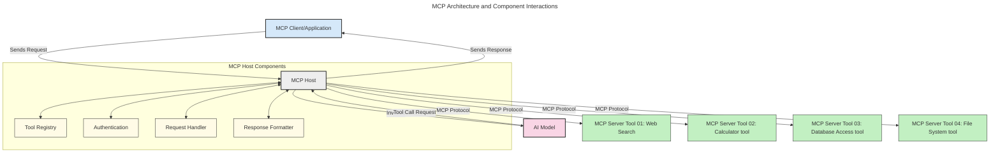
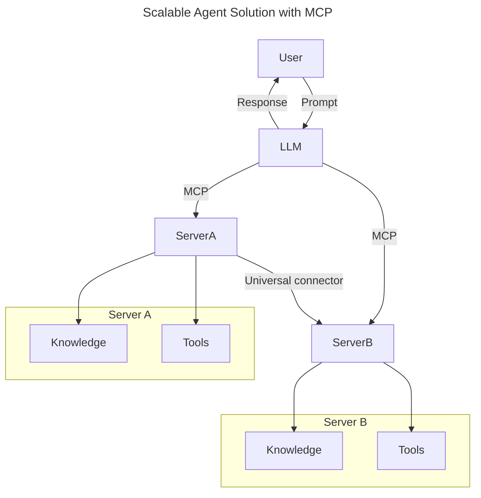
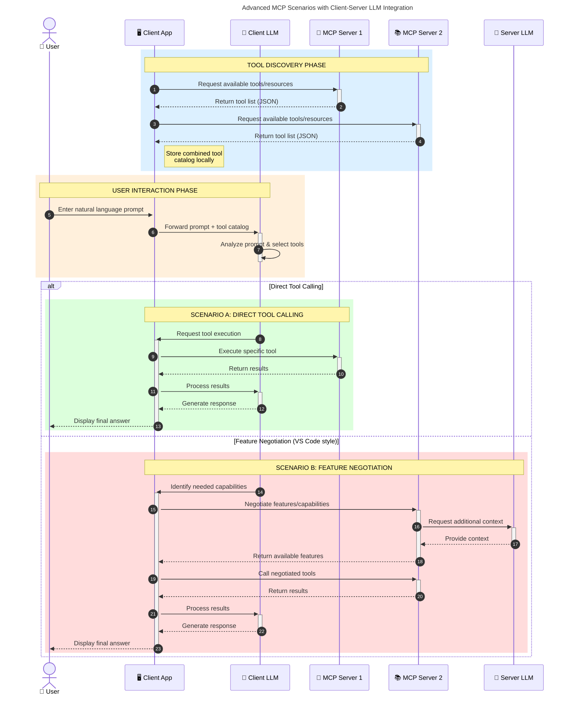

<!--
CO_OP_TRANSLATOR_METADATA:
{
  "original_hash": "9678e0c6945b8e0c23586869b0e26783",
  "translation_date": "2025-10-06T11:05:26+00:00",
  "source_file": "00-Introduction/README.md",
  "language_code": "he"
}
-->
# מבוא לפרוטוקול הקשר מודל (MCP): למה הוא חשוב עבור יישומי AI בקנה מידה גדול

_(לחצו על התמונה למעלה לצפייה בסרטון של השיעור)_

יישומי AI גנרטיביים הם צעד משמעותי קדימה, שכן הם מאפשרים למשתמשים לתקשר עם האפליקציה באמצעות הנחיות בשפה טבעית. עם זאת, ככל שמשקיעים יותר זמן ומשאבים באפליקציות כאלה, חשוב לוודא שניתן לשלב פונקציות ומשאבים בצורה קלה להרחבה, שהאפליקציה תוכל לתמוך ביותר ממודל אחד, ולנהל מורכבויות שונות של מודלים. בקיצור, בניית אפליקציות AI גנרטיביות היא פשוטה בהתחלה, אך ככל שהן גדלות והופכות מורכבות יותר, יש צורך להגדיר ארכיטקטורה ולהסתמך על סטנדרט שיבטיח שהאפליקציות נבנות בצורה עקבית. כאן נכנס MCP לתמונה, מארגן את הדברים ומספק סטנדרט.

---

## **🔍 מהו פרוטוקול הקשר מודל (MCP)?**

**פרוטוקול הקשר מודל (MCP)** הוא **ממשק פתוח ומוגדר סטנדרטית** שמאפשר למודלים שפה גדולים (LLMs) לתקשר בצורה חלקה עם כלים חיצוניים, APIs ומקורות נתונים. הוא מספק ארכיטקטורה עקבית לשיפור הפונקציונליות של מודלים AI מעבר לנתוני האימון שלהם, ומאפשר מערכות AI חכמות, ניתנות להרחבה ותגובתיות יותר.

---

## **🎯 למה סטנדרטיזציה ב-AI חשובה**

ככל שיישומי AI גנרטיביים הופכים מורכבים יותר, חשוב לאמץ סטנדרטים שמבטיחים **יכולת הרחבה, תחזוקה, מניעת תלות בספקים**, ויכולת הרחבה. MCP עונה על הצרכים הללו על ידי:

- איחוד אינטגרציות בין מודלים לכלים
- הפחתת פתרונות מותאמים אישית ושבירים
- מתן אפשרות למודלים שונים מספקים שונים להתקיים באותו אקוסיסטם

**Note:** למרות ש-MCP מציג את עצמו כסטנדרט פתוח, אין תוכניות לסטנדרטיזציה של MCP דרך גופים סטנדרטיים קיימים כמו IEEE, IETF, W3C, ISO או כל גוף סטנדרטים אחר.

---

## **📚 מטרות למידה**

בסיום המאמר הזה, תוכלו:

- להגדיר את **פרוטוקול הקשר מודל (MCP)** ואת השימושים שלו
- להבין איך MCP מסטנדרט תקשורת בין מודלים לכלים
- לזהות את הרכיבים המרכזיים בארכיטקטורת MCP
- לחקור יישומים אמיתיים של MCP בהקשרים ארגוניים ופיתוחיים

---

## **💡 למה פרוטוקול הקשר מודל (MCP) הוא משנה משחק**

### **🔗 MCP פותר את הפיצול באינטראקציות AI**

לפני MCP, שילוב מודלים עם כלים דרש:

- קוד מותאם אישית לכל זוג כלי-מודל
- APIs לא סטנדרטיים לכל ספק
- תקלות תכופות עקב עדכונים
- יכולת הרחבה נמוכה עם יותר כלים

### **✅ יתרונות הסטנדרטיזציה של MCP**

| **יתרון**                | **תיאור**                                                                      |
|--------------------------|--------------------------------------------------------------------------------|
| תאימות                  | מודלים שפה גדולים עובדים בצורה חלקה עם כלים מספקים שונים                       |
| עקביות                  | התנהגות אחידה בין פלטפורמות וכלים                                              |
| שימוש חוזר              | כלים שנבנו פעם אחת יכולים לשמש בפרויקטים ומערכות שונות                        |
| פיתוח מואץ              | הפחתת זמן פיתוח באמצעות ממשקים סטנדרטיים, מוכנים לשימוש                      |

---

## **🧱 סקירה כללית של ארכיטקטורת MCP ברמה גבוהה**

MCP פועל לפי מודל **לקוח-שרת**, שבו:

- **מארחי MCP** מפעילים את מודלי ה-AI
- **לקוחות MCP** יוזמים בקשות
- **שרתי MCP** מספקים הקשר, כלים ויכולות

### **רכיבים מרכזיים:**

- **משאבים** – נתונים סטטיים או דינמיים למודלים  
- **הנחיות** – תהליכי עבודה מוגדרים מראש ליצירה מונחית  
- **כלים** – פונקציות ניתנות לביצוע כמו חיפוש, חישובים  
- **דגימה** – התנהגות סוכנתית באמצעות אינטראקציות חוזרות

---

## איך שרתי MCP עובדים

שרתי MCP פועלים באופן הבא:

- **זרימת בקשה**:
    1. בקשה מתחילה על ידי משתמש קצה או תוכנה שפועלת בשמו.
    2. **לקוח MCP** שולח את הבקשה ל**מארח MCP**, שמנהל את זמן הריצה של מודל ה-AI.
    3. **מודל ה-AI** מקבל את הנחיית המשתמש ועשוי לבקש גישה לכלים או נתונים חיצוניים באמצעות קריאות לכלים.
    4. **מארח MCP**, ולא המודל עצמו, מתקשר עם **שרת MCP** המתאים באמצעות הפרוטוקול הסטנדרטי.
- **פונקציונליות מארח MCP**:
    - **רישום כלים**: שומר קטלוג של כלים זמינים ויכולותיהם.
    - **אימות**: מאמת הרשאות לגישה לכלים.
    - **מטפל בקשות**: מעבד בקשות לכלים שמגיעות מהמודל.
    - **מעצב תגובות**: מבנה את פלטי הכלים בפורמט שהמודל יכול להבין.
- **ביצוע שרת MCP**:
    - **מארח MCP** מנתב קריאות לכלים לשרת MCP אחד או יותר, שכל אחד חושף פונקציות מיוחדות (למשל, חיפוש, חישובים, שאילתות מסד נתונים).
    - **שרתי MCP** מבצעים את הפעולות שלהם ומחזירים תוצאות ל**מארח MCP** בפורמט עקבי.
    - **מארח MCP** מעצב ומעביר את התוצאות הללו ל**מודל ה-AI**.
- **השלמת תגובה**:
    - **מודל ה-AI** משלב את פלטי הכלים בתגובה סופית.
    - **מארח MCP** שולח את התגובה הזו חזרה ל**לקוח MCP**, שמספק אותה למשתמש הקצה או לתוכנה הקוראת.

## 👨‍💻 איך לבנות שרת MCP (עם דוגמאות)

שרתי MCP מאפשרים להרחיב את יכולות ה-LLM על ידי מתן נתונים ופונקציונליות.

מוכנים לנסות? הנה SDKs ספציפיים לשפה ו/או סטאק עם דוגמאות ליצירת שרתי MCP פשוטים בשפות/סטאקים שונים:

- **Python SDK**: https://github.com/modelcontextprotocol/python-sdk

- **TypeScript SDK**: https://github.com/modelcontextprotocol/typescript-sdk

- **Java SDK**: https://github.com/modelcontextprotocol/java-sdk

- **C#/.NET SDK**: https://github.com/modelcontextprotocol/csharp-sdk

## 🌍 שימושים אמיתיים ל-MCP

MCP מאפשר מגוון רחב של יישומים על ידי הרחבת יכולות AI:

| **יישום**                  | **תיאור**                                                                      |
|----------------------------|--------------------------------------------------------------------------------|
| אינטגרציה עם נתוני ארגון   | חיבור LLMs למסדי נתונים, מערכות CRM או כלים פנימיים                           |
| מערכות AI סוכנתיות         | אפשרות לסוכנים אוטונומיים עם גישה לכלים ותהליכי קבלת החלטות                   |
| יישומים רב-מודאליים        | שילוב טקסט, תמונה וכלי שמע בתוך אפליקציית AI מאוחדת אחת                       |
| אינטגרציה עם נתונים בזמן אמת | הכנסת נתונים חיים לאינטראקציות AI לתוצאות מדויקות ועדכניות יותר               |

### 🧠 MCP = סטנדרט אוניברסלי לאינטראקציות AI

פרוטוקול הקשר מודל (MCP) פועל כסטנדרט אוניברסלי לאינטראקציות AI, בדומה לאופן שבו USB-C סטנדרטיזציה חיבורים פיזיים למכשירים. בעולם ה-AI, MCP מספק ממשק עקבי, שמאפשר למודלים (לקוחות) להשתלב בצורה חלקה עם כלים וספקי נתונים חיצוניים (שרתים). זה מבטל את הצורך בפרוטוקולים מותאמים אישית ומגוונים לכל API או מקור נתונים.

תחת MCP, כלי תואם MCP (המכונה שרת MCP) פועל לפי סטנדרט אחיד. שרתים אלו יכולים לרשום את הכלים או הפעולות שהם מציעים ולבצע את הפעולות הללו כאשר סוכן AI מבקש זאת. פלטפורמות סוכני AI שתומכות ב-MCP מסוגלות לגלות כלים זמינים מהשרתים ולהפעיל אותם דרך פרוטוקול סטנדרטי זה.

### 💡 מאפשר גישה לידע

מעבר להצעת כלים, MCP גם מאפשר גישה לידע. הוא מאפשר לאפליקציות לספק הקשר למודלים שפה גדולים (LLMs) על ידי קישורם למקורות נתונים שונים. לדוגמה, שרת MCP עשוי לייצג מאגר מסמכים של חברה, שמאפשר לסוכנים לשלוף מידע רלוונטי לפי דרישה. שרת אחר יכול לטפל בפעולות ספציפיות כמו שליחת מיילים או עדכון רשומות. מנקודת המבט של הסוכן, אלו פשוט כלים שהוא יכול להשתמש בהם—חלק מהכלים מחזירים נתונים (הקשר ידע), בעוד אחרים מבצעים פעולות. MCP מנהל את שניהם בצורה יעילה.

סוכן שמתחבר לשרת MCP לומד באופן אוטומטי את היכולות הזמינות של השרת ואת הנתונים הנגישים דרך פורמט סטנדרטי. סטנדרטיזציה זו מאפשרת זמינות כלים דינמית. לדוגמה, הוספת שרת MCP חדש למערכת הסוכן הופכת את הפונקציות שלו לשימושיות מידית ללא צורך בהתאמות נוספות להוראות הסוכן.

אינטגרציה זו מתואמת עם הזרימה המוצגת בדיאגרמה הבאה, שבה שרתים מספקים גם כלים וגם ידע, ומבטיחים שיתוף פעולה חלק בין מערכות.

### 👉 דוגמה: פתרון סוכן בקנה מידה גדול

המחבר האוניברסלי מאפשר לשרתי MCP לתקשר ולשתף יכולות זה עם זה, ומאפשר לשרתA להאציל משימות לשרתB או לגשת לכלים ולידע שלו. זה מפדר כלים ונתונים בין שרתים, ותומך בארכיטקטורות סוכנים ניתנות להרחבה ומודולריות. מכיוון ש-MCP מסטנדרט חשיפת כלים, סוכנים יכולים לגלות ולנתב בקשות בין שרתים באופן דינמי ללא אינטגרציות מקודדות מראש.

פדרציה של כלים וידע: כלים ונתונים יכולים להיות נגישים בין שרתים, ומאפשרים ארכיטקטורות סוכנים סקלביליות ומודולריות יותר.

### 🔄 תרחישי MCP מתקדמים עם אינטגרציה של LLM בצד הלקוח

מעבר לארכיטקטורת MCP הבסיסית, ישנם תרחישים מתקדמים שבהם גם הלקוח וגם השרת מכילים LLMs, ומאפשרים אינטראקציות מתוחכמות יותר. בדיאגרמה הבאה, **אפליקציית לקוח** יכולה להיות IDE עם מספר כלים MCP זמינים לשימוש על ידי ה-LLM:

## 🔐 יתרונות מעשיים של MCP

הנה היתרונות המעשיים של שימוש ב-MCP:

- **עדכניות**: מודלים יכולים לגשת למידע עדכני מעבר לנתוני האימון שלהם
- **הרחבת יכולות**: מודלים יכולים להשתמש בכלים מיוחדים למשימות שהם לא אומנו עבורן
- **הפחתת הזיות**: מקורות נתונים חיצוניים מספקים בסיס עובדתי
- **פרטיות**: נתונים רגישים יכולים להישאר בסביבות מאובטחות במקום להיות משולבים בהנחיות

## 📌 נקודות מפתח

הנקודות הבאות הן נקודות מפתח לשימוש ב-MCP:

- **MCP** מסטנדרט איך מודלים AI מתקשרים עם כלים ונתונים
- מקדם **יכולת הרחבה, עקביות ותאימות**
- MCP עוזר **להפחית זמן פיתוח, לשפר אמינות ולהרחיב יכולות מודלים**
- ארכיטקטורת לקוח-שרת **מאפשרת אפליקציות AI גמישות וניתנות להרחבה**

## 🧠 תרגיל

חשבו על אפליקציית AI שאתם מעוניינים לבנות.

- אילו **כלים או נתונים חיצוניים** יכולים לשפר את יכולותיה?
- איך MCP יכול להפוך את האינטגרציה **לפשוטה ואמינה יותר?**

## משאבים נוספים

- [מאגר GitHub של MCP](https://github.com/modelcontextprotocol)

## מה הלאה

הבא: [פרק 1: מושגים מרכזיים](../01-CoreConcepts/README.md)

---

**כתב ויתור**:  
מסמך זה תורגם באמצעות שירות תרגום מבוסס בינה מלאכותית [Co-op Translator](https://github.com/Azure/co-op-translator). למרות שאנו שואפים לדיוק, יש לקחת בחשבון שתרגומים אוטומטיים עשויים להכיל שגיאות או אי-דיוקים. המסמך המקורי בשפתו המקורית נחשב למקור הסמכותי. למידע קריטי, מומלץ להשתמש בתרגום מקצועי על ידי מתרגם אנושי. איננו נושאים באחריות לכל אי-הבנה או פרשנות שגויה הנובעת משימוש בתרגום זה.