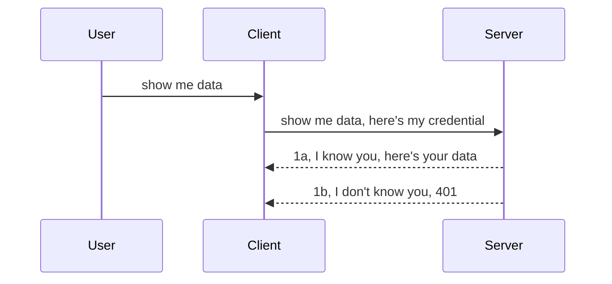

<!--
CO_OP_TRANSLATOR_METADATA:
{
  "original_hash": "5b00b8a8971a07d2d8803be4c9f138f8",
  "translation_date": "2025-10-07T00:56:01+00:00",
  "source_file": "03-GettingStarted/11-simple-auth/README.md",
  "language_code": "he"
}
-->
# אימות פשוט

SDKs של MCP תומכים בשימוש ב-OAuth 2.1, תהליך די מורכב שכולל מושגים כמו שרת אימות, שרת משאבים, שליחת אישורים, קבלת קוד, החלפת הקוד עבור אסימון נושא עד שתוכל סוף סוף לקבל את נתוני המשאבים שלך. אם אינך רגיל ל-OAuth, שהוא כלי נהדר ליישום, כדאי להתחיל ברמת אימות בסיסית ולבנות בהדרגה אבטחה טובה יותר. זו הסיבה שהפרק הזה קיים – כדי להוביל אותך לאימות מתקדם יותר.

## מה זה אימות?

אימות הוא קיצור של "אימות" ו-"הרשאה". הרעיון הוא שעלינו לבצע שני דברים:

- **אימות**: תהליך שבו אנו מוודאים אם לאפשר לאדם להיכנס לבית שלנו, כלומר אם יש לו את הזכות להיות "כאן" – גישה לשרת המשאבים שבו נמצאות תכונות שרת MCP שלנו.
- **הרשאה**: תהליך שבו אנו מוודאים אם למשתמש יש גישה למשאבים הספציפיים שהוא מבקש, לדוגמה הזמנות או מוצרים מסוימים, או אם הוא מורשה לקרוא את התוכן אך לא למחוק אותו, כדוגמה נוספת.

## אישורים: איך אנחנו מזהים את עצמנו למערכת

רוב מפתחי האינטרנט מתחילים לחשוב במונחים של מתן אישור לשרת, בדרך כלל סוד שמאשר אם הם מורשים להיות כאן ("אימות"). אישור זה בדרך כלל גרסה מקודדת ב-base64 של שם משתמש וסיסמה או מפתח API שמזהה באופן ייחודי משתמש מסוים.

זה כולל שליחה דרך כותרת שנקראת "Authorization" כך:

```json
{ "Authorization": "secret123" }
```

זה נקרא בדרך כלל אימות בסיסי. איך הזרימה הכללית עובדת היא כך:



עכשיו כשאנחנו מבינים איך זה עובד מבחינת זרימה, איך אנחנו מיישמים את זה? ובכן, רוב שרתי האינטרנט כוללים מושג שנקרא middleware, קטע קוד שרץ כחלק מהבקשה שיכול לאמת אישורים, ואם האישורים תקפים, מאפשר לבקשה לעבור. אם הבקשה לא כוללת אישורים תקפים, תקבל שגיאת אימות. בואו נראה איך זה יכול להיות מיושם:

**Python**

```python
class AuthMiddleware(BaseHTTPMiddleware):
    async def dispatch(self, request, call_next):

        has_header = request.headers.get("Authorization")
        if not has_header:
            print("-> Missing Authorization header!")
            return Response(status_code=401, content="Unauthorized")

        if not valid_token(has_header):
            print("-> Invalid token!")
            return Response(status_code=403, content="Forbidden")

        print("Valid token, proceeding...")
       
        response = await call_next(request)
        # add any customer headers or change in the response in some way
        return response


starlette_app.add_middleware(CustomHeaderMiddleware)
```

כאן ביצענו:

- יצירת middleware בשם `AuthMiddleware` שבו מתבצע קריאה לשיטת `dispatch` על ידי שרת האינטרנט.
- הוספת ה-middleware לשרת האינטרנט:

    ```python
    starlette_app.add_middleware(AuthMiddleware)
    ```

- כתיבת לוגיקת אימות שבודקת אם כותרת Authorization קיימת ואם הסוד שנשלח תקף:

    ```python
    has_header = request.headers.get("Authorization")
    if not has_header:
        print("-> Missing Authorization header!")
        return Response(status_code=401, content="Unauthorized")

    if not valid_token(has_header):
        print("-> Invalid token!")
        return Response(status_code=403, content="Forbidden")
    ```

    אם הסוד קיים ותקף, אנו מאפשרים לבקשה לעבור על ידי קריאה ל-`call_next` ומחזירים את התגובה.

    ```python
    response = await call_next(request)
    # add any customer headers or change in the response in some way
    return response
    ```

איך זה עובד? אם בקשת אינטרנט נעשית לשרת, ה-middleware יופעל ובזכות היישום שלו, הוא יאפשר לבקשה לעבור או יחזיר שגיאה שמצביעה על כך שהלקוח אינו מורשה להמשיך.

**TypeScript**

כאן אנו יוצרים middleware עם מסגרת הפופולרית Express ומיירטים את הבקשה לפני שהיא מגיעה לשרת MCP. הנה הקוד לכך:

```typescript
function isValid(secret) {
    return secret === "secret123";
}

app.use((req, res, next) => {
    // 1. Authorization header present?  
    if(!req.headers["Authorization"]) {
        res.status(401).send('Unauthorized');
    }
    
    let token = req.headers["Authorization"];

    // 2. Check validity.
    if(!isValid(token)) {
        res.status(403).send('Forbidden');
    }

   
    console.log('Middleware executed');
    // 3. Passes request to the next step in the request pipeline.
    next();
});
```

בקוד זה אנו:

1. בודקים אם כותרת Authorization קיימת מלכתחילה, אם לא, אנו שולחים שגיאת 401.
2. מוודאים שהאישור/אסימון תקף, אם לא, אנו שולחים שגיאת 403.
3. לבסוף מעבירים את הבקשה בצינור הבקשות ומחזירים את המשאב המבוקש.

## תרגיל: יישום אימות

בואו ניקח את הידע שלנו וננסה ליישם אותו. הנה התוכנית:

שרת

- יצירת שרת אינטרנט ומופע MCP.
- יישום middleware לשרת.

לקוח 

- שליחת בקשת אינטרנט, עם אישור, דרך כותרת.

### -1- יצירת שרת אינטרנט ומופע MCP

בשלב הראשון שלנו, עלינו ליצור מופע שרת אינטרנט ומופע שרת MCP.

**Python**

כאן אנו יוצרים מופע שרת MCP, אפליקציית אינטרנט starlette ומארחים אותה עם uvicorn.

```python
# creating MCP Server

app = FastMCP(
    name="MCP Resource Server",
    instructions="Resource Server that validates tokens via Authorization Server introspection",
    host=settings["host"],
    port=settings["port"],
    debug=True
)

# creating starlette web app
starlette_app = app.streamable_http_app()

# serving app via uvicorn
async def run(starlette_app):
    import uvicorn
    config = uvicorn.Config(
            starlette_app,
            host=app.settings.host,
            port=app.settings.port,
            log_level=app.settings.log_level.lower(),
        )
    server = uvicorn.Server(config)
    await server.serve()

run(starlette_app)
```

בקוד זה אנו:

- יוצרים את שרת MCP.
- בונים את אפליקציית האינטרנט starlette מתוך שרת MCP, `app.streamable_http_app()`.
- מארחים ומשרתים את אפליקציית האינטרנט באמצעות uvicorn `server.serve()`.

**TypeScript**

כאן אנו יוצרים מופע שרת MCP.

```typescript
const server = new McpServer({
      name: "example-server",
      version: "1.0.0"
    });

    // ... set up server resources, tools, and prompts ...
```

יצירת שרת MCP זו תצטרך להתבצע בתוך הגדרת הנתיב POST /mcp שלנו, אז בואו ניקח את הקוד לעיל ונעביר אותו כך:

```typescript
import express from "express";
import { randomUUID } from "node:crypto";
import { McpServer } from "@modelcontextprotocol/sdk/server/mcp.js";
import { StreamableHTTPServerTransport } from "@modelcontextprotocol/sdk/server/streamableHttp.js";
import { isInitializeRequest } from "@modelcontextprotocol/sdk/types.js"

const app = express();
app.use(express.json());

// Map to store transports by session ID
const transports: { [sessionId: string]: StreamableHTTPServerTransport } = {};

// Handle POST requests for client-to-server communication
app.post('/mcp', async (req, res) => {
  // Check for existing session ID
  const sessionId = req.headers['mcp-session-id'] as string | undefined;
  let transport: StreamableHTTPServerTransport;

  if (sessionId && transports[sessionId]) {
    // Reuse existing transport
    transport = transports[sessionId];
  } else if (!sessionId && isInitializeRequest(req.body)) {
    // New initialization request
    transport = new StreamableHTTPServerTransport({
      sessionIdGenerator: () => randomUUID(),
      onsessioninitialized: (sessionId) => {
        // Store the transport by session ID
        transports[sessionId] = transport;
      },
      // DNS rebinding protection is disabled by default for backwards compatibility. If you are running this server
      // locally, make sure to set:
      // enableDnsRebindingProtection: true,
      // allowedHosts: ['127.0.0.1'],
    });

    // Clean up transport when closed
    transport.onclose = () => {
      if (transport.sessionId) {
        delete transports[transport.sessionId];
      }
    };
    const server = new McpServer({
      name: "example-server",
      version: "1.0.0"
    });

    // ... set up server resources, tools, and prompts ...

    // Connect to the MCP server
    await server.connect(transport);
  } else {
    // Invalid request
    res.status(400).json({
      jsonrpc: '2.0',
      error: {
        code: -32000,
        message: 'Bad Request: No valid session ID provided',
      },
      id: null,
    });
    return;
  }

  // Handle the request
  await transport.handleRequest(req, res, req.body);
});

// Reusable handler for GET and DELETE requests
const handleSessionRequest = async (req: express.Request, res: express.Response) => {
  const sessionId = req.headers['mcp-session-id'] as string | undefined;
  if (!sessionId || !transports[sessionId]) {
    res.status(400).send('Invalid or missing session ID');
    return;
  }
  
  const transport = transports[sessionId];
  await transport.handleRequest(req, res);
};

// Handle GET requests for server-to-client notifications via SSE
app.get('/mcp', handleSessionRequest);

// Handle DELETE requests for session termination
app.delete('/mcp', handleSessionRequest);

app.listen(3000);
```

עכשיו אתם רואים איך יצירת שרת MCP הועברה בתוך `app.post("/mcp")`.

בואו נעבור לשלב הבא של יצירת ה-middleware כדי שנוכל לאמת את האישור הנכנס.

### -2- יישום middleware לשרת

בואו נעבור לחלק של ה-middleware. כאן ניצור middleware שמחפש אישור בכותרת `Authorization` ומאמת אותו. אם הוא מתקבל, הבקשה תמשיך לעשות את מה שהיא צריכה (למשל, רשימת כלים, קריאת משאב או כל פונקציונליות MCP שהלקוח ביקש).

**Python**

כדי ליצור את ה-middleware, עלינו ליצור מחלקה שיורשת מ-`BaseHTTPMiddleware`. ישנם שני חלקים מעניינים:

- הבקשה `request`, שממנה אנו קוראים את המידע מהכותרת.
- `call_next`, הקריאה חזרה שעלינו להפעיל אם הלקוח הביא אישור שאנו מקבלים.

ראשית, עלינו לטפל במקרה שבו כותרת `Authorization` חסרה:

```python
has_header = request.headers.get("Authorization")

# no header present, fail with 401, otherwise move on.
if not has_header:
    print("-> Missing Authorization header!")
    return Response(status_code=401, content="Unauthorized")
```

כאן אנו שולחים הודעת 401 לא מורשה מכיוון שהלקוח נכשל באימות.

לאחר מכן, אם אישור נשלח, עלינו לבדוק את תקפותו כך:

```python
 if not valid_token(has_header):
    print("-> Invalid token!")
    return Response(status_code=403, content="Forbidden")
```

שימו לב איך אנו שולחים הודעת 403 אסור למעלה. בואו נראה את ה-middleware המלא למטה שמיישם את כל מה שציינו:

```python
class AuthMiddleware(BaseHTTPMiddleware):
    async def dispatch(self, request, call_next):

        has_header = request.headers.get("Authorization")
        if not has_header:
            print("-> Missing Authorization header!")
            return Response(status_code=401, content="Unauthorized")

        if not valid_token(has_header):
            print("-> Invalid token!")
            return Response(status_code=403, content="Forbidden")

        print("Valid token, proceeding...")
        print(f"-> Received {request.method} {request.url}")
        response = await call_next(request)
        response.headers['Custom'] = 'Example'
        return response

```

מעולה, אבל מה לגבי פונקציית `valid_token`? הנה היא למטה:

```python
# DON'T use for production - improve it !!
def valid_token(token: str) -> bool:
    # remove the "Bearer " prefix
    if token.startswith("Bearer "):
        token = token[7:]
        return token == "secret-token"
    return False
```

זה כמובן צריך להשתפר.

חשוב: לעולם אין לשמור סודות כאלה בקוד. עדיף לשלוף את הערך להשוואה ממקור נתונים או מספק שירות זהות (IDP) או אפילו טוב יותר, לתת ל-IDP לבצע את האימות.

**TypeScript**

כדי ליישם זאת עם Express, עלינו לקרוא לשיטת `use` שמקבלת פונקציות middleware.

עלינו:

- לתקשר עם משתנה הבקשה כדי לבדוק את האישור שנשלח בכותרת `Authorization`.
- לאמת את האישור, ואם כן, לאפשר לבקשה להמשיך ולבצע את בקשת MCP של הלקוח.

כאן, אנו בודקים אם כותרת `Authorization` קיימת ואם לא, אנו עוצרים את הבקשה מלעבור:

```typescript
if(!req.headers["authorization"]) {
    res.status(401).send('Unauthorized');
    return;
}
```

אם הכותרת לא נשלחת מלכתחילה, תקבלו שגיאת 401.

לאחר מכן, אנו בודקים אם האישור תקף, אם לא, אנו שוב עוצרים את הבקשה אך עם הודעה מעט שונה:

```typescript
if(!isValid(token)) {
    res.status(403).send('Forbidden');
    return;
} 
```

שימו לב איך אתם מקבלים עכשיו שגיאת 403.

הנה הקוד המלא:

```typescript
app.use((req, res, next) => {
    console.log('Request received:', req.method, req.url, req.headers);
    console.log('Headers:', req.headers["authorization"]);
    if(!req.headers["authorization"]) {
        res.status(401).send('Unauthorized');
        return;
    }
    
    let token = req.headers["authorization"];

    if(!isValid(token)) {
        res.status(403).send('Forbidden');
        return;
    }  

    console.log('Middleware executed');
    next();
});
```

הגדרנו את שרת האינטרנט לקבל middleware כדי לבדוק את האישור שהלקוח מקווה לשלוח לנו. מה לגבי הלקוח עצמו?

### -3- שליחת בקשת אינטרנט עם אישור דרך כותרת

עלינו לוודא שהלקוח מעביר את האישור דרך הכותרת. מכיוון שאנו הולכים להשתמש בלקוח MCP כדי לעשות זאת, עלינו להבין איך זה נעשה.

**Python**

עבור הלקוח, עלינו להעביר כותרת עם האישור שלנו כך:

```python
# DON'T hardcode the value, have it at minimum in an environment variable or a more secure storage
token = "secret-token"

async with streamablehttp_client(
        url = f"http://localhost:{port}/mcp",
        headers = {"Authorization": f"Bearer {token}"}
    ) as (
        read_stream,
        write_stream,
        session_callback,
    ):
        async with ClientSession(
            read_stream,
            write_stream
        ) as session:
            await session.initialize()
      
            # TODO, what you want done in the client, e.g list tools, call tools etc.
```

שימו לב איך אנו מאכלסים את מאפיין `headers` כך ` headers = {"Authorization": f"Bearer {token}"}`.

**TypeScript**

אנו יכולים לפתור זאת בשני שלבים:

1. לאכלס אובייקט תצורה עם האישור שלנו.
2. להעביר את אובייקט התצורה ל-transport.

```typescript

// DON'T hardcode the value like shown here. At minimum have it as a env variable and use something like dotenv (in dev mode).
let token = "secret123"

// define a client transport option object
let options: StreamableHTTPClientTransportOptions = {
  sessionId: sessionId,
  requestInit: {
    headers: {
      "Authorization": "secret123"
    }
  }
};

// pass the options object to the transport
async function main() {
   const transport = new StreamableHTTPClientTransport(
      new URL(serverUrl),
      options
   );
```

כאן אתם רואים למעלה איך היינו צריכים ליצור אובייקט `options` ולהציב את הכותרות שלנו תחת מאפיין `requestInit`.

חשוב: איך אנו משפרים את זה מכאן? ובכן, ליישום הנוכחי יש כמה בעיות. ראשית, העברת אישור בצורה כזו היא די מסוכנת אלא אם כן יש לכם לפחות HTTPS. גם אז, האישור יכול להיגנב ולכן אתם צריכים מערכת שבה תוכלו לבטל בקלות את האסימון ולהוסיף בדיקות נוספות כמו מאיפה בעולם זה מגיע, האם הבקשה מתרחשת בתדירות גבוהה מדי (התנהגות דמוית בוט), בקיצור, ישנם שלל חששות.

עם זאת, עבור APIs פשוטים מאוד שבהם אינכם רוצים שמישהו יקרא ל-API שלכם ללא אימות, מה שיש לנו כאן הוא התחלה טובה.

עם זאת, בואו ננסה לחזק את האבטחה מעט על ידי שימוש בפורמט סטנדרטי כמו JSON Web Token, הידוע גם כ-JWT או "JOT" tokens.

## JSON Web Tokens, JWT

אז, אנו מנסים לשפר דברים מהעברת אישורים פשוטים מאוד. מה השיפורים המיידיים שאנו מקבלים מאימוץ JWT?

- **שיפורי אבטחה**. באימות בסיסי, אתם שולחים את שם המשתמש והסיסמה כטוקן מקודד ב-base64 (או שולחים מפתח API) שוב ושוב, מה שמגדיל את הסיכון. עם JWT, אתם שולחים את שם המשתמש והסיסמה ומקבלים טוקן בתמורה, והוא גם מוגבל בזמן, כלומר הוא יפוג. JWT מאפשר לכם להשתמש בקלות בבקרת גישה מדויקת באמצעות תפקידים, תחומים והרשאות.
- **חוסר מצב ויכולת הרחבה**. JWTs הם עצמאים, הם נושאים את כל המידע על המשתמש ומבטלים את הצורך באחסון צד שרת. ניתן גם לאמת את הטוקן באופן מקומי.
- **אינטרופרביליות ופדרציה**. JWTs הם מרכזיים ב-Open ID Connect ומשמשים עם ספקי זהות ידועים כמו Entra ID, Google Identity ו-Auth0. הם גם מאפשרים שימוש ב-Single Sign-On ועוד, מה שהופך אותם לדרגת Enterprise.
- **מודולריות וגמישות**. JWTs יכולים גם לשמש עם שערי API כמו Azure API Management, NGINX ועוד. הם גם תומכים בתרחישי אימות ושירות-לשירות כולל תרחישי התחזות והאצלה.
- **ביצועים ו-caching**. ניתן לאחסן JWTs במטמון לאחר פענוח, מה שמפחית את הצורך בניתוח. זה עוזר במיוחד עם אפליקציות בעלות תעבורה גבוהה שכן זה משפר את התפוקה ומפחית את העומס על התשתית שבחרתם.
- **תכונות מתקדמות**. הם גם תומכים באינטראוספקציה (בדיקת תקפות בשרת) ובביטול (הפיכת טוקן ללא תקף).

עם כל היתרונות הללו, בואו נראה איך אנו יכולים לקחת את היישום שלנו לשלב הבא.

## הפיכת אימות בסיסי ל-JWT

אז, השינויים שאנו צריכים ברמה גבוהה הם:

- **ללמוד לבנות טוקן JWT** ולהכין אותו לשליחה מלקוח לשרת.
- **לאמת טוקן JWT**, ואם כן, לאפשר ללקוח לקבל את המשאבים שלנו.
- **אחסון טוקן מאובטח**. איך אנו מאחסנים את הטוקן הזה.
- **הגנה על הנתיבים**. אנו צריכים להגן על הנתיבים, במקרה שלנו, אנו צריכים להגן על נתיבים ותכונות MCP ספציפיות.
- **הוספת טוקנים לרענון**. לוודא שאנו יוצרים טוקנים קצרי טווח אך טוקנים לרענון ארוכי טווח שניתן להשתמש בהם כדי להשיג טוקנים חדשים אם הם פג. גם לוודא שיש נקודת רענון ואסטרטגיית סיבוב.

### -1- בניית טוקן JWT

ראשית, טוקן JWT כולל את החלקים הבאים:

- **header**, האלגוריתם בשימוש וסוג הטוקן.
- **payload**, תביעות, כמו sub (המשתמש או הישות שהטוקן מייצג. בתרחיש אימות זה בדרך כלל מזהה המשתמש), exp (מתי הוא פג) role (התפקיד).
- **signature**, חתום עם סוד או מפתח פרטי.

לצורך כך, נצטרך לבנות את ה-header, ה-payload והטוקן המקודד.

**Python**

```python

import jwt
import jwt
from jwt.exceptions import ExpiredSignatureError, InvalidTokenError
import datetime

# Secret key used to sign the JWT
secret_key = 'your-secret-key'

header = {
    "alg": "HS256",
    "typ": "JWT"
}

# the user info andits claims and expiry time
payload = {
    "sub": "1234567890",               # Subject (user ID)
    "name": "User Userson",                # Custom claim
    "admin": True,                     # Custom claim
    "iat": datetime.datetime.utcnow(),# Issued at
    "exp": datetime.datetime.utcnow() + datetime.timedelta(hours=1)  # Expiry
}

# encode it
encoded_jwt = jwt.encode(payload, secret_key, algorithm="HS256", headers=header)
```

בקוד לעיל ביצענו:

- הגדרת header באמצעות HS256 כאלגוריתם וסוג להיות JWT.
- בניית payload שמכיל נושא או מזהה משתמש, שם משתמש, תפקיד, מתי הוא נוצר ומתי הוא אמור לפוג, ובכך מיישם את ההיבט המוגבל בזמן שציינו קודם.

**TypeScript**

כאן נצטרך כמה תלות שיעזרו לנו לבנות את טוקן ה-JWT.

תלות

```sh

npm install jsonwebtoken
npm install --save-dev @types/jsonwebtoken
```

עכשיו כשיש לנו את זה במקום, בואו ניצור את ה-header, ה-payload ודרכם ניצור את הטוקן המקודד.

```typescript
import jwt from 'jsonwebtoken';

const secretKey = 'your-secret-key'; // Use env vars in production

// Define the payload
const payload = {
  sub: '1234567890',
  name: 'User usersson',
  admin: true,
  iat: Math.floor(Date.now() / 1000), // Issued at
  exp: Math.floor(Date.now() / 1000) + 60 * 60 // Expires in 1 hour
};

// Define the header (optional, jsonwebtoken sets defaults)
const header = {
  alg: 'HS256',
  typ: 'JWT'
};

// Create the token
const token = jwt.sign(payload, secretKey, {
  algorithm: 'HS256',
  header: header
});

console.log('JWT:', token);
```

הטוקן הזה:

חתום באמצעות HS256  
תקף לשעה אחת  
כולל תביעות כמו sub, name, admin, iat, ו-exp.

### -2- אימות טוקן

נצטרך גם לאמת טוקן, זה משהו שעלינו לעשות בשרת כדי לוודא מה שהלקוח שולח לנו אכן תקף. ישנם הרבה בדיקות שעלינו לבצע כאן, החל מאימות המבנה ועד תקפותו. מומלץ גם להוסיף בדיקות נוספות כדי לראות אם המשתמש נמצא במערכת שלכם ועוד.

כדי לאמת טוקן, עלינו לפענח אותו כדי שנוכל לקרוא אותו ואז להתחיל לבדוק את תקפותו:

**Python**

```python

# Decode and verify the JWT
try:
    decoded = jwt.decode(token, secret_key, algorithms=["HS256"])
    print("✅ Token is valid.")
    print("Decoded claims:")
    for key, value in decoded.items():
        print(f"  {key}: {value}")
except ExpiredSignatureError:
    print("❌ Token has expired.")
except InvalidTokenError as e:
    print(f"❌ Invalid token: {e}")

```

בקוד זה, אנו קוראים ל-`jwt.decode` באמצעות הטוקן, מפתח הסוד והאלגוריתם שנבחר כקלט. שימו לב איך אנו משתמשים במבנה try-catch מכיוון שאימות שנכשל מוביל לשגיאה.

**TypeScript**

כאן עלינו לקרוא ל-`jwt.verify` כדי לקבל גרסה מפוענחת של הטוקן שנוכל לנתח עוד. אם הקריאה הזו נכשלת, זה אומר שמבנה הטוקן אינו נכון או שהוא כבר לא תקף.

```typescript

try {
  const decoded = jwt.verify(token, secretKey);
  console.log('Decoded Payload:', decoded);
} catch (err) {
  console.error('Token verification failed:', err);
}
```

שימו לב: כפי שצוין קודם, עלינו לבצע בדיקות נוספות כדי לוודא שהטוקן הזה מצביע על משתמש במערכת שלנו ולוודא שלמשתמש יש את הזכויות שהוא טוען שיש לו.
בואו נבחן את בקרת הגישה מבוססת תפקידים, הידועה גם בשם RBAC.

## הוספת בקרת גישה מבוססת תפקידים

הרעיון הוא לבטא שלתפקידים שונים יש הרשאות שונות. לדוגמה, נניח שמנהל מערכת יכול לעשות הכל, משתמש רגיל יכול לקרוא ולכתוב, ואורח יכול רק לקרוא. לכן, הנה כמה רמות הרשאה אפשריות:

- Admin.Write  
- User.Read  
- Guest.Read  

בואו נראה כיצד ניתן ליישם בקרת גישה כזו באמצעות Middleware. ניתן להוסיף Middleware לכל נתיב בנפרד וגם לכל הנתיבים.

**Python**

```python
from starlette.middleware.base import BaseHTTPMiddleware
from starlette.responses import JSONResponse
import jwt

# DON'T have the secret in the code like, this is for demonstration purposes only. Read it from a safe place.
SECRET_KEY = "your-secret-key" # put this in env variable
REQUIRED_PERMISSION = "User.Read"

class JWTPermissionMiddleware(BaseHTTPMiddleware):
    async def dispatch(self, request, call_next):
        auth_header = request.headers.get("Authorization")
        if not auth_header or not auth_header.startswith("Bearer "):
            return JSONResponse({"error": "Missing or invalid Authorization header"}, status_code=401)

        token = auth_header.split(" ")[1]
        try:
            decoded = jwt.decode(token, SECRET_KEY, algorithms=["HS256"])
        except jwt.ExpiredSignatureError:
            return JSONResponse({"error": "Token expired"}, status_code=401)
        except jwt.InvalidTokenError:
            return JSONResponse({"error": "Invalid token"}, status_code=401)

        permissions = decoded.get("permissions", [])
        if REQUIRED_PERMISSION not in permissions:
            return JSONResponse({"error": "Permission denied"}, status_code=403)

        request.state.user = decoded
        return await call_next(request)


```
  
יש כמה דרכים שונות להוסיף את ה-Middleware כמו בדוגמה הבאה:

```python

# Alt 1: add middleware while constructing starlette app
middleware = [
    Middleware(JWTPermissionMiddleware)
]

app = Starlette(routes=routes, middleware=middleware)

# Alt 2: add middleware after starlette app is a already constructed
starlette_app.add_middleware(JWTPermissionMiddleware)

# Alt 3: add middleware per route
routes = [
    Route(
        "/mcp",
        endpoint=..., # handler
        middleware=[Middleware(JWTPermissionMiddleware)]
    )
]
```
  

**TypeScript**

ניתן להשתמש ב-`app.use` וב-Middleware שירוץ עבור כל הבקשות.

```typescript
app.use((req, res, next) => {
    console.log('Request received:', req.method, req.url, req.headers);
    console.log('Headers:', req.headers["authorization"]);

    // 1. Check if authorization header has been sent

    if(!req.headers["authorization"]) {
        res.status(401).send('Unauthorized');
        return;
    }
    
    let token = req.headers["authorization"];

    // 2. Check if token is valid
    if(!isValid(token)) {
        res.status(403).send('Forbidden');
        return;
    }  

    // 3. Check if token user exist in our system
    if(!isExistingUser(token)) {
        res.status(403).send('Forbidden');
        console.log("User does not exist");
        return;
    }
    console.log("User exists");

    // 4. Verify the token has the right permissions
    if(!hasScopes(token, ["User.Read"])){
        res.status(403).send('Forbidden - insufficient scopes');
    }

    console.log("User has required scopes");

    console.log('Middleware executed');
    next();
});

```
  
ישנם כמה דברים שה-Middleware שלנו יכול לעשות ושעליו לעשות, כלומר:

1. לבדוק אם כותרת ההרשאה קיימת.  
2. לבדוק אם הטוקן תקין. אנו קוראים ל-`isValid`, שהיא שיטה שכתבנו לבדוק את שלמות ותקפות טוקן ה-JWT.  
3. לוודא שהמשתמש קיים במערכת שלנו. עלינו לבדוק זאת.  

   ```typescript
    // users in DB
   const users = [
     "user1",
     "User usersson",
   ]

   function isExistingUser(token) {
     let decodedToken = verifyToken(token);

     // TODO, check if user exists in DB
     return users.includes(decodedToken?.name || "");
   }
   ```
  
   למעלה, יצרנו רשימת `users` פשוטה מאוד, שבפועל צריכה להיות במסד נתונים כמובן.

4. בנוסף, עלינו גם לבדוק אם לטוקן יש את ההרשאות הנכונות.

   ```typescript
   if(!hasScopes(token, ["User.Read"])){
        res.status(403).send('Forbidden - insufficient scopes');
   }
   ```
  
   בקוד למעלה מתוך ה-Middleware, אנו בודקים שהטוקן מכיל הרשאת User.Read, ואם לא, אנו שולחים שגיאה 403. להלן שיטת העזר `hasScopes`.

   ```typescript
   function hasScopes(scope: string, requiredScopes: string[]) {
     let decodedToken = verifyToken(scope);
    return requiredScopes.every(scope => decodedToken?.scopes.includes(scope));
  
   ```

Have a think which additional checks you should be doing, but these are the absolute minimum of checks you should be doing.

Using Express as a web framework is a common choice. There are helpers library when you use JWT so you can write less code.

- `express-jwt`, helper library that provides a middleware that helps decode your token.
- `express-jwt-permissions`, this provides a middleware `guard` that helps check if a certain permission is on the token.

Here's what these libraries can look like when used:

```typescript
const express = require('express');
const jwt = require('express-jwt');
const guard = require('express-jwt-permissions')();

const app = express();
const secretKey = 'your-secret-key'; // put this in env variable

// Decode JWT and attach to req.user
app.use(jwt({ secret: secretKey, algorithms: ['HS256'] }));

// Check for User.Read permission
app.use(guard.check('User.Read'));

// multiple permissions
// app.use(guard.check(['User.Read', 'Admin.Access']));

app.get('/protected', (req, res) => {
  res.json({ message: `Welcome ${req.user.name}` });
});

// Error handler
app.use((err, req, res, next) => {
  if (err.code === 'permission_denied') {
    return res.status(403).send('Forbidden');
  }
  next(err);
});

```
  
עכשיו שראיתם כיצד ניתן להשתמש ב-Middleware הן לאימות והן להרשאה, מה לגבי MCP? האם זה משנה את הדרך שבה אנו מבצעים אימות? בואו נגלה בסעיף הבא.

### -3- הוספת RBAC ל-MCP

ראיתם עד כה כיצד ניתן להוסיף RBAC באמצעות Middleware, אך עבור MCP אין דרך פשוטה להוסיף RBAC לכל תכונה של MCP. אז מה עושים? פשוט מוסיפים קוד שבודק במקרה זה אם ללקוח יש את הזכויות לקרוא לכלי מסוים:

יש לכם כמה אפשרויות שונות כיצד לבצע RBAC לכל תכונה, הנה כמה:

- הוספת בדיקה לכל כלי, משאב, או פקודה שבה צריך לבדוק את רמת ההרשאה.

   **Python**

   ```python
   @tool()
   def delete_product(id: int):
      try:
          check_permissions(role="Admin.Write", request)
      catch:
        pass # client failed authorization, raise authorization error
   ```
  
   **TypeScript**

   ```typescript
   server.registerTool(
    "delete-product",
    {
      title: Delete a product",
      description: "Deletes a product",
      inputSchema: { id: z.number() }
    },
    async ({ id }) => {
      
      try {
        checkPermissions("Admin.Write", request);
        // todo, send id to productService and remote entry
      } catch(Exception e) {
        console.log("Authorization error, you're not allowed");  
      }

      return {
        content: [{ type: "text", text: `Deletected product with id ${id}` }]
      };
    }
   );
   ```
  

- שימוש בגישה מתקדמת של שרת ומטפלי בקשות כדי למזער את מספר המקומות שבהם צריך לבצע את הבדיקה.

   **Python**

   ```python
   
   tool_permission = {
      "create_product": ["User.Write", "Admin.Write"],
      "delete_product": ["Admin.Write"]
   }

   def has_permission(user_permissions, required_permissions) -> bool:
      # user_permissions: list of permissions the user has
      # required_permissions: list of permissions required for the tool
      return any(perm in user_permissions for perm in required_permissions)

   @server.call_tool()
   async def handle_call_tool(
     name: str, arguments: dict[str, str] | None
   ) -> list[types.TextContent]:
    # Assume request.user.permissions is a list of permissions for the user
     user_permissions = request.user.permissions
     required_permissions = tool_permission.get(name, [])
     if not has_permission(user_permissions, required_permissions):
        # Raise error "You don't have permission to call tool {name}"
        raise Exception(f"You don't have permission to call tool {name}")
     # carry on and call tool
     # ...
   ```   
  

   **TypeScript**

   ```typescript
   function hasPermission(userPermissions: string[], requiredPermissions: string[]): boolean {
       if (!Array.isArray(userPermissions) || !Array.isArray(requiredPermissions)) return false;
       // Return true if user has at least one required permission
       
       return requiredPermissions.some(perm => userPermissions.includes(perm));
   }
  
   server.setRequestHandler(CallToolRequestSchema, async (request) => {
      const { params: { name } } = request;
  
      let permissions = request.user.permissions;
  
      if (!hasPermission(permissions, toolPermissions[name])) {
         return new Error(`You don't have permission to call ${name}`);
      }
  
      // carry on..
   });
   ```
  
   שימו לב, תצטרכו לוודא שה-Middleware שלכם מקצה טוקן מפוענח למאפיין המשתמש של הבקשה כך שהקוד למעלה יהיה פשוט.

### סיכום

עכשיו שדנו כיצד להוסיף תמיכה ב-RBAC באופן כללי וב-MCP בפרט, הגיע הזמן לנסות ליישם אבטחה בעצמכם כדי לוודא שהבנתם את הרעיונות שהוצגו לכם.

## משימה 1: בניית שרת MCP ולקוח MCP באמצעות אימות בסיסי

כאן תשתמשו במה שלמדתם לגבי שליחת אישורים דרך כותרות.

## פתרון 1

[פתרון 1](./code/basic/README.md)

## משימה 2: שדרוג הפתרון ממשימה 1 לשימוש ב-JWT

קחו את הפתרון הראשון, אך הפעם נשפר אותו.

במקום להשתמש באימות בסיסי, נשתמש ב-JWT.

## פתרון 2

[פתרון 2](./solution/jwt-solution/README.md)

## אתגר

הוסיפו RBAC לכל כלי כפי שתיארנו בסעיף "הוספת RBAC ל-MCP".

## סיכום

מקווים שלמדתם הרבה בפרק הזה, החל מאפס אבטחה, דרך אבטחה בסיסית, ועד ל-JWT וכיצד ניתן להוסיף אותו ל-MCP.

בנינו בסיס מוצק עם JWT מותאם אישית, אך ככל שאנו מתרחבים, אנו עוברים למודל זהות מבוסס תקנים. אימוץ ספק זהות כמו Entra או Keycloak מאפשר לנו להעביר את ניהול הטוקנים, האימות והמחזוריות לפלטפורמה אמינה — מה שמשחרר אותנו להתמקד בלוגיקת האפליקציה ובחוויית המשתמש.

לשם כך, יש לנו [פרק מתקדם על Entra](../../05-AdvancedTopics/mcp-security-entra/README.md)

---

**כתב ויתור**:  
מסמך זה תורגם באמצעות שירות תרגום מבוסס בינה מלאכותית [Co-op Translator](https://github.com/Azure/co-op-translator). למרות שאנו שואפים לדיוק, יש לקחת בחשבון שתרגומים אוטומטיים עשויים להכיל שגיאות או אי דיוקים. המסמך המקורי בשפתו המקורית צריך להיחשב כמקור סמכותי. עבור מידע קריטי, מומלץ להשתמש בתרגום מקצועי על ידי אדם. אנו לא נושאים באחריות לאי הבנות או לפרשנויות שגויות הנובעות משימוש בתרגום זה.