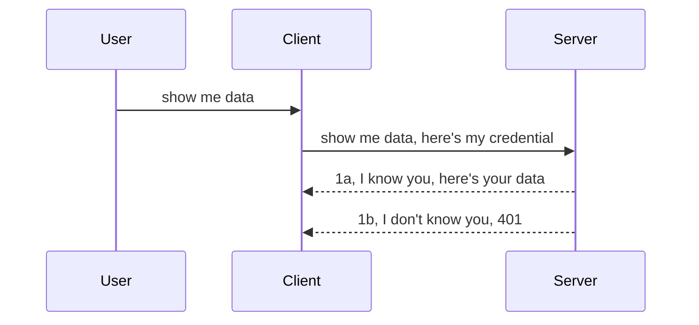

<!--
CO_OP_TRANSLATOR_METADATA:
{
  "original_hash": "5b00b8a8971a07d2d8803be4c9f138f8",
  "translation_date": "2025-10-07T00:39:18+00:00",
  "source_file": "03-GettingStarted/11-simple-auth/README.md",
  "language_code": "hi"
}
-->
# सरल प्रमाणीकरण

MCP SDKs OAuth 2.1 का उपयोग करने का समर्थन करते हैं, जो कि एक जटिल प्रक्रिया है जिसमें प्रमाणीकरण सर्वर, संसाधन सर्वर, क्रेडेंशियल्स पोस्ट करना, कोड प्राप्त करना, कोड को बियरर टोकन में बदलना और अंततः संसाधन डेटा प्राप्त करना शामिल है। यदि आप OAuth के आदी नहीं हैं, जो कि लागू करने के लिए एक शानदार चीज है, तो यह बेहतर सुरक्षा की ओर बढ़ने से पहले कुछ बुनियादी स्तर के प्रमाणीकरण से शुरुआत करना एक अच्छा विचार है। यही कारण है कि यह अध्याय मौजूद है, ताकि आपको अधिक उन्नत प्रमाणीकरण तक पहुंचने में मदद मिल सके।

## प्रमाणीकरण, इसका क्या मतलब है?

प्रमाणीकरण का मतलब है पहचान और अधिकार। इसका उद्देश्य दो चीजें करना है:

- **पहचान (Authentication)**, यह प्रक्रिया यह तय करती है कि हम किसी व्यक्ति को अपने घर में प्रवेश करने दें या नहीं, और यह सुनिश्चित करती है कि उनके पास "यहां" होने का अधिकार है, यानी हमारे MCP सर्वर के संसाधन सर्वर तक पहुंच।
- **अधिकार (Authorization)**, यह प्रक्रिया यह तय करती है कि उपयोगकर्ता को उन विशिष्ट संसाधनों तक पहुंच होनी चाहिए या नहीं, जिनकी वे मांग कर रहे हैं, जैसे कि ऑर्डर या उत्पाद। उदाहरण के लिए, उन्हें सामग्री पढ़ने की अनुमति हो सकती है लेकिन उसे हटाने की नहीं।

## क्रेडेंशियल्स: सिस्टम को अपनी पहचान बताने का तरीका

अधिकांश वेब डेवलपर्स आमतौर पर सर्वर को क्रेडेंशियल प्रदान करने के बारे में सोचते हैं, आमतौर पर एक गुप्त जानकारी जो यह बताती है कि उन्हें "पहचान" के लिए यहां रहने की अनुमति है। यह क्रेडेंशियल आमतौर पर उपयोगकर्ता नाम और पासवर्ड का बेस64 एन्कोडेड संस्करण या एक API कुंजी होती है जो किसी विशिष्ट उपयोगकर्ता की पहचान करती है।

यह "Authorization" नामक हेडर के माध्यम से भेजा जाता है, जैसे:

```json
{ "Authorization": "secret123" }
```

इसे आमतौर पर बेसिक प्रमाणीकरण कहा जाता है। इसके बाद का प्रवाह निम्न प्रकार से काम करता है:



अब जब हम समझ गए हैं कि यह प्रवाह के दृष्टिकोण से कैसे काम करता है, तो इसे कैसे लागू करें? खैर, अधिकांश वेब सर्वरों में मिडलवेयर नामक एक अवधारणा होती है, जो अनुरोध के हिस्से के रूप में चलने वाला कोड का एक टुकड़ा होता है जो क्रेडेंशियल्स को सत्यापित कर सकता है। यदि क्रेडेंशियल्स मान्य हैं, तो अनुरोध को आगे बढ़ने की अनुमति दी जाती है। यदि अनुरोध में मान्य क्रेडेंशियल्स नहीं हैं, तो आपको प्रमाणीकरण त्रुटि मिलती है। आइए देखें कि इसे कैसे लागू किया जा सकता है:

**Python**

```python
class AuthMiddleware(BaseHTTPMiddleware):
    async def dispatch(self, request, call_next):

        has_header = request.headers.get("Authorization")
        if not has_header:
            print("-> Missing Authorization header!")
            return Response(status_code=401, content="Unauthorized")

        if not valid_token(has_header):
            print("-> Invalid token!")
            return Response(status_code=403, content="Forbidden")

        print("Valid token, proceeding...")
       
        response = await call_next(request)
        # add any customer headers or change in the response in some way
        return response


starlette_app.add_middleware(CustomHeaderMiddleware)
```

यहां हमने:

- `AuthMiddleware` नामक एक मिडलवेयर बनाया, जहां इसका `dispatch` मेथड वेब सर्वर द्वारा बुलाया जा रहा है।
- मिडलवेयर को वेब सर्वर में जोड़ा:

    ```python
    starlette_app.add_middleware(AuthMiddleware)
    ```

- सत्यापन लॉजिक लिखा जो यह जांचता है कि Authorization हेडर मौजूद है और भेजा गया गुप्त कोड मान्य है या नहीं:

    ```python
    has_header = request.headers.get("Authorization")
    if not has_header:
        print("-> Missing Authorization header!")
        return Response(status_code=401, content="Unauthorized")

    if not valid_token(has_header):
        print("-> Invalid token!")
        return Response(status_code=403, content="Forbidden")
    ```

    यदि गुप्त कोड मौजूद है और मान्य है, तो हम अनुरोध को `call_next` को कॉल करके आगे बढ़ने देते हैं और प्रतिक्रिया लौटाते हैं।

    ```python
    response = await call_next(request)
    # add any customer headers or change in the response in some way
    return response
    ```

यह कैसे काम करता है: यदि वेब अनुरोध सर्वर की ओर किया जाता है, तो मिडलवेयर को बुलाया जाएगा और इसकी कार्यान्वयन के अनुसार यह या तो अनुरोध को आगे बढ़ने देगा या एक त्रुटि लौटाएगा जो इंगित करती है कि क्लाइंट को आगे बढ़ने की अनुमति नहीं है।

**TypeScript**

यहां हम लोकप्रिय फ्रेमवर्क Express के साथ एक मिडलवेयर बनाते हैं और MCP सर्वर तक पहुंचने से पहले अनुरोध को इंटरसेप्ट करते हैं। इसका कोड यहां है:

```typescript
function isValid(secret) {
    return secret === "secret123";
}

app.use((req, res, next) => {
    // 1. Authorization header present?  
    if(!req.headers["Authorization"]) {
        res.status(401).send('Unauthorized');
    }
    
    let token = req.headers["Authorization"];

    // 2. Check validity.
    if(!isValid(token)) {
        res.status(403).send('Forbidden');
    }

   
    console.log('Middleware executed');
    // 3. Passes request to the next step in the request pipeline.
    next();
});
```

इस कोड में हमने:

1. जांचा कि Authorization हेडर पहली बार में मौजूद है या नहीं। यदि नहीं, तो हम 401 त्रुटि भेजते हैं।
2. सुनिश्चित किया कि क्रेडेंशियल/टोकन मान्य है। यदि नहीं, तो हम 403 त्रुटि भेजते हैं।
3. अंततः अनुरोध को अनुरोध पाइपलाइन में पास करते हैं और मांगे गए संसाधन को लौटाते हैं।

## अभ्यास: प्रमाणीकरण लागू करें

आइए अपने ज्ञान का उपयोग करें और इसे लागू करने का प्रयास करें। योजना निम्नलिखित है:

सर्वर

- एक वेब सर्वर और MCP इंस्टेंस बनाएं।
- सर्वर के लिए एक मिडलवेयर लागू करें।

क्लाइंट 

- हेडर के माध्यम से क्रेडेंशियल के साथ वेब अनुरोध भेजें।

### -1- एक वेब सर्वर और MCP इंस्टेंस बनाएं

पहले चरण में, हमें वेब सर्वर इंस्टेंस और MCP सर्वर बनाना होगा।

**Python**

यहां हम एक MCP सर्वर इंस्टेंस बनाते हैं, एक स्टारलेट वेब ऐप बनाते हैं और इसे uvicorn के साथ होस्ट करते हैं।

```python
# creating MCP Server

app = FastMCP(
    name="MCP Resource Server",
    instructions="Resource Server that validates tokens via Authorization Server introspection",
    host=settings["host"],
    port=settings["port"],
    debug=True
)

# creating starlette web app
starlette_app = app.streamable_http_app()

# serving app via uvicorn
async def run(starlette_app):
    import uvicorn
    config = uvicorn.Config(
            starlette_app,
            host=app.settings.host,
            port=app.settings.port,
            log_level=app.settings.log_level.lower(),
        )
    server = uvicorn.Server(config)
    await server.serve()

run(starlette_app)
```

इस कोड में हमने:

- MCP सर्वर बनाया।
- MCP सर्वर से स्टारलेट वेब ऐप बनाया, `app.streamable_http_app()`।
- वेब ऐप को uvicorn के साथ होस्ट और सर्व किया `server.serve()`।

**TypeScript**

यहां हम एक MCP सर्वर इंस्टेंस बनाते हैं।

```typescript
const server = new McpServer({
      name: "example-server",
      version: "1.0.0"
    });

    // ... set up server resources, tools, and prompts ...
```

यह MCP सर्वर निर्माण हमारे POST /mcp रूट परिभाषा के भीतर होना चाहिए, इसलिए आइए ऊपर दिए गए कोड को इस प्रकार स्थानांतरित करें:

```typescript
import express from "express";
import { randomUUID } from "node:crypto";
import { McpServer } from "@modelcontextprotocol/sdk/server/mcp.js";
import { StreamableHTTPServerTransport } from "@modelcontextprotocol/sdk/server/streamableHttp.js";
import { isInitializeRequest } from "@modelcontextprotocol/sdk/types.js"

const app = express();
app.use(express.json());

// Map to store transports by session ID
const transports: { [sessionId: string]: StreamableHTTPServerTransport } = {};

// Handle POST requests for client-to-server communication
app.post('/mcp', async (req, res) => {
  // Check for existing session ID
  const sessionId = req.headers['mcp-session-id'] as string | undefined;
  let transport: StreamableHTTPServerTransport;

  if (sessionId && transports[sessionId]) {
    // Reuse existing transport
    transport = transports[sessionId];
  } else if (!sessionId && isInitializeRequest(req.body)) {
    // New initialization request
    transport = new StreamableHTTPServerTransport({
      sessionIdGenerator: () => randomUUID(),
      onsessioninitialized: (sessionId) => {
        // Store the transport by session ID
        transports[sessionId] = transport;
      },
      // DNS rebinding protection is disabled by default for backwards compatibility. If you are running this server
      // locally, make sure to set:
      // enableDnsRebindingProtection: true,
      // allowedHosts: ['127.0.0.1'],
    });

    // Clean up transport when closed
    transport.onclose = () => {
      if (transport.sessionId) {
        delete transports[transport.sessionId];
      }
    };
    const server = new McpServer({
      name: "example-server",
      version: "1.0.0"
    });

    // ... set up server resources, tools, and prompts ...

    // Connect to the MCP server
    await server.connect(transport);
  } else {
    // Invalid request
    res.status(400).json({
      jsonrpc: '2.0',
      error: {
        code: -32000,
        message: 'Bad Request: No valid session ID provided',
      },
      id: null,
    });
    return;
  }

  // Handle the request
  await transport.handleRequest(req, res, req.body);
});

// Reusable handler for GET and DELETE requests
const handleSessionRequest = async (req: express.Request, res: express.Response) => {
  const sessionId = req.headers['mcp-session-id'] as string | undefined;
  if (!sessionId || !transports[sessionId]) {
    res.status(400).send('Invalid or missing session ID');
    return;
  }
  
  const transport = transports[sessionId];
  await transport.handleRequest(req, res);
};

// Handle GET requests for server-to-client notifications via SSE
app.get('/mcp', handleSessionRequest);

// Handle DELETE requests for session termination
app.delete('/mcp', handleSessionRequest);

app.listen(3000);
```

अब आप देख सकते हैं कि MCP सर्वर निर्माण को `app.post("/mcp")` के भीतर स्थानांतरित कर दिया गया है।

आइए अगले चरण पर जाएं, जिसमें मिडलवेयर बनाना शामिल है ताकि हम आने वाले क्रेडेंशियल को सत्यापित कर सकें।

### -2- सर्वर के लिए मिडलवेयर लागू करें

अब मिडलवेयर भाग पर चलते हैं। यहां हम एक मिडलवेयर बनाएंगे जो `Authorization` हेडर में क्रेडेंशियल की तलाश करता है और उसे सत्यापित करता है। यदि यह स्वीकार्य है, तो अनुरोध आगे बढ़ेगा और जो करना है वह करेगा (जैसे उपकरण सूचीबद्ध करना, संसाधन पढ़ना या जो भी MCP कार्यक्षमता क्लाइंट मांग रहा है)।

**Python**

मिडलवेयर बनाने के लिए, हमें `BaseHTTPMiddleware` से विरासत में लेने वाली एक क्लास बनानी होगी। यहां दो दिलचस्प हिस्से हैं:

- अनुरोध `request`, जिससे हम हेडर जानकारी पढ़ते हैं।
- `call_next`, वह कॉलबैक जिसे हमें बुलाना है यदि क्लाइंट ने एक स्वीकार्य क्रेडेंशियल लाया है।

सबसे पहले, हमें उस स्थिति को संभालना होगा जब `Authorization` हेडर गायब हो:

```python
has_header = request.headers.get("Authorization")

# no header present, fail with 401, otherwise move on.
if not has_header:
    print("-> Missing Authorization header!")
    return Response(status_code=401, content="Unauthorized")
```

यहां हम 401 अनधिकृत संदेश भेजते हैं क्योंकि क्लाइंट प्रमाणीकरण में विफल हो रहा है।

इसके बाद, यदि क्रेडेंशियल प्रस्तुत किया गया था, तो हमें इसकी वैधता की जांच करनी होगी, जैसे:

```python
 if not valid_token(has_header):
    print("-> Invalid token!")
    return Response(status_code=403, content="Forbidden")
```

ध्यान दें कि हम ऊपर 403 निषिद्ध संदेश भेजते हैं। आइए नीचे पूरा मिडलवेयर देखें जो हमने ऊपर सब कुछ लागू किया है:

```python
class AuthMiddleware(BaseHTTPMiddleware):
    async def dispatch(self, request, call_next):

        has_header = request.headers.get("Authorization")
        if not has_header:
            print("-> Missing Authorization header!")
            return Response(status_code=401, content="Unauthorized")

        if not valid_token(has_header):
            print("-> Invalid token!")
            return Response(status_code=403, content="Forbidden")

        print("Valid token, proceeding...")
        print(f"-> Received {request.method} {request.url}")
        response = await call_next(request)
        response.headers['Custom'] = 'Example'
        return response

```

अच्छा, लेकिन `valid_token` फ़ंक्शन के बारे में क्या? यह नीचे है:

```python
# DON'T use for production - improve it !!
def valid_token(token: str) -> bool:
    # remove the "Bearer " prefix
    if token.startswith("Bearer "):
        token = token[7:]
        return token == "secret-token"
    return False
```

यह स्पष्ट रूप से सुधार किया जाना चाहिए।

महत्वपूर्ण: आपको कभी भी कोड में इस तरह के गुप्त कोड नहीं रखने चाहिए। आपको आदर्श रूप से तुलना के लिए मान को डेटा स्रोत या IDP (पहचान सेवा प्रदाता) से प्राप्त करना चाहिए या बेहतर यह होगा कि IDP ही सत्यापन करे।

**TypeScript**

इसे Express के साथ लागू करने के लिए, हमें `use` मेथड को कॉल करना होगा जो मिडलवेयर फ़ंक्शंस लेता है।

हमें:

- अनुरोध वेरिएबल के साथ इंटरैक्ट करना होगा ताकि `Authorization` प्रॉपर्टी में पास किए गए क्रेडेंशियल की जांच की जा सके।
- क्रेडेंशियल को सत्यापित करना होगा, और यदि ऐसा है तो अनुरोध को जारी रखने देना होगा ताकि क्लाइंट का MCP अनुरोध वह कर सके जो उसे करना चाहिए (जैसे उपकरण सूचीबद्ध करना, संसाधन पढ़ना या MCP से संबंधित कुछ भी)।

यहां, हम जांच रहे हैं कि `Authorization` हेडर मौजूद है या नहीं, और यदि नहीं, तो हम अनुरोध को आगे बढ़ने से रोकते हैं:

```typescript
if(!req.headers["authorization"]) {
    res.status(401).send('Unauthorized');
    return;
}
```

यदि हेडर पहली बार में नहीं भेजा गया है, तो आपको 401 प्राप्त होता है।

इसके बाद, हम जांचते हैं कि क्रेडेंशियल मान्य है या नहीं। यदि नहीं, तो हम अनुरोध को फिर से रोकते हैं लेकिन थोड़े अलग संदेश के साथ:

```typescript
if(!isValid(token)) {
    res.status(403).send('Forbidden');
    return;
} 
```

ध्यान दें कि अब आपको 403 त्रुटि मिलती है।

यहां पूरा कोड है:

```typescript
app.use((req, res, next) => {
    console.log('Request received:', req.method, req.url, req.headers);
    console.log('Headers:', req.headers["authorization"]);
    if(!req.headers["authorization"]) {
        res.status(401).send('Unauthorized');
        return;
    }
    
    let token = req.headers["authorization"];

    if(!isValid(token)) {
        res.status(403).send('Forbidden');
        return;
    }  

    console.log('Middleware executed');
    next();
});
```

हमने वेब सर्वर को मिडलवेयर स्वीकार करने के लिए सेट कर दिया है ताकि वह क्रेडेंशियल की जांच कर सके जिसे क्लाइंट हमें भेज रहा है। क्लाइंट के बारे में क्या?

### -3- हेडर के माध्यम से क्रेडेंशियल के साथ वेब अनुरोध भेजें

हमें यह सुनिश्चित करना होगा कि क्लाइंट हेडर के माध्यम से क्रेडेंशियल पास कर रहा है। चूंकि हम MCP क्लाइंट का उपयोग करने जा रहे हैं, हमें यह पता लगाना होगा कि यह कैसे किया जाता है।

**Python**

क्लाइंट के लिए, हमें अपने क्रेडेंशियल के साथ एक हेडर पास करना होगा, जैसे:

```python
# DON'T hardcode the value, have it at minimum in an environment variable or a more secure storage
token = "secret-token"

async with streamablehttp_client(
        url = f"http://localhost:{port}/mcp",
        headers = {"Authorization": f"Bearer {token}"}
    ) as (
        read_stream,
        write_stream,
        session_callback,
    ):
        async with ClientSession(
            read_stream,
            write_stream
        ) as session:
            await session.initialize()
      
            # TODO, what you want done in the client, e.g list tools, call tools etc.
```

ध्यान दें कि हमने `headers` प्रॉपर्टी को इस प्रकार भरा है: `headers = {"Authorization": f"Bearer {token}"}`।

**TypeScript**

हम इसे दो चरणों में हल कर सकते हैं:

1. एक कॉन्फ़िगरेशन ऑब्जेक्ट को हमारे क्रेडेंशियल के साथ भरें।
2. कॉन्फ़िगरेशन ऑब्जेक्ट को ट्रांसपोर्ट में पास करें।

```typescript

// DON'T hardcode the value like shown here. At minimum have it as a env variable and use something like dotenv (in dev mode).
let token = "secret123"

// define a client transport option object
let options: StreamableHTTPClientTransportOptions = {
  sessionId: sessionId,
  requestInit: {
    headers: {
      "Authorization": "secret123"
    }
  }
};

// pass the options object to the transport
async function main() {
   const transport = new StreamableHTTPClientTransport(
      new URL(serverUrl),
      options
   );
```

यहां आप देख सकते हैं कि हमने एक `options` ऑब्जेक्ट बनाया और हमारे हेडर को `requestInit` प्रॉपर्टी के तहत रखा।

महत्वपूर्ण: इसे यहां से कैसे सुधारें? खैर, वर्तमान कार्यान्वयन में कुछ समस्याएं हैं। सबसे पहले, इस तरह क्रेडेंशियल पास करना काफी जोखिम भरा है जब तक कि आपके पास कम से कम HTTPS न हो। फिर भी, क्रेडेंशियल चोरी हो सकता है, इसलिए आपको एक ऐसा सिस्टम चाहिए जहां आप आसानी से टोकन को रद्द कर सकें और अतिरिक्त जांच जोड़ सकें जैसे कि यह दुनिया में कहां से आ रहा है, क्या अनुरोध बहुत बार हो रहा है (बॉट जैसा व्यवहार), संक्षेप में, कई चिंताएं हैं।

हालांकि, यह कहा जाना चाहिए कि बहुत सरल APIs के लिए जहां आप नहीं चाहते कि कोई भी आपके API को बिना प्रमाणीकरण के कॉल करे, और जो हमारे पास यहां है वह एक अच्छी शुरुआत है।

इसके साथ ही, आइए सुरक्षा को थोड़ा मजबूत करने का प्रयास करें और JSON Web Token, जिसे JWT या "JOT" टोकन भी कहा जाता है, जैसे मानकीकृत प्रारूप का उपयोग करें।

## JSON Web Tokens, JWT

तो, हम बहुत सरल क्रेडेंशियल्स भेजने से सुधार करने की कोशिश कर रहे हैं। JWT अपनाने से हमें तुरंत क्या सुधार मिलता है?

- **सुरक्षा सुधार**। बेसिक प्रमाणीकरण में, आप उपयोगकर्ता नाम और पासवर्ड को बेस64 एन्कोडेड टोकन (या आप एक API कुंजी भेजते हैं) बार-बार भेजते हैं, जिससे जोखिम बढ़ता है। JWT के साथ, आप अपना उपयोगकर्ता नाम और पासवर्ड भेजते हैं और बदले में एक टोकन प्राप्त करते हैं, और यह समय-सीमित भी होता है, यानी यह समाप्त हो जाएगा। JWT आपको भूमिकाओं, स्कोप और अनुमतियों का उपयोग करके आसानी से सूक्ष्म पहुंच नियंत्रण लागू करने देता है।
- **स्टेटलेसनेस और स्केलेबिलिटी**। JWTs आत्म-निहित होते हैं, वे सभी उपयोगकर्ता जानकारी ले जाते हैं और सर्वर-साइड सत्र संग्रहण की आवश्यकता को समाप्त करते हैं। टोकन को स्थानीय रूप से भी सत्यापित किया जा सकता है।
- **इंटरऑपरेबिलिटी और फेडरेशन**। JWTs Open ID Connect का केंद्र है और Entra ID, Google Identity और Auth0 जैसे ज्ञात पहचान प्रदाताओं के साथ उपयोग किया जाता है। वे सिंगल साइन-ऑन और बहुत कुछ संभव बनाते हैं, जिससे यह एंटरप्राइज़-ग्रेड बनता है।
- **मॉड्यूलरिटी और लचीलापन**। JWTs को Azure API Management, NGINX और अन्य जैसे API गेटवे के साथ भी उपयोग किया जा सकता है। यह उपयोग प्रमाणीकरण परिदृश्यों और सर्वर-से-सर्विस संचार सहित प्रतिरूपण और प्रतिनिधिमंडल परिदृश्यों का समर्थन करता है।
- **प्रदर्शन और कैशिंग**। JWTs को डिकोडिंग के बाद कैश किया जा सकता है, जिससे पार्सिंग की आवश्यकता कम हो जाती है। यह विशेष रूप से उच्च-ट्रैफ़िक ऐप्स के साथ मदद करता है क्योंकि यह थ्रूपुट में सुधार करता है और आपके चुने हुए इंफ्रास्ट्रक्चर पर लोड को कम करता है।
- **उन्नत सुविधाएं**। यह निरीक्षण (सर्वर पर वैधता की जांच) और रद्दीकरण (टोकन को अमान्य बनाना) का भी समर्थन करता है।

इन सभी लाभों के साथ, आइए देखें कि हम अपने कार्यान्वयन को अगले स्तर तक कैसे ले जा सकते हैं।

## बेसिक प्रमाणीकरण को JWT में बदलना

तो, हमें ऊंचे स्तर पर जो बदलाव करने की आवश्यकता है, वे हैं:

- **JWT टोकन बनाना सीखें** और इसे क्लाइंट से सर्वर तक भेजने के लिए तैयार करें।
- **JWT टोकन को सत्यापित करें**, और यदि ऐसा है, तो क्लाइंट को हमारे संसाधन दें।
- **टोकन संग्रहण को सुरक्षित करें**। इस टोकन को कैसे संग्रहित करें।
- **रूट्स की सुरक्षा करें**। हमें रूट्स और विशिष्ट MCP सुविधाओं की सुरक्षा करनी होगी।
- **रिफ्रेश टोकन जोड़ें**। सुनिश्चित करें कि हम छोटे समय के लिए टोकन बनाते हैं लेकिन लंबे समय तक चलने वाले रिफ्रेश टोकन बनाते हैं जिन्हें नए टोकन प्राप्त करने के लिए उपयोग किया जा सकता है यदि वे समाप्त हो जाते हैं। साथ ही सुनिश्चित करें कि एक रिफ्रेश एंडपॉइंट और एक रोटेशन रणनीति है।

### -1- JWT टोकन बनाना

सबसे पहले, एक JWT टोकन में निम्नलिखित भाग होते हैं:

- **हेडर**, उपयोग की गई एल्गोरिथ्म और टोकन प्रकार।
- **पेलोड**, दावे, जैसे sub (उपयोगकर्ता या इकाई जिसे टोकन दर्शाता है। प्रमाणीकरण परिदृश्य में यह आमतौर पर उपयोगकर्ता आईडी होता है), exp (जब यह समाप्त होता है) role (भूमिका)।
- **सिग्नेचर**, एक गुप्त या निजी कुंजी के साथ हस्ताक्षरित।

इसके लिए, हमें हेडर, पेलोड और एन्कोडेड टोकन बनाना होगा।

**Python**

```python

import jwt
import jwt
from jwt.exceptions import ExpiredSignatureError, InvalidTokenError
import datetime

# Secret key used to sign the JWT
secret_key = 'your-secret-key'

header = {
    "alg": "HS256",
    "typ": "JWT"
}

# the user info andits claims and expiry time
payload = {
    "sub": "1234567890",               # Subject (user ID)
    "name": "User Userson",                # Custom claim
    "admin": True,                     # Custom claim
    "iat": datetime.datetime.utcnow(),# Issued at
    "exp": datetime.datetime.utcnow() + datetime.timedelta(hours=1)  # Expiry
}

# encode it
encoded_jwt = jwt.encode(payload, secret_key, algorithm="HS256", headers=header)
```

ऊपर दिए गए कोड में हमने:

- HS256 को एल्गोरिथ्म के रूप में और प्रकार को JWT के रूप में उपयोग करते हुए एक हेडर परिभाषित किया।
- एक पेलोड बनाया जिसमें एक विषय या उपयोगकर्ता आईडी, एक उपयोगकर्ता नाम, एक भूमिका, जब इसे जारी किया गया था और जब इसे समाप्त करने के लिए सेट किया गया था, इस प्रकार हमने पहले उल्लेख किए गए समय-सीमित पहलू को लागू किया।

**TypeScript**

यहां हमें कुछ डिपेंडेंसी की आवश्यकता होगी जो हमें JWT टोकन बनाने में मदद करेंगी।

डिपेंडेंसी

```sh

npm install jsonwebtoken
npm install --save-dev @types/jsonwebtoken
```

अब जब हमारे पास यह है, तो आइए हेडर, पेलोड बनाएं और इसके माध्यम से एन्कोडेड टोकन बनाएं।

```typescript
import jwt from 'jsonwebtoken';

const secretKey = 'your-secret-key'; // Use env vars in production

// Define the payload
const payload = {
  sub: '1234567890',
  name: 'User usersson',
  admin: true,
  iat: Math.floor(Date.now() / 1000), // Issued at
  exp: Math.floor(Date.now() / 1000) + 60 * 60 // Expires in 1 hour
};

// Define the header (optional, jsonwebtoken sets defaults)
const header = {
  alg: 'HS256',
  typ: 'JWT'
};

// Create the token
const token = jwt.sign(payload, secretKey, {
  algorithm: 'HS256',
  header: header
});

console.log('JWT:', token);
```

यह टोकन:

HS256 का उपयोग करके हस्ताक्षरित है।
1 घंटे के लिए मान्य है।
sub, name, admin, iat, और exp जैसे दावे शामिल करता है।

### -2- टोकन को सत्यापित करें

हमें टोकन को सत्यापित करने की भी आवश्यकता होगी। यह कुछ ऐसा है जो हमें सर्वर पर करना चाहिए ताकि यह सुनिश्चित हो सके कि क्लाइंट हमें जो भेज रहा है वह वास्तव में मान्य है। यहां कई जांचें करनी चाहिए, जैसे इसकी संरचना को सत्यापित करना और इसकी वैधता। आपको यह भी प्रोत्साहित किया जाता है कि यह जांचें कि उपयोगकर्ता आपके सिस्टम में है और अधिक।

टोकन को सत्यापित करने के लिए, हमें इसे डिकोड करना होगा ताकि हम इसे पढ़ सकें और फिर इसकी वैधता की जांच शुरू कर सकें:

**Python**

```python

# Decode and verify the JWT
try:
    decoded = jwt.decode(token, secret_key, algorithms=["HS256"])
    print("✅ Token is valid.")
    print("Decoded claims:")
    for key, value in decoded.items():
        print(f"  {key}: {value}")
except ExpiredSignatureError:
    print("❌ Token has expired.")
except InvalidTokenError as e:
    print(f"❌ Invalid token: {e}")

```

इस कोड में, हम `jwt.decode` को टोकन, गुप्त कुंजी और चुने गए एल्गोरिथ्म को इनपुट के रूप में कॉल करते हैं। ध्यान दें कि हम try-catch संरचना का उपयोग करते हैं क्योंकि असफल सत्यापन के कारण एक त्रुटि उत्पन्न होती है।

**TypeScript**

यहां हमें `jwt.verify` को कॉल करना होगा ताकि हमें टोकन का डिकोडेड संस्करण मिल सके जिसे हम आगे विश्लेषण कर सकते हैं। यदि यह कॉल विफल हो जाती है, तो इसका मतलब है कि टोकन की संरचना गलत है या यह अब मान्य नहीं है।

```typescript

try {
  const decoded = jwt.verify(token, secretKey);
  console.log('Decoded Payload:', decoded);
} catch (err) {
  console.error('Token verification failed:', err);
}
```

नोट: जैसा कि पहले उल्लेख किया गया है, हमें अतिरिक्त जांच करनी चाहिए ताकि यह सुनिश्चित हो सके कि यह टोकन हमारे सिस्टम में एक उपयोगकर्ता को इंगित करता है और यह सुनिश्चित करता है कि उपयोगकर्ता के पास
आइए अब रोल आधारित एक्सेस कंट्रोल, जिसे RBAC भी कहा जाता है, पर ध्यान दें।

## रोल आधारित एक्सेस कंट्रोल जोड़ना

इसका विचार यह है कि हम यह व्यक्त करना चाहते हैं कि अलग-अलग भूमिकाओं के पास अलग-अलग अनुमतियां होती हैं। उदाहरण के लिए, हम मानते हैं कि एक एडमिन सब कुछ कर सकता है, एक सामान्य उपयोगकर्ता पढ़/लिख सकता है, और एक गेस्ट केवल पढ़ सकता है। इसलिए, यहां कुछ संभावित अनुमति स्तर दिए गए हैं:

- Admin.Write 
- User.Read
- Guest.Read

आइए देखें कि हम मिडलवेयर के साथ इस तरह के नियंत्रण को कैसे लागू कर सकते हैं। मिडलवेयर को किसी विशेष रूट के लिए या सभी रूट्स के लिए जोड़ा जा सकता है।

**Python**

```python
from starlette.middleware.base import BaseHTTPMiddleware
from starlette.responses import JSONResponse
import jwt

# DON'T have the secret in the code like, this is for demonstration purposes only. Read it from a safe place.
SECRET_KEY = "your-secret-key" # put this in env variable
REQUIRED_PERMISSION = "User.Read"

class JWTPermissionMiddleware(BaseHTTPMiddleware):
    async def dispatch(self, request, call_next):
        auth_header = request.headers.get("Authorization")
        if not auth_header or not auth_header.startswith("Bearer "):
            return JSONResponse({"error": "Missing or invalid Authorization header"}, status_code=401)

        token = auth_header.split(" ")[1]
        try:
            decoded = jwt.decode(token, SECRET_KEY, algorithms=["HS256"])
        except jwt.ExpiredSignatureError:
            return JSONResponse({"error": "Token expired"}, status_code=401)
        except jwt.InvalidTokenError:
            return JSONResponse({"error": "Invalid token"}, status_code=401)

        permissions = decoded.get("permissions", [])
        if REQUIRED_PERMISSION not in permissions:
            return JSONResponse({"error": "Permission denied"}, status_code=403)

        request.state.user = decoded
        return await call_next(request)


```

मिडलवेयर जोड़ने के कुछ अलग तरीके नीचे दिए गए हैं:

```python

# Alt 1: add middleware while constructing starlette app
middleware = [
    Middleware(JWTPermissionMiddleware)
]

app = Starlette(routes=routes, middleware=middleware)

# Alt 2: add middleware after starlette app is a already constructed
starlette_app.add_middleware(JWTPermissionMiddleware)

# Alt 3: add middleware per route
routes = [
    Route(
        "/mcp",
        endpoint=..., # handler
        middleware=[Middleware(JWTPermissionMiddleware)]
    )
]
```

**TypeScript**

हम `app.use` और एक मिडलवेयर का उपयोग कर सकते हैं जो सभी अनुरोधों के लिए चलेगा।

```typescript
app.use((req, res, next) => {
    console.log('Request received:', req.method, req.url, req.headers);
    console.log('Headers:', req.headers["authorization"]);

    // 1. Check if authorization header has been sent

    if(!req.headers["authorization"]) {
        res.status(401).send('Unauthorized');
        return;
    }
    
    let token = req.headers["authorization"];

    // 2. Check if token is valid
    if(!isValid(token)) {
        res.status(403).send('Forbidden');
        return;
    }  

    // 3. Check if token user exist in our system
    if(!isExistingUser(token)) {
        res.status(403).send('Forbidden');
        console.log("User does not exist");
        return;
    }
    console.log("User exists");

    // 4. Verify the token has the right permissions
    if(!hasScopes(token, ["User.Read"])){
        res.status(403).send('Forbidden - insufficient scopes');
    }

    console.log("User has required scopes");

    console.log('Middleware executed');
    next();
});

```

मिडलवेयर के लिए कुछ चीजें हैं जो इसे करनी चाहिए और जो इसे करनी ही चाहिए, जैसे:

1. जांचें कि क्या ऑथराइजेशन हेडर मौजूद है।
2. जांचें कि टोकन वैध है। हम `isValid` नामक एक विधि को कॉल करते हैं, जिसे हमने लिखा है, जो JWT टोकन की अखंडता और वैधता की जांच करता है।
3. सुनिश्चित करें कि उपयोगकर्ता हमारे सिस्टम में मौजूद है। हमें इसकी जांच करनी चाहिए।

   ```typescript
    // users in DB
   const users = [
     "user1",
     "User usersson",
   ]

   function isExistingUser(token) {
     let decodedToken = verifyToken(token);

     // TODO, check if user exists in DB
     return users.includes(decodedToken?.name || "");
   }
   ```

   ऊपर, हमने एक बहुत ही सरल `users` सूची बनाई है, जो स्पष्ट रूप से एक डेटाबेस में होनी चाहिए।

4. इसके अतिरिक्त, हमें यह भी जांचना चाहिए कि टोकन में सही अनुमतियां हैं।

   ```typescript
   if(!hasScopes(token, ["User.Read"])){
        res.status(403).send('Forbidden - insufficient scopes');
   }
   ```

   ऊपर दिए गए कोड में, मिडलवेयर से, हम जांचते हैं कि टोकन में User.Read अनुमति है या नहीं। यदि नहीं, तो हम 403 त्रुटि भेजते हैं। नीचे `hasScopes` हेल्पर विधि है।

   ```typescript
   function hasScopes(scope: string, requiredScopes: string[]) {
     let decodedToken = verifyToken(scope);
    return requiredScopes.every(scope => decodedToken?.scopes.includes(scope));
  }
   ```

Have a think which additional checks you should be doing, but these are the absolute minimum of checks you should be doing.

Using Express as a web framework is a common choice. There are helpers library when you use JWT so you can write less code.

- `express-jwt`, helper library that provides a middleware that helps decode your token.
- `express-jwt-permissions`, this provides a middleware `guard` that helps check if a certain permission is on the token.

Here's what these libraries can look like when used:

```typescript
const express = require('express');
const jwt = require('express-jwt');
const guard = require('express-jwt-permissions')();

const app = express();
const secretKey = 'your-secret-key'; // put this in env variable

// Decode JWT and attach to req.user
app.use(jwt({ secret: secretKey, algorithms: ['HS256'] }));

// Check for User.Read permission
app.use(guard.check('User.Read'));

// multiple permissions
// app.use(guard.check(['User.Read', 'Admin.Access']));

app.get('/protected', (req, res) => {
  res.json({ message: `Welcome ${req.user.name}` });
});

// Error handler
app.use((err, req, res, next) => {
  if (err.code === 'permission_denied') {
    return res.status(403).send('Forbidden');
  }
  next(err);
});

```

अब आपने देखा कि मिडलवेयर का उपयोग प्रमाणीकरण और प्राधिकरण दोनों के लिए कैसे किया जा सकता है। लेकिन MCP के बारे में क्या? क्या यह हमारे प्रमाणीकरण के तरीके को बदलता है? आइए अगले भाग में पता लगाएं।

### -3- MCP में RBAC जोड़ें

अब तक आपने देखा कि मिडलवेयर के माध्यम से RBAC कैसे जोड़ा जा सकता है। हालांकि, MCP के लिए किसी विशेष MCP फीचर RBAC को जोड़ने का कोई आसान तरीका नहीं है। तो हम क्या करें? खैर, हमें बस ऐसा कोड जोड़ना होगा जो इस मामले में जांचता है कि क्लाइंट के पास किसी विशेष टूल को कॉल करने का अधिकार है या नहीं:

आपके पास फीचर-वार RBAC को पूरा करने के कुछ विकल्प हैं, जैसे:

- प्रत्येक टूल, संसाधन, प्रॉम्प्ट के लिए एक चेक जोड़ें जहां आपको अनुमति स्तर की जांच करनी है।

   **Python**

   ```python
   @tool()
   def delete_product(id: int):
      try:
          check_permissions(role="Admin.Write", request)
      catch:
        pass # client failed authorization, raise authorization error
   ```

   **TypeScript**

   ```typescript
   server.registerTool(
    "delete-product",
    {
      title: Delete a product",
      description: "Deletes a product",
      inputSchema: { id: z.number() }
    },
    async ({ id }) => {
      
      try {
        checkPermissions("Admin.Write", request);
        // todo, send id to productService and remote entry
      } catch(Exception e) {
        console.log("Authorization error, you're not allowed");  
      }

      return {
        content: [{ type: "text", text: `Deletected product with id ${id}` }]
      };
    }
   );
   ```


- उन्नत सर्वर दृष्टिकोण और अनुरोध हैंडलर्स का उपयोग करें ताकि आपको जांच करने के लिए कम स्थानों की आवश्यकता हो।

   **Python**

   ```python
   
   tool_permission = {
      "create_product": ["User.Write", "Admin.Write"],
      "delete_product": ["Admin.Write"]
   }

   def has_permission(user_permissions, required_permissions) -> bool:
      # user_permissions: list of permissions the user has
      # required_permissions: list of permissions required for the tool
      return any(perm in user_permissions for perm in required_permissions)

   @server.call_tool()
   async def handle_call_tool(
     name: str, arguments: dict[str, str] | None
   ) -> list[types.TextContent]:
    # Assume request.user.permissions is a list of permissions for the user
     user_permissions = request.user.permissions
     required_permissions = tool_permission.get(name, [])
     if not has_permission(user_permissions, required_permissions):
        # Raise error "You don't have permission to call tool {name}"
        raise Exception(f"You don't have permission to call tool {name}")
     # carry on and call tool
     # ...
   ```   
   

   **TypeScript**

   ```typescript
   function hasPermission(userPermissions: string[], requiredPermissions: string[]): boolean {
       if (!Array.isArray(userPermissions) || !Array.isArray(requiredPermissions)) return false;
       // Return true if user has at least one required permission
       
       return requiredPermissions.some(perm => userPermissions.includes(perm));
   }
  
   server.setRequestHandler(CallToolRequestSchema, async (request) => {
      const { params: { name } } = request;
  
      let permissions = request.user.permissions;
  
      if (!hasPermission(permissions, toolPermissions[name])) {
         return new Error(`You don't have permission to call ${name}`);
      }
  
      // carry on..
   });
   ```

   ध्यान दें, आपको यह सुनिश्चित करना होगा कि आपका मिडलवेयर अनुरोध की user प्रॉपर्टी में डिकोडेड टोकन असाइन करता है ताकि ऊपर दिया गया कोड सरल हो जाए।

### सारांश

अब जब हमने सामान्य रूप से RBAC और विशेष रूप से MCP के लिए समर्थन जोड़ने पर चर्चा की है, तो यह सुनिश्चित करने के लिए सुरक्षा को स्वयं लागू करने का प्रयास करने का समय है कि आपने प्रस्तुत किए गए अवधारणाओं को समझा है।

## असाइनमेंट 1: बेसिक ऑथेंटिकेशन का उपयोग करके MCP सर्वर और MCP क्लाइंट बनाएं

यहां आप हेडर के माध्यम से क्रेडेंशियल्स भेजने के बारे में जो सीखा है उसका उपयोग करेंगे।

## समाधान 1

[Solution 1](./code/basic/README.md)

## असाइनमेंट 2: असाइनमेंट 1 के समाधान को JWT का उपयोग करके अपग्रेड करें

पहले समाधान को लें, लेकिन इस बार इसे बेहतर बनाएं।

बेसिक ऑथ के बजाय, JWT का उपयोग करें।

## समाधान 2

[Solution 2](./solution/jwt-solution/README.md)

## चुनौती

सेक्शन "MCP में RBAC जोड़ें" में वर्णित प्रत्येक टूल के लिए RBAC जोड़ें।

## सारांश

आपने इस अध्याय में बहुत कुछ सीखा होगा, बिना किसी सुरक्षा से लेकर बेसिक सुरक्षा तक, JWT और इसे MCP में कैसे जोड़ा जा सकता है।

हमने कस्टम JWTs के साथ एक ठोस नींव बनाई है, लेकिन जैसे-जैसे हम स्केल करते हैं, हम एक मानक-आधारित पहचान मॉडल की ओर बढ़ रहे हैं। Entra या Keycloak जैसे IdP को अपनाने से हमें टोकन जारी करने, मान्य करने और जीवनचक्र प्रबंधन को एक विश्वसनीय प्लेटफॉर्म पर स्थानांतरित करने की अनुमति मिलती है — जिससे हम ऐप लॉजिक और उपयोगकर्ता अनुभव पर ध्यान केंद्रित कर सकें।

इसके लिए, हमारे पास [Entra पर एक अधिक उन्नत अध्याय](../../05-AdvancedTopics/mcp-security-entra/README.md) है।

---

**अस्वीकरण**:  
यह दस्तावेज़ AI अनुवाद सेवा [Co-op Translator](https://github.com/Azure/co-op-translator) का उपयोग करके अनुवादित किया गया है। जबकि हम सटीकता सुनिश्चित करने का प्रयास करते हैं, कृपया ध्यान दें कि स्वचालित अनुवाद में त्रुटियां या अशुद्धियां हो सकती हैं। मूल भाषा में उपलब्ध मूल दस्तावेज़ को प्रामाणिक स्रोत माना जाना चाहिए। महत्वपूर्ण जानकारी के लिए, पेशेवर मानव अनुवाद की सिफारिश की जाती है। इस अनुवाद के उपयोग से उत्पन्न किसी भी गलतफहमी या गलत व्याख्या के लिए हम उत्तरदायी नहीं हैं।