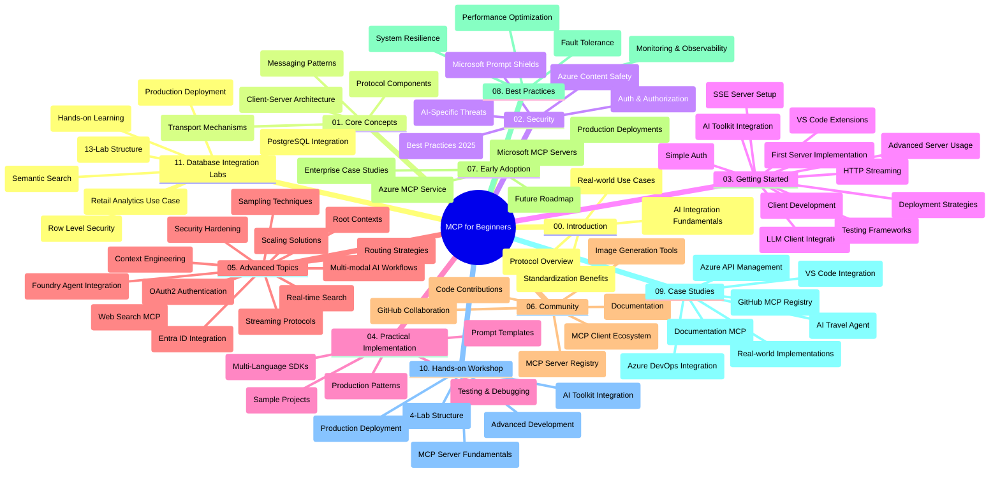

<!--
CO_OP_TRANSLATOR_METADATA:
{
  "original_hash": "af27b0acfae6caa134d9701453884df8",
  "translation_date": "2025-10-06T22:18:46+00:00",
  "source_file": "study_guide.md",
  "language_code": "hk"
}
-->
# 初學者的模型上下文協議 (MCP) - 學習指南

此學習指南概述了「模型上下文協議 (MCP) 初學者」課程的存儲庫結構和內容。請使用此指南高效瀏覽存儲庫並充分利用可用資源。

## 存儲庫概述

模型上下文協議 (MCP) 是一個標準化框架，用於 AI 模型與客戶端應用之間的交互。MCP 最初由 Anthropic 創建，現由更廣泛的 MCP 社群通過官方 GitHub 組織進行維護。此存儲庫提供了全面的課程，包括 C#、Java、JavaScript、Python 和 TypeScript 的實操代碼示例，專為 AI 開發者、系統架構師和軟件工程師設計。

## 視覺化課程地圖

## 存儲庫結構

存儲庫分為十一個主要部分，每部分專注於 MCP 的不同方面：

1. **簡介 (00-Introduction/)**
   - 模型上下文協議概述
   - 為什麼標準化在 AI 管道中很重要
   - 實際應用案例和優勢

2. **核心概念 (01-CoreConcepts/)**
   - 客戶端-服務器架構
   - 協議的關鍵組成部分
   - MCP 中的消息模式

3. **安全性 (02-Security/)**
   - 基於 MCP 系統的安全威脅
   - 保護實施的最佳實踐
   - 身份驗證和授權策略
   - **全面的安全文檔**：
     - MCP 安全最佳實踐 2025
     - Azure 內容安全實施指南
     - MCP 安全控制和技術
     - MCP 最佳實踐快速參考
   - **關鍵安全主題**：
     - 提示注入和工具污染攻擊
     - 會話劫持和混淆代理問題
     - 令牌透傳漏洞
     - 過度授權和訪問控制
     - AI 組件的供應鏈安全
     - Microsoft Prompt Shields 集成

4. **入門 (03-GettingStarted/)**
   - 環境設置和配置
   - 創建基本的 MCP 服務器和客戶端
   - 與現有應用集成
   - 包括以下部分：
     - 首個服務器實現
     - 客戶端開發
     - LLM 客戶端集成
     - VS Code 集成
     - 服務器推送事件 (SSE) 服務器
     - 高級服務器使用
     - HTTP 流式傳輸
     - AI 工具包集成
     - 測試策略
     - 部署指南

5. **實際應用 (04-PracticalImplementation/)**
   - 在不同編程語言中使用 SDK
   - 調試、測試和驗證技術
   - 設計可重用的提示模板和工作流程
   - 帶有實施示例的樣本項目

6. **高級主題 (05-AdvancedTopics/)**
   - 上下文工程技術
   - Foundry 代理集成
   - 多模態 AI 工作流程
   - OAuth2 身份驗證演示
   - 實時搜索功能
   - 實時流式傳輸
   - 根上下文實現
   - 路由策略
   - 取樣技術
   - 擴展方法
   - 安全考量
   - Entra ID 安全集成
   - 網頁搜索集成

7. **社群貢獻 (06-CommunityContributions/)**
   - 如何貢獻代碼和文檔
   - 通過 GitHub 協作
   - 社群驅動的增強和反饋
   - 使用各種 MCP 客戶端 (Claude Desktop、Cline、VSCode)
   - 使用流行的 MCP 服務器，包括圖像生成

8. **早期採用的教訓 (07-LessonsfromEarlyAdoption/)**
   - 實際實施和成功案例
   - 構建和部署基於 MCP 的解決方案
   - 趨勢和未來路線圖
   - **Microsoft MCP 服務器指南**：涵蓋 10 個生產就緒的 Microsoft MCP 服務器，包括：
     - Microsoft Learn Docs MCP 服務器
     - Azure MCP 服務器 (15+ 專用連接器)
     - GitHub MCP 服務器
     - Azure DevOps MCP 服務器
     - MarkItDown MCP 服務器
     - SQL Server MCP 服務器
     - Playwright MCP 服務器
     - Dev Box MCP 服務器
     - Azure AI Foundry MCP 服務器
     - Microsoft 365 Agents Toolkit MCP 服務器

9. **最佳實踐 (08-BestPractices/)**
   - 性能調優和優化
   - 設計容錯 MCP 系統
   - 測試和韌性策略

10. **案例研究 (09-CaseStudy/)**
    - **七個全面的案例研究**展示 MCP 在不同場景中的多功能性：
    - **Azure AI 旅行代理**：使用 Azure OpenAI 和 AI 搜索進行多代理編排
    - **Azure DevOps 集成**：使用 YouTube 數據更新自動化工作流程
    - **實時文檔檢索**：帶有流式 HTTP 的 Python 控制台客戶端
    - **互動學習計劃生成器**：使用 Chainlit 網頁應用和對話式 AI
    - **編輯器內文檔**：VS Code 集成與 GitHub Copilot 工作流程
    - **Azure API 管理**：企業 API 集成與 MCP 服務器創建
    - **GitHub MCP 註冊表**：生態系統開發和代理集成平台
    - 涵蓋企業集成、開發者生產力和生態系統開發的實施示例

11. **實操工作坊 (10-StreamliningAIWorkflowsBuildingAnMCPServerWithAIToolkit/)**
    - 結合 MCP 和 AI 工具包的全面實操工作坊
    - 構建將 AI 模型與現實工具相結合的智能應用
    - 涵蓋基礎知識、自定義服務器開發和生產部署策略的實用模塊
    - **實驗室結構**：
      - 實驗室 1：MCP 服務器基礎知識
      - 實驗室 2：高級 MCP 服務器開發
      - 實驗室 3：AI 工具包集成
      - 實驗室 4：生產部署和擴展
    - 基於實驗室的學習方法，提供逐步指導

12. **MCP 服務器數據庫集成實驗室 (11-MCPServerHandsOnLabs/)**
    - **全面的 13 個實驗室學習路徑**，用於構建具有 PostgreSQL 集成的生產就緒 MCP 服務器
    - **基於 Zava 零售案例的實際零售分析實施**
    - **企業級模式**，包括行級安全 (RLS)、語義搜索和多租戶數據訪問
    - **完整的實驗室結構**：
      - **實驗室 00-03：基礎** - 簡介、架構、安全性、環境設置
      - **實驗室 04-06：構建 MCP 服務器** - 數據庫設計、MCP 服務器實現、工具開發
      - **實驗室 07-09：高級功能** - 語義搜索、測試與調試、VS Code 集成
      - **實驗室 10-12：生產與最佳實踐** - 部署、監控、優化
    - **涵蓋技術**：FastMCP 框架、PostgreSQL、Azure OpenAI、Azure 容器應用、應用洞察
    - **學習成果**：生產就緒的 MCP 服務器、數據庫集成模式、AI 驅動的分析、企業安全

## 附加資源

存儲庫包括支持資源：

- **圖片文件夾**：包含課程中使用的圖表和插圖
- **翻譯**：多語言支持，提供文檔的自動翻譯
- **官方 MCP 資源**：
  - [MCP 文檔](https://modelcontextprotocol.io/)
  - [MCP 規範](https://spec.modelcontextprotocol.io/)
  - [MCP GitHub 存儲庫](https://github.com/modelcontextprotocol)

## 如何使用此存儲庫

1. **循序學習**：按順序學習各章節 (00 至 11)，以獲得結構化的學習體驗。
2. **特定語言重點**：如果您對某種編程語言感興趣，請探索樣本目錄以查看您偏好的語言實現。
3. **實際應用**：從「入門」部分開始設置環境並創建您的首個 MCP 服務器和客戶端。
4. **高級探索**：熟悉基礎知識後，深入高級主題以擴展您的知識。
5. **社群參與**：通過 GitHub 討論和 Discord 頻道加入 MCP 社群，與專家和其他開發者交流。

## MCP 客戶端和工具

課程涵蓋各種 MCP 客戶端和工具：

1. **官方客戶端**：
   - Visual Studio Code 
   - MCP 在 Visual Studio Code 中
   - Claude Desktop
   - Claude 在 VSCode 中
   - Claude API

2. **社群客戶端**：
   - Cline (基於終端)
   - Cursor (代碼編輯器)
   - ChatMCP
   - Windsurf

3. **MCP 管理工具**：
   - MCP CLI
   - MCP Manager
   - MCP Linker
   - MCP Router

## 流行的 MCP 服務器

存儲庫介紹了各種 MCP 服務器，包括：

1. **官方 Microsoft MCP 服務器**：
   - Microsoft Learn Docs MCP 服務器
   - Azure MCP 服務器 (15+ 專用連接器)
   - GitHub MCP 服務器
   - Azure DevOps MCP 服務器
   - MarkItDown MCP 服務器
   - SQL Server MCP 服務器
   - Playwright MCP 服務器
   - Dev Box MCP 服務器
   - Azure AI Foundry MCP 服務器
   - Microsoft 365 Agents Toolkit MCP 服務器

2. **官方參考服務器**：
   - 文件系統
   - Fetch
   - 記憶體
   - 順序思維

3. **圖像生成**：
   - Azure OpenAI DALL-E 3
   - Stable Diffusion WebUI
   - Replicate

4. **開發工具**：
   - Git MCP
   - 終端控制
   - 代碼助手

5. **專用服務器**：
   - Salesforce
   - Microsoft Teams
   - Jira & Confluence

## 貢獻

此存儲庫歡迎社群的貢獻。請參閱「社群貢獻」部分，了解如何有效地為 MCP 生態系統做出貢獻。

----

*此學習指南更新於 2025 年 10 月 6 日，概述了截至該日期的存儲庫內容。此後存儲庫內容可能會更新。*

---

**免責聲明**：  
本文件已使用人工智能翻譯服務 [Co-op Translator](https://github.com/Azure/co-op-translator) 進行翻譯。儘管我們致力於提供準確的翻譯，請注意自動翻譯可能包含錯誤或不準確之處。原始文件的母語版本應被視為權威來源。對於重要信息，建議使用專業人工翻譯。我們對因使用此翻譯而引起的任何誤解或錯誤解釋概不負責。