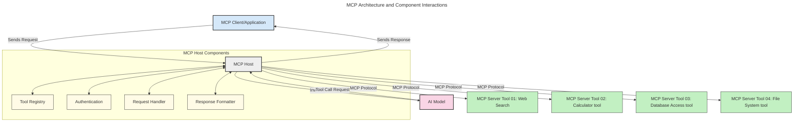
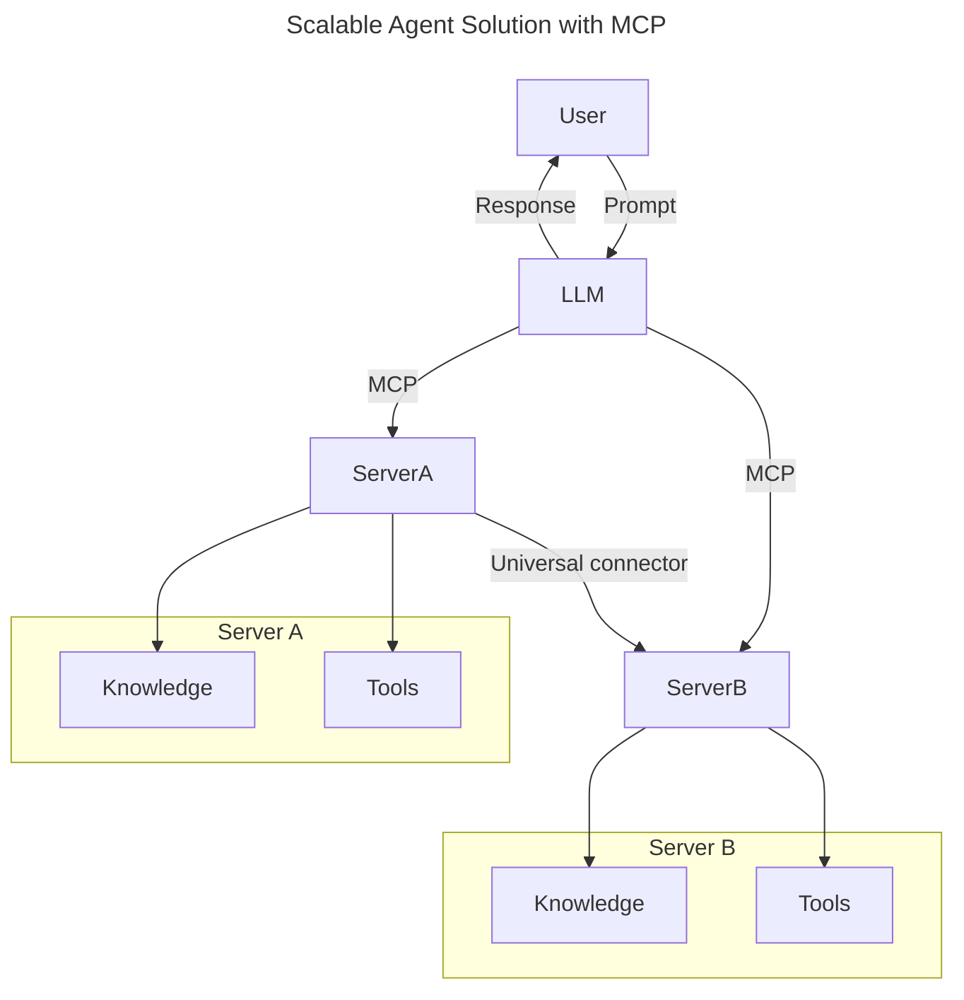
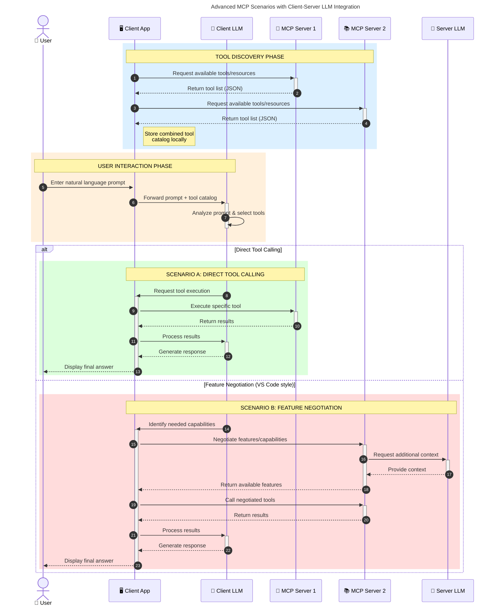

<!--
CO_OP_TRANSLATOR_METADATA:
{
  "original_hash": "9678e0c6945b8e0c23586869b0e26783",
  "translation_date": "2025-10-06T11:12:09+00:00",
  "source_file": "00-Introduction/README.md",
  "language_code": "hr"
}
-->
# Uvod u Model Context Protocol (MCP): Zašto je važan za skalabilne AI aplikacije

_(Kliknite na sliku iznad za video lekciju)_

Generativne AI aplikacije predstavljaju veliki korak naprijed jer često omogućuju korisnicima interakciju s aplikacijom putem prirodnog jezika. Međutim, kako se ulaže sve više vremena i resursa u takve aplikacije, važno je osigurati jednostavnu integraciju funkcionalnosti i resursa na način koji omogućuje lako proširenje, podršku za više modela i upravljanje različitim specifičnostima modela. Ukratko, izrada generativnih AI aplikacija je jednostavna na početku, ali kako rastu i postaju složenije, potrebno je definirati arhitekturu i osloniti se na standard kako bi aplikacije bile dosljedno izgrađene. Tu MCP dolazi u igru kako bi organizirao stvari i pružio standard.

---

## **🔍 Što je Model Context Protocol (MCP)?**

**Model Context Protocol (MCP)** je **otvoreno, standardizirano sučelje** koje omogućuje velikim jezičnim modelima (LLM-ovima) besprijekornu interakciju s vanjskim alatima, API-ima i izvorima podataka. MCP pruža dosljednu arhitekturu za proširenje funkcionalnosti AI modela izvan njihovih podataka za obuku, omogućujući pametnije, skalabilne i responzivne AI sustave.

---

## **🎯 Zašto je standardizacija u AI-u važna**

Kako generativne AI aplikacije postaju sve složenije, ključno je usvojiti standarde koji osiguravaju **skalabilnost, proširivost, održivost** i **izbjegavanje ovisnosti o jednom dobavljaču**. MCP odgovara na ove potrebe:

- Ujedinjuje integracije modela i alata
- Smanjuje krhka, jednokratna prilagođena rješenja
- Omogućuje koegzistenciju više modela različitih dobavljača unutar jednog ekosustava

**Napomena:** Iako MCP sebe predstavlja kao otvoreni standard, ne postoje planovi za standardizaciju MCP-a putem postojećih tijela za standardizaciju poput IEEE, IETF, W3C, ISO ili drugih.

---

## **📚 Ciljevi učenja**

Na kraju ovog članka moći ćete:

- Definirati **Model Context Protocol (MCP)** i njegove primjene
- Razumjeti kako MCP standardizira komunikaciju između modela i alata
- Identificirati ključne komponente MCP arhitekture
- Istražiti stvarne primjene MCP-a u poslovnim i razvojnim kontekstima

---

## **💡 Zašto je Model Context Protocol (MCP) revolucionaran**

### **🔗 MCP rješava fragmentaciju u AI interakcijama**

Prije MCP-a, integracija modela s alatima zahtijevala je:

- Prilagođeni kod za svaki par alat-model
- Nestandardizirane API-je za svakog dobavljača
- Česte prekide zbog ažuriranja
- Lošu skalabilnost s više alata

### **✅ Prednosti standardizacije MCP-a**

| **Prednost**              | **Opis**                                                                       |
|---------------------------|-------------------------------------------------------------------------------|
| Interoperabilnost         | LLM-ovi besprijekorno rade s alatima različitih dobavljača                   |
| Dosljednost               | Jednoliko ponašanje na različitim platformama i alatima                      |
| Ponovna upotreba          | Jednom izgrađeni alati mogu se koristiti u različitim projektima i sustavima |
| Ubrzani razvoj            | Smanjenje vremena razvoja korištenjem standardiziranih sučelja              |

---

## **🧱 Pregled arhitekture MCP-a na visokoj razini**

MCP slijedi **model klijent-poslužitelj**, gdje:

- **MCP domaćini** pokreću AI modele
- **MCP klijenti** iniciraju zahtjeve
- **MCP poslužitelji** pružaju kontekst, alate i mogućnosti

### **Ključne komponente:**

- **Resursi** – Statički ili dinamički podaci za modele  
- **Upiti** – Unaprijed definirani tijekovi rada za vođenu generaciju  
- **Alati** – Izvršne funkcije poput pretraživanja, izračuna  
- **Uzorci** – Agentičko ponašanje putem rekurzivnih interakcija

---

## Kako MCP poslužitelji rade

MCP poslužitelji funkcioniraju na sljedeći način:

- **Tijek zahtjeva**:
    1. Korisnik ili softver koji djeluje u njegovo ime inicira zahtjev.
    2. **MCP klijent** šalje zahtjev **MCP domaćinu**, koji upravlja runtimeom AI modela.
    3. **AI model** prima korisnički upit i može zatražiti pristup vanjskim alatima ili podacima putem jednog ili više poziva alata.
    4. **MCP domaćin**, a ne model izravno, komunicira s odgovarajućim **MCP poslužiteljima** koristeći standardizirani protokol.
- **Funkcionalnost MCP domaćina**:
    - **Registar alata**: Održava katalog dostupnih alata i njihovih mogućnosti.
    - **Autentifikacija**: Provjerava dozvole za pristup alatima.
    - **Obrađivač zahtjeva**: Procesira dolazne zahtjeve alata od modela.
    - **Formatiranje odgovora**: Strukturira izlaze alata u format koji model može razumjeti.
- **Izvršenje MCP poslužitelja**:
    - **MCP domaćin** usmjerava pozive alata na jedan ili više **MCP poslužitelja**, od kojih svaki izlaže specijalizirane funkcije (npr. pretraživanje, izračuni, upiti baze podataka).
    - **MCP poslužitelji** izvršavaju svoje operacije i vraćaju rezultate **MCP domaćinu** u dosljednom formatu.
    - **MCP domaćin** formatira i prosljeđuje ove rezultate **AI modelu**.
- **Dovršavanje odgovora**:
    - **AI model** uključuje izlaze alata u konačni odgovor.
    - **MCP domaćin** šalje ovaj odgovor natrag **MCP klijentu**, koji ga dostavlja krajnjem korisniku ili pozivnom softveru.

## 👨‍💻 Kako izgraditi MCP poslužitelj (s primjerima)

MCP poslužitelji omogućuju proširenje mogućnosti LLM-ova pružanjem podataka i funkcionalnosti.

Spremni za isprobavanje? Evo SDK-ova specifičnih za jezik i/ili stack s primjerima izrade jednostavnih MCP poslužitelja u različitim jezicima/stackovima:

- **Python SDK**: https://github.com/modelcontextprotocol/python-sdk

- **TypeScript SDK**: https://github.com/modelcontextprotocol/typescript-sdk

- **Java SDK**: https://github.com/modelcontextprotocol/java-sdk

- **C#/.NET SDK**: https://github.com/modelcontextprotocol/csharp-sdk

## 🌍 Stvarne primjene MCP-a

MCP omogućuje širok raspon aplikacija proširenjem AI mogućnosti:

| **Primjena**               | **Opis**                                                                       |
|----------------------------|-------------------------------------------------------------------------------|
| Integracija podataka u poduzeću | Povezivanje LLM-ova s bazama podataka, CRM-ovima ili internim alatima       |
| Agentički AI sustavi        | Omogućavanje autonomnih agenata s pristupom alatima i tijekovima odlučivanja |
| Multimodalne aplikacije     | Kombiniranje teksta, slike i zvuka unutar jedne AI aplikacije                |
| Integracija podataka u stvarnom vremenu | Uključivanje aktualnih podataka u AI interakcije za preciznije rezultate |

### 🧠 MCP = Univerzalni standard za AI interakcije

Model Context Protocol (MCP) djeluje kao univerzalni standard za AI interakcije, slično kao što je USB-C standardizirao fizičke veze za uređaje. U svijetu AI-a, MCP pruža dosljedno sučelje, omogućujući modelima (klijentima) besprijekornu integraciju s vanjskim alatima i pružateljima podataka (poslužiteljima). Time se eliminira potreba za raznolikim, prilagođenim protokolima za svaki API ili izvor podataka.

Pod MCP-om, alat kompatibilan s MCP-om (poznat kao MCP poslužitelj) slijedi jedinstveni standard. Ti poslužitelji mogu navesti alate ili radnje koje nude i izvršiti te radnje kada ih AI agent zatraži. Platforme AI agenata koje podržavaju MCP mogu otkriti dostupne alate od poslužitelja i pozvati ih putem ovog standardnog protokola.

### 💡 Olakšava pristup znanju

Osim što nudi alate, MCP također olakšava pristup znanju. Omogućuje aplikacijama da pruže kontekst velikim jezičnim modelima (LLM-ovima) povezivanjem s različitim izvorima podataka. Na primjer, MCP poslužitelj može predstavljati repozitorij dokumenata tvrtke, omogućujući agentima da po potrebi dohvaćaju relevantne informacije. Drugi poslužitelj može obavljati specifične radnje poput slanja e-pošte ili ažuriranja zapisa. Iz perspektive agenta, to su jednostavno alati koje može koristiti—neki alati vraćaju podatke (kontekst znanja), dok drugi obavljaju radnje. MCP učinkovito upravlja oboje.

Agent koji se povezuje s MCP poslužiteljem automatski uči dostupne mogućnosti poslužitelja i dostupne podatke putem standardnog formata. Ova standardizacija omogućuje dinamičnu dostupnost alata. Na primjer, dodavanje novog MCP poslužitelja u sustav agenta čini njegove funkcije odmah dostupnima bez potrebe za daljnjom prilagodbom uputa agenta.

Ova pojednostavljena integracija usklađena je s prikazanim tijekovima u sljedećem dijagramu, gdje poslužitelji pružaju alate i znanje, osiguravajući besprijekornu suradnju između sustava.

### 👉 Primjer: Skalabilno rješenje za agente

Univerzalni konektor omogućuje MCP poslužiteljima međusobnu komunikaciju i dijeljenje mogućnosti, omogućujući ServerA da delegira zadatke ServerB-u ili pristupi njegovim alatima i znanju. Time se federiraju alati i podaci između poslužitelja, podržavajući skalabilne i modularne arhitekture agenata. Budući da MCP standardizira izlaganje alata, agenti mogu dinamično otkrivati i usmjeravati zahtjeve između poslužitelja bez hardkodiranih integracija.

Federacija alata i znanja: Alati i podaci mogu se pristupiti između poslužitelja, omogućujući skalabilnije i modularnije agentičke arhitekture.

### 🔄 Napredni MCP scenariji s integracijom LLM-a na strani klijenta

Osim osnovne MCP arhitekture, postoje napredni scenariji gdje i klijent i poslužitelj sadrže LLM-ove, omogućujući sofisticiranije interakcije. U sljedećem dijagramu, **klijentska aplikacija** može biti IDE s brojnim MCP alatima dostupnim za korištenje od strane LLM-a:

## 🔐 Praktične prednosti MCP-a

Evo praktičnih prednosti korištenja MCP-a:

- **Svježina**: Modeli mogu pristupiti ažuriranim informacijama izvan svojih podataka za obuku
- **Proširenje mogućnosti**: Modeli mogu koristiti specijalizirane alate za zadatke za koje nisu obučeni
- **Smanjenje halucinacija**: Vanjski izvori podataka pružaju činjenično utemeljenje
- **Privatnost**: Osjetljivi podaci mogu ostati unutar sigurnih okruženja umjesto da se ugrađuju u upite

## 📌 Ključne točke

Sljedeće su ključne točke za korištenje MCP-a:

- **MCP** standardizira način na koji AI modeli komuniciraju s alatima i podacima
- Promiče **proširivost, dosljednost i interoperabilnost**
- MCP pomaže **smanjiti vrijeme razvoja, poboljšati pouzdanost i proširiti mogućnosti modela**
- Arhitektura klijent-poslužitelj **omogućuje fleksibilne, proširive AI aplikacije**

## 🧠 Vježba

Razmislite o AI aplikaciji koju želite izgraditi.

- Koji **vanjski alati ili podaci** bi mogli poboljšati njezine mogućnosti?
- Kako bi MCP mogao učiniti integraciju **jednostavnijom i pouzdanijom?**

## Dodatni resursi

- [MCP GitHub repozitorij](https://github.com/modelcontextprotocol)

## Što slijedi

Sljedeće: [Poglavlje 1: Osnovni koncepti](../01-CoreConcepts/README.md)

---

**Odricanje od odgovornosti**:  
Ovaj dokument je preveden pomoću AI usluge za prevođenje [Co-op Translator](https://github.com/Azure/co-op-translator). Iako nastojimo osigurati točnost, imajte na umu da automatski prijevodi mogu sadržavati pogreške ili netočnosti. Izvorni dokument na izvornom jeziku treba smatrati autoritativnim izvorom. Za ključne informacije preporučuje se profesionalni prijevod od strane čovjeka. Ne preuzimamo odgovornost za nesporazume ili pogrešna tumačenja koja mogu proizaći iz korištenja ovog prijevoda.