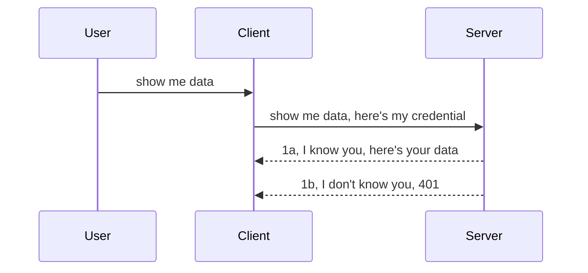

<!--
CO_OP_TRANSLATOR_METADATA:
{
  "original_hash": "5b00b8a8971a07d2d8803be4c9f138f8",
  "translation_date": "2025-10-07T01:06:38+00:00",
  "source_file": "03-GettingStarted/11-simple-auth/README.md",
  "language_code": "hr"
}
-->
# Jednostavna autentifikacija

MCP SDK-ovi podržavaju korištenje OAuth 2.1, što je prilično složen proces koji uključuje koncepte poput auth servera, resource servera, slanja vjerodajnica, dobivanja koda, zamjene koda za bearer token, sve dok konačno ne dobijete podatke o resursima. Ako niste upoznati s OAuth-om, koji je sjajan za implementaciju, dobra je ideja započeti s osnovnom razinom autentifikacije i postupno graditi prema sve boljoj sigurnosti. Zato ovaj poglavlje postoji – da vas vodi prema naprednijoj autentifikaciji.

## Autentifikacija, što pod time mislimo?

Autentifikacija je skraćenica za provjeru identiteta i autorizaciju. Ideja je da trebamo učiniti dvije stvari:

- **Provjera identiteta**, proces kojim utvrđujemo hoćemo li nekome dopustiti ulazak u našu "kuću", odnosno imaju li pravo biti "ovdje", tj. pristupiti našem resource serveru gdje se nalaze značajke MCP Servera.
- **Autorizacija**, proces kojim utvrđujemo treba li korisnik imati pristup specifičnim resursima koje traži, primjerice određenim narudžbama ili proizvodima, ili je dopušteno samo čitanje sadržaja, ali ne i brisanje, kao drugi primjer.

## Vjerodajnice: kako sustavu kažemo tko smo

Većina web programera razmišlja o pružanju vjerodajnica serveru, obično tajne koja pokazuje imaju li pravo biti ovdje ("provjera identiteta"). Ova vjerodajnica obično je base64 kodirana verzija korisničkog imena i lozinke ili API ključ koji jedinstveno identificira određenog korisnika.

To uključuje slanje putem zaglavlja nazvanog "Authorization", ovako:

```json
{ "Authorization": "secret123" }
```

Ovo se obično naziva osnovnom autentifikacijom. Kako cjelokupni proces funkcionira može se opisati na sljedeći način:



Sada kada razumijemo kako to funkcionira s aspekta toka, kako to implementirati? Većina web servera ima koncept nazvan middleware, dio koda koji se izvršava kao dio zahtjeva i može provjeriti vjerodajnice. Ako su vjerodajnice valjane, zahtjev se propušta dalje. Ako zahtjev nema valjane vjerodajnice, dobivate grešku autentifikacije. Pogledajmo kako se to može implementirati:

**Python**

```python
class AuthMiddleware(BaseHTTPMiddleware):
    async def dispatch(self, request, call_next):

        has_header = request.headers.get("Authorization")
        if not has_header:
            print("-> Missing Authorization header!")
            return Response(status_code=401, content="Unauthorized")

        if not valid_token(has_header):
            print("-> Invalid token!")
            return Response(status_code=403, content="Forbidden")

        print("Valid token, proceeding...")
       
        response = await call_next(request)
        # add any customer headers or change in the response in some way
        return response


starlette_app.add_middleware(CustomHeaderMiddleware)
```

Ovdje smo:

- Kreirali middleware nazvan `AuthMiddleware` čija se metoda `dispatch` poziva od strane web servera.
- Dodali middleware na web server:

    ```python
    starlette_app.add_middleware(AuthMiddleware)
    ```

- Napisali logiku validacije koja provjerava je li zaglavlje Authorization prisutno i je li poslana tajna valjana:

    ```python
    has_header = request.headers.get("Authorization")
    if not has_header:
        print("-> Missing Authorization header!")
        return Response(status_code=401, content="Unauthorized")

    if not valid_token(has_header):
        print("-> Invalid token!")
        return Response(status_code=403, content="Forbidden")
    ```

    Ako je tajna prisutna i valjana, dopuštamo zahtjevu da prođe pozivom `call_next` i vraćamo odgovor.

    ```python
    response = await call_next(request)
    # add any customer headers or change in the response in some way
    return response
    ```

Kako to funkcionira: ako se web zahtjev pošalje prema serveru, middleware će se pozvati i, s obzirom na njegovu implementaciju, ili će dopustiti zahtjevu da prođe ili će vratiti grešku koja ukazuje da klijent nema dopuštenje za nastavak.

**TypeScript**

Ovdje kreiramo middleware koristeći popularni framework Express i presrećemo zahtjev prije nego što stigne do MCP Servera. Evo koda za to:

```typescript
function isValid(secret) {
    return secret === "secret123";
}

app.use((req, res, next) => {
    // 1. Authorization header present?  
    if(!req.headers["Authorization"]) {
        res.status(401).send('Unauthorized');
    }
    
    let token = req.headers["Authorization"];

    // 2. Check validity.
    if(!isValid(token)) {
        res.status(403).send('Forbidden');
    }

   
    console.log('Middleware executed');
    // 3. Passes request to the next step in the request pipeline.
    next();
});
```

U ovom kodu:

1. Provjeravamo je li zaglavlje Authorization uopće prisutno; ako nije, šaljemo grešku 401.
2. Provjeravamo je li vjerodajnica/token valjan; ako nije, šaljemo grešku 403.
3. Na kraju prosljeđujemo zahtjev u pipeline zahtjeva i vraćamo traženi resurs.

## Vježba: Implementacija autentifikacije

Iskoristimo naše znanje i pokušajmo implementirati autentifikaciju. Evo plana:

Server

- Kreirajte web server i MCP instancu.
- Implementirajte middleware za server.

Klijent 

- Pošaljite web zahtjev s vjerodajnicom putem zaglavlja.

### -1- Kreirajte web server i MCP instancu

U prvom koraku trebamo kreirati instancu web servera i MCP Servera.

**Python**

Ovdje kreiramo MCP server instancu, starlette web aplikaciju i hostiramo je pomoću uvicorn-a.

```python
# creating MCP Server

app = FastMCP(
    name="MCP Resource Server",
    instructions="Resource Server that validates tokens via Authorization Server introspection",
    host=settings["host"],
    port=settings["port"],
    debug=True
)

# creating starlette web app
starlette_app = app.streamable_http_app()

# serving app via uvicorn
async def run(starlette_app):
    import uvicorn
    config = uvicorn.Config(
            starlette_app,
            host=app.settings.host,
            port=app.settings.port,
            log_level=app.settings.log_level.lower(),
        )
    server = uvicorn.Server(config)
    await server.serve()

run(starlette_app)
```

U ovom kodu:

- Kreiramo MCP Server.
- Konstruiramo starlette web aplikaciju iz MCP Servera, `app.streamable_http_app()`.
- Hostiramo i pokrećemo web aplikaciju koristeći uvicorn `server.serve()`.

**TypeScript**

Ovdje kreiramo MCP Server instancu.

```typescript
const server = new McpServer({
      name: "example-server",
      version: "1.0.0"
    });

    // ... set up server resources, tools, and prompts ...
```

Ova kreacija MCP Servera mora se dogoditi unutar naše definicije rute POST /mcp, pa premjestimo gornji kod ovako:

```typescript
import express from "express";
import { randomUUID } from "node:crypto";
import { McpServer } from "@modelcontextprotocol/sdk/server/mcp.js";
import { StreamableHTTPServerTransport } from "@modelcontextprotocol/sdk/server/streamableHttp.js";
import { isInitializeRequest } from "@modelcontextprotocol/sdk/types.js"

const app = express();
app.use(express.json());

// Map to store transports by session ID
const transports: { [sessionId: string]: StreamableHTTPServerTransport } = {};

// Handle POST requests for client-to-server communication
app.post('/mcp', async (req, res) => {
  // Check for existing session ID
  const sessionId = req.headers['mcp-session-id'] as string | undefined;
  let transport: StreamableHTTPServerTransport;

  if (sessionId && transports[sessionId]) {
    // Reuse existing transport
    transport = transports[sessionId];
  } else if (!sessionId && isInitializeRequest(req.body)) {
    // New initialization request
    transport = new StreamableHTTPServerTransport({
      sessionIdGenerator: () => randomUUID(),
      onsessioninitialized: (sessionId) => {
        // Store the transport by session ID
        transports[sessionId] = transport;
      },
      // DNS rebinding protection is disabled by default for backwards compatibility. If you are running this server
      // locally, make sure to set:
      // enableDnsRebindingProtection: true,
      // allowedHosts: ['127.0.0.1'],
    });

    // Clean up transport when closed
    transport.onclose = () => {
      if (transport.sessionId) {
        delete transports[transport.sessionId];
      }
    };
    const server = new McpServer({
      name: "example-server",
      version: "1.0.0"
    });

    // ... set up server resources, tools, and prompts ...

    // Connect to the MCP server
    await server.connect(transport);
  } else {
    // Invalid request
    res.status(400).json({
      jsonrpc: '2.0',
      error: {
        code: -32000,
        message: 'Bad Request: No valid session ID provided',
      },
      id: null,
    });
    return;
  }

  // Handle the request
  await transport.handleRequest(req, res, req.body);
});

// Reusable handler for GET and DELETE requests
const handleSessionRequest = async (req: express.Request, res: express.Response) => {
  const sessionId = req.headers['mcp-session-id'] as string | undefined;
  if (!sessionId || !transports[sessionId]) {
    res.status(400).send('Invalid or missing session ID');
    return;
  }
  
  const transport = transports[sessionId];
  await transport.handleRequest(req, res);
};

// Handle GET requests for server-to-client notifications via SSE
app.get('/mcp', handleSessionRequest);

// Handle DELETE requests for session termination
app.delete('/mcp', handleSessionRequest);

app.listen(3000);
```

Sada vidite kako je kreacija MCP Servera premještena unutar `app.post("/mcp")`.

Prijeđimo na sljedeći korak kreiranja middlewarea kako bismo mogli validirati dolazne vjerodajnice.

### -2- Implementirajte middleware za server

Prijeđimo na dio s middlewareom. Ovdje ćemo kreirati middleware koji traži vjerodajnicu u zaglavlju `Authorization` i validira je. Ako je prihvatljiva, zahtjev će nastaviti raditi ono što treba (npr. popis alata, čitanje resursa ili bilo koju MCP funkcionalnost koju klijent traži).

**Python**

Za kreiranje middlewarea trebamo kreirati klasu koja nasljeđuje `BaseHTTPMiddleware`. Dva zanimljiva dijela su:

- Zahtjev `request`, iz kojeg čitamo informacije o zaglavljima.
- `call_next`, povratni poziv koji trebamo pozvati ako klijent donese vjerodajnicu koju prihvaćamo.

Prvo, trebamo obraditi slučaj kada zaglavlje `Authorization` nedostaje:

```python
has_header = request.headers.get("Authorization")

# no header present, fail with 401, otherwise move on.
if not has_header:
    print("-> Missing Authorization header!")
    return Response(status_code=401, content="Unauthorized")
```

Ovdje šaljemo poruku 401 Unauthorized jer klijent ne prolazi autentifikaciju.

Zatim, ako je vjerodajnica poslana, trebamo provjeriti njezinu valjanost ovako:

```python
 if not valid_token(has_header):
    print("-> Invalid token!")
    return Response(status_code=403, content="Forbidden")
```

Primijetite kako gore šaljemo poruku 403 Forbidden. Pogledajmo cijeli middleware koji implementira sve što smo gore spomenuli:

```python
class AuthMiddleware(BaseHTTPMiddleware):
    async def dispatch(self, request, call_next):

        has_header = request.headers.get("Authorization")
        if not has_header:
            print("-> Missing Authorization header!")
            return Response(status_code=401, content="Unauthorized")

        if not valid_token(has_header):
            print("-> Invalid token!")
            return Response(status_code=403, content="Forbidden")

        print("Valid token, proceeding...")
        print(f"-> Received {request.method} {request.url}")
        response = await call_next(request)
        response.headers['Custom'] = 'Example'
        return response

```

Odlično, ali što je s funkcijom `valid_token`? Evo je dolje:

```python
# DON'T use for production - improve it !!
def valid_token(token: str) -> bool:
    # remove the "Bearer " prefix
    if token.startswith("Bearer "):
        token = token[7:]
        return token == "secret-token"
    return False
```

Ovo bi se očito trebalo poboljšati.

VAŽNO: Nikada ne biste trebali imati tajne poput ove u kodu. Idealno bi bilo da vrijednost za usporedbu dohvatite iz izvora podataka ili IDP-a (identity service provider) ili, još bolje, da IDP obavi validaciju.

**TypeScript**

Za implementaciju s Expressom trebamo pozvati metodu `use` koja prihvaća funkcije middlewarea.

Trebamo:

- Interagirati s varijablom zahtjeva kako bismo provjerili proslijeđenu vjerodajnicu u svojstvu `Authorization`.
- Validirati vjerodajnicu, i ako je valjana, dopustiti zahtjevu da nastavi i da MCP zahtjev klijenta obavi ono što treba (npr. popis alata, čitanje resursa ili bilo što MCP povezano).

Ovdje provjeravamo je li zaglavlje `Authorization` prisutno, a ako nije, zaustavljamo zahtjev:

```typescript
if(!req.headers["authorization"]) {
    res.status(401).send('Unauthorized');
    return;
}
```

Ako zaglavlje nije poslano, dobit ćete grešku 401.

Zatim provjeravamo je li vjerodajnica valjana; ako nije, ponovno zaustavljamo zahtjev, ali s malo drugačijom porukom:

```typescript
if(!isValid(token)) {
    res.status(403).send('Forbidden');
    return;
} 
```

Primijetite kako sada dobivate grešku 403.

Evo cijelog koda:

```typescript
app.use((req, res, next) => {
    console.log('Request received:', req.method, req.url, req.headers);
    console.log('Headers:', req.headers["authorization"]);
    if(!req.headers["authorization"]) {
        res.status(401).send('Unauthorized');
        return;
    }
    
    let token = req.headers["authorization"];

    if(!isValid(token)) {
        res.status(403).send('Forbidden');
        return;
    }  

    console.log('Middleware executed');
    next();
});
```

Postavili smo web server da prihvati middleware za provjeru vjerodajnice koju klijent, nadamo se, šalje. Što je s klijentom?

### -3- Pošaljite web zahtjev s vjerodajnicom putem zaglavlja

Moramo osigurati da klijent prosljeđuje vjerodajnicu putem zaglavlja. Kako ćemo koristiti MCP klijent za to, trebamo shvatiti kako se to radi.

**Python**

Za klijenta trebamo proslijediti zaglavlje s našom vjerodajnicom ovako:

```python
# DON'T hardcode the value, have it at minimum in an environment variable or a more secure storage
token = "secret-token"

async with streamablehttp_client(
        url = f"http://localhost:{port}/mcp",
        headers = {"Authorization": f"Bearer {token}"}
    ) as (
        read_stream,
        write_stream,
        session_callback,
    ):
        async with ClientSession(
            read_stream,
            write_stream
        ) as session:
            await session.initialize()
      
            # TODO, what you want done in the client, e.g list tools, call tools etc.
```

Primijetite kako popunjavamo svojstvo `headers` ovako: `headers = {"Authorization": f"Bearer {token}"}`.

**TypeScript**

Ovo možemo riješiti u dva koraka:

1. Popuniti konfiguracijski objekt s našom vjerodajnicom.
2. Proslijediti konfiguracijski objekt transportu.

```typescript

// DON'T hardcode the value like shown here. At minimum have it as a env variable and use something like dotenv (in dev mode).
let token = "secret123"

// define a client transport option object
let options: StreamableHTTPClientTransportOptions = {
  sessionId: sessionId,
  requestInit: {
    headers: {
      "Authorization": "secret123"
    }
  }
};

// pass the options object to the transport
async function main() {
   const transport = new StreamableHTTPClientTransport(
      new URL(serverUrl),
      options
   );
```

Ovdje vidite kako smo morali kreirati objekt `options` i postaviti naše zaglavlje pod svojstvo `requestInit`.

VAŽNO: Kako to poboljšati odavde? Pa, trenutna implementacija ima nekoliko problema. Prvo, prosljeđivanje vjerodajnice na ovaj način prilično je rizično osim ako barem nemate HTTPS. Čak i tada, vjerodajnica može biti ukradena, pa trebate sustav u kojem možete lako opozvati token i dodati dodatne provjere, poput toga odakle dolazi zahtjev, događa li se prečesto (ponašanje poput bota) i slično. Ukratko, postoji cijeli niz zabrinutosti.

Treba reći, međutim, da je za vrlo jednostavne API-je gdje ne želite da itko poziva vaš API bez autentifikacije ono što imamo ovdje dobar početak.

S tim rečenim, pokušajmo malo pojačati sigurnost korištenjem standardiziranog formata poput JSON Web Tokena, poznatog kao JWT ili "JOT" tokeni.

## JSON Web Tokeni, JWT

Dakle, pokušavamo poboljšati stvari od slanja vrlo jednostavnih vjerodajnica. Koja su neposredna poboljšanja koja dobivamo usvajanjem JWT-a?

- **Poboljšanja sigurnosti**. Kod osnovne autentifikacije, korisničko ime i lozinka šalju se kao base64 kodirani token (ili se šalje API ključ) iznova i iznova, što povećava rizik. S JWT-om, šaljete korisničko ime i lozinku i dobivate token zauzvrat, koji je također vremenski ograničen, što znači da će isteći. JWT omogućuje jednostavno korištenje precizne kontrole pristupa koristeći uloge, opsege i dozvole.
- **Bezdržavnost i skalabilnost**. JWT-ovi su samostalni, nose sve informacije o korisniku i eliminiraju potrebu za pohranom sesija na strani servera. Token se također može lokalno validirati.
- **Interoperabilnost i federacija**. JWT-ovi su središnji dio Open ID Connecta i koriste se s poznatim pružateljima identiteta poput Entra ID-a, Google Identity-a i Auth0-a. Također omogućuju korištenje jedinstvene prijave i još mnogo toga, čineći ih pogodnim za poslovne sustave.
- **Modularnost i fleksibilnost**. JWT-ovi se također mogu koristiti s API Gatewayima poput Azure API Managementa, NGINX-a i drugih. Podržavaju scenarije autentifikacije i komunikaciju servera sa serverom, uključujući scenarije impersonacije i delegacije.
- **Performanse i keširanje**. JWT-ovi se mogu keširati nakon dekodiranja, što smanjuje potrebu za parsiranjem. Ovo posebno pomaže kod aplikacija s velikim prometom jer poboljšava propusnost i smanjuje opterećenje na vašoj infrastrukturi.
- **Napredne značajke**. Također podržavaju introspekciju (provjeru valjanosti na serveru) i opoziv (onemogućavanje tokena).

S obzirom na sve ove prednosti, pogledajmo kako možemo podići našu implementaciju na višu razinu.

## Pretvaranje osnovne autentifikacije u JWT

Dakle, promjene koje trebamo napraviti na visokoj razini su:

- **Naučiti konstruirati JWT token** i pripremiti ga za slanje od klijenta prema serveru.
- **Validirati JWT token**, i ako je valjan, omogućiti klijentu pristup našim resursima.
- **Sigurna pohrana tokena**. Kako pohraniti ovaj token.
- **Zaštita ruta**. Trebamo zaštititi rute, u našem slučaju, trebamo zaštititi rute i specifične MCP značajke.
- **Dodavanje refresh tokena**. Osigurati da kreiramo token koji je kratkotrajan, ali refresh token koji je dugotrajan i može se koristiti za dobivanje novih tokena ako isteknu. Također osigurati da postoji endpoint za osvježavanje i strategija rotacije.

### -1- Konstruiranje JWT tokena

Prvo, JWT token ima sljedeće dijelove:

- **zaglavlje**, algoritam koji se koristi i tip tokena.
- **payload**, tvrdnje, poput sub (korisnik ili entitet kojeg token predstavlja. U scenariju autentifikacije ovo je obično korisnički ID), exp (kada istječe), role (uloga).
- **potpis**, potpisan tajnom ili privatnim ključem.

Za ovo ćemo trebati konstruirati zaglavlje, payload i kodirani token.

**Python**

```python

import jwt
import jwt
from jwt.exceptions import ExpiredSignatureError, InvalidTokenError
import datetime

# Secret key used to sign the JWT
secret_key = 'your-secret-key'

header = {
    "alg": "HS256",
    "typ": "JWT"
}

# the user info andits claims and expiry time
payload = {
    "sub": "1234567890",               # Subject (user ID)
    "name": "User Userson",                # Custom claim
    "admin": True,                     # Custom claim
    "iat": datetime.datetime.utcnow(),# Issued at
    "exp": datetime.datetime.utcnow() + datetime.timedelta(hours=1)  # Expiry
}

# encode it
encoded_jwt = jwt.encode(payload, secret_key, algorithm="HS256", headers=header)
```

U gornjem kodu smo:

- Definirali zaglavlje koristeći HS256 kao algoritam i tip postavili na JWT.
- Konstruirali payload koji sadrži subjekt ili korisnički ID, korisničko ime, ulogu, kada je izdan i kada istječe, čime implementiramo vremenski ograničen aspekt koji smo ranije spomenuli.

**TypeScript**

Ovdje ćemo trebati neke ovisnosti koje će nam pomoći u konstruiranju JWT tokena.

Ovisnosti

```sh

npm install jsonwebtoken
npm install --save-dev @types/jsonwebtoken
```

Sada kada to imamo, kreirajmo zaglavlje, payload i kroz to kreirajmo kodirani token.

```typescript
import jwt from 'jsonwebtoken';

const secretKey = 'your-secret-key'; // Use env vars in production

// Define the payload
const payload = {
  sub: '1234567890',
  name: 'User usersson',
  admin: true,
  iat: Math.floor(Date.now() / 1000), // Issued at
  exp: Math.floor(Date.now() / 1000) + 60 * 60 // Expires in 1 hour
};

// Define the header (optional, jsonwebtoken sets defaults)
const header = {
  alg: 'HS256',
  typ: 'JWT'
};

// Create the token
const token = jwt.sign(payload, secretKey, {
  algorithm: 'HS256',
  header: header
});

console.log('JWT:', token);
```

Ovaj token je:

Potpisan koristeći HS256
Valjan 1 sat
Sadrži tvrdnje poput sub, name, admin, iat i exp.

### -2- Validacija tokena

Također ćemo trebati validirati token, što bismo trebali učiniti na serveru kako bismo osigurali da ono što klijent šalje zaista jest valjano. Postoji mnogo provjera koje bismo trebali napraviti, od validacije strukture do valjanosti. Također se preporučuje dodavanje drugih provjera kako biste vidjeli je li korisnik u vašem sustavu i više.

Za validaciju tokena trebamo ga dekodirati kako bismo ga mogli pročitati i zatim početi provjeravati njegovu valjanost:

**Python**

```python

# Decode and verify the JWT
try:
    decoded = jwt.decode(token, secret_key, algorithms=["HS256"])
    print("✅ Token is valid.")
    print("Decoded claims:")
    for key, value in decoded.items():
        print(f"  {key}: {value}")
except ExpiredSignatureError:
    print("❌ Token has expired.")
except InvalidTokenError as e:
    print(f"❌ Invalid token: {e}")

```

U ovom kodu pozivamo `jwt.decode` koristeći token, tajni ključ i odabrani algoritam kao ulaz. Primijetite kako koristimo try-catch konstrukciju jer neuspjela validacija dovodi do podizanja greške.

**TypeScript**

Ovdje trebamo pozvati `jwt.verify` kako bismo dobili dekodiranu verziju tokena koju možemo dalje analizirati. Ako ovaj poziv ne uspije, to znači da je struktura tokena neispravna ili više nije valjan.

```typescript

try {
  const decoded = jwt.verify(token, secretKey);
  console.log('Decoded Payload:', decoded);
} catch (err) {
  console.error('Token verification failed:', err);
}
```

NAPOMENA: Kao što je ranije spomenuto, trebali bismo provesti dodatne provjere kako bismo osigurali da ovaj token ukazuje na korisnika u našem sustavu i osigurali da korisnik ima prava koja tvrdi da ima.
Sljedeće, pogledajmo kontrolu pristupa temeljenu na ulogama, poznatu kao RBAC.

## Dodavanje kontrole pristupa temeljene na ulogama

Ideja je da želimo izraziti da različite uloge imaju različite dozvole. Na primjer, pretpostavljamo da administrator može raditi sve, da obični korisnici mogu čitati/pisati, a da gost može samo čitati. Stoga, evo nekih mogućih razina dozvola:

- Admin.Write 
- User.Read
- Guest.Read

Pogledajmo kako možemo implementirati takvu kontrolu pomoću middlewarea. Middlewarei se mogu dodati po ruti, kao i za sve rute.

**Python**

```python
from starlette.middleware.base import BaseHTTPMiddleware
from starlette.responses import JSONResponse
import jwt

# DON'T have the secret in the code like, this is for demonstration purposes only. Read it from a safe place.
SECRET_KEY = "your-secret-key" # put this in env variable
REQUIRED_PERMISSION = "User.Read"

class JWTPermissionMiddleware(BaseHTTPMiddleware):
    async def dispatch(self, request, call_next):
        auth_header = request.headers.get("Authorization")
        if not auth_header or not auth_header.startswith("Bearer "):
            return JSONResponse({"error": "Missing or invalid Authorization header"}, status_code=401)

        token = auth_header.split(" ")[1]
        try:
            decoded = jwt.decode(token, SECRET_KEY, algorithms=["HS256"])
        except jwt.ExpiredSignatureError:
            return JSONResponse({"error": "Token expired"}, status_code=401)
        except jwt.InvalidTokenError:
            return JSONResponse({"error": "Invalid token"}, status_code=401)

        permissions = decoded.get("permissions", [])
        if REQUIRED_PERMISSION not in permissions:
            return JSONResponse({"error": "Permission denied"}, status_code=403)

        request.state.user = decoded
        return await call_next(request)


```

Postoji nekoliko različitih načina za dodavanje middlewarea, kao što je prikazano dolje:

```python

# Alt 1: add middleware while constructing starlette app
middleware = [
    Middleware(JWTPermissionMiddleware)
]

app = Starlette(routes=routes, middleware=middleware)

# Alt 2: add middleware after starlette app is a already constructed
starlette_app.add_middleware(JWTPermissionMiddleware)

# Alt 3: add middleware per route
routes = [
    Route(
        "/mcp",
        endpoint=..., # handler
        middleware=[Middleware(JWTPermissionMiddleware)]
    )
]
```

**TypeScript**

Možemo koristiti `app.use` i middleware koji će se pokrenuti za sve zahtjeve.

```typescript
app.use((req, res, next) => {
    console.log('Request received:', req.method, req.url, req.headers);
    console.log('Headers:', req.headers["authorization"]);

    // 1. Check if authorization header has been sent

    if(!req.headers["authorization"]) {
        res.status(401).send('Unauthorized');
        return;
    }
    
    let token = req.headers["authorization"];

    // 2. Check if token is valid
    if(!isValid(token)) {
        res.status(403).send('Forbidden');
        return;
    }  

    // 3. Check if token user exist in our system
    if(!isExistingUser(token)) {
        res.status(403).send('Forbidden');
        console.log("User does not exist");
        return;
    }
    console.log("User exists");

    // 4. Verify the token has the right permissions
    if(!hasScopes(token, ["User.Read"])){
        res.status(403).send('Forbidden - insufficient scopes');
    }

    console.log("User has required scopes");

    console.log('Middleware executed');
    next();
});

```

Postoji nekoliko stvari koje možemo omogućiti našem middlewareu i koje bi naš middleware TREBAO raditi, naime:

1. Provjeriti je li prisutan zaglavlje za autorizaciju
2. Provjeriti je li token valjan, pozivamo `isValid`, što je metoda koju smo napisali za provjeru integriteta i valjanosti JWT tokena.
3. Provjeriti postoji li korisnik u našem sustavu, to bismo trebali provjeriti.

   ```typescript
    // users in DB
   const users = [
     "user1",
     "User usersson",
   ]

   function isExistingUser(token) {
     let decodedToken = verifyToken(token);

     // TODO, check if user exists in DB
     return users.includes(decodedToken?.name || "");
   }
   ```

   Gore smo kreirali vrlo jednostavan popis `users`, koji bi očito trebao biti u bazi podataka.

4. Dodatno, trebali bismo također provjeriti ima li token odgovarajuće dozvole.

   ```typescript
   if(!hasScopes(token, ["User.Read"])){
        res.status(403).send('Forbidden - insufficient scopes');
   }
   ```

   U gornjem kodu iz middlewarea provjeravamo sadrži li token dozvolu User.Read, ako ne, šaljemo 403 grešku. Dolje je pomoćna metoda `hasScopes`.

   ```typescript
   function hasScopes(scope: string, requiredScopes: string[]) {
     let decodedToken = verifyToken(scope);
    return requiredScopes.every(scope => decodedToken?.scopes.includes(scope));
  }
   ```

Have a think which additional checks you should be doing, but these are the absolute minimum of checks you should be doing.

Using Express as a web framework is a common choice. There are helpers library when you use JWT so you can write less code.

- `express-jwt`, helper library that provides a middleware that helps decode your token.
- `express-jwt-permissions`, this provides a middleware `guard` that helps check if a certain permission is on the token.

Here's what these libraries can look like when used:

```typescript
const express = require('express');
const jwt = require('express-jwt');
const guard = require('express-jwt-permissions')();

const app = express();
const secretKey = 'your-secret-key'; // put this in env variable

// Decode JWT and attach to req.user
app.use(jwt({ secret: secretKey, algorithms: ['HS256'] }));

// Check for User.Read permission
app.use(guard.check('User.Read'));

// multiple permissions
// app.use(guard.check(['User.Read', 'Admin.Access']));

app.get('/protected', (req, res) => {
  res.json({ message: `Welcome ${req.user.name}` });
});

// Error handler
app.use((err, req, res, next) => {
  if (err.code === 'permission_denied') {
    return res.status(403).send('Forbidden');
  }
  next(err);
});

```

Sada ste vidjeli kako se middleware može koristiti za autentifikaciju i autorizaciju, ali što je s MCP-om, mijenja li to način na koji radimo autentifikaciju? Saznajmo u sljedećem odjeljku.

### -3- Dodavanje RBAC-a u MCP

Do sada ste vidjeli kako možete dodati RBAC putem middlewarea, međutim, za MCP ne postoji jednostavan način za dodavanje RBAC-a po MCP značajci, pa što radimo? Pa, jednostavno moramo dodati kod poput ovog koji provjerava ima li klijent prava za pozivanje određenog alata:

Imate nekoliko različitih izbora kako postići RBAC po značajci, evo nekih:

- Dodajte provjeru za svaki alat, resurs, prompt gdje trebate provjeriti razinu dozvole.

   **Python**

   ```python
   @tool()
   def delete_product(id: int):
      try:
          check_permissions(role="Admin.Write", request)
      catch:
        pass # client failed authorization, raise authorization error
   ```

   **TypeScript**

   ```typescript
   server.registerTool(
    "delete-product",
    {
      title: Delete a product",
      description: "Deletes a product",
      inputSchema: { id: z.number() }
    },
    async ({ id }) => {
      
      try {
        checkPermissions("Admin.Write", request);
        // todo, send id to productService and remote entry
      } catch(Exception e) {
        console.log("Authorization error, you're not allowed");  
      }

      return {
        content: [{ type: "text", text: `Deletected product with id ${id}` }]
      };
    }
   );
   ```


- Koristite napredni pristup serveru i rukovatelje zahtjeva kako biste minimizirali broj mjesta na kojima trebate izvršiti provjeru.

   **Python**

   ```python
   
   tool_permission = {
      "create_product": ["User.Write", "Admin.Write"],
      "delete_product": ["Admin.Write"]
   }

   def has_permission(user_permissions, required_permissions) -> bool:
      # user_permissions: list of permissions the user has
      # required_permissions: list of permissions required for the tool
      return any(perm in user_permissions for perm in required_permissions)

   @server.call_tool()
   async def handle_call_tool(
     name: str, arguments: dict[str, str] | None
   ) -> list[types.TextContent]:
    # Assume request.user.permissions is a list of permissions for the user
     user_permissions = request.user.permissions
     required_permissions = tool_permission.get(name, [])
     if not has_permission(user_permissions, required_permissions):
        # Raise error "You don't have permission to call tool {name}"
        raise Exception(f"You don't have permission to call tool {name}")
     # carry on and call tool
     # ...
   ```   
   

   **TypeScript**

   ```typescript
   function hasPermission(userPermissions: string[], requiredPermissions: string[]): boolean {
       if (!Array.isArray(userPermissions) || !Array.isArray(requiredPermissions)) return false;
       // Return true if user has at least one required permission
       
       return requiredPermissions.some(perm => userPermissions.includes(perm));
   }
  
   server.setRequestHandler(CallToolRequestSchema, async (request) => {
      const { params: { name } } = request;
  
      let permissions = request.user.permissions;
  
      if (!hasPermission(permissions, toolPermissions[name])) {
         return new Error(`You don't have permission to call ${name}`);
      }
  
      // carry on..
   });
   ```

   Napomena, trebate osigurati da vaš middleware dodjeljuje dekodirani token svojstvu korisnika zahtjeva kako bi gornji kod bio jednostavan.

### Zaključak

Sada kada smo raspravili kako dodati podršku za RBAC općenito i za MCP posebno, vrijeme je da pokušate implementirati sigurnost sami kako biste osigurali da ste razumjeli predstavljene koncepte.

## Zadatak 1: Izgradite MCP server i MCP klijent koristeći osnovnu autentifikaciju

Ovdje ćete primijeniti ono što ste naučili u smislu slanja vjerodajnica kroz zaglavlja.

## Rješenje 1

[Rješenje 1](./code/basic/README.md)

## Zadatak 2: Nadogradite rješenje iz Zadatka 1 na korištenje JWT-a

Uzmite prvo rješenje, ali ovaj put ga poboljšajmo.

Umjesto osnovne autentifikacije, koristimo JWT.

## Rješenje 2

[Rješenje 2](./solution/jwt-solution/README.md)

## Izazov

Dodajte RBAC po alatu kako je opisano u odjeljku "Dodavanje RBAC-a u MCP".

## Sažetak

Nadamo se da ste puno naučili u ovom poglavlju, od potpune odsutnosti sigurnosti, do osnovne sigurnosti, do JWT-a i kako se može dodati u MCP.

Izgradili smo solidnu osnovu s prilagođenim JWT-ovima, ali kako se skaliramo, prelazimo na model identiteta temeljen na standardima. Usvajanje IdP-a poput Entre ili Keycloaka omogućuje nam da izdavanje tokena, validaciju i upravljanje životnim ciklusom prepustimo pouzdanoj platformi — oslobađajući nas da se fokusiramo na logiku aplikacije i korisničko iskustvo.

Za to imamo [naprednije poglavlje o Enti](../../05-AdvancedTopics/mcp-security-entra/README.md)

---

**Izjava o odricanju odgovornosti**:  
Ovaj dokument je preveden pomoću AI usluge za prevođenje [Co-op Translator](https://github.com/Azure/co-op-translator). Iako nastojimo osigurati točnost, imajte na umu da automatski prijevodi mogu sadržavati pogreške ili netočnosti. Izvorni dokument na izvornom jeziku treba smatrati autoritativnim izvorom. Za ključne informacije preporučuje se profesionalni prijevod od strane čovjeka. Ne preuzimamo odgovornost za nesporazume ili pogrešna tumačenja koja proizlaze iz korištenja ovog prijevoda.