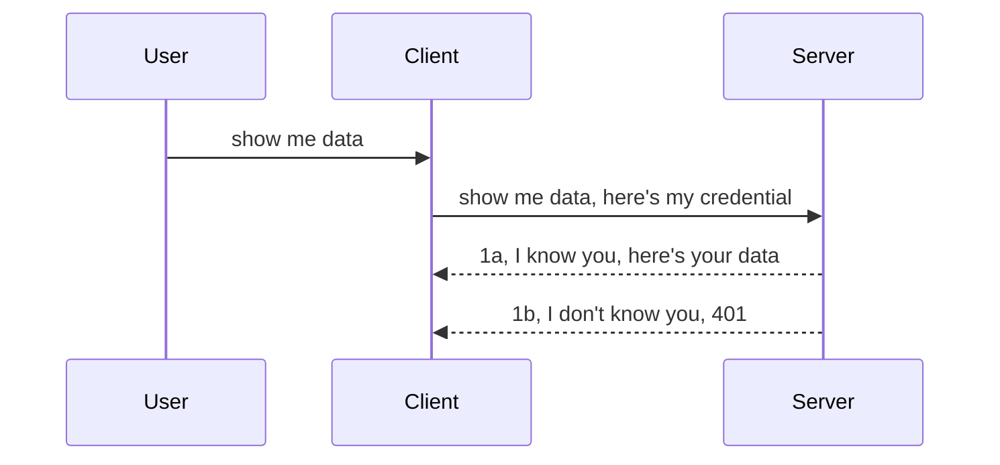

<!--
CO_OP_TRANSLATOR_METADATA:
{
  "original_hash": "5b00b8a8971a07d2d8803be4c9f138f8",
  "translation_date": "2025-10-07T01:01:04+00:00",
  "source_file": "03-GettingStarted/11-simple-auth/README.md",
  "language_code": "hu"
}
-->
# Egyszerű hitelesítés

Az MCP SDK-k támogatják az OAuth 2.1 használatát, amely őszintén szólva egy elég összetett folyamat, amely olyan fogalmakat foglal magában, mint a hitelesítési szerver, erőforrás-szerver, hitelesítési adatok küldése, kód megszerzése, a kód cseréje egy hordozó tokenre, amíg végül hozzáférhetünk az erőforrás-adatokhoz. Ha nem ismered az OAuth-ot, amely egy nagyszerű megoldás, érdemes egy alapvető szintű hitelesítéssel kezdeni, és fokozatosan haladni a jobb és biztonságosabb megoldások felé. Ezért létezik ez a fejezet, hogy segítsen eljutni a fejlettebb hitelesítési megoldásokig.

## Hitelesítés: Mit értünk alatta?

A hitelesítés rövidítése az autentikáció és az autorizáció. Az ötlet az, hogy két dolgot kell elvégeznünk:

- **Autentikáció**, amely annak a folyamatnak a része, hogy eldöntsük, engedjük-e valakit belépni a "házunkba", azaz hogy jogosult-e hozzáférni az erőforrás-szerverünkhöz, ahol az MCP szerver funkciói találhatók.
- **Autorizáció**, amely annak a folyamatnak a része, hogy eldöntsük, egy felhasználónak van-e jogosultsága az adott erőforrásokhoz, amelyeket kér, például ezekhez a rendelésekhez vagy termékekhez, vagy hogy csak olvasási jogot kapjon, de törlési jogot ne, mint egy másik példa.

## Hitelesítési adatok: Hogyan azonosítjuk magunkat a rendszerben?

Nos, a legtöbb webfejlesztő általában úgy gondolkodik, hogy hitelesítési adatokat küld a szervernek, általában egy titkos kulcsot, amely azt jelzi, hogy jogosultak-e "belépni" (autentikáció). Ez a hitelesítési adat általában egy base64 kódolt verziója a felhasználónévnek és jelszónak, vagy egy API kulcs, amely egyedileg azonosít egy adott felhasználót.

Ez általában egy "Authorization" nevű fejlécen keresztül kerül elküldésre, például így:

```json
{ "Authorization": "secret123" }
```

Ezt általában alapvető hitelesítésnek nevezik. Az általános folyamat így működik:



Most, hogy megértettük, hogyan működik a folyamat szempontjából, hogyan valósíthatjuk meg? Nos, a legtöbb webszerver rendelkezik egy úgynevezett middleware koncepcióval, amely egy kódrészlet, amely a kérés részeként fut, és ellenőrizheti a hitelesítési adatokat. Ha a hitelesítési adatok érvényesek, a kérés továbbhaladhat. Ha a kérés nem tartalmaz érvényes hitelesítési adatokat, akkor hitelesítési hibát kapunk. Nézzük meg, hogyan lehet ezt megvalósítani:

**Python**

```python
class AuthMiddleware(BaseHTTPMiddleware):
    async def dispatch(self, request, call_next):

        has_header = request.headers.get("Authorization")
        if not has_header:
            print("-> Missing Authorization header!")
            return Response(status_code=401, content="Unauthorized")

        if not valid_token(has_header):
            print("-> Invalid token!")
            return Response(status_code=403, content="Forbidden")

        print("Valid token, proceeding...")
       
        response = await call_next(request)
        # add any customer headers or change in the response in some way
        return response


starlette_app.add_middleware(CustomHeaderMiddleware)
```

Itt:

- Létrehoztunk egy `AuthMiddleware` nevű middleware-t, amelynek `dispatch` metódusát a webszerver hívja meg.
- Hozzáadtuk a middleware-t a webszerverhez:

    ```python
    starlette_app.add_middleware(AuthMiddleware)
    ```

- Megírtuk az ellenőrzési logikát, amely ellenőrzi, hogy az Authorization fejléc jelen van-e, és hogy a küldött titkos kulcs érvényes-e:

    ```python
    has_header = request.headers.get("Authorization")
    if not has_header:
        print("-> Missing Authorization header!")
        return Response(status_code=401, content="Unauthorized")

    if not valid_token(has_header):
        print("-> Invalid token!")
        return Response(status_code=403, content="Forbidden")
    ```

    Ha a titkos kulcs jelen van és érvényes, akkor a kérés továbbhaladhat a `call_next` hívásával, és visszaadjuk a választ.

    ```python
    response = await call_next(request)
    # add any customer headers or change in the response in some way
    return response
    ```

A működése az, hogy ha egy webkérést küldenek a szerver felé, a middleware-t meghívják, és annak implementációja alapján vagy engedi a kérést továbbhaladni, vagy hibát ad vissza, amely jelzi, hogy az ügyfél nem folytathatja.

**TypeScript**

Itt egy middleware-t hozunk létre az Express nevű népszerű keretrendszerrel, és a kérést elfogjuk, mielőtt az MCP szerverhez érne. Íme a kód:

```typescript
function isValid(secret) {
    return secret === "secret123";
}

app.use((req, res, next) => {
    // 1. Authorization header present?  
    if(!req.headers["Authorization"]) {
        res.status(401).send('Unauthorized');
    }
    
    let token = req.headers["Authorization"];

    // 2. Check validity.
    if(!isValid(token)) {
        res.status(403).send('Forbidden');
    }

   
    console.log('Middleware executed');
    // 3. Passes request to the next step in the request pipeline.
    next();
});
```

Ebben a kódban:

1. Ellenőrizzük, hogy az Authorization fejléc egyáltalán jelen van-e, ha nem, akkor 401-es hibát küldünk.
2. Ellenőrizzük, hogy a hitelesítési adat/token érvényes-e, ha nem, akkor 403-as hibát küldünk.
3. Végül továbbítjuk a kérést a kérési folyamatban, és visszaadjuk a kért erőforrást.

## Gyakorlat: Hitelesítés megvalósítása

Vegyük az eddig megszerzett tudásunkat, és próbáljuk megvalósítani. Íme a terv:

Szerver

- Hozz létre egy webszervert és MCP példányt.
- Valósíts meg egy middleware-t a szerverhez.

Ügyfél

- Küldj webkérést hitelesítési adatokkal, fejlécen keresztül.

### -1- Hozz létre egy webszervert és MCP példányt

Az első lépésben létre kell hoznunk a webszerver példányt és az MCP szervert.

**Python**

Itt létrehozunk egy MCP szerver példányt, egy starlette webalkalmazást, és hosztoljuk azt uvicorn segítségével.

```python
# creating MCP Server

app = FastMCP(
    name="MCP Resource Server",
    instructions="Resource Server that validates tokens via Authorization Server introspection",
    host=settings["host"],
    port=settings["port"],
    debug=True
)

# creating starlette web app
starlette_app = app.streamable_http_app()

# serving app via uvicorn
async def run(starlette_app):
    import uvicorn
    config = uvicorn.Config(
            starlette_app,
            host=app.settings.host,
            port=app.settings.port,
            log_level=app.settings.log_level.lower(),
        )
    server = uvicorn.Server(config)
    await server.serve()

run(starlette_app)
```

Ebben a kódban:

- Létrehoztuk az MCP szervert.
- Létrehoztuk a starlette webalkalmazást az MCP szerverből, `app.streamable_http_app()`.
- Hosztoltuk és kiszolgáltuk a webalkalmazást uvicorn segítségével, `server.serve()`.

**TypeScript**

Itt létrehozunk egy MCP szerver példányt.

```typescript
const server = new McpServer({
      name: "example-server",
      version: "1.0.0"
    });

    // ... set up server resources, tools, and prompts ...
```

Ez az MCP szerver létrehozás a POST /mcp útvonal definícióján belül történik, tehát vegyük az előző kódot, és helyezzük át így:

```typescript
import express from "express";
import { randomUUID } from "node:crypto";
import { McpServer } from "@modelcontextprotocol/sdk/server/mcp.js";
import { StreamableHTTPServerTransport } from "@modelcontextprotocol/sdk/server/streamableHttp.js";
import { isInitializeRequest } from "@modelcontextprotocol/sdk/types.js"

const app = express();
app.use(express.json());

// Map to store transports by session ID
const transports: { [sessionId: string]: StreamableHTTPServerTransport } = {};

// Handle POST requests for client-to-server communication
app.post('/mcp', async (req, res) => {
  // Check for existing session ID
  const sessionId = req.headers['mcp-session-id'] as string | undefined;
  let transport: StreamableHTTPServerTransport;

  if (sessionId && transports[sessionId]) {
    // Reuse existing transport
    transport = transports[sessionId];
  } else if (!sessionId && isInitializeRequest(req.body)) {
    // New initialization request
    transport = new StreamableHTTPServerTransport({
      sessionIdGenerator: () => randomUUID(),
      onsessioninitialized: (sessionId) => {
        // Store the transport by session ID
        transports[sessionId] = transport;
      },
      // DNS rebinding protection is disabled by default for backwards compatibility. If you are running this server
      // locally, make sure to set:
      // enableDnsRebindingProtection: true,
      // allowedHosts: ['127.0.0.1'],
    });

    // Clean up transport when closed
    transport.onclose = () => {
      if (transport.sessionId) {
        delete transports[transport.sessionId];
      }
    };
    const server = new McpServer({
      name: "example-server",
      version: "1.0.0"
    });

    // ... set up server resources, tools, and prompts ...

    // Connect to the MCP server
    await server.connect(transport);
  } else {
    // Invalid request
    res.status(400).json({
      jsonrpc: '2.0',
      error: {
        code: -32000,
        message: 'Bad Request: No valid session ID provided',
      },
      id: null,
    });
    return;
  }

  // Handle the request
  await transport.handleRequest(req, res, req.body);
});

// Reusable handler for GET and DELETE requests
const handleSessionRequest = async (req: express.Request, res: express.Response) => {
  const sessionId = req.headers['mcp-session-id'] as string | undefined;
  if (!sessionId || !transports[sessionId]) {
    res.status(400).send('Invalid or missing session ID');
    return;
  }
  
  const transport = transports[sessionId];
  await transport.handleRequest(req, res);
};

// Handle GET requests for server-to-client notifications via SSE
app.get('/mcp', handleSessionRequest);

// Handle DELETE requests for session termination
app.delete('/mcp', handleSessionRequest);

app.listen(3000);
```

Most láthatod, hogyan került az MCP szerver létrehozása az `app.post("/mcp")` belsejébe.

Lépjünk tovább a következő lépésre, amely a middleware létrehozása, hogy ellenőrizhessük a bejövő hitelesítési adatokat.

### -2- Valósíts meg egy middleware-t a szerverhez

Most térjünk rá a middleware részre. Itt létrehozunk egy middleware-t, amely a `Authorization` fejlécben keres hitelesítési adatokat, és ellenőrzi azokat. Ha elfogadható, akkor a kérés továbbhalad, és elvégzi, amit kell (például eszközök listázása, erőforrás olvasása vagy bármilyen MCP funkció, amit az ügyfél kért).

**Python**

A middleware létrehozásához létre kell hoznunk egy osztályt, amely örökli a `BaseHTTPMiddleware` osztályt. Két érdekes elem van:

- A kérés `request`, amelyből kiolvassuk a fejléc információit.
- `call_next`, a visszahívás, amelyet meg kell hívnunk, ha az ügyfél olyan hitelesítési adatot hozott, amelyet elfogadunk.

Először kezelni kell azt az esetet, ha az `Authorization` fejléc hiányzik:

```python
has_header = request.headers.get("Authorization")

# no header present, fail with 401, otherwise move on.
if not has_header:
    print("-> Missing Authorization header!")
    return Response(status_code=401, content="Unauthorized")
```

Itt 401-es jogosulatlan üzenetet küldünk, mivel az ügyfél nem felel meg a hitelesítésnek.

Ezután, ha hitelesítési adatot küldtek, ellenőriznünk kell annak érvényességét, például így:

```python
 if not valid_token(has_header):
    print("-> Invalid token!")
    return Response(status_code=403, content="Forbidden")
```

Figyeld meg, hogyan küldünk 403-as tiltott üzenetet fentebb. Nézzük meg a teljes middleware-t, amely megvalósítja mindazt, amit fentebb említettünk:

```python
class AuthMiddleware(BaseHTTPMiddleware):
    async def dispatch(self, request, call_next):

        has_header = request.headers.get("Authorization")
        if not has_header:
            print("-> Missing Authorization header!")
            return Response(status_code=401, content="Unauthorized")

        if not valid_token(has_header):
            print("-> Invalid token!")
            return Response(status_code=403, content="Forbidden")

        print("Valid token, proceeding...")
        print(f"-> Received {request.method} {request.url}")
        response = await call_next(request)
        response.headers['Custom'] = 'Example'
        return response

```

Nagyszerű, de mi a helyzet a `valid_token` függvénnyel? Íme:

```python
# DON'T use for production - improve it !!
def valid_token(token: str) -> bool:
    # remove the "Bearer " prefix
    if token.startswith("Bearer "):
        token = token[7:]
        return token == "secret-token"
    return False
```

Ezt természetesen javítani kellene.

FONTOS: Soha ne tárolj titkos kulcsokat a kódban. Ideális esetben az értéket egy adatforrásból vagy egy IDP-ből (azonosítószolgáltató) kell lekérni, vagy még jobb, ha az IDP végzi az ellenőrzést.

**TypeScript**

Az Express használatával ezt úgy valósíthatjuk meg, hogy meghívjuk a `use` metódust, amely middleware függvényeket fogad.

A következőket kell tennünk:

- Interakcióba lépni a kérés változóval, hogy ellenőrizzük a `Authorization` tulajdonságban küldött hitelesítési adatokat.
- Ellenőrizni a hitelesítési adatokat, és ha érvényesek, engedni a kérést továbbhaladni, hogy az ügyfél MCP kérése elvégezze, amit kell (például eszközök listázása, erőforrás olvasása vagy bármilyen más MCP funkció).

Itt ellenőrizzük, hogy az `Authorization` fejléc jelen van-e, és ha nem, megállítjuk a kérést:

```typescript
if(!req.headers["authorization"]) {
    res.status(401).send('Unauthorized');
    return;
}
```

Ha a fejlécet nem küldik el, 401-es hibát kapunk.

Ezután ellenőrizzük, hogy a hitelesítési adat érvényes-e, ha nem, ismét megállítjuk a kérést, de egy kicsit más üzenettel:

```typescript
if(!isValid(token)) {
    res.status(403).send('Forbidden');
    return;
} 
```

Figyeld meg, hogyan kapsz most 403-as hibát.

Íme a teljes kód:

```typescript
app.use((req, res, next) => {
    console.log('Request received:', req.method, req.url, req.headers);
    console.log('Headers:', req.headers["authorization"]);
    if(!req.headers["authorization"]) {
        res.status(401).send('Unauthorized');
        return;
    }
    
    let token = req.headers["authorization"];

    if(!isValid(token)) {
        res.status(403).send('Forbidden');
        return;
    }  

    console.log('Middleware executed');
    next();
});
```

Beállítottuk a webszervert, hogy elfogadjon egy middleware-t, amely ellenőrzi az ügyfél által remélhetőleg küldött hitelesítési adatokat. Mi a helyzet magával az ügyféllel?

### -3- Küldj webkérést hitelesítési adatokkal, fejlécen keresztül

Biztosítanunk kell, hogy az ügyfél a hitelesítési adatokat a fejlécen keresztül küldi. Mivel MCP ügyfelet fogunk használni ehhez, meg kell találnunk, hogyan történik ez.

**Python**

Az ügyfél esetében egy fejlécet kell küldenünk a hitelesítési adatainkkal, például így:

```python
# DON'T hardcode the value, have it at minimum in an environment variable or a more secure storage
token = "secret-token"

async with streamablehttp_client(
        url = f"http://localhost:{port}/mcp",
        headers = {"Authorization": f"Bearer {token}"}
    ) as (
        read_stream,
        write_stream,
        session_callback,
    ):
        async with ClientSession(
            read_stream,
            write_stream
        ) as session:
            await session.initialize()
      
            # TODO, what you want done in the client, e.g list tools, call tools etc.
```

Figyeld meg, hogyan töltjük fel a `headers` tulajdonságot így: `headers = {"Authorization": f"Bearer {token}"}`.

**TypeScript**

Ezt két lépésben oldhatjuk meg:

1. Létrehozunk egy konfigurációs objektumot a hitelesítési adatainkkal.
2. Átadjuk a konfigurációs objektumot a transportnak.

```typescript

// DON'T hardcode the value like shown here. At minimum have it as a env variable and use something like dotenv (in dev mode).
let token = "secret123"

// define a client transport option object
let options: StreamableHTTPClientTransportOptions = {
  sessionId: sessionId,
  requestInit: {
    headers: {
      "Authorization": "secret123"
    }
  }
};

// pass the options object to the transport
async function main() {
   const transport = new StreamableHTTPClientTransport(
      new URL(serverUrl),
      options
   );
```

Itt láthatod, hogyan kellett létrehoznunk egy `options` objektumot, és elhelyezni a fejlécet a `requestInit` tulajdonság alatt.

FONTOS: Hogyan javíthatjuk ezt innen? Nos, a jelenlegi megvalósításnak vannak problémái. Először is, ilyen módon hitelesítési adatokat küldeni elég kockázatos, hacsak nincs legalább HTTPS. Még akkor is, a hitelesítési adatokat ellophatják, ezért szükséged van egy rendszerre, amelyben könnyen visszavonhatod a tokent, és további ellenőrzéseket adhatsz hozzá, például hogy honnan érkezik a kérés, túl gyakran történik-e (bot-szerű viselkedés), röviden, számos aggály van. 

Azonban el kell mondani, hogy nagyon egyszerű API-k esetében, ahol nem akarod, hogy bárki hitelesítés nélkül hívja meg az API-t, amit itt bemutattunk, az egy jó kezdet.

Ezzel együtt próbáljuk meg egy kicsit megerősíteni a biztonságot egy szabványos formátum, például JSON Web Token (JWT) használatával.

## JSON Web Tokenek, JWT

Tehát próbáljuk javítani a hitelesítési adatok egyszerű küldését. Milyen azonnali javulásokat kapunk a JWT alkalmazásával?

- **Biztonsági javítások**. Az alapvető hitelesítésben a felhasználónevet és jelszót base64 kódolt tokenként (vagy API kulcsként) küldöd újra és újra, ami növeli a kockázatot. A JWT-vel elküldöd a felhasználónevet és jelszót, és cserébe kapsz egy tokent, amely időkorlátos, azaz lejár. A JWT lehetővé teszi a finomhangolt hozzáférés-ellenőrzést szerepek, hatókörök és jogosultságok használatával.
- **Állapotmentesség és skálázhatóság**. A JWT-k önállóak, minden felhasználói információt hordoznak, és kiküszöbölik a szerveroldali munkamenet-tárolás szükségességét. A tokeneket helyben is lehet ellenőrizni.
- **Interoperabilitás és federáció**. A JWT-k központi szerepet játszanak az Open ID Connect-ben, és olyan ismert azonosítószolgáltatókkal használhatók, mint az Entra ID, Google Identity és Auth0. Lehetővé teszik az egyetlen bejelentkezést és még sok mást, így vállalati szintű megoldást kínálnak.
- **Modularitás és rugalmasság**. A JWT-k API átjárókkal, például Azure API Management, NGINX és másokkal is használhatók. Támogatják a hitelesítési forgatókönyveket és a szerverek közötti kommunikációt, beleértve a megszemélyesítési és delegálási forgatókönyveket.
- **Teljesítmény és gyorsítótárazás**. A JWT-k dekódolás után gyorsítótárazhatók, ami csökkenti a feldolgozás szükségességét. Ez különösen a nagy forgalmú alkalmazásoknál segít, mivel javítja az áteresztőképességet és csökkenti a terhelést az infrastruktúrán.
- **Fejlett funkciók**. Támogatják az introspekciót (érvényesség ellenőrzése a szerveren) és a visszavonást (token érvénytelenítése).

Ezekkel az előnyökkel nézzük meg, hogyan vihetjük a megvalósításunkat a következő szintre.

## Az alapvető hitelesítés átalakítása JWT-re

Tehát a változtatások, amelyeket magas szinten el kell végeznünk:

- **Tanuljuk meg egy JWT token létrehozását**, és tegyük készen arra, hogy az ügyfél elküldje a szervernek.
- **Ellenőrizzük egy JWT token érvényességét**, és ha érvényes, engedjük az ügyfélnek hozzáférni az erőforrásainkhoz.
- **Biztonságos token tárolás**. Hogyan tároljuk ezt a tokent.
- **Védjük az útvonalakat**. Védenünk kell az útvonalakat, esetünkben az MCP funkciókat és specifikus útvonalakat.
- **Adjunk hozzá frissítő tokeneket**. Biztosítsuk, hogy rövid élettartamú tokeneket hozzunk létre, de hosszú élettartamú frissítő tokeneket, amelyekkel új tokeneket szerezhetünk, ha lejárnak. Továbbá biztosítsunk egy frissítő végpontot és egy rotációs stratégiát.

### -1- JWT token létrehozása

Először is, egy JWT tokennek a következő részei vannak:

- **Fejléc**, az alkalmazott algoritmus és a token típusa.
- **Tartalom**, állítások, mint például sub (a felhasználó vagy entitás, amelyet a token képvisel. Hitelesítési forgatókönyvben ez általában a felhasználói azonosító), exp (mikor jár le), role (a szerep).
- **Aláírás**, titkos kulccsal vagy privát kulccsal aláírva.

Ehhez létre kell hoznunk a fejlécet, a tartalmat és a kódolt tokent.

**Python**

```python

import jwt
import jwt
from jwt.exceptions import ExpiredSignatureError, InvalidTokenError
import datetime

# Secret key used to sign the JWT
secret_key = 'your-secret-key'

header = {
    "alg": "HS256",
    "typ": "JWT"
}

# the user info andits claims and expiry time
payload = {
    "sub": "1234567890",               # Subject (user ID)
    "name": "User Userson",                # Custom claim
    "admin": True,                     # Custom claim
    "iat": datetime.datetime.utcnow(),# Issued at
    "exp": datetime.datetime.utcnow() + datetime.timedelta(hours=1)  # Expiry
}

# encode it
encoded_jwt = jwt.encode(payload, secret_key, algorithm="HS256", headers=header)
```

A fenti kódban:

- Meghatároztunk egy fejlécet, amely HS256 algoritmust használ, és a típus JWT.
- Létrehoztunk egy tartalmat, amely tartalmazza a subject vagy user id-t, egy felhasználónevet, egy szerepet, mikor lett kiadva, és mikor jár le, ezzel megvalósítva az időkorlátos aspektust, amelyet korábban említettünk.

**TypeScript**

Itt szükségünk lesz néhány függőségre, amelyek segítenek a JWT token létrehozásában.

F
Most következzen a szerepkör alapú hozzáférés-szabályozás, más néven RBAC.

## Szerepkör alapú hozzáférés-szabályozás hozzáadása

Az ötlet az, hogy különböző szerepkörök különböző jogosultságokkal rendelkezzenek. Például feltételezzük, hogy az adminisztrátor mindent megtehet, a normál felhasználók olvasási/írási jogosultsággal rendelkeznek, míg a vendégek csak olvasási jogosultsággal. Íme néhány lehetséges jogosultsági szint:

- Admin.Write 
- User.Read
- Guest.Read

Nézzük meg, hogyan valósíthatunk meg ilyen szabályozást middleware segítségével. A middleware-eket hozzáadhatjuk egyes útvonalakhoz, valamint az összes útvonalhoz.

**Python**

```python
from starlette.middleware.base import BaseHTTPMiddleware
from starlette.responses import JSONResponse
import jwt

# DON'T have the secret in the code like, this is for demonstration purposes only. Read it from a safe place.
SECRET_KEY = "your-secret-key" # put this in env variable
REQUIRED_PERMISSION = "User.Read"

class JWTPermissionMiddleware(BaseHTTPMiddleware):
    async def dispatch(self, request, call_next):
        auth_header = request.headers.get("Authorization")
        if not auth_header or not auth_header.startswith("Bearer "):
            return JSONResponse({"error": "Missing or invalid Authorization header"}, status_code=401)

        token = auth_header.split(" ")[1]
        try:
            decoded = jwt.decode(token, SECRET_KEY, algorithms=["HS256"])
        except jwt.ExpiredSignatureError:
            return JSONResponse({"error": "Token expired"}, status_code=401)
        except jwt.InvalidTokenError:
            return JSONResponse({"error": "Invalid token"}, status_code=401)

        permissions = decoded.get("permissions", [])
        if REQUIRED_PERMISSION not in permissions:
            return JSONResponse({"error": "Permission denied"}, status_code=403)

        request.state.user = decoded
        return await call_next(request)


```

Többféle módon is hozzáadhatjuk a middleware-t, például az alábbiak szerint:

```python

# Alt 1: add middleware while constructing starlette app
middleware = [
    Middleware(JWTPermissionMiddleware)
]

app = Starlette(routes=routes, middleware=middleware)

# Alt 2: add middleware after starlette app is a already constructed
starlette_app.add_middleware(JWTPermissionMiddleware)

# Alt 3: add middleware per route
routes = [
    Route(
        "/mcp",
        endpoint=..., # handler
        middleware=[Middleware(JWTPermissionMiddleware)]
    )
]
```

**TypeScript**

Használhatjuk az `app.use`-t és egy middleware-t, amely minden kérésnél futni fog.

```typescript
app.use((req, res, next) => {
    console.log('Request received:', req.method, req.url, req.headers);
    console.log('Headers:', req.headers["authorization"]);

    // 1. Check if authorization header has been sent

    if(!req.headers["authorization"]) {
        res.status(401).send('Unauthorized');
        return;
    }
    
    let token = req.headers["authorization"];

    // 2. Check if token is valid
    if(!isValid(token)) {
        res.status(403).send('Forbidden');
        return;
    }  

    // 3. Check if token user exist in our system
    if(!isExistingUser(token)) {
        res.status(403).send('Forbidden');
        console.log("User does not exist");
        return;
    }
    console.log("User exists");

    // 4. Verify the token has the right permissions
    if(!hasScopes(token, ["User.Read"])){
        res.status(403).send('Forbidden - insufficient scopes');
    }

    console.log("User has required scopes");

    console.log('Middleware executed');
    next();
});

```

Számos dolgot elvégezhetünk a middleware segítségével, és amit el is kell végeznie, nevezetesen:

1. Ellenőrizze, hogy az authorization header jelen van-e.
2. Ellenőrizze, hogy a token érvényes-e. Meghívjuk az `isValid` metódust, amelyet azért írtunk, hogy ellenőrizze a JWT token integritását és érvényességét.
3. Ellenőrizze, hogy a felhasználó létezik-e a rendszerünkben.

   ```typescript
    // users in DB
   const users = [
     "user1",
     "User usersson",
   ]

   function isExistingUser(token) {
     let decodedToken = verifyToken(token);

     // TODO, check if user exists in DB
     return users.includes(decodedToken?.name || "");
   }
   ```

   A fentiekben létrehoztunk egy nagyon egyszerű `users` listát, amelynek természetesen egy adatbázisban kellene lennie.

4. Továbbá ellenőriznünk kell, hogy a token rendelkezik-e a megfelelő jogosultságokkal.

   ```typescript
   if(!hasScopes(token, ["User.Read"])){
        res.status(403).send('Forbidden - insufficient scopes');
   }
   ```

   A fenti middleware kódban ellenőrizzük, hogy a token tartalmazza-e a User.Read jogosultságot, ha nem, akkor 403-as hibát küldünk. Az alábbiakban látható a `hasScopes` segédmetódus.

   ```typescript
   function hasScopes(scope: string, requiredScopes: string[]) {
     let decodedToken = verifyToken(scope);
    return requiredScopes.every(scope => decodedToken?.scopes.includes(scope));
  }
   ```

Have a think which additional checks you should be doing, but these are the absolute minimum of checks you should be doing.

Using Express as a web framework is a common choice. There are helpers library when you use JWT so you can write less code.

- `express-jwt`, helper library that provides a middleware that helps decode your token.
- `express-jwt-permissions`, this provides a middleware `guard` that helps check if a certain permission is on the token.

Here's what these libraries can look like when used:

```typescript
const express = require('express');
const jwt = require('express-jwt');
const guard = require('express-jwt-permissions')();

const app = express();
const secretKey = 'your-secret-key'; // put this in env variable

// Decode JWT and attach to req.user
app.use(jwt({ secret: secretKey, algorithms: ['HS256'] }));

// Check for User.Read permission
app.use(guard.check('User.Read'));

// multiple permissions
// app.use(guard.check(['User.Read', 'Admin.Access']));

app.get('/protected', (req, res) => {
  res.json({ message: `Welcome ${req.user.name}` });
});

// Error handler
app.use((err, req, res, next) => {
  if (err.code === 'permission_denied') {
    return res.status(403).send('Forbidden');
  }
  next(err);
});

```

Most láthattad, hogyan használható a middleware az autentikációhoz és az autorizációhoz. Mi a helyzet azonban az MCP-vel? Megváltoztatja-e az autentikáció módját? Derítsük ki a következő szakaszban.

### -3- RBAC hozzáadása MCP-hez

Eddig láthattad, hogyan adható hozzá RBAC middleware segítségével, azonban az MCP esetében nincs egyszerű módja annak, hogy egy-egy MCP funkcióhoz RBAC-t adjunk. Mit tegyünk? Nos, egyszerűen hozzá kell adnunk egy olyan kódot, amely ellenőrzi, hogy az ügyfél jogosult-e egy adott eszköz használatára:

Többféle lehetőség van arra, hogyan valósítsuk meg funkciónkénti RBAC-t, íme néhány:

- Ellenőrzés hozzáadása minden eszközhöz, erőforráshoz, prompthoz, ahol jogosultsági szintet kell ellenőrizni.

   **Python**

   ```python
   @tool()
   def delete_product(id: int):
      try:
          check_permissions(role="Admin.Write", request)
      catch:
        pass # client failed authorization, raise authorization error
   ```

   **TypeScript**

   ```typescript
   server.registerTool(
    "delete-product",
    {
      title: Delete a product",
      description: "Deletes a product",
      inputSchema: { id: z.number() }
    },
    async ({ id }) => {
      
      try {
        checkPermissions("Admin.Write", request);
        // todo, send id to productService and remote entry
      } catch(Exception e) {
        console.log("Authorization error, you're not allowed");  
      }

      return {
        content: [{ type: "text", text: `Deletected product with id ${id}` }]
      };
    }
   );
   ```


- Haladó szervermegközelítés és kéréskezelők használata, hogy minimalizáljuk az ellenőrzések helyét.

   **Python**

   ```python
   
   tool_permission = {
      "create_product": ["User.Write", "Admin.Write"],
      "delete_product": ["Admin.Write"]
   }

   def has_permission(user_permissions, required_permissions) -> bool:
      # user_permissions: list of permissions the user has
      # required_permissions: list of permissions required for the tool
      return any(perm in user_permissions for perm in required_permissions)

   @server.call_tool()
   async def handle_call_tool(
     name: str, arguments: dict[str, str] | None
   ) -> list[types.TextContent]:
    # Assume request.user.permissions is a list of permissions for the user
     user_permissions = request.user.permissions
     required_permissions = tool_permission.get(name, [])
     if not has_permission(user_permissions, required_permissions):
        # Raise error "You don't have permission to call tool {name}"
        raise Exception(f"You don't have permission to call tool {name}")
     # carry on and call tool
     # ...
   ```   
   

   **TypeScript**

   ```typescript
   function hasPermission(userPermissions: string[], requiredPermissions: string[]): boolean {
       if (!Array.isArray(userPermissions) || !Array.isArray(requiredPermissions)) return false;
       // Return true if user has at least one required permission
       
       return requiredPermissions.some(perm => userPermissions.includes(perm));
   }
  
   server.setRequestHandler(CallToolRequestSchema, async (request) => {
      const { params: { name } } = request;
  
      let permissions = request.user.permissions;
  
      if (!hasPermission(permissions, toolPermissions[name])) {
         return new Error(`You don't have permission to call ${name}`);
      }
  
      // carry on..
   });
   ```

   Fontos, hogy biztosítsuk, hogy a middleware dekódolt tokent rendeljen a kérés `user` tulajdonságához, így a fenti kód egyszerűbbé válik.

### Összegzés

Most, hogy megbeszéltük, hogyan lehet általánosan és különösen MCP-hez RBAC-t hozzáadni, itt az ideje, hogy saját magad próbáld megvalósítani a biztonságot, hogy megbizonyosodj arról, hogy megértetted az itt bemutatott fogalmakat.

## Feladat 1: MCP szerver és MCP kliens létrehozása alapvető autentikációval

Itt alkalmazhatod, amit megtanultál a hitelesítő adatok headeren keresztüli küldéséről.

## Megoldás 1

[Megoldás 1](./code/basic/README.md)

## Feladat 2: Az 1. feladat megoldásának frissítése JWT használatával

Vedd az első megoldást, de ezúttal fejlesszük tovább.

Alapvető autentikáció helyett használjunk JWT-t.

## Megoldás 2

[Megoldás 2](./solution/jwt-solution/README.md)

## Kihívás

Adj hozzá funkciónkénti RBAC-t, ahogy az "RBAC hozzáadása MCP-hez" szakaszban leírtuk.

## Összefoglalás

Remélhetőleg sokat tanultál ebben a fejezetben, a teljes biztonság hiányától kezdve az alapvető biztonságig, majd a JWT-ig, és hogy hogyan adható hozzá MCP-hez.

Szilárd alapot építettünk egyedi JWT-kkel, de ahogy skálázunk, egy szabványokon alapuló identitásmodell felé mozdulunk el. Egy IdP, mint például Entra vagy Keycloak bevezetése lehetővé teszi számunkra, hogy a tokenek kiadását, érvényesítését és életciklus-kezelését egy megbízható platformra bízzuk — így szabadon koncentrálhatunk az alkalmazás logikájára és a felhasználói élményre.

Ehhez van egy [haladó fejezetünk az Entráról](../../05-AdvancedTopics/mcp-security-entra/README.md).

---

**Felelősség kizárása**:  
Ez a dokumentum az [Co-op Translator](https://github.com/Azure/co-op-translator) AI fordítási szolgáltatás segítségével került lefordításra. Bár törekszünk a pontosságra, kérjük, vegye figyelembe, hogy az automatikus fordítások hibákat vagy pontatlanságokat tartalmazhatnak. Az eredeti dokumentum az eredeti nyelvén tekintendő hiteles forrásnak. Fontos információk esetén javasolt professzionális emberi fordítást igénybe venni. Nem vállalunk felelősséget semmilyen félreértésért vagy téves értelmezésért, amely a fordítás használatából eredhet.