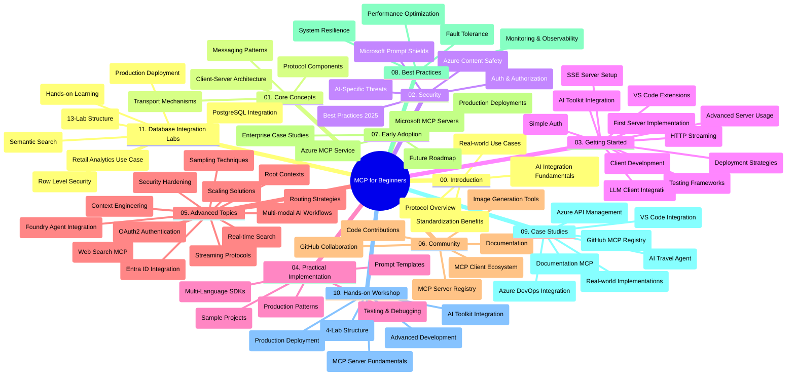

<!--
CO_OP_TRANSLATOR_METADATA:
{
  "original_hash": "af27b0acfae6caa134d9701453884df8",
  "translation_date": "2025-10-06T23:49:51+00:00",
  "source_file": "study_guide.md",
  "language_code": "hu"
}
-->
# Model Context Protocol (MCP) kezdőknek - Tanulmányi útmutató

Ez a tanulmányi útmutató áttekintést nyújt a "Model Context Protocol (MCP) kezdőknek" tananyaghoz tartozó adattár felépítéséről és tartalmáról. Használja ezt az útmutatót az adattár hatékony navigálásához és az elérhető források maximális kihasználásához.

## Adattár áttekintése

A Model Context Protocol (MCP) egy szabványosított keretrendszer az AI modellek és az ügyfélalkalmazások közötti interakciókhoz. Eredetileg az Anthropic hozta létre, de ma már a szélesebb MCP közösség tartja karban a hivatalos GitHub szervezeten keresztül. Ez az adattár egy átfogó tananyagot kínál, gyakorlati kódpéldákkal C#, Java, JavaScript, Python és TypeScript nyelveken, AI fejlesztők, rendszerarchitektek és szoftvermérnökök számára.

## Vizuális tananyag térkép

## Adattár felépítése

Az adattár tizenegy fő szekcióra van osztva, amelyek mindegyike az MCP különböző aspektusaira összpontosít:

1. **Bevezetés (00-Introduction/)**
   - A Model Context Protocol áttekintése
   - Miért fontos a szabványosítás az AI folyamatokban
   - Gyakorlati felhasználási esetek és előnyök

2. **Alapfogalmak (01-CoreConcepts/)**
   - Kliens-szerver architektúra
   - Kulcsfontosságú protokoll komponensek
   - Üzenetküldési minták az MCP-ben

3. **Biztonság (02-Security/)**
   - Biztonsági fenyegetések az MCP-alapú rendszerekben
   - Legjobb gyakorlatok a megvalósítások biztosítására
   - Hitelesítési és jogosultságkezelési stratégiák
   - **Átfogó biztonsági dokumentáció**:
     - MCP Biztonsági legjobb gyakorlatok 2025
     - Azure Tartalom Biztonsági Megvalósítási Útmutató
     - MCP Biztonsági Ellenőrzések és Technikák
     - MCP Legjobb Gyakorlatok Gyors Referencia
   - **Kulcsfontosságú biztonsági témák**:
     - Prompt injekció és eszközmérgezési támadások
     - Munkamenet-eltérítés és zavart helyettesítő problémák
     - Token átadási sebezhetőségek
     - Túlzott jogosultságok és hozzáférés-ellenőrzés
     - Ellátási lánc biztonsága AI komponensekhez
     - Microsoft Prompt Shields integráció

4. **Első lépések (03-GettingStarted/)**
   - Környezet beállítása és konfigurálása
   - Alapvető MCP szerverek és kliensek létrehozása
   - Integráció meglévő alkalmazásokkal
   - Tartalmazza a következő szekciókat:
     - Első szerver implementáció
     - Kliens fejlesztés
     - LLM kliens integráció
     - VS Code integráció
     - Szerver által küldött események (SSE) szerver
     - Haladó szerverhasználat
     - HTTP streaming
     - AI Toolkit integráció
     - Tesztelési stratégiák
     - Telepítési irányelvek

5. **Gyakorlati megvalósítás (04-PracticalImplementation/)**
   - SDK-k használata különböző programozási nyelveken
   - Hibakeresési, tesztelési és érvényesítési technikák
   - Újrahasználható prompt sablonok és munkafolyamatok készítése
   - Mintaprojektek implementációs példákkal

6. **Haladó témák (05-AdvancedTopics/)**
   - Kontextusmérnöki technikák
   - Foundry ügynök integráció
   - Multi-modális AI munkafolyamatok
   - OAuth2 hitelesítési demók
   - Valós idejű keresési képességek
   - Valós idejű streaming
   - Gyökér kontextusok implementációja
   - Útvonaltervezési stratégiák
   - Mintavételi technikák
   - Skálázási megközelítések
   - Biztonsági megfontolások
   - Entra ID biztonsági integráció
   - Webes keresési integráció

7. **Közösségi hozzájárulások (06-CommunityContributions/)**
   - Hogyan járulhat hozzá kódokkal és dokumentációval
   - Együttműködés a GitHubon keresztül
   - Közösség által vezérelt fejlesztések és visszajelzések
   - Különböző MCP kliensek használata (Claude Desktop, Cline, VSCode)
   - Népszerű MCP szerverekkel való munka, beleértve a képgenerálást

8. **Korai alkalmazás tanulságai (07-LessonsfromEarlyAdoption/)**
   - Valós implementációk és sikertörténetek
   - MCP-alapú megoldások építése és telepítése
   - Trendek és jövőbeli ütemterv
   - **Microsoft MCP Szerverek Útmutató**: Átfogó útmutató 10 gyártásra kész Microsoft MCP szerverhez, beleértve:
     - Microsoft Learn Docs MCP Szerver
     - Azure MCP Szerver (15+ speciális csatlakozó)
     - GitHub MCP Szerver
     - Azure DevOps MCP Szerver
     - MarkItDown MCP Szerver
     - SQL Server MCP Szerver
     - Playwright MCP Szerver
     - Dev Box MCP Szerver
     - Azure AI Foundry MCP Szerver
     - Microsoft 365 Agents Toolkit MCP Szerver

9. **Legjobb gyakorlatok (08-BestPractices/)**
   - Teljesítményhangolás és optimalizálás
   - Hibatűrő MCP rendszerek tervezése
   - Tesztelési és ellenállóképességi stratégiák

10. **Esettanulmányok (09-CaseStudy/)**
    - **Hét átfogó esettanulmány**, amelyek bemutatják az MCP sokoldalúságát különböző forgatókönyvekben:
    - **Azure AI Utazási Ügynökök**: Több ügynökös koordináció az Azure OpenAI és AI Search segítségével
    - **Azure DevOps Integráció**: Munkafolyamatok automatizálása YouTube adatfrissítésekkel
    - **Valós idejű dokumentáció visszakeresés**: Python konzol kliens streaming HTTP-vel
    - **Interaktív tanulási terv generátor**: Chainlit webalkalmazás beszélgető AI-val
    - **Szerkesztőn belüli dokumentáció**: VS Code integráció a GitHub Copilot munkafolyamatokkal
    - **Azure API Management**: Vállalati API integráció MCP szerver létrehozásával
    - **GitHub MCP Registry**: Ökoszisztéma fejlesztés és ügynöki integrációs platform
    - Implementációs példák a vállalati integráció, fejlesztői termelékenység és ökoszisztéma fejlesztés területén

11. **Gyakorlati műhelymunka (10-StreamliningAIWorkflowsBuildingAnMCPServerWithAIToolkit/)**
    - Átfogó gyakorlati műhelymunka az MCP és az AI Toolkit kombinálásával
    - Intelligens alkalmazások építése, amelyek összekötik az AI modelleket a valós eszközökkel
    - Gyakorlati modulok az alapoktól a testreszabott szerverfejlesztésen át a gyártási telepítési stratégiákig
    - **Laborstruktúra**:
      - 1. labor: MCP szerver alapjai
      - 2. labor: Haladó MCP szerver fejlesztés
      - 3. labor: AI Toolkit integráció
      - 4. labor: Gyártási telepítés és skálázás
    - Laboralapú tanulási megközelítés lépésről lépésre

12. **MCP Szerver Adatbázis Integrációs Laborok (11-MCPServerHandsOnLabs/)**
    - **Átfogó 13-laboros tanulási útvonal** gyártásra kész MCP szerverek építéséhez PostgreSQL integrációval
    - **Valós kiskereskedelmi elemzési megvalósítás** a Zava Retail esettanulmány alapján
    - **Vállalati szintű minták**, beleértve a sor szintű biztonságot (RLS), szemantikus keresést és több bérlős adat-hozzáférést
    - **Teljes laborstruktúra**:
      - **00-03. laborok: Alapok** - Bevezetés, Architektúra, Biztonság, Környezet beállítása
      - **04-06. laborok: MCP szerver építése** - Adatbázis tervezés, MCP szerver implementáció, Eszközfejlesztés
      - **07-09. laborok: Haladó funkciók** - Szemantikus keresés, Tesztelés és hibakeresés, VS Code integráció
      - **10-12. laborok: Gyártás és legjobb gyakorlatok** - Telepítés, Monitorozás, Optimalizálás
    - **Tárgyalt technológiák**: FastMCP keretrendszer, PostgreSQL, Azure OpenAI, Azure Container Apps, Application Insights
    - **Tanulási eredmények**: Gyártásra kész MCP szerverek, adatbázis integrációs minták, AI-alapú elemzések, vállalati biztonság

## További források

Az adattár a következő támogató forrásokat tartalmazza:

- **Képek mappa**: Az egész tananyagban használt diagramok és illusztrációk
- **Fordítások**: Többnyelvű támogatás a dokumentáció automatikus fordításaival
- **Hivatalos MCP források**:
  - [MCP Dokumentáció](https://modelcontextprotocol.io/)
  - [MCP Specifikáció](https://spec.modelcontextprotocol.io/)
  - [MCP GitHub Adattár](https://github.com/modelcontextprotocol)

## Hogyan használja ezt az adattárat

1. **Szekvenciális tanulás**: Kövesse a fejezeteket sorrendben (00-tól 11-ig) a strukturált tanulási élmény érdekében.
2. **Nyelvspecifikus fókusz**: Ha egy adott programozási nyelv érdekli, fedezze fel a minták mappáit a kívánt nyelvű implementációkért.
3. **Gyakorlati megvalósítás**: Kezdje a "Első lépések" szekcióval, hogy beállítsa a környezetét, és létrehozza az első MCP szerverét és kliensét.
4. **Haladó felfedezés**: Miután megismerkedett az alapokkal, mélyedjen el a haladó témákban, hogy bővítse tudását.
5. **Közösségi részvétel**: Csatlakozzon az MCP közösséghez a GitHub beszélgetéseken és a Discord csatornákon keresztül, hogy kapcsolatba lépjen szakértőkkel és más fejlesztőkkel.

## MCP kliensek és eszközök

A tananyag különböző MCP klienseket és eszközöket mutat be:

1. **Hivatalos kliensek**:
   - Visual Studio Code 
   - MCP a Visual Studio Code-ban
   - Claude Desktop
   - Claude a VSCode-ban 
   - Claude API

2. **Közösségi kliensek**:
   - Cline (terminál alapú)
   - Cursor (kódszerkesztő)
   - ChatMCP
   - Windsurf

3. **MCP kezelőeszközök**:
   - MCP CLI
   - MCP Manager
   - MCP Linker
   - MCP Router

## Népszerű MCP szerverek

Az adattár különböző MCP szervereket mutat be, beleértve:

1. **Hivatalos Microsoft MCP szerverek**:
   - Microsoft Learn Docs MCP Szerver
   - Azure MCP Szerver (15+ speciális csatlakozó)
   - GitHub MCP Szerver
   - Azure DevOps MCP Szerver
   - MarkItDown MCP Szerver
   - SQL Server MCP Szerver
   - Playwright MCP Szerver
   - Dev Box MCP Szerver
   - Azure AI Foundry MCP Szerver
   - Microsoft 365 Agents Toolkit MCP Szerver

2. **Hivatalos referencia szerverek**:
   - Fájlrendszer
   - Fetch
   - Memória
   - Szekvenciális gondolkodás

3. **Képgenerálás**:
   - Azure OpenAI DALL-E 3
   - Stable Diffusion WebUI
   - Replicate

4. **Fejlesztői eszközök**:
   - Git MCP
   - Terminálvezérlés
   - Kódasszisztens

5. **Speciális szerverek**:
   - Salesforce
   - Microsoft Teams
   - Jira & Confluence

## Hozzájárulás

Ez az adattár szívesen fogadja a közösség hozzájárulásait. További információért lásd a Közösségi Hozzájárulások szekciót, amely útmutatást nyújt az MCP ökoszisztémához való hatékony hozzájáruláshoz.

----

*Ez a tanulmányi útmutató 2025. október 6-án frissült, és az adattár ezen a napon érvényes áttekintését nyújtja. Az adattár tartalma ezen dátum után frissülhet.*

---

**Felelősség kizárása**:  
Ez a dokumentum az [Co-op Translator](https://github.com/Azure/co-op-translator) AI fordítási szolgáltatás segítségével lett lefordítva. Bár törekszünk a pontosságra, kérjük, vegye figyelembe, hogy az automatikus fordítások hibákat vagy pontatlanságokat tartalmazhatnak. Az eredeti dokumentum az eredeti nyelvén tekintendő hiteles forrásnak. Fontos információk esetén javasolt professzionális emberi fordítást igénybe venni. Nem vállalunk felelősséget semmilyen félreértésért vagy téves értelmezésért, amely a fordítás használatából eredhet.