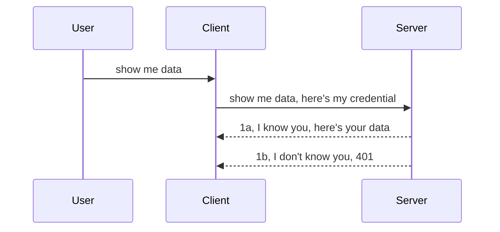

<!--
CO_OP_TRANSLATOR_METADATA:
{
  "original_hash": "5b00b8a8971a07d2d8803be4c9f138f8",
  "translation_date": "2025-10-07T00:57:29+00:00",
  "source_file": "03-GettingStarted/11-simple-auth/README.md",
  "language_code": "id"
}
-->
# Autentikasi Sederhana

SDK MCP mendukung penggunaan OAuth 2.1 yang, sejujurnya, merupakan proses yang cukup rumit melibatkan konsep seperti server autentikasi, server sumber daya, mengirimkan kredensial, mendapatkan kode, menukarkan kode untuk token bearer hingga akhirnya Anda dapat mengakses data sumber daya Anda. Jika Anda belum terbiasa dengan OAuth, yang merupakan hal yang sangat baik untuk diterapkan, ada baiknya memulai dengan tingkat autentikasi dasar dan secara bertahap meningkatkan keamanan. Itulah alasan bab ini ada, untuk membantu Anda membangun autentikasi yang lebih canggih.

## Autentikasi, apa maksudnya?

Autentikasi adalah singkatan dari authentication dan authorization. Idenya adalah kita perlu melakukan dua hal:

- **Authentication**, yaitu proses untuk menentukan apakah kita mengizinkan seseorang masuk ke rumah kita, bahwa mereka memiliki hak untuk berada "di sini", yaitu memiliki akses ke server sumber daya tempat fitur Server MCP kita berada.
- **Authorization**, adalah proses untuk menentukan apakah pengguna seharusnya memiliki akses ke sumber daya tertentu yang mereka minta, misalnya pesanan ini atau produk ini, atau apakah mereka diizinkan untuk membaca konten tetapi tidak menghapusnya sebagai contoh lainnya.

## Kredensial: bagaimana kita memberi tahu sistem siapa kita

Sebagian besar pengembang web biasanya mulai berpikir dalam hal memberikan kredensial ke server, biasanya sebuah rahasia yang menunjukkan apakah mereka diizinkan berada di sini "Authentication". Kredensial ini biasanya berupa versi username dan password yang dikodekan dalam base64 atau kunci API yang secara unik mengidentifikasi pengguna tertentu.

Ini melibatkan pengiriman melalui header yang disebut "Authorization" seperti ini:

```json
{ "Authorization": "secret123" }
```

Ini biasanya disebut sebagai autentikasi dasar. Bagaimana alur keseluruhan bekerja adalah sebagai berikut:



Sekarang kita memahami cara kerjanya dari sudut pandang alur, bagaimana kita mengimplementasikannya? Nah, sebagian besar server web memiliki konsep yang disebut middleware, sebuah potongan kode yang berjalan sebagai bagian dari permintaan yang dapat memverifikasi kredensial, dan jika kredensial valid dapat membiarkan permintaan diteruskan. Jika permintaan tidak memiliki kredensial yang valid, maka Anda akan mendapatkan kesalahan autentikasi. Mari kita lihat bagaimana ini dapat diimplementasikan:

**Python**

```python
class AuthMiddleware(BaseHTTPMiddleware):
    async def dispatch(self, request, call_next):

        has_header = request.headers.get("Authorization")
        if not has_header:
            print("-> Missing Authorization header!")
            return Response(status_code=401, content="Unauthorized")

        if not valid_token(has_header):
            print("-> Invalid token!")
            return Response(status_code=403, content="Forbidden")

        print("Valid token, proceeding...")
       
        response = await call_next(request)
        # add any customer headers or change in the response in some way
        return response


starlette_app.add_middleware(CustomHeaderMiddleware)
```

Di sini kita telah:

- Membuat middleware bernama `AuthMiddleware` di mana metode `dispatch`-nya dipanggil oleh server web.
- Menambahkan middleware ke server web:

    ```python
    starlette_app.add_middleware(AuthMiddleware)
    ```

- Menulis logika validasi yang memeriksa apakah header Authorization ada dan apakah rahasia yang dikirimkan valid:

    ```python
    has_header = request.headers.get("Authorization")
    if not has_header:
        print("-> Missing Authorization header!")
        return Response(status_code=401, content="Unauthorized")

    if not valid_token(has_header):
        print("-> Invalid token!")
        return Response(status_code=403, content="Forbidden")
    ```

    jika rahasia ada dan valid, maka kita membiarkan permintaan diteruskan dengan memanggil `call_next` dan mengembalikan respons.

    ```python
    response = await call_next(request)
    # add any customer headers or change in the response in some way
    return response
    ```

Cara kerjanya adalah jika permintaan web dibuat ke server, middleware akan dipanggil dan berdasarkan implementasinya, middleware akan membiarkan permintaan diteruskan atau mengembalikan kesalahan yang menunjukkan bahwa klien tidak diizinkan untuk melanjutkan.

**TypeScript**

Di sini kita membuat middleware dengan framework populer Express dan mencegat permintaan sebelum mencapai Server MCP. Berikut adalah kode untuk itu:

```typescript
function isValid(secret) {
    return secret === "secret123";
}

app.use((req, res, next) => {
    // 1. Authorization header present?  
    if(!req.headers["Authorization"]) {
        res.status(401).send('Unauthorized');
    }
    
    let token = req.headers["Authorization"];

    // 2. Check validity.
    if(!isValid(token)) {
        res.status(403).send('Forbidden');
    }

   
    console.log('Middleware executed');
    // 3. Passes request to the next step in the request pipeline.
    next();
});
```

Dalam kode ini kita:

1. Memeriksa apakah header Authorization ada, jika tidak, kita mengirimkan kesalahan 401.
2. Memastikan kredensial/token valid, jika tidak, kita mengirimkan kesalahan 403.
3. Akhirnya meneruskan permintaan dalam pipeline permintaan dan mengembalikan sumber daya yang diminta.

## Latihan: Implementasi autentikasi

Mari kita gunakan pengetahuan kita dan mencoba mengimplementasikannya. Berikut rencananya:

Server

- Buat server web dan instance MCP.
- Implementasikan middleware untuk server.

Klien 

- Kirim permintaan web, dengan kredensial, melalui header.

### -1- Buat server web dan instance MCP

Pada langkah pertama, kita perlu membuat instance server web dan Server MCP.

**Python**

Di sini kita membuat instance server MCP, membuat aplikasi web starlette, dan menghostingnya dengan uvicorn.

```python
# creating MCP Server

app = FastMCP(
    name="MCP Resource Server",
    instructions="Resource Server that validates tokens via Authorization Server introspection",
    host=settings["host"],
    port=settings["port"],
    debug=True
)

# creating starlette web app
starlette_app = app.streamable_http_app()

# serving app via uvicorn
async def run(starlette_app):
    import uvicorn
    config = uvicorn.Config(
            starlette_app,
            host=app.settings.host,
            port=app.settings.port,
            log_level=app.settings.log_level.lower(),
        )
    server = uvicorn.Server(config)
    await server.serve()

run(starlette_app)
```

Dalam kode ini kita:

- Membuat Server MCP.
- Membuat aplikasi web starlette dari Server MCP, `app.streamable_http_app()`.
- Menghosting dan melayani aplikasi web menggunakan uvicorn `server.serve()`.

**TypeScript**

Di sini kita membuat instance Server MCP.

```typescript
const server = new McpServer({
      name: "example-server",
      version: "1.0.0"
    });

    // ... set up server resources, tools, and prompts ...
```

Pembuatan Server MCP ini perlu dilakukan dalam definisi rute POST /mcp kita, jadi mari kita ambil kode di atas dan memindahkannya seperti ini:

```typescript
import express from "express";
import { randomUUID } from "node:crypto";
import { McpServer } from "@modelcontextprotocol/sdk/server/mcp.js";
import { StreamableHTTPServerTransport } from "@modelcontextprotocol/sdk/server/streamableHttp.js";
import { isInitializeRequest } from "@modelcontextprotocol/sdk/types.js"

const app = express();
app.use(express.json());

// Map to store transports by session ID
const transports: { [sessionId: string]: StreamableHTTPServerTransport } = {};

// Handle POST requests for client-to-server communication
app.post('/mcp', async (req, res) => {
  // Check for existing session ID
  const sessionId = req.headers['mcp-session-id'] as string | undefined;
  let transport: StreamableHTTPServerTransport;

  if (sessionId && transports[sessionId]) {
    // Reuse existing transport
    transport = transports[sessionId];
  } else if (!sessionId && isInitializeRequest(req.body)) {
    // New initialization request
    transport = new StreamableHTTPServerTransport({
      sessionIdGenerator: () => randomUUID(),
      onsessioninitialized: (sessionId) => {
        // Store the transport by session ID
        transports[sessionId] = transport;
      },
      // DNS rebinding protection is disabled by default for backwards compatibility. If you are running this server
      // locally, make sure to set:
      // enableDnsRebindingProtection: true,
      // allowedHosts: ['127.0.0.1'],
    });

    // Clean up transport when closed
    transport.onclose = () => {
      if (transport.sessionId) {
        delete transports[transport.sessionId];
      }
    };
    const server = new McpServer({
      name: "example-server",
      version: "1.0.0"
    });

    // ... set up server resources, tools, and prompts ...

    // Connect to the MCP server
    await server.connect(transport);
  } else {
    // Invalid request
    res.status(400).json({
      jsonrpc: '2.0',
      error: {
        code: -32000,
        message: 'Bad Request: No valid session ID provided',
      },
      id: null,
    });
    return;
  }

  // Handle the request
  await transport.handleRequest(req, res, req.body);
});

// Reusable handler for GET and DELETE requests
const handleSessionRequest = async (req: express.Request, res: express.Response) => {
  const sessionId = req.headers['mcp-session-id'] as string | undefined;
  if (!sessionId || !transports[sessionId]) {
    res.status(400).send('Invalid or missing session ID');
    return;
  }
  
  const transport = transports[sessionId];
  await transport.handleRequest(req, res);
};

// Handle GET requests for server-to-client notifications via SSE
app.get('/mcp', handleSessionRequest);

// Handle DELETE requests for session termination
app.delete('/mcp', handleSessionRequest);

app.listen(3000);
```

Sekarang Anda melihat bagaimana pembuatan Server MCP dipindahkan ke dalam `app.post("/mcp")`.

Mari kita lanjutkan ke langkah berikutnya untuk membuat middleware sehingga kita dapat memvalidasi kredensial yang masuk.

### -2- Implementasi middleware untuk server

Selanjutnya, kita akan membuat middleware. Di sini kita akan membuat middleware yang mencari kredensial di header `Authorization` dan memvalidasinya. Jika kredensial diterima, maka permintaan akan diteruskan untuk melakukan apa yang diperlukan (misalnya daftar alat, membaca sumber daya, atau fungsi MCP lainnya yang diminta klien).

**Python**

Untuk membuat middleware, kita perlu membuat kelas yang mewarisi dari `BaseHTTPMiddleware`. Ada dua bagian yang menarik:

- Permintaan `request`, yang kita baca informasi header-nya.
- `call_next` callback yang perlu kita panggil jika klien membawa kredensial yang kita terima.

Pertama, kita perlu menangani kasus jika header `Authorization` tidak ada:

```python
has_header = request.headers.get("Authorization")

# no header present, fail with 401, otherwise move on.
if not has_header:
    print("-> Missing Authorization header!")
    return Response(status_code=401, content="Unauthorized")
```

Di sini kita mengirimkan pesan 401 unauthorized karena klien gagal dalam autentikasi.

Selanjutnya, jika kredensial dikirimkan, kita perlu memeriksa validitasnya seperti ini:

```python
 if not valid_token(has_header):
    print("-> Invalid token!")
    return Response(status_code=403, content="Forbidden")
```

Perhatikan bagaimana kita mengirimkan pesan 403 forbidden di atas. Mari kita lihat middleware lengkap di bawah ini yang mengimplementasikan semua yang telah kita sebutkan di atas:

```python
class AuthMiddleware(BaseHTTPMiddleware):
    async def dispatch(self, request, call_next):

        has_header = request.headers.get("Authorization")
        if not has_header:
            print("-> Missing Authorization header!")
            return Response(status_code=401, content="Unauthorized")

        if not valid_token(has_header):
            print("-> Invalid token!")
            return Response(status_code=403, content="Forbidden")

        print("Valid token, proceeding...")
        print(f"-> Received {request.method} {request.url}")
        response = await call_next(request)
        response.headers['Custom'] = 'Example'
        return response

```

Bagus, tetapi bagaimana dengan fungsi `valid_token`? Berikut adalah kodenya:

```python
# DON'T use for production - improve it !!
def valid_token(token: str) -> bool:
    # remove the "Bearer " prefix
    if token.startswith("Bearer "):
        token = token[7:]
        return token == "secret-token"
    return False
```

Ini jelas perlu ditingkatkan.

PENTING: Anda TIDAK PERNAH boleh menyimpan rahasia seperti ini dalam kode. Anda sebaiknya mengambil nilai untuk dibandingkan dari sumber data atau dari IDP (penyedia layanan identitas) atau lebih baik lagi, biarkan IDP melakukan validasi.

**TypeScript**

Untuk mengimplementasikan ini dengan Express, kita perlu memanggil metode `use` yang menerima fungsi middleware.

Kita perlu:

- Berinteraksi dengan variabel permintaan untuk memeriksa kredensial yang dikirimkan dalam properti `Authorization`.
- Memvalidasi kredensial, dan jika valid, biarkan permintaan berlanjut dan biarkan permintaan MCP klien melakukan apa yang seharusnya (misalnya daftar alat, membaca sumber daya, atau hal lain yang terkait MCP).

Di sini, kita memeriksa apakah header `Authorization` ada, dan jika tidak, kita menghentikan permintaan untuk diteruskan:

```typescript
if(!req.headers["authorization"]) {
    res.status(401).send('Unauthorized');
    return;
}
```

Jika header tidak dikirimkan, Anda akan menerima kesalahan 401.

Selanjutnya, kita memeriksa apakah kredensial valid, jika tidak, kita kembali menghentikan permintaan tetapi dengan pesan yang sedikit berbeda:

```typescript
if(!isValid(token)) {
    res.status(403).send('Forbidden');
    return;
} 
```

Perhatikan bagaimana Anda sekarang mendapatkan kesalahan 403.

Berikut adalah kode lengkapnya:

```typescript
app.use((req, res, next) => {
    console.log('Request received:', req.method, req.url, req.headers);
    console.log('Headers:', req.headers["authorization"]);
    if(!req.headers["authorization"]) {
        res.status(401).send('Unauthorized');
        return;
    }
    
    let token = req.headers["authorization"];

    if(!isValid(token)) {
        res.status(403).send('Forbidden');
        return;
    }  

    console.log('Middleware executed');
    next();
});
```

Kita telah mengatur server web untuk menerima middleware yang memeriksa kredensial yang diharapkan dikirimkan oleh klien. Bagaimana dengan klien itu sendiri?

### -3- Kirim permintaan web dengan kredensial melalui header

Kita perlu memastikan klien mengirimkan kredensial melalui header. Karena kita akan menggunakan klien MCP untuk melakukannya, kita perlu mencari tahu bagaimana cara melakukannya.

**Python**

Untuk klien, kita perlu mengirimkan header dengan kredensial kita seperti ini:

```python
# DON'T hardcode the value, have it at minimum in an environment variable or a more secure storage
token = "secret-token"

async with streamablehttp_client(
        url = f"http://localhost:{port}/mcp",
        headers = {"Authorization": f"Bearer {token}"}
    ) as (
        read_stream,
        write_stream,
        session_callback,
    ):
        async with ClientSession(
            read_stream,
            write_stream
        ) as session:
            await session.initialize()
      
            # TODO, what you want done in the client, e.g list tools, call tools etc.
```

Perhatikan bagaimana kita mengisi properti `headers` seperti ini ` headers = {"Authorization": f"Bearer {token}"}`.

**TypeScript**

Kita dapat menyelesaikan ini dalam dua langkah:

1. Mengisi objek konfigurasi dengan kredensial kita.
2. Mengirimkan objek konfigurasi ke transport.

```typescript

// DON'T hardcode the value like shown here. At minimum have it as a env variable and use something like dotenv (in dev mode).
let token = "secret123"

// define a client transport option object
let options: StreamableHTTPClientTransportOptions = {
  sessionId: sessionId,
  requestInit: {
    headers: {
      "Authorization": "secret123"
    }
  }
};

// pass the options object to the transport
async function main() {
   const transport = new StreamableHTTPClientTransport(
      new URL(serverUrl),
      options
   );
```

Di sini Anda melihat bagaimana kita harus membuat objek `options` dan menempatkan header kita di bawah properti `requestInit`.

PENTING: Bagaimana kita meningkatkannya dari sini? Nah, implementasi saat ini memiliki beberapa masalah. Pertama-tama, mengirimkan kredensial seperti ini cukup berisiko kecuali Anda setidaknya menggunakan HTTPS. Bahkan dengan itu, kredensial dapat dicuri sehingga Anda memerlukan sistem di mana Anda dapat dengan mudah mencabut token dan menambahkan pemeriksaan tambahan seperti dari mana asalnya, apakah permintaan terjadi terlalu sering (perilaku seperti bot), singkatnya, ada banyak hal yang perlu dipertimbangkan.

Namun, untuk API yang sangat sederhana di mana Anda tidak ingin siapa pun memanggil API Anda tanpa autentikasi, apa yang kita miliki di sini adalah awal yang baik.

Dengan itu, mari kita coba meningkatkan keamanan sedikit dengan menggunakan format standar seperti JSON Web Token, juga dikenal sebagai JWT atau token "JOT".

## JSON Web Tokens, JWT

Jadi, kita mencoba meningkatkan dari mengirimkan kredensial yang sangat sederhana. Apa peningkatan langsung yang kita dapatkan dengan mengadopsi JWT?

- **Peningkatan keamanan**. Dalam autentikasi dasar, Anda mengirimkan username dan password sebagai token yang dikodekan dalam base64 (atau Anda mengirimkan kunci API) berulang kali yang meningkatkan risiko. Dengan JWT, Anda mengirimkan username dan password dan mendapatkan token sebagai gantinya yang juga memiliki batas waktu sehingga akan kedaluwarsa. JWT memungkinkan Anda dengan mudah menggunakan kontrol akses yang lebih rinci menggunakan peran, cakupan, dan izin. 
- **Tanpa status dan skalabilitas**. JWT bersifat mandiri, mereka membawa semua informasi pengguna dan menghilangkan kebutuhan untuk menyimpan penyimpanan sesi di sisi server. Token juga dapat divalidasi secara lokal.
- **Interoperabilitas dan federasi**. JWT adalah inti dari Open ID Connect dan digunakan dengan penyedia identitas terkenal seperti Entra ID, Google Identity, dan Auth0. Mereka juga memungkinkan penggunaan single sign-on dan banyak lagi, menjadikannya tingkat perusahaan.
- **Modularitas dan fleksibilitas**. JWT juga dapat digunakan dengan API Gateway seperti Azure API Management, NGINX, dan lainnya. Ini juga mendukung skenario autentikasi pengguna dan komunikasi server-ke-server termasuk skenario impersonasi dan delegasi.
- **Performa dan caching**. JWT dapat di-cache setelah decoding yang mengurangi kebutuhan untuk parsing. Ini membantu khususnya dengan aplikasi lalu lintas tinggi karena meningkatkan throughput dan mengurangi beban pada infrastruktur yang Anda pilih.
- **Fitur lanjutan**. Ini juga mendukung introspeksi (memeriksa validitas di server) dan pencabutan (membuat token tidak valid).

Dengan semua manfaat ini, mari kita lihat bagaimana kita dapat membawa implementasi kita ke tingkat berikutnya.

## Mengubah autentikasi dasar menjadi JWT

Jadi, perubahan yang perlu kita lakukan pada tingkat tinggi adalah:

- **Belajar membuat token JWT** dan membuatnya siap untuk dikirim dari klien ke server.
- **Memvalidasi token JWT**, dan jika valid, biarkan klien mengakses sumber daya kita.
- **Penyimpanan token yang aman**. Bagaimana kita menyimpan token ini.
- **Melindungi rute**. Kita perlu melindungi rute, dalam kasus kita, kita perlu melindungi rute dan fitur MCP tertentu.
- **Menambahkan token refresh**. Pastikan kita membuat token yang berumur pendek tetapi token refresh yang berumur panjang yang dapat digunakan untuk mendapatkan token baru jika token kedaluwarsa. Juga pastikan ada endpoint refresh dan strategi rotasi.

### -1- Membuat token JWT

Pertama-tama, token JWT memiliki bagian-bagian berikut:

- **header**, algoritma yang digunakan dan jenis token.
- **payload**, klaim, seperti sub (pengguna atau entitas yang diwakili oleh token. Dalam skenario autentikasi ini biasanya adalah userid), exp (kapan kedaluwarsa) role (peran).
- **signature**, ditandatangani dengan rahasia atau kunci privat.

Untuk ini, kita perlu membuat header, payload, dan token yang dikodekan.

**Python**

```python

import jwt
import jwt
from jwt.exceptions import ExpiredSignatureError, InvalidTokenError
import datetime

# Secret key used to sign the JWT
secret_key = 'your-secret-key'

header = {
    "alg": "HS256",
    "typ": "JWT"
}

# the user info andits claims and expiry time
payload = {
    "sub": "1234567890",               # Subject (user ID)
    "name": "User Userson",                # Custom claim
    "admin": True,                     # Custom claim
    "iat": datetime.datetime.utcnow(),# Issued at
    "exp": datetime.datetime.utcnow() + datetime.timedelta(hours=1)  # Expiry
}

# encode it
encoded_jwt = jwt.encode(payload, secret_key, algorithm="HS256", headers=header)
```

Dalam kode di atas kita telah:

- Mendefinisikan header menggunakan HS256 sebagai algoritma dan jenisnya adalah JWT.
- Membuat payload yang berisi subjek atau id pengguna, username, peran, waktu penerbitan, dan waktu kedaluwarsa sehingga menerapkan aspek batas waktu yang telah kita sebutkan sebelumnya.

**TypeScript**

Di sini kita akan membutuhkan beberapa dependensi yang akan membantu kita membuat token JWT.

Dependensi

```sh

npm install jsonwebtoken
npm install --save-dev @types/jsonwebtoken
```

Sekarang setelah kita memiliki itu, mari kita buat header, payload, dan melalui itu buat token yang dikodekan.

```typescript
import jwt from 'jsonwebtoken';

const secretKey = 'your-secret-key'; // Use env vars in production

// Define the payload
const payload = {
  sub: '1234567890',
  name: 'User usersson',
  admin: true,
  iat: Math.floor(Date.now() / 1000), // Issued at
  exp: Math.floor(Date.now() / 1000) + 60 * 60 // Expires in 1 hour
};

// Define the header (optional, jsonwebtoken sets defaults)
const header = {
  alg: 'HS256',
  typ: 'JWT'
};

// Create the token
const token = jwt.sign(payload, secretKey, {
  algorithm: 'HS256',
  header: header
});

console.log('JWT:', token);
```

Token ini:

Ditandatangani menggunakan HS256
Berlaku selama 1 jam
Mencakup klaim seperti sub, name, admin, iat, dan exp.

### -2- Memvalidasi token

Kita juga perlu memvalidasi token, ini adalah sesuatu yang harus kita lakukan di server untuk memastikan apa yang dikirimkan klien kepada kita benar-benar valid. Ada banyak pemeriksaan yang harus kita lakukan di sini, mulai dari memvalidasi strukturnya hingga validitasnya. Anda juga disarankan untuk menambahkan pemeriksaan lain untuk melihat apakah pengguna ada dalam sistem Anda dan lainnya.

Untuk memvalidasi token, kita perlu mendekodekannya sehingga kita dapat membacanya dan kemudian mulai memeriksa validitasnya:

**Python**

```python

# Decode and verify the JWT
try:
    decoded = jwt.decode(token, secret_key, algorithms=["HS256"])
    print("✅ Token is valid.")
    print("Decoded claims:")
    for key, value in decoded.items():
        print(f"  {key}: {value}")
except ExpiredSignatureError:
    print("❌ Token has expired.")
except InvalidTokenError as e:
    print(f"❌ Invalid token: {e}")

```

Dalam kode ini, kita memanggil `jwt.decode` menggunakan token, kunci rahasia, dan algoritma yang dipilih sebagai input. Perhatikan bagaimana kita menggunakan konstruksi try-catch karena validasi yang gagal akan menyebabkan error.

**TypeScript**

Di sini kita perlu memanggil `jwt.verify` untuk mendapatkan versi token yang telah didekodekan sehingga kita dapat menganalisisnya lebih lanjut. Jika panggilan ini gagal, itu berarti struktur token tidak benar atau tidak lagi valid.

```typescript

try {
  const decoded = jwt.verify(token, secretKey);
  console.log('Decoded Payload:', decoded);
} catch (err) {
  console.error('Token verification failed:', err);
}
```

CATATAN: seperti yang disebutkan sebelumnya, kita harus melakukan pemeriksaan tambahan untuk memastikan token ini menunjukkan pengguna dalam sistem kita dan memastikan pengguna memiliki hak yang diklaimnya.
Selanjutnya, mari kita bahas kontrol akses berbasis peran, yang juga dikenal sebagai RBAC.

## Menambahkan kontrol akses berbasis peran

Idenya adalah kita ingin menyatakan bahwa peran yang berbeda memiliki izin yang berbeda. Sebagai contoh, kita mengasumsikan bahwa admin dapat melakukan segalanya, pengguna biasa dapat membaca/menulis, dan tamu hanya dapat membaca. Oleh karena itu, berikut adalah beberapa tingkat izin yang mungkin:

- Admin.Write 
- User.Read
- Guest.Read

Mari kita lihat bagaimana kita dapat mengimplementasikan kontrol seperti ini dengan middleware. Middleware dapat ditambahkan per rute maupun untuk semua rute.

**Python**

```python
from starlette.middleware.base import BaseHTTPMiddleware
from starlette.responses import JSONResponse
import jwt

# DON'T have the secret in the code like, this is for demonstration purposes only. Read it from a safe place.
SECRET_KEY = "your-secret-key" # put this in env variable
REQUIRED_PERMISSION = "User.Read"

class JWTPermissionMiddleware(BaseHTTPMiddleware):
    async def dispatch(self, request, call_next):
        auth_header = request.headers.get("Authorization")
        if not auth_header or not auth_header.startswith("Bearer "):
            return JSONResponse({"error": "Missing or invalid Authorization header"}, status_code=401)

        token = auth_header.split(" ")[1]
        try:
            decoded = jwt.decode(token, SECRET_KEY, algorithms=["HS256"])
        except jwt.ExpiredSignatureError:
            return JSONResponse({"error": "Token expired"}, status_code=401)
        except jwt.InvalidTokenError:
            return JSONResponse({"error": "Invalid token"}, status_code=401)

        permissions = decoded.get("permissions", [])
        if REQUIRED_PERMISSION not in permissions:
            return JSONResponse({"error": "Permission denied"}, status_code=403)

        request.state.user = decoded
        return await call_next(request)


```

Ada beberapa cara berbeda untuk menambahkan middleware seperti di bawah ini:

```python

# Alt 1: add middleware while constructing starlette app
middleware = [
    Middleware(JWTPermissionMiddleware)
]

app = Starlette(routes=routes, middleware=middleware)

# Alt 2: add middleware after starlette app is a already constructed
starlette_app.add_middleware(JWTPermissionMiddleware)

# Alt 3: add middleware per route
routes = [
    Route(
        "/mcp",
        endpoint=..., # handler
        middleware=[Middleware(JWTPermissionMiddleware)]
    )
]
```

**TypeScript**

Kita dapat menggunakan `app.use` dan middleware yang akan dijalankan untuk semua permintaan.

```typescript
app.use((req, res, next) => {
    console.log('Request received:', req.method, req.url, req.headers);
    console.log('Headers:', req.headers["authorization"]);

    // 1. Check if authorization header has been sent

    if(!req.headers["authorization"]) {
        res.status(401).send('Unauthorized');
        return;
    }
    
    let token = req.headers["authorization"];

    // 2. Check if token is valid
    if(!isValid(token)) {
        res.status(403).send('Forbidden');
        return;
    }  

    // 3. Check if token user exist in our system
    if(!isExistingUser(token)) {
        res.status(403).send('Forbidden');
        console.log("User does not exist");
        return;
    }
    console.log("User exists");

    // 4. Verify the token has the right permissions
    if(!hasScopes(token, ["User.Read"])){
        res.status(403).send('Forbidden - insufficient scopes');
    }

    console.log("User has required scopes");

    console.log('Middleware executed');
    next();
});

```

Ada beberapa hal yang dapat kita biarkan middleware kita lakukan dan yang HARUS dilakukan oleh middleware kita, yaitu:

1. Memeriksa apakah header otorisasi ada
2. Memeriksa apakah token valid, kita memanggil `isValid` yang merupakan metode yang kita tulis untuk memeriksa integritas dan validitas token JWT.
3. Memverifikasi bahwa pengguna ada dalam sistem kita, kita harus memeriksanya.

   ```typescript
    // users in DB
   const users = [
     "user1",
     "User usersson",
   ]

   function isExistingUser(token) {
     let decodedToken = verifyToken(token);

     // TODO, check if user exists in DB
     return users.includes(decodedToken?.name || "");
   }
   ```

   Di atas, kita telah membuat daftar `users` yang sangat sederhana, yang seharusnya ada di dalam database tentunya.

4. Selain itu, kita juga harus memeriksa apakah token memiliki izin yang sesuai.

   ```typescript
   if(!hasScopes(token, ["User.Read"])){
        res.status(403).send('Forbidden - insufficient scopes');
   }
   ```

   Dalam kode di atas dari middleware, kita memeriksa bahwa token berisi izin User.Read, jika tidak, kita mengirimkan error 403. Di bawah ini adalah metode pembantu `hasScopes`.

   ```typescript
   function hasScopes(scope: string, requiredScopes: string[]) {
     let decodedToken = verifyToken(scope);
    return requiredScopes.every(scope => decodedToken?.scopes.includes(scope));
  }
   ```

Have a think which additional checks you should be doing, but these are the absolute minimum of checks you should be doing.

Using Express as a web framework is a common choice. There are helpers library when you use JWT so you can write less code.

- `express-jwt`, helper library that provides a middleware that helps decode your token.
- `express-jwt-permissions`, this provides a middleware `guard` that helps check if a certain permission is on the token.

Here's what these libraries can look like when used:

```typescript
const express = require('express');
const jwt = require('express-jwt');
const guard = require('express-jwt-permissions')();

const app = express();
const secretKey = 'your-secret-key'; // put this in env variable

// Decode JWT and attach to req.user
app.use(jwt({ secret: secretKey, algorithms: ['HS256'] }));

// Check for User.Read permission
app.use(guard.check('User.Read'));

// multiple permissions
// app.use(guard.check(['User.Read', 'Admin.Access']));

app.get('/protected', (req, res) => {
  res.json({ message: `Welcome ${req.user.name}` });
});

// Error handler
app.use((err, req, res, next) => {
  if (err.code === 'permission_denied') {
    return res.status(403).send('Forbidden');
  }
  next(err);
});

```

Sekarang Anda telah melihat bagaimana middleware dapat digunakan untuk otentikasi dan otorisasi, bagaimana dengan MCP? Apakah itu mengubah cara kita melakukan otentikasi? Mari kita cari tahu di bagian berikutnya.

### -3- Menambahkan RBAC ke MCP

Anda telah melihat sejauh ini bagaimana Anda dapat menambahkan RBAC melalui middleware, namun, untuk MCP tidak ada cara mudah untuk menambahkan RBAC per fitur MCP, jadi apa yang harus kita lakukan? Nah, kita hanya perlu menambahkan kode seperti ini yang memeriksa apakah klien memiliki hak untuk memanggil alat tertentu:

Anda memiliki beberapa pilihan berbeda tentang bagaimana mencapai RBAC per fitur, berikut adalah beberapa:

- Menambahkan pemeriksaan untuk setiap alat, sumber daya, atau prompt di mana Anda perlu memeriksa tingkat izin.

   **Python**

   ```python
   @tool()
   def delete_product(id: int):
      try:
          check_permissions(role="Admin.Write", request)
      catch:
        pass # client failed authorization, raise authorization error
   ```

   **TypeScript**

   ```typescript
   server.registerTool(
    "delete-product",
    {
      title: Delete a product",
      description: "Deletes a product",
      inputSchema: { id: z.number() }
    },
    async ({ id }) => {
      
      try {
        checkPermissions("Admin.Write", request);
        // todo, send id to productService and remote entry
      } catch(Exception e) {
        console.log("Authorization error, you're not allowed");  
      }

      return {
        content: [{ type: "text", text: `Deletected product with id ${id}` }]
      };
    }
   );
   ```


- Menggunakan pendekatan server yang lebih canggih dan pengelola permintaan sehingga Anda dapat meminimalkan jumlah tempat di mana Anda perlu melakukan pemeriksaan.

   **Python**

   ```python
   
   tool_permission = {
      "create_product": ["User.Write", "Admin.Write"],
      "delete_product": ["Admin.Write"]
   }

   def has_permission(user_permissions, required_permissions) -> bool:
      # user_permissions: list of permissions the user has
      # required_permissions: list of permissions required for the tool
      return any(perm in user_permissions for perm in required_permissions)

   @server.call_tool()
   async def handle_call_tool(
     name: str, arguments: dict[str, str] | None
   ) -> list[types.TextContent]:
    # Assume request.user.permissions is a list of permissions for the user
     user_permissions = request.user.permissions
     required_permissions = tool_permission.get(name, [])
     if not has_permission(user_permissions, required_permissions):
        # Raise error "You don't have permission to call tool {name}"
        raise Exception(f"You don't have permission to call tool {name}")
     # carry on and call tool
     # ...
   ```   
   

   **TypeScript**

   ```typescript
   function hasPermission(userPermissions: string[], requiredPermissions: string[]): boolean {
       if (!Array.isArray(userPermissions) || !Array.isArray(requiredPermissions)) return false;
       // Return true if user has at least one required permission
       
       return requiredPermissions.some(perm => userPermissions.includes(perm));
   }
  
   server.setRequestHandler(CallToolRequestSchema, async (request) => {
      const { params: { name } } = request;
  
      let permissions = request.user.permissions;
  
      if (!hasPermission(permissions, toolPermissions[name])) {
         return new Error(`You don't have permission to call ${name}`);
      }
  
      // carry on..
   });
   ```

   Catatan, Anda perlu memastikan middleware Anda menetapkan token yang telah didekodekan ke properti pengguna pada permintaan agar kode di atas menjadi lebih sederhana.

### Kesimpulan

Sekarang kita telah membahas bagaimana menambahkan dukungan untuk RBAC secara umum dan untuk MCP secara khusus, saatnya mencoba menerapkan keamanan sendiri untuk memastikan Anda memahami konsep yang telah disampaikan.

## Tugas 1: Bangun server MCP dan klien MCP menggunakan otentikasi dasar

Di sini Anda akan menggunakan apa yang telah Anda pelajari dalam hal mengirim kredensial melalui header.

## Solusi 1

[Solusi 1](./code/basic/README.md)

## Tugas 2: Tingkatkan solusi dari Tugas 1 untuk menggunakan JWT

Ambil solusi pertama tetapi kali ini, mari kita tingkatkan.

Alih-alih menggunakan Basic Auth, mari kita gunakan JWT.

## Solusi 2

[Solusi 2](./solution/jwt-solution/README.md)

## Tantangan

Tambahkan RBAC per alat seperti yang kami jelaskan di bagian "Menambahkan RBAC ke MCP".

## Ringkasan

Semoga Anda telah banyak belajar di bab ini, mulai dari tidak ada keamanan sama sekali, hingga keamanan dasar, hingga JWT dan bagaimana itu dapat ditambahkan ke MCP.

Kita telah membangun fondasi yang kuat dengan JWT kustom, tetapi saat kita berkembang, kita akan beralih ke model identitas berbasis standar. Mengadopsi IdP seperti Entra atau Keycloak memungkinkan kita untuk menyerahkan penerbitan token, validasi, dan manajemen siklus hidup kepada platform yang terpercaya — sehingga kita dapat fokus pada logika aplikasi dan pengalaman pengguna.

Untuk itu, kami memiliki [bab yang lebih lanjut tentang Entra](../../05-AdvancedTopics/mcp-security-entra/README.md)

---

**Penafian**:  
Dokumen ini telah diterjemahkan menggunakan layanan penerjemahan AI [Co-op Translator](https://github.com/Azure/co-op-translator). Meskipun kami berupaya untuk memberikan hasil yang akurat, harap diperhatikan bahwa terjemahan otomatis mungkin mengandung kesalahan atau ketidakakuratan. Dokumen asli dalam bahasa aslinya harus dianggap sebagai sumber yang otoritatif. Untuk informasi yang bersifat kritis, disarankan menggunakan jasa penerjemahan manusia profesional. Kami tidak bertanggung jawab atas kesalahpahaman atau penafsiran yang keliru yang timbul dari penggunaan terjemahan ini.