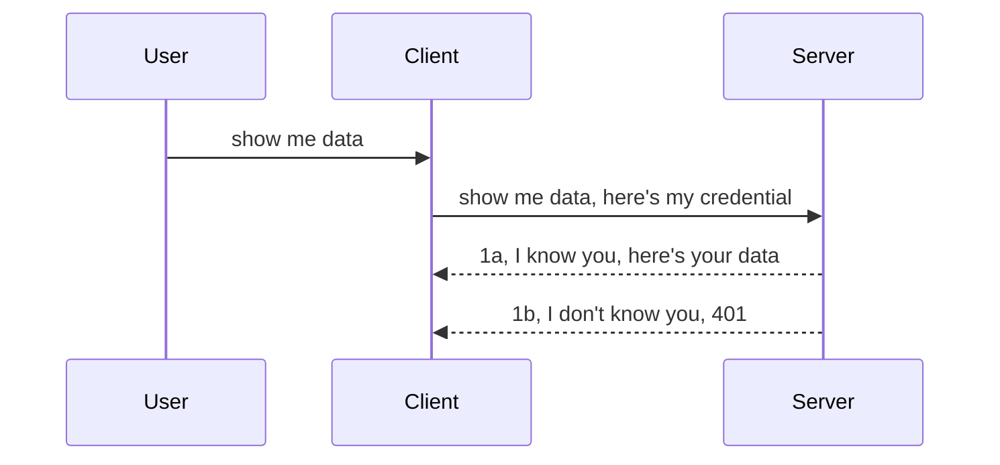

<!--
CO_OP_TRANSLATOR_METADATA:
{
  "original_hash": "5b00b8a8971a07d2d8803be4c9f138f8",
  "translation_date": "2025-10-07T00:47:07+00:00",
  "source_file": "03-GettingStarted/11-simple-auth/README.md",
  "language_code": "it"
}
-->
# Autenticazione semplice

Gli SDK di MCP supportano l'uso di OAuth 2.1, che, a essere onesti, è un processo piuttosto complesso che coinvolge concetti come server di autenticazione, server di risorse, invio delle credenziali, ottenimento di un codice, scambio del codice per un token bearer, fino a quando finalmente si possono ottenere i dati delle risorse. Se non hai familiarità con OAuth, che è comunque un'ottima soluzione da implementare, è una buona idea iniziare con un livello base di autenticazione e poi migliorare progressivamente la sicurezza. È per questo che esiste questo capitolo: per guidarti verso un'autenticazione più avanzata.

## Autenticazione: cosa intendiamo?

"Auth" è l'abbreviazione di autenticazione e autorizzazione. L'idea è che dobbiamo fare due cose:

- **Autenticazione**, che è il processo di verificare se permettiamo a una persona di entrare nella nostra "casa", ovvero se ha il diritto di accedere al nostro server di risorse, dove risiedono le funzionalità del server MCP.
- **Autorizzazione**, che è il processo di determinare se un utente dovrebbe avere accesso alle risorse specifiche che sta richiedendo, ad esempio determinati ordini o prodotti, o se è autorizzato solo a leggere il contenuto ma non a eliminarlo, come altro esempio.

## Credenziali: come diciamo al sistema chi siamo

La maggior parte degli sviluppatori web inizia pensando in termini di fornire una credenziale al server, di solito un segreto che indica se sono autorizzati a essere lì ("Autenticazione"). Questa credenziale è solitamente una versione codificata in base64 di un nome utente e una password o una chiave API che identifica in modo univoco un utente specifico.

Questo comporta l'invio della credenziale tramite un'intestazione chiamata "Authorization", come segue:

```json
{ "Authorization": "secret123" }
```

Questo è solitamente noto come autenticazione di base. Il flusso generale funziona nel seguente modo:



Ora che abbiamo capito come funziona dal punto di vista del flusso, come lo implementiamo? Bene, la maggior parte dei server web ha un concetto chiamato middleware, un pezzo di codice che viene eseguito come parte della richiesta e che può verificare le credenziali. Se le credenziali sono valide, la richiesta può passare. Se la richiesta non ha credenziali valide, si ottiene un errore di autenticazione. Vediamo come può essere implementato:

**Python**

```python
class AuthMiddleware(BaseHTTPMiddleware):
    async def dispatch(self, request, call_next):

        has_header = request.headers.get("Authorization")
        if not has_header:
            print("-> Missing Authorization header!")
            return Response(status_code=401, content="Unauthorized")

        if not valid_token(has_header):
            print("-> Invalid token!")
            return Response(status_code=403, content="Forbidden")

        print("Valid token, proceeding...")
       
        response = await call_next(request)
        # add any customer headers or change in the response in some way
        return response


starlette_app.add_middleware(CustomHeaderMiddleware)
```

Qui abbiamo:

- Creato un middleware chiamato `AuthMiddleware`, il cui metodo `dispatch` viene invocato dal server web.
- Aggiunto il middleware al server web:

    ```python
    starlette_app.add_middleware(AuthMiddleware)
    ```

- Scritto la logica di validazione che controlla se l'intestazione Authorization è presente e se il segreto inviato è valido:

    ```python
    has_header = request.headers.get("Authorization")
    if not has_header:
        print("-> Missing Authorization header!")
        return Response(status_code=401, content="Unauthorized")

    if not valid_token(has_header):
        print("-> Invalid token!")
        return Response(status_code=403, content="Forbidden")
    ```

    Se il segreto è presente e valido, lasciamo passare la richiesta chiamando `call_next` e restituiamo la risposta.

    ```python
    response = await call_next(request)
    # add any customer headers or change in the response in some way
    return response
    ```

Il funzionamento è che, se viene effettuata una richiesta web al server, il middleware viene invocato e, in base alla sua implementazione, lascia passare la richiesta o restituisce un errore che indica che il client non è autorizzato a procedere.

**TypeScript**

Qui creiamo un middleware con il popolare framework Express e intercettiamo la richiesta prima che raggiunga il server MCP. Ecco il codice:

```typescript
function isValid(secret) {
    return secret === "secret123";
}

app.use((req, res, next) => {
    // 1. Authorization header present?  
    if(!req.headers["Authorization"]) {
        res.status(401).send('Unauthorized');
    }
    
    let token = req.headers["Authorization"];

    // 2. Check validity.
    if(!isValid(token)) {
        res.status(403).send('Forbidden');
    }

   
    console.log('Middleware executed');
    // 3. Passes request to the next step in the request pipeline.
    next();
});
```

In questo codice:

1. Controlliamo se l'intestazione Authorization è presente; in caso contrario, inviamo un errore 401.
2. Verifichiamo che la credenziale/token sia valida; in caso contrario, inviamo un errore 403.
3. Infine, lasciamo passare la richiesta nella pipeline e restituiamo la risorsa richiesta.

## Esercizio: implementare l'autenticazione

Mettiamo in pratica ciò che abbiamo imparato e proviamo a implementarlo. Ecco il piano:

Server

- Creare un server web e un'istanza MCP.
- Implementare un middleware per il server.

Client 

- Inviare una richiesta web, con credenziale, tramite intestazione.

### -1- Creare un server web e un'istanza MCP

Nel primo passaggio, dobbiamo creare l'istanza del server web e il server MCP.

**Python**

Qui creiamo un'istanza del server MCP, un'app web Starlette e la ospitiamo con uvicorn.

```python
# creating MCP Server

app = FastMCP(
    name="MCP Resource Server",
    instructions="Resource Server that validates tokens via Authorization Server introspection",
    host=settings["host"],
    port=settings["port"],
    debug=True
)

# creating starlette web app
starlette_app = app.streamable_http_app()

# serving app via uvicorn
async def run(starlette_app):
    import uvicorn
    config = uvicorn.Config(
            starlette_app,
            host=app.settings.host,
            port=app.settings.port,
            log_level=app.settings.log_level.lower(),
        )
    server = uvicorn.Server(config)
    await server.serve()

run(starlette_app)
```

In questo codice:

- Creiamo il server MCP.
- Costruiamo l'app web Starlette dal server MCP, `app.streamable_http_app()`.
- Ospitiamo e serviamo l'app web usando uvicorn `server.serve()`.

**TypeScript**

Qui creiamo un'istanza del server MCP.

```typescript
const server = new McpServer({
      name: "example-server",
      version: "1.0.0"
    });

    // ... set up server resources, tools, and prompts ...
```

Questa creazione del server MCP deve avvenire all'interno della definizione del nostro route POST /mcp, quindi spostiamo il codice sopra in questo modo:

```typescript
import express from "express";
import { randomUUID } from "node:crypto";
import { McpServer } from "@modelcontextprotocol/sdk/server/mcp.js";
import { StreamableHTTPServerTransport } from "@modelcontextprotocol/sdk/server/streamableHttp.js";
import { isInitializeRequest } from "@modelcontextprotocol/sdk/types.js"

const app = express();
app.use(express.json());

// Map to store transports by session ID
const transports: { [sessionId: string]: StreamableHTTPServerTransport } = {};

// Handle POST requests for client-to-server communication
app.post('/mcp', async (req, res) => {
  // Check for existing session ID
  const sessionId = req.headers['mcp-session-id'] as string | undefined;
  let transport: StreamableHTTPServerTransport;

  if (sessionId && transports[sessionId]) {
    // Reuse existing transport
    transport = transports[sessionId];
  } else if (!sessionId && isInitializeRequest(req.body)) {
    // New initialization request
    transport = new StreamableHTTPServerTransport({
      sessionIdGenerator: () => randomUUID(),
      onsessioninitialized: (sessionId) => {
        // Store the transport by session ID
        transports[sessionId] = transport;
      },
      // DNS rebinding protection is disabled by default for backwards compatibility. If you are running this server
      // locally, make sure to set:
      // enableDnsRebindingProtection: true,
      // allowedHosts: ['127.0.0.1'],
    });

    // Clean up transport when closed
    transport.onclose = () => {
      if (transport.sessionId) {
        delete transports[transport.sessionId];
      }
    };
    const server = new McpServer({
      name: "example-server",
      version: "1.0.0"
    });

    // ... set up server resources, tools, and prompts ...

    // Connect to the MCP server
    await server.connect(transport);
  } else {
    // Invalid request
    res.status(400).json({
      jsonrpc: '2.0',
      error: {
        code: -32000,
        message: 'Bad Request: No valid session ID provided',
      },
      id: null,
    });
    return;
  }

  // Handle the request
  await transport.handleRequest(req, res, req.body);
});

// Reusable handler for GET and DELETE requests
const handleSessionRequest = async (req: express.Request, res: express.Response) => {
  const sessionId = req.headers['mcp-session-id'] as string | undefined;
  if (!sessionId || !transports[sessionId]) {
    res.status(400).send('Invalid or missing session ID');
    return;
  }
  
  const transport = transports[sessionId];
  await transport.handleRequest(req, res);
};

// Handle GET requests for server-to-client notifications via SSE
app.get('/mcp', handleSessionRequest);

// Handle DELETE requests for session termination
app.delete('/mcp', handleSessionRequest);

app.listen(3000);
```

Ora puoi vedere come la creazione del server MCP è stata spostata all'interno di `app.post("/mcp")`.

Passiamo al passaggio successivo: creare il middleware per convalidare la credenziale in arrivo.

### -2- Implementare un middleware per il server

Passiamo ora alla parte del middleware. Qui creeremo un middleware che cerca una credenziale nell'intestazione `Authorization` e la convalida. Se è accettabile, la richiesta procederà per fare ciò che deve (ad esempio elencare strumenti, leggere una risorsa o qualsiasi funzionalità MCP richiesta dal client).

**Python**

Per creare il middleware, dobbiamo creare una classe che eredita da `BaseHTTPMiddleware`. Ci sono due elementi interessanti:

- La richiesta `request`, da cui leggiamo le informazioni dell'intestazione.
- `call_next`, il callback che dobbiamo invocare se il client ha fornito una credenziale che accettiamo.

Per prima cosa, dobbiamo gestire il caso in cui l'intestazione `Authorization` sia mancante:

```python
has_header = request.headers.get("Authorization")

# no header present, fail with 401, otherwise move on.
if not has_header:
    print("-> Missing Authorization header!")
    return Response(status_code=401, content="Unauthorized")
```

Qui inviamo un messaggio 401 Unauthorized poiché il client non supera l'autenticazione.

Successivamente, se è stata inviata una credenziale, dobbiamo verificarne la validità in questo modo:

```python
 if not valid_token(has_header):
    print("-> Invalid token!")
    return Response(status_code=403, content="Forbidden")
```

Nota come inviamo un messaggio 403 Forbidden sopra. Vediamo il middleware completo che implementa tutto ciò che abbiamo menzionato:

```python
class AuthMiddleware(BaseHTTPMiddleware):
    async def dispatch(self, request, call_next):

        has_header = request.headers.get("Authorization")
        if not has_header:
            print("-> Missing Authorization header!")
            return Response(status_code=401, content="Unauthorized")

        if not valid_token(has_header):
            print("-> Invalid token!")
            return Response(status_code=403, content="Forbidden")

        print("Valid token, proceeding...")
        print(f"-> Received {request.method} {request.url}")
        response = await call_next(request)
        response.headers['Custom'] = 'Example'
        return response

```

Ottimo, ma che dire della funzione `valid_token`? Eccola qui sotto:

```python
# DON'T use for production - improve it !!
def valid_token(token: str) -> bool:
    # remove the "Bearer " prefix
    if token.startswith("Bearer "):
        token = token[7:]
        return token == "secret-token"
    return False
```

Questo dovrebbe ovviamente essere migliorato.

IMPORTANTE: Non dovresti MAI avere segreti come questo nel codice. Dovresti idealmente recuperare il valore da confrontare da una fonte dati o da un IDP (identity service provider) o, meglio ancora, lasciare che sia l'IDP a occuparsi della convalida.

**TypeScript**

Per implementarlo con Express, dobbiamo chiamare il metodo `use`, che accetta funzioni middleware.

Dobbiamo:

- Interagire con la variabile della richiesta per controllare la credenziale passata nella proprietà `Authorization`.
- Convalidare la credenziale e, se valida, lasciare che la richiesta continui e che la richiesta MCP del client faccia ciò che deve (ad esempio elencare strumenti, leggere risorse o altro relativo a MCP).

Qui controlliamo se l'intestazione `Authorization` è presente e, in caso contrario, interrompiamo la richiesta:

```typescript
if(!req.headers["authorization"]) {
    res.status(401).send('Unauthorized');
    return;
}
```

Se l'intestazione non viene inviata, ricevi un errore 401.

Successivamente, controlliamo se la credenziale è valida; in caso contrario, interrompiamo nuovamente la richiesta ma con un messaggio leggermente diverso:

```typescript
if(!isValid(token)) {
    res.status(403).send('Forbidden');
    return;
} 
```

Nota come ora ricevi un errore 403.

Ecco il codice completo:

```typescript
app.use((req, res, next) => {
    console.log('Request received:', req.method, req.url, req.headers);
    console.log('Headers:', req.headers["authorization"]);
    if(!req.headers["authorization"]) {
        res.status(401).send('Unauthorized');
        return;
    }
    
    let token = req.headers["authorization"];

    if(!isValid(token)) {
        res.status(403).send('Forbidden');
        return;
    }  

    console.log('Middleware executed');
    next();
});
```

Abbiamo configurato il server web per accettare un middleware che controlla la credenziale che il client ci sta inviando. E il client stesso?

### -3- Inviare una richiesta web con credenziale tramite intestazione

Dobbiamo assicurarci che il client stia passando la credenziale tramite l'intestazione. Poiché utilizzeremo un client MCP per farlo, dobbiamo capire come si fa.

**Python**

Per il client, dobbiamo passare un'intestazione con la nostra credenziale in questo modo:

```python
# DON'T hardcode the value, have it at minimum in an environment variable or a more secure storage
token = "secret-token"

async with streamablehttp_client(
        url = f"http://localhost:{port}/mcp",
        headers = {"Authorization": f"Bearer {token}"}
    ) as (
        read_stream,
        write_stream,
        session_callback,
    ):
        async with ClientSession(
            read_stream,
            write_stream
        ) as session:
            await session.initialize()
      
            # TODO, what you want done in the client, e.g list tools, call tools etc.
```

Nota come popoliamo la proprietà `headers` in questo modo: `headers = {"Authorization": f"Bearer {token}"}`.

**TypeScript**

Possiamo risolvere questo in due passaggi:

1. Popolare un oggetto di configurazione con la nostra credenziale.
2. Passare l'oggetto di configurazione al trasporto.

```typescript

// DON'T hardcode the value like shown here. At minimum have it as a env variable and use something like dotenv (in dev mode).
let token = "secret123"

// define a client transport option object
let options: StreamableHTTPClientTransportOptions = {
  sessionId: sessionId,
  requestInit: {
    headers: {
      "Authorization": "secret123"
    }
  }
};

// pass the options object to the transport
async function main() {
   const transport = new StreamableHTTPClientTransport(
      new URL(serverUrl),
      options
   );
```

Qui vedi come abbiamo dovuto creare un oggetto `options` e posizionare le nostre intestazioni sotto la proprietà `requestInit`.

IMPORTANTE: Come possiamo migliorare da qui? Bene, l'implementazione attuale presenta alcuni problemi. Innanzitutto, passare una credenziale in questo modo è piuttosto rischioso a meno che tu non abbia almeno HTTPS. Anche in quel caso, la credenziale può essere rubata, quindi hai bisogno di un sistema in cui puoi facilmente revocare il token e aggiungere controlli aggiuntivi, come verificare da dove proviene la richiesta, se avviene troppo spesso (comportamento simile a un bot), e così via. Ci sono molte altre preoccupazioni.

Detto ciò, per API molto semplici in cui non vuoi che nessuno chiami la tua API senza essere autenticato, ciò che abbiamo qui è un buon inizio.

Detto questo, proviamo a rafforzare un po' la sicurezza utilizzando un formato standardizzato come JSON Web Token, noto anche come JWT o "JOT" token.

## JSON Web Token, JWT

Quindi, stiamo cercando di migliorare rispetto all'invio di credenziali molto semplici. Quali sono i miglioramenti immediati che otteniamo adottando JWT?

- **Miglioramenti alla sicurezza**. Nell'autenticazione di base, invii il nome utente e la password come token codificato in base64 (o invii una chiave API) più e più volte, aumentando il rischio. Con JWT, invii il nome utente e la password e ottieni un token in cambio, che è anche a tempo determinato, il che significa che scadrà. JWT ti consente di utilizzare facilmente un controllo degli accessi dettagliato utilizzando ruoli, ambiti e permessi.
- **Statelessness e scalabilità**. I JWT sono autonomi, contengono tutte le informazioni sull'utente ed eliminano la necessità di memorizzare sessioni lato server. I token possono anche essere convalidati localmente.
- **Interoperabilità e federazione**. I JWT sono centrali per Open ID Connect e vengono utilizzati con provider di identità noti come Entra ID, Google Identity e Auth0. Consentono anche di utilizzare il single sign-on e molto altro, rendendoli di livello aziendale.
- **Modularità e flessibilità**. I JWT possono essere utilizzati anche con API Gateway come Azure API Management, NGINX e altri. Supportano anche scenari di autenticazione e comunicazione server-to-server, inclusi scenari di impersonificazione e delega.
- **Prestazioni e caching**. I JWT possono essere memorizzati nella cache dopo la decodifica, riducendo la necessità di analisi. Questo aiuta in particolare con app ad alto traffico, migliorando il throughput e riducendo il carico sull'infrastruttura scelta.
- **Funzionalità avanzate**. Supportano anche introspezione (controllo della validità sul server) e revoca (rendere un token non valido).

Con tutti questi vantaggi, vediamo come possiamo portare la nostra implementazione al livello successivo.

## Trasformare l'autenticazione di base in JWT

Quindi, i cambiamenti che dobbiamo fare a livello generale sono:

- **Imparare a costruire un token JWT** e renderlo pronto per essere inviato dal client al server.
- **Convalidare un token JWT**, e se valido, consentire al client di accedere alle nostre risorse.
- **Proteggere l'archiviazione del token**. Come memorizziamo questo token.
- **Proteggere le rotte**. Dobbiamo proteggere le rotte, nel nostro caso, dobbiamo proteggere le rotte e le funzionalità specifiche di MCP.
- **Aggiungere token di aggiornamento**. Assicurarci di creare token a breve durata ma token di aggiornamento a lunga durata che possono essere utilizzati per ottenere nuovi token se scadono. Inoltre, assicurarci che ci sia un endpoint di aggiornamento e una strategia di rotazione.

### -1- Costruire un token JWT

Innanzitutto, un token JWT ha le seguenti parti:

- **Header**, algoritmo utilizzato e tipo di token.
- **Payload**, claim, come sub (l'utente o l'entità che il token rappresenta. In uno scenario di autenticazione, questo è tipicamente l'ID utente), exp (quando scade), role (il ruolo).
- **Signature**, firmata con un segreto o una chiave privata.

Per questo, dovremo costruire l'header, il payload e il token codificato.

**Python**

```python

import jwt
import jwt
from jwt.exceptions import ExpiredSignatureError, InvalidTokenError
import datetime

# Secret key used to sign the JWT
secret_key = 'your-secret-key'

header = {
    "alg": "HS256",
    "typ": "JWT"
}

# the user info andits claims and expiry time
payload = {
    "sub": "1234567890",               # Subject (user ID)
    "name": "User Userson",                # Custom claim
    "admin": True,                     # Custom claim
    "iat": datetime.datetime.utcnow(),# Issued at
    "exp": datetime.datetime.utcnow() + datetime.timedelta(hours=1)  # Expiry
}

# encode it
encoded_jwt = jwt.encode(payload, secret_key, algorithm="HS256", headers=header)
```

Nel codice sopra abbiamo:

- Definito un header utilizzando HS256 come algoritmo e il tipo impostato su JWT.
- Costruito un payload che contiene un soggetto o ID utente, un nome utente, un ruolo, quando è stato emesso e quando è impostato per scadere, implementando così l'aspetto a tempo determinato menzionato in precedenza.

**TypeScript**

Qui avremo bisogno di alcune dipendenze che ci aiuteranno a costruire il token JWT.

Dipendenze

```sh

npm install jsonwebtoken
npm install --save-dev @types/jsonwebtoken
```

Ora che abbiamo tutto in ordine, creiamo l'header, il payload e, attraverso questi, il token codificato.

```typescript
import jwt from 'jsonwebtoken';

const secretKey = 'your-secret-key'; // Use env vars in production

// Define the payload
const payload = {
  sub: '1234567890',
  name: 'User usersson',
  admin: true,
  iat: Math.floor(Date.now() / 1000), // Issued at
  exp: Math.floor(Date.now() / 1000) + 60 * 60 // Expires in 1 hour
};

// Define the header (optional, jsonwebtoken sets defaults)
const header = {
  alg: 'HS256',
  typ: 'JWT'
};

// Create the token
const token = jwt.sign(payload, secretKey, {
  algorithm: 'HS256',
  header: header
});

console.log('JWT:', token);
```

Questo token è:

Firmato utilizzando HS256  
Valido per 1 ora  
Include claim come sub, name, admin, iat ed exp.

### -2- Convalidare un token

Dovremo anche convalidare un token, cosa che dovremmo fare sul server per assicurarci che ciò che il client ci sta inviando sia effettivamente valido. Ci sono molti controlli che dovremmo fare qui, dalla validità della struttura alla validità del contenuto. È anche consigliabile aggiungere altri controlli per verificare se l'utente è presente nel nostro sistema e altro.

Per convalidare un token, dobbiamo decodificarlo per poterlo leggere e quindi iniziare a verificarne la validità:

**Python**

```python

# Decode and verify the JWT
try:
    decoded = jwt.decode(token, secret_key, algorithms=["HS256"])
    print("✅ Token is valid.")
    print("Decoded claims:")
    for key, value in decoded.items():
        print(f"  {key}: {value}")
except ExpiredSignatureError:
    print("❌ Token has expired.")
except InvalidTokenError as e:
    print(f"❌ Invalid token: {e}")

```

In questo codice, chiamiamo `jwt.decode` utilizzando il token, la chiave segreta e l'algoritmo scelto come input. Nota come utilizziamo una struttura try-catch poiché una convalida fallita genera un errore.

**TypeScript**

Qui dobbiamo chiamare `jwt.verify` per ottenere una versione decodificata del token che possiamo analizzare ulteriormente. Se questa chiamata fallisce, significa che la struttura del token è errata o non è più valida.

```typescript

try {
  const decoded = jwt.verify(token, secretKey);
  console.log('Decoded Payload:', decoded);
} catch (err) {
  console.error('Token verification failed:', err);
}
```

NOTA: come menzionato in precedenza, dovremmo eseguire controlli aggiuntivi per assicurarci che questo token punti a un utente nel nostro sistema e verificare che l'utente abbia i diritti che dichiara di avere.
Passiamo ora al controllo degli accessi basato sui ruoli, noto anche come RBAC.

## Aggiungere il controllo degli accessi basato sui ruoli

L'idea è esprimere che ruoli diversi hanno permessi diversi. Ad esempio, supponiamo che un amministratore possa fare tutto, un utente normale possa leggere/scrivere e un ospite possa solo leggere. Ecco quindi alcuni possibili livelli di permesso:

- Admin.Write 
- User.Read
- Guest.Read

Vediamo come possiamo implementare un controllo del genere utilizzando i middleware. I middleware possono essere aggiunti per singole route così come per tutte le route.

**Python**

```python
from starlette.middleware.base import BaseHTTPMiddleware
from starlette.responses import JSONResponse
import jwt

# DON'T have the secret in the code like, this is for demonstration purposes only. Read it from a safe place.
SECRET_KEY = "your-secret-key" # put this in env variable
REQUIRED_PERMISSION = "User.Read"

class JWTPermissionMiddleware(BaseHTTPMiddleware):
    async def dispatch(self, request, call_next):
        auth_header = request.headers.get("Authorization")
        if not auth_header or not auth_header.startswith("Bearer "):
            return JSONResponse({"error": "Missing or invalid Authorization header"}, status_code=401)

        token = auth_header.split(" ")[1]
        try:
            decoded = jwt.decode(token, SECRET_KEY, algorithms=["HS256"])
        except jwt.ExpiredSignatureError:
            return JSONResponse({"error": "Token expired"}, status_code=401)
        except jwt.InvalidTokenError:
            return JSONResponse({"error": "Invalid token"}, status_code=401)

        permissions = decoded.get("permissions", [])
        if REQUIRED_PERMISSION not in permissions:
            return JSONResponse({"error": "Permission denied"}, status_code=403)

        request.state.user = decoded
        return await call_next(request)


```

Ci sono diversi modi per aggiungere il middleware, come mostrato di seguito:

```python

# Alt 1: add middleware while constructing starlette app
middleware = [
    Middleware(JWTPermissionMiddleware)
]

app = Starlette(routes=routes, middleware=middleware)

# Alt 2: add middleware after starlette app is a already constructed
starlette_app.add_middleware(JWTPermissionMiddleware)

# Alt 3: add middleware per route
routes = [
    Route(
        "/mcp",
        endpoint=..., # handler
        middleware=[Middleware(JWTPermissionMiddleware)]
    )
]
```

**TypeScript**

Possiamo utilizzare `app.use` e un middleware che verrà eseguito per tutte le richieste.

```typescript
app.use((req, res, next) => {
    console.log('Request received:', req.method, req.url, req.headers);
    console.log('Headers:', req.headers["authorization"]);

    // 1. Check if authorization header has been sent

    if(!req.headers["authorization"]) {
        res.status(401).send('Unauthorized');
        return;
    }
    
    let token = req.headers["authorization"];

    // 2. Check if token is valid
    if(!isValid(token)) {
        res.status(403).send('Forbidden');
        return;
    }  

    // 3. Check if token user exist in our system
    if(!isExistingUser(token)) {
        res.status(403).send('Forbidden');
        console.log("User does not exist");
        return;
    }
    console.log("User exists");

    // 4. Verify the token has the right permissions
    if(!hasScopes(token, ["User.Read"])){
        res.status(403).send('Forbidden - insufficient scopes');
    }

    console.log("User has required scopes");

    console.log('Middleware executed');
    next();
});

```

Ci sono diverse cose che possiamo far fare al nostro middleware e che il nostro middleware DOVREBBE fare, in particolare:

1. Verificare se l'header di autorizzazione è presente.
2. Controllare se il token è valido, chiamando `isValid`, un metodo che abbiamo scritto per verificare l'integrità e la validità del token JWT.
3. Verificare che l'utente esista nel nostro sistema; dovremmo controllare questo.

   ```typescript
    // users in DB
   const users = [
     "user1",
     "User usersson",
   ]

   function isExistingUser(token) {
     let decodedToken = verifyToken(token);

     // TODO, check if user exists in DB
     return users.includes(decodedToken?.name || "");
   }
   ```

   Sopra, abbiamo creato una lista molto semplice di `users`, che ovviamente dovrebbe essere in un database.

4. Inoltre, dovremmo anche controllare che il token abbia i permessi corretti.

   ```typescript
   if(!hasScopes(token, ["User.Read"])){
        res.status(403).send('Forbidden - insufficient scopes');
   }
   ```

   Nel codice sopra del middleware, controlliamo che il token contenga il permesso User.Read; in caso contrario, inviamo un errore 403. Di seguito è riportato il metodo helper `hasScopes`.

   ```typescript
   function hasScopes(scope: string, requiredScopes: string[]) {
     let decodedToken = verifyToken(scope);
    return requiredScopes.every(scope => decodedToken?.scopes.includes(scope));
  }
   ```

Have a think which additional checks you should be doing, but these are the absolute minimum of checks you should be doing.

Using Express as a web framework is a common choice. There are helpers library when you use JWT so you can write less code.

- `express-jwt`, helper library that provides a middleware that helps decode your token.
- `express-jwt-permissions`, this provides a middleware `guard` that helps check if a certain permission is on the token.

Here's what these libraries can look like when used:

```typescript
const express = require('express');
const jwt = require('express-jwt');
const guard = require('express-jwt-permissions')();

const app = express();
const secretKey = 'your-secret-key'; // put this in env variable

// Decode JWT and attach to req.user
app.use(jwt({ secret: secretKey, algorithms: ['HS256'] }));

// Check for User.Read permission
app.use(guard.check('User.Read'));

// multiple permissions
// app.use(guard.check(['User.Read', 'Admin.Access']));

app.get('/protected', (req, res) => {
  res.json({ message: `Welcome ${req.user.name}` });
});

// Error handler
app.use((err, req, res, next) => {
  if (err.code === 'permission_denied') {
    return res.status(403).send('Forbidden');
  }
  next(err);
});

```

Ora che hai visto come i middleware possono essere utilizzati sia per l'autenticazione che per l'autorizzazione, che dire di MCP? Cambia il modo in cui gestiamo l'autenticazione? Scopriamolo nella prossima sezione.

### -3- Aggiungere RBAC a MCP

Finora hai visto come aggiungere RBAC tramite middleware, tuttavia, per MCP non esiste un modo semplice per aggiungere un RBAC per funzionalità MCP. Quindi, cosa facciamo? Beh, dobbiamo semplicemente aggiungere codice che controlli, in questo caso, se il client ha i diritti per chiamare uno specifico strumento:

Hai diverse opzioni per implementare un RBAC per funzionalità, ecco alcune:

- Aggiungere un controllo per ogni strumento, risorsa o prompt in cui è necessario verificare il livello di permesso.

   **Python**

   ```python
   @tool()
   def delete_product(id: int):
      try:
          check_permissions(role="Admin.Write", request)
      catch:
        pass # client failed authorization, raise authorization error
   ```

   **TypeScript**

   ```typescript
   server.registerTool(
    "delete-product",
    {
      title: Delete a product",
      description: "Deletes a product",
      inputSchema: { id: z.number() }
    },
    async ({ id }) => {
      
      try {
        checkPermissions("Admin.Write", request);
        // todo, send id to productService and remote entry
      } catch(Exception e) {
        console.log("Authorization error, you're not allowed");  
      }

      return {
        content: [{ type: "text", text: `Deletected product with id ${id}` }]
      };
    }
   );
   ```


- Utilizzare un approccio avanzato lato server e i gestori delle richieste per minimizzare i punti in cui è necessario effettuare il controllo.

   **Python**

   ```python
   
   tool_permission = {
      "create_product": ["User.Write", "Admin.Write"],
      "delete_product": ["Admin.Write"]
   }

   def has_permission(user_permissions, required_permissions) -> bool:
      # user_permissions: list of permissions the user has
      # required_permissions: list of permissions required for the tool
      return any(perm in user_permissions for perm in required_permissions)

   @server.call_tool()
   async def handle_call_tool(
     name: str, arguments: dict[str, str] | None
   ) -> list[types.TextContent]:
    # Assume request.user.permissions is a list of permissions for the user
     user_permissions = request.user.permissions
     required_permissions = tool_permission.get(name, [])
     if not has_permission(user_permissions, required_permissions):
        # Raise error "You don't have permission to call tool {name}"
        raise Exception(f"You don't have permission to call tool {name}")
     # carry on and call tool
     # ...
   ```   
   

   **TypeScript**

   ```typescript
   function hasPermission(userPermissions: string[], requiredPermissions: string[]): boolean {
       if (!Array.isArray(userPermissions) || !Array.isArray(requiredPermissions)) return false;
       // Return true if user has at least one required permission
       
       return requiredPermissions.some(perm => userPermissions.includes(perm));
   }
  
   server.setRequestHandler(CallToolRequestSchema, async (request) => {
      const { params: { name } } = request;
  
      let permissions = request.user.permissions;
  
      if (!hasPermission(permissions, toolPermissions[name])) {
         return new Error(`You don't have permission to call ${name}`);
      }
  
      // carry on..
   });
   ```

   Nota: sarà necessario assicurarsi che il middleware assegni un token decodificato alla proprietà user della richiesta, in modo che il codice sopra sia più semplice.

### Riepilogo

Ora che abbiamo discusso come aggiungere il supporto per RBAC in generale e per MCP in particolare, è il momento di provare a implementare la sicurezza da soli per assicurarsi di aver compreso i concetti presentati.

## Compito 1: Costruire un server MCP e un client MCP utilizzando l'autenticazione di base

Qui applicherai ciò che hai imparato sull'invio delle credenziali tramite gli header.

## Soluzione 1

[Soluzione 1](./code/basic/README.md)

## Compito 2: Aggiornare la soluzione del Compito 1 per utilizzare JWT

Prendi la prima soluzione, ma questa volta migliorala.

Invece di utilizzare l'autenticazione di base, utilizziamo JWT.

## Soluzione 2

[Soluzione 2](./solution/jwt-solution/README.md)

## Sfida

Aggiungi l'RBAC per strumento come descritto nella sezione "Aggiungere RBAC a MCP".

## Riepilogo

Si spera che tu abbia imparato molto in questo capitolo, passando da nessuna sicurezza, alla sicurezza di base, a JWT e a come può essere aggiunto a MCP.

Abbiamo costruito una solida base con JWT personalizzati, ma man mano che cresciamo, ci stiamo orientando verso un modello di identità basato su standard. Adottare un IdP come Entra o Keycloak ci consente di delegare l'emissione, la validazione e la gestione del ciclo di vita dei token a una piattaforma affidabile, liberandoci per concentrarci sulla logica dell'app e sull'esperienza utente.

Per questo, abbiamo un [capitolo più avanzato su Entra](../../05-AdvancedTopics/mcp-security-entra/README.md)

---

**Clausola di esclusione della responsabilità**:  
Questo documento è stato tradotto utilizzando il servizio di traduzione automatica [Co-op Translator](https://github.com/Azure/co-op-translator). Sebbene ci impegniamo per garantire l'accuratezza, si prega di notare che le traduzioni automatiche possono contenere errori o imprecisioni. Il documento originale nella sua lingua nativa dovrebbe essere considerato la fonte autorevole. Per informazioni critiche, si raccomanda una traduzione professionale effettuata da un traduttore umano. Non siamo responsabili per eventuali incomprensioni o interpretazioni errate derivanti dall'uso di questa traduzione.