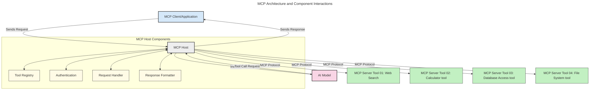
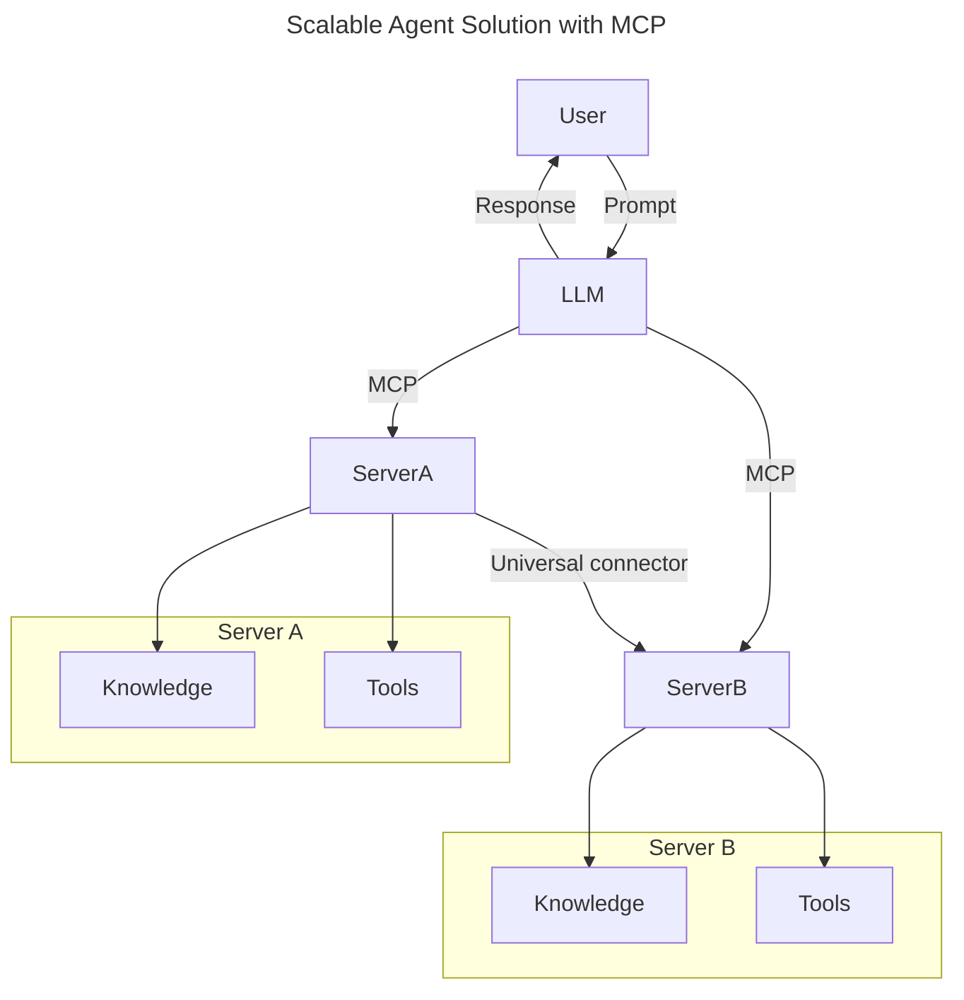
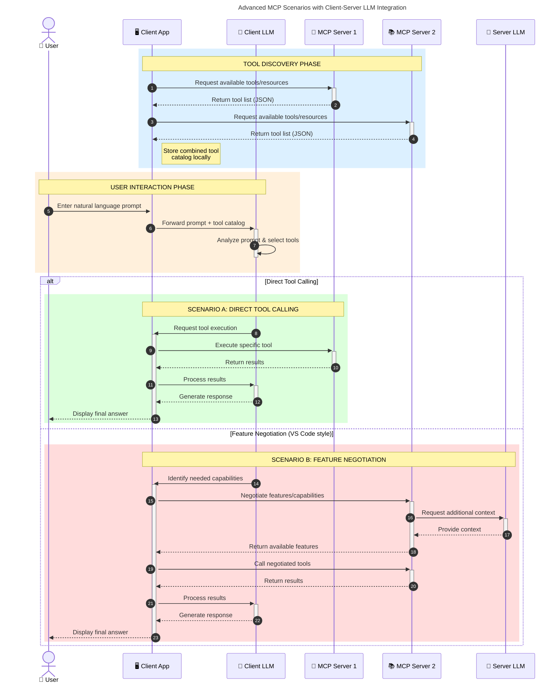

<!--
CO_OP_TRANSLATOR_METADATA:
{
  "original_hash": "9678e0c6945b8e0c23586869b0e26783",
  "translation_date": "2025-10-06T10:54:07+00:00",
  "source_file": "00-Introduction/README.md",
  "language_code": "ja"
}
-->
# モデルコンテキストプロトコル (MCP) の紹介: スケーラブルなAIアプリケーションにおける重要性

_(上の画像をクリックすると、このレッスンの動画をご覧いただけます)_

生成AIアプリケーションは、自然言語プロンプトを使用してアプリと対話できる点で大きな進歩を遂げています。しかし、これらのアプリに時間とリソースを投資するにつれて、機能やリソースを簡単に統合し、拡張可能で、複数のモデルを使用でき、さまざまなモデルの複雑さに対応できるようにする必要があります。つまり、生成AIアプリの構築は最初は簡単ですが、成長して複雑になるにつれて、アーキテクチャを定義し、アプリを一貫した方法で構築するための標準に頼る必要が出てきます。ここでMCPが登場し、整理と標準化を提供します。

---

## **🔍 モデルコンテキストプロトコル (MCP) とは？**

**モデルコンテキストプロトコル (MCP)** は、**オープンで標準化されたインターフェース**であり、大規模言語モデル (LLM) が外部ツール、API、データソースとシームレスに連携できるようにします。これにより、トレーニングデータを超えたAIモデルの機能を強化し、よりスマートでスケーラブル、かつ応答性の高いAIシステムを実現します。

---

## **🎯 AIにおける標準化の重要性**

生成AIアプリケーションが複雑化するにつれて、**スケーラビリティ、拡張性、保守性**を確保し、**ベンダーロックインを回避**するための標準を採用することが重要です。MCPは以下のニーズに対応します：

- モデルとツールの統合を統一化
- 脆弱で一時的なカスタムソリューションを削減
- 複数のベンダーのモデルが1つのエコシステム内で共存可能

**Note:** MCPはオープン標準を謳っていますが、IEEE、IETF、W3C、ISOなどの既存の標準化団体を通じて標準化する計画はありません。

---

## **📚 学習目標**

この記事を読み終えるまでに以下ができるようになります：

- **モデルコンテキストプロトコル (MCP)** とそのユースケースを定義する
- MCPがモデルとツール間の通信をどのように標準化するかを理解する
- MCPアーキテクチャの主要コンポーネントを特定する
- 企業や開発の文脈でのMCPの実際の応用を探る

---

## **💡 モデルコンテキストプロトコル (MCP) が画期的な理由**

### **🔗 MCPはAIの相互作用における断片化を解決する**

MCP以前は、モデルとツールの統合には以下が必要でした：

- ツールとモデルのペアごとのカスタムコード
- 各ベンダーごとの非標準API
- 更新による頻繁な破損
- ツールが増えるにつれてスケーラビリティが低下

### **✅ MCP標準化の利点**

| **利点**                  | **説明**                                                                      |
|--------------------------|------------------------------------------------------------------------------|
| 相互運用性               | LLMが異なるベンダーのツールとシームレスに連携                                |
| 一貫性                   | プラットフォームやツール間での統一された動作                                  |
| 再利用性                 | 一度構築したツールをプロジェクトやシステム間で再利用可能                      |
| 開発の加速               | 標準化されたプラグアンドプレイインターフェースを使用して開発時間を短縮         |

---

## **🧱 MCPの高レベルアーキテクチャ概要**

MCPは**クライアント-サーバーモデル**に従い、以下の構成を持ちます：

- **MCPホスト**がAIモデルを実行
- **MCPクライアント**がリクエストを開始
- **MCPサーバー**がコンテキスト、ツール、機能を提供

### **主要コンポーネント:**

- **リソース** – モデル用の静的または動的データ  
- **プロンプト** – ガイド付き生成のための事前定義されたワークフロー  
- **ツール** – 検索や計算などの実行可能な機能  
- **サンプリング** – 再帰的な対話を通じたエージェント的な行動  

---

## MCPサーバーの動作

MCPサーバーは以下のように動作します：

- **リクエストフロー**:
    1. エンドユーザーまたはその代理として動作するソフトウェアがリクエストを開始します。
    2. **MCPクライアント**がリクエストを**MCPホスト**に送信し、AIモデルのランタイムを管理します。
    3. **AIモデル**がユーザープロンプトを受け取り、外部ツールやデータへのアクセスを要求する場合があります。
    4. **MCPホスト**がモデルではなく、標準化されたプロトコルを使用して適切な**MCPサーバー**と通信します。
- **MCPホストの機能**:
    - **ツールレジストリ**: 利用可能なツールとその機能のカタログを維持
    - **認証**: ツールアクセスの権限を確認
    - **リクエストハンドラー**: モデルからのツールリクエストを処理
    - **レスポンスフォーマッター**: ツールの出力をモデルが理解できる形式に構造化
- **MCPサーバーの実行**:
    - **MCPホスト**がツール呼び出しを1つ以上の**MCPサーバー**にルーティングし、それぞれが検索、計算、データベースクエリなどの専門的な機能を提供
    - **MCPサーバー**がそれぞれの操作を実行し、結果を**MCPホスト**に一貫した形式で返却
    - **MCPホスト**がこれらの結果をフォーマットし、**AIモデル**に中継
- **レスポンスの完了**:
    - **AIモデル**がツールの出力を最終的なレスポンスに組み込みます。
    - **MCPホスト**がこのレスポンスを**MCPクライアント**に送信し、エンドユーザーまたは呼び出し元のソフトウェアに届けます。

## 👨‍💻 MCPサーバーの構築方法 (例付き)

MCPサーバーは、データと機能を提供することでLLMの能力を拡張します。

試してみたいですか？以下は、異なる言語/スタックで簡単なMCPサーバーを作成するためのSDKと例です：

- **Python SDK**: https://github.com/modelcontextprotocol/python-sdk

- **TypeScript SDK**: https://github.com/modelcontextprotocol/typescript-sdk

- **Java SDK**: https://github.com/modelcontextprotocol/java-sdk

- **C#/.NET SDK**: https://github.com/modelcontextprotocol/csharp-sdk

## 🌍 MCPの実際のユースケース

MCPはAIの能力を拡張することで幅広いアプリケーションを可能にします：

| **アプリケーション**          | **説明**                                                                      |
|------------------------------|------------------------------------------------------------------------------|
| 企業データ統合               | LLMをデータベース、CRM、または内部ツールに接続                                |
| エージェント型AIシステム      | ツールアクセスと意思決定ワークフローを備えた自律型エージェントを可能に         |
| マルチモーダルアプリケーション | テキスト、画像、音声ツールを統一されたAIアプリ内で組み合わせる                 |
| リアルタイムデータ統合        | より正確で最新の出力を得るためにAIとの対話にライブデータを導入                 |

### 🧠 MCP = AIインタラクションのユニバーサル標準

モデルコンテキストプロトコル (MCP) は、USB-Cがデバイスの物理的接続を標準化したように、AIインタラクションのユニバーサル標準として機能します。AIの世界では、MCPは一貫したインターフェースを提供し、モデル (クライアント) が外部ツールやデータプロバイダー (サーバー) とシームレスに統合できるようにします。これにより、各APIやデータソースごとに多様でカスタムなプロトコルを必要とすることがなくなります。

MCPの下では、MCP対応ツール (MCPサーバーと呼ばれる) は統一された標準に従います。これらのサーバーは提供するツールやアクションをリストし、AIエージェントからのリクエストに応じてそれらのアクションを実行します。MCPをサポートするAIエージェントプラットフォームは、サーバーから利用可能なツールを発見し、この標準プロトコルを通じてそれらを呼び出すことができます。

### 💡 知識へのアクセスを促進

ツールの提供に加えて、MCPは知識へのアクセスも促進します。これにより、アプリケーションが大規模言語モデル (LLM) にコンテキストを提供し、さまざまなデータソースにリンクすることが可能になります。例えば、MCPサーバーは企業の文書リポジトリを表し、エージェントが必要に応じて関連情報を取得できるようにします。別のサーバーは、メール送信や記録の更新などの特定のアクションを処理します。エージェントの視点から見ると、これらは単に使用可能なツールであり、一部のツールはデータ (知識コンテキスト) を返し、他のツールはアクションを実行します。MCPはこれらの両方を効率的に管理します。

エージェントがMCPサーバーに接続すると、標準フォーマットを通じてサーバーの利用可能な機能とアクセス可能なデータを自動的に学習します。この標準化により、動的なツールの利用が可能になります。例えば、新しいMCPサーバーをエージェントのシステムに追加すると、その機能がすぐに利用可能になり、エージェントの指示をさらにカスタマイズする必要がなくなります。

この統合は、以下の図に示されるフローと一致しており、サーバーがツールと知識を提供し、システム間でシームレスなコラボレーションを確保します。

### 👉 例: スケーラブルなエージェントソリューション

ユニバーサルコネクタは、MCPサーバーが互いに通信し、機能を共有できるようにし、ServerAがServerBにタスクを委任したり、そのツールや知識にアクセスしたりすることを可能にします。これにより、ツールとデータがサーバー間で連携され、スケーラブルでモジュール型のエージェントアーキテクチャをサポートします。MCPがツールの公開を標準化することで、エージェントはサーバー間でリクエストを動的に発見し、ルーティングできるようになります。

ツールと知識の連携: サーバー間でツールとデータをアクセス可能にし、よりスケーラブルでモジュール型のエージェントアーキテクチャを実現。

### 🔄 クライアント側LLM統合を伴う高度なMCPシナリオ

基本的なMCPアーキテクチャを超えて、クライアントとサーバーの両方にLLMが含まれる高度なシナリオがあり、より洗練されたインタラクションを可能にします。以下の図では、**クライアントアプリ**がIDEであり、ユーザーが利用可能なMCPツールを備えています：

## 🔐 MCPの実用的な利点

MCPを使用することで得られる実用的な利点は以下の通りです：

- **新鮮さ**: モデルがトレーニングデータを超えた最新情報にアクセス可能
- **能力拡張**: モデルがトレーニングされていないタスクに特化したツールを活用可能
- **幻覚の削減**: 外部データソースが事実に基づいた根拠を提供
- **プライバシー**: 機密データをプロンプトに埋め込むのではなく、安全な環境内に保持可能

## 📌 重要なポイント

MCPを使用する際の重要なポイントは以下の通りです：

- **MCP**はAIモデルがツールやデータとどのように連携するかを標準化
- **拡張性、一貫性、相互運用性**を促進
- MCPは**開発時間を短縮し、信頼性を向上させ、モデルの能力を拡張**
- クライアント-サーバーアーキテクチャが**柔軟で拡張可能なAIアプリケーション**を可能に

## 🧠 演習

あなたが構築したいと思っているAIアプリケーションについて考えてみてください。

- どのような**外部ツールやデータ**がその能力を向上させるでしょうか？
- MCPが統合を**より簡単で信頼性の高いものにする方法**は？

## 追加リソース

- [MCP GitHubリポジトリ](https://github.com/modelcontextprotocol)

## 次に進む

次: [第1章: コアコンセプト](../01-CoreConcepts/README.md)

---

**免責事項**:  
この文書は、AI翻訳サービス [Co-op Translator](https://github.com/Azure/co-op-translator) を使用して翻訳されています。正確性を追求しておりますが、自動翻訳には誤りや不正確な部分が含まれる可能性があることをご承知ください。元の言語で記載された文書が正式な情報源とみなされるべきです。重要な情報については、専門の人間による翻訳を推奨します。この翻訳の使用に起因する誤解や誤解釈について、当方は一切の責任を負いません。