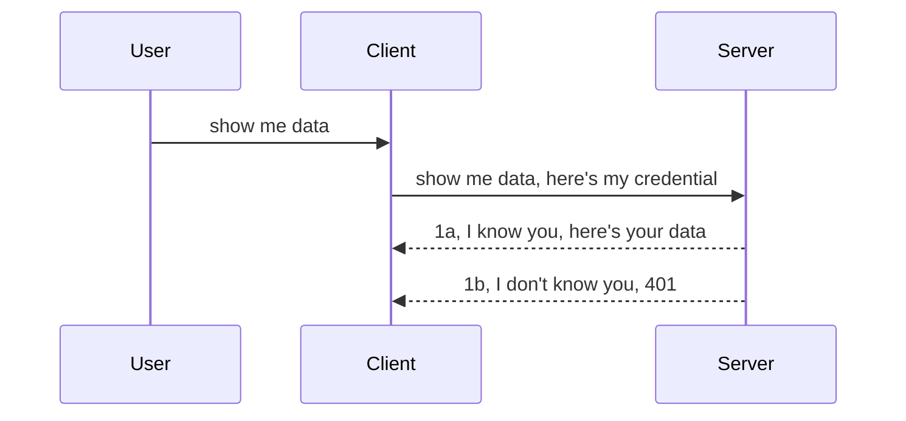

<!--
CO_OP_TRANSLATOR_METADATA:
{
  "original_hash": "5b00b8a8971a07d2d8803be4c9f138f8",
  "translation_date": "2025-10-07T00:37:44+00:00",
  "source_file": "03-GettingStarted/11-simple-auth/README.md",
  "language_code": "ja"
}
-->
# シンプル認証

MCP SDKはOAuth 2.1をサポートしていますが、これは認証サーバー、リソースサーバー、資格情報の送信、コードの取得、コードをベアラートークンに交換するなど、かなり複雑なプロセスを伴います。OAuthに慣れていない場合、基本的な認証から始めて徐々にセキュリティを向上させるのが良いでしょう。この章はそのために存在し、より高度な認証へとステップアップする手助けをします。

## 認証とは何を意味するのか？

認証（Auth）は、認証（Authentication）と認可（Authorization）の略です。これには以下の2つのプロセスが含まれます：

- **認証（Authentication）**: これは、誰かが私たちの「家」に入る権利があるかどうかを確認するプロセスです。つまり、MCPサーバーの機能が存在するリソースサーバーへのアクセス権を持っているかどうかを確認します。
- **認可（Authorization）**: これは、ユーザーが要求している特定のリソース（例：注文や製品）にアクセスする権利があるかどうかを確認するプロセスです。例えば、コンテンツを読むことは許可されているが削除することは許可されていない場合などです。

## 資格情報：システムに自分を識別させる方法

多くのウェブ開発者は、通常、サーバーに資格情報を提供することを考えます。これは通常、ユーザー名とパスワードをBase64でエンコードしたものや、特定のユーザーを一意に識別するAPIキーです。

これを「Authorization」というヘッダーを介して送信します。以下のように：

```json
{ "Authorization": "secret123" }
```

これは通常、基本認証（Basic Authentication）と呼ばれます。全体のフローは以下のように動作します：



フローの観点からその仕組みを理解したところで、これをどのように実装するかを見てみましょう。ほとんどのウェブサーバーには「ミドルウェア」という概念があります。これはリクエストの一部として実行されるコードで、資格情報を検証し、有効であればリクエストを通過させます。資格情報が無効であれば、認証エラーが発生します。これをどのように実装するか見てみましょう：

**Python**

```python
class AuthMiddleware(BaseHTTPMiddleware):
    async def dispatch(self, request, call_next):

        has_header = request.headers.get("Authorization")
        if not has_header:
            print("-> Missing Authorization header!")
            return Response(status_code=401, content="Unauthorized")

        if not valid_token(has_header):
            print("-> Invalid token!")
            return Response(status_code=403, content="Forbidden")

        print("Valid token, proceeding...")
       
        response = await call_next(request)
        # add any customer headers or change in the response in some way
        return response


starlette_app.add_middleware(CustomHeaderMiddleware)
```

ここでは以下を行っています：

- `AuthMiddleware`というミドルウェアを作成し、その`dispatch`メソッドがウェブサーバーによって呼び出されます。
- ミドルウェアをウェブサーバーに追加します：

    ```python
    starlette_app.add_middleware(AuthMiddleware)
    ```

- Authorizationヘッダーが存在するか、送信された秘密が有効かどうかを確認する検証ロジックを記述します：

    ```python
    has_header = request.headers.get("Authorization")
    if not has_header:
        print("-> Missing Authorization header!")
        return Response(status_code=401, content="Unauthorized")

    if not valid_token(has_header):
        print("-> Invalid token!")
        return Response(status_code=403, content="Forbidden")
    ```

    秘密が存在し有効であれば、`call_next`を呼び出してリクエストを通過させ、レスポンスを返します。

    ```python
    response = await call_next(request)
    # add any customer headers or change in the response in some way
    return response
    ```

この仕組みは、ウェブリクエストがサーバーに送信されるとミドルウェアが呼び出され、その実装に基づいてリクエストを通過させるか、クライアントが続行を許可されていないことを示すエラーを返すかのどちらかになります。

**TypeScript**

ここでは、人気のフレームワークExpressを使用してミドルウェアを作成し、リクエストがMCPサーバーに到達する前にインターセプトします。コードは以下の通りです：

```typescript
function isValid(secret) {
    return secret === "secret123";
}

app.use((req, res, next) => {
    // 1. Authorization header present?  
    if(!req.headers["Authorization"]) {
        res.status(401).send('Unauthorized');
    }
    
    let token = req.headers["Authorization"];

    // 2. Check validity.
    if(!isValid(token)) {
        res.status(403).send('Forbidden');
    }

   
    console.log('Middleware executed');
    // 3. Passes request to the next step in the request pipeline.
    next();
});
```

このコードでは以下を行っています：

1. Authorizationヘッダーが存在するかどうかを確認し、存在しない場合は401エラーを送信します。
2. 資格情報/トークンが有効かどうかを確認し、有効でない場合は403エラーを送信します。
3. 最終的にリクエストをパイプラインに通し、要求されたリソースを返します。

## 演習：認証を実装する

これまでの知識を活用して実装してみましょう。以下が計画です：

サーバー

- ウェブサーバーとMCPインスタンスを作成する。
- サーバー用のミドルウェアを実装する。

クライアント 

- ヘッダーを介して資格情報を含むウェブリクエストを送信する。

### -1- ウェブサーバーとMCPインスタンスを作成する

最初のステップでは、ウェブサーバーインスタンスとMCPサーバーを作成する必要があります。

**Python**

ここではMCPサーバーインスタンスを作成し、Starletteウェブアプリを作成し、Uvicornでホストします。

```python
# creating MCP Server

app = FastMCP(
    name="MCP Resource Server",
    instructions="Resource Server that validates tokens via Authorization Server introspection",
    host=settings["host"],
    port=settings["port"],
    debug=True
)

# creating starlette web app
starlette_app = app.streamable_http_app()

# serving app via uvicorn
async def run(starlette_app):
    import uvicorn
    config = uvicorn.Config(
            starlette_app,
            host=app.settings.host,
            port=app.settings.port,
            log_level=app.settings.log_level.lower(),
        )
    server = uvicorn.Server(config)
    await server.serve()

run(starlette_app)
```

このコードでは以下を行っています：

- MCPサーバーを作成します。
- MCPサーバーからStarletteウェブアプリを構築します（`app.streamable_http_app()`）。
- Uvicornを使用してウェブアプリをホストし、提供します（`server.serve()`）。

**TypeScript**

ここではMCPサーバーインスタンスを作成します。

```typescript
const server = new McpServer({
      name: "example-server",
      version: "1.0.0"
    });

    // ... set up server resources, tools, and prompts ...
```

このMCPサーバーの作成は、POST /mcpルート定義内で行う必要があります。そのため、上記のコードを以下のように移動します：

```typescript
import express from "express";
import { randomUUID } from "node:crypto";
import { McpServer } from "@modelcontextprotocol/sdk/server/mcp.js";
import { StreamableHTTPServerTransport } from "@modelcontextprotocol/sdk/server/streamableHttp.js";
import { isInitializeRequest } from "@modelcontextprotocol/sdk/types.js"

const app = express();
app.use(express.json());

// Map to store transports by session ID
const transports: { [sessionId: string]: StreamableHTTPServerTransport } = {};

// Handle POST requests for client-to-server communication
app.post('/mcp', async (req, res) => {
  // Check for existing session ID
  const sessionId = req.headers['mcp-session-id'] as string | undefined;
  let transport: StreamableHTTPServerTransport;

  if (sessionId && transports[sessionId]) {
    // Reuse existing transport
    transport = transports[sessionId];
  } else if (!sessionId && isInitializeRequest(req.body)) {
    // New initialization request
    transport = new StreamableHTTPServerTransport({
      sessionIdGenerator: () => randomUUID(),
      onsessioninitialized: (sessionId) => {
        // Store the transport by session ID
        transports[sessionId] = transport;
      },
      // DNS rebinding protection is disabled by default for backwards compatibility. If you are running this server
      // locally, make sure to set:
      // enableDnsRebindingProtection: true,
      // allowedHosts: ['127.0.0.1'],
    });

    // Clean up transport when closed
    transport.onclose = () => {
      if (transport.sessionId) {
        delete transports[transport.sessionId];
      }
    };
    const server = new McpServer({
      name: "example-server",
      version: "1.0.0"
    });

    // ... set up server resources, tools, and prompts ...

    // Connect to the MCP server
    await server.connect(transport);
  } else {
    // Invalid request
    res.status(400).json({
      jsonrpc: '2.0',
      error: {
        code: -32000,
        message: 'Bad Request: No valid session ID provided',
      },
      id: null,
    });
    return;
  }

  // Handle the request
  await transport.handleRequest(req, res, req.body);
});

// Reusable handler for GET and DELETE requests
const handleSessionRequest = async (req: express.Request, res: express.Response) => {
  const sessionId = req.headers['mcp-session-id'] as string | undefined;
  if (!sessionId || !transports[sessionId]) {
    res.status(400).send('Invalid or missing session ID');
    return;
  }
  
  const transport = transports[sessionId];
  await transport.handleRequest(req, res);
};

// Handle GET requests for server-to-client notifications via SSE
app.get('/mcp', handleSessionRequest);

// Handle DELETE requests for session termination
app.delete('/mcp', handleSessionRequest);

app.listen(3000);
```

これで、MCPサーバーの作成が`app.post("/mcp")`内に移動したことがわかります。

次のステップでは、ミドルウェアを作成して、受信資格情報を検証します。

### -2- サーバー用のミドルウェアを実装する

次にミドルウェア部分に進みます。ここでは、`Authorization`ヘッダー内の資格情報を探して検証するミドルウェアを作成します。資格情報が受け入れ可能であれば、リクエストは必要な処理（例：ツールのリスト表示、リソースの読み取り、またはクライアントが要求したMCP機能）を行います。

**Python**

ミドルウェアを作成するには、`BaseHTTPMiddleware`を継承するクラスを作成する必要があります。興味深い部分は以下の2つです：

- リクエスト`request`：ヘッダー情報を読み取ります。
- `call_next`：クライアントが受け入れ可能な資格情報を持っている場合に呼び出す必要があるコールバック。

まず、`Authorization`ヘッダーが欠落している場合のケースを処理する必要があります：

```python
has_header = request.headers.get("Authorization")

# no header present, fail with 401, otherwise move on.
if not has_header:
    print("-> Missing Authorization header!")
    return Response(status_code=401, content="Unauthorized")
```

ここでは、クライアントが認証に失敗しているため、401未認証メッセージを送信します。

次に、資格情報が送信された場合、その有効性を以下のように確認する必要があります：

```python
 if not valid_token(has_header):
    print("-> Invalid token!")
    return Response(status_code=403, content="Forbidden")
```

上記では403禁止メッセージを送信していることに注意してください。以下に、上記で述べたすべてを実装した完全なミドルウェアを示します：

```python
class AuthMiddleware(BaseHTTPMiddleware):
    async def dispatch(self, request, call_next):

        has_header = request.headers.get("Authorization")
        if not has_header:
            print("-> Missing Authorization header!")
            return Response(status_code=401, content="Unauthorized")

        if not valid_token(has_header):
            print("-> Invalid token!")
            return Response(status_code=403, content="Forbidden")

        print("Valid token, proceeding...")
        print(f"-> Received {request.method} {request.url}")
        response = await call_next(request)
        response.headers['Custom'] = 'Example'
        return response

```

素晴らしいですが、`valid_token`関数はどうでしょうか？以下に示します：

```python
# DON'T use for production - improve it !!
def valid_token(token: str) -> bool:
    # remove the "Bearer " prefix
    if token.startswith("Bearer "):
        token = token[7:]
        return token == "secret-token"
    return False
```

これは明らかに改善する必要があります。

重要：コード内に秘密を含めるべきではありません。比較する値はデータソースやIDP（アイデンティティサービスプロバイダー）から取得するか、さらに良いことに、IDPに検証を任せるべきです。

**TypeScript**

Expressを使用してこれを実装するには、ミドルウェア関数を受け取る`use`メソッドを呼び出す必要があります。

以下を行う必要があります：

- リクエスト変数と対話して`Authorization`プロパティに渡された資格情報を確認します。
- 資格情報を検証し、有効であればリクエストを続行させ、クライアントのMCPリクエストが必要な処理を行うようにします（例：ツールのリスト表示、リソースの読み取り、またはその他のMCP関連）。

ここでは、`Authorization`ヘッダーが存在するかどうかを確認し、存在しない場合はリクエストを停止します：

```typescript
if(!req.headers["authorization"]) {
    res.status(401).send('Unauthorized');
    return;
}
```

ヘッダーが最初に送信されていない場合、401エラーが返されます。

次に、資格情報が有効かどうかを確認し、有効でない場合は再びリクエストを停止しますが、少し異なるメッセージを返します：

```typescript
if(!isValid(token)) {
    res.status(403).send('Forbidden');
    return;
} 
```

ここでは403エラーが返されることに注意してください。

以下が完全なコードです：

```typescript
app.use((req, res, next) => {
    console.log('Request received:', req.method, req.url, req.headers);
    console.log('Headers:', req.headers["authorization"]);
    if(!req.headers["authorization"]) {
        res.status(401).send('Unauthorized');
        return;
    }
    
    let token = req.headers["authorization"];

    if(!isValid(token)) {
        res.status(403).send('Forbidden');
        return;
    }  

    console.log('Middleware executed');
    next();
});
```

ウェブサーバーを設定して、クライアントが送信している資格情報を確認するミドルウェアを受け入れるようにしました。では、クライアント自体はどうでしょうか？

### -3- ヘッダーを介して資格情報を含むウェブリクエストを送信する

クライアントがヘッダーを介して資格情報を渡していることを確認する必要があります。MCPクライアントを使用してこれを行う予定なので、その方法を確認する必要があります。

**Python**

クライアントでは、以下のようにヘッダーに資格情報を渡す必要があります：

```python
# DON'T hardcode the value, have it at minimum in an environment variable or a more secure storage
token = "secret-token"

async with streamablehttp_client(
        url = f"http://localhost:{port}/mcp",
        headers = {"Authorization": f"Bearer {token}"}
    ) as (
        read_stream,
        write_stream,
        session_callback,
    ):
        async with ClientSession(
            read_stream,
            write_stream
        ) as session:
            await session.initialize()
      
            # TODO, what you want done in the client, e.g list tools, call tools etc.
```

ここでは、`headers`プロパティを以下のように設定していることに注意してください：`headers = {"Authorization": f"Bearer {token}"}`。

**TypeScript**

これを2つのステップで解決できます：

1. 資格情報を含む設定オブジェクトを作成する。
2. 設定オブジェクトをトランスポートに渡す。

```typescript

// DON'T hardcode the value like shown here. At minimum have it as a env variable and use something like dotenv (in dev mode).
let token = "secret123"

// define a client transport option object
let options: StreamableHTTPClientTransportOptions = {
  sessionId: sessionId,
  requestInit: {
    headers: {
      "Authorization": "secret123"
    }
  }
};

// pass the options object to the transport
async function main() {
   const transport = new StreamableHTTPClientTransport(
      new URL(serverUrl),
      options
   );
```

上記では、`options`オブジェクトを作成し、`requestInit`プロパティの下にヘッダーを配置する必要があることがわかります。

重要：ここからどのように改善するか？現在の実装にはいくつかの問題があります。まず、資格情報をこのように渡すのは非常にリスクが高いです。最低でもHTTPSを使用する必要があります。それでも資格情報が盗まれる可能性があるため、トークンを簡単に取り消し、追加のチェックを行うシステムが必要です。例えば、リクエストがどこから来ているのか、リクエストが頻繁すぎるか（ボットのような動作）、つまり懸念事項は多数あります。

ただし、非常にシンプルなAPIの場合、認証されていない状態でAPIを呼び出させたくない場合、ここで示したものは良いスタートです。

それでは、JSON Web Token（JWT）または「JOT」トークンのような標準化された形式を使用してセキュリティを少し強化してみましょう。

## JSON Web Token（JWT）

非常にシンプルな資格情報を送信する方法を改善しようとしています。JWTを採用することで得られる即時の改善点は何でしょうか？

- **セキュリティの向上**。基本認証では、ユーザー名とパスワードをBase64でエンコードしたトークン（またはAPIキー）を何度も送信しますが、これによりリスクが増加します。JWTでは、ユーザー名とパスワードを送信してトークンを取得し、さらに時間制限が設けられます。JWTを使用すると、ロール、スコープ、権限を使用して細かいアクセス制御を簡単に実現できます。
- **ステートレス性とスケーラビリティ**。JWTは自己完結型であり、すべてのユーザー情報を含んでいるため、サーバー側のセッションストレージを必要としません。また、トークンはローカルで検証することもできます。
- **相互運用性とフェデレーション**。JWTはOpen ID Connectの中心であり、Entra ID、Google Identity、Auth0などの既知のアイデンティティプロバイダーで使用されます。また、シングルサインオンなどを可能にし、エンタープライズグレードの機能を提供します。
- **モジュール性と柔軟性**。JWTはAzure API ManagementやNGINXなどのAPIゲートウェイと一緒に使用することもできます。また、認証シナリオやサーバー間通信（インパーソネーションやデリゲーションシナリオを含む）をサポートします。
- **パフォーマンスとキャッシュ**。JWTはデコード後にキャッシュすることができるため、解析の必要性が減少します。これにより、特に高トラフィックアプリでスループットが向上し、選択したインフラストラクチャへの負荷が軽減されます。
- **高度な機能**。また、イントロスペクション（サーバーでの有効性チェック）やトークンの取り消し（トークンを無効化する）をサポートします。

これらの利点を踏まえ、実装を次のレベルに進める方法を見てみましょう。

## 基本認証をJWTに変換する

ここで必要な変更を大まかに説明すると以下の通りです：

- **JWTトークンの構築方法を学ぶ**。クライアントからサーバーに送信する準備をします。
- **JWTトークンを検証する**。有効であれば、クライアントにリソースを提供します。
- **トークンの安全な保存**。トークンの保存方法を検討します。
- **ルートの保護**。ルートを保護する必要があります。具体的には、ルートや特定のMCP機能を保護します。
- **リフレッシュトークンの追加**。短命のトークンを作成し、長命のリフレッシュトークンを使用してトークンが期限切れになった場合に新しいトークンを取得できるようにします。また、リフレッシュエンドポイントとローテーション戦略を確立します。

### -1- JWTトークンの構築

まず、JWTトークンには以下の部分があります：

- **ヘッダー**：使用されるアルゴリズムとトークンタイプ。
- **ペイロード**：クレーム（例：sub（トークンが表すユーザーまたはエンティティ。認証シナリオでは通常ユーザーID）、exp（有効期限）、role（ロール））。
- **署名**：秘密鍵またはプライベートキーで署名。

これを構築するために、ヘッダー、ペイロード、エンコードされたトークンを作成する必要があります。

**Python**

```python

import jwt
import jwt
from jwt.exceptions import ExpiredSignatureError, InvalidTokenError
import datetime

# Secret key used to sign the JWT
secret_key = 'your-secret-key'

header = {
    "alg": "HS256",
    "typ": "JWT"
}

# the user info andits claims and expiry time
payload = {
    "sub": "1234567890",               # Subject (user ID)
    "name": "User Userson",                # Custom claim
    "admin": True,                     # Custom claim
    "iat": datetime.datetime.utcnow(),# Issued at
    "exp": datetime.datetime.utcnow() + datetime.timedelta(hours=1)  # Expiry
}

# encode it
encoded_jwt = jwt.encode(payload, secret_key, algorithm="HS256", headers=header)
```

上記のコードでは以下を行っています：

- HS256をアルゴリズムとして使用し、タイプをJWTとしてヘッダーを定義しました。
- サブジェクトまたはユーザーID、ユーザー名、ロール、発行日時、期限切れ日時を含むペイロードを構築しました。これにより、前述した時間制限の側面を実装しています。

**TypeScript**

ここでは、JWTトークンを構築するための依存関係が必要です。

依存関係

```sh

npm install jsonwebtoken
npm install --save-dev @types/jsonwebtoken
```

これを設定した後、ヘッダー、ペイロードを作成し、それを通じてエンコードされたトークンを作成します。

```typescript
import jwt from 'jsonwebtoken';

const secretKey = 'your-secret-key'; // Use env vars in production

// Define the payload
const payload = {
  sub: '1234567890',
  name: 'User usersson',
  admin: true,
  iat: Math.floor(Date.now() / 1000), // Issued at
  exp: Math.floor(Date.now() / 1000) + 60 * 60 // Expires in 1 hour
};

// Define the header (optional, jsonwebtoken sets defaults)
const header = {
  alg: 'HS256',
  typ: 'JWT'
};

// Create the token
const token = jwt.sign(payload, secretKey, {
  algorithm: 'HS256',
  header: header
});

console.log('JWT:', token);
```

このトークンは以下の特徴を持っています：

HS256で署名
1時間有効
sub、name、admin、iat、expなどのクレームを含む

### -2- トークンの検証

トークンを検証する必要があります。これは、クライアントが送信しているトークンが実際に有効であることを確認するためにサーバーで行うべきです。ここでは、トークンの構造や有効性を検証する必要があります。また、ユーザーがシステム内に存在するかどうかを確認するなど、追加のチェックを行うことを推奨します。

トークンを検証するには、デコードして読み取り、その有効性を確認する必要があります：

**Python**

```python

# Decode and verify the JWT
try:
    decoded = jwt.decode(token, secret_key, algorithms=["HS256"])
    print("✅ Token is valid.")
    print("Decoded claims:")
    for key, value in decoded.items():
        print(f"  {key}: {value}")
except ExpiredSignatureError:
    print("❌ Token has expired.")
except InvalidTokenError as e:
    print(f"❌ Invalid token: {e}")

```

このコードでは、トークン、秘密鍵、選択したアルゴリズムを入力として`jwt.decode`を呼び出しています。失敗した検証はエラーを引き起こすため、try-catch構造を使用していることに注意してください。

**TypeScript**

ここでは、`jwt.verify`を呼び出してトークンのデコード版を取得し、さらに分析します。この呼び出しが失敗した場合、トークンの構造が正しくないか、もはや有効ではないことを意味します。

```typescript

try {
  const decoded = jwt.verify(token, secretKey);
  console.log('Decoded Payload:', decoded);
} catch (err) {
  console.error('Token verification failed:', err);
}
```

次に、ロールベースのアクセス制御（RBAC）について見ていきましょう。

## ロールベースのアクセス制御を追加する

異なるロールが異なる権限を持つことを表現したいというアイデアです。例えば、管理者（admin）はすべての操作が可能で、通常のユーザー（user）は読み取り/書き込みが可能、ゲスト（guest）は読み取りのみ可能とします。以下は、いくつかの権限レベルの例です：

- Admin.Write 
- User.Read
- Guest.Read

では、ミドルウェアを使ってこのような制御を実装する方法を見てみましょう。ミドルウェアは特定のルートごとに追加することも、すべてのルートに対して追加することもできます。

**Python**

```python
from starlette.middleware.base import BaseHTTPMiddleware
from starlette.responses import JSONResponse
import jwt

# DON'T have the secret in the code like, this is for demonstration purposes only. Read it from a safe place.
SECRET_KEY = "your-secret-key" # put this in env variable
REQUIRED_PERMISSION = "User.Read"

class JWTPermissionMiddleware(BaseHTTPMiddleware):
    async def dispatch(self, request, call_next):
        auth_header = request.headers.get("Authorization")
        if not auth_header or not auth_header.startswith("Bearer "):
            return JSONResponse({"error": "Missing or invalid Authorization header"}, status_code=401)

        token = auth_header.split(" ")[1]
        try:
            decoded = jwt.decode(token, SECRET_KEY, algorithms=["HS256"])
        except jwt.ExpiredSignatureError:
            return JSONResponse({"error": "Token expired"}, status_code=401)
        except jwt.InvalidTokenError:
            return JSONResponse({"error": "Invalid token"}, status_code=401)

        permissions = decoded.get("permissions", [])
        if REQUIRED_PERMISSION not in permissions:
            return JSONResponse({"error": "Permission denied"}, status_code=403)

        request.state.user = decoded
        return await call_next(request)


```

以下のように、ミドルウェアを追加する方法はいくつかあります：

```python

# Alt 1: add middleware while constructing starlette app
middleware = [
    Middleware(JWTPermissionMiddleware)
]

app = Starlette(routes=routes, middleware=middleware)

# Alt 2: add middleware after starlette app is a already constructed
starlette_app.add_middleware(JWTPermissionMiddleware)

# Alt 3: add middleware per route
routes = [
    Route(
        "/mcp",
        endpoint=..., # handler
        middleware=[Middleware(JWTPermissionMiddleware)]
    )
]
```

**TypeScript**

`app.use`を使用して、すべてのリクエストに対して実行されるミドルウェアを追加できます。

```typescript
app.use((req, res, next) => {
    console.log('Request received:', req.method, req.url, req.headers);
    console.log('Headers:', req.headers["authorization"]);

    // 1. Check if authorization header has been sent

    if(!req.headers["authorization"]) {
        res.status(401).send('Unauthorized');
        return;
    }
    
    let token = req.headers["authorization"];

    // 2. Check if token is valid
    if(!isValid(token)) {
        res.status(403).send('Forbidden');
        return;
    }  

    // 3. Check if token user exist in our system
    if(!isExistingUser(token)) {
        res.status(403).send('Forbidden');
        console.log("User does not exist");
        return;
    }
    console.log("User exists");

    // 4. Verify the token has the right permissions
    if(!hasScopes(token, ["User.Read"])){
        res.status(403).send('Forbidden - insufficient scopes');
    }

    console.log("User has required scopes");

    console.log('Middleware executed');
    next();
});

```

ミドルウェアで実行できること、そして実行すべきことは以下の通りです：

1. Authorizationヘッダーが存在するか確認する
2. トークンが有効か確認する。これは、JWTトークンの整合性と有効性をチェックするために作成した`isValid`メソッドを呼び出します。
3. ユーザーがシステム内に存在するか確認する必要があります。

   ```typescript
    // users in DB
   const users = [
     "user1",
     "User usersson",
   ]

   function isExistingUser(token) {
     let decodedToken = verifyToken(token);

     // TODO, check if user exists in DB
     return users.includes(decodedToken?.name || "");
   }
   ```

   上記では、非常にシンプルな`users`リストを作成しましたが、これは当然データベースに保存されるべきです。

4. さらに、トークンが正しい権限を持っているか確認する必要があります。

   ```typescript
   if(!hasScopes(token, ["User.Read"])){
        res.status(403).send('Forbidden - insufficient scopes');
   }
   ```

   上記のミドルウェアコードでは、トークンにUser.Read権限が含まれているか確認し、含まれていない場合は403エラーを送信します。以下は`hasScopes`ヘルパーメソッドです。

   ```typescript
   function hasScopes(scope: string, requiredScopes: string[]) {
     let decodedToken = verifyToken(scope);
    return requiredScopes.every(scope => decodedToken?.scopes.includes(scope));
  }
   ```

Have a think which additional checks you should be doing, but these are the absolute minimum of checks you should be doing.

Using Express as a web framework is a common choice. There are helpers library when you use JWT so you can write less code.

- `express-jwt`, helper library that provides a middleware that helps decode your token.
- `express-jwt-permissions`, this provides a middleware `guard` that helps check if a certain permission is on the token.

Here's what these libraries can look like when used:

```typescript
const express = require('express');
const jwt = require('express-jwt');
const guard = require('express-jwt-permissions')();

const app = express();
const secretKey = 'your-secret-key'; // put this in env variable

// Decode JWT and attach to req.user
app.use(jwt({ secret: secretKey, algorithms: ['HS256'] }));

// Check for User.Read permission
app.use(guard.check('User.Read'));

// multiple permissions
// app.use(guard.check(['User.Read', 'Admin.Access']));

app.get('/protected', (req, res) => {
  res.json({ message: `Welcome ${req.user.name}` });
});

// Error handler
app.use((err, req, res, next) => {
  if (err.code === 'permission_denied') {
    return res.status(403).send('Forbidden');
  }
  next(err);
});

```

これで、ミドルウェアが認証と認可の両方に使用できる方法を見てきましたが、MCPの場合はどうでしょうか？認証の方法が変わるのでしょうか？次のセクションで確認してみましょう。

### -3- MCPにRBACを追加する

これまでにミドルウェアを使ってRBACを追加する方法を見てきましたが、MCPでは特定のMCP機能ごとにRBACを簡単に追加する方法がありません。ではどうすればいいのでしょうか？この場合、クライアントが特定のツールを呼び出す権利を持っているかどうかを確認するコードを追加する必要があります。

特定の機能ごとにRBACを実現する方法はいくつかあります。以下はその例です：

- ツール、リソース、プロンプトごとに権限レベルを確認するコードを追加する。

   **Python**

   ```python
   @tool()
   def delete_product(id: int):
      try:
          check_permissions(role="Admin.Write", request)
      catch:
        pass # client failed authorization, raise authorization error
   ```

   **TypeScript**

   ```typescript
   server.registerTool(
    "delete-product",
    {
      title: Delete a product",
      description: "Deletes a product",
      inputSchema: { id: z.number() }
    },
    async ({ id }) => {
      
      try {
        checkPermissions("Admin.Write", request);
        // todo, send id to productService and remote entry
      } catch(Exception e) {
        console.log("Authorization error, you're not allowed");  
      }

      return {
        content: [{ type: "text", text: `Deletected product with id ${id}` }]
      };
    }
   );
   ```


- 高度なサーバーアプローチとリクエストハンドラーを使用して、チェックを行う箇所を最小限に抑える。

   **Python**

   ```python
   
   tool_permission = {
      "create_product": ["User.Write", "Admin.Write"],
      "delete_product": ["Admin.Write"]
   }

   def has_permission(user_permissions, required_permissions) -> bool:
      # user_permissions: list of permissions the user has
      # required_permissions: list of permissions required for the tool
      return any(perm in user_permissions for perm in required_permissions)

   @server.call_tool()
   async def handle_call_tool(
     name: str, arguments: dict[str, str] | None
   ) -> list[types.TextContent]:
    # Assume request.user.permissions is a list of permissions for the user
     user_permissions = request.user.permissions
     required_permissions = tool_permission.get(name, [])
     if not has_permission(user_permissions, required_permissions):
        # Raise error "You don't have permission to call tool {name}"
        raise Exception(f"You don't have permission to call tool {name}")
     # carry on and call tool
     # ...
   ```   
   

   **TypeScript**

   ```typescript
   function hasPermission(userPermissions: string[], requiredPermissions: string[]): boolean {
       if (!Array.isArray(userPermissions) || !Array.isArray(requiredPermissions)) return false;
       // Return true if user has at least one required permission
       
       return requiredPermissions.some(perm => userPermissions.includes(perm));
   }
  
   server.setRequestHandler(CallToolRequestSchema, async (request) => {
      const { params: { name } } = request;
  
      let permissions = request.user.permissions;
  
      if (!hasPermission(permissions, toolPermissions[name])) {
         return new Error(`You don't have permission to call ${name}`);
      }
  
      // carry on..
   });
   ```

   注意：ミドルウェアがデコードされたトークンをリクエストのuserプロパティに割り当てることを保証する必要があります。これにより、上記のコードが簡単になります。

### まとめ

ここまで、一般的なRBACのサポートを追加する方法と、特にMCPに対するRBACの追加方法について説明しました。これらの概念を理解したかどうかを確認するために、自分でセキュリティを実装してみましょう。

## 課題 1: 基本認証を使用したMCPサーバーとMCPクライアントを構築する

ここでは、ヘッダーを通じて資格情報を送信する方法について学んだ内容を活用します。

## 解決策 1

[解決策 1](./code/basic/README.md)

## 課題 2: 課題 1の解決策をJWTを使用するようにアップグレードする

最初の解決策を基に、今回はそれを改善します。

基本認証の代わりに、JWTを使用します。

## 解決策 2

[解決策 2](./solution/jwt-solution/README.md)

## チャレンジ

セクション「MCPにRBACを追加する」で説明したツールごとのRBACを追加してください。

## まとめ

この章では、セキュリティが全くない状態から始まり、基本的なセキュリティ、JWT、そしてそれをMCPに追加する方法まで学びました。

カスタムJWTを使用して堅固な基盤を構築しましたが、スケールするにつれて、標準ベースのアイデンティティモデルに移行しています。EntraやKeycloakのようなIdPを採用することで、トークンの発行、検証、ライフサイクル管理を信頼できるプラットフォームに委任し、アプリのロジックやユーザー体験に集中することができます。

そのため、より[高度なEntraに関する章](../../05-AdvancedTopics/mcp-security-entra/README.md)があります。

---

**免責事項**:  
この文書は、AI翻訳サービス[Co-op Translator](https://github.com/Azure/co-op-translator)を使用して翻訳されています。正確性を追求しておりますが、自動翻訳には誤りや不正確な部分が含まれる可能性があることをご承知ください。元の言語で記載された文書が正式な情報源とみなされるべきです。重要な情報については、専門の人間による翻訳を推奨します。この翻訳の使用に起因する誤解や誤解釈について、当方は一切の責任を負いません。