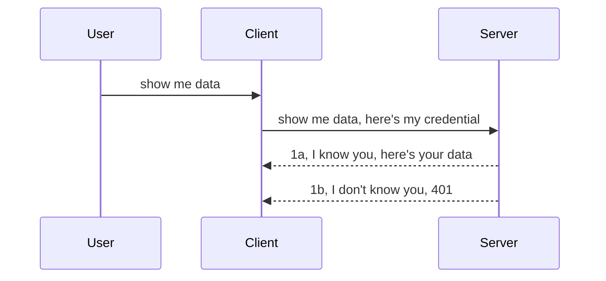

<!--
CO_OP_TRANSLATOR_METADATA:
{
  "original_hash": "5b00b8a8971a07d2d8803be4c9f138f8",
  "translation_date": "2025-10-07T00:38:34+00:00",
  "source_file": "03-GettingStarted/11-simple-auth/README.md",
  "language_code": "ko"
}
-->
# 간단한 인증

MCP SDK는 OAuth 2.1을 지원합니다. 하지만 OAuth는 인증 서버, 리소스 서버, 자격 증명 전송, 코드 획득, 코드와 베어러 토큰 교환 등 여러 개념을 포함하는 복잡한 과정입니다. OAuth를 처음 접하는 경우, 기본적인 인증부터 시작해 점차 더 나은 보안으로 발전시키는 것이 좋습니다. 이 장은 바로 그런 이유로 존재하며, 여러분을 더 고급 인증으로 안내하기 위한 것입니다.

## 인증, 무엇을 의미하나요?

인증(Auth)은 인증(Authentication)과 권한 부여(Authorization)를 줄인 말입니다. 여기서 우리는 두 가지를 수행해야 합니다:

- **인증(Authentication)**: 누군가가 우리 집에 들어올 수 있는지, 즉 MCP 서버 기능이 있는 리소스 서버에 접근할 권리가 있는지를 확인하는 과정입니다.
- **권한 부여(Authorization)**: 사용자가 요청한 특정 리소스(예: 주문, 제품)에 접근할 수 있는지, 또는 콘텐츠를 읽을 수는 있지만 삭제는 할 수 없는지 등을 확인하는 과정입니다.

## 자격 증명: 시스템에 우리의 신원을 알리는 방법

대부분의 웹 개발자는 서버에 자격 증명을 제공하는 방법을 생각합니다. 일반적으로 이는 사용자가 "인증"을 받을 수 있는 비밀 정보입니다. 이 자격 증명은 보통 사용자 이름과 비밀번호를 base64로 인코딩한 버전이거나 특정 사용자를 고유하게 식별하는 API 키입니다.

이 자격 증명은 "Authorization"이라는 헤더를 통해 전송됩니다. 예를 들어:

```json
{ "Authorization": "secret123" }
```

이 방식은 일반적으로 기본 인증(Basic Authentication)이라고 불립니다. 전체 흐름은 다음과 같이 작동합니다:



이제 흐름 관점에서 작동 방식을 이해했으니, 이를 어떻게 구현할 수 있을까요? 대부분의 웹 서버는 미들웨어라는 개념을 가지고 있습니다. 미들웨어는 요청의 일부로 실행되는 코드로, 자격 증명을 확인하고 유효한 경우 요청을 통과시킵니다. 자격 증명이 유효하지 않으면 인증 오류를 반환합니다. 이를 어떻게 구현할 수 있는지 살펴보겠습니다:

**Python**

```python
class AuthMiddleware(BaseHTTPMiddleware):
    async def dispatch(self, request, call_next):

        has_header = request.headers.get("Authorization")
        if not has_header:
            print("-> Missing Authorization header!")
            return Response(status_code=401, content="Unauthorized")

        if not valid_token(has_header):
            print("-> Invalid token!")
            return Response(status_code=403, content="Forbidden")

        print("Valid token, proceeding...")
       
        response = await call_next(request)
        # add any customer headers or change in the response in some way
        return response


starlette_app.add_middleware(CustomHeaderMiddleware)
```

여기서 우리는 다음을 수행했습니다:

- `AuthMiddleware`라는 미들웨어를 생성하고, 웹 서버가 `dispatch` 메서드를 호출하도록 설정했습니다.
- 미들웨어를 웹 서버에 추가했습니다:

    ```python
    starlette_app.add_middleware(AuthMiddleware)
    ```

- Authorization 헤더가 존재하는지, 전송된 비밀 정보가 유효한지 확인하는 검증 로직을 작성했습니다:

    ```python
    has_header = request.headers.get("Authorization")
    if not has_header:
        print("-> Missing Authorization header!")
        return Response(status_code=401, content="Unauthorized")

    if not valid_token(has_header):
        print("-> Invalid token!")
        return Response(status_code=403, content="Forbidden")
    ```

    비밀 정보가 존재하고 유효하다면 `call_next`를 호출하여 요청을 통과시키고 응답을 반환합니다.

    ```python
    response = await call_next(request)
    # add any customer headers or change in the response in some way
    return response
    ```

이 방식은 웹 요청이 서버로 들어오면 미들웨어가 호출되고, 구현된 로직에 따라 요청을 통과시키거나 클라이언트가 진행할 수 없음을 나타내는 오류를 반환합니다.

**TypeScript**

여기서는 인기 있는 프레임워크인 Express를 사용하여 미들웨어를 생성하고 요청이 MCP 서버에 도달하기 전에 이를 가로챕니다. 코드는 다음과 같습니다:

```typescript
function isValid(secret) {
    return secret === "secret123";
}

app.use((req, res, next) => {
    // 1. Authorization header present?  
    if(!req.headers["Authorization"]) {
        res.status(401).send('Unauthorized');
    }
    
    let token = req.headers["Authorization"];

    // 2. Check validity.
    if(!isValid(token)) {
        res.status(403).send('Forbidden');
    }

   
    console.log('Middleware executed');
    // 3. Passes request to the next step in the request pipeline.
    next();
});
```

이 코드에서 우리는:

1. Authorization 헤더가 존재하는지 확인하고, 없으면 401 오류를 반환합니다.
2. 자격 증명/토큰이 유효한지 확인하고, 그렇지 않으면 403 오류를 반환합니다.
3. 마지막으로 요청을 파이프라인에서 통과시키고 요청한 리소스를 반환합니다.

## 연습: 인증 구현하기

이제 배운 내용을 바탕으로 인증을 구현해 봅시다. 계획은 다음과 같습니다:

서버

- 웹 서버와 MCP 인스턴스를 생성합니다.
- 서버에 미들웨어를 구현합니다.

클라이언트

- 헤더를 통해 자격 증명을 포함한 웹 요청을 전송합니다.

### -1- 웹 서버와 MCP 인스턴스 생성하기

첫 번째 단계에서는 웹 서버 인스턴스와 MCP 서버를 생성해야 합니다.

**Python**

여기서는 MCP 서버 인스턴스를 생성하고, starlette 웹 앱을 생성한 뒤 uvicorn으로 호스팅합니다.

```python
# creating MCP Server

app = FastMCP(
    name="MCP Resource Server",
    instructions="Resource Server that validates tokens via Authorization Server introspection",
    host=settings["host"],
    port=settings["port"],
    debug=True
)

# creating starlette web app
starlette_app = app.streamable_http_app()

# serving app via uvicorn
async def run(starlette_app):
    import uvicorn
    config = uvicorn.Config(
            starlette_app,
            host=app.settings.host,
            port=app.settings.port,
            log_level=app.settings.log_level.lower(),
        )
    server = uvicorn.Server(config)
    await server.serve()

run(starlette_app)
```

이 코드에서 우리는:

- MCP 서버를 생성했습니다.
- MCP 서버에서 `app.streamable_http_app()`을 사용하여 starlette 웹 앱을 구성했습니다.
- uvicorn을 사용하여 웹 앱을 호스팅하고 서버를 실행했습니다: `server.serve()`.

**TypeScript**

여기서는 MCP 서버 인스턴스를 생성합니다.

```typescript
const server = new McpServer({
      name: "example-server",
      version: "1.0.0"
    });

    // ... set up server resources, tools, and prompts ...
```

이 MCP 서버 생성은 POST /mcp 경로 정의 내에서 이루어져야 하므로, 위 코드를 다음과 같이 이동합니다:

```typescript
import express from "express";
import { randomUUID } from "node:crypto";
import { McpServer } from "@modelcontextprotocol/sdk/server/mcp.js";
import { StreamableHTTPServerTransport } from "@modelcontextprotocol/sdk/server/streamableHttp.js";
import { isInitializeRequest } from "@modelcontextprotocol/sdk/types.js"

const app = express();
app.use(express.json());

// Map to store transports by session ID
const transports: { [sessionId: string]: StreamableHTTPServerTransport } = {};

// Handle POST requests for client-to-server communication
app.post('/mcp', async (req, res) => {
  // Check for existing session ID
  const sessionId = req.headers['mcp-session-id'] as string | undefined;
  let transport: StreamableHTTPServerTransport;

  if (sessionId && transports[sessionId]) {
    // Reuse existing transport
    transport = transports[sessionId];
  } else if (!sessionId && isInitializeRequest(req.body)) {
    // New initialization request
    transport = new StreamableHTTPServerTransport({
      sessionIdGenerator: () => randomUUID(),
      onsessioninitialized: (sessionId) => {
        // Store the transport by session ID
        transports[sessionId] = transport;
      },
      // DNS rebinding protection is disabled by default for backwards compatibility. If you are running this server
      // locally, make sure to set:
      // enableDnsRebindingProtection: true,
      // allowedHosts: ['127.0.0.1'],
    });

    // Clean up transport when closed
    transport.onclose = () => {
      if (transport.sessionId) {
        delete transports[transport.sessionId];
      }
    };
    const server = new McpServer({
      name: "example-server",
      version: "1.0.0"
    });

    // ... set up server resources, tools, and prompts ...

    // Connect to the MCP server
    await server.connect(transport);
  } else {
    // Invalid request
    res.status(400).json({
      jsonrpc: '2.0',
      error: {
        code: -32000,
        message: 'Bad Request: No valid session ID provided',
      },
      id: null,
    });
    return;
  }

  // Handle the request
  await transport.handleRequest(req, res, req.body);
});

// Reusable handler for GET and DELETE requests
const handleSessionRequest = async (req: express.Request, res: express.Response) => {
  const sessionId = req.headers['mcp-session-id'] as string | undefined;
  if (!sessionId || !transports[sessionId]) {
    res.status(400).send('Invalid or missing session ID');
    return;
  }
  
  const transport = transports[sessionId];
  await transport.handleRequest(req, res);
};

// Handle GET requests for server-to-client notifications via SSE
app.get('/mcp', handleSessionRequest);

// Handle DELETE requests for session termination
app.delete('/mcp', handleSessionRequest);

app.listen(3000);
```

이제 MCP 서버 생성이 `app.post("/mcp")` 내로 이동된 것을 볼 수 있습니다.

다음 단계로 넘어가서 미들웨어를 생성하여 들어오는 자격 증명을 검증해 봅시다.

### -2- 서버에 미들웨어 구현하기

다음으로 미들웨어 부분을 살펴보겠습니다. 여기서는 `Authorization` 헤더에서 자격 증명을 찾고 이를 검증하는 미들웨어를 생성합니다. 자격 증명이 적합하다면 요청은 계속 진행되어 필요한 작업(예: 도구 목록, 리소스 읽기 또는 클라이언트가 요청한 MCP 기능)을 수행합니다.

**Python**

미들웨어를 생성하려면 `BaseHTTPMiddleware`를 상속하는 클래스를 생성해야 합니다. 여기서 중요한 두 가지는:

- 요청 `request`: 헤더 정보를 읽습니다.
- `call_next`: 클라이언트가 우리가 수락할 자격 증명을 제공한 경우 호출해야 하는 콜백입니다.

먼저, `Authorization` 헤더가 없는 경우를 처리해야 합니다:

```python
has_header = request.headers.get("Authorization")

# no header present, fail with 401, otherwise move on.
if not has_header:
    print("-> Missing Authorization header!")
    return Response(status_code=401, content="Unauthorized")
```

여기서는 클라이언트가 인증에 실패했음을 나타내는 401 Unauthorized 메시지를 보냅니다.

다음으로, 자격 증명이 제출된 경우 이를 다음과 같이 검증해야 합니다:

```python
 if not valid_token(has_header):
    print("-> Invalid token!")
    return Response(status_code=403, content="Forbidden")
```

위에서 403 Forbidden 메시지를 보내는 것을 확인할 수 있습니다. 아래는 위에서 언급한 모든 내용을 구현한 전체 미들웨어입니다:

```python
class AuthMiddleware(BaseHTTPMiddleware):
    async def dispatch(self, request, call_next):

        has_header = request.headers.get("Authorization")
        if not has_header:
            print("-> Missing Authorization header!")
            return Response(status_code=401, content="Unauthorized")

        if not valid_token(has_header):
            print("-> Invalid token!")
            return Response(status_code=403, content="Forbidden")

        print("Valid token, proceeding...")
        print(f"-> Received {request.method} {request.url}")
        response = await call_next(request)
        response.headers['Custom'] = 'Example'
        return response

```

좋습니다. 그런데 `valid_token` 함수는 어떻게 생겼을까요? 아래에 있습니다:

```python
# DON'T use for production - improve it !!
def valid_token(token: str) -> bool:
    # remove the "Bearer " prefix
    if token.startswith("Bearer "):
        token = token[7:]
        return token == "secret-token"
    return False
```

이 부분은 분명히 개선되어야 합니다.

중요: 코드에 비밀 정보를 절대 포함해서는 안 됩니다. 이상적으로는 데이터 소스나 IDP(Identity Service Provider)에서 비교할 값을 가져오거나, 더 나아가 IDP가 검증을 수행하도록 해야 합니다.

**TypeScript**

Express를 사용하여 이를 구현하려면 미들웨어 함수를 받는 `use` 메서드를 호출해야 합니다.

우리는 다음을 수행해야 합니다:

- 요청 변수와 상호작용하여 `Authorization` 속성에 전달된 자격 증명을 확인합니다.
- 자격 증명을 검증하고, 유효하다면 요청을 계속 진행시켜 클라이언트의 MCP 요청이 필요한 작업(예: 도구 목록, 리소스 읽기 또는 기타 MCP 관련 작업)을 수행하도록 합니다.

여기서는 `Authorization` 헤더가 존재하는지 확인하고, 그렇지 않으면 요청을 중단합니다:

```typescript
if(!req.headers["authorization"]) {
    res.status(401).send('Unauthorized');
    return;
}
```

헤더가 처음부터 전송되지 않은 경우, 401 오류를 받게 됩니다.

다음으로, 자격 증명이 유효한지 확인하고, 그렇지 않으면 약간 다른 메시지로 요청을 다시 중단합니다:

```typescript
if(!isValid(token)) {
    res.status(403).send('Forbidden');
    return;
} 
```

이제 403 오류를 받는 것을 확인할 수 있습니다.

전체 코드는 다음과 같습니다:

```typescript
app.use((req, res, next) => {
    console.log('Request received:', req.method, req.url, req.headers);
    console.log('Headers:', req.headers["authorization"]);
    if(!req.headers["authorization"]) {
        res.status(401).send('Unauthorized');
        return;
    }
    
    let token = req.headers["authorization"];

    if(!isValid(token)) {
        res.status(403).send('Forbidden');
        return;
    }  

    console.log('Middleware executed');
    next();
});
```

우리는 클라이언트가 보내는 자격 증명을 확인하는 미들웨어를 수락하도록 웹 서버를 설정했습니다. 그렇다면 클라이언트 자체는 어떻게 될까요?

### -3- 헤더를 통해 자격 증명을 포함한 웹 요청 전송하기

클라이언트가 헤더를 통해 자격 증명을 전달하고 있는지 확인해야 합니다. MCP 클라이언트를 사용하여 이를 수행할 것이므로, 어떻게 하는지 알아봐야 합니다.

**Python**

클라이언트에서는 다음과 같이 헤더에 자격 증명을 전달해야 합니다:

```python
# DON'T hardcode the value, have it at minimum in an environment variable or a more secure storage
token = "secret-token"

async with streamablehttp_client(
        url = f"http://localhost:{port}/mcp",
        headers = {"Authorization": f"Bearer {token}"}
    ) as (
        read_stream,
        write_stream,
        session_callback,
    ):
        async with ClientSession(
            read_stream,
            write_stream
        ) as session:
            await session.initialize()
      
            # TODO, what you want done in the client, e.g list tools, call tools etc.
```

`headers` 속성을 다음과 같이 채우는 것을 확인하세요: `headers = {"Authorization": f"Bearer {token}"}`.

**TypeScript**

이를 두 단계로 해결할 수 있습니다:

1. 자격 증명을 포함한 구성 객체를 생성합니다.
2. 구성 객체를 transport에 전달합니다.

```typescript

// DON'T hardcode the value like shown here. At minimum have it as a env variable and use something like dotenv (in dev mode).
let token = "secret123"

// define a client transport option object
let options: StreamableHTTPClientTransportOptions = {
  sessionId: sessionId,
  requestInit: {
    headers: {
      "Authorization": "secret123"
    }
  }
};

// pass the options object to the transport
async function main() {
   const transport = new StreamableHTTPClientTransport(
      new URL(serverUrl),
      options
   );
```

위에서 `options` 객체를 생성하고 `requestInit` 속성 아래에 헤더를 배치한 것을 확인할 수 있습니다.

중요: 여기서부터 어떻게 개선할 수 있을까요? 현재 구현에는 몇 가지 문제가 있습니다. 우선, 최소한 HTTPS가 없는 경우 자격 증명을 이렇게 전달하는 것은 매우 위험합니다. HTTPS가 있더라도 자격 증명이 도난당할 수 있으므로 토큰을 쉽게 취소할 수 있는 시스템과 추가적인 검증(예: 요청이 어디에서 오는지, 요청 빈도가 너무 높은지 등)을 추가해야 합니다. 간단히 말해, 고려해야 할 사항이 많습니다.

하지만 매우 간단한 API의 경우, 인증 없이 API를 호출하지 못하게 하고자 할 때, 여기서 구현한 방식은 좋은 시작점이 될 수 있습니다.

이제 JSON Web Token(JWT)이라는 표준 형식을 사용하여 보안을 조금 더 강화해 봅시다.

## JSON Web Token, JWT

간단한 자격 증명을 보내는 방식에서 개선하려고 합니다. JWT를 채택함으로써 즉각적으로 얻을 수 있는 개선 사항은 무엇일까요?

- **보안 개선**: 기본 인증에서는 사용자 이름과 비밀번호를 base64로 인코딩한 토큰(또는 API 키)을 반복적으로 전송하므로 위험이 증가합니다. JWT를 사용하면 사용자 이름과 비밀번호를 전송하여 토큰을 받고, 이 토큰은 시간 제한이 있습니다. JWT를 사용하면 역할, 범위, 권한을 활용하여 세밀한 접근 제어를 쉽게 구현할 수 있습니다.
- **무상태성과 확장성**: JWT는 자체적으로 사용자 정보를 포함하며 서버 측 세션 저장소를 제거합니다. 토큰은 로컬에서 검증할 수도 있습니다.
- **상호 운용성과 연합**: JWT는 Open ID Connect의 중심이며 Entra ID, Google Identity, Auth0와 같은 잘 알려진 ID 제공자와 함께 사용됩니다. 이를 통해 싱글 사인온(SSO) 및 기타 엔터프라이즈급 기능을 사용할 수 있습니다.
- **모듈성과 유연성**: JWT는 Azure API Management, NGINX와 같은 API 게이트웨이와 함께 사용할 수 있습니다. 또한 인증 시나리오 및 서버 간 통신(예: 대리 및 위임 시나리오)을 지원합니다.
- **성능과 캐싱**: JWT는 디코딩 후 캐싱할 수 있어 파싱 필요성을 줄입니다. 이는 특히 고트래픽 앱에서 처리량을 개선하고 인프라의 부하를 줄이는 데 도움이 됩니다.
- **고급 기능**: JWT는 서버에서 유효성을 확인하는 인트로스펙션(introspection)과 토큰을 무효화하는 취소(revocation)를 지원합니다.

이 모든 이점을 바탕으로 구현을 다음 단계로 발전시켜 봅시다.

## 기본 인증을 JWT로 전환하기

우리가 해야 할 변경 사항은 다음과 같습니다:

- **JWT 토큰 생성 방법 학습**: 클라이언트에서 서버로 전송할 준비를 합니다.
- **JWT 토큰 검증**: 유효한 경우 클라이언트가 리소스를 얻을 수 있도록 합니다.
- **토큰 저장 보안**: 토큰을 안전하게 저장하는 방법을 고려합니다.
- **경로 보호**: 경로를 보호해야 합니다. 우리의 경우, 경로와 특정 MCP 기능을 보호해야 합니다.
- **리프레시 토큰 추가**: 짧은 수명을 가진 토큰과 긴 수명을 가진 리프레시 토큰을 생성하여 토큰이 만료되었을 때 새 토큰을 얻을 수 있도록 합니다. 또한 리프레시 엔드포인트와 회전 전략을 추가합니다.

### -1- JWT 토큰 생성하기

먼저, JWT 토큰은 다음과 같은 부분으로 구성됩니다:

- **헤더**: 사용된 알고리즘과 토큰 유형.
- **페이로드**: 클레임(예: sub: 토큰이 나타내는 사용자 또는 엔터티, exp: 만료 시간, role: 역할).
- **서명**: 비밀 키 또는 개인 키로 서명.

이를 위해 헤더, 페이로드를 구성하고 인코딩된 토큰을 생성해야 합니다.

**Python**

```python

import jwt
import jwt
from jwt.exceptions import ExpiredSignatureError, InvalidTokenError
import datetime

# Secret key used to sign the JWT
secret_key = 'your-secret-key'

header = {
    "alg": "HS256",
    "typ": "JWT"
}

# the user info andits claims and expiry time
payload = {
    "sub": "1234567890",               # Subject (user ID)
    "name": "User Userson",                # Custom claim
    "admin": True,                     # Custom claim
    "iat": datetime.datetime.utcnow(),# Issued at
    "exp": datetime.datetime.utcnow() + datetime.timedelta(hours=1)  # Expiry
}

# encode it
encoded_jwt = jwt.encode(payload, secret_key, algorithm="HS256", headers=header)
```

위 코드에서 우리는:

- HS256을 알고리즘으로 사용하고 JWT를 유형으로 설정하여 헤더를 정의했습니다.
- 페이로드를 구성하여 사용자 ID(subject), 사용자 이름(username), 역할(role), 발급 시점(iat), 만료 시점(exp)을 포함했습니다. 이를 통해 앞서 언급한 시간 제한 측면을 구현했습니다.

**TypeScript**

여기서는 JWT 토큰을 생성하는 데 도움이 되는 몇 가지 종속성을 추가해야 합니다.

종속성

```sh

npm install jsonwebtoken
npm install --save-dev @types/jsonwebtoken
```

이제 이를 설정했으니 헤더, 페이로드를 생성하고 이를 통해 인코딩된 토큰을 생성해 봅시다.

```typescript
import jwt from 'jsonwebtoken';

const secretKey = 'your-secret-key'; // Use env vars in production

// Define the payload
const payload = {
  sub: '1234567890',
  name: 'User usersson',
  admin: true,
  iat: Math.floor(Date.now() / 1000), // Issued at
  exp: Math.floor(Date.now() / 1000) + 60 * 60 // Expires in 1 hour
};

// Define the header (optional, jsonwebtoken sets defaults)
const header = {
  alg: 'HS256',
  typ: 'JWT'
};

// Create the token
const token = jwt.sign(payload, secretKey, {
  algorithm: 'HS256',
  header: header
});

console.log('JWT:', token);
```

이 토큰은:

HS256으로 서명됨
1시간 동안 유효함
sub, name, admin, iat, exp와 같은 클레임을 포함함

### -2- 토큰 검증하기

클라이언트가 보내는 토큰이 실제로 유효한지 확인하기 위해 서버에서 이를 검증해야 합니다. 여기서는 토큰의 구조와 유효성을 확인하는 등 여러 검사를 수행해야 합니다. 또한 사용자가 시스템에 있는지 확인하는 등의 추가 검사를 수행하는 것이 좋습니다.

토큰을 검증하려면 이를 디코딩하여 읽고 유효성을 확인해야 합니다:

**Python**

```python

# Decode and verify the JWT
try:
    decoded = jwt.decode(token, secret_key, algorithms=["HS256"])
    print("✅ Token is valid.")
    print("Decoded claims:")
    for key, value in decoded.items():
        print(f"  {key}: {value}")
except ExpiredSignatureError:
    print("❌ Token has expired.")
except InvalidTokenError as e:
    print(f"❌ Invalid token: {e}")

```

이 코드에서는 `jwt.decode`를 호출하여 토큰, 비밀 키, 선택한 알고리즘을 입력으로 사용합니다. 실패한 검증은 오류를 발생시키므로 try-catch 구조를 사용합니다.

**TypeScript**

여기서는 `jwt.verify`를 호출하여 디코딩된 토큰을 얻고 이를 추가로 분석합니다. 이 호출이 실패하면 토큰의 구조가 잘못되었거나 더 이상 유효하지 않음을 의미합니다.

```typescript

try {
  const decoded = jwt.verify(token, secretKey);
  console.log('Decoded Payload:', decoded);
} catch (err) {
  console.error('Token verification failed:', err);
}
```

참고: 앞서 언급했듯이, 이 토큰이 시스템의 사용자를 나타내는지 확인하고 사용자가 주장하는 권한을 가지고 있는지 추가 검사를 수행해야 합니다.
다음으로 역할 기반 접근 제어(RBAC)에 대해 살펴보겠습니다.

## 역할 기반 접근 제어 추가하기

RBAC의 개념은 서로 다른 역할이 서로 다른 권한을 가진다는 것을 표현하는 것입니다. 예를 들어, 관리자는 모든 작업을 수행할 수 있고, 일반 사용자는 읽기/쓰기 권한을 가지며, 게스트는 읽기만 가능하다고 가정합니다. 따라서 다음과 같은 권한 수준이 가능합니다:

- Admin.Write  
- User.Read  
- Guest.Read  

이제 이러한 제어를 미들웨어를 사용하여 구현하는 방법을 살펴보겠습니다. 미들웨어는 특정 경로에 추가할 수도 있고, 모든 경로에 추가할 수도 있습니다.

**Python**

```python
from starlette.middleware.base import BaseHTTPMiddleware
from starlette.responses import JSONResponse
import jwt

# DON'T have the secret in the code like, this is for demonstration purposes only. Read it from a safe place.
SECRET_KEY = "your-secret-key" # put this in env variable
REQUIRED_PERMISSION = "User.Read"

class JWTPermissionMiddleware(BaseHTTPMiddleware):
    async def dispatch(self, request, call_next):
        auth_header = request.headers.get("Authorization")
        if not auth_header or not auth_header.startswith("Bearer "):
            return JSONResponse({"error": "Missing or invalid Authorization header"}, status_code=401)

        token = auth_header.split(" ")[1]
        try:
            decoded = jwt.decode(token, SECRET_KEY, algorithms=["HS256"])
        except jwt.ExpiredSignatureError:
            return JSONResponse({"error": "Token expired"}, status_code=401)
        except jwt.InvalidTokenError:
            return JSONResponse({"error": "Invalid token"}, status_code=401)

        permissions = decoded.get("permissions", [])
        if REQUIRED_PERMISSION not in permissions:
            return JSONResponse({"error": "Permission denied"}, status_code=403)

        request.state.user = decoded
        return await call_next(request)


```
  
아래와 같이 미들웨어를 추가하는 몇 가지 방법이 있습니다:

```python

# Alt 1: add middleware while constructing starlette app
middleware = [
    Middleware(JWTPermissionMiddleware)
]

app = Starlette(routes=routes, middleware=middleware)

# Alt 2: add middleware after starlette app is a already constructed
starlette_app.add_middleware(JWTPermissionMiddleware)

# Alt 3: add middleware per route
routes = [
    Route(
        "/mcp",
        endpoint=..., # handler
        middleware=[Middleware(JWTPermissionMiddleware)]
    )
]
```
  

**TypeScript**

`app.use`와 모든 요청에 대해 실행되는 미들웨어를 사용할 수 있습니다.

```typescript
app.use((req, res, next) => {
    console.log('Request received:', req.method, req.url, req.headers);
    console.log('Headers:', req.headers["authorization"]);

    // 1. Check if authorization header has been sent

    if(!req.headers["authorization"]) {
        res.status(401).send('Unauthorized');
        return;
    }
    
    let token = req.headers["authorization"];

    // 2. Check if token is valid
    if(!isValid(token)) {
        res.status(403).send('Forbidden');
        return;
    }  

    // 3. Check if token user exist in our system
    if(!isExistingUser(token)) {
        res.status(403).send('Forbidden');
        console.log("User does not exist");
        return;
    }
    console.log("User exists");

    // 4. Verify the token has the right permissions
    if(!hasScopes(token, ["User.Read"])){
        res.status(403).send('Forbidden - insufficient scopes');
    }

    console.log("User has required scopes");

    console.log('Middleware executed');
    next();
});

```
  
미들웨어에서 수행할 수 있는 작업이 많으며, 반드시 수행해야 하는 작업은 다음과 같습니다:

1. Authorization 헤더가 있는지 확인  
2. 토큰이 유효한지 확인. 여기서 `isValid`라는 메서드를 호출하여 JWT 토큰의 무결성과 유효성을 확인합니다.  
3. 사용자가 시스템에 존재하는지 확인. 이를 반드시 확인해야 합니다.  

   ```typescript
    // users in DB
   const users = [
     "user1",
     "User usersson",
   ]

   function isExistingUser(token) {
     let decodedToken = verifyToken(token);

     // TODO, check if user exists in DB
     return users.includes(decodedToken?.name || "");
   }
   ```
  
   위에서는 간단한 `users` 리스트를 생성했지만, 실제로는 데이터베이스에 저장되어야 합니다.

4. 추가적으로, 토큰이 올바른 권한을 가지고 있는지도 확인해야 합니다.

   ```typescript
   if(!hasScopes(token, ["User.Read"])){
        res.status(403).send('Forbidden - insufficient scopes');
   }
   ```
  
   위의 미들웨어 코드에서는 토큰에 User.Read 권한이 포함되어 있는지 확인하며, 그렇지 않을 경우 403 에러를 반환합니다. 아래는 `hasScopes` 헬퍼 메서드입니다.

   ```typescript
   function hasScopes(scope: string, requiredScopes: string[]) {
     let decodedToken = verifyToken(scope);
    return requiredScopes.every(scope => decodedToken?.scopes.includes(scope));
  
   ```

Have a think which additional checks you should be doing, but these are the absolute minimum of checks you should be doing.

Using Express as a web framework is a common choice. There are helpers library when you use JWT so you can write less code.

- `express-jwt`, helper library that provides a middleware that helps decode your token.
- `express-jwt-permissions`, this provides a middleware `guard` that helps check if a certain permission is on the token.

Here's what these libraries can look like when used:

```typescript
const express = require('express');
const jwt = require('express-jwt');
const guard = require('express-jwt-permissions')();

const app = express();
const secretKey = 'your-secret-key'; // put this in env variable

// Decode JWT and attach to req.user
app.use(jwt({ secret: secretKey, algorithms: ['HS256'] }));

// Check for User.Read permission
app.use(guard.check('User.Read'));

// multiple permissions
// app.use(guard.check(['User.Read', 'Admin.Access']));

app.get('/protected', (req, res) => {
  res.json({ message: `Welcome ${req.user.name}` });
});

// Error handler
app.use((err, req, res, next) => {
  if (err.code === 'permission_denied') {
    return res.status(403).send('Forbidden');
  }
  next(err);
});

```
  
이제 미들웨어가 인증과 권한 부여 모두에 어떻게 사용될 수 있는지 보셨습니다. 그렇다면 MCP에서는 어떻게 인증이 달라질까요? 다음 섹션에서 알아보겠습니다.

### -3- MCP에 RBAC 추가하기

지금까지 미들웨어를 통해 RBAC를 추가하는 방법을 보셨습니다. 하지만 MCP에서는 특정 MCP 기능에 대해 RBAC를 쉽게 추가할 방법이 없습니다. 그렇다면 어떻게 해야 할까요? 이 경우, 클라이언트가 특정 도구를 호출할 권한이 있는지 확인하는 코드를 추가해야 합니다.

특정 기능별 RBAC를 구현하는 방법에는 몇 가지 선택지가 있습니다:

- 권한 수준을 확인해야 하는 각 도구, 리소스, 프롬프트에 대해 확인 코드를 추가합니다.

   **Python**

   ```python
   @tool()
   def delete_product(id: int):
      try:
          check_permissions(role="Admin.Write", request)
      catch:
        pass # client failed authorization, raise authorization error
   ```
  

   **TypeScript**

   ```typescript
   server.registerTool(
    "delete-product",
    {
      title: Delete a product",
      description: "Deletes a product",
      inputSchema: { id: z.number() }
    },
    async ({ id }) => {
      
      try {
        checkPermissions("Admin.Write", request);
        // todo, send id to productService and remote entry
      } catch(Exception e) {
        console.log("Authorization error, you're not allowed");  
      }

      return {
        content: [{ type: "text", text: `Deletected product with id ${id}` }]
      };
    }
   );
   ```
  

- 고급 서버 접근 방식과 요청 핸들러를 사용하여 확인해야 하는 위치를 최소화합니다.

   **Python**

   ```python
   
   tool_permission = {
      "create_product": ["User.Write", "Admin.Write"],
      "delete_product": ["Admin.Write"]
   }

   def has_permission(user_permissions, required_permissions) -> bool:
      # user_permissions: list of permissions the user has
      # required_permissions: list of permissions required for the tool
      return any(perm in user_permissions for perm in required_permissions)

   @server.call_tool()
   async def handle_call_tool(
     name: str, arguments: dict[str, str] | None
   ) -> list[types.TextContent]:
    # Assume request.user.permissions is a list of permissions for the user
     user_permissions = request.user.permissions
     required_permissions = tool_permission.get(name, [])
     if not has_permission(user_permissions, required_permissions):
        # Raise error "You don't have permission to call tool {name}"
        raise Exception(f"You don't have permission to call tool {name}")
     # carry on and call tool
     # ...
   ```   
  

   **TypeScript**

   ```typescript
   function hasPermission(userPermissions: string[], requiredPermissions: string[]): boolean {
       if (!Array.isArray(userPermissions) || !Array.isArray(requiredPermissions)) return false;
       // Return true if user has at least one required permission
       
       return requiredPermissions.some(perm => userPermissions.includes(perm));
   }
  
   server.setRequestHandler(CallToolRequestSchema, async (request) => {
      const { params: { name } } = request;
  
      let permissions = request.user.permissions;
  
      if (!hasPermission(permissions, toolPermissions[name])) {
         return new Error(`You don't have permission to call ${name}`);
      }
  
      // carry on..
   });
   ```
  
   참고로, 미들웨어가 디코딩된 토큰을 요청의 user 속성에 할당하도록 해야 위 코드가 간단하게 작동합니다.

### 요약

이제 RBAC를 일반적으로 추가하는 방법과 MCP에 적용하는 방법을 논의했으니, 여러분이 배운 개념을 스스로 구현해 보며 보안을 강화해 보세요.

## 과제 1: 기본 인증을 사용하여 MCP 서버와 MCP 클라이언트 구축하기

여기에서는 헤더를 통해 자격 증명을 전송하는 방법에 대해 배운 내용을 활용합니다.

## 솔루션 1

[솔루션 1](./code/basic/README.md)

## 과제 2: 과제 1의 솔루션을 JWT를 사용하도록 업그레이드하기

첫 번째 솔루션을 기반으로 이번에는 이를 개선해 봅시다.  

기본 인증 대신 JWT를 사용해 보세요.

## 솔루션 2

[솔루션 2](./solution/jwt-solution/README.md)

## 도전 과제

"Add RBAC to MCP" 섹션에서 설명한 대로 도구별 RBAC를 추가해 보세요.

## 요약

이번 장에서 보안이 전혀 없는 상태에서 시작해 기본 보안, JWT, 그리고 이를 MCP에 추가하는 방법까지 많은 것을 배웠기를 바랍니다.

우리는 커스텀 JWT를 사용하여 견고한 기초를 구축했지만, 확장성을 고려할 때 표준 기반의 ID 모델로 전환하고 있습니다. Entra나 Keycloak과 같은 IdP를 도입하면 토큰 발급, 검증, 수명 주기 관리를 신뢰할 수 있는 플랫폼에 맡기고, 애플리케이션 로직과 사용자 경험에 집중할 수 있습니다.

이를 위해 [Entra에 대한 고급 챕터](../../05-AdvancedTopics/mcp-security-entra/README.md)를 준비했습니다.

---

**면책 조항**:  
이 문서는 AI 번역 서비스 [Co-op Translator](https://github.com/Azure/co-op-translator)를 사용하여 번역되었습니다. 정확성을 위해 최선을 다하고 있지만, 자동 번역에는 오류나 부정확성이 포함될 수 있습니다. 원본 문서의 원어를 권위 있는 출처로 간주해야 합니다. 중요한 정보의 경우, 전문적인 인간 번역을 권장합니다. 이 번역 사용으로 인해 발생하는 오해나 잘못된 해석에 대해 책임지지 않습니다.