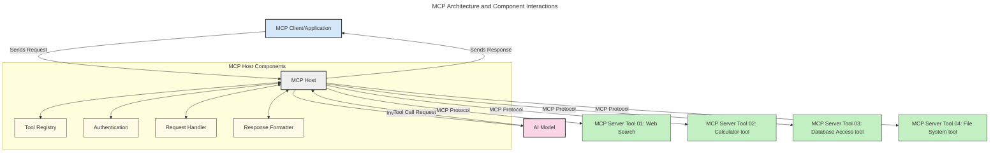
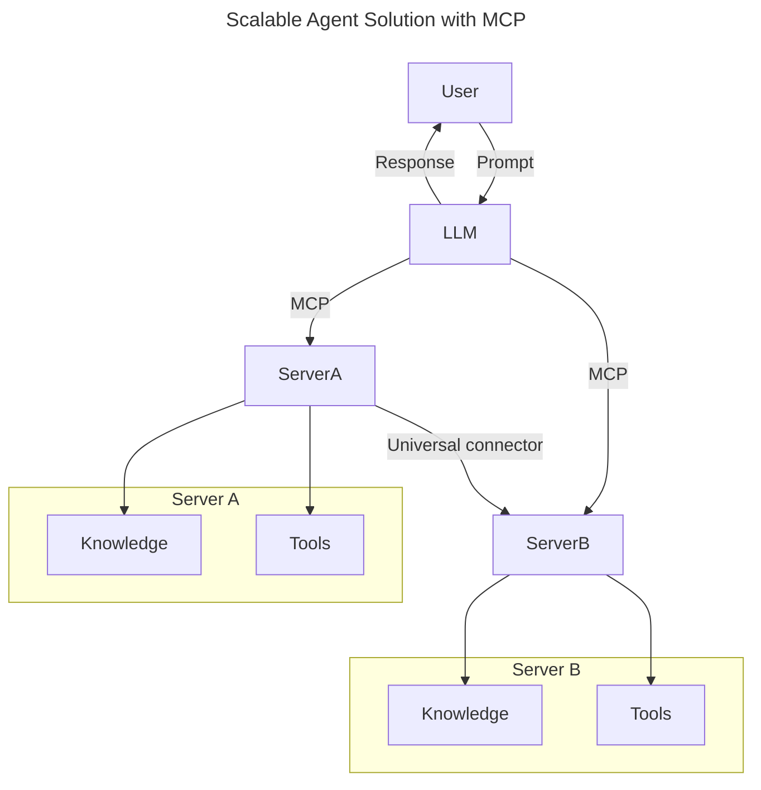

<!--
CO_OP_TRANSLATOR_METADATA:
{
  "original_hash": "9678e0c6945b8e0c23586869b0e26783",
  "translation_date": "2025-10-06T11:15:23+00:00",
  "source_file": "00-Introduction/README.md",
  "language_code": "lt"
}
-->
# Įvadas į Modelio Konteksto Protokolą (MCP): Kodėl jis svarbus mastelio AI programoms

_(Spustelėkite paveikslėlį aukščiau, kad peržiūrėtumėte šios pamokos vaizdo įrašą)_

Generatyviosios AI programos yra didelis žingsnis į priekį, nes jos dažnai leidžia vartotojui sąveikauti su programa naudojant natūralios kalbos užklausas. Tačiau, kai daugiau laiko ir išteklių investuojama į tokias programas, norite užtikrinti, kad galėtumėte lengvai integruoti funkcijas ir išteklius taip, kad būtų lengva plėsti, kad jūsų programa galėtų naudoti daugiau nei vieną modelį ir tvarkyti įvairias modelio subtilybes. Trumpai tariant, generatyviosios AI programos yra lengvai kuriamos pradžioje, tačiau augant ir sudėtingėjant, reikia pradėti apibrėžti architektūrą ir greičiausiai pasikliauti standartu, kad užtikrintumėte, jog jūsų programos būtų kuriamos nuosekliai. Čia MCP padeda organizuoti procesus ir suteikia standartą.

---

## **🔍 Kas yra Modelio Konteksto Protokolas (MCP)?**

**Modelio Konteksto Protokolas (MCP)** yra **atviras, standartizuotas sąsaja**, leidžianti dideliems kalbos modeliams (LLM) sklandžiai sąveikauti su išoriniais įrankiais, API ir duomenų šaltiniais. Jis suteikia nuoseklią architektūrą, kuri pagerina AI modelio funkcionalumą už jų mokymo duomenų ribų, leidžiant kurti protingesnes, mastelio ir labiau reaguojančias AI sistemas.

---

## **🎯 Kodėl standartizacija AI srityje yra svarbi**

Generatyviosios AI programoms tampant sudėtingesnėms, būtina priimti standartus, kurie užtikrintų **mastelį, plėtrą, palaikymą** ir **išvengtų priklausomybės nuo vieno tiekėjo**. MCP sprendžia šiuos poreikius:

- Vienija modelio ir įrankių integracijas
- Sumažina trapius, vienkartinius sprendimus
- Leidžia keliems modeliams iš skirtingų tiekėjų veikti vienoje ekosistemoje

**Pastaba:** Nors MCP save pristato kaip atvirą standartą, nėra planų standartizuoti MCP per esamas standartų organizacijas, tokias kaip IEEE, IETF, W3C, ISO ar kitas.

---

## **📚 Mokymosi tikslai**

Šio straipsnio pabaigoje galėsite:

- Apibrėžti **Modelio Konteksto Protokolą (MCP)** ir jo naudojimo atvejus
- Suprasti, kaip MCP standartizuoja modelio ir įrankių komunikaciją
- Identifikuoti pagrindinius MCP architektūros komponentus
- Išnagrinėti MCP realaus pasaulio taikymus verslo ir kūrimo kontekstuose

---

## **💡 Kodėl Modelio Konteksto Protokolas (MCP) yra revoliucinis**

### **🔗 MCP sprendžia fragmentaciją AI sąveikose**

Prieš MCP, modelių integravimas su įrankiais reikalavo:

- Individualaus kodo kiekvienam įrankio-modelio porai
- Nestandartinių API kiekvienam tiekėjui
- Dažnų sutrikimų dėl atnaujinimų
- Prasto mastelio didėjant įrankių skaičiui

### **✅ MCP standartizacijos privalumai**

| **Privalumas**             | **Aprašymas**                                                                  |
|----------------------------|-------------------------------------------------------------------------------|
| Sąveikumas                | LLM sklandžiai veikia su įrankiais iš skirtingų tiekėjų                        |
| Nuoseklumas               | Vienodas elgesys visose platformose ir įrankiuose                              |
| Pakartotinis naudojimas   | Kartą sukurti įrankiai gali būti naudojami įvairiuose projektuose ir sistemose |
| Spartesnis kūrimas        | Sumažina kūrimo laiką naudojant standartizuotas, lengvai prijungiamas sąsajas  |

---

## **🧱 Aukšto lygio MCP architektūros apžvalga**

MCP naudoja **kliento-serverio modelį**, kuriame:

- **MCP Hostai** valdo AI modelius
- **MCP Klientai** inicijuoja užklausas
- **MCP Serveriai** teikia kontekstą, įrankius ir galimybes

### **Pagrindiniai komponentai:**

- **Ištekliai** – Statiniai arba dinamiški duomenys modeliams  
- **Užklausos** – Iš anksto apibrėžti darbo procesai, skirti vadovauti generavimui  
- **Įrankiai** – Vykdomos funkcijos, tokios kaip paieška, skaičiavimai  
- **Imties ėmimas** – Agentinis elgesys per rekursines sąveikas  

---

## Kaip veikia MCP serveriai

MCP serveriai veikia taip:

- **Užklausos srautas**:
    1. Užklausą inicijuoja galutinis vartotojas arba programinė įranga, veikianti jo vardu.
    2. **MCP Klientas** siunčia užklausą **MCP Hostui**, kuris valdo AI modelio vykdymo aplinką.
    3. **AI Modelis** gauna vartotojo užklausą ir gali prašyti prieigos prie išorinių įrankių ar duomenų per vieną ar kelis įrankių skambučius.
    4. **MCP Hostas**, o ne pats modelis, bendrauja su atitinkamais **MCP Serveriais** naudodamas standartizuotą protokolą.
- **MCP Hosto funkcionalumas**:
    - **Įrankių registras**: Tvarko katalogą su galimais įrankiais ir jų funkcijomis.
    - **Autentifikacija**: Tikrina leidimus naudotis įrankiais.
    - **Užklausų tvarkytojas**: Apdoroja gaunamas įrankių užklausas iš modelio.
    - **Atsakymų formatavimas**: Struktūrizuoja įrankių išvestį formatu, kurį modelis gali suprasti.
- **MCP Serverio vykdymas**:
    - **MCP Hostas** nukreipia įrankių skambučius į vieną ar kelis **MCP Serverius**, kurie atskleidžia specializuotas funkcijas (pvz., paieška, skaičiavimai, duomenų bazės užklausos).
    - **MCP Serveriai** atlieka savo operacijas ir grąžina rezultatus **MCP Hostui** nuosekliu formatu.
    - **MCP Hostas** formatuoja ir perduoda šiuos rezultatus **AI Modeliui**.
- **Atsakymo užbaigimas**:
    - **AI Modelis** įtraukia įrankių išvestį į galutinį atsakymą.
    - **MCP Hostas** siunčia šį atsakymą atgal **MCP Klientui**, kuris perduoda jį galutiniam vartotojui arba kviečiančiai programinei įrangai.

## 👨‍💻 Kaip sukurti MCP serverį (su pavyzdžiais)

MCP serveriai leidžia išplėsti LLM galimybes teikiant duomenis ir funkcijas.

Pasiruošę išbandyti? Štai kalbų ir/arba technologijų specifiniai SDK su pavyzdžiais, kaip sukurti paprastus MCP serverius skirtingomis kalbomis/technologijomis:

- **Python SDK**: https://github.com/modelcontextprotocol/python-sdk

- **TypeScript SDK**: https://github.com/modelcontextprotocol/typescript-sdk

- **Java SDK**: https://github.com/modelcontextprotocol/java-sdk

- **C#/.NET SDK**: https://github.com/modelcontextprotocol/csharp-sdk

## 🌍 MCP realaus pasaulio taikymo pavyzdžiai

MCP leidžia įvairias programas, išplečiant AI galimybes:

| **Taikymas**                | **Aprašymas**                                                                  |
|-----------------------------|-------------------------------------------------------------------------------|
| Verslo duomenų integracija | Sujungia LLM su duomenų bazėmis, CRM ar vidiniais įrankiais                   |
| Agentinės AI sistemos       | Leidžia autonominiams agentams naudotis įrankiais ir sprendimų priėmimo procesais |
| Daugiarūšės programos       | Sujungia tekstą, vaizdą ir garsą vienoje AI programoje                       |
| Realaus laiko duomenų integracija | Įtraukia gyvus duomenis į AI sąveikas, kad būtų tikslesni ir aktualesni rezultatai |

### 🧠 MCP = Universalus standartas AI sąveikoms

Modelio Konteksto Protokolas (MCP) veikia kaip universalus standartas AI sąveikoms, panašiai kaip USB-C standartizavo fizinius įrenginių jungimus. AI pasaulyje MCP suteikia nuoseklią sąsają, leidžiančią modeliams (klientams) sklandžiai integruotis su išoriniais įrankiais ir duomenų tiekėjais (serveriais). Tai pašalina poreikį įvairiems, individualiems protokolams kiekvienam API ar duomenų šaltiniui.

Pagal MCP, MCP suderinamas įrankis (vadinamas MCP serveriu) laikosi vieningo standarto. Šie serveriai gali pateikti sąrašą įrankių ar veiksmų, kuriuos jie siūlo, ir vykdyti tuos veiksmus, kai jų prašo AI agentas. AI agentų platformos, palaikančios MCP, gali aptikti galimus įrankius iš serverių ir iškviesti juos per šį standartizuotą protokolą.

### 💡 Palengvina prieigą prie žinių

Be įrankių siūlymo, MCP taip pat palengvina prieigą prie žinių. Jis leidžia programoms suteikti kontekstą dideliems kalbos modeliams (LLM), susiedamas juos su įvairiais duomenų šaltiniais. Pavyzdžiui, MCP serveris gali atstovauti įmonės dokumentų saugyklą, leidžiant agentams pagal poreikį gauti aktualią informaciją. Kitas serveris galėtų tvarkyti specifinius veiksmus, tokius kaip el. laiškų siuntimas ar įrašų atnaujinimas. Agentui šie yra tiesiog įrankiai, kuriuos jis gali naudoti—kai kurie įrankiai grąžina duomenis (žinių kontekstą), o kiti atlieka veiksmus. MCP efektyviai valdo abu.

Agentas, prisijungęs prie MCP serverio, automatiškai sužino serverio galimas funkcijas ir prieinamus duomenis per standartinį formatą. Ši standartizacija leidžia dinamišką įrankių prieinamumą. Pavyzdžiui, pridėjus naują MCP serverį į agento sistemą, jo funkcijos tampa iškart naudojamos be papildomo agento instrukcijų pritaikymo.

Ši supaprastinta integracija atitinka srautą, pavaizduotą diagramoje, kur serveriai teikia tiek įrankius, tiek žinias, užtikrindami sklandų bendradarbiavimą tarp sistemų.

### 👉 Pavyzdys: Mastelio agento sprendimas

Universalus jungiklis leidžia MCP serveriams bendrauti ir dalintis galimybėmis tarpusavyje, leidžiant ServerA deleguoti užduotis ServerB arba pasiekti jo įrankius ir žinias. Tai sujungia įrankius ir duomenis tarp serverių, palaikant mastelio ir modulinę agentų architektūrą. Kadangi MCP standartizuoja įrankių pateikimą, agentai gali dinamiškai aptikti ir nukreipti užklausas tarp serverių be kietai užkoduotų integracijų.

Įrankių ir žinių sujungimas: Įrankiai ir duomenys gali būti pasiekiami tarp serverių, leidžiant kurti mastelio ir modulinę agentinę architektūrą.

### 🔄 Pažangūs MCP scenarijai su klientų pusės LLM integracija

Be pagrindinės MCP architektūros, yra pažangių scenarijų, kur tiek klientas, tiek serveris turi LLM, leidžiant sudėtingesnes sąveikas. Toliau pateiktoje diagramoje **Kliento programa** galėtų būti IDE su daugybe MCP įrankių, prieinamų LLM naudoti:

```mermaid
---
title: Advanced MCP Scenarios with Client-Server LLM Integration
description: A sequence diagram showing the detailed interaction flow between user, client application, client LLM, multiple MCP servers, and server LLM, illustrating tool discovery, user interaction, direct tool calling, and feature negotiation phases
---
sequenceDiagram
    autonumber
    actor User as 👤 User
    participant ClientApp as 🖥️ Client App
    participant ClientLLM as 🧠 Client LLM
    participant Server1 as 🔧 MCP Server 1
    participant Server2 as 📚 MCP Server 2
    participant ServerLLM as 🤖 Server LLM
    
    %% Discovery Phase
    rect rgb(220, 240, 255)
        Note over ClientApp, Server2: TOOL DISCOVERY PHASE
        ClientApp->>+Server1: Request available tools/resources
        Server1-->>-ClientApp: Return tool list (JSON)
        ClientApp->>+Server2: Request available tools/resources
        Server2-->>-ClientApp: Return tool list (JSON)
        Note right of ClientApp: Store combined tool<br/>catalog locally
    end
    
    %% User Interaction
    rect rgb(255, 240, 220)
        Note over User, ClientLLM: USER INTERACTION PHASE
        User->>+ClientApp: Enter natural language prompt
        ClientApp->>+ClientLLM: Forward prompt + tool catalog
        ClientLLM->>-ClientLLM: Analyze prompt & select tools
    end
    
    %% Scenario A: Direct Tool Calling
    alt Direct Tool Calling
        rect rgb(220, 255, 220)
            Note over ClientApp, Server1: SCENARIO A: DIRECT TOOL CALLING
            ClientLLM->>+ClientApp: Request tool execution
            ClientApp->>+Server1: Execute specific tool
            Server1-->>-ClientApp: Return results
            ClientApp->>+ClientLLM: Process results
            ClientLLM-->>-ClientApp: Generate response
            ClientApp-->>-User: Display final answer
        end
    
    %% Scenario B: Feature Negotiation (VS Code style)
    else Feature Negotiation (VS Code style)
        rect rgb(255, 220, 220)
            Note over ClientApp, ServerLLM: SCENARIO B: FEATURE NEGOTIATION
            ClientLLM->>+ClientApp: Identify needed capabilities
            ClientApp->>+Server2: Negotiate features/capabilities
            Server2->>+ServerLLM: Request additional context
            ServerLLM-->>-Server2: Provide context
            Server2-->>-ClientApp: Return available features
            ClientApp->>+Server2: Call negotiated tools
            Server2-->>-ClientApp: Return results
            ClientApp->>+ClientLLM: Process results
            ClientLLM-->>-ClientApp: Generate response
            ClientApp-->>-User: Display final answer
        end
    end
```

## 🔐 Praktiniai MCP privalumai

Štai praktiniai MCP naudojimo privalumai:

- **Šviežumas**: Modeliai gali pasiekti naujausią informaciją už jų mokymo duomenų ribų
- **Galimybių plėtra**: Modeliai gali naudotis specializuotais įrankiais užduotims, kurioms jie nebuvo apmokyti
- **Sumažintos haliucinacijos**: Išoriniai duomenų šaltiniai suteikia faktinį pagrindą
- **Privatumas**: Jautrūs duomenys gali likti saugioje aplinkoje, o ne būti įtraukti į užklausas

## 📌 Pagrindinės išvados

Štai pagrindinės išvados apie MCP naudojimą:

- **MCP** standartizuoja, kaip AI modeliai sąveikauja su įrankiais ir duomenimis
- Skatina **plėtrą, nuoseklumą ir sąveikumą**
- MCP padeda **sumažinti kūrimo laiką, pagerinti patikimumą ir išplėsti modelio galimybes**
- Kliento-serverio architektūra **leidžia kurti lankstias, plėtrias AI programas**

## 🧠 Užduotis

Pagalvokite apie AI programą, kurią norėtumėte sukurti.

- Kokie **išoriniai įrankiai ar duomenys** galėtų pagerinti jos galimybes?
- Kaip MCP galėtų padaryti integraciją **paprastesnę ir patikimesnę?**

## Papildomi ištekliai

- [MCP GitHub saugykla](https://github.com/modelcontextprotocol)

## Kas toliau

Toliau: [1 skyrius: Pagrindinės sąvokos](../01-CoreConcepts/README.md)

---

**Atsakomybės atsisakymas**:  
Šis dokumentas buvo išverstas naudojant AI vertimo paslaugą [Co-op Translator](https://github.com/Azure/co-op-translator). Nors siekiame tikslumo, prašome atkreipti dėmesį, kad automatiniai vertimai gali turėti klaidų ar netikslumų. Originalus dokumentas jo gimtąja kalba turėtų būti laikomas autoritetingu šaltiniu. Kritinei informacijai rekomenduojama naudoti profesionalų žmogaus vertimą. Mes neprisiimame atsakomybės už nesusipratimus ar neteisingus interpretavimus, atsiradusius dėl šio vertimo naudojimo.