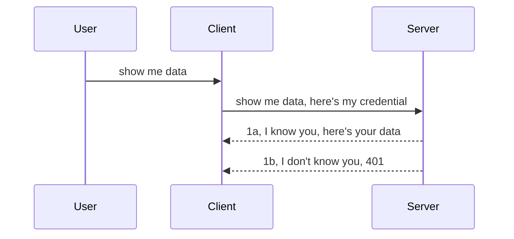

<!--
CO_OP_TRANSLATOR_METADATA:
{
  "original_hash": "5b00b8a8971a07d2d8803be4c9f138f8",
  "translation_date": "2025-10-07T01:10:45+00:00",
  "source_file": "03-GettingStarted/11-simple-auth/README.md",
  "language_code": "lt"
}
-->
# Paprasta autentifikacija

MCP SDK palaiko OAuth 2.1 naudojimą, kuris, tiesą sakant, yra gana sudėtingas procesas, apimantis tokias sąvokas kaip autentifikacijos serveris, resursų serveris, kredencialų pateikimas, kodo gavimas, kodo keitimas į „bearer“ žetoną, kol galiausiai galite pasiekti savo resursų duomenis. Jei nesate susipažinę su OAuth, kuris yra puikus įgyvendinimo būdas, verta pradėti nuo paprastesnio autentifikacijos lygio ir palaipsniui pereiti prie geresnio saugumo. Štai kodėl egzistuoja šis skyrius – padėti jums pereiti prie pažangesnės autentifikacijos.

## Kas yra autentifikacija?

Autentifikacija – tai trumpinys, reiškiantis autentifikavimą ir autorizavimą. Idėja yra ta, kad turime atlikti du dalykus:

- **Autentifikavimas** – tai procesas, kurio metu nustatome, ar leisti žmogui patekti į mūsų „namus“, ar jis turi teisę būti „čia“, t. y. turėti prieigą prie mūsų resursų serverio, kuriame yra MCP serverio funkcijos.
- **Autorizavimas** – tai procesas, kurio metu nustatome, ar vartotojas turėtų turėti prieigą prie konkrečių resursų, kurių jis prašo, pavyzdžiui, prie šių užsakymų ar produktų, arba ar jam leidžiama skaityti turinį, bet ne ištrinti, kaip kitą pavyzdį.

## Kredencialai: kaip sistema sužino, kas mes esame

Dauguma interneto kūrėjų pradeda galvoti apie kredencialų pateikimą serveriui, paprastai slapto rakto, kuris nurodo, ar jie turi teisę būti „čia“ („Autentifikavimas“). Šis kredencialas paprastai yra base64 koduota vartotojo vardo ir slaptažodžio versija arba API raktas, kuris unikaliai identifikuoja konkretų vartotoją.

Tai apima jo siuntimą per antraštę, vadinamą „Authorization“, štai taip:

```json
{ "Authorization": "secret123" }
```

Tai paprastai vadinama pagrindine autentifikacija. Bendras procesas veikia taip:



Dabar, kai suprantame, kaip tai veikia iš proceso perspektyvos, kaip tai įgyvendinti? Dauguma interneto serverių turi sąvoką, vadinamą „middleware“ – tai kodo dalis, kuri vykdoma kaip užklausos dalis ir gali patikrinti kredencialus. Jei kredencialai galioja, užklausa leidžiama tęsti. Jei užklausa neturi galiojančių kredencialų, gaunate autentifikacijos klaidą. Pažiūrėkime, kaip tai galima įgyvendinti:

**Python**

```python
class AuthMiddleware(BaseHTTPMiddleware):
    async def dispatch(self, request, call_next):

        has_header = request.headers.get("Authorization")
        if not has_header:
            print("-> Missing Authorization header!")
            return Response(status_code=401, content="Unauthorized")

        if not valid_token(has_header):
            print("-> Invalid token!")
            return Response(status_code=403, content="Forbidden")

        print("Valid token, proceeding...")
       
        response = await call_next(request)
        # add any customer headers or change in the response in some way
        return response


starlette_app.add_middleware(CustomHeaderMiddleware)
```

Čia mes:

- Sukūrėme „middleware“, pavadintą `AuthMiddleware`, kurio metodą `dispatch` iškviečia interneto serveris.
- Pridėjome „middleware“ prie interneto serverio:

    ```python
    starlette_app.add_middleware(AuthMiddleware)
    ```

- Parašėme validacijos logiką, kuri tikrina, ar yra „Authorization“ antraštė ir ar siunčiamas slaptas raktas galioja:

    ```python
    has_header = request.headers.get("Authorization")
    if not has_header:
        print("-> Missing Authorization header!")
        return Response(status_code=401, content="Unauthorized")

    if not valid_token(has_header):
        print("-> Invalid token!")
        return Response(status_code=403, content="Forbidden")
    ```

    jei slaptas raktas yra ir galioja, leidžiame užklausai tęsti, iškviesdami `call_next` ir grąžiname atsakymą.

    ```python
    response = await call_next(request)
    # add any customer headers or change in the response in some way
    return response
    ```

Kaip tai veikia: jei interneto užklausa siunčiama serveriui, „middleware“ bus iškviestas ir, atsižvelgiant į jo įgyvendinimą, arba leis užklausai tęsti, arba grąžins klaidą, nurodančią, kad klientui neleidžiama tęsti.

**TypeScript**

Čia sukuriame „middleware“ naudodami populiarų „Express“ framework ir perimame užklausą prieš jai pasiekiant MCP serverį. Štai kodas:

```typescript
function isValid(secret) {
    return secret === "secret123";
}

app.use((req, res, next) => {
    // 1. Authorization header present?  
    if(!req.headers["Authorization"]) {
        res.status(401).send('Unauthorized');
    }
    
    let token = req.headers["Authorization"];

    // 2. Check validity.
    if(!isValid(token)) {
        res.status(403).send('Forbidden');
    }

   
    console.log('Middleware executed');
    // 3. Passes request to the next step in the request pipeline.
    next();
});
```

Šiame kode mes:

1. Tikriname, ar „Authorization“ antraštė yra, jei ne, siunčiame 401 klaidą.
2. Užtikriname, kad kredencialas/žetonas galioja, jei ne, siunčiame 403 klaidą.
3. Galiausiai perduodame užklausą užklausų grandinėje ir grąžiname prašomą resursą.

## Užduotis: įgyvendinti autentifikaciją

Panaudokime savo žinias ir pabandykime tai įgyvendinti. Štai planas:

Serveris

- Sukurti interneto serverį ir MCP instanciją.
- Įgyvendinti „middleware“ serveriui.

Klientas 

- Siųsti interneto užklausą su kredencialu per antraštę.

### -1- Sukurti interneto serverį ir MCP instanciją

Pirmame žingsnyje turime sukurti interneto serverio instanciją ir MCP serverį.

**Python**

Čia sukuriame MCP serverio instanciją, „Starlette“ interneto programą ir ją talpiname naudodami „uvicorn“.

```python
# creating MCP Server

app = FastMCP(
    name="MCP Resource Server",
    instructions="Resource Server that validates tokens via Authorization Server introspection",
    host=settings["host"],
    port=settings["port"],
    debug=True
)

# creating starlette web app
starlette_app = app.streamable_http_app()

# serving app via uvicorn
async def run(starlette_app):
    import uvicorn
    config = uvicorn.Config(
            starlette_app,
            host=app.settings.host,
            port=app.settings.port,
            log_level=app.settings.log_level.lower(),
        )
    server = uvicorn.Server(config)
    await server.serve()

run(starlette_app)
```

Šiame kode mes:

- Sukuriame MCP serverį.
- Sukuriame „Starlette“ interneto programą iš MCP serverio, `app.streamable_http_app()`.
- Talpiname ir aptarnaujame interneto programą naudodami „uvicorn“ `server.serve()`.

**TypeScript**

Čia sukuriame MCP serverio instanciją.

```typescript
const server = new McpServer({
      name: "example-server",
      version: "1.0.0"
    });

    // ... set up server resources, tools, and prompts ...
```

Šis MCP serverio sukūrimas turės vykti mūsų POST /mcp maršruto apibrėžime, todėl perkelkime aukščiau pateiktą kodą taip:

```typescript
import express from "express";
import { randomUUID } from "node:crypto";
import { McpServer } from "@modelcontextprotocol/sdk/server/mcp.js";
import { StreamableHTTPServerTransport } from "@modelcontextprotocol/sdk/server/streamableHttp.js";
import { isInitializeRequest } from "@modelcontextprotocol/sdk/types.js"

const app = express();
app.use(express.json());

// Map to store transports by session ID
const transports: { [sessionId: string]: StreamableHTTPServerTransport } = {};

// Handle POST requests for client-to-server communication
app.post('/mcp', async (req, res) => {
  // Check for existing session ID
  const sessionId = req.headers['mcp-session-id'] as string | undefined;
  let transport: StreamableHTTPServerTransport;

  if (sessionId && transports[sessionId]) {
    // Reuse existing transport
    transport = transports[sessionId];
  } else if (!sessionId && isInitializeRequest(req.body)) {
    // New initialization request
    transport = new StreamableHTTPServerTransport({
      sessionIdGenerator: () => randomUUID(),
      onsessioninitialized: (sessionId) => {
        // Store the transport by session ID
        transports[sessionId] = transport;
      },
      // DNS rebinding protection is disabled by default for backwards compatibility. If you are running this server
      // locally, make sure to set:
      // enableDnsRebindingProtection: true,
      // allowedHosts: ['127.0.0.1'],
    });

    // Clean up transport when closed
    transport.onclose = () => {
      if (transport.sessionId) {
        delete transports[transport.sessionId];
      }
    };
    const server = new McpServer({
      name: "example-server",
      version: "1.0.0"
    });

    // ... set up server resources, tools, and prompts ...

    // Connect to the MCP server
    await server.connect(transport);
  } else {
    // Invalid request
    res.status(400).json({
      jsonrpc: '2.0',
      error: {
        code: -32000,
        message: 'Bad Request: No valid session ID provided',
      },
      id: null,
    });
    return;
  }

  // Handle the request
  await transport.handleRequest(req, res, req.body);
});

// Reusable handler for GET and DELETE requests
const handleSessionRequest = async (req: express.Request, res: express.Response) => {
  const sessionId = req.headers['mcp-session-id'] as string | undefined;
  if (!sessionId || !transports[sessionId]) {
    res.status(400).send('Invalid or missing session ID');
    return;
  }
  
  const transport = transports[sessionId];
  await transport.handleRequest(req, res);
};

// Handle GET requests for server-to-client notifications via SSE
app.get('/mcp', handleSessionRequest);

// Handle DELETE requests for session termination
app.delete('/mcp', handleSessionRequest);

app.listen(3000);
```

Dabar matote, kaip MCP serverio sukūrimas buvo perkeltas į `app.post("/mcp")`.

Pereikime prie kito žingsnio – sukurti „middleware“, kad galėtume patikrinti gaunamus kredencialus.

### -2- Įgyvendinti „middleware“ serveriui

Dabar pereikime prie „middleware“ dalies. Čia sukursime „middleware“, kuris ieškos kredencialo „Authorization“ antraštėje ir jį patikrins. Jei jis priimtinas, užklausa tęsis ir atliks tai, ką reikia (pvz., išvardins įrankius, perskaitys resursą ar bet kokią MCP funkciją, kurios prašė klientas).

**Python**

Norėdami sukurti „middleware“, turime sukurti klasę, paveldinčią iš `BaseHTTPMiddleware`. Yra du įdomūs elementai:

- Užklausa `request`, iš kurios skaitome antraštės informaciją.
- `call_next` – atgalinis iškvietimas, kurį turime iškviesti, jei klientas pateikė priimtiną kredencialą.

Pirmiausia turime apdoroti atvejį, jei „Authorization“ antraštė trūksta:

```python
has_header = request.headers.get("Authorization")

# no header present, fail with 401, otherwise move on.
if not has_header:
    print("-> Missing Authorization header!")
    return Response(status_code=401, content="Unauthorized")
```

Čia siunčiame 401 klaidos pranešimą, nes klientas nesugeba autentifikuotis.

Toliau, jei pateiktas kredencialas, turime patikrinti jo galiojimą taip:

```python
 if not valid_token(has_header):
    print("-> Invalid token!")
    return Response(status_code=403, content="Forbidden")
```

Atkreipkite dėmesį, kaip aukščiau siunčiame 403 klaidos pranešimą. Pažiūrėkime visą „middleware“ žemiau, įgyvendinant viską, ką minėjome:

```python
class AuthMiddleware(BaseHTTPMiddleware):
    async def dispatch(self, request, call_next):

        has_header = request.headers.get("Authorization")
        if not has_header:
            print("-> Missing Authorization header!")
            return Response(status_code=401, content="Unauthorized")

        if not valid_token(has_header):
            print("-> Invalid token!")
            return Response(status_code=403, content="Forbidden")

        print("Valid token, proceeding...")
        print(f"-> Received {request.method} {request.url}")
        response = await call_next(request)
        response.headers['Custom'] = 'Example'
        return response

```

Puiku, bet kaip dėl `valid_token` funkcijos? Štai ji žemiau:

```python
# DON'T use for production - improve it !!
def valid_token(token: str) -> bool:
    # remove the "Bearer " prefix
    if token.startswith("Bearer "):
        token = token[7:]
        return token == "secret-token"
    return False
```

Tai, žinoma, turėtų būti patobulinta.

SVARBU: NIEKADA neturėtumėte laikyti slaptų duomenų kode. Idealiu atveju turėtumėte gauti palyginimo vertę iš duomenų šaltinio arba IDP (identiteto paslaugų teikėjo), arba dar geriau – leisti IDP atlikti validaciją.

**TypeScript**

Norėdami tai įgyvendinti su „Express“, turime iškviesti `use` metodą, kuris priima „middleware“ funkcijas.

Turime:

- Sąveikauti su užklausos kintamuoju, kad patikrintume perduotą kredencialą „Authorization“ savybėje.
- Patikrinti kredencialą, ir jei jis galioja, leisti užklausai tęsti, kad kliento MCP užklausa atliktų tai, ką reikia (pvz., išvardintų įrankius, perskaitytų resursą ar bet kokį kitą MCP susijusį veiksmą).

Čia tikriname, ar „Authorization“ antraštė yra, ir jei ne, sustabdome užklausą:

```typescript
if(!req.headers["authorization"]) {
    res.status(401).send('Unauthorized');
    return;
}
```

Jei antraštė nėra siunčiama, gaunate 401 klaidą.

Toliau tikriname, ar kredencialas galioja, jei ne, vėl sustabdome užklausą, bet su šiek tiek kitokiu pranešimu:

```typescript
if(!isValid(token)) {
    res.status(403).send('Forbidden');
    return;
} 
```

Atkreipkite dėmesį, kaip dabar gaunate 403 klaidą.

Štai visas kodas:

```typescript
app.use((req, res, next) => {
    console.log('Request received:', req.method, req.url, req.headers);
    console.log('Headers:', req.headers["authorization"]);
    if(!req.headers["authorization"]) {
        res.status(401).send('Unauthorized');
        return;
    }
    
    let token = req.headers["authorization"];

    if(!isValid(token)) {
        res.status(403).send('Forbidden');
        return;
    }  

    console.log('Middleware executed');
    next();
});
```

Mes nustatėme interneto serverį, kad priimtų „middleware“, kuris tikrina kredencialą, kurį klientas, tikimės, siunčia mums. O kaip pats klientas?

### -3- Siųsti interneto užklausą su kredencialu per antraštę

Turime užtikrinti, kad klientas perduoda kredencialą per antraštę. Kadangi naudosime MCP klientą, turime išsiaiškinti, kaip tai padaryti.

**Python**

Klientui turime perduoti antraštę su mūsų kredencialu taip:

```python
# DON'T hardcode the value, have it at minimum in an environment variable or a more secure storage
token = "secret-token"

async with streamablehttp_client(
        url = f"http://localhost:{port}/mcp",
        headers = {"Authorization": f"Bearer {token}"}
    ) as (
        read_stream,
        write_stream,
        session_callback,
    ):
        async with ClientSession(
            read_stream,
            write_stream
        ) as session:
            await session.initialize()
      
            # TODO, what you want done in the client, e.g list tools, call tools etc.
```

Atkreipkite dėmesį, kaip užpildome `headers` savybę taip: `headers = {"Authorization": f"Bearer {token}"}`.

**TypeScript**

Tai galime išspręsti dviem žingsniais:

1. Užpildyti konfigūracijos objektą su mūsų kredencialu.
2. Perduoti konfigūracijos objektą transportui.

```typescript

// DON'T hardcode the value like shown here. At minimum have it as a env variable and use something like dotenv (in dev mode).
let token = "secret123"

// define a client transport option object
let options: StreamableHTTPClientTransportOptions = {
  sessionId: sessionId,
  requestInit: {
    headers: {
      "Authorization": "secret123"
    }
  }
};

// pass the options object to the transport
async function main() {
   const transport = new StreamableHTTPClientTransport(
      new URL(serverUrl),
      options
   );
```

Čia matote, kaip turėjome sukurti `options` objektą ir patalpinti mūsų antraštes po `requestInit` savybe.

SVARBU: Kaip tai patobulinti? Dabartinis įgyvendinimas turi keletą problemų. Pirmiausia, perduoti kredencialą tokiu būdu yra gana rizikinga, nebent bent jau turite HTTPS. Net ir tada kredencialas gali būti pavogtas, todėl jums reikia sistemos, kurioje galėtumėte lengvai atšaukti žetoną ir pridėti papildomus patikrinimus, pvz., iš kur pasaulyje jis ateina, ar užklausa vyksta per dažnai (botų elgesys). Trumpai tariant, yra daugybė rūpesčių.

Vis dėlto, labai paprastiems API, kur nenorite, kad kas nors skambintų jūsų API be autentifikacijos, tai, ką turime čia, yra gera pradžia.

Dabar pabandykime šiek tiek sustiprinti saugumą, naudodami standartizuotą formatą, pvz., JSON Web Token, dar žinomą kaip JWT arba „JOT“ žetonai.

## JSON Web Token (JWT)

Taigi, mes stengiamės patobulinti paprastų kredencialų siuntimą. Kokie yra tiesioginiai patobulinimai, kuriuos gauname priimdami JWT?

- **Saugumo patobulinimai**. Naudojant pagrindinę autentifikaciją, vartotojo vardas ir slaptažodis siunčiami kaip base64 koduotas žetonas (arba API raktas) vėl ir vėl, o tai padidina riziką. Naudojant JWT, vartotojo vardas ir slaptažodis siunčiami, o mainais gaunamas žetonas, kuris taip pat yra laiko ribotas, t. y. jis pasibaigs. JWT leidžia lengvai naudoti smulkiagrūdę prieigos kontrolę, naudojant roles, apimtis ir leidimus.
- **Bevalstybė ir mastelio keitimas**. JWT yra savarankiški, jie neša visą vartotojo informaciją ir pašalina poreikį saugoti serverio pusės sesijos saugyklą. Žetonas taip pat gali būti patikrintas lokaliai.
- **Sąveikumas ir federacija**. JWT yra pagrindinė „Open ID Connect“ dalis ir naudojama su žinomais identiteto teikėjais, tokiais kaip „Entra ID“, „Google Identity“ ir „Auth0“. Jie taip pat leidžia naudoti vieno prisijungimo funkciją ir daug daugiau, todėl tai yra įmonės lygio sprendimas.
- **Moduliacija ir lankstumas**. JWT taip pat gali būti naudojami su API vartais, tokiais kaip „Azure API Management“, „NGINX“ ir kt. Jie palaiko autentifikacijos scenarijus ir serverio-serverio komunikaciją, įskaitant apsimetimo ir delegavimo scenarijus.
- **Našumas ir talpyklos naudojimas**. JWT gali būti talpinami po dekodavimo, o tai sumažina analizės poreikį. Tai ypač padeda didelio srauto programoms, nes pagerina pralaidumą ir sumažina apkrovą jūsų pasirinktoje infrastruktūroje.
- **Pažangios funkcijos**. Jie taip pat palaiko introspekciją (patikrinimą, ar žetonas galioja serveryje) ir atšaukimą (žetono galiojimo panaikinimą).

Turint visus šiuos privalumus, pažiūrėkime, kaip galime patobulinti savo įgyvendinimą.

## Pagrindinės autentifikacijos pavertimas į JWT

Taigi, pakeitimai, kuriuos turime atlikti aukšto lygio perspektyvoje, yra:

- **Išmokti sukurti JWT žetoną** ir paruošti jį siuntimui iš kliento į serverį.
- **Patikrinti JWT žetoną**, ir jei jis galioja, leisti klientui pasiekti mūsų resursus.
- **Saugus žetono saugojimas**. Kaip saugome šį žetoną.
- **Maršrutų apsauga**. Turime apsaugoti maršrutus, mūsų atveju – apsaugoti maršrutus ir konkrečias MCP funkcijas.
- **Pridėti atnaujinimo žetonus**. Užtikrinti, kad sukuriame trumpalaikius žetonus, bet ilgalaikius atnaujinimo žetonus, kurie gali būti naudojami naujų žetonų gavimui, jei jie pasibaigia. Taip pat užtikrinti, kad yra atnaujinimo galinis taškas ir rotacijos strategija.

### -1- Sukurti JWT žetoną

Pirmiausia, JWT žetonas turi šias dalis:

- **Antraštė**, naudojamas algoritmas ir žetono tipas.
- **Turinys**, teiginiai, pvz., sub (vartotojas arba subjektas, kurį žetonas reprezentuoja. Autentifikacijos scenarijuje tai paprastai yra vartotojo ID), exp (kada jis pasibaigia), role (rolė).
- **Parašas**, pasirašytas slaptu raktu arba privačiu raktu.

Tam turėsime sukurti antraštę, turinį ir užkoduotą žetoną.

**Python**

```python

import jwt
import jwt
from jwt.exceptions import ExpiredSignatureError, InvalidTokenError
import datetime

# Secret key used to sign the JWT
secret_key = 'your-secret-key'

header = {
    "alg": "HS256",
    "typ": "JWT"
}

# the user info andits claims and expiry time
payload = {
    "sub": "1234567890",               # Subject (user ID)
    "name": "User Userson",                # Custom claim
    "admin": True,                     # Custom claim
    "iat": datetime.datetime.utcnow(),# Issued at
    "exp": datetime.datetime.utcnow() + datetime.timedelta(hours=1)  # Expiry
}

# encode it
encoded_jwt = jwt.encode(payload, secret_key, algorithm="HS256", headers=header)
```

Šiame kode mes:

- Apibrėžėme antraštę, naudodami HS256 kaip algoritmą ir tipą, kad būtų JWT.
- Sukūrėme turinį, kuriame yra subjektas arba vartotojo ID, vartotojo vardas, rolė, kada jis buvo išduotas ir kada jis nustatytas pasibaigti, taip įgyvendindami laiko ribotą aspektą, kurį minėjome anksčiau.

**TypeScript**

Čia mums reikės kai kurių priklausomybių, kurios padės mums sukurti JWT žetoną.

Priklausomybės

```sh

npm install jsonwebtoken
npm install --save-dev @types/jsonwebtoken
```

Dabar, kai tai turime, sukurkime antraštę, turinį ir per tai sukurkime užkoduotą žetoną.

```typescript
import jwt from 'jsonwebtoken';

const secretKey = 'your-secret-key'; // Use env vars in production

// Define the payload
const payload = {
  sub: '1234567890',
  name: 'User usersson',
  admin: true,
  iat: Math.floor(Date.now() / 1000), // Issued at
  exp: Math.floor(Date.now() / 1000) + 60 * 60 // Expires in 1 hour
};

// Define the header (optional, jsonwebtoken sets defaults)
const header = {
  alg: 'HS256',
  typ: 'JWT'
};

// Create the token
const token = jwt.sign(payload, secretKey, {
  algorithm: 'HS256',
  header: header
});

console.log('JWT:', token);
```

Šis žetonas:

Pasirašytas naudojant HS256
Galioja 1 valandą
Apima teiginius, tokius kaip sub, name, admin, iat ir exp.

### -2- Patikrinti žetoną

Taip pat turėsime patikrinti žetoną, tai turėtume atlikti serveryje, kad įsitikintume, jog tai, ką klientas siunčia mums, iš tikrųjų galioja. Čia yra daug patikrinimų, kuriuos turėtume atlikti, nuo struktūros validacijos iki galiojimo. Taip pat rekomenduojama pridėti kitus patikrinimus, kad įsitikintumėte, jog vartotojas yra jūsų sistemoje ir daugiau.

Norėdami patikrinti žetoną, turime jį dekoduoti, kad galėtume jį perskaityti, ir tada pradėti tikrinti jo galiojimą:

**Python**

@@CODE_BLOCK
Toliau pažvelkime į prieigos kontrolę pagal vaidmenis, dar vadinamą RBAC.

## Pridedame prieigos kontrolę pagal vaidmenis

Idėja yra ta, kad norime išreikšti, jog skirtingi vaidmenys turi skirtingas teises. Pavyzdžiui, mes manome, kad administratorius gali daryti viską, paprastas vartotojas gali skaityti/rašyti, o svečias gali tik skaityti. Todėl čia yra keletas galimų leidimų lygių:

- Admin.Write 
- User.Read
- Guest.Read

Pažiūrėkime, kaip galime įgyvendinti tokią kontrolę naudojant tarpinius modulius. Tarpiniai moduliai gali būti pridedami tiek konkrečiam maršrutui, tiek visiems maršrutams.

**Python**

```python
from starlette.middleware.base import BaseHTTPMiddleware
from starlette.responses import JSONResponse
import jwt

# DON'T have the secret in the code like, this is for demonstration purposes only. Read it from a safe place.
SECRET_KEY = "your-secret-key" # put this in env variable
REQUIRED_PERMISSION = "User.Read"

class JWTPermissionMiddleware(BaseHTTPMiddleware):
    async def dispatch(self, request, call_next):
        auth_header = request.headers.get("Authorization")
        if not auth_header or not auth_header.startswith("Bearer "):
            return JSONResponse({"error": "Missing or invalid Authorization header"}, status_code=401)

        token = auth_header.split(" ")[1]
        try:
            decoded = jwt.decode(token, SECRET_KEY, algorithms=["HS256"])
        except jwt.ExpiredSignatureError:
            return JSONResponse({"error": "Token expired"}, status_code=401)
        except jwt.InvalidTokenError:
            return JSONResponse({"error": "Invalid token"}, status_code=401)

        permissions = decoded.get("permissions", [])
        if REQUIRED_PERMISSION not in permissions:
            return JSONResponse({"error": "Permission denied"}, status_code=403)

        request.state.user = decoded
        return await call_next(request)


```

Yra keletas skirtingų būdų pridėti tarpinį modulį, kaip parodyta žemiau:

```python

# Alt 1: add middleware while constructing starlette app
middleware = [
    Middleware(JWTPermissionMiddleware)
]

app = Starlette(routes=routes, middleware=middleware)

# Alt 2: add middleware after starlette app is a already constructed
starlette_app.add_middleware(JWTPermissionMiddleware)

# Alt 3: add middleware per route
routes = [
    Route(
        "/mcp",
        endpoint=..., # handler
        middleware=[Middleware(JWTPermissionMiddleware)]
    )
]
```

**TypeScript**

Galime naudoti `app.use` ir tarpinį modulį, kuris bus vykdomas visiems užklausoms.

```typescript
app.use((req, res, next) => {
    console.log('Request received:', req.method, req.url, req.headers);
    console.log('Headers:', req.headers["authorization"]);

    // 1. Check if authorization header has been sent

    if(!req.headers["authorization"]) {
        res.status(401).send('Unauthorized');
        return;
    }
    
    let token = req.headers["authorization"];

    // 2. Check if token is valid
    if(!isValid(token)) {
        res.status(403).send('Forbidden');
        return;
    }  

    // 3. Check if token user exist in our system
    if(!isExistingUser(token)) {
        res.status(403).send('Forbidden');
        console.log("User does not exist");
        return;
    }
    console.log("User exists");

    // 4. Verify the token has the right permissions
    if(!hasScopes(token, ["User.Read"])){
        res.status(403).send('Forbidden - insufficient scopes');
    }

    console.log("User has required scopes");

    console.log('Middleware executed');
    next();
});

```

Yra nemažai dalykų, kuriuos mūsų tarpinis modulis gali ir turėtų atlikti, būtent:

1. Patikrinti, ar yra autorizacijos antraštė.
2. Patikrinti, ar žetonas galioja. Mes naudojame `isValid`, tai yra metodas, kurį parašėme, kad patikrintume JWT žetono vientisumą ir galiojimą.
3. Patikrinti, ar vartotojas egzistuoja mūsų sistemoje.

   ```typescript
    // users in DB
   const users = [
     "user1",
     "User usersson",
   ]

   function isExistingUser(token) {
     let decodedToken = verifyToken(token);

     // TODO, check if user exists in DB
     return users.includes(decodedToken?.name || "");
   }
   ```

   Aukščiau sukūrėme labai paprastą `users` sąrašą, kuris, žinoma, turėtų būti duomenų bazėje.

4. Be to, turėtume patikrinti, ar žetonas turi tinkamus leidimus.

   ```typescript
   if(!hasScopes(token, ["User.Read"])){
        res.status(403).send('Forbidden - insufficient scopes');
   }
   ```

   Šiame aukščiau pateiktame tarpiniame kode mes tikriname, ar žetonas turi User.Read leidimą. Jei ne, siunčiame 403 klaidą. Žemiau pateiktas `hasScopes` pagalbinis metodas.

   ```typescript
   function hasScopes(scope: string, requiredScopes: string[]) {
     let decodedToken = verifyToken(scope);
    return requiredScopes.every(scope => decodedToken?.scopes.includes(scope));
  }
   ```

Have a think which additional checks you should be doing, but these are the absolute minimum of checks you should be doing.

Using Express as a web framework is a common choice. There are helpers library when you use JWT so you can write less code.

- `express-jwt`, helper library that provides a middleware that helps decode your token.
- `express-jwt-permissions`, this provides a middleware `guard` that helps check if a certain permission is on the token.

Here's what these libraries can look like when used:

```typescript
const express = require('express');
const jwt = require('express-jwt');
const guard = require('express-jwt-permissions')();

const app = express();
const secretKey = 'your-secret-key'; // put this in env variable

// Decode JWT and attach to req.user
app.use(jwt({ secret: secretKey, algorithms: ['HS256'] }));

// Check for User.Read permission
app.use(guard.check('User.Read'));

// multiple permissions
// app.use(guard.check(['User.Read', 'Admin.Access']));

app.get('/protected', (req, res) => {
  res.json({ message: `Welcome ${req.user.name}` });
});

// Error handler
app.use((err, req, res, next) => {
  if (err.code === 'permission_denied') {
    return res.status(403).send('Forbidden');
  }
  next(err);
});

```

Dabar matėte, kaip tarpiniai moduliai gali būti naudojami tiek autentifikacijai, tiek autorizacijai. O kaip MCP? Ar tai keičia, kaip atliekame autentifikaciją? Sužinokime kitame skyriuje.

### -3- Pridėti RBAC prie MCP

Jūs jau matėte, kaip galite pridėti RBAC per tarpinius modulius, tačiau MCP nėra lengvo būdo pridėti RBAC kiekvienai MCP funkcijai. Taigi, ką daryti? Na, tiesiog turime pridėti kodą, kuris šiuo atveju tikrina, ar klientas turi teisę naudoti konkretų įrankį:

Yra keletas skirtingų pasirinkimų, kaip įgyvendinti RBAC kiekvienai funkcijai, štai keletas:

- Pridėti patikrinimą kiekvienam įrankiui, resursui, užklausai, kur reikia patikrinti leidimų lygį.

   **Python**

   ```python
   @tool()
   def delete_product(id: int):
      try:
          check_permissions(role="Admin.Write", request)
      catch:
        pass # client failed authorization, raise authorization error
   ```

   **TypeScript**

   ```typescript
   server.registerTool(
    "delete-product",
    {
      title: Delete a product",
      description: "Deletes a product",
      inputSchema: { id: z.number() }
    },
    async ({ id }) => {
      
      try {
        checkPermissions("Admin.Write", request);
        // todo, send id to productService and remote entry
      } catch(Exception e) {
        console.log("Authorization error, you're not allowed");  
      }

      return {
        content: [{ type: "text", text: `Deletected product with id ${id}` }]
      };
    }
   );
   ```


- Naudoti pažangų serverio metodą ir užklausų tvarkytojus, kad sumažintumėte vietų, kuriose reikia atlikti patikrinimą, skaičių.

   **Python**

   ```python
   
   tool_permission = {
      "create_product": ["User.Write", "Admin.Write"],
      "delete_product": ["Admin.Write"]
   }

   def has_permission(user_permissions, required_permissions) -> bool:
      # user_permissions: list of permissions the user has
      # required_permissions: list of permissions required for the tool
      return any(perm in user_permissions for perm in required_permissions)

   @server.call_tool()
   async def handle_call_tool(
     name: str, arguments: dict[str, str] | None
   ) -> list[types.TextContent]:
    # Assume request.user.permissions is a list of permissions for the user
     user_permissions = request.user.permissions
     required_permissions = tool_permission.get(name, [])
     if not has_permission(user_permissions, required_permissions):
        # Raise error "You don't have permission to call tool {name}"
        raise Exception(f"You don't have permission to call tool {name}")
     # carry on and call tool
     # ...
   ```   
   

   **TypeScript**

   ```typescript
   function hasPermission(userPermissions: string[], requiredPermissions: string[]): boolean {
       if (!Array.isArray(userPermissions) || !Array.isArray(requiredPermissions)) return false;
       // Return true if user has at least one required permission
       
       return requiredPermissions.some(perm => userPermissions.includes(perm));
   }
  
   server.setRequestHandler(CallToolRequestSchema, async (request) => {
      const { params: { name } } = request;
  
      let permissions = request.user.permissions;
  
      if (!hasPermission(permissions, toolPermissions[name])) {
         return new Error(`You don't have permission to call ${name}`);
      }
  
      // carry on..
   });
   ```

   Atkreipkite dėmesį, kad turite užtikrinti, jog jūsų tarpinis modulis priskiria dekoduotą žetoną užklausos vartotojo savybei, kad aukščiau pateiktas kodas būtų paprastesnis.

### Apibendrinimas

Dabar, kai aptarėme, kaip pridėti RBAC palaikymą apskritai ir konkrečiai MCP, laikas pabandyti įgyvendinti saugumą savarankiškai, kad įsitikintumėte, jog supratote jums pateiktas koncepcijas.

## Užduotis 1: Sukurkite MCP serverį ir MCP klientą naudojant bazinę autentifikaciją

Čia panaudosite tai, ką išmokote apie kredencialų siuntimą per antraštes.

## Sprendimas 1

[Sprendimas 1](./code/basic/README.md)

## Užduotis 2: Patobulinkite sprendimą iš Užduoties 1, kad naudotumėte JWT

Paimkite pirmąjį sprendimą, bet šį kartą jį patobulinkime. 

Vietoj bazinės autentifikacijos naudokime JWT. 

## Sprendimas 2

[Sprendimas 2](./solution/jwt-solution/README.md)

## Iššūkis

Pridėkite RBAC kiekvienam įrankiui, kaip aprašyta skyriuje „Pridėti RBAC prie MCP“.

## Santrauka

Tikimės, kad šiame skyriuje daug išmokote: nuo jokio saugumo iki bazinio saugumo, iki JWT ir kaip jį galima pridėti prie MCP.

Mes sukūrėme tvirtą pagrindą su pritaikytais JWT, tačiau augant mastui pereiname prie standartais pagrįsto identiteto modelio. Naudojant IdP, pvz., Entra ar Keycloak, galime perleisti žetonų išdavimą, patvirtinimą ir gyvavimo ciklo valdymą patikimai platformai — leisdami mums sutelkti dėmesį į programos logiką ir vartotojo patirtį.

Tam turime daugiau [pažengusį skyrių apie Entra](../../05-AdvancedTopics/mcp-security-entra/README.md)

---

**Atsakomybės atsisakymas**:  
Šis dokumentas buvo išverstas naudojant AI vertimo paslaugą [Co-op Translator](https://github.com/Azure/co-op-translator). Nors siekiame tikslumo, prašome atkreipti dėmesį, kad automatiniai vertimai gali turėti klaidų ar netikslumų. Originalus dokumentas jo gimtąja kalba turėtų būti laikomas autoritetingu šaltiniu. Kritinei informacijai rekomenduojama profesionali žmogaus vertimo paslauga. Mes neprisiimame atsakomybės už nesusipratimus ar neteisingus interpretavimus, atsiradusius dėl šio vertimo naudojimo.