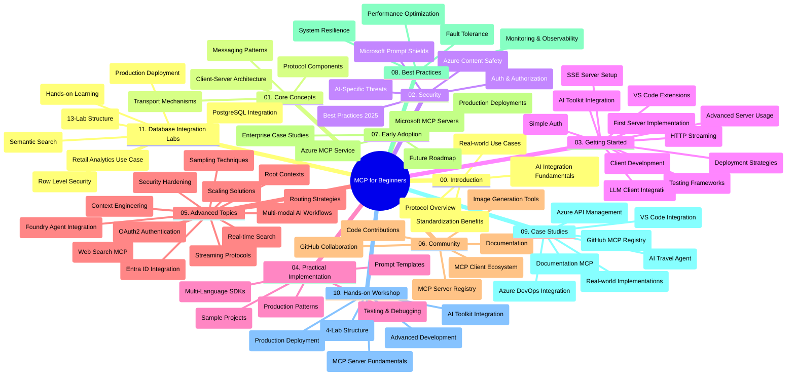

<!--
CO_OP_TRANSLATOR_METADATA:
{
  "original_hash": "af27b0acfae6caa134d9701453884df8",
  "translation_date": "2025-10-07T00:28:12+00:00",
  "source_file": "study_guide.md",
  "language_code": "lt"
}
-->
# Model Context Protocol (MCP) pradedantiesiems - mokymosi vadovas

Šis mokymosi vadovas pateikia apžvalgą apie saugyklos struktūrą ir turinį, skirtą „Model Context Protocol (MCP) pradedantiesiems“ mokymo programai. Naudokite šį vadovą, kad efektyviai naršytumėte saugyklą ir maksimaliai išnaudotumėte turimus išteklius.

## Saugyklos apžvalga

Model Context Protocol (MCP) yra standartizuota sistema, skirta sąveikai tarp AI modelių ir klientų programų. Iš pradžių sukurtas „Anthropic“, MCP dabar prižiūri platesnė MCP bendruomenė per oficialią GitHub organizaciją. Ši saugykla siūlo išsamią mokymo programą su praktiniais kodo pavyzdžiais C#, Java, JavaScript, Python ir TypeScript kalbomis, skirtą AI kūrėjams, sistemų architektams ir programinės įrangos inžinieriams.

## Vizualinis mokymo programos žemėlapis

## Saugyklos struktūra

Saugykla suskirstyta į vienuolika pagrindinių skyrių, kiekvienas iš jų apima skirtingus MCP aspektus:

1. **Įvadas (00-Introduction/)**
   - Model Context Protocol apžvalga
   - Kodėl standartizacija yra svarbi AI procesuose
   - Praktiniai naudojimo atvejai ir privalumai

2. **Pagrindinės sąvokos (01-CoreConcepts/)**
   - Kliento-serverio architektūra
   - Pagrindiniai protokolo komponentai
   - MCP žinučių perdavimo modeliai

3. **Saugumas (02-Security/)**
   - Saugumo grėsmės MCP pagrįstose sistemose
   - Geriausios praktikos saugiam įgyvendinimui
   - Autentifikavimo ir autorizacijos strategijos
   - **Išsamūs saugumo dokumentai**:
     - MCP saugumo geriausios praktikos 2025
     - Azure turinio saugumo įgyvendinimo vadovas
     - MCP saugumo kontrolės ir technikos
     - MCP geriausių praktikų greitoji nuoroda
   - **Pagrindinės saugumo temos**:
     - Prompt injection ir įrankių užnuodijimo atakos
     - Sesijos užgrobimas ir „suklaidinto pavaduotojo“ problemos
     - Tokenų perdavimo pažeidžiamumai
     - Pernelyg dideli leidimai ir prieigos kontrolė
     - Tiekimo grandinės saugumas AI komponentams
     - Microsoft Prompt Shields integracija

4. **Pradžia (03-GettingStarted/)**
   - Aplinkos nustatymas ir konfigūracija
   - Pagrindinių MCP serverių ir klientų kūrimas
   - Integracija su esamomis programomis
   - Apima skyrius:
     - Pirmasis serverio įgyvendinimas
     - Kliento kūrimas
     - LLM kliento integracija
     - VS Code integracija
     - Server-Sent Events (SSE) serveris
     - Pažangus serverio naudojimas
     - HTTP srautinė transliacija
     - AI Toolkit integracija
     - Testavimo strategijos
     - Diegimo gairės

5. **Praktinis įgyvendinimas (04-PracticalImplementation/)**
   - SDK naudojimas skirtingose programavimo kalbose
   - Derinimo, testavimo ir validavimo technikos
   - Daugkartinio naudojimo prompt šablonų ir darbo eigų kūrimas
   - Pavyzdiniai projektai su įgyvendinimo pavyzdžiais

6. **Pažangios temos (05-AdvancedTopics/)**
   - Konteksto inžinerijos technikos
   - Foundry agento integracija
   - Daugiarūšės AI darbo eigos
   - OAuth2 autentifikavimo demonstracijos
   - Realaus laiko paieškos galimybės
   - Realaus laiko srautinė transliacija
   - Pagrindinių kontekstų įgyvendinimas
   - Maršrutizavimo strategijos
   - Mėginių ėmimo technikos
   - Skalavimo metodai
   - Saugumo aspektai
   - Entra ID saugumo integracija
   - Interneto paieškos integracija

7. **Bendruomenės indėlis (06-CommunityContributions/)**
   - Kaip prisidėti prie kodo ir dokumentacijos
   - Bendradarbiavimas per GitHub
   - Bendruomenės inicijuoti patobulinimai ir atsiliepimai
   - Darbas su įvairiais MCP klientais (Claude Desktop, Cline, VSCode)
   - Darbas su populiariais MCP serveriais, įskaitant vaizdų generavimą

8. **Pamokos iš ankstyvojo pritaikymo (07-LessonsfromEarlyAdoption/)**
   - Realūs įgyvendinimai ir sėkmės istorijos
   - MCP pagrįstų sprendimų kūrimas ir diegimas
   - Tendencijos ir ateities planai
   - **Microsoft MCP serverių vadovas**: Išsamus vadovas apie 10 gamybai paruoštų Microsoft MCP serverių, įskaitant:
     - Microsoft Learn Docs MCP serverį
     - Azure MCP serverį (15+ specializuotų jungčių)
     - GitHub MCP serverį
     - Azure DevOps MCP serverį
     - MarkItDown MCP serverį
     - SQL Server MCP serverį
     - Playwright MCP serverį
     - Dev Box MCP serverį
     - Azure AI Foundry MCP serverį
     - Microsoft 365 Agents Toolkit MCP serverį

9. **Geriausios praktikos (08-BestPractices/)**
   - Našumo optimizavimas
   - Gedimams atsparių MCP sistemų projektavimas
   - Testavimo ir atsparumo strategijos

10. **Atvejų analizės (09-CaseStudy/)**
    - **Septynios išsamios atvejų analizės**, demonstruojančios MCP universalumą įvairiose situacijose:
    - **Azure AI kelionių agentai**: Daugiagentinė orkestracija su Azure OpenAI ir AI paieška
    - **Azure DevOps integracija**: Darbo procesų automatizavimas su YouTube duomenų atnaujinimais
    - **Realaus laiko dokumentacijos paieška**: Python konsolės klientas su HTTP srautinė transliacija
    - **Interaktyvus mokymosi plano generatorius**: Chainlit internetinė programa su pokalbių AI
    - **Dokumentacija redaktoriuje**: VS Code integracija su GitHub Copilot darbo eigomis
    - **Azure API valdymas**: Įmonės API integracija su MCP serverio kūrimu
    - **GitHub MCP registras**: Ekosistemos plėtra ir agentinė integracijos platforma
    - Įgyvendinimo pavyzdžiai, apimantys įmonės integraciją, kūrėjų produktyvumą ir ekosistemos plėtrą

11. **Praktinis seminaras (10-StreamliningAIWorkflowsBuildingAnMCPServerWithAIToolkit/)**
    - Išsamus praktinis seminaras, derinantis MCP su AI Toolkit
    - Intelektualių programų kūrimas, jungiant AI modelius su realaus pasaulio įrankiais
    - Praktiniai moduliai, apimantys pagrindus, individualų serverio kūrimą ir gamybos diegimo strategijas
    - **Laboratorijos struktūra**:
      - Laboratorija 1: MCP serverio pagrindai
      - Laboratorija 2: Pažangus MCP serverio kūrimas
      - Laboratorija 3: AI Toolkit integracija
      - Laboratorija 4: Gamybos diegimas ir skalavimas
    - Mokymasis laboratorijose su žingsnis po žingsnio instrukcijomis

12. **MCP serverio duomenų bazės integracijos laboratorijos (11-MCPServerHandsOnLabs/)**
    - **Išsamus 13 laboratorijų mokymosi kelias**, skirtas gamybai paruoštų MCP serverių kūrimui su PostgreSQL integracija
    - **Realus mažmeninės prekybos analizės įgyvendinimas** naudojant Zava Retail atvejį
    - **Įmonės lygio modeliai**, įskaitant Row Level Security (RLS), semantinę paiešką ir daugiabučių duomenų prieigą
    - **Pilna laboratorijų struktūra**:
      - **Laboratorijos 00-03: Pagrindai** - Įvadas, Architektūra, Saugumas, Aplinkos nustatymas
      - **Laboratorijos 04-06: MCP serverio kūrimas** - Duomenų bazės dizainas, MCP serverio įgyvendinimas, Įrankių kūrimas
      - **Laboratorijos 07-09: Pažangios funkcijos** - Semantinė paieška, Testavimas ir derinimas, VS Code integracija
      - **Laboratorijos 10-12: Gamyba ir geriausios praktikos** - Diegimas, Stebėjimas, Optimizavimas
    - **Technologijos**: FastMCP sistema, PostgreSQL, Azure OpenAI, Azure Container Apps, Application Insights
    - **Mokymosi rezultatai**: Gamybai paruošti MCP serveriai, duomenų bazės integracijos modeliai, AI pagrįsta analizė, įmonės saugumas

## Papildomi ištekliai

Saugykla apima papildomus išteklius:

- **Vaizdų aplankas**: Diagramos ir iliustracijos, naudojamos visoje mokymo programoje
- **Vertimai**: Daugiakalbė dokumentacijos palaikymas su automatizuotais vertimais
- **Oficialūs MCP ištekliai**:
  - [MCP dokumentacija](https://modelcontextprotocol.io/)
  - [MCP specifikacija](https://spec.modelcontextprotocol.io/)
  - [MCP GitHub saugykla](https://github.com/modelcontextprotocol)

## Kaip naudotis šia saugykla

1. **Nuoseklus mokymasis**: Sekite skyrius iš eilės (00–11), kad mokymasis būtų struktūruotas.
2. **Kalbai specifinis dėmesys**: Jei jus domina tam tikra programavimo kalba, peržiūrėkite pavyzdžių aplankus, kad rastumėte įgyvendinimus jūsų pasirinkta kalba.
3. **Praktinis įgyvendinimas**: Pradėkite nuo „Pradžia“ skyriaus, kad nustatytumėte aplinką ir sukurtumėte pirmąjį MCP serverį ir klientą.
4. **Pažangus tyrinėjimas**: Kai susipažinsite su pagrindais, gilinkitės į pažangias temas, kad praplėstumėte žinias.
5. **Bendruomenės įsitraukimas**: Prisijunkite prie MCP bendruomenės per GitHub diskusijas ir Discord kanalus, kad susisiektumėte su ekspertais ir kitais kūrėjais.

## MCP klientai ir įrankiai

Mokymo programa apima įvairius MCP klientus ir įrankius:

1. **Oficialūs klientai**:
   - Visual Studio Code 
   - MCP Visual Studio Code aplinkoje
   - Claude Desktop
   - Claude VSCode aplinkoje 
   - Claude API

2. **Bendruomenės klientai**:
   - Cline (terminalo pagrindu)
   - Cursor (kodo redaktorius)
   - ChatMCP
   - Windsurf

3. **MCP valdymo įrankiai**:
   - MCP CLI
   - MCP Manager
   - MCP Linker
   - MCP Router

## Populiarūs MCP serveriai

Saugykla pristato įvairius MCP serverius, įskaitant:

1. **Oficialūs Microsoft MCP serveriai**:
   - Microsoft Learn Docs MCP serveris
   - Azure MCP serveris (15+ specializuotų jungčių)
   - GitHub MCP serveris
   - Azure DevOps MCP serveris
   - MarkItDown MCP serveris
   - SQL Server MCP serveris
   - Playwright MCP serveris
   - Dev Box MCP serveris
   - Azure AI Foundry MCP serveris
   - Microsoft 365 Agents Toolkit MCP serveris

2. **Oficialūs referenciniai serveriai**:
   - Failų sistema
   - Fetch
   - Atmintis
   - Sekvencinis mąstymas

3. **Vaizdų generavimas**:
   - Azure OpenAI DALL-E 3
   - Stable Diffusion WebUI
   - Replicate

4. **Kūrimo įrankiai**:
   - Git MCP
   - Terminalo kontrolė
   - Kodo asistentas

5. **Specializuoti serveriai**:
   - Salesforce
   - Microsoft Teams
   - Jira & Confluence

## Prisidėjimas

Ši saugykla kviečia bendruomenės indėlį. Žr. skyrių „Bendruomenės indėlis“, kad sužinotumėte, kaip efektyviai prisidėti prie MCP ekosistemos.

----

*Šis mokymosi vadovas buvo atnaujintas 2025 m. spalio 6 d. ir pateikia saugyklos apžvalgą iki tos datos. Saugyklos turinys gali būti atnaujintas po šios datos.*

---

**Atsakomybės atsisakymas**:  
Šis dokumentas buvo išverstas naudojant AI vertimo paslaugą [Co-op Translator](https://github.com/Azure/co-op-translator). Nors siekiame tikslumo, prašome atkreipti dėmesį, kad automatiniai vertimai gali turėti klaidų ar netikslumų. Originalus dokumentas jo gimtąja kalba turėtų būti laikomas autoritetingu šaltiniu. Dėl svarbios informacijos rekomenduojama profesionali žmogaus vertimo paslauga. Mes neprisiimame atsakomybės už nesusipratimus ar neteisingus interpretavimus, atsiradusius naudojant šį vertimą.