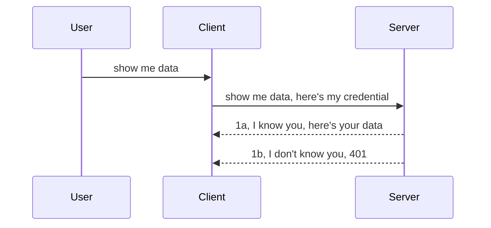

<!--
CO_OP_TRANSLATOR_METADATA:
{
  "original_hash": "5b00b8a8971a07d2d8803be4c9f138f8",
  "translation_date": "2025-10-07T00:35:30+00:00",
  "source_file": "03-GettingStarted/11-simple-auth/README.md",
  "language_code": "mo"
}
-->
# 簡單身份驗證

MCP SDK 支援使用 OAuth 2.1，這是一個相當複雜的過程，涉及身份驗證伺服器、資源伺服器、提交憑證、獲取代碼、交換代碼以獲取持有者令牌，直到最終可以獲取資源數據。如果您不熟悉 OAuth（這是一個非常值得實現的技術），建議從基本的身份驗證開始，逐步提升安全性。因此，本章的目的是幫助您逐步掌握更高級的身份驗證技術。

## 身份驗證是什麼？

身份驗證包括兩個部分：身份確認和授權。其核心思想是我們需要完成以下兩件事：

- **身份確認**：這是判斷是否允許某人進入我們的「家」，即他們是否有權訪問我們的資源伺服器，該伺服器上運行著 MCP Server 的功能。
- **授權**：這是判斷用戶是否有權訪問他們請求的特定資源，例如某些訂單或產品，或者僅允許閱讀內容但不允許刪除。

## 憑證：如何告訴系統我們是誰

大多數網頁開發者通常會想到向伺服器提供憑證，通常是一個秘密，用於表明他們是否被允許進入（身份確認）。這個憑證通常是用戶名和密碼的 base64 編碼版本，或者唯一標識特定用戶的 API 金鑰。

這通常通過名為 "Authorization" 的標頭發送，如下所示：

```json
{ "Authorization": "secret123" }
```

這通常被稱為基本身份驗證。整體流程如下：



現在我們了解了流程，那麼如何實現它呢？大多數網頁伺服器都有一個名為中介軟體的概念，這是一段在請求過程中運行的代碼，用於驗證憑證。如果憑證有效，請求可以通過；如果憑證無效，則會返回身份驗證錯誤。以下是實現方式：

**Python**

```python
class AuthMiddleware(BaseHTTPMiddleware):
    async def dispatch(self, request, call_next):

        has_header = request.headers.get("Authorization")
        if not has_header:
            print("-> Missing Authorization header!")
            return Response(status_code=401, content="Unauthorized")

        if not valid_token(has_header):
            print("-> Invalid token!")
            return Response(status_code=403, content="Forbidden")

        print("Valid token, proceeding...")
       
        response = await call_next(request)
        # add any customer headers or change in the response in some way
        return response


starlette_app.add_middleware(CustomHeaderMiddleware)
```

在這段代碼中，我們：

- 創建了一個名為 `AuthMiddleware` 的中介軟體，其 `dispatch` 方法由網頁伺服器調用。
- 將中介軟體添加到網頁伺服器：

    ```python
    starlette_app.add_middleware(AuthMiddleware)
    ```

- 編寫了驗證邏輯，檢查是否存在 Authorization 標頭以及發送的秘密是否有效：

    ```python
    has_header = request.headers.get("Authorization")
    if not has_header:
        print("-> Missing Authorization header!")
        return Response(status_code=401, content="Unauthorized")

    if not valid_token(has_header):
        print("-> Invalid token!")
        return Response(status_code=403, content="Forbidden")
    ```

    如果秘密存在且有效，我們通過調用 `call_next` 讓請求通過並返回響應。

    ```python
    response = await call_next(request)
    # add any customer headers or change in the response in some way
    return response
    ```

其工作原理是，當向伺服器發出網頁請求時，中介軟體會被調用，根據其實現，它要麼讓請求通過，要麼返回一個錯誤，表明客戶端無法繼續。

**TypeScript**

在這裡，我們使用流行的框架 Express 創建中介軟體，並在請求到達 MCP Server 之前攔截它。以下是代碼：

```typescript
function isValid(secret) {
    return secret === "secret123";
}

app.use((req, res, next) => {
    // 1. Authorization header present?  
    if(!req.headers["Authorization"]) {
        res.status(401).send('Unauthorized');
    }
    
    let token = req.headers["Authorization"];

    // 2. Check validity.
    if(!isValid(token)) {
        res.status(403).send('Forbidden');
    }

   
    console.log('Middleware executed');
    // 3. Passes request to the next step in the request pipeline.
    next();
});
```

在這段代碼中，我們：

1. 檢查是否存在 Authorization 標頭，如果沒有，則返回 401 錯誤。
2. 確保憑證/令牌有效，如果無效，則返回 403 錯誤。
3. 最終讓請求通過請求管道並返回所需的資源。

## 練習：實現身份驗證

讓我們運用所學知識來嘗試實現身份驗證。以下是計劃：

伺服器端

- 創建網頁伺服器和 MCP 實例。
- 為伺服器實現中介軟體。

客戶端

- 通過標頭發送帶有憑證的網頁請求。

### -1- 創建網頁伺服器和 MCP 實例

第一步，我們需要創建網頁伺服器實例和 MCP Server。

**Python**

在這裡，我們創建了一個 MCP Server 實例，使用 starlette 創建網頁應用並通過 uvicorn 託管。

```python
# creating MCP Server

app = FastMCP(
    name="MCP Resource Server",
    instructions="Resource Server that validates tokens via Authorization Server introspection",
    host=settings["host"],
    port=settings["port"],
    debug=True
)

# creating starlette web app
starlette_app = app.streamable_http_app()

# serving app via uvicorn
async def run(starlette_app):
    import uvicorn
    config = uvicorn.Config(
            starlette_app,
            host=app.settings.host,
            port=app.settings.port,
            log_level=app.settings.log_level.lower(),
        )
    server = uvicorn.Server(config)
    await server.serve()

run(starlette_app)
```

在這段代碼中，我們：

- 創建 MCP Server。
- 使用 MCP Server 構建 starlette 網頁應用，`app.streamable_http_app()`。
- 使用 uvicorn 託管並啟動網頁應用 `server.serve()`。

**TypeScript**

在這裡，我們創建了一個 MCP Server 實例。

```typescript
const server = new McpServer({
      name: "example-server",
      version: "1.0.0"
    });

    // ... set up server resources, tools, and prompts ...
```

此 MCP Server 創建需要在 POST /mcp 路由定義中進行，因此我們將上述代碼移動如下：

```typescript
import express from "express";
import { randomUUID } from "node:crypto";
import { McpServer } from "@modelcontextprotocol/sdk/server/mcp.js";
import { StreamableHTTPServerTransport } from "@modelcontextprotocol/sdk/server/streamableHttp.js";
import { isInitializeRequest } from "@modelcontextprotocol/sdk/types.js"

const app = express();
app.use(express.json());

// Map to store transports by session ID
const transports: { [sessionId: string]: StreamableHTTPServerTransport } = {};

// Handle POST requests for client-to-server communication
app.post('/mcp', async (req, res) => {
  // Check for existing session ID
  const sessionId = req.headers['mcp-session-id'] as string | undefined;
  let transport: StreamableHTTPServerTransport;

  if (sessionId && transports[sessionId]) {
    // Reuse existing transport
    transport = transports[sessionId];
  } else if (!sessionId && isInitializeRequest(req.body)) {
    // New initialization request
    transport = new StreamableHTTPServerTransport({
      sessionIdGenerator: () => randomUUID(),
      onsessioninitialized: (sessionId) => {
        // Store the transport by session ID
        transports[sessionId] = transport;
      },
      // DNS rebinding protection is disabled by default for backwards compatibility. If you are running this server
      // locally, make sure to set:
      // enableDnsRebindingProtection: true,
      // allowedHosts: ['127.0.0.1'],
    });

    // Clean up transport when closed
    transport.onclose = () => {
      if (transport.sessionId) {
        delete transports[transport.sessionId];
      }
    };
    const server = new McpServer({
      name: "example-server",
      version: "1.0.0"
    });

    // ... set up server resources, tools, and prompts ...

    // Connect to the MCP server
    await server.connect(transport);
  } else {
    // Invalid request
    res.status(400).json({
      jsonrpc: '2.0',
      error: {
        code: -32000,
        message: 'Bad Request: No valid session ID provided',
      },
      id: null,
    });
    return;
  }

  // Handle the request
  await transport.handleRequest(req, res, req.body);
});

// Reusable handler for GET and DELETE requests
const handleSessionRequest = async (req: express.Request, res: express.Response) => {
  const sessionId = req.headers['mcp-session-id'] as string | undefined;
  if (!sessionId || !transports[sessionId]) {
    res.status(400).send('Invalid or missing session ID');
    return;
  }
  
  const transport = transports[sessionId];
  await transport.handleRequest(req, res);
};

// Handle GET requests for server-to-client notifications via SSE
app.get('/mcp', handleSessionRequest);

// Handle DELETE requests for session termination
app.delete('/mcp', handleSessionRequest);

app.listen(3000);
```

現在您可以看到 MCP Server 創建已移動到 `app.post("/mcp")` 中。

接下來，我們將創建中介軟體以驗證傳入的憑證。

### -2- 為伺服器實現中介軟體

接下來是中介軟體部分。在這裡，我們將創建一個中介軟體，檢查 `Authorization` 標頭中的憑證並進行驗證。如果憑證可接受，請求將繼續執行其需要的操作（例如列出工具、讀取資源或客戶端請求的其他 MCP 功能）。

**Python**

要創建中介軟體，我們需要創建一個繼承自 `BaseHTTPMiddleware` 的類。這裡有兩個重要部分：

- 請求 `request`，我們從中讀取標頭信息。
- `call_next`，如果客戶端提供了我們接受的憑證，我們需要調用的回調。

首先，我們需要處理缺少 `Authorization` 標頭的情況：

```python
has_header = request.headers.get("Authorization")

# no header present, fail with 401, otherwise move on.
if not has_header:
    print("-> Missing Authorization header!")
    return Response(status_code=401, content="Unauthorized")
```

在這裡，我們發送 401 未授權消息，因為客戶端未通過身份驗證。

接下來，如果提交了憑證，我們需要檢查其有效性，如下所示：

```python
 if not valid_token(has_header):
    print("-> Invalid token!")
    return Response(status_code=403, content="Forbidden")
```

注意我們在上面發送了 403 禁止消息。以下是實現上述所有功能的完整中介軟體：

```python
class AuthMiddleware(BaseHTTPMiddleware):
    async def dispatch(self, request, call_next):

        has_header = request.headers.get("Authorization")
        if not has_header:
            print("-> Missing Authorization header!")
            return Response(status_code=401, content="Unauthorized")

        if not valid_token(has_header):
            print("-> Invalid token!")
            return Response(status_code=403, content="Forbidden")

        print("Valid token, proceeding...")
        print(f"-> Received {request.method} {request.url}")
        response = await call_next(request)
        response.headers['Custom'] = 'Example'
        return response

```

很好，但 `valid_token` 函數是什麼？以下是它的代碼：

```python
# DON'T use for production - improve it !!
def valid_token(token: str) -> bool:
    # remove the "Bearer " prefix
    if token.startswith("Bearer "):
        token = token[7:]
        return token == "secret-token"
    return False
```

這顯然需要改進。

重要提示：您絕不應該在代碼中包含這樣的秘密。理想情況下，您應該從數據源或 IDP（身份服務提供商）檢索比較值，或者更好的是，讓 IDP 進行驗證。

**TypeScript**

要使用 Express 實現此功能，我們需要調用 `use` 方法，該方法接受中介軟體函數。

我們需要：

- 與請求變量交互以檢查 `Authorization` 屬性中傳遞的憑證。
- 驗證憑證，如果有效，則讓請求繼續執行，並讓客戶端的 MCP 請求完成其應該做的事情（例如列出工具、讀取資源或其他 MCP 相關操作）。

在這裡，我們檢查是否存在 `Authorization` 標頭，如果沒有，我們阻止請求通過：

```typescript
if(!req.headers["authorization"]) {
    res.status(401).send('Unauthorized');
    return;
}
```

如果標頭根本未發送，您將收到 401。

接下來，我們檢查憑證是否有效，如果無效，我們再次阻止請求，但消息略有不同：

```typescript
if(!isValid(token)) {
    res.status(403).send('Forbidden');
    return;
} 
```

注意您現在收到的是 403 錯誤。

以下是完整代碼：

```typescript
app.use((req, res, next) => {
    console.log('Request received:', req.method, req.url, req.headers);
    console.log('Headers:', req.headers["authorization"]);
    if(!req.headers["authorization"]) {
        res.status(401).send('Unauthorized');
        return;
    }
    
    let token = req.headers["authorization"];

    if(!isValid(token)) {
        res.status(403).send('Forbidden');
        return;
    }  

    console.log('Middleware executed');
    next();
});
```

我們已設置網頁伺服器以接受中介軟體來檢查客戶端希望發送的憑證。那麼客戶端本身呢？

### -3- 通過標頭發送帶有憑證的網頁請求

我們需要確保客戶端通過標頭傳遞憑證。由於我們將使用 MCP 客戶端來完成此操作，我們需要弄清楚如何實現。

**Python**

對於客戶端，我們需要通過標頭傳遞憑證，如下所示：

```python
# DON'T hardcode the value, have it at minimum in an environment variable or a more secure storage
token = "secret-token"

async with streamablehttp_client(
        url = f"http://localhost:{port}/mcp",
        headers = {"Authorization": f"Bearer {token}"}
    ) as (
        read_stream,
        write_stream,
        session_callback,
    ):
        async with ClientSession(
            read_stream,
            write_stream
        ) as session:
            await session.initialize()
      
            # TODO, what you want done in the client, e.g list tools, call tools etc.
```

注意我們如何填充 `headers` 屬性：`headers = {"Authorization": f"Bearer {token}"}`。

**TypeScript**

我們可以通過以下兩步解決：

1. 使用憑證填充配置對象。
2. 將配置對象傳遞給傳輸層。

```typescript

// DON'T hardcode the value like shown here. At minimum have it as a env variable and use something like dotenv (in dev mode).
let token = "secret123"

// define a client transport option object
let options: StreamableHTTPClientTransportOptions = {
  sessionId: sessionId,
  requestInit: {
    headers: {
      "Authorization": "secret123"
    }
  }
};

// pass the options object to the transport
async function main() {
   const transport = new StreamableHTTPClientTransport(
      new URL(serverUrl),
      options
   );
```

在上面，您可以看到我們如何創建 `options` 對象並將標頭放置在 `requestInit` 屬性下。

重要提示：如何從這裡改進呢？目前的實現存在一些問題。首先，像這樣傳遞憑證風險很大，除非至少使用 HTTPS。即使如此，憑證仍可能被竊取，因此您需要一個系統，能夠輕鬆撤銷令牌並添加其他檢查，例如請求來自哪個地區、請求是否過於頻繁（類似機器人行為）。簡而言之，還有許多需要考慮的問題。

不過，對於非常簡單的 API，如果您不希望任何人未經身份驗證就調用您的 API，那麼我們目前的實現是一個不錯的開始。

話雖如此，讓我們嘗試通過使用標準化格式（如 JSON Web Token，簡稱 JWT 或 "JOT" 令牌）來提高安全性。

## JSON Web Token (JWT)

那麼，我們嘗試改進從傳遞非常簡單的憑證開始。採用 JWT 的直接改進是什麼？

- **安全性提升**：在基本身份驗證中，您反覆發送 base64 編碼的用戶名和密碼（或 API 金鑰），這增加了風險。使用 JWT，您發送用戶名和密碼並獲得一個令牌作為回報，並且令牌是有時間限制的，意味著它會過期。JWT 允許您輕鬆使用基於角色、範圍和權限的細粒度訪問控制。
- **無狀態性和可擴展性**：JWT 是自包含的，攜帶所有用戶信息，消除了存儲伺服器端會話存儲的需求。令牌也可以在本地驗證。
- **互操作性和聯邦性**：JWT 是 Open ID Connect 的核心，並與知名身份提供商（如 Entra ID、Google Identity 和 Auth0）一起使用。它還使得可以使用單一登錄等功能，並使其達到企業級。
- **模塊化和靈活性**：JWT 還可以與 API 閘道（如 Azure API Management、NGINX 等）一起使用。它支持用戶身份驗證場景和服務到服務通信，包括模擬和委派場景。
- **性能和緩存**：JWT 解碼後可以緩存，減少解析需求。這對於高流量應用特別有幫助，因為它提高了吞吐量並減少了基礎設施的負載。
- **高級功能**：它還支持內省（在伺服器上檢查有效性）和撤銷（使令牌無效）。

有了這些好處，讓我們看看如何將實現提升到下一個層次。

## 將基本身份驗證轉換為 JWT

我們需要進行的更改概述如下：

- **學習構建 JWT 令牌**，並使其準備好從客戶端發送到伺服器。
- **驗證 JWT 令牌**，如果有效，讓客戶端獲取資源。
- **安全的令牌存儲**，如何存儲令牌。
- **保護路由**，我們需要保護路由，在我們的情況下，需要保護路由和特定的 MCP 功能。
- **添加刷新令牌**，確保我們創建的令牌是短期有效的，但刷新令牌是長期有效的，可以用於獲取新令牌（如果它們過期）。還需要確保有刷新端點和輪換策略。

### -1- 構建 JWT 令牌

首先，JWT 令牌包含以下部分：

- **標頭**，使用的算法和令牌類型。
- **有效負載**，聲明，例如 sub（令牌代表的用戶或實體。在身份驗證場景中，這通常是用戶 ID）、exp（過期時間）、role（角色）。
- **簽名**，使用秘密或私鑰簽名。

為此，我們需要構建標頭、有效負載和編碼令牌。

**Python**

```python

import jwt
import jwt
from jwt.exceptions import ExpiredSignatureError, InvalidTokenError
import datetime

# Secret key used to sign the JWT
secret_key = 'your-secret-key'

header = {
    "alg": "HS256",
    "typ": "JWT"
}

# the user info andits claims and expiry time
payload = {
    "sub": "1234567890",               # Subject (user ID)
    "name": "User Userson",                # Custom claim
    "admin": True,                     # Custom claim
    "iat": datetime.datetime.utcnow(),# Issued at
    "exp": datetime.datetime.utcnow() + datetime.timedelta(hours=1)  # Expiry
}

# encode it
encoded_jwt = jwt.encode(payload, secret_key, algorithm="HS256", headers=header)
```

在上述代碼中，我們：

- 定義了一個標頭，使用 HS256 作為算法，類型為 JWT。
- 構建了一個有效負載，其中包含主體或用戶 ID、用戶名、角色、發出時間以及設置的過期時間，從而實現了我們之前提到的時間限制。

**TypeScript**

在這裡，我們需要一些依賴項來幫助我們構建 JWT 令牌。

依賴項

```sh

npm install jsonwebtoken
npm install --save-dev @types/jsonwebtoken
```

現在我們已經準備好，讓我們創建標頭、有效負載，並通過它創建編碼令牌。

```typescript
import jwt from 'jsonwebtoken';

const secretKey = 'your-secret-key'; // Use env vars in production

// Define the payload
const payload = {
  sub: '1234567890',
  name: 'User usersson',
  admin: true,
  iat: Math.floor(Date.now() / 1000), // Issued at
  exp: Math.floor(Date.now() / 1000) + 60 * 60 // Expires in 1 hour
};

// Define the header (optional, jsonwebtoken sets defaults)
const header = {
  alg: 'HS256',
  typ: 'JWT'
};

// Create the token
const token = jwt.sign(payload, secretKey, {
  algorithm: 'HS256',
  header: header
});

console.log('JWT:', token);
```

此令牌：

使用 HS256 簽名
有效期為 1 小時
包含聲明，例如 sub、name、admin、iat 和 exp。

### -2- 驗證令牌

我們還需要驗證令牌，這應該在伺服器端進行，以確保客戶端發送的令牌確實有效。在這裡，我們需要進行多種檢查，包括驗證其結構和有效性。建議您添加其他檢查，例如確認用戶是否在您的系統中等。

要驗證令牌，我們需要解碼它以便閱讀，然後開始檢查其有效性：

**Python**

```python

# Decode and verify the JWT
try:
    decoded = jwt.decode(token, secret_key, algorithms=["HS256"])
    print("✅ Token is valid.")
    print("Decoded claims:")
    for key, value in decoded.items():
        print(f"  {key}: {value}")
except ExpiredSignatureError:
    print("❌ Token has expired.")
except InvalidTokenError as e:
    print(f"❌ Invalid token: {e}")

```

在這段代碼中，我們使用令牌、秘密密鑰和選擇的算法作為輸入調用 `jwt.decode`。注意我們使用了 try-catch 結構，因為驗證失敗會引發錯誤。

**TypeScript**

在這裡，我們需要調用 `jwt.verify` 以獲得令牌的解碼版本，然後可以進一步分析。如果此調用失敗，則表示令牌的結構不正確或已失效。

```typescript

try {
  const decoded = jwt.verify(token, secretKey);
  console.log('Decoded Payload:', decoded);
} catch (err) {
  console.error('Token verification failed:', err);
}
```

注意：如前所述，我們應該執行其他檢查，以確保此令牌指向我們系統中的用戶，並確保用戶擁有其聲稱的權限。
接下來，我們來探討基於角色的存取控制（Role Based Access Control，簡稱 RBAC）。

## 新增基於角色的存取控制

這個概念是要表達不同角色擁有不同的權限。例如，我們假設管理員（admin）可以執行所有操作，普通使用者（normal user）可以進行讀寫操作，而訪客（guest）只能進行讀取操作。因此，以下是一些可能的權限層級：

- Admin.Write 
- User.Read
- Guest.Read

接下來，我們看看如何使用中介軟體（middleware）來實現這種控制。中介軟體可以針對特定路由添加，也可以針對所有路由添加。

**Python**

```python
from starlette.middleware.base import BaseHTTPMiddleware
from starlette.responses import JSONResponse
import jwt

# DON'T have the secret in the code like, this is for demonstration purposes only. Read it from a safe place.
SECRET_KEY = "your-secret-key" # put this in env variable
REQUIRED_PERMISSION = "User.Read"

class JWTPermissionMiddleware(BaseHTTPMiddleware):
    async def dispatch(self, request, call_next):
        auth_header = request.headers.get("Authorization")
        if not auth_header or not auth_header.startswith("Bearer "):
            return JSONResponse({"error": "Missing or invalid Authorization header"}, status_code=401)

        token = auth_header.split(" ")[1]
        try:
            decoded = jwt.decode(token, SECRET_KEY, algorithms=["HS256"])
        except jwt.ExpiredSignatureError:
            return JSONResponse({"error": "Token expired"}, status_code=401)
        except jwt.InvalidTokenError:
            return JSONResponse({"error": "Invalid token"}, status_code=401)

        permissions = decoded.get("permissions", [])
        if REQUIRED_PERMISSION not in permissions:
            return JSONResponse({"error": "Permission denied"}, status_code=403)

        request.state.user = decoded
        return await call_next(request)


```

有幾種不同的方法可以像下面這樣添加中介軟體：

```python

# Alt 1: add middleware while constructing starlette app
middleware = [
    Middleware(JWTPermissionMiddleware)
]

app = Starlette(routes=routes, middleware=middleware)

# Alt 2: add middleware after starlette app is a already constructed
starlette_app.add_middleware(JWTPermissionMiddleware)

# Alt 3: add middleware per route
routes = [
    Route(
        "/mcp",
        endpoint=..., # handler
        middleware=[Middleware(JWTPermissionMiddleware)]
    )
]
```

**TypeScript**

我們可以使用 `app.use` 和一個中介軟體，該中介軟體會針對所有請求執行。

```typescript
app.use((req, res, next) => {
    console.log('Request received:', req.method, req.url, req.headers);
    console.log('Headers:', req.headers["authorization"]);

    // 1. Check if authorization header has been sent

    if(!req.headers["authorization"]) {
        res.status(401).send('Unauthorized');
        return;
    }
    
    let token = req.headers["authorization"];

    // 2. Check if token is valid
    if(!isValid(token)) {
        res.status(403).send('Forbidden');
        return;
    }  

    // 3. Check if token user exist in our system
    if(!isExistingUser(token)) {
        res.status(403).send('Forbidden');
        console.log("User does not exist");
        return;
    }
    console.log("User exists");

    // 4. Verify the token has the right permissions
    if(!hasScopes(token, ["User.Read"])){
        res.status(403).send('Forbidden - insufficient scopes');
    }

    console.log("User has required scopes");

    console.log('Middleware executed');
    next();
});

```

中介軟體可以執行許多操作，而它應該執行的主要操作包括：

1. 檢查是否存在授權標頭（authorization header）
2. 檢查令牌是否有效，我們會調用 `isValid` 方法，這是我們編寫的一個方法，用於檢查 JWT 令牌的完整性和有效性。
3. 驗證使用者是否存在於我們的系統中，我們應該進行此檢查。

   ```typescript
    // users in DB
   const users = [
     "user1",
     "User usersson",
   ]

   function isExistingUser(token) {
     let decodedToken = verifyToken(token);

     // TODO, check if user exists in DB
     return users.includes(decodedToken?.name || "");
   }
   ```

   上面，我們建立了一個非常簡單的 `users` 列表，顯然這應該存儲在資料庫中。

4. 此外，我們還應該檢查令牌是否具有正確的權限。

   ```typescript
   if(!hasScopes(token, ["User.Read"])){
        res.status(403).send('Forbidden - insufficient scopes');
   }
   ```

   在上述中介軟體的程式碼中，我們檢查令牌是否包含 User.Read 權限，如果沒有，我們會返回 403 錯誤。以下是 `hasScopes` 的輔助方法。

   ```typescript
   function hasScopes(scope: string, requiredScopes: string[]) {
     let decodedToken = verifyToken(scope);
    return requiredScopes.every(scope => decodedToken?.scopes.includes(scope));
  }
   ```

Have a think which additional checks you should be doing, but these are the absolute minimum of checks you should be doing.

Using Express as a web framework is a common choice. There are helpers library when you use JWT so you can write less code.

- `express-jwt`, helper library that provides a middleware that helps decode your token.
- `express-jwt-permissions`, this provides a middleware `guard` that helps check if a certain permission is on the token.

Here's what these libraries can look like when used:

```typescript
const express = require('express');
const jwt = require('express-jwt');
const guard = require('express-jwt-permissions')();

const app = express();
const secretKey = 'your-secret-key'; // put this in env variable

// Decode JWT and attach to req.user
app.use(jwt({ secret: secretKey, algorithms: ['HS256'] }));

// Check for User.Read permission
app.use(guard.check('User.Read'));

// multiple permissions
// app.use(guard.check(['User.Read', 'Admin.Access']));

app.get('/protected', (req, res) => {
  res.json({ message: `Welcome ${req.user.name}` });
});

// Error handler
app.use((err, req, res, next) => {
  if (err.code === 'permission_denied') {
    return res.status(403).send('Forbidden');
  }
  next(err);
});

```

現在您已經了解了如何使用中介軟體進行身份驗證和授權，那麼 MCP 呢？它是否改變了我們進行身份驗證的方式？讓我們在下一節中找出答案。

### -3- 將 RBAC 添加到 MCP

到目前為止，您已經了解如何通過中介軟體添加 RBAC。然而，對於 MCP，並沒有簡單的方法可以針對每個 MCP 功能添加 RBAC，那麼我們該怎麼辦？我們只能像下面這樣添加程式碼，檢查客戶端是否有權調用特定工具：

您有幾種不同的選擇來實現針對功能的 RBAC，以下是一些方法：

- 為每個工具、資源或提示添加檢查，以確保權限層級。

   **Python**

   ```python
   @tool()
   def delete_product(id: int):
      try:
          check_permissions(role="Admin.Write", request)
      catch:
        pass # client failed authorization, raise authorization error
   ```

   **TypeScript**

   ```typescript
   server.registerTool(
    "delete-product",
    {
      title: Delete a product",
      description: "Deletes a product",
      inputSchema: { id: z.number() }
    },
    async ({ id }) => {
      
      try {
        checkPermissions("Admin.Write", request);
        // todo, send id to productService and remote entry
      } catch(Exception e) {
        console.log("Authorization error, you're not allowed");  
      }

      return {
        content: [{ type: "text", text: `Deletected product with id ${id}` }]
      };
    }
   );
   ```


- 使用進階的伺服器方法和請求處理器，以減少需要進行檢查的地方。

   **Python**

   ```python
   
   tool_permission = {
      "create_product": ["User.Write", "Admin.Write"],
      "delete_product": ["Admin.Write"]
   }

   def has_permission(user_permissions, required_permissions) -> bool:
      # user_permissions: list of permissions the user has
      # required_permissions: list of permissions required for the tool
      return any(perm in user_permissions for perm in required_permissions)

   @server.call_tool()
   async def handle_call_tool(
     name: str, arguments: dict[str, str] | None
   ) -> list[types.TextContent]:
    # Assume request.user.permissions is a list of permissions for the user
     user_permissions = request.user.permissions
     required_permissions = tool_permission.get(name, [])
     if not has_permission(user_permissions, required_permissions):
        # Raise error "You don't have permission to call tool {name}"
        raise Exception(f"You don't have permission to call tool {name}")
     # carry on and call tool
     # ...
   ```   
   

   **TypeScript**

   ```typescript
   function hasPermission(userPermissions: string[], requiredPermissions: string[]): boolean {
       if (!Array.isArray(userPermissions) || !Array.isArray(requiredPermissions)) return false;
       // Return true if user has at least one required permission
       
       return requiredPermissions.some(perm => userPermissions.includes(perm));
   }
  
   server.setRequestHandler(CallToolRequestSchema, async (request) => {
      const { params: { name } } = request;
  
      let permissions = request.user.permissions;
  
      if (!hasPermission(permissions, toolPermissions[name])) {
         return new Error(`You don't have permission to call ${name}`);
      }
  
      // carry on..
   });
   ```

   注意，您需要確保您的中介軟體將解碼後的令牌分配到請求的 user 屬性中，這樣上述程式碼才能簡化。

### 總結

現在我們已經討論了如何添加對 RBAC 的支援，以及如何特別針對 MCP 添加支援，接下來是您自己嘗試實現安全性，以確保您理解了所介紹的概念。

## 作業 1：使用基本身份驗證建立 MCP 伺服器和 MCP 客戶端

在這裡，您將運用所學的知識，通過標頭傳遞憑證。

## 解決方案 1

[解決方案 1](./code/basic/README.md)

## 作業 2：將作業 1 的解決方案升級為使用 JWT

以第一個解決方案為基礎，但這次我們進行改進。

改用 JWT，而不是使用基本身份驗證。

## 解決方案 2

[解決方案 2](./solution/jwt-solution/README.md)

## 挑戰

針對工具添加我們在「將 RBAC 添加到 MCP」一節中描述的 RBAC。

## 總結

希望您在本章中學到了很多內容，從完全沒有安全性，到基本安全性，再到 JWT 以及如何將其添加到 MCP。

我們已經建立了一個基於自訂 JWT 的穩固基礎，但隨著系統的擴展，我們正逐步轉向基於標準的身份模型。採用像 Entra 或 Keycloak 這樣的身份提供者（IdP），可以將令牌的發行、驗證和生命週期管理交給可信的平台處理，讓我們能專注於應用程式邏輯和使用者體驗。

為此，我們有一個更[進階的章節關於 Entra](../../05-AdvancedTopics/mcp-security-entra/README.md)。

---

**免責聲明**：  
本文件已使用 AI 翻譯服務 [Co-op Translator](https://github.com/Azure/co-op-translator) 進行翻譯。儘管我們致力於提供準確的翻譯，請注意自動翻譯可能包含錯誤或不準確之處。原始文件的母語版本應被視為權威來源。對於關鍵資訊，建議使用專業人工翻譯。我們對因使用此翻譯而引起的任何誤解或誤釋不承擔責任。